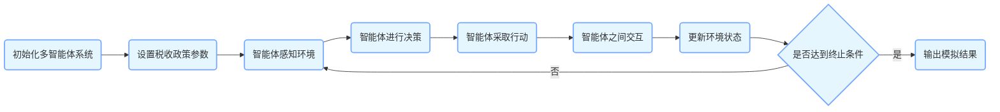

# 利用多智能体系统模拟不同税收政策：评估政策影响

> 关键词：多智能体系统、税收政策模拟、政策评估、经济建模、智能体交互、仿真实验、政策影响分析

> 摘要：本文聚焦于利用多智能体系统（MAS）模拟不同税收政策并评估其影响。多智能体系统为复杂经济系统的建模提供了强大工具，通过模拟不同类型智能体的行为和交互，能够更真实地反映税收政策在实际经济环境中的作用。文章详细阐述了多智能体系统的核心概念、相关算法原理、数学模型，通过项目实战展示如何运用该系统进行税收政策模拟，并分析了实际应用场景。最后，推荐了相关的学习资源、开发工具和研究论文，总结了未来发展趋势与挑战，为研究税收政策影响提供了全面而深入的技术指导。

## 1. 背景介绍 
### 1.1 目的和范围
税收政策是政府调控经济的重要手段之一，其制定和实施对经济增长、收入分配、社会公平等方面都有着深远的影响。传统的税收政策评估方法往往基于宏观经济模型，这些模型虽然能够提供一些总体性的分析，但往往忽略了个体行为的多样性和复杂性。多智能体系统作为一种新兴的建模方法，能够模拟大量具有不同特征和行为规则的智能体之间的交互，从而更全面地反映税收政策在微观层面的影响。

本文的目的是介绍如何利用多智能体系统模拟不同的税收政策，并对其影响进行评估。范围涵盖了多智能体系统的基本概念、核心算法、数学模型、项目实战以及实际应用场景等方面，旨在为研究人员和政策制定者提供一种新的视角和方法来评估税收政策的效果。

### 1.2 预期读者
本文预期读者包括但不限于以下几类人员：
- **研究人员**：对多智能体系统、计算经济学、政策评估等领域感兴趣的科研人员，希望通过本文了解如何利用多智能体系统进行税收政策模拟和评估。
- **政策制定者**：政府部门中负责税收政策制定和评估的工作人员，希望借助多智能体系统的模拟结果，更科学地制定和调整税收政策。
- **学生**：计算机科学、经济学、管理学等相关专业的学生，希望通过本文学习多智能体系统的基本原理和应用，拓宽自己的知识面。
- **开发者**：对多智能体系统开发和应用感兴趣的程序员和软件工程师，希望从本文中获取相关的技术实现细节和开发经验。

### 1.3 文档结构概述
本文将按照以下结构进行组织：
- **核心概念与联系**：介绍多智能体系统的基本概念、组成部分以及与税收政策模拟的联系，通过文本示意图和 Mermaid 流程图进行详细说明。
- **核心算法原理 & 具体操作步骤**：阐述多智能体系统中常用的算法原理，并使用 Python 源代码详细讲解具体的操作步骤。
- **数学模型和公式 & 详细讲解 & 举例说明**：介绍多智能体系统中涉及的数学模型和公式，并通过具体的例子进行详细讲解。
- **项目实战：代码实际案例和详细解释说明**：通过一个具体的项目实例，展示如何利用多智能体系统模拟不同的税收政策，并对其影响进行评估，包括开发环境搭建、源代码详细实现和代码解读。
- **实际应用场景**：介绍多智能体系统在税收政策模拟和评估中的实际应用场景。
- **工具和资源推荐**：推荐相关的学习资源、开发工具和研究论文，帮助读者进一步深入学习和研究。
- **总结：未来发展趋势与挑战**：总结多智能体系统在税收政策模拟和评估中的应用现状，分析未来的发展趋势和面临的挑战。
- **附录：常见问题与解答**：解答读者在阅读本文过程中可能遇到的常见问题。
- **扩展阅读 & 参考资料**：提供相关的扩展阅读材料和参考资料，方便读者进一步深入学习和研究。

### 1.4 术语表
#### 1.4.1 核心术语定义
- **多智能体系统（Multi - Agent System，MAS）**：由多个智能体组成的系统，这些智能体能够感知环境、进行决策并采取行动，通过相互之间的交互来实现系统的整体目标。
- **智能体（Agent）**：具有一定的自主性、反应性、社会性和主动性的实体，能够在一定的环境中感知信息，并根据自身的目标和规则进行决策和行动。
- **税收政策（Tax Policy）**：政府为了实现一定的经济和社会目标，通过税收制度和税收征管等手段对经济活动进行调节的政策措施。
- **政策评估（Policy Evaluation）**：对政策的制定、实施过程和效果进行全面、系统的分析和评价，以判断政策的合理性、有效性和可行性。
- **仿真实验（Simulation Experiment）**：利用计算机模拟技术对实际系统进行建模和实验，以研究系统的行为和性能。

#### 1.4.2 相关概念解释
- **微观经济行为**：指个体经济单位（如家庭、企业等）的经济决策和行为，包括消费、生产、投资等方面。
- **宏观经济效应**：指宏观经济变量（如经济增长、通货膨胀、就业等）在政策影响下的变化情况。
- **行为规则**：智能体在决策和行动时遵循的规则，这些规则可以是基于经验、学习或优化算法得到的。
- **交互机制**：智能体之间进行信息交流和协作的方式，包括直接通信、间接通信、竞争、合作等。

#### 1.4.3 缩略词列表
- **MAS**：Multi - Agent System（多智能体系统）
- **GDP**：Gross Domestic Product（国内生产总值）
- **CPI**：Consumer Price Index（消费者物价指数）

## 2. 核心概念与联系 

### 多智能体系统的基本概念
多智能体系统是一种分布式人工智能系统，由多个智能体组成。每个智能体都具有一定的自主性和智能性，能够在一定的环境中感知信息、进行决策并采取行动。智能体之间通过交互机制进行信息交流和协作，以实现系统的整体目标。

多智能体系统的组成部分主要包括智能体、环境和交互机制。智能体是系统的核心，它可以是物理实体（如机器人）或虚拟实体（如软件程序）。环境是智能体所处的外部世界，它为智能体提供了感知信息的来源和行动的空间。交互机制是智能体之间进行信息交流和协作的方式，它决定了智能体之间的通信和协调模式。

### 多智能体系统与税收政策模拟的联系
在税收政策模拟中，多智能体系统可以用来模拟不同类型的经济主体（如家庭、企业等）的行为和交互。每个经济主体可以被看作是一个智能体，它们具有不同的特征和行为规则，如收入水平、消费偏好、生产技术等。通过模拟这些智能体之间的交互，我们可以观察到税收政策在微观层面的影响，如对家庭消费和储蓄行为的影响、对企业生产和投资决策的影响等。

同时，多智能体系统还可以考虑到经济主体之间的异质性和相互作用，从而更真实地反映税收政策在实际经济环境中的作用。例如，不同收入水平的家庭对税收政策的反应可能不同，企业之间的竞争和合作关系也会影响税收政策的效果。通过多智能体系统的模拟，我们可以综合考虑这些因素，对税收政策的影响进行更全面、深入的评估。

### 文本示意图
多智能体系统模拟税收政策的基本框架可以用以下文本示意图表示：

```plaintext
+-------------------+
| 多智能体系统      |
| +---------------+ |
| | 智能体集合    | |
| | +-----------+ | |
| | | 家庭智能体 | | |
| | +-----------+ | |
| | +-----------+ | |
| | | 企业智能体 | | |
| | +-----------+ | |
| +---------------+ |
| +---------------+ |
| | 环境模型      | |
| +---------------+ |
| +---------------+ |
| | 交互机制      | |
| +---------------+ |
+-------------------+
| 税收政策输入    |
+-------------------+
| 模拟结果输出    |
+-------------------+
```

### Mermaid 流程图


## 3. 核心算法原理 & 具体操作步骤 

### 核心算法原理
在多智能体系统中，常用的算法包括智能体决策算法、交互算法和环境更新算法。

#### 智能体决策算法
智能体决策算法用于智能体根据自身的目标和感知到的环境信息进行决策。常见的决策算法包括基于规则的决策算法、基于效用的决策算法和基于学习的决策算法。

- **基于规则的决策算法**：智能体根据预先定义的规则进行决策。例如，家庭智能体在决定消费和储蓄时，可以根据收入水平和税收政策的规则来进行决策。
- **基于效用的决策算法**：智能体通过计算不同行动的效用值，选择效用值最大的行动。例如，企业智能体在决定生产和投资时，可以通过计算不同生产和投资方案的利润来进行决策。
- **基于学习的决策算法**：智能体通过学习来优化自己的决策策略。例如，智能体可以使用强化学习算法来学习如何在不同的环境中做出最优决策。

#### 交互算法
交互算法用于智能体之间的信息交流和协作。常见的交互算法包括直接通信算法、间接通信算法和合作竞争算法。

- **直接通信算法**：智能体之间通过直接发送消息来进行信息交流。例如，企业智能体可以向其他企业智能体发送合作请求。
- **间接通信算法**：智能体之间通过环境中的公共信息来进行信息交流。例如，家庭智能体可以通过观察市场价格来了解商品的供求情况。
- **合作竞争算法**：智能体之间根据合作和竞争的关系进行协作。例如，企业智能体之间可以进行合作研发，也可以进行市场竞争。

#### 环境更新算法
环境更新算法用于根据智能体的行动更新环境状态。例如，当家庭智能体进行消费时，市场上的商品数量会减少；当企业智能体进行生产时，市场上的商品数量会增加。

### 具体操作步骤
以下是使用 Python 实现一个简单的多智能体系统模拟税收政策的具体操作步骤：

```python
import random

# 定义家庭智能体类
class HouseholdAgent:
    def __init__(self, income):
        self.income = income
        self.savings = 0

    def decision(self, tax_rate):
        # 计算税后收入
        after_tax_income = self.income * (1 - tax_rate)
        # 简单的消费和储蓄决策，假设消费 80%，储蓄 20%
        consumption = after_tax_income * 0.8
        self.savings += after_tax_income * 0.2
        return consumption

# 定义企业智能体类
class EnterpriseAgent:
    def __init__(self, production_cost, price):
        self.production_cost = production_cost
        self.price = price
        self.production_volume = 0

    def decision(self, demand):
        # 简单的生产决策，根据需求调整生产规模
        if demand > self.production_volume:
            self.production_volume += 10
        elif demand < self.production_volume:
            self.production_volume -= 10
        return self.production_volume

# 定义环境类
class Environment:
    def __init__(self):
        self.households = [HouseholdAgent(random.randint(1000, 5000)) for _ in range(10)]
        self.enterprises = [EnterpriseAgent(random.randint(100, 500), random.randint(500, 1000)) for _ in range(5)]
        self.tax_rate = 0.2

    def run_simulation(self, steps):
        for step in range(steps):
            # 家庭智能体决策
            total_consumption = 0
            for household in self.households:
                consumption = household.decision(self.tax_rate)
                total_consumption += consumption

            # 企业智能体决策
            for enterprise in self.enterprises:
                enterprise.decision(total_consumption)

            # 输出当前步骤的信息
            print(f"Step {step}: Total Consumption = {total_consumption}")

# 主程序
if __name__ == "__main__":
    env = Environment()
    env.run_simulation(10)
```

### 代码解释
- **家庭智能体类（HouseholdAgent）**：每个家庭智能体有一个初始收入和储蓄。在决策时，根据税收政策计算税后收入，然后按照一定的比例进行消费和储蓄。
- **企业智能体类（EnterpriseAgent）**：每个企业智能体有一个生产成本和价格，以及一个生产规模。在决策时，根据市场需求调整生产规模。
- **环境类（Environment）**：环境类包含多个家庭智能体和企业智能体，以及一个税收政策参数。在模拟过程中，每个步骤先让家庭智能体进行决策，计算总消费，然后让企业智能体根据总消费进行决策。
- **主程序**：创建一个环境对象，运行 10 个步骤的模拟，并输出每个步骤的总消费信息。

## 4. 数学模型和公式 & 详细讲解 & 举例说明 

### 家庭智能体的决策模型
家庭智能体的决策模型可以用以下公式表示：

$$Y_{after - tax} = Y_{before - tax} \times (1 - t)$$

其中，$Y_{after - tax}$ 表示税后收入，$Y_{before - tax}$ 表示税前收入，$t$ 表示税收税率。

家庭智能体的消费和储蓄决策可以用以下公式表示：

$$C = \alpha \times Y_{after - tax}$$

$$S = (1 - \alpha) \times Y_{after - tax}$$

其中，$C$ 表示消费，$S$ 表示储蓄，$\alpha$ 表示消费倾向，$0 < \alpha < 1$。

### 企业智能体的决策模型
企业智能体的生产决策可以用以下公式表示：

$$Q_{t + 1} = Q_t + \beta \times (D - Q_t)$$

其中，$Q_{t + 1}$ 表示下一期的生产规模，$Q_t$ 表示当前期的生产规模，$D$ 表示市场需求，$\beta$ 表示调整系数，$0 < \beta < 1$。

### 举例说明
假设一个家庭智能体的税前收入为 $Y_{before - tax} = 5000$，税收税率为 $t = 0.2$，消费倾向为 $\alpha = 0.8$。则税后收入为：

$$Y_{after - tax} = 5000 \times (1 - 0.2) = 4000$$

消费为：

$$C = 0.8 \times 4000 = 3200$$

储蓄为：

$$S = (1 - 0.8) \times 4000 = 800$$

假设一个企业智能体的当前生产规模为 $Q_t = 100$，市场需求为 $D = 150$，调整系数为 $\beta = 0.5$。则下一期的生产规模为：

$$Q_{t + 1} = 100 + 0.5 \times (150 - 100) = 125$$

## 5. 项目实战：代码实际案例和详细解释说明 

### 5.1  开发环境搭建
#### 操作系统
可以选择 Windows、Linux 或 macOS 操作系统。

#### 编程语言
使用 Python 3.x 版本，建议使用 Python 3.7 及以上版本。

#### 开发工具
可以使用以下开发工具：
- **PyCharm**：一款功能强大的 Python 集成开发环境（IDE），提供代码编辑、调试、版本控制等功能。
- **Jupyter Notebook**：一个交互式的开发环境，适合进行数据分析和模型实验。

#### 安装依赖库
在项目中，我们主要使用 Python 的内置库，不需要额外安装其他依赖库。

### 5.2  源代码详细实现和代码解读
以下是一个更完整的多智能体系统模拟不同税收政策的源代码：

```python
import random
import matplotlib.pyplot as plt

# 定义家庭智能体类
class HouseholdAgent:
    def __init__(self, income, consumption_propensity):
        self.income = income
        self.consumption_propensity = consumption_propensity
        self.savings = 0

    def decision(self, tax_rate):
        # 计算税后收入
        after_tax_income = self.income * (1 - tax_rate)
        # 消费和储蓄决策
        consumption = after_tax_income * self.consumption_propensity
        self.savings += after_tax_income * (1 - self.consumption_propensity)
        return consumption

# 定义企业智能体类
class EnterpriseAgent:
    def __init__(self, production_cost, price, production_volume):
        self.production_cost = production_cost
        self.price = price
        self.production_volume = production_volume
        self.profit = 0

    def decision(self, demand):
        # 计算产量调整
        if demand > self.production_volume:
            self.production_volume += 10
        elif demand < self.production_volume:
            self.production_volume -= 10
        # 计算利润
        self.profit = (self.price - self.production_cost) * self.production_volume
        return self.production_volume

# 定义环境类
class Environment:
    def __init__(self, num_households, num_enterprises, tax_rate):
        self.households = [HouseholdAgent(random.randint(1000, 5000), random.uniform(0.6, 0.9)) for _ in range(num_households)]
        self.enterprises = [EnterpriseAgent(random.randint(100, 500), random.randint(500, 1000), random.randint(50, 200)) for _ in range(num_enterprises)]
        self.tax_rate = tax_rate
        self.total_consumption_history = []
        self.total_production_history = []

    def run_simulation(self, steps):
        for step in range(steps):
            # 家庭智能体决策
            total_consumption = 0
            for household in self.households:
                consumption = household.decision(self.tax_rate)
                total_consumption += consumption

            # 企业智能体决策
            total_production = 0
            for enterprise in self.enterprises:
                production = enterprise.decision(total_consumption)
                total_production += production

            # 记录历史数据
            self.total_consumption_history.append(total_consumption)
            self.total_production_history.append(total_production)

            # 输出当前步骤的信息
            print(f"Step {step}: Total Consumption = {total_consumption}, Total Production = {total_production}")

    def plot_results(self):
        plt.figure(figsize=(10, 6))
        plt.plot(self.total_consumption_history, label='Total Consumption')
        plt.plot(self.total_production_history, label='Total Production')
        plt.xlabel('Step')
        plt.ylabel('Amount')
        plt.title('Simulation Results')
        plt.legend()
        plt.show()

# 主程序
if __name__ == "__main__":
    # 不同的税收政策
    tax_rates = [0.1, 0.2, 0.3]
    for tax_rate in tax_rates:
        print(f"Simulating with tax rate = {tax_rate}")
        env = Environment(num_households=20, num_enterprises=10, tax_rate=tax_rate)
        env.run_simulation(20)
        env.plot_results()
```

### 5.3  代码解读与分析
- **家庭智能体类（HouseholdAgent）**：
  - `__init__` 方法：初始化家庭智能体的收入、消费倾向和储蓄。
  - `decision` 方法：根据税收政策计算税后收入，然后根据消费倾向进行消费和储蓄决策。

- **企业智能体类（EnterpriseAgent）**：
  - `__init__` 方法：初始化企业智能体的生产成本、价格、生产规模和利润。
  - `decision` 方法：根据市场需求调整生产规模，并计算利润。

- **环境类（Environment）**：
  - `__init__` 方法：初始化环境中的家庭智能体、企业智能体、税收政策参数以及历史数据记录列表。
  - `run_simulation` 方法：运行模拟过程，每个步骤先让家庭智能体进行决策，计算总消费，然后让企业智能体根据总消费进行决策，记录总消费和总生产的历史数据，并输出当前步骤的信息。
  - `plot_results` 方法：绘制总消费和总生产的历史数据曲线，直观展示模拟结果。

- **主程序**：
  - 定义不同的税收政策，分别进行模拟。
  - 对于每个税收政策，创建一个环境对象，运行 20 个步骤的模拟，并绘制模拟结果曲线。

通过分析不同税收政策下的模拟结果曲线，我们可以评估税收政策对消费和生产的影响。例如，如果税收税率较高，可能会导致家庭可支配收入减少，从而降低消费，企业的生产规模也可能随之下降。

## 6. 实际应用场景 
### 政策制定与评估
多智能体系统可以为政策制定者提供一个实验平台，通过模拟不同的税收政策，评估其对经济增长、收入分配、社会公平等方面的影响。政策制定者可以根据模拟结果，选择最优的税收政策方案，提高政策的科学性和有效性。

### 经济预测与分析
利用多智能体系统模拟税收政策的影响，可以对未来的经济发展趋势进行预测和分析。例如，预测不同税收政策下的 GDP 增长、通货膨胀率、失业率等宏观经济指标的变化情况，为政府和企业提供决策参考。

### 教学与研究
多智能体系统可以作为一种教学工具，帮助学生更好地理解税收政策的作用机制和经济系统的复杂性。同时，研究人员可以利用多智能体系统开展相关的研究工作，探索税收政策与经济行为之间的内在联系，推动计算经济学等领域的发展。

### 企业决策支持
企业可以利用多智能体系统模拟不同税收政策对自身生产、销售、利润等方面的影响，从而制定更加合理的生产和投资决策。例如，在税收政策调整时，企业可以通过模拟预测市场需求的变化，提前调整生产规模和产品结构。

## 7. 工具和资源推荐
### 7.1 学习资源推荐
#### 7.1.1 书籍推荐
- 《多智能体系统：原理与编程》：全面介绍了多智能体系统的基本原理、算法和编程实现，适合初学者和有一定基础的读者。
- 《计算经济学》：介绍了计算经济学的基本概念、方法和应用，包括多智能体系统在经济建模中的应用，对于理解多智能体系统在税收政策模拟中的应用有很大帮助。
- 《Python 数据分析实战》：介绍了 Python 在数据分析和建模中的应用，对于使用 Python 实现多智能体系统模拟税收政策有很大的参考价值。

#### 7.1.2 在线课程
- Coursera 上的“Multi - Agent Systems”课程：由国际知名学者授课，系统地介绍了多智能体系统的理论和应用。
- edX 上的“Computational Economics”课程：介绍了计算经济学的基本概念和方法，包括多智能体系统在经济建模中的应用。
- 中国大学 MOOC 上的“Python 程序设计”课程：适合初学者学习 Python 编程语言，为实现多智能体系统模拟税收政策打下基础。

#### 7.1.3 技术博客和网站
- Agent - Based Modeling and Simulation (ABMS) 网站：提供了多智能体系统建模和仿真的相关资源和研究成果。
- Towards Data Science 博客：有很多关于数据分析、机器学习和多智能体系统的技术文章，对于学习多智能体系统模拟税收政策有很大的启发。
- 博客园：有很多程序员分享的关于 Python 编程和多智能体系统开发的经验和案例。

### 7.2 开发工具框架推荐
#### 7.2.1 IDE和编辑器
- PyCharm：功能强大的 Python 集成开发环境，提供代码编辑、调试、版本控制等功能，适合大规模项目的开发。
- Jupyter Notebook：交互式的开发环境，适合进行数据分析和模型实验，方便代码的展示和分享。
- Visual Studio Code：轻量级的代码编辑器，支持多种编程语言，安装相关插件后可以进行 Python 开发。

#### 7.2.2 调试和性能分析工具
- pdb：Python 内置的调试工具，可以帮助开发者定位代码中的问题。
- cProfile：Python 内置的性能分析工具，可以分析代码的运行时间和函数调用情况，帮助开发者优化代码性能。
- Py-Spy：一个轻量级的性能分析工具，可以实时监控 Python 程序的性能，找出性能瓶颈。

#### 7.2.3 相关框架和库
- Mesa：一个基于 Python 的多智能体系统建模框架，提供了丰富的智能体和环境类，方便开发者快速搭建多智能体系统模型。
- NumPy：Python 的科学计算库，提供了高效的数组操作和数学函数，对于实现多智能体系统中的数值计算非常有用。
- Matplotlib：Python 的绘图库，用于绘制模拟结果的可视化图表，帮助开发者直观地分析模拟结果。

### 7.3 相关论文著作推荐
#### 7.3.1 经典论文
- "An Introduction to Multi - Agent Systems"：多智能体系统领域的经典论文，系统地介绍了多智能体系统的基本概念、理论和应用。
- "Agent - Based Computational Economics: A Constructive Approach to Economic Theory"：介绍了基于智能体的计算经济学的基本概念和方法，对于理解多智能体系统在经济建模中的应用有重要意义。
- "Simulating the Effects of Tax Policy on Economic Behavior Using Agent - Based Models"：研究了如何使用多智能体系统模拟税收政策对经济行为的影响，为本文的研究提供了重要的参考。

#### 7.3.2 最新研究成果
- 可以通过 IEEE Xplore、ACM Digital Library、ScienceDirect 等学术数据库搜索多智能体系统和税收政策模拟相关的最新研究论文，了解该领域的最新研究动态和成果。

#### 7.3.3 应用案例分析
- 一些政府部门和研究机构会发布关于税收政策评估和多智能体系统应用的案例报告，可以通过相关政府网站和研究机构的官方网站获取这些案例分析，学习实际应用中的经验和方法。

## 8. 总结：未来发展趋势与挑战
### 未来发展趋势
- **与其他技术的融合**：多智能体系统将与大数据、人工智能、区块链等技术深度融合，提高模拟的准确性和可靠性。例如，利用大数据技术获取更丰富的经济数据，利用人工智能技术优化智能体的决策算法，利用区块链技术保证数据的安全性和可信度。
- **更加复杂的模型构建**：未来的多智能体系统将构建更加复杂的模型，考虑更多的因素和变量，如社会网络、文化差异、制度环境等，以更真实地反映经济系统的复杂性。
- **跨学科研究**：多智能体系统模拟税收政策将涉及计算机科学、经济学、管理学、社会学等多个学科领域，跨学科研究将成为未来的发展趋势，促进不同学科之间的交流和合作。

### 挑战
- **数据获取与处理**：多智能体系统模拟需要大量的经济数据作为输入，数据的获取和处理是一个挑战。同时，数据的质量和准确性也会影响模拟结果的可靠性。
- **模型验证与校准**：如何验证和校准多智能体系统模型是一个关键问题。由于经济系统的复杂性和不确定性，很难找到一个绝对准确的模型，需要不断地进行验证和校准，以提高模型的准确性和可靠性。
- **计算资源需求**：多智能体系统模拟通常需要大量的计算资源，特别是在模拟大规模的经济系统时，计算资源的需求会更加突出。如何优化算法和提高计算效率是一个亟待解决的问题。

## 9. 附录：常见问题与解答
### 1. 多智能体系统模拟税收政策的准确性如何保证？
多智能体系统模拟税收政策的准确性受到多种因素的影响，如模型的合理性、数据的质量和准确性、算法的优化等。为了保证模拟的准确性，可以采取以下措施：
- 建立合理的模型：根据实际情况和研究目的，建立合理的智能体模型、环境模型和交互机制，考虑到经济主体的异质性和相互作用。
- 提高数据质量：收集和整理准确、完整的经济数据，对数据进行清洗和预处理，去除噪声和异常值。
- 优化算法：选择合适的决策算法、交互算法和环境更新算法，不断优化算法的性能，提高模拟的效率和准确性。
- 模型验证和校准：通过与实际数据进行对比和验证，不断调整模型的参数和结构，提高模型的准确性和可靠性。

### 2. 多智能体系统模拟税收政策需要哪些专业知识？
多智能体系统模拟税收政策需要涉及计算机科学、经济学、数学等多个学科领域的专业知识，具体包括：
- **计算机科学**：需要掌握 Python 等编程语言，了解多智能体系统的基本概念、算法和编程实现，掌握数据处理和可视化的方法。
- **经济学**：需要了解宏观经济学和微观经济学的基本原理，掌握税收政策的相关知识，了解经济主体的行为和决策机制。
- **数学**：需要掌握概率论、数理统计、线性代数等数学知识，用于建立数学模型和进行数据分析。

### 3. 如何选择合适的智能体决策算法？
选择合适的智能体决策算法需要考虑以下因素：
- **问题的性质**：根据问题的性质和特点，选择合适的决策算法。例如，如果问题比较简单，可以选择基于规则的决策算法；如果问题比较复杂，需要考虑智能体的学习和优化能力，可以选择基于学习的决策算法。
- **数据的可用性**：决策算法的选择还需要考虑数据的可用性。如果有大量的历史数据，可以选择基于数据驱动的决策算法；如果数据较少，可以选择基于经验和规则的决策算法。
- **计算资源的限制**：不同的决策算法对计算资源的需求不同，需要根据计算资源的限制选择合适的决策算法。例如，基于学习的决策算法通常需要大量的计算资源，而基于规则的决策算法对计算资源的需求相对较少。

## 10. 扩展阅读 & 参考资料
### 扩展阅读
- 《复杂系统科学与多智能体系统》：深入介绍了复杂系统科学的基本概念和方法，以及多智能体系统在复杂系统建模中的应用。
- 《人工智能与经济发展》：探讨了人工智能技术在经济领域的应用和影响，包括多智能体系统在经济建模和政策评估中的应用。
- 《税收政策与经济增长》：研究了税收政策与经济增长之间的关系，提供了税收政策评估的理论和方法。

### 参考资料
- 多智能体系统相关的学术论文和研究报告，可通过学术数据库（如 IEEE Xplore、ACM Digital Library、ScienceDirect 等）获取。
- 税收政策相关的法律法规和政策文件，可通过政府部门的官方网站获取。
- Python 编程语言的官方文档和相关教程，可通过 Python 官方网站和在线学习平台获取。