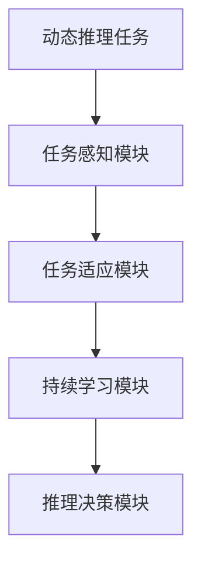

# 动态推理任务适应中持续学习的创新策略

> 关键词：动态推理任务、持续学习、创新策略、任务适应、机器学习

> 摘要：本文聚焦于动态推理任务适应中持续学习的创新策略。随着人工智能应用场景的不断拓展，系统面临的任务呈现出动态变化的特性，传统学习方法难以有效应对。文章首先介绍了相关背景，包括目的范围、预期读者等内容；接着阐述核心概念与联系，以清晰的示意图和流程图展示其原理架构；深入讲解核心算法原理并给出 Python 源代码；分析数学模型和公式；通过项目实战展示代码实现与解读；探讨实际应用场景；推荐相关工具和资源；最后总结未来发展趋势与挑战，提供常见问题解答和扩展阅读参考资料，旨在为该领域的研究与实践提供全面且深入的指导。

## 1. 背景介绍 
### 1.1 目的和范围
在当今的人工智能领域，动态推理任务不断涌现。这些任务的特点是其数据分布、任务类型等会随时间动态变化。例如，在智能交通系统中，交通流量、路况信息等会实时改变，智能系统需要不断适应这些变化进行推理决策。传统的机器学习模型往往是针对固定任务和静态数据进行训练的，当面对动态变化的任务时，其性能会急剧下降。本文的目的在于探讨在动态推理任务适应过程中持续学习的创新策略，以提高系统在动态环境下的学习能力和推理性能。范围涵盖了从理论原理到实际应用的多个方面，包括核心概念的解释、算法原理的阐述、数学模型的分析、项目实战的展示以及实际应用场景的探讨等。

### 1.2 预期读者
本文预期读者包括人工智能领域的研究人员、机器学习工程师、软件开发者以及对动态推理任务和持续学习感兴趣的技术爱好者。对于研究人员来说，本文可以为他们的研究提供新的思路和理论支持；对于工程师和开发者而言，能够帮助他们在实际项目中应用相关技术；对于技术爱好者，可以加深他们对这一前沿领域的理解。

### 1.3 文档结构概述
本文共分为十个部分。第一部分为背景介绍，阐述了文章的目的、预期读者和文档结构概述等内容；第二部分介绍核心概念与联系，通过文本示意图和 Mermaid 流程图展示相关原理架构；第三部分深入讲解核心算法原理并给出 Python 源代码；第四部分分析数学模型和公式，并进行详细讲解和举例说明；第五部分进行项目实战，包括开发环境搭建、源代码实现和代码解读；第六部分探讨实际应用场景；第七部分推荐相关工具和资源，包括学习资源、开发工具框架和相关论文著作；第八部分总结未来发展趋势与挑战；第九部分为附录，提供常见问题与解答；第十部分为扩展阅读和参考资料。

### 1.4 术语表
#### 1.4.1 核心术语定义
- **动态推理任务**：指任务的输入数据、任务目标或任务环境随时间动态变化的推理任务。例如，在自然语言处理中，不同时间段用户的提问方式和话题会发生变化，相应的推理任务也会改变。
- **持续学习**：也称为终身学习，是指系统能够在不断接收新数据和新任务的过程中持续学习，同时保留之前学习到的知识，避免灾难性遗忘。
- **任务适应**：系统根据动态变化的任务需求，调整自身的模型参数或结构，以实现对新任务的有效处理。

#### 1.4.2 相关概念解释
- **灾难性遗忘**：在持续学习过程中，当系统学习新任务时，会对之前学习到的知识产生干扰，导致对旧任务的性能大幅下降，这种现象称为灾难性遗忘。
- **元学习**：是一种学习如何学习的方法，通过在多个任务上进行训练，让模型学会快速适应新任务，在动态推理任务适应中具有重要应用。

#### 1.4.3 缩略词列表
- **ML**：Machine Learning，机器学习
- **DL**：Deep Learning，深度学习
- **RL**：Reinforcement Learning，强化学习

## 2. 核心概念与联系 
### 核心概念原理
动态推理任务适应中的持续学习涉及多个核心概念。首先，动态推理任务强调任务的动态性，这要求系统能够实时感知任务的变化并做出相应调整。持续学习则关注系统在长期学习过程中的性能保持和知识积累。任务适应是连接动态推理任务和持续学习的关键环节，它通过调整模型参数或结构来实现对新任务的适应。

例如，在一个智能医疗诊断系统中，随着新疾病的出现和医学知识的更新，系统面临的推理任务会动态变化。持续学习机制会不断接收新的病例数据进行学习，同时任务适应模块会根据新任务的特点调整诊断模型，以保证系统的诊断准确性。

### 架构的文本示意图
```plaintext
动态推理任务（数据动态变化、任务目标变化）
    |
    v
任务感知模块（实时监测任务变化）
    |
    v
任务适应模块（调整模型参数或结构）
    |
    v
持续学习模块（知识积累、防止遗忘）
    |
    v
推理决策模块（基于学习结果进行推理）
```

### Mermaid 流程图


## 3. 核心算法原理 & 具体操作步骤 
### 算法原理
在动态推理任务适应的持续学习中，一种常用的算法是基于元学习的方法。元学习的核心思想是通过在多个任务上进行训练，让模型学会快速适应新任务。具体来说，元学习会将任务划分为元训练任务和元测试任务。在元训练阶段，模型在元训练任务上进行训练，学习到如何快速调整模型参数以适应不同的任务。在元测试阶段，模型面对新的任务时，能够利用之前学习到的元知识快速适应。

### Python 源代码实现
```python
import torch
import torch.nn as nn
import torch.optim as optim

# 定义一个简单的神经网络模型
class SimpleNet(nn.Module):
    def __init__(self, input_size, hidden_size, output_size):
        super(SimpleNet, self).__init__()
        self.fc1 = nn.Linear(input_size, hidden_size)
        self.relu = nn.ReLU()
        self.fc2 = nn.Linear(hidden_size, output_size)

    def forward(self, x):
        out = self.fc1(x)
        out = self.relu(out)
        out = self.fc2(out)
        return out

# 元训练函数
def meta_train(model, meta_train_tasks, meta_optimizer, num_epochs):
    for epoch in range(num_epochs):
        meta_loss = 0
        for task in meta_train_tasks:
            # 复制模型参数
            fast_weights = list(model.parameters())
            # 对当前任务进行几次梯度更新
            task_optimizer = optim.SGD(fast_weights, lr=0.01)
            for _ in range(3):
                inputs, labels = task
                outputs = model(inputs)
                loss = nn.CrossEntropyLoss()(outputs, labels)
                task_optimizer.zero_grad()
                loss.backward()
                task_optimizer.step()
            # 计算元损失
            new_outputs = model(inputs)
            meta_loss += nn.CrossEntropyLoss()(new_outputs, labels)
        # 进行元更新
        meta_optimizer.zero_grad()
        meta_loss.backward()
        meta_optimizer.step()
        print(f'Epoch {epoch+1}/{num_epochs}, Meta Loss: {meta_loss.item()}')

# 元测试函数
def meta_test(model, meta_test_task):
    # 复制模型参数
    fast_weights = list(model.parameters())
    task_optimizer = optim.SGD(fast_weights, lr=0.01)
    for _ in range(3):
        inputs, labels = meta_test_task
        outputs = model(inputs)
        loss = nn.CrossEntropyLoss()(outputs, labels)
        task_optimizer.zero_grad()
        loss.backward()
        task_optimizer.step()
    # 进行最终预测
    final_outputs = model(inputs)
    _, predicted = torch.max(final_outputs.data, 1)
    accuracy = (predicted == labels).sum().item() / labels.size(0)
    print(f'Test Accuracy: {accuracy}')

# 示例使用
input_size = 10
hidden_size = 20
output_size = 5
model = SimpleNet(input_size, hidden_size, output_size)
meta_optimizer = optim.Adam(model.parameters(), lr=0.001)
meta_train_tasks = [
    (torch.randn(10, input_size), torch.randint(0, output_size, (10,)))
    for _ in range(5)
]
meta_test_task = (torch.randn(10, input_size), torch.randint(0, output_size, (10,)))

meta_train(model, meta_train_tasks, meta_optimizer, num_epochs=10)
meta_test(model, meta_test_task)
```

### 具体操作步骤
1. **定义模型**：首先定义一个神经网络模型，如上述代码中的 `SimpleNet` 类。
2. **准备任务数据**：将任务数据划分为元训练任务和元测试任务。
3. **元训练**：在元训练阶段，对每个元训练任务进行几次梯度更新，然后计算元损失并进行元更新。
4. **元测试**：在元测试阶段，对元测试任务进行几次梯度更新，然后进行最终预测并计算准确率。

## 4. 数学模型和公式 & 详细讲解 & 举例说明 
### 数学模型
在基于元学习的动态推理任务适应的持续学习中，核心的数学模型可以用以下公式表示。

设 $\theta$ 为模型的参数，$T$ 为任务集合，对于每个任务 $t \in T$，有输入数据 $x_t$ 和标签 $y_t$。模型的损失函数为 $L(\theta; x_t, y_t)$。

在元训练阶段，我们的目标是最小化元损失 $\mathcal{L}_{meta}(\theta)$，元损失的定义如下：

$$\mathcal{L}_{meta}(\theta) = \sum_{t \in T_{meta - train}} L(\theta'_t; x_t, y_t)$$

其中 $\theta'_t$ 是在任务 $t$ 上进行几次梯度更新后的参数，更新公式为：

$$\theta'_t = \theta - \alpha \nabla_{\theta} L(\theta; x_t, y_t)$$

这里 $\alpha$ 是学习率。

### 详细讲解
元损失 $\mathcal{L}_{meta}(\theta)$ 的意义在于衡量模型在多个元训练任务上的性能。通过最小化元损失，模型能够学习到如何快速调整参数以适应不同的任务。梯度更新公式 $\theta'_t = \theta - \alpha \nabla_{\theta} L(\theta; x_t, y_t)$ 表示在当前任务 $t$ 上对模型参数进行一次梯度下降更新，$\alpha$ 控制了更新的步长。

### 举例说明
假设我们有一个二分类任务，输入数据 $x$ 是一个二维向量，标签 $y \in \{0, 1\}$。模型是一个简单的线性分类器 $f(x; \theta) = \sigma(\theta_1 x_1 + \theta_2 x_2 + \theta_3)$，其中 $\sigma$ 是 sigmoid 函数。损失函数采用交叉熵损失 $L(\theta; x, y) = -y \log(f(x; \theta)) - (1 - y) \log(1 - f(x; \theta))$。

在元训练阶段，我们有多个这样的二分类任务。对于每个任务，我们先计算当前模型参数 $\theta$ 下的损失 $L(\theta; x, y)$，然后根据梯度更新公式得到 $\theta'$，最后将所有任务的损失相加得到元损失 $\mathcal{L}_{meta}(\theta)$。通过不断迭代更新 $\theta$ 来最小化元损失，从而使模型能够快速适应新的二分类任务。

## 5. 项目实战：代码实际案例和详细解释说明 
### 5.1  开发环境搭建
- **Python 环境**：建议使用 Python 3.7 及以上版本。可以从 Python 官方网站（https://www.python.org/downloads/） 下载并安装。
- **深度学习框架**：使用 PyTorch 深度学习框架。可以通过以下命令安装：
```bash
pip install torch torchvision
```
- **开发工具**：推荐使用 PyCharm 或 Jupyter Notebook 作为开发工具。

### 5.2  源代码详细实现和代码解读
```python
import torch
import torch.nn as nn
import torch.optim as optim
import numpy as np

# 定义一个更复杂的神经网络模型
class ComplexNet(nn.Module):
    def __init__(self, input_size, hidden_size1, hidden_size2, output_size):
        super(ComplexNet, self).__init__()
        self.fc1 = nn.Linear(input_size, hidden_size1)
        self.relu1 = nn.ReLU()
        self.fc2 = nn.Linear(hidden_size1, hidden_size2)
        self.relu2 = nn.ReLU()
        self.fc3 = nn.Linear(hidden_size2, output_size)

    def forward(self, x):
        out = self.fc1(x)
        out = self.relu1(out)
        out = self.fc2(out)
        out = self.relu2(out)
        out = self.fc3(out)
        return out

# 生成任务数据的函数
def generate_task(num_samples, input_size, output_size):
    inputs = torch.randn(num_samples, input_size)
    labels = torch.randint(0, output_size, (num_samples,))
    return inputs, labels

# 元训练函数
def meta_train(model, meta_train_tasks, meta_optimizer, num_epochs, inner_lr=0.01, inner_steps=3):
    for epoch in range(num_epochs):
        meta_loss = 0
        for task in meta_train_tasks:
            # 复制模型参数
            fast_weights = [p.clone() for p in model.parameters()]
            # 对当前任务进行几次梯度更新
            for _ in range(inner_steps):
                inputs, labels = task
                outputs = model.forward_with_weights(inputs, fast_weights)
                loss = nn.CrossEntropyLoss()(outputs, labels)
                grads = torch.autograd.grad(loss, fast_weights)
                fast_weights = [w - inner_lr * g for w, g in zip(fast_weights, grads)]
            # 计算元损失
            new_outputs = model.forward_with_weights(inputs, fast_weights)
            meta_loss += nn.CrossEntropyLoss()(new_outputs, labels)
        # 进行元更新
        meta_optimizer.zero_grad()
        meta_loss.backward()
        meta_optimizer.step()
        print(f'Epoch {epoch+1}/{num_epochs}, Meta Loss: {meta_loss.item()}')

# 元测试函数
def meta_test(model, meta_test_task, inner_lr=0.01, inner_steps=3):
    # 复制模型参数
    fast_weights = [p.clone() for p in model.parameters()]
    # 对当前任务进行几次梯度更新
    for _ in range(inner_steps):
        inputs, labels = meta_test_task
        outputs = model.forward_with_weights(inputs, fast_weights)
        loss = nn.CrossEntropyLoss()(outputs, labels)
        grads = torch.autograd.grad(loss, fast_weights)
        fast_weights = [w - inner_lr * g for w, g in zip(fast_weights, grads)]
    # 进行最终预测
    final_outputs = model.forward_with_weights(inputs, fast_weights)
    _, predicted = torch.max(final_outputs.data, 1)
    accuracy = (predicted == labels).sum().item() / labels.size(0)
    print(f'Test Accuracy: {accuracy}')

# 为模型添加 forward_with_weights 方法
def forward_with_weights(self, x, weights):
    out = nn.functional.linear(x, weights[0], weights[1])
    out = nn.functional.relu(out)
    out = nn.functional.linear(out, weights[2], weights[3])
    out = nn.functional.relu(out)
    out = nn.functional.linear(out, weights[4], weights[5])
    return out

ComplexNet.forward_with_weights = forward_with_weights

# 示例使用
input_size = 20
hidden_size1 = 50
hidden_size2 = 30
output_size = 10
model = ComplexNet(input_size, hidden_size1, hidden_size2, output_size)
meta_optimizer = optim.Adam(model.parameters(), lr=0.001)
meta_train_tasks = [
    generate_task(20, input_size, output_size) for _ in range(10)
]
meta_test_task = generate_task(20, input_size, output_size)

meta_train(model, meta_train_tasks, meta_optimizer, num_epochs=20)
meta_test(model, meta_test_task)
```

### 5.3  代码解读与分析
- **模型定义**：`ComplexNet` 类定义了一个三层的神经网络模型，包含两个隐藏层。
- **任务数据生成**：`generate_task` 函数用于生成随机的任务数据，包括输入数据和标签。
- **元训练**：`meta_train` 函数实现了元训练过程。在每个元训练任务上，先复制模型参数，然后进行几次梯度更新得到新的参数，最后计算元损失并进行元更新。
- **元测试**：`meta_test` 函数实现了元测试过程。在元测试任务上进行几次梯度更新，然后进行最终预测并计算准确率。
- **`forward_with_weights` 方法**：该方法用于在给定参数的情况下进行前向传播，方便在元训练和元测试过程中使用不同的参数。

## 6. 实际应用场景 
### 智能医疗诊断
在智能医疗诊断系统中，患者的病情数据和疾病类型会不断变化。动态推理任务适应中的持续学习可以帮助系统实时学习新的疾病特征和诊断方法，同时保留之前学习到的知识。例如，当出现新的罕见疾病时，系统能够快速适应并准确诊断。

### 自动驾驶
自动驾驶汽车在行驶过程中面临的路况、交通规则和环境信息等都是动态变化的。持续学习策略可以让自动驾驶系统不断学习新的驾驶场景和应对策略，提高驾驶的安全性和可靠性。例如，当遇到新的交通标志或特殊路况时，系统能够快速做出正确的决策。

### 金融风险预测
金融市场的情况瞬息万变，资产价格、市场趋势等都会不断变化。动态推理任务适应的持续学习可以帮助金融机构实时调整风险预测模型，提高风险预测的准确性。例如，当出现新的经济事件或政策变化时，系统能够快速适应并调整预测结果。

## 7. 工具和资源推荐
### 7.1 学习资源推荐
#### 7.1.1 书籍推荐
- 《深度学习》（Deep Learning）：由 Ian Goodfellow、Yoshua Bengio 和 Aaron Courville 所著，是深度学习领域的经典教材，涵盖了深度学习的基本原理和算法。
- 《机器学习》（Machine Learning）：由 Tom M. Mitchell 所著，对机器学习的基本概念和算法进行了系统的介绍。
- 《持续学习：算法与实践》（Continual Learning: Algorithms and Practice）：专门介绍持续学习的相关理论和算法，对于深入研究动态推理任务适应中的持续学习有很大帮助。

#### 7.1.2 在线课程
- Coursera 上的《深度学习专项课程》（Deep Learning Specialization）：由 Andrew Ng 教授授课，内容丰富全面，包括深度学习的各个方面。
- edX 上的《机器学习导论》（Introduction to Machine Learning）：由麻省理工学院（MIT）提供，讲解深入浅出，适合初学者。
- Udemy 上的《持续学习实战》（Continual Learning in Practice）：专门针对持续学习的实战课程，通过实际案例讲解相关技术。

#### 7.1.3 技术博客和网站
- Medium 上的 Towards Data Science：有很多关于人工智能和机器学习的高质量文章，包括持续学习的最新研究成果和实践经验。
- arXiv.org：是一个预印本平台，能够获取到最新的学术论文，对于了解动态推理任务适应和持续学习的前沿研究非常有帮助。
- AI 科技评论：专注于人工智能领域的科技资讯和技术解读，提供了很多有价值的观点和分析。

### 7.2 开发工具框架推荐
#### 7.2.1 IDE和编辑器
- PyCharm：是一款专门为 Python 开发设计的集成开发环境（IDE），具有强大的代码编辑、调试和项目管理功能。
- Jupyter Notebook：是一个交互式的开发环境，适合进行数据探索、模型实验和代码演示，能够方便地展示代码和结果。
- Visual Studio Code：是一款轻量级的代码编辑器，支持多种编程语言和插件，对于快速开发和调试代码非常方便。

#### 7.2.2 调试和性能分析工具
- PyTorch Profiler：是 PyTorch 自带的性能分析工具，能够帮助开发者分析模型的运行时间、内存使用等情况，优化模型性能。
- TensorBoard：是 TensorFlow 提供的可视化工具，也可以与 PyTorch 结合使用，用于可视化模型的训练过程和性能指标。
- cProfile：是 Python 标准库中的性能分析工具，能够分析 Python 代码的运行时间和函数调用情况。

#### 7.2.3 相关框架和库
- PyTorch：是一个开源的深度学习框架，具有动态计算图和丰富的工具库，方便开发者实现各种深度学习模型。
- TensorFlow：是另一个广泛使用的深度学习框架，具有强大的分布式训练和部署能力。
- scikit-learn：是一个用于机器学习的 Python 库，提供了丰富的机器学习算法和工具，对于快速实现和测试机器学习模型非常有用。

### 7.3 相关论文著作推荐
#### 7.3.1 经典论文
- "Model-Agnostic Meta-Learning for Fast Adaptation of Deep Networks"：提出了模型无关元学习（MAML）算法，是元学习领域的经典论文。
- "Continual Learning with Deep Generative Replay"：介绍了使用深度生成重放进行持续学习的方法，有效缓解了灾难性遗忘问题。
- "Overcoming catastrophic forgetting in neural networks"：对灾难性遗忘问题进行了深入分析，并提出了相应的解决方法。

#### 7.3.2 最新研究成果
- 关注 arXiv.org 上关于动态推理任务适应和持续学习的最新论文，了解该领域的前沿研究进展。
- 参加国际人工智能会议（如 NeurIPS、ICML 等）的相关研讨会，获取最新的研究成果和学术动态。

#### 7.3.3 应用案例分析
- 一些知名科技公司（如 Google、Facebook 等）的技术博客会分享他们在动态推理任务适应和持续学习方面的应用案例和实践经验，可以从中学习到实际应用中的技巧和方法。
- 相关学术期刊（如 Journal of Artificial Intelligence Research、Artificial Intelligence 等）上也会发表一些应用案例分析的文章，具有较高的参考价值。

## 8. 总结：未来发展趋势与挑战
### 未来发展趋势
- **多模态融合**：未来的动态推理任务可能会涉及多种模态的数据，如文本、图像、语音等。持续学习需要能够处理多模态数据，实现更全面和准确的推理。
- **与强化学习结合**：将持续学习与强化学习相结合，可以让系统在动态环境中更好地进行决策和学习，提高系统的适应性和智能水平。
- **自适应架构设计**：开发能够根据任务动态变化自动调整架构的模型，进一步提高系统的灵活性和性能。

### 挑战
- **灾难性遗忘问题**：尽管已经有很多方法来缓解灾难性遗忘，但仍然是持续学习面临的主要挑战之一，需要进一步研究更有效的解决方法。
- **计算资源和时间成本**：动态推理任务适应的持续学习通常需要大量的计算资源和时间，如何优化算法和模型结构，降低计算成本是一个重要问题。
- **数据隐私和安全**：在持续学习过程中，数据的隐私和安全问题需要得到重视。如何在保护数据隐私的前提下进行有效的学习是一个亟待解决的挑战。

## 9. 附录：常见问题与解答
### 问题 1：什么是灾难性遗忘，为什么会出现？
灾难性遗忘是指在持续学习过程中，当系统学习新任务时，会对之前学习到的知识产生干扰，导致对旧任务的性能大幅下降。出现的原因主要是神经网络的参数更新方式，当新任务的数据进入时，模型参数会被更新以适应新任务，而这些更新可能会破坏之前学习到的旧任务的知识表示。

### 问题 2：元学习是如何解决动态推理任务适应问题的？
元学习通过在多个任务上进行训练，让模型学会快速适应新任务。在元训练阶段，模型学习到如何快速调整参数以适应不同的任务，当面对新的动态推理任务时，能够利用之前学习到的元知识快速适应，从而提高系统在动态环境下的学习能力和推理性能。

### 问题 3：如何选择合适的学习率和更新步数？
学习率和更新步数的选择通常需要通过实验来确定。一般来说，可以采用网格搜索或随机搜索的方法，在一定范围内尝试不同的学习率和更新步数组合，选择在验证集上性能最优的组合。同时，也可以参考相关的研究论文和经验值进行初步的选择。

## 10. 扩展阅读 & 参考资料
### 扩展阅读
- 《人工智能：一种现代的方法》（Artificial Intelligence: A Modern Approach）：全面介绍了人工智能的各个方面，包括机器学习、知识表示、推理等内容，对于深入理解动态推理任务和持续学习的背景知识有很大帮助。
- 《神经网络与深度学习》（Neural Networks and Deep Learning）：对神经网络和深度学习的原理、算法和应用进行了详细的阐述，适合进一步学习相关技术。

### 参考资料
- Goodfellow, I., Bengio, Y., & Courville, A. (2016). Deep Learning. MIT Press.
- Mitchell, T. M. (1997). Machine Learning. McGraw-Hill.
- Finn, C., Abbeel, P., & Levine, S. (2017). Model-Agnostic Meta-Learning for Fast Adaptation of Deep Networks. Proceedings of the 34th International Conference on Machine Learning-Volume 70.
- Shin, H., Lee, J. K., Kim, J., & Kim, J. (2017). Continual Learning with Deep Generative Replay. Advances in Neural Information Processing Systems.
- Kirkpatrick, J., Pascanu, R., Rabinowitz, N., Veness, J., Desjardins, G., Rusu, A. A., ... & Hassabis, D. (2017). Overcoming catastrophic forgetting in neural networks. Proceedings of the national academy of sciences.