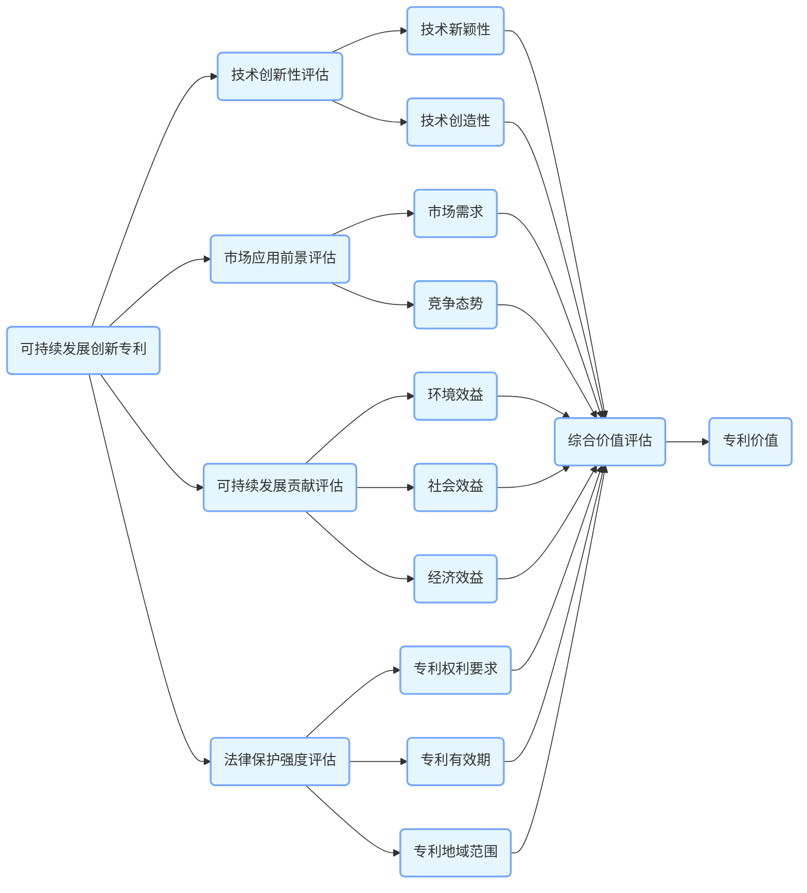

# 可持续发展创新的专利价值评估方法

> 关键词：可持续发展、创新、专利价值评估、评估方法、知识产权

> 摘要：本文聚焦于可持续发展创新背景下的专利价值评估方法。在当今社会，可持续发展已成为全球共识，创新是推动可持续发展的关键动力，而专利作为创新成果的重要体现，其价值评估具有重要意义。文章详细介绍了相关的背景知识，深入剖析核心概念与联系，阐述核心算法原理及具体操作步骤，给出数学模型和公式并举例说明，通过项目实战展示代码实现与解读，探讨实际应用场景，推荐相关工具和资源，最后总结未来发展趋势与挑战，解答常见问题并提供扩展阅读和参考资料，旨在为准确评估可持续发展创新的专利价值提供全面且深入的指导。

## 1. 背景介绍 
### 1.1 目的和范围
随着可持续发展理念的深入人心，各个领域的创新活动不断涌现，专利作为创新的重要产出形式，其数量也在迅速增长。准确评估可持续发展创新的专利价值，对于企业的战略决策、技术转让、融资以及政府的政策制定等都具有至关重要的意义。本文的目的在于系统地介绍适用于可持续发展创新的专利价值评估方法，范围涵盖从基础概念到实际应用的各个方面，包括相关的算法、数学模型、实际案例以及未来发展趋势等。

### 1.2 预期读者
本文预期读者包括从事知识产权管理、评估的专业人员，企业的研发、战略规划和投资决策人员，政府相关部门的政策制定者，以及对可持续发展创新和专利价值评估感兴趣的学者和研究人员。

### 1.3 文档结构概述
本文首先介绍背景知识，包括目的、预期读者和文档结构概述等。接着阐述核心概念与联系，明确相关概念的原理和架构，并通过示意图和流程图展示。然后详细讲解核心算法原理及具体操作步骤，给出Python源代码。之后介绍数学模型和公式，并举例说明。通过项目实战展示代码实现和详细解释。探讨实际应用场景，推荐相关的工具和资源。最后总结未来发展趋势与挑战，解答常见问题并提供扩展阅读和参考资料。

### 1.4 术语表
#### 1.4.1 核心术语定义
- **可持续发展创新**：指在满足当代人需求的同时，不损害后代人满足其自身需求的能力的创新活动，涉及环境、社会和经济等多个维度的可持续性。
- **专利价值**：指专利所具有的经济、技术、法律等方面的价值，反映了专利在市场竞争、技术进步和法律保护等方面的作用和潜力。
- **专利价值评估**：指通过一定的方法和程序，对专利的价值进行定量或定性的评价和估算。

#### 1.4.2 相关概念解释
- **知识产权**：指人们对其智力劳动成果所享有的法定权利，包括专利、商标、著作权等。
- **技术创新**：指在技术领域中引入新的思想、方法、产品或工艺，以提高生产效率、降低成本、改善产品质量等。
- **可持续发展**：指既满足当代人的需求，又不损害后代人满足其需求的能力的发展模式，强调经济、社会和环境的协调发展。

#### 1.4.3 缩略词列表
- **IP**：知识产权（Intellectual Property）
- **R&D**：研究与开发（Research and Development）

## 2. 核心概念与联系 

### 核心概念原理
可持续发展创新的专利价值评估涉及多个核心概念，包括可持续发展、创新、专利和价值评估。可持续发展强调经济、社会和环境的协调发展，创新是推动可持续发展的动力，专利是创新成果的法律保护形式，而价值评估则是对专利所具有的各种价值进行量化和分析的过程。

从原理上讲，可持续发展创新的专利价值评估需要综合考虑专利的技术创新性、市场应用前景、对可持续发展目标的贡献以及法律保护强度等因素。技术创新性是专利价值的基础，市场应用前景决定了专利的经济价值，对可持续发展目标的贡献体现了专利的社会和环境价值，而法律保护强度则保障了专利价值的实现。

### 架构的文本示意图
可持续发展创新的专利价值评估架构可以用以下文本示意图表示：

```plaintext
可持续发展创新的专利价值评估
|-- 可持续发展维度
|   |-- 环境可持续性
|   |-- 社会可持续性
|   |-- 经济可持续性
|-- 创新维度
|   |-- 技术创新性
|   |-- 新颖性
|   |-- 创造性
|-- 专利维度
|   |-- 专利权利要求
|   |-- 专利有效期
|   |-- 专利地域范围
|-- 价值评估维度
|   |-- 经济价值
|   |-- 技术价值
|   |-- 社会价值
|   |-- 环境价值
```

### Mermaid 流程图


## 3. 核心算法原理 & 具体操作步骤 

### 核心算法原理
在可持续发展创新的专利价值评估中，一种常用的算法是层次分析法（AHP）与模糊综合评价法相结合的方法。层次分析法用于确定各个评估指标的权重，模糊综合评价法用于对专利在各个指标上的表现进行评价，最后综合得出专利的价值。

### 具体操作步骤

#### 步骤1：建立层次结构模型
将可持续发展创新的专利价值评估问题分解为目标层、准则层和指标层。目标层为专利价值，准则层包括技术创新性、市场应用前景、可持续发展贡献和法律保护强度，指标层为各个准则层下的具体指标，如技术新颖性、市场需求等。

#### 步骤2：构造判断矩阵
通过专家打分的方式，对同一层次的各个因素进行两两比较，构造判断矩阵。判断矩阵的元素表示两个因素相对重要性的比例标度，通常采用1 - 9标度法。

#### 步骤3：计算权重向量
计算判断矩阵的最大特征值和对应的特征向量，对特征向量进行归一化处理，得到各个因素的权重向量。同时，进行一致性检验，确保判断矩阵的一致性在可接受范围内。

#### 步骤4：确定模糊评价集
确定模糊评价集，如{高，中，低}等。

#### 步骤5：进行模糊评价
通过专家打分的方式，对专利在各个指标上的表现进行评价，得到模糊评价矩阵。

#### 步骤6：计算模糊综合评价结果
将模糊评价矩阵与权重向量进行合成运算，得到模糊综合评价结果。

#### 步骤7：确定专利价值
根据模糊综合评价结果，确定专利的价值等级或具体数值。

### Python源代码实现

```python
import numpy as np

# 步骤2：构造判断矩阵
def construct_judgment_matrix():
    # 示例判断矩阵，这里仅为示意，实际应根据专家打分确定
    judgment_matrix = np.array([[1, 3, 5, 7],
                                [1/3, 1, 3, 5],
                                [1/5, 1/3, 1, 3],
                                [1/7, 1/5, 1/3, 1]])
    return judgment_matrix

# 步骤3：计算权重向量和进行一致性检验
def calculate_weights(judgment_matrix):
    n = judgment_matrix.shape[0]
    eigenvalues, eigenvectors = np.linalg.eig(judgment_matrix)
    max_eigenvalue = np.max(eigenvalues).real
    index = np.argmax(eigenvalues)
    eigenvector = eigenvectors[:, index].real
    weights = eigenvector / np.sum(eigenvector)

    # 一致性检验
    RI = [0, 0, 0.58, 0.90, 1.12, 1.24, 1.32, 1.41, 1.45]
    CI = (max_eigenvalue - n) / (n - 1)
    CR = CI / RI[n - 1]
    if CR < 0.1:
        print("判断矩阵一致性检验通过")
    else:
        print("判断矩阵一致性检验未通过，请重新构造判断矩阵")

    return weights

# 步骤5：进行模糊评价
def fuzzy_evaluation():
    # 示例模糊评价矩阵，这里仅为示意，实际应根据专家打分确定
    fuzzy_matrix = np.array([[0.8, 0.2, 0],
                             [0.6, 0.3, 0.1],
                             [0.7, 0.2, 0.1],
                             [0.9, 0.1, 0]])
    return fuzzy_matrix

# 步骤6：计算模糊综合评价结果
def fuzzy_comprehensive_evaluation(weights, fuzzy_matrix):
    result = np.dot(weights, fuzzy_matrix)
    return result

# 主函数
def main():
    judgment_matrix = construct_judgment_matrix()
    weights = calculate_weights(judgment_matrix)
    fuzzy_matrix = fuzzy_evaluation()
    result = fuzzy_comprehensive_evaluation(weights, fuzzy_matrix)
    print("模糊综合评价结果：", result)

if __name__ == "__main__":
    main()
```

## 4. 数学模型和公式 & 详细讲解 & 举例说明 

### 层次分析法相关公式

#### 判断矩阵
设判断矩阵为 $A=(a_{ij})_{n\times n}$，其中 $a_{ij}$ 表示因素 $i$ 相对于因素 $j$ 的重要性比例标度，且满足 $a_{ij}>0$，$a_{ji}=\frac{1}{a_{ij}}$，$a_{ii}=1$。

#### 最大特征值和特征向量
判断矩阵 $A$ 的最大特征值 $\lambda_{max}$ 满足 $A\omega=\lambda_{max}\omega$，其中 $\omega$ 为对应的特征向量。

#### 一致性指标
一致性指标 $CI$ 的计算公式为：
$$CI=\frac{\lambda_{max}-n}{n - 1}$$
其中 $n$ 为判断矩阵的阶数。

#### 随机一致性指标
随机一致性指标 $RI$ 是根据不同阶数的判断矩阵通过大量模拟得到的经验值，常见的 $RI$ 值如下：

| 阶数 $n$ | 1 | 2 | 3 | 4 | 5 | 6 | 7 | 8 | 9 |
| --- | --- | --- | --- | --- | --- | --- | --- | --- | --- |
| $RI$ | 0 | 0 | 0.58 | 0.90 | 1.12 | 1.24 | 1.32 | 1.41 | 1.45 |

#### 一致性比率
一致性比率 $CR$ 的计算公式为：
$$CR=\frac{CI}{RI}$$
当 $CR<0.1$ 时，认为判断矩阵具有满意的一致性；否则，需要重新构造判断矩阵。

### 模糊综合评价法相关公式

#### 模糊评价矩阵
设模糊评价矩阵为 $R=(r_{ij})_{m\times s}$，其中 $r_{ij}$ 表示第 $i$ 个指标属于第 $j$ 个评价等级的隶属度。

#### 权重向量
设权重向量为 $W=(w_1,w_2,\cdots,w_m)^T$，其中 $w_i$ 表示第 $i$ 个指标的权重，且 $\sum_{i = 1}^{m}w_i = 1$。

#### 模糊综合评价结果
模糊综合评价结果 $B$ 的计算公式为：
$$B = W^T R=(b_1,b_2,\cdots,b_s)$$
其中 $b_j=\sum_{i = 1}^{m}w_i r_{ij}$，$j = 1,2,\cdots,s$。

### 举例说明
假设有一个可持续发展创新的专利，采用上述层次分析法和模糊综合评价法进行价值评估。

#### 层次分析法部分
构造判断矩阵如下：
$$A=\begin{bmatrix}
1 & 3 & 5 & 7 \\
\frac{1}{3} & 1 & 3 & 5 \\
\frac{1}{5} & \frac{1}{3} & 1 & 3 \\
\frac{1}{7} & \frac{1}{5} & \frac{1}{3} & 1
\end{bmatrix}$$
计算得到最大特征值 $\lambda_{max}=4.12$，$n = 4$，$CI=\frac{4.12 - 4}{4 - 1}=0.04$，$RI = 0.90$，$CR=\frac{0.04}{0.90}\approx0.044<0.1$，判断矩阵一致性检验通过。

计算得到权重向量 $W=(0.606, 0.258, 0.106, 0.030)^T$。

#### 模糊综合评价法部分
模糊评价矩阵如下：
$$R=\begin{bmatrix}
0.8 & 0.2 & 0 \\
0.6 & 0.3 & 0.1 \\
0.7 & 0.2 & 0.1 \\
0.9 & 0.1 & 0
\end{bmatrix}$$
计算模糊综合评价结果：
$$B = W^T R=(0.606\times0.8 + 0.258\times0.6 + 0.106\times0.7 + 0.030\times0.9, 0.606\times0.2 + 0.258\times0.3 + 0.106\times0.2 + 0.030\times0.1, 0.606\times0 + 0.258\times0.1 + 0.106\times0.1 + 0.030\times0)=(0.742, 0.221, 0.037)$$

根据模糊综合评价结果，可以判断该专利的价值等级较高。

## 5. 项目实战：代码实际案例和详细解释说明 

### 5.1  开发环境搭建
- **Python 环境**：建议使用 Python 3.7 及以上版本。可以从 Python 官方网站（https://www.python.org/downloads/）下载并安装。
- **开发工具**：推荐使用 PyCharm 或 Jupyter Notebook 作为开发工具。PyCharm 是一款功能强大的 Python 集成开发环境，Jupyter Notebook 则适合进行交互式的代码开发和演示。
- **依赖库**：本项目需要使用 `numpy` 库进行数值计算。可以使用以下命令安装：
```sh
pip install numpy
```

### 5.2  源代码详细实现和代码解读

```python
import numpy as np

# 步骤2：构造判断矩阵
def construct_judgment_matrix():
    # 示例判断矩阵，这里仅为示意，实际应根据专家打分确定
    judgment_matrix = np.array([[1, 3, 5, 7],
                                [1/3, 1, 3, 5],
                                [1/5, 1/3, 1, 3],
                                [1/7, 1/5, 1/3, 1]])
    return judgment_matrix

# 步骤3：计算权重向量和进行一致性检验
def calculate_weights(judgment_matrix):
    n = judgment_matrix.shape[0]
    # 计算判断矩阵的特征值和特征向量
    eigenvalues, eigenvectors = np.linalg.eig(judgment_matrix)
    # 找到最大特征值
    max_eigenvalue = np.max(eigenvalues).real
    # 找到最大特征值对应的索引
    index = np.argmax(eigenvalues)
    # 提取对应的特征向量
    eigenvector = eigenvectors[:, index].real
    # 归一化处理得到权重向量
    weights = eigenvector / np.sum(eigenvector)

    # 一致性检验
    RI = [0, 0, 0.58, 0.90, 1.12, 1.24, 1.32, 1.41, 1.45]
    CI = (max_eigenvalue - n) / (n - 1)
    CR = CI / RI[n - 1]
    if CR < 0.1:
        print("判断矩阵一致性检验通过")
    else:
        print("判断矩阵一致性检验未通过，请重新构造判断矩阵")

    return weights

# 步骤5：进行模糊评价
def fuzzy_evaluation():
    # 示例模糊评价矩阵，这里仅为示意，实际应根据专家打分确定
    fuzzy_matrix = np.array([[0.8, 0.2, 0],
                             [0.6, 0.3, 0.1],
                             [0.7, 0.2, 0.1],
                             [0.9, 0.1, 0]])
    return fuzzy_matrix

# 步骤6：计算模糊综合评价结果
def fuzzy_comprehensive_evaluation(weights, fuzzy_matrix):
    # 矩阵乘法计算模糊综合评价结果
    result = np.dot(weights, fuzzy_matrix)
    return result

# 主函数
def main():
    # 构造判断矩阵
    judgment_matrix = construct_judgment_matrix()
    # 计算权重向量
    weights = calculate_weights(judgment_matrix)
    # 进行模糊评价得到模糊评价矩阵
    fuzzy_matrix = fuzzy_evaluation()
    # 计算模糊综合评价结果
    result = fuzzy_comprehensive_evaluation(weights, fuzzy_matrix)
    print("模糊综合评价结果：", result)

if __name__ == "__main__":
    main()
```

### 5.3  代码解读与分析
- **`construct_judgment_matrix` 函数**：该函数用于构造判断矩阵，这里使用了一个示例判断矩阵，实际应用中应根据专家打分来确定。
- **`calculate_weights` 函数**：该函数用于计算判断矩阵的权重向量，并进行一致性检验。首先使用 `np.linalg.eig` 函数计算判断矩阵的特征值和特征向量，然后找到最大特征值及其对应的特征向量，进行归一化处理得到权重向量。接着计算一致性指标 $CI$ 和一致性比率 $CR$，判断判断矩阵的一致性是否通过。
- **`fuzzy_evaluation` 函数**：该函数用于进行模糊评价，返回一个示例模糊评价矩阵，实际应用中应根据专家打分来确定。
- **`fuzzy_comprehensive_evaluation` 函数**：该函数用于计算模糊综合评价结果，通过矩阵乘法将权重向量和模糊评价矩阵相乘得到最终结果。
- **`main` 函数**：主函数，依次调用上述函数完成整个专利价值评估的流程，并打印出模糊综合评价结果。

## 6. 实际应用场景 
### 企业战略决策
企业在进行技术研发、市场拓展、并购重组等战略决策时，需要准确评估可持续发展创新的专利价值。通过评估专利价值，企业可以确定哪些专利具有较高的潜力，值得进一步投入资源进行研发和商业化推广；哪些专利可以进行转让或授权，以获取经济收益；哪些专利需要加强保护，以维护企业的竞争优势。

### 技术转让和许可
在技术转让和许可过程中，准确评估专利价值是确定交易价格和条款的重要依据。专利价值评估可以帮助转让方和受让方了解专利的真实价值，避免交易价格过高或过低，保障双方的利益。同时，专利价值评估也可以为技术转让和许可提供技术和市场方面的信息，促进技术的有效转移和应用。

### 融资活动
企业在进行融资活动时，如股权融资、债权融资等，专利价值可以作为企业的重要资产进行评估和抵押。银行、风险投资机构等金融机构在评估企业的信用风险和投资价值时，会关注企业的专利资产及其价值。通过准确评估可持续发展创新的专利价值，企业可以提高自身的融资能力，获得更多的资金支持。

### 政府政策制定
政府在制定科技政策、产业政策等时，需要了解可持续发展创新的专利情况和价值。专利价值评估可以为政府提供有关技术创新水平、产业发展趋势等方面的信息，帮助政府制定更加科学合理的政策，引导和支持企业进行可持续发展创新，促进经济、社会和环境的协调发展。

## 7. 工具和资源推荐
### 7.1 学习资源推荐
#### 7.1.1 书籍推荐
- 《知识产权评估》：系统介绍了知识产权评估的理论、方法和实践，包括专利价值评估的相关内容。
- 《可持续发展概论》：全面阐述了可持续发展的概念、理论和实践，有助于理解可持续发展创新的背景和意义。
- 《运筹学》：涉及层次分析法等多属性决策方法的原理和应用，对于理解专利价值评估中的算法原理有帮助。

#### 7.1.2 在线课程
- Coursera 上的“知识产权管理”课程：介绍了知识产权的基本概念、管理方法和评估技巧。
- edX 上的“可持续发展与创新”课程：探讨了可持续发展与创新的关系，以及如何在创新中实现可持续发展目标。
- 中国大学 MOOC 上的“运筹学”课程：详细讲解了运筹学的各种方法和应用，包括层次分析法。

#### 7.1.3 技术博客和网站
- 国家知识产权局网站：提供了丰富的知识产权政策、法规和信息，以及专利检索和查询服务。
- 中国知网：包含大量的学术论文和研究报告，可用于查询有关可持续发展创新和专利价值评估的最新研究成果。
- 知乎、CSDN 等技术社区：有很多关于知识产权和技术创新的讨论和分享，可以获取实际案例和经验。

### 7.2 开发工具框架推荐
#### 7.2.1 IDE和编辑器
- PyCharm：功能强大的 Python 集成开发环境，提供代码编辑、调试、版本控制等功能。
- Jupyter Notebook：适合进行交互式的代码开发和演示，方便进行数据处理和分析。
- Visual Studio Code：轻量级的代码编辑器，支持多种编程语言，有丰富的插件扩展功能。

#### 7.2.2 调试和性能分析工具
- PDB：Python 自带的调试器，可以帮助开发者定位和解决代码中的问题。
- cProfile：Python 标准库中的性能分析工具，可以分析代码的执行时间和函数调用关系。
- Py-Spy：一个跨平台的 Python 性能分析工具，可以实时监测 Python 程序的性能。

#### 7.2.3 相关框架和库
- `numpy`：用于数值计算的 Python 库，提供了高效的数组操作和数学函数。
- `pandas`：用于数据处理和分析的 Python 库，提供了数据结构和数据操作方法。
- `matplotlib`：用于数据可视化的 Python 库，可以绘制各种图表和图形。

### 7.3 相关论文著作推荐
#### 7.3.1 经典论文
- "A Scalable Approach for Patent Valuation Using Machine Learning"：提出了一种基于机器学习的专利价值评估方法。
- "Sustainable Innovation and the Role of Patents"：探讨了可持续发展创新中专利的作用和价值。
- "The Evaluation of Intellectual Property: A Comprehensive Review"：对知识产权评估的方法和理论进行了全面综述。

#### 7.3.2 最新研究成果
- 关注顶级学术期刊，如《Research Policy》、《Technological Forecasting and Social Change》等，这些期刊上经常发表有关可持续发展创新和专利价值评估的最新研究成果。
- 参加相关的学术会议，如 IEEE International Conference on Technology Management 等，了解最新的研究动态和趋势。

#### 7.3.3 应用案例分析
- 可以参考一些企业的案例研究，如苹果、华为等公司在专利管理和价值评估方面的实践经验。
- 政府部门发布的一些政策实施案例，如科技成果转化、知识产权质押融资等案例，也可以提供有价值的参考。

## 8. 总结：未来发展趋势与挑战
### 未来发展趋势
- **多学科融合**：可持续发展创新的专利价值评估将越来越多地融合经济学、管理学、法学、环境科学等多个学科的知识和方法，以更全面、准确地评估专利的价值。
- **大数据和人工智能应用**：随着大数据和人工智能技术的发展，将有更多的数据和更先进的算法应用于专利价值评估。例如，利用文本挖掘技术分析专利文本，提取关键信息；利用机器学习算法建立更准确的评估模型。
- **国际化标准和规范**：随着全球经济一体化的发展，可持续发展创新的专利价值评估将越来越需要国际化的标准和规范。国际组织和各国政府将加强合作，制定统一的评估标准和方法，促进专利价值评估的国际交流和合作。
- **强调可持续发展贡献**：未来的专利价值评估将更加注重专利对可持续发展目标的贡献，如环境效益、社会效益等。这将引导企业和科研机构更加关注可持续发展创新，推动经济、社会和环境的协调发展。

### 挑战
- **数据质量和获取难度**：专利价值评估需要大量的数据支持，包括专利文本、技术信息、市场数据等。然而，数据的质量和获取难度是一个挑战。部分数据可能存在不准确、不完整的问题，而且一些数据可能受到商业机密、隐私等因素的限制，难以获取。
- **评估方法的准确性和一致性**：目前，专利价值评估方法众多，但各种方法都有其局限性，评估结果的准确性和一致性难以保证。不同的评估方法可能得出不同的结果，这给评估工作带来了困难，也影响了评估结果的可信度。
- **可持续发展指标的量化难题**：虽然可持续发展的重要性已经得到广泛认可，但如何将可持续发展的指标进行量化并纳入专利价值评估体系是一个难题。例如，如何准确衡量专利对环境和社会的影响，缺乏统一的标准和方法。
- **法律和政策环境的变化**：法律和政策环境的变化会对专利价值产生影响。例如，专利法律法规的修订、知识产权政策的调整等，都可能改变专利的保护范围和强度，从而影响专利的价值。评估人员需要及时了解和适应这些变化，调整评估方法和参数。

## 9. 附录：常见问题与解答
### 问题1：为什么要进行可持续发展创新的专利价值评估？
答：进行可持续发展创新的专利价值评估具有重要意义。对于企业来说，准确评估专利价值可以帮助企业进行战略决策，如确定研发方向、进行技术转让和融资等；对于政府来说，专利价值评估可以为政策制定提供依据，促进可持续发展创新和产业升级；对于社会来说，有助于提高创新资源的配置效率，推动经济、社会和环境的协调发展。

### 问题2：层次分析法和模糊综合评价法结合的优势是什么？
答：层次分析法可以将复杂的问题分解为多个层次和因素，通过两两比较确定各个因素的权重，能够充分考虑专家的主观判断和经验。模糊综合评价法可以处理模糊和不确定的信息，对专利在各个指标上的表现进行综合评价。两者结合可以充分发挥各自的优势，既考虑了指标的重要性，又能处理评价中的不确定性，提高专利价值评估的准确性和可靠性。

### 问题3：如何确保判断矩阵的一致性？
答：要确保判断矩阵的一致性，首先在构造判断矩阵时，应邀请具有丰富经验和专业知识的专家进行打分，确保专家对各个因素的相对重要性有准确的判断。其次，在计算权重向量后，要进行一致性检验，当一致性比率 $CR<0.1$ 时，认为判断矩阵具有满意的一致性；否则，需要重新邀请专家进行打分，调整判断矩阵。

### 问题4：模糊评价矩阵中的隶属度是如何确定的？
答：模糊评价矩阵中的隶属度通常通过专家打分的方式确定。邀请相关领域的专家对专利在各个指标上的表现进行评价，根据评价结果确定隶属度。例如，对于某个指标，专家认为其表现“高”的比例为 80%，“中”的比例为 20%，“低”的比例为 0，则该指标对应的隶属度为 [0.8, 0.2, 0]。

### 问题5：专利价值评估结果的应用有哪些限制？
答：专利价值评估结果是基于一定的假设和方法得出的，具有一定的局限性。评估结果可能受到数据质量、评估方法的选择、专家的主观判断等因素的影响，不能完全准确地反映专利的真实价值。此外，专利价值还受到市场环境、技术发展、法律政策等因素的动态变化的影响，评估结果的时效性有限。因此，在应用评估结果时，需要结合实际情况进行综合考虑。

## 10. 扩展阅读 & 参考资料
### 扩展阅读
- 《创新管理：赢得持续竞争优势》：深入探讨了创新管理的理论和实践，对于理解可持续发展创新的管理和战略有帮助。
- 《知识产权战略与管理》：介绍了知识产权战略的制定和实施，以及知识产权管理的方法和技巧。
- 《绿色创新：企业可持续发展的新动力》：探讨了绿色创新的概念、实践和影响，与可持续发展创新密切相关。

### 参考资料
- 国家知识产权局发布的相关政策文件和统计数据。
- 国内外学术期刊上发表的有关可持续发展创新和专利价值评估的研究论文。
- 相关的行业报告和研究机构发布的研究成果。