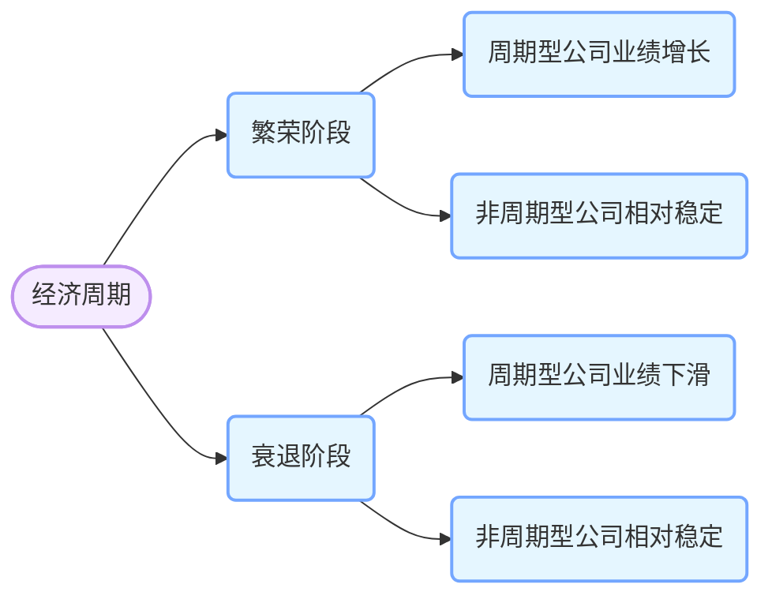

# 周期型vs非周期型公司：彼得林奇的观点

> 关键词：周期型公司、非周期型公司、彼得林奇、投资策略、公司分析

> 摘要：本文深入探讨了彼得林奇对于周期型公司和非周期型公司的观点。从背景介绍入手，详细阐述了这两类公司的核心概念与联系，剖析了相关的核心算法原理及操作步骤，借助数学模型和公式进行理论解读，并结合实际案例进行分析。同时，探讨了这两类公司的实际应用场景，推荐了相关的学习工具和资源，最后总结了未来发展趋势与挑战，还提供了常见问题解答及参考资料，旨在帮助投资者更好地理解这两类公司，从而制定更合理的投资策略。

## 1. 背景介绍 
### 1.1 目的和范围
本文章的目的在于全面且深入地分析彼得林奇关于周期型公司和非周期型公司的观点。通过对这两类公司的特点、区别以及投资策略等方面的探讨，为投资者提供有价值的参考，帮助他们在投资决策中做出更明智的选择。范围涵盖了这两类公司的基本概念、相关理论、实际案例以及未来发展趋势等多个方面。

### 1.2 预期读者
预期读者主要包括对股票投资感兴趣的个人投资者、金融专业的学生和研究人员、从事投资分析的专业人士等。无论您是初涉投资领域的新手，还是希望进一步提升投资知识和技能的专业人士，都能从本文中获得有意义的信息和启发。

### 1.3 文档结构概述
本文将按照以下结构展开：首先介绍背景信息，包括目的、预期读者和文档结构概述等；接着阐述周期型公司和非周期型公司的核心概念与联系，并通过示意图和流程图进行直观展示；然后深入剖析核心算法原理和具体操作步骤，结合 Python 源代码进行详细讲解；之后介绍相关的数学模型和公式，并举例说明；再通过项目实战，给出代码实际案例并进行详细解释；随后探讨这两类公司的实际应用场景；推荐相关的工具和资源；总结未来发展趋势与挑战；提供常见问题与解答；最后列出扩展阅读和参考资料。

### 1.4 术语表
#### 1.4.1 核心术语定义
- **周期型公司**：指那些销售额和利润会随着经济周期的变化而呈现出明显波动的公司。在经济繁荣时期，其业绩通常会大幅增长；而在经济衰退时期，业绩则会显著下滑。
- **非周期型公司**：这类公司的业务受经济周期的影响较小，其销售额和利润相对稳定，无论经济形势如何变化，都能保持较为平稳的发展态势。

#### 1.4.2 相关概念解释
- **经济周期**：是指经济活动沿着经济发展的总体趋势所经历的有规律的扩张和收缩。一般包括繁荣、衰退、萧条和复苏四个阶段。
- **业绩**：通常指公司在一定时期内的经营成果，主要通过销售额、利润等指标来衡量。

#### 1.4.3 缩略词列表
- **GDP**：国内生产总值（Gross Domestic Product），是衡量一个国家或地区经济状况和发展水平的重要指标。

## 2. 核心概念与联系 
### 2.1 周期型公司的特点
周期型公司的经营业绩与宏观经济环境密切相关。以汽车制造公司为例，在经济繁荣时期，消费者的购买能力较强，对汽车的需求旺盛，汽车制造公司的销售额和利润会大幅增长。此时，公司可能会扩大生产规模，增加投资，招聘更多的员工。然而，当经济进入衰退期，消费者的购买意愿下降，汽车需求减少，公司的销售额和利润会急剧下滑。为了应对这种情况，公司可能会削减生产规模，减少投资，甚至裁员。

### 2.2 非周期型公司的特点
非周期型公司的业务具有较强的稳定性。例如，食品饮料公司生产的是人们日常生活的必需品，无论经济形势好坏，人们都需要购买食品和饮料。因此，这类公司的销售额和利润相对稳定，不会受到经济周期的太大影响。即使在经济衰退时期，人们仍然会购买基本的食品和饮料，只是可能会减少对一些高端产品的消费。

### 2.3 两者的联系
虽然周期型公司和非周期型公司在经营特点上有很大的差异，但它们之间也存在一定的联系。在经济周期的不同阶段，两类公司的表现会相互影响。例如，在经济繁荣时期，周期型公司的业绩增长可能会带动相关产业链的发展，从而为非周期型公司带来更多的业务机会。同时，非周期型公司的稳定发展也可以为经济的稳定提供一定的支撑，减轻经济波动对整个市场的影响。

### 2.4 文本示意图
```plaintext
               经济周期
              /         \
         繁荣阶段       衰退阶段
        /       \       /       \
周期型公司  业绩增长  业绩下滑  周期型公司
        \       /       \       /
非周期型公司  相对稳定  相对稳定  非周期型公司
```

### 2.5 Mermaid 流程图


## 3. 核心算法原理 & 具体操作步骤 
### 3.1 核心算法原理
在分析周期型公司和非周期型公司时，我们可以通过计算一些关键财务指标来评估公司的业绩和发展趋势。其中，常用的指标包括销售额增长率、净利润增长率、毛利率等。

销售额增长率的计算公式为：
$$销售额增长率 = \frac{本期销售额 - 上期销售额}{上期销售额} \times 100\%$$

净利润增长率的计算公式为：
$$净利润增长率 = \frac{本期净利润 - 上期净利润}{上期净利润} \times 100\%$$

毛利率的计算公式为：
$$毛利率 = \frac{销售收入 - 销售成本}{销售收入} \times 100\%$$

### 3.2 具体操作步骤
以下是使用 Python 代码实现计算这些指标的具体步骤：

```python
# 定义计算销售额增长率的函数
def sales_growth_rate(current_sales, previous_sales):
    if previous_sales == 0:
        return 0
    return ((current_sales - previous_sales) / previous_sales) * 100

# 定义计算净利润增长率的函数
def net_profit_growth_rate(current_profit, previous_profit):
    if previous_profit == 0:
        return 0
    return ((current_profit - previous_profit) / previous_profit) * 100

# 定义计算毛利率的函数
def gross_margin(sales_revenue, cost_of_sales):
    if sales_revenue == 0:
        return 0
    return ((sales_revenue - cost_of_sales) / sales_revenue) * 100

# 示例数据
current_sales = 1000000
previous_sales = 800000
current_profit = 200000
previous_profit = 150000
sales_revenue = 1000000
cost_of_sales = 600000

# 计算各项指标
sales_growth = sales_growth_rate(current_sales, previous_sales)
net_profit_growth = net_profit_growth_rate(current_profit, previous_profit)
gross_margin_value = gross_margin(sales_revenue, cost_of_sales)

# 输出结果
print(f"销售额增长率: {sales_growth}%")
print(f"净利润增长率: {net_profit_growth}%")
print(f"毛利率: {gross_margin_value}%")
```

### 3.3 代码解释
上述代码首先定义了三个函数，分别用于计算销售额增长率、净利润增长率和毛利率。在每个函数中，首先检查分母是否为零，以避免出现除零错误。然后，根据相应的公式进行计算，并返回计算结果。最后，使用示例数据调用这些函数，并输出计算结果。

## 4. 数学模型和公式 & 详细讲解 & 举例说明 
### 4.1 销售额增长率
销售额增长率反映了公司销售额在一定时期内的增长情况。如果销售额增长率为正，说明公司的销售额在增长；如果为负，则说明销售额在下降。

例如，某周期型公司在去年的销售额为 500 万元，今年的销售额为 600 万元。根据销售额增长率的公式：
$$销售额增长率 = \frac{600 - 500}{500} \times 100\% = 20\%$$
这表明该公司今年的销售额相比去年增长了 20%。

### 4.2 净利润增长率
净利润增长率衡量了公司净利润的增长速度。它反映了公司盈利能力的变化情况。

假设某非周期型公司去年的净利润为 100 万元，今年的净利润为 120 万元。则净利润增长率为：
$$净利润增长率 = \frac{120 - 100}{100} \times 100\% = 20\%$$
这意味着该公司今年的净利润相比去年增长了 20%，盈利能力有所提升。

### 4.3 毛利率
毛利率表示公司销售商品或提供服务所获得的毛利占销售收入的比例。它反映了公司产品或服务的盈利能力。

例如，某公司的销售收入为 800 万元，销售成本为 500 万元。则毛利率为：
$$毛利率 = \frac{800 - 500}{800} \times 100\% = 37.5\%$$
这说明该公司每销售 100 元的产品或服务，能够获得 37.5 元的毛利。

## 5. 项目实战：代码实际案例和详细解释说明 
### 5.1  开发环境搭建
为了运行上述代码，我们需要搭建一个 Python 开发环境。以下是具体步骤：

1. **安装 Python**：访问 Python 官方网站（https://www.python.org/downloads/），下载并安装适合您操作系统的 Python 版本。
2. **安装开发工具**：推荐使用 PyCharm 或 Visual Studio Code 作为开发工具。您可以根据自己的喜好选择其中一个，并安装相应的 Python 扩展。

### 5.2  源代码详细实现和代码解读
以下是一个更完整的 Python 代码示例，用于分析多个公司的财务数据：

```python
# 定义计算销售额增长率的函数
def sales_growth_rate(current_sales, previous_sales):
    if previous_sales == 0:
        return 0
    return ((current_sales - previous_sales) / previous_sales) * 100

# 定义计算净利润增长率的函数
def net_profit_growth_rate(current_profit, previous_profit):
    if previous_profit == 0:
        return 0
    return ((current_profit - previous_profit) / previous_profit) * 100

# 定义计算毛利率的函数
def gross_margin(sales_revenue, cost_of_sales):
    if sales_revenue == 0:
        return 0
    return ((sales_revenue - cost_of_sales) / sales_revenue) * 100

# 定义公司类
class Company:
    def __init__(self, name, current_sales, previous_sales, current_profit, previous_profit, sales_revenue, cost_of_sales):
        self.name = name
        self.current_sales = current_sales
        self.previous_sales = previous_sales
        self.current_profit = current_profit
        self.previous_profit = previous_profit
        self.sales_revenue = sales_revenue
        self.cost_of_sales = cost_of_sales

    def calculate_metrics(self):
        sales_growth = sales_growth_rate(self.current_sales, self.previous_sales)
        net_profit_growth = net_profit_growth_rate(self.current_profit, self.previous_profit)
        gross_margin_value = gross_margin(self.sales_revenue, self.cost_of_sales)
        return sales_growth, net_profit_growth, gross_margin_value

# 示例数据
company1 = Company("周期型公司 A", 1000000, 800000, 200000, 150000, 1000000, 600000)
company2 = Company("非周期型公司 B", 500000, 450000, 100000, 90000, 500000, 300000)

# 计算指标
sales_growth1, net_profit_growth1, gross_margin1 = company1.calculate_metrics()
sales_growth2, net_profit_growth2, gross_margin2 = company2.calculate_metrics()

# 输出结果
print(f"{company1.name} 销售额增长率: {sales_growth1}%")
print(f"{company1.name} 净利润增长率: {net_profit_growth1}%")
print(f"{company1.name} 毛利率: {gross_margin1}%")
print(f"{company2.name} 销售额增长率: {sales_growth2}%")
print(f"{company2.name} 净利润增长率: {net_profit_growth2}%")
print(f"{company2.name} 毛利率: {gross_margin2}%")
```

### 5.3  代码解读与分析
- **函数定义**：首先定义了三个函数，分别用于计算销售额增长率、净利润增长率和毛利率。这些函数的实现与前面的示例相同。
- **公司类**：定义了一个 `Company` 类，用于表示公司的信息。该类的构造函数接受公司的名称、当前销售额、上一期销售额、当前净利润、上一期净利润、销售收入和销售成本作为参数。
- **计算指标**：在 `Company` 类中定义了一个 `calculate_metrics` 方法，用于计算公司的销售额增长率、净利润增长率和毛利率。
- **示例数据**：创建了两个公司对象，分别表示周期型公司 A 和非周期型公司 B，并调用 `calculate_metrics` 方法计算它们的指标。
- **输出结果**：将计算得到的指标输出，以便进行分析和比较。

通过这个示例，我们可以看到如何使用 Python 代码来分析不同公司的财务数据，从而更好地了解周期型公司和非周期型公司的特点。

## 6. 实际应用场景 
### 6.1 投资决策
投资者在选择投资对象时，可以根据周期型公司和非周期型公司的特点来制定投资策略。在经济繁荣时期，投资者可以适当增加对周期型公司的投资，因为这些公司的业绩通常会随着经济的增长而大幅提升。例如，在房地产市场繁荣时期，建筑材料公司、房地产开发公司等周期型公司的业绩可能会非常出色。而在经济衰退时期，投资者可以增加对非周期型公司的投资，以降低投资风险。因为非周期型公司的业务相对稳定，即使在经济不景气的情况下，也能保持一定的盈利能力。

### 6.2 风险管理
企业在进行风险管理时，也可以考虑周期型公司和非周期型公司的差异。对于周期型公司来说，由于其业绩受经济周期的影响较大，企业需要制定相应的风险管理策略，以应对经济衰退带来的挑战。例如，企业可以通过优化产品结构、降低成本、拓展市场等方式来提高自身的抗风险能力。对于非周期型公司来说，虽然其业务相对稳定，但也不能忽视潜在的风险。例如，市场竞争、技术创新等因素都可能对非周期型公司的业绩产生影响。

### 6.3 行业分析
在进行行业分析时，了解行业内公司的类型（周期型或非周期型）对于评估行业的发展趋势和前景非常重要。对于周期型行业，如钢铁、汽车、建筑等，其发展与宏观经济环境密切相关。投资者和企业需要密切关注经济周期的变化，及时调整投资和经营策略。对于非周期型行业，如食品、医药、公用事业等，其发展相对稳定。但投资者和企业也需要关注行业内的竞争格局和技术创新等因素，以把握行业的发展机遇。

## 7. 工具和资源推荐
### 7.1 学习资源推荐
#### 7.1.1 书籍推荐
- 《彼得·林奇的成功投资》：彼得·林奇的经典著作，详细阐述了他的投资理念和方法，包括如何分析周期型公司和非周期型公司。
- 《聪明的投资者》：本杰明·格雷厄姆的投资名著，对价值投资理论进行了深入探讨，对于理解公司分析和投资决策有很大帮助。
- 《财务报表分析与证券定价》：介绍了如何通过分析财务报表来评估公司的价值和业绩，是投资者必备的参考书。

#### 7.1.2 在线课程
- Coursera 上的“投资学原理”：由知名大学教授授课，系统地介绍了投资学的基本原理和方法，包括公司分析和投资组合管理。
- edX 上的“财务报表分析”：通过实际案例讲解如何分析财务报表，帮助学习者掌握公司财务分析的技巧。

#### 7.1.3 技术博客和网站
- 雪球网：国内知名的投资社区，提供丰富的公司分析和投资经验分享。
- Seeking Alpha：国外的投资研究网站，有大量关于公司分析和投资策略的文章。

### 7.2 开发工具框架推荐
#### 7.2.1 IDE和编辑器
- PyCharm：功能强大的 Python 集成开发环境，提供代码编辑、调试、版本控制等功能。
- Visual Studio Code：轻量级的代码编辑器，支持多种编程语言，通过安装 Python 扩展可以方便地进行 Python 开发。

#### 7.2.2 调试和性能分析工具
- PDB：Python 自带的调试工具，可以帮助开发者定位和解决代码中的问题。
- cProfile：Python 的性能分析工具，可以分析代码的执行时间和资源消耗情况。

#### 7.2.3 相关框架和库
- Pandas：用于数据处理和分析的 Python 库，提供了高效的数据结构和数据操作方法。
- NumPy：Python 的科学计算库，提供了高性能的数组和矩阵运算功能。

### 7.3 相关论文著作推荐
#### 7.3.1 经典论文
- Fama, E. F., & French, K. R. (1992). The cross-section of expected stock returns. The Journal of Finance, 47(2), 427-465. 该论文提出了著名的 Fama-French 三因子模型，对股票收益率的影响因素进行了深入研究。
- Sharpe, W. F. (1964). Capital asset prices: A theory of market equilibrium under conditions of risk. The Journal of Finance, 19(3), 425-442. 夏普的这篇论文提出了资本资产定价模型（CAPM），为资产定价理论的发展奠定了基础。

#### 7.3.2 最新研究成果
- 关注《Journal of Financial Economics》、《Review of Financial Studies》等顶级金融学术期刊，获取关于公司分析和投资策略的最新研究成果。

#### 7.3.3 应用案例分析
- 可以参考一些知名投资机构的研究报告和案例分析，了解他们在实际投资中如何分析周期型公司和非周期型公司，并制定相应的投资策略。

## 8. 总结：未来发展趋势与挑战
### 8.1 未来发展趋势
- **数字化转型**：随着信息技术的快速发展，无论是周期型公司还是非周期型公司都将加快数字化转型的步伐。通过数字化技术，公司可以提高运营效率、降低成本、提升客户体验，从而增强自身的竞争力。
- **绿色发展**：在全球环保意识不断提高的背景下，越来越多的公司将关注绿色发展。周期型公司可能会加大在节能减排、清洁能源等领域的投资，非周期型公司也会更加注重产品的环保性能和可持续发展。
- **行业融合**：不同行业之间的界限将越来越模糊，周期型公司和非周期型公司之间的融合也将日益加深。例如，传统的制造业公司可能会与科技公司合作，开发智能化的产品和服务。

### 8.2 挑战
- **经济不确定性**：全球经济形势的不确定性增加，经济周期的波动可能更加频繁和剧烈。这对周期型公司的经营带来了更大的挑战，需要公司具备更强的抗风险能力。
- **技术创新压力**：快速的技术创新要求公司不断投入研发，以跟上市场的变化。对于非周期型公司来说，虽然业务相对稳定，但如果不能及时进行技术创新，也可能面临被市场淘汰的风险。
- **竞争加剧**：随着市场的开放和全球化的发展，公司面临的竞争将更加激烈。无论是周期型公司还是非周期型公司，都需要不断提升自身的核心竞争力，以在市场中立足。

## 9. 附录：常见问题与解答
### 9.1 如何准确判断一家公司是周期型还是非周期型？
判断一家公司是周期型还是非周期型，需要综合考虑多个因素。首先，可以分析公司的业务性质。如果公司的业务与宏观经济环境密切相关，如汽车、钢铁、房地产等行业的公司，通常属于周期型公司；而生产生活必需品的公司，如食品、医药、公用事业等行业的公司，一般属于非周期型公司。其次，可以观察公司的业绩波动情况。如果公司的销售额和利润随着经济周期的变化而有明显的波动，那么它很可能是周期型公司；如果业绩相对稳定，则可能是非周期型公司。此外，还可以参考行业研究报告和专业分析师的意见。

### 9.2 投资周期型公司和非周期型公司各有哪些风险？
投资周期型公司的主要风险在于经济周期的波动。在经济衰退时期，周期型公司的业绩可能会大幅下滑，导致股价下跌。此外，周期型公司通常面临较高的经营杠杆和财务杠杆，这也增加了公司的风险。投资非周期型公司的风险相对较小，但也并非没有风险。非周期型公司可能面临市场竞争加剧、技术创新不足、成本上升等问题，这些因素都可能影响公司的业绩和股价。

### 9.3 如何在投资组合中合理配置周期型公司和非周期型公司的股票？
在投资组合中合理配置周期型公司和非周期型公司的股票可以降低投资风险，提高投资收益。一般来说，投资者可以根据自己的风险承受能力和投资目标来确定配置比例。对于风险承受能力较高、追求较高收益的投资者，可以适当增加周期型公司股票的配置比例；对于风险承受能力较低、注重资产保值的投资者，可以增加非周期型公司股票的配置比例。此外，投资者还可以根据经济周期的变化动态调整配置比例。在经济繁荣时期，增加周期型公司股票的配置；在经济衰退时期，增加非周期型公司股票的配置。

## 10. 扩展阅读 & 参考资料
- 彼得·林奇. 《战胜华尔街》. 机械工业出版社.
- 本杰明·格雷厄姆. 《证券分析》. 海南出版社.
- 尤金·法玛. 《金融经济学基础》. 中国人民大学出版社.
- 雪球网（https://xueqiu.com/）
- Seeking Alpha（https://seekingalpha.com/）
- 《Journal of Financial Economics》
- 《Review of Financial Studies》