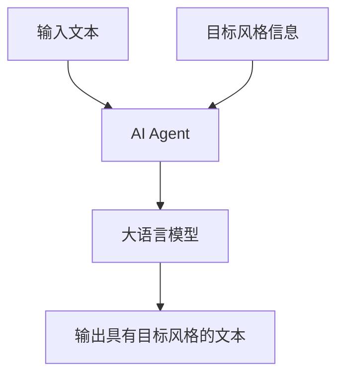

# 基于LLM的AI Agent文本风格迁移

> 关键词：LLM（大语言模型）、AI Agent、文本风格迁移、自然语言处理、深度学习

> 摘要：本文聚焦于基于大语言模型（LLM）的AI Agent文本风格迁移技术。首先介绍该技术的背景，包括目的、预期读者等内容。接着阐述核心概念与联系，详细剖析其原理和架构。通过Python代码讲解核心算法原理及具体操作步骤，并给出相关数学模型和公式。然后通过项目实战，展示代码实际案例并进行详细解释。之后探讨该技术的实际应用场景，推荐学习、开发工具及相关论文著作。最后总结未来发展趋势与挑战，还设有附录解答常见问题，并提供扩展阅读与参考资料，旨在为读者全面呈现基于LLM的AI Agent文本风格迁移的相关知识和技术。

## 1. 背景介绍 
### 1.1 目的和范围
在当今信息爆炸的时代，文本在各个领域都有着广泛的应用。不同的场景和受众往往需要不同风格的文本表达，例如正式的商务文档、活泼的社交媒体文案、严谨的学术论文等。基于LLM的AI Agent文本风格迁移技术的目的就是实现文本在不同风格之间的转换，以满足多样化的文本需求。

本技术的范围涵盖了自然语言处理领域，涉及到文本的理解、生成和风格建模等多个方面。它可以应用于多种文本类型，包括但不限于新闻报道、小说、诗歌、广告文案等。通过使用大语言模型和AI Agent的结合，能够在不同风格之间进行有效的迁移，提升文本的适用性和吸引力。

### 1.2 预期读者
本文的预期读者包括自然语言处理领域的研究人员、人工智能开发者、对文本处理技术感兴趣的程序员以及相关领域的学者。对于想要深入了解基于LLM的AI Agent文本风格迁移技术的原理、实现和应用的人员，本文将提供详细的知识和技术指导。

### 1.3 文档结构概述
本文将按照以下结构进行组织：首先介绍核心概念与联系，包括相关原理和架构；接着讲解核心算法原理及具体操作步骤，通过Python代码进行详细阐述；然后给出数学模型和公式，并进行详细讲解和举例说明；之后通过项目实战展示代码实际案例并进行解释；再探讨实际应用场景；推荐学习、开发工具及相关论文著作；最后总结未来发展趋势与挑战，设有附录解答常见问题并提供扩展阅读与参考资料。

### 1.4 术语表
#### 1.4.1 核心术语定义
- **LLM（大语言模型）**：是一种基于深度学习的语言模型，通过在大规模文本数据上进行训练，能够学习到语言的模式和规律，从而生成自然流畅的文本。
- **AI Agent（人工智能智能体）**：是一种能够感知环境、做出决策并采取行动的智能实体。在文本风格迁移中，AI Agent可以根据输入的文本和目标风格，进行相应的处理和转换。
- **文本风格迁移**：指将给定文本的风格从一种转换为另一种的过程，例如将正式风格的文本转换为口语化风格的文本。

#### 1.4.2 相关概念解释
- **自然语言处理（NLP）**：是人工智能领域的一个重要分支，主要研究如何让计算机理解和处理人类语言。文本风格迁移是自然语言处理中的一个具体任务。
- **深度学习**：是一种基于人工神经网络的机器学习方法，在自然语言处理中被广泛应用。大语言模型就是基于深度学习技术构建的。

#### 1.4.3 缩略词列表
- **LLM**：Large Language Model（大语言模型）
- **AI**：Artificial Intelligence（人工智能）
- **NLP**：Natural Language Processing（自然语言处理）

## 2. 核心概念与联系 

### 核心概念原理
基于LLM的AI Agent文本风格迁移的核心原理是利用大语言模型强大的语言理解和生成能力，结合AI Agent的决策和控制机制，实现文本风格的迁移。

大语言模型通过在大规模文本数据上进行预训练，学习到了丰富的语言知识和模式。在文本风格迁移中，它可以作为一个语言生成器，根据输入的文本和目标风格信息，生成具有目标风格的文本。

AI Agent则负责感知输入文本的特征和目标风格的要求，制定相应的迁移策略，并控制大语言模型的生成过程。它可以根据不同的情况进行决策，例如选择合适的提示词、调整生成参数等，以确保生成的文本符合目标风格。

### 架构的文本示意图
```plaintext
输入文本 -> AI Agent（感知文本特征、确定目标风格、制定迁移策略） -> 大语言模型（根据策略生成文本） -> 输出具有目标风格的文本
```

### Mermaid流程图


## 3. 核心算法原理 & 具体操作步骤 

### 核心算法原理
基于LLM的AI Agent文本风格迁移的核心算法主要包括以下几个步骤：

1. **文本特征提取**：对输入的文本进行特征提取，以获取文本的语义和风格信息。可以使用预训练的语言模型来提取文本的嵌入表示。
2. **风格分类**：根据目标风格信息，对文本进行风格分类。可以使用分类器或基于规则的方法来确定文本的风格类别。
3. **迁移策略制定**：AI Agent根据文本特征和风格分类结果，制定相应的迁移策略。例如，选择合适的提示词、调整生成参数等。
4. **文本生成**：大语言模型根据迁移策略，生成具有目标风格的文本。

### 具体操作步骤及Python源代码

以下是一个简单的基于Hugging Face Transformers库的示例代码，演示了如何使用GPT-2模型进行文本风格迁移：

```python
from transformers import GPT2LMHeadModel, GPT2Tokenizer

# 加载预训练的GPT-2模型和分词器
model_name = "gpt2"
tokenizer = GPT2Tokenizer.from_pretrained(model_name)
model = GPT2LMHeadModel.from_pretrained(model_name)

# 输入文本和目标风格提示词
input_text = "This is a simple example."
target_style_prompt = "Write in a more creative style: "

# 构建输入
input_prompt = target_style_prompt + input_text
input_ids = tokenizer.encode(input_prompt, return_tensors="pt")

# 生成文本
output = model.generate(input_ids, max_length=100, num_return_sequences=1)

# 解码输出
generated_text = tokenizer.decode(output[0], skip_special_tokens=True)

# 提取生成的文本部分（去除提示词）
generated_text = generated_text[len(target_style_prompt):]

print("输入文本:", input_text)
print("生成的具有目标风格的文本:", generated_text)
```

### 代码解释
1. **加载模型和分词器**：使用Hugging Face Transformers库加载预训练的GPT-2模型和对应的分词器。
2. **构建输入**：将目标风格提示词和输入文本组合成一个新的输入。
3. **生成文本**：使用模型的`generate`方法生成文本，设置最大长度和返回序列数量。
4. **解码输出**：使用分词器将生成的文本解码为字符串。
5. **提取生成的文本部分**：去除提示词，得到最终的具有目标风格的文本。

## 4. 数学模型和公式 & 详细讲解 & 举例说明 

### 文本特征提取的数学模型
在文本特征提取中，通常使用预训练的语言模型将文本转换为向量表示。假设输入文本为 $x$，预训练语言模型为 $f$，则文本的特征向量 $h$ 可以表示为：

$$h = f(x)$$

例如，对于BERT模型，输入文本 $x$ 经过分词和编码后，通过BERT模型的多层Transformer结构，最终得到文本的特征向量 $h$。

### 风格分类的数学模型
风格分类可以使用分类器来实现。假设分类器为 $g$，输入的文本特征向量为 $h$，风格类别为 $y$，则风格分类的过程可以表示为：

$$y = g(h)$$

例如，使用逻辑回归分类器，分类器的输出为每个风格类别的概率，选择概率最大的类别作为最终的风格类别。

### 文本生成的数学模型
在文本生成中，大语言模型根据输入的文本和迁移策略生成下一个词的概率分布。假设当前的输入文本为 $x_{1:n}$，模型的参数为 $\theta$，则生成下一个词 $x_{n+1}$ 的概率可以表示为：

$$P(x_{n+1} | x_{1:n}; \theta)$$

例如，在GPT-2模型中，使用自回归的方式生成文本，每次根据当前的输入生成下一个词的概率分布，然后根据概率分布采样得到下一个词。

### 举例说明
假设输入文本为 "This is a beautiful day."，目标风格为 "poetic"（诗意风格）。

1. **文本特征提取**：使用BERT模型将输入文本转换为特征向量 $h$。
2. **风格分类**：使用分类器判断输入文本的风格为 "normal"（普通风格），目标风格为 "poetic"。
3. **迁移策略制定**：AI Agent选择合适的提示词 "In a poetic way: " 作为迁移策略。
4. **文本生成**：大语言模型根据提示词和输入文本生成具有诗意风格的文本，例如 "This is a day of beauty's embrace."

## 5. 项目实战：代码实际案例和详细解释说明 

### 5.1  开发环境搭建
1. **安装Python**：确保系统中安装了Python 3.6及以上版本。
2. **安装依赖库**：使用pip安装必要的库，例如Hugging Face Transformers库、torch等。

```bash
pip install transformers torch
```

### 5.2  源代码详细实现和代码解读
以下是一个更完整的项目实战代码示例，实现了一个简单的文本风格迁移系统：

```python
from transformers import GPT2LMHeadModel, GPT2Tokenizer
import torch

# 加载预训练的GPT-2模型和分词器
model_name = "gpt2"
tokenizer = GPT2Tokenizer.from_pretrained(model_name)
model = GPT2LMHeadModel.from_pretrained(model_name)

# 定义风格提示词映射
style_prompts = {
    "formal": "Write in a formal style: ",
    "informal": "Write in an informal style: ",
    "poetic": "Write in a poetic style: "
}

def style_transfer(input_text, target_style):
    # 获取目标风格提示词
    if target_style not in style_prompts:
        raise ValueError("Unsupported style")
    target_style_prompt = style_prompts[target_style]

    # 构建输入
    input_prompt = target_style_prompt + input_text
    input_ids = tokenizer.encode(input_prompt, return_tensors="pt")

    # 生成文本
    output = model.generate(input_ids, max_length=100, num_return_sequences=1)

    # 解码输出
    generated_text = tokenizer.decode(output[0], skip_special_tokens=True)

    # 提取生成的文本部分（去除提示词）
    generated_text = generated_text[len(target_style_prompt):]

    return generated_text

# 示例使用
input_text = "This is a nice day."
target_style = "poetic"
result = style_transfer(input_text, target_style)
print("输入文本:", input_text)
print("目标风格:", target_style)
print("生成的具有目标风格的文本:", result)
```

### 代码解读与分析
1. **加载模型和分词器**：使用Hugging Face Transformers库加载预训练的GPT-2模型和对应的分词器。
2. **定义风格提示词映射**：定义一个字典，将不同的目标风格映射到相应的提示词。
3. **`style_transfer`函数**：实现了文本风格迁移的核心逻辑。根据输入的文本和目标风格，选择合适的提示词，构建输入，生成文本并解码输出。
4. **示例使用**：调用`style_transfer`函数进行文本风格迁移，并打印结果。

## 6. 实际应用场景 
### 内容创作
在内容创作领域，基于LLM的AI Agent文本风格迁移技术可以帮助创作者快速生成不同风格的文本。例如，作家可以使用该技术将初稿的风格进行调整，使其更符合目标读者的喜好；广告文案撰写人员可以根据不同的产品和受众，将文案的风格在正式、活泼、幽默等之间进行转换。

### 多语言翻译
在多语言翻译中，除了翻译文本的内容，还需要考虑目标语言的风格。该技术可以帮助翻译人员在翻译过程中调整文本的风格，使其更符合目标语言的习惯和文化背景。例如，将中文的正式商务文档翻译成英文时，可以使用该技术将英文译文的风格调整为正式商务风格。

### 智能客服
在智能客服系统中，不同的客户可能有不同的沟通风格。该技术可以使智能客服根据客户的风格进行相应的回复，提高客户的满意度。例如，对于语气友好的客户，智能客服可以使用更亲切的风格进行回复；对于语气严肃的客户，智能客服可以使用更正式的风格进行回复。

### 教育领域
在教育领域，该技术可以帮助学生学习不同风格的写作。教师可以使用该技术为学生提供不同风格的范文，让学生进行模仿和学习。同时，学生也可以使用该技术将自己的作文进行风格转换，以检查自己的写作是否符合不同的要求。

## 7. 工具和资源推荐
### 7.1 学习资源推荐
#### 7.1.1 书籍推荐
- 《自然语言处理入门》：介绍了自然语言处理的基本概念、方法和技术，适合初学者入门。
- 《深度学习》：全面介绍了深度学习的原理、算法和应用，对于理解大语言模型的原理有很大帮助。
- 《Python自然语言处理实战》：通过实际案例介绍了Python在自然语言处理中的应用，包括文本处理、分类、生成等任务。

#### 7.1.2 在线课程
- Coursera上的“Natural Language Processing Specialization”：由知名教授授课，系统地介绍了自然语言处理的各个方面。
- edX上的“Deep Learning for Natural Language Processing”：专注于深度学习在自然语言处理中的应用，包括大语言模型的使用和训练。
- 哔哩哔哩上的相关自然语言处理教程：有很多优秀的UP主分享自然语言处理的学习经验和代码实现。

#### 7.1.3 技术博客和网站
- Hugging Face博客：提供了关于大语言模型和自然语言处理的最新研究成果和技术文章。
- Towards Data Science：有很多关于人工智能和自然语言处理的高质量文章，包括文本风格迁移的相关内容。
- 机器之心：关注人工智能领域的前沿动态和技术发展，提供了很多有价值的资讯和分析。

### 7.2 开发工具框架推荐
#### 7.2.1 IDE和编辑器
- PyCharm：是一款功能强大的Python集成开发环境，提供了代码编辑、调试、版本控制等功能，适合开发基于Python的自然语言处理项目。
- Visual Studio Code：是一款轻量级的代码编辑器，支持多种编程语言和插件，对于快速开发和调试自然语言处理代码非常方便。

#### 7.2.2 调试和性能分析工具
- TensorBoard：是TensorFlow的可视化工具，可以用于查看模型的训练过程、损失曲线、准确率等信息，帮助调试和优化模型。
- PyTorch Profiler：是PyTorch的性能分析工具，可以分析模型的运行时间、内存使用等情况，帮助发现性能瓶颈。

#### 7.2.3 相关框架和库
- Hugging Face Transformers：提供了丰富的预训练语言模型和工具，方便进行文本生成、分类、翻译等任务。
- NLTK（Natural Language Toolkit）：是Python中常用的自然语言处理库，提供了文本处理、分词、词性标注等功能。
- SpaCy：是另一个流行的自然语言处理库，具有高效的处理速度和丰富的语言模型，适合大规模文本处理任务。

### 7.3 相关论文著作推荐
#### 7.3.1 经典论文
- “Attention Is All You Need”：介绍了Transformer架构，是大语言模型的基础。
- “BERT: Pre-training of Deep Bidirectional Transformers for Language Understanding”：提出了BERT模型，开创了预训练语言模型的新时代。
- “GPT: Generative Pretrained Transformer”：介绍了GPT系列模型的原理和应用。

#### 7.3.2 最新研究成果
- 关注ACL（Association for Computational Linguistics）、EMNLP（Conference on Empirical Methods in Natural Language Processing）等自然语言处理领域的顶级会议，了解最新的研究成果和技术进展。
- 查阅arXiv上关于文本风格迁移和大语言模型的最新论文，获取前沿的研究思路和方法。

#### 7.3.3 应用案例分析
- 研究一些实际应用中使用基于LLM的AI Agent文本风格迁移技术的案例，了解其在不同场景下的应用效果和实现方法。例如，分析某些智能客服系统、内容创作平台中使用该技术的具体案例。

## 8. 总结：未来发展趋势与挑战
### 未来发展趋势
1. **更强大的大语言模型**：随着技术的不断发展，大语言模型将变得更加智能和强大。未来的大语言模型可能具有更高的语言理解能力和生成质量，能够更好地实现文本风格迁移。
2. **个性化风格迁移**：根据用户的个性化需求，实现更加精准的文本风格迁移。例如，根据用户的历史偏好、写作习惯等因素，生成符合用户个性化风格的文本。
3. **跨模态风格迁移**：除了文本风格迁移，未来可能会将该技术扩展到跨模态领域，例如实现图像、视频等与文本之间的风格迁移。
4. **与其他技术的融合**：与知识图谱、强化学习等技术进行融合，提高文本风格迁移的效果和效率。例如，利用知识图谱提供更多的背景知识，帮助模型更好地理解文本和风格。

### 挑战
1. **风格定义和量化**：目前对于文本风格的定义和量化还存在一定的困难。不同的人对于同一种风格可能有不同的理解，如何准确地定义和量化风格是一个需要解决的问题。
2. **数据质量和多样性**：高质量、多样化的训练数据是实现良好文本风格迁移的关键。然而，获取足够的、具有代表性的训练数据并不容易，特别是对于一些特定领域和风格的文本。
3. **计算资源和效率**：大语言模型的训练和推理需要大量的计算资源和时间。如何在有限的计算资源下提高文本风格迁移的效率，是一个需要解决的挑战。
4. **伦理和法律问题**：在使用AI Agent进行文本风格迁移时，可能会涉及到伦理和法律问题，例如生成虚假信息、侵犯知识产权等。如何确保技术的合法、合规和安全使用，是一个重要的问题。

## 9. 附录：常见问题与解答
### 1. 基于LLM的AI Agent文本风格迁移技术的准确性如何？
文本风格迁移的准确性受到多种因素的影响，包括大语言模型的性能、训练数据的质量和多样性、迁移策略的合理性等。目前的技术在一些常见风格的迁移上已经取得了较好的效果，但在一些复杂风格和特定领域的文本上，仍然存在一定的提升空间。

### 2. 如何选择合适的大语言模型进行文本风格迁移？
选择合适的大语言模型需要考虑多个因素，例如模型的性能、适用场景、计算资源等。一般来说，GPT系列、BERT系列等预训练语言模型都可以用于文本风格迁移。对于不同的任务和需求，可以根据实际情况选择合适的模型。

### 3. 该技术在处理长文本时是否有效？
在处理长文本时，该技术可能会面临一些挑战，例如计算资源的限制、上下文信息的丢失等。为了提高处理长文本的效果，可以采用一些技术手段，例如分段处理、使用长文本处理模型等。

### 4. 如何评估文本风格迁移的效果？
评估文本风格迁移的效果可以从多个方面进行，例如风格的准确性、语义的一致性、文本的流畅性等。可以使用人工评估和自动评估相结合的方法，例如让人类评委对生成的文本进行打分，同时使用一些自动评估指标，如BLEU、ROUGE等。

## 10. 扩展阅读 & 参考资料
- Hugging Face官方文档：https://huggingface.co/docs/transformers/index
- 《自然语言处理综论》（第三版），Daniel Jurafsky和James H. Martin著
- ACL Anthology：https://aclanthology.org/ ，获取自然语言处理领域的学术论文
- 相关开源项目的GitHub仓库，例如Hugging Face Transformers的GitHub仓库：https://github.com/huggingface/transformers