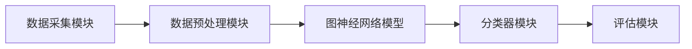

# 基于图神经网络的AI社交网络假新闻检测系统

> 关键词：图神经网络、AI、社交网络、假新闻检测、数据挖掘、机器学习、深度学习

> 摘要：本文围绕基于图神经网络的AI社交网络假新闻检测系统展开深入研究。首先介绍了该系统开发的背景、目的、预期读者以及相关术语。接着阐述了图神经网络、社交网络和假新闻检测的核心概念及相互联系，给出了原理和架构的文本示意图与Mermaid流程图。详细讲解了核心算法原理，并通过Python源代码进行具体阐述，同时给出了相关数学模型和公式。在项目实战部分，从开发环境搭建、源代码实现到代码解读进行了全面说明。探讨了该系统的实际应用场景，推荐了学习资源、开发工具框架以及相关论文著作。最后总结了未来发展趋势与挑战，解答了常见问题并提供了扩展阅读和参考资料，旨在为构建高效的社交网络假新闻检测系统提供全面且深入的技术指导。

## 1. 背景介绍 
### 1.1 目的和范围
在当今数字化时代，社交网络已经成为人们获取信息和交流的重要平台。然而，大量假新闻在社交网络上肆意传播，给个人、社会乃至国家都带来了严重的负面影响。假新闻可能导致公众产生错误的认知，引发社会恐慌，甚至影响政治决策。因此，开发一种高效准确的假新闻检测系统具有重要的现实意义。

本系统的目的在于利用图神经网络的强大能力，对社交网络中的新闻进行实时、准确的检测，判断其真实性。系统的范围涵盖了多种常见的社交网络平台，能够处理不同类型的新闻数据，包括文本、图像、视频等。

### 1.2 预期读者
本文的预期读者主要包括从事人工智能、数据挖掘、机器学习等领域的研究人员和开发者，希望深入了解图神经网络在假新闻检测中的应用。同时，对于关注社交网络信息真实性的政策制定者、媒体从业者以及普通用户也具有一定的参考价值。

### 1.3 文档结构概述
本文将按照以下结构进行组织：首先介绍背景信息，包括目的、预期读者和文档结构概述以及相关术语。接着阐述核心概念与联系，包括图神经网络、社交网络和假新闻检测的原理和架构。然后详细讲解核心算法原理和具体操作步骤，并给出相关数学模型和公式。在项目实战部分，将介绍开发环境搭建、源代码实现和代码解读。之后探讨实际应用场景，推荐学习资源、开发工具框架和相关论文著作。最后总结未来发展趋势与挑战，解答常见问题并提供扩展阅读和参考资料。

### 1.4 术语表
#### 1.4.1 核心术语定义
- **图神经网络（Graph Neural Network，GNN）**：是一种专门处理图结构数据的神经网络，通过节点之间的连接关系来学习节点和图的特征表示。
- **社交网络（Social Network）**：是由个体或组织之间的关系构成的网络，通过社交平台进行信息传播和交流。
- **假新闻（Fake News）**：指故意编造、传播的虚假信息，通常具有误导性和欺骗性。
- **特征表示（Feature Representation）**：将原始数据转换为计算机能够处理的向量或矩阵形式，以便进行机器学习和深度学习任务。
- **节点（Node）**：在图结构中表示实体，如社交网络中的用户、新闻文章等。
- **边（Edge）**：连接图中的节点，表示节点之间的关系，如用户之间的关注关系、新闻与用户的传播关系等。

#### 1.4.2 相关概念解释
- **图结构数据**：由节点和边组成的数据结构，能够很好地表示实体之间的关系。在社交网络中，用户可以看作节点，用户之间的互动关系可以看作边。
- **深度学习**：是机器学习的一个分支，通过构建多层神经网络来学习数据的复杂特征和模式。
- **数据挖掘**：从大量数据中发现有价值的信息和知识的过程，包括数据预处理、特征提取、模型训练等步骤。

#### 1.4.3 缩略词列表
- **GNN**：Graph Neural Network（图神经网络）
- **CNN**：Convolutional Neural Network（卷积神经网络）
- **RNN**：Recurrent Neural Network（循环神经网络）
- **MLP**：Multi - Layer Perceptron（多层感知机）

## 2. 核心概念与联系 
### 核心概念原理

#### 图神经网络（GNN）
图神经网络是一种用于处理图结构数据的深度学习模型。其基本思想是通过节点之间的消息传递来更新节点的特征表示。在每一层的消息传递过程中，节点会聚合其邻居节点的特征信息，并结合自身的特征进行更新。

图神经网络的核心操作包括消息传递（Message Passing）、聚合（Aggregation）和更新（Update）。消息传递阶段，节点会向其邻居节点发送消息；聚合阶段，节点会收集邻居节点的消息并进行聚合；更新阶段，节点会根据聚合的结果更新自身的特征。

#### 社交网络
社交网络是由大量用户和他们之间的关系构成的网络。用户在社交网络中可以发布、传播和获取信息。社交网络的结构可以用图来表示，用户作为节点，用户之间的关注、评论、转发等关系作为边。社交网络中的信息传播具有快速、广泛的特点，这也使得假新闻容易在其中迅速扩散。

#### 假新闻检测
假新闻检测的目标是判断一篇新闻是否为假新闻。传统的假新闻检测方法主要基于文本内容分析，如关键词匹配、情感分析等。然而，这些方法往往忽略了新闻在社交网络中的传播信息。基于图神经网络的假新闻检测方法可以综合考虑新闻的文本内容、传播路径以及用户之间的关系等多方面信息，从而提高检测的准确性。

### 架构的文本示意图
基于图神经网络的AI社交网络假新闻检测系统主要由以下几个部分组成：

1. **数据采集模块**：负责从社交网络平台收集新闻数据和用户关系数据。
2. **数据预处理模块**：对采集到的数据进行清洗、标注和特征提取，将其转换为适合图神经网络处理的图结构数据。
3. **图神经网络模型**：接收预处理后的图结构数据，通过多层的消息传递和特征更新，学习新闻和用户的特征表示。
4. **分类器模块**：根据图神经网络学习到的特征表示，对新闻进行分类，判断其是否为假新闻。
5. **评估模块**：对检测结果进行评估，计算准确率、召回率、F1值等指标，以评估系统的性能。

### Mermaid流程图


## 3. 核心算法原理 & 具体操作步骤 
### 核心算法原理

基于图神经网络的假新闻检测算法主要基于图卷积网络（Graph Convolutional Network，GCN）。GCN是一种常见的图神经网络模型，其核心思想是通过邻居节点的特征信息来更新当前节点的特征。

设图 $G=(V, E)$，其中 $V$ 是节点集合，$E$ 是边集合。节点 $i$ 的特征向量为 $x_i$，其邻居节点集合为 $N(i)$。在第 $l$ 层的GCN中，节点 $i$ 的特征更新公式如下：

$$h_i^{(l + 1)}=\sigma\left(\sum_{j\in N(i)\cup\{i\}}\frac{1}{\sqrt{d_id_j}}W^{(l)}h_j^{(l)}\right)$$

其中，$h_i^{(l)}$ 是节点 $i$ 在第 $l$ 层的特征表示，$d_i$ 是节点 $i$ 的度，$W^{(l)}$ 是第 $l$ 层的可学习权重矩阵，$\sigma$ 是激活函数，如ReLU函数。

### 具体操作步骤

#### 步骤1：数据采集
使用网络爬虫技术从社交网络平台上采集新闻数据和用户关系数据。新闻数据包括新闻标题、正文、发布时间等信息，用户关系数据包括用户之间的关注、评论、转发等关系。

#### 步骤2：数据预处理
1. **数据清洗**：去除重复、无效的数据，处理缺失值和异常值。
2. **特征提取**：对于新闻文本，使用词嵌入技术（如Word2Vec、GloVe）将文本转换为向量表示；对于用户关系数据，构建图结构数据，节点表示用户和新闻，边表示用户之间的关系和新闻的传播关系。
3. **数据标注**：根据已知的真实新闻和假新闻数据，对采集到的新闻进行标注，0表示假新闻，1表示真实新闻。

#### 步骤3：图神经网络模型训练
1. **划分数据集**：将预处理后的数据划分为训练集、验证集和测试集，通常比例为70%、15%、15%。
2. **初始化模型参数**：随机初始化GCN模型的权重矩阵 $W^{(l)}$。
3. **前向传播**：将训练集数据输入到GCN模型中，通过多层的消息传递和特征更新，得到新闻和用户的特征表示。
4. **损失计算**：使用交叉熵损失函数计算模型的预测结果与真实标签之间的损失。
5. **反向传播**：根据损失函数的梯度，使用优化算法（如随机梯度下降SGD、Adam）更新模型的参数。
6. **模型评估**：在验证集上评估模型的性能，调整模型的超参数（如学习率、层数等），直到模型性能达到最优。

#### 步骤4：假新闻检测
将测试集数据输入到训练好的模型中，得到新闻的预测标签，判断其是否为假新闻。

### Python源代码详细阐述

```python
import torch
import torch.nn.functional as F
from torch_geometric.nn import GCNConv

# 定义GCN模型
class GCN(torch.nn.Module):
    def __init__(self, in_channels, hidden_channels, out_channels):
        super(GCN, self).__init__()
        # 第一层GCN卷积层
        self.conv1 = GCNConv(in_channels, hidden_channels)
        # 第二层GCN卷积层
        self.conv2 = GCNConv(hidden_channels, out_channels)

    def forward(self, x, edge_index):
        # 第一层卷积和激活
        x = self.conv1(x, edge_index)
        x = F.relu(x)
        x = F.dropout(x, training=self.training)
        # 第二层卷积
        x = self.conv2(x, edge_index)
        return F.log_softmax(x, dim=1)

# 训练模型
def train(model, optimizer, data):
    model.train()
    optimizer.zero_grad()
    out = model(data.x, data.edge_index)
    loss = F.nll_loss(out[data.train_mask], data.y[data.train_mask])
    loss.backward()
    optimizer.step()
    return loss.item()

# 测试模型
def test(model, data):
    model.eval()
    out = model(data.x, data.edge_index)
    pred = out.argmax(dim=1)
    test_correct = pred[data.test_mask] == data.y[data.test_mask]
    test_acc = int(test_correct.sum()) / int(data.test_mask.sum())
    return test_acc

# 主函数
if __name__ == '__main__':
    # 假设已经有处理好的图数据data
    # 定义模型
    model = GCN(in_channels=data.num_node_features, hidden_channels=16, out_channels=2)
    optimizer = torch.optim.Adam(model.parameters(), lr=0.01, weight_decay=5e-4)

    for epoch in range(200):
        loss = train(model, optimizer, data)
        if epoch % 10 == 0:
            test_acc = test(model, data)
            print(f'Epoch: {epoch}, Loss: {loss:.4f}, Test Acc: {test_acc:.4f}')
```

## 4. 数学模型和公式 & 详细讲解 & 举例说明 

### 图卷积网络（GCN）的数学模型和公式

#### 邻接矩阵和度矩阵
设图 $G=(V, E)$ 有 $N$ 个节点，其邻接矩阵 $A$ 是一个 $N\times N$ 的矩阵，其中 $A_{ij}=1$ 表示节点 $i$ 和节点 $j$ 之间有边相连，$A_{ij}=0$ 表示没有边相连。度矩阵 $D$ 是一个对角矩阵，$D_{ii}=\sum_{j = 1}^{N}A_{ij}$，表示节点 $i$ 的度。

#### 归一化邻接矩阵
为了避免在消息传递过程中出现梯度消失或爆炸的问题，需要对邻接矩阵进行归一化处理。常用的归一化方法是对称归一化，得到归一化邻接矩阵 $\tilde{A}=\hat{D}^{-\frac{1}{2}}\hat{A}\hat{D}^{-\frac{1}{2}}$，其中 $\hat{A}=A + I$（$I$ 是单位矩阵），$\hat{D}$ 是 $\hat{A}$ 的度矩阵。

#### GCN的特征更新公式
在第 $l$ 层的GCN中，节点的特征更新公式可以表示为矩阵形式：

$$H^{(l + 1)}=\sigma\left(\tilde{A}H^{(l)}W^{(l)}\right)$$

其中，$H^{(l)}$ 是第 $l$ 层的节点特征矩阵，$W^{(l)}$ 是第 $l$ 层的可学习权重矩阵，$\sigma$ 是激活函数。

### 详细讲解

#### 邻接矩阵和度矩阵的作用
邻接矩阵 $A$ 描述了图中节点之间的连接关系，度矩阵 $D$ 反映了每个节点的连接程度。通过对邻接矩阵进行归一化处理，可以使得不同节点的特征更新更加平衡。

#### 归一化邻接矩阵的意义
对称归一化的邻接矩阵 $\tilde{A}$ 可以确保在消息传递过程中，节点的特征更新不会因为节点的度不同而出现过大或过小的情况，从而提高模型的稳定性和收敛速度。

#### GCN的特征更新过程
在每一层的GCN中，节点会通过归一化邻接矩阵 $\tilde{A}$ 聚合其邻居节点的特征信息，然后与可学习的权重矩阵 $W^{(l)}$ 相乘，最后通过激活函数 $\sigma$ 进行非线性变换，得到更新后的节点特征。

### 举例说明

假设有一个简单的图，包含3个节点，其邻接矩阵 $A$ 为：

$$A=\begin{bmatrix}
0 & 1 & 1\\
1 & 0 & 0\\
1 & 0 & 0
\end{bmatrix}$$

度矩阵 $D$ 为：

$$D=\begin{bmatrix}
2 & 0 & 0\\
0 & 1 & 0\\
0 & 0 & 1
\end{bmatrix}$$

$\hat{A}=A + I$ 为：

$$\hat{A}=\begin{bmatrix}
1 & 1 & 1\\
1 & 1 & 0\\
1 & 0 & 1
\end{bmatrix}$$

$\hat{D}$ 为：

$$\hat{D}=\begin{bmatrix}
3 & 0 & 0\\
0 & 2 & 0\\
0 & 0 & 2
\end{bmatrix}$$

归一化邻接矩阵 $\tilde{A}=\hat{D}^{-\frac{1}{2}}\hat{A}\hat{D}^{-\frac{1}{2}}$ 为：

$$\tilde{A}=\begin{bmatrix}
\frac{1}{3} & \frac{1}{\sqrt{6}} & \frac{1}{\sqrt{6}}\\
\frac{1}{\sqrt{6}} & \frac{1}{2} & 0\\
\frac{1}{\sqrt{6}} & 0 & \frac{1}{2}
\end{bmatrix}$$

假设第 $l$ 层的节点特征矩阵 $H^{(l)}$ 为：

$$H^{(l)}=\begin{bmatrix}
0.1 & 0.2\\
0.3 & 0.4\\
0.5 & 0.6
\end{bmatrix}$$

可学习的权重矩阵 $W^{(l)}$ 为：

$$W^{(l)}=\begin{bmatrix}
0.7 & 0.8\\
0.9 & 1.0
\end{bmatrix}$$

则第 $l + 1$ 层的节点特征矩阵 $H^{(l + 1)}$ 为：

$$H^{(l + 1)}=\sigma\left(\tilde{A}H^{(l)}W^{(l)}\right)$$

先计算 $\tilde{A}H^{(l)}$：

$$\tilde{A}H^{(l)}=\begin{bmatrix}
\frac{1}{3} & \frac{1}{\sqrt{6}} & \frac{1}{\sqrt{6}}\\
\frac{1}{\sqrt{6}} & \frac{1}{2} & 0\\
\frac{1}{\sqrt{6}} & 0 & \frac{1}{2}
\end{bmatrix}\begin{bmatrix}
0.1 & 0.2\\
0.3 & 0.4\\
0.5 & 0.6
\end{bmatrix}=\begin{bmatrix}
0.23 & 0.33\\
0.22 & 0.31\\
0.26 & 0.36
\end{bmatrix}$$

再计算 $\tilde{A}H^{(l)}W^{(l)}$：

$$\tilde{A}H^{(l)}W^{(l)}=\begin{bmatrix}
0.23 & 0.33\\
0.22 & 0.31\\
0.26 & 0.36
\end{bmatrix}\begin{bmatrix}
0.7 & 0.8\\
0.9 & 1.0
\end{bmatrix}=\begin{bmatrix}
0.44 & 0.54\\
0.40 & 0.49\\
0.49 & 0.59
\end{bmatrix}$$

假设激活函数 $\sigma$ 为ReLU函数，则：

$$H^{(l + 1)}=\begin{bmatrix}
0.44 & 0.54\\
0.40 & 0.49\\
0.49 & 0.59
\end{bmatrix}$$

## 5. 项目实战：代码实际案例和详细解释说明 
### 5.1  开发环境搭建

#### 操作系统
建议使用Linux或Windows操作系统，推荐使用Ubuntu 18.04及以上版本或Windows 10及以上版本。

#### 编程语言
使用Python 3.6及以上版本。

#### 深度学习框架
使用PyTorch和PyTorch Geometric。可以通过以下命令安装：

```bash
pip install torch torchvision
pip install torch-geometric
```

#### 数据处理库
使用NumPy、Pandas等库进行数据处理。可以通过以下命令安装：

```bash
pip install numpy pandas
```

### 5.2  源代码详细实现和代码解读

```python
import torch
import torch.nn.functional as F
from torch_geometric.data import Data
from torch_geometric.nn import GCNConv
import numpy as np
import pandas as pd

# 定义GCN模型
class GCN(torch.nn.Module):
    def __init__(self, in_channels, hidden_channels, out_channels):
        super(GCN, self).__init__()
        # 第一层GCN卷积层
        self.conv1 = GCNConv(in_channels, hidden_channels)
        # 第二层GCN卷积层
        self.conv2 = GCNConv(hidden_channels, out_channels)

    def forward(self, x, edge_index):
        # 第一层卷积和激活
        x = self.conv1(x, edge_index)
        x = F.relu(x)
        x = F.dropout(x, training=self.training)
        # 第二层卷积
        x = self.conv2(x, edge_index)
        return F.log_softmax(x, dim=1)

# 数据预处理函数
def preprocess_data():
    # 假设已经有节点特征数据node_features和边数据edge_list，以及标签数据labels
    node_features = np.random.rand(100, 10)  # 100个节点，每个节点10维特征
    edge_list = np.random.randint(0, 100, size=(2, 200))  # 200条边
    labels = np.random.randint(0, 2, size=100)  # 0或1的标签

    x = torch.tensor(node_features, dtype=torch.float)
    edge_index = torch.tensor(edge_list, dtype=torch.long)
    y = torch.tensor(labels, dtype=torch.long)

    # 划分训练集、验证集和测试集
    train_mask = torch.zeros(100, dtype=torch.bool)
    val_mask = torch.zeros(100, dtype=torch.bool)
    test_mask = torch.zeros(100, dtype=torch.bool)

    train_mask[:70] = True
    val_mask[70:85] = True
    test_mask[85:] = True

    data = Data(x=x, edge_index=edge_index, y=y, train_mask=train_mask, val_mask=val_mask, test_mask=test_mask)
    return data

# 训练模型
def train(model, optimizer, data):
    model.train()
    optimizer.zero_grad()
    out = model(data.x, data.edge_index)
    loss = F.nll_loss(out[data.train_mask], data.y[data.train_mask])
    loss.backward()
    optimizer.step()
    return loss.item()

# 验证模型
def validate(model, data):
    model.eval()
    out = model(data.x, data.edge_index)
    pred = out.argmax(dim=1)
    val_correct = pred[data.val_mask] == data.y[data.val_mask]
    val_acc = int(val_correct.sum()) / int(data.val_mask.sum())
    return val_acc

# 测试模型
def test(model, data):
    model.eval()
    out = model(data.x, data.edge_index)
    pred = out.argmax(dim=1)
    test_correct = pred[data.test_mask] == data.y[data.test_mask]
    test_acc = int(test_correct.sum()) / int(data.test_mask.sum())
    return test_acc

# 主函数
if __name__ == '__main__':
    data = preprocess_data()
    # 定义模型
    model = GCN(in_channels=data.num_node_features, hidden_channels=16, out_channels=2)
    optimizer = torch.optim.Adam(model.parameters(), lr=0.01, weight_decay=5e-4)

    best_val_acc = 0
    for epoch in range(200):
        loss = train(model, optimizer, data)
        val_acc = validate(model, data)
        if val_acc > best_val_acc:
            best_val_acc = val_acc
            torch.save(model.state_dict(), 'best_model.pth')
        if epoch % 10 == 0:
            test_acc = test(model, data)
            print(f'Epoch: {epoch}, Loss: {loss:.4f}, Val Acc: {val_acc:.4f}, Test Acc: {test_acc:.4f}')

    # 加载最佳模型
    model.load_state_dict(torch.load('best_model.pth'))
    final_test_acc = test(model, data)
    print(f'Final Test Acc: {final_test_acc:.4f}')
```

### 5.3  代码解读与分析

#### 数据预处理部分
`preprocess_data` 函数用于生成模拟的节点特征数据、边数据和标签数据，并将其转换为PyTorch Geometric的 `Data` 对象。同时，划分训练集、验证集和测试集的掩码。

#### 模型定义部分
`GCN` 类定义了一个两层的GCN模型，包含两个GCN卷积层和ReLU激活函数。

#### 训练部分
`train` 函数用于训练模型，计算损失并进行反向传播更新模型参数。

#### 验证部分
`validate` 函数用于在验证集上评估模型的性能，选择最佳的模型参数。

#### 测试部分
`test` 函数用于在测试集上评估模型的最终性能。

#### 主函数部分
在主函数中，首先调用 `preprocess_data` 函数进行数据预处理，然后定义模型和优化器。在训练过程中，不断更新模型参数，并记录最佳的验证准确率。最后加载最佳模型，在测试集上进行最终的评估。

## 6. 实际应用场景 
### 社交媒体平台
社交媒体平台是假新闻传播的重灾区。基于图神经网络的AI社交网络假新闻检测系统可以实时监测用户发布的新闻内容，结合用户之间的关系和新闻的传播路径，快速准确地判断新闻的真实性。对于检测到的假新闻，平台可以采取屏蔽、标注等措施，减少假新闻的传播。

### 新闻媒体机构
新闻媒体机构可以利用该系统对采集到的新闻素材进行真实性验证。在发布新闻之前，先通过系统进行检测，避免发布虚假新闻，提高媒体的公信力。同时，该系统还可以帮助媒体机构发现新闻事件中的潜在虚假信息，为深入调查提供线索。

### 政府部门
政府部门可以利用该系统监测社交网络上的舆论动态，及时发现和处理涉及公共安全、社会稳定等方面的假新闻。在重大事件发生时，该系统可以快速准确地判断新闻的真实性，为政府决策提供可靠的信息支持。

### 企业品牌保护
企业可以利用该系统监测社交网络上关于自身品牌的新闻和信息，及时发现和处理虚假负面信息，保护企业的品牌形象和声誉。同时，该系统还可以帮助企业了解市场动态和消费者需求，为企业的市场营销和品牌推广提供参考。

## 7. 工具和资源推荐
### 7.1 学习资源推荐
#### 7.1.1 书籍推荐
- 《深度学习》（Deep Learning）：由Ian Goodfellow、Yoshua Bengio和Aaron Courville合著，是深度学习领域的经典教材，涵盖了深度学习的基本概念、算法和应用。
- 《图神经网络入门与实战》：详细介绍了图神经网络的原理、算法和应用，适合初学者和有一定基础的读者。
- 《Python机器学习》（Python Machine Learning）：介绍了Python在机器学习中的应用，包括数据预处理、模型训练和评估等内容。

#### 7.1.2 在线课程
- Coursera上的“Deep Learning Specialization”：由Andrew Ng教授授课，是深度学习领域的经典在线课程，涵盖了深度学习的各个方面。
- edX上的“Graph Neural Networks”：专门介绍图神经网络的原理和应用，由知名学者授课。
- 中国大学MOOC上的“机器学习基础”：适合初学者学习机器学习的基本概念和算法。

#### 7.1.3 技术博客和网站
- Medium：有许多关于人工智能、机器学习和图神经网络的技术博客文章，作者来自不同的领域和背景。
- arXiv：是一个预印本数据库，包含了大量关于图神经网络和假新闻检测的最新研究成果。
- 知乎：有许多关于人工智能和机器学习的讨论和分享，可以从中获取最新的技术动态和经验。

### 7.2 开发工具框架推荐
#### 7.2.1 IDE和编辑器
- PyCharm：是一款专业的Python集成开发环境，提供了丰富的功能和插件，适合Python开发。
- Jupyter Notebook：是一个交互式的开发环境，适合数据探索、模型训练和可视化。
- Visual Studio Code：是一款轻量级的代码编辑器，支持多种编程语言和插件，适合快速开发和调试。

#### 7.2.2 调试和性能分析工具
- PyTorch Profiler：是PyTorch自带的性能分析工具，可以帮助开发者分析模型的性能瓶颈。
- TensorBoard：是TensorFlow的可视化工具，也可以用于PyTorch模型的可视化和性能分析。
- cProfile：是Python的内置性能分析工具，可以帮助开发者分析代码的性能瓶颈。

#### 7.2.3 相关框架和库
- PyTorch Geometric：是一个用于处理图结构数据的PyTorch扩展库，提供了丰富的图神经网络模型和工具。
- DGL（Deep Graph Library）：是另一个用于处理图结构数据的深度学习框架，支持多种深度学习后端。
- NetworkX：是一个用于创建、操作和研究复杂网络的Python库，可以帮助开发者处理图结构数据。

### 7.3 相关论文著作推荐
#### 7.3.1 经典论文
- “Semi - Supervised Classification with Graph Convolutional Networks”：提出了图卷积网络（GCN）的概念，是图神经网络领域的经典论文。
- “Graph Attention Networks”：提出了图注意力网络（GAT），通过注意力机制提高了图神经网络的性能。
- “Fake News Detection on Social Media: A Data Mining Perspective”：从数据挖掘的角度探讨了社交网络假新闻检测的方法和技术。

#### 7.3.2 最新研究成果
- 关注arXiv上关于图神经网络和假新闻检测的最新论文，了解该领域的最新研究进展。
- 参加相关的学术会议，如NeurIPS、ICML、KDD等，获取最新的研究成果和技术动态。

#### 7.3.3 应用案例分析
- 研究一些实际的社交网络假新闻检测系统的应用案例，了解其系统架构、算法实现和性能评估。
- 分析一些知名社交媒体平台在假新闻检测方面的实践经验和技术手段。

## 8. 总结：未来发展趋势与挑战
### 未来发展趋势

#### 多模态融合
未来的假新闻检测系统将不仅仅依赖于文本信息，还会融合图像、视频、音频等多模态信息。通过多模态融合，可以更全面地分析新闻的真实性，提高检测的准确性。

#### 跨语言和跨文化检测
随着全球化的发展，假新闻的传播不再局限于单一语言和文化。未来的假新闻检测系统需要具备跨语言和跨文化检测的能力，能够处理不同语言和文化背景下的假新闻。

#### 自适应和动态检测
社交网络的结构和用户行为是不断变化的，假新闻的传播模式也在不断演变。未来的假新闻检测系统需要具备自适应和动态检测的能力，能够实时调整检测策略，适应不同的场景和数据变化。

#### 与区块链技术结合
区块链技术具有去中心化、不可篡改等特点，可以用于记录新闻的传播路径和来源信息。将区块链技术与假新闻检测系统结合，可以提高新闻的可信度和可追溯性，增强假新闻检测的效果。

### 挑战

#### 数据质量和标注问题
假新闻检测需要大量的标注数据，但是数据的标注成本较高，且存在标注不准确的问题。同时，社交网络上的数据质量参差不齐，存在噪声和缺失值，这给数据预处理和模型训练带来了挑战。

#### 模型可解释性问题
图神经网络模型通常是黑盒模型，其决策过程难以解释。在假新闻检测中，需要向用户和监管机构解释模型的决策依据，这对模型的可解释性提出了很高的要求。

#### 对抗攻击问题
攻击者可能会采用对抗攻击的手段来干扰假新闻检测系统的正常运行，例如通过修改新闻内容、传播路径等方式来绕过检测。如何提高假新闻检测系统的鲁棒性，抵御对抗攻击，是一个亟待解决的问题。

#### 隐私保护问题
在假新闻检测过程中，需要收集和处理用户的个人信息和行为数据，这涉及到用户的隐私保护问题。如何在保证检测效果的前提下，保护用户的隐私，是一个重要的挑战。

## 9. 附录：常见问题与解答

### 问题1：图神经网络与传统神经网络有什么区别？
图神经网络专门处理图结构数据，考虑了节点之间的连接关系，能够学习到节点和图的全局特征。而传统神经网络（如CNN、RNN）主要处理规则结构的数据（如图像、序列），没有考虑数据之间的关系信息。

### 问题2：如何选择合适的图神经网络模型？
选择合适的图神经网络模型需要考虑数据的特点、任务的需求和计算资源等因素。对于简单的图数据，可以选择GCN等基础模型；对于复杂的图数据和任务，可以选择GAT、GraphSAGE等更强大的模型。

### 问题3：假新闻检测系统的准确率可以达到多高？
假新闻检测系统的准确率受到多种因素的影响，如数据质量、模型选择、特征提取等。目前，一些先进的假新闻检测系统在公开数据集上的准确率可以达到80% - 90%左右，但在实际应用中，准确率可能会受到更多因素的影响而有所下降。

### 问题4：如何处理不平衡数据问题？
在假新闻检测中，真实新闻和假新闻的数量可能存在不平衡的情况。可以采用以下方法处理不平衡数据问题：过采样（如SMOTE算法）、欠采样、调整损失函数的权重等。

### 问题5：如何评估假新闻检测系统的性能？
常用的评估指标包括准确率、召回率、F1值、AUC - ROC等。准确率反映了模型预测正确的比例；召回率反映了模型正确预测出假新闻的比例；F1值是准确率和召回率的调和平均数；AUC - ROC曲线下的面积反映了模型的整体性能。

## 10. 扩展阅读 & 参考资料
### 扩展阅读
- 《人工智能：现代方法》（Artificial Intelligence: A Modern Approach）：全面介绍了人工智能的基本概念、算法和应用，适合深入学习人工智能的读者。
- 《大数据时代》（Big Data: A Revolution That Will Transform How We Live, Work, and Think）：探讨了大数据时代的挑战和机遇，对于理解社交网络数据的特点和应用有帮助。

### 参考资料
- Goodfellow, I., Bengio, Y., & Courville, A. (2016). Deep Learning. MIT Press.
- Kipf, T. N., & Welling, M. (2016). Semi - Supervised Classification with Graph Convolutional Networks. arXiv preprint arXiv:1609.02907.
- Veličković, P., Cucurull, G., Casanova, A., Romero, A., Liò, P., & Bengio, Y. (2017). Graph Attention Networks. arXiv preprint arXiv:1710.10903.
- Shu, K., Sliva, A., Wang, S., Tang, J., & Liu, H. (2017). Fake News Detection on Social Media: A Data Mining Perspective. ACM SIGKDD Explorations Newsletter, 19(1), 22 - 36.