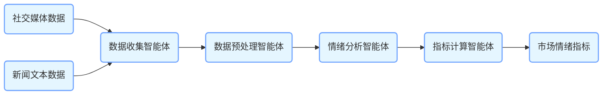

# 基于多智能体的自动化市场情绪指标构建

> 关键词：多智能体、自动化、市场情绪指标、人工智能、金融市场、数据挖掘、情绪分析

> 摘要：本文围绕基于多智能体的自动化市场情绪指标构建展开深入研究。在金融市场中，市场情绪对资产价格波动有着重要影响，准确捕捉市场情绪对于投资者决策和风险管理至关重要。多智能体系统凭借其分布式、自适应等特性，为市场情绪指标的构建提供了新的思路和方法。文章首先介绍了研究的背景和相关概念，接着阐述了核心概念与联系，详细讲解了核心算法原理及具体操作步骤，给出了数学模型和公式并举例说明。通过项目实战展示了代码的实际案例和详细解释，探讨了实际应用场景，推荐了相关工具和资源，最后总结了未来发展趋势与挑战，还提供了常见问题与解答以及扩展阅读和参考资料，旨在为读者全面呈现基于多智能体的自动化市场情绪指标构建的理论与实践。

## 1. 背景介绍 
### 1.1 目的和范围
在金融市场中，市场情绪是投资者对市场的整体看法和预期，它能够影响投资者的决策行为，进而对资产价格产生显著影响。传统的市场分析方法往往侧重于基本面和技术面分析，而忽略了市场情绪这一重要因素。因此，构建准确有效的市场情绪指标具有重要的现实意义。

本研究的目的在于利用多智能体系统的优势，实现自动化的市场情绪指标构建。具体范围包括对金融市场中多种数据源的收集和处理，如新闻文本、社交媒体数据等；运用多智能体系统对这些数据进行分析和挖掘，提取与市场情绪相关的信息；最终构建出能够反映市场情绪变化的指标。

### 1.2 预期读者
本文的预期读者包括金融领域的投资者、分析师、风险管理专家，以及对人工智能、数据挖掘在金融领域应用感兴趣的研究人员和技术人员。对于希望深入了解市场情绪分析和多智能体系统应用的读者，本文将提供有价值的参考。

### 1.3 文档结构概述
本文将按照以下结构进行组织：首先介绍背景信息，包括目的、预期读者和文档结构概述；接着阐述核心概念与联系，包括多智能体系统和市场情绪指标的原理和架构；然后详细讲解核心算法原理及具体操作步骤，并给出数学模型和公式；通过项目实战展示代码的实际案例和详细解释；探讨实际应用场景；推荐相关工具和资源；总结未来发展趋势与挑战；提供常见问题与解答以及扩展阅读和参考资料。

### 1.4 术语表
#### 1.4.1 核心术语定义
- **多智能体系统（Multi - Agent System, MAS）**：由多个智能体组成的系统，每个智能体具有一定的自主性、交互性和适应性，能够在环境中独立或协同完成任务。
- **市场情绪指标**：用于衡量市场参与者对市场的整体看法和预期的量化指标，反映市场的乐观或悲观程度。
- **自动化**：指系统能够自动完成数据收集、处理、分析和指标计算等任务，减少人工干预。

#### 1.4.2 相关概念解释
- **智能体**：具有感知、决策和行动能力的实体，能够根据环境信息做出相应的决策和行动。
- **情绪分析**：通过对文本、语音等数据进行处理和分析，识别其中蕴含的情绪倾向，如积极、消极或中性。
- **数据挖掘**：从大量数据中发现有价值信息和知识的过程。

#### 1.4.3 缩略词列表
- MAS：Multi - Agent System（多智能体系统）
- NLP：Natural Language Processing（自然语言处理）
- ML：Machine Learning（机器学习）

## 2. 核心概念与联系 
### 2.1 多智能体系统原理
多智能体系统由多个智能体组成，这些智能体通过相互通信和协作来完成系统的整体任务。每个智能体具有以下特点：
- **自主性**：智能体能够独立地感知环境信息，并根据自身的知识和规则做出决策和行动。
- **交互性**：智能体之间可以通过通信机制进行信息交换和协作，共同解决问题。
- **适应性**：智能体能够根据环境的变化调整自己的行为和策略，以更好地适应环境。

多智能体系统的架构通常包括智能体层、通信层和环境层。智能体层包含多个智能体，每个智能体负责特定的任务；通信层提供智能体之间的通信机制，确保信息的传递和共享；环境层是智能体所处的外部环境，智能体通过感知环境信息来做出决策。

下面是多智能体系统架构的文本示意图：

```plaintext
+---------------------+
|       环境层        |
| （金融市场数据等） |
+---------------------+
        |
        v
+---------------------+
|       通信层        |
| （消息传递机制等） |
+---------------------+
        |
        v
+---------------------+
|       智能体层      |
| （多个智能体）      |
+---------------------+
```

### 2.2 市场情绪指标原理
市场情绪指标是通过对金融市场中的各种信息进行分析和处理得到的量化指标。这些信息包括新闻报道、社交媒体评论、分析师评级等。市场情绪指标的构建通常涉及以下步骤：
1. **数据收集**：收集与金融市场相关的各种数据，如新闻文本、社交媒体数据等。
2. **数据预处理**：对收集到的数据进行清洗、分词、去除停用词等处理，以便后续分析。
3. **情绪分析**：运用自然语言处理和机器学习技术对预处理后的数据进行情绪分析，确定文本的情绪倾向。
4. **指标计算**：根据情绪分析的结果，计算市场情绪指标。

### 2.3 多智能体系统与市场情绪指标的联系
多智能体系统可以在市场情绪指标构建中发挥重要作用。具体体现在以下几个方面：
- **数据收集**：不同的智能体可以负责收集不同来源的数据，如新闻网站、社交媒体平台等，提高数据收集的效率和全面性。
- **数据处理**：智能体可以对收集到的数据进行预处理和初步分析，减轻中央处理单元的负担。
- **情绪分析**：多个智能体可以协作进行情绪分析，通过并行处理提高分析速度和准确性。
- **指标计算**：智能体可以根据情绪分析的结果，实时计算市场情绪指标，并根据市场变化进行动态调整。

下面是基于多智能体的市场情绪指标构建流程的 Mermaid 流程图：



## 3. 核心算法原理 & 具体操作步骤 
### 3.1 核心算法原理
在基于多智能体的自动化市场情绪指标构建中，主要涉及以下几种核心算法：
- **自然语言处理（NLP）算法**：用于对文本数据进行处理和分析，如分词、词性标注、命名实体识别等。常用的 NLP 算法包括基于规则的方法和基于机器学习的方法。
- **机器学习算法**：用于情绪分析，如朴素贝叶斯分类器、支持向量机、深度学习模型等。这些算法可以根据文本的特征和标签进行训练，从而对新的文本进行情绪分类。
- **多智能体协作算法**：用于协调多个智能体之间的通信和协作，确保系统的高效运行。常用的多智能体协作算法包括合同网协议、黑板模型等。

### 3.2 具体操作步骤
#### 3.2.1 数据收集
数据收集是市场情绪指标构建的第一步。不同的智能体可以负责收集不同来源的数据。以下是一个简单的 Python 代码示例，用于从新闻网站收集新闻文本数据：

```python
import requests
from bs4 import BeautifulSoup

def collect_news(url):
    try:
        response = requests.get(url)
        if response.status_code == 200:
            soup = BeautifulSoup(response.text, 'html.parser')
            news_texts = []
            # 假设新闻内容在 <p> 标签中
            for p in soup.find_all('p'):
                news_texts.append(p.get_text())
            return news_texts
        else:
            print(f"请求失败，状态码: {response.status_code}")
            return []
    except Exception as e:
        print(f"发生错误: {e}")
        return []

# 示例新闻网站 URL
news_url = 'https://example.com/news'
news_data = collect_news(news_url)
print(news_data)
```

#### 3.2.2 数据预处理
数据预处理是对收集到的数据进行清洗和转换，以便后续分析。以下是一个简单的 Python 代码示例，用于对新闻文本数据进行分词和去除停用词：

```python
import jieba
import re
from nltk.corpus import stopwords

# 加载停用词
stop_words = set(stopwords.words('chinese'))

def preprocess_text(text):
    # 去除特殊字符
    text = re.sub(r'[^\u4e00-\u9fa5a-zA-Z0-9]', ' ', text)
    # 分词
    words = jieba.lcut(text)
    # 去除停用词
    filtered_words = [word for word in words if word not in stop_words]
    return ' '.join(filtered_words)

# 对新闻数据进行预处理
preprocessed_news_data = [preprocess_text(text) for text in news_data]
print(preprocessed_news_data)
```

#### 3.2.3 情绪分析
情绪分析是确定文本的情绪倾向，如积极、消极或中性。以下是一个简单的 Python 代码示例，使用朴素贝叶斯分类器进行情绪分析：

```python
from sklearn.feature_extraction.text import CountVectorizer
from sklearn.naive_bayes import MultinomialNB
from sklearn.model_selection import train_test_split
import numpy as np

# 示例训练数据和标签
train_texts = ["这是一个很好的消息", "市场前景堪忧", "股票价格上涨了"]
train_labels = [1, 0, 1]  # 1 表示积极，0 表示消极

# 特征提取
vectorizer = CountVectorizer()
X = vectorizer.fit_transform(train_texts)
y = np.array(train_labels)

# 划分训练集和测试集
X_train, X_test, y_train, y_test = train_test_split(X, y, test_size=0.2, random_state=42)

# 训练朴素贝叶斯分类器
clf = MultinomialNB()
clf.fit(X_train, y_train)

# 对预处理后的新闻数据进行情绪分析
news_vectors = vectorizer.transform(preprocessed_news_data)
predictions = clf.predict(news_vectors)
print(predictions)
```

#### 3.2.4 指标计算
根据情绪分析的结果，计算市场情绪指标。以下是一个简单的 Python 代码示例，计算市场情绪指标：

```python
def calculate_sentiment_index(predictions):
    positive_count = sum(predictions)
    total_count = len(predictions)
    if total_count == 0:
        return 0
    else:
        return positive_count / total_count

sentiment_index = calculate_sentiment_index(predictions)
print(f"市场情绪指标: {sentiment_index}")
```

## 4. 数学模型和公式 & 详细讲解 & 举例说明 
### 4.1 情绪分析的数学模型
在情绪分析中，常用的数学模型是概率模型，如朴素贝叶斯分类器。朴素贝叶斯分类器基于贝叶斯定理，通过计算文本属于不同情绪类别的概率来进行分类。

贝叶斯定理的公式为：

$$P(c|x)=\frac{P(x|c)P(c)}{P(x)}$$

其中，$P(c|x)$ 表示在给定文本 $x$ 的情况下，文本属于类别 $c$ 的概率；$P(x|c)$ 表示在类别 $c$ 下，文本 $x$ 出现的概率；$P(c)$ 表示类别 $c$ 出现的先验概率；$P(x)$ 表示文本 $x$ 出现的概率。

在朴素贝叶斯分类器中，假设文本的特征之间相互独立，即：

$$P(x|c)=\prod_{i=1}^{n}P(x_i|c)$$

其中，$x_i$ 表示文本 $x$ 的第 $i$ 个特征。

### 4.2 市场情绪指标的计算公式
市场情绪指标可以通过多种方式计算，常见的方法是计算积极情绪文本的比例。假设 $N$ 为文本总数，$N_{positive}$ 为积极情绪文本的数量，则市场情绪指标 $S$ 的计算公式为：

$$S=\frac{N_{positive}}{N}$$

### 4.3 举例说明
假设有 10 条新闻文本，经过情绪分析后，有 6 条文本被判断为积极情绪，4 条文本被判断为消极情绪。则根据上述公式，市场情绪指标为：

$$S=\frac{6}{10}=0.6$$

这表明市场情绪整体较为乐观。

## 5. 项目实战：代码实际案例和详细解释说明 
### 5.1  开发环境搭建
#### 5.1.1 安装 Python
首先需要安装 Python 环境，建议使用 Python 3.6 及以上版本。可以从 Python 官方网站（https://www.python.org/downloads/） 下载并安装。

#### 5.1.2 安装必要的库
在项目中，需要使用一些 Python 库，如 requests、beautifulsoup4、jieba、nltk、scikit - learn 等。可以使用以下命令进行安装：

```sh
pip install requests beautifulsoup4 jieba nltk scikit-learn
```

#### 5.1.3 下载停用词数据
在使用 nltk 库的停用词时，需要下载相应的数据。可以在 Python 中执行以下代码：

```python
import nltk
nltk.download('stopwords')
```

### 5.2  源代码详细实现和代码解读
以下是一个完整的基于多智能体的自动化市场情绪指标构建的 Python 代码示例：

```python
import requests
from bs4 import BeautifulSoup
import jieba
import re
from nltk.corpus import stopwords
from sklearn.feature_extraction.text import CountVectorizer
from sklearn.naive_bayes import MultinomialNB
from sklearn.model_selection import train_test_split
import numpy as np

# 数据收集智能体
def collect_news(url):
    try:
        response = requests.get(url)
        if response.status_code == 200:
            soup = BeautifulSoup(response.text, 'html.parser')
            news_texts = []
            # 假设新闻内容在 <p> 标签中
            for p in soup.find_all('p'):
                news_texts.append(p.get_text())
            return news_texts
        else:
            print(f"请求失败，状态码: {response.status_code}")
            return []
    except Exception as e:
        print(f"发生错误: {e}")
        return []

# 数据预处理智能体
def preprocess_text(text):
    # 去除特殊字符
    text = re.sub(r'[^\u4e00-\u9fa5a-zA-Z0-9]', ' ', text)
    # 分词
    words = jieba.lcut(text)
    # 加载停用词
    stop_words = set(stopwords.words('chinese'))
    # 去除停用词
    filtered_words = [word for word in words if word not in stop_words]
    return ' '.join(filtered_words)

# 情绪分析智能体
def sentiment_analysis(train_texts, train_labels, test_texts):
    # 特征提取
    vectorizer = CountVectorizer()
    X = vectorizer.fit_transform(train_texts)
    y = np.array(train_labels)

    # 划分训练集和测试集
    X_train, X_test, y_train, y_test = train_test_split(X, y, test_size=0.2, random_state=42)

    # 训练朴素贝叶斯分类器
    clf = MultinomialNB()
    clf.fit(X_train, y_train)

    # 对测试文本进行特征提取
    test_vectors = vectorizer.transform(test_texts)
    # 进行情绪预测
    predictions = clf.predict(test_vectors)
    return predictions

# 指标计算智能体
def calculate_sentiment_index(predictions):
    positive_count = sum(predictions)
    total_count = len(predictions)
    if total_count == 0:
        return 0
    else:
        return positive_count / total_count

# 示例新闻网站 URL
news_url = 'https://example.com/news'
# 示例训练数据和标签
train_texts = ["这是一个很好的消息", "市场前景堪忧", "股票价格上涨了"]
train_labels = [1, 0, 1]  # 1 表示积极，0 表示消极

# 数据收集
news_data = collect_news(news_url)
# 数据预处理
preprocessed_news_data = [preprocess_text(text) for text in news_data]
# 情绪分析
predictions = sentiment_analysis(train_texts, train_labels, preprocessed_news_data)
# 指标计算
sentiment_index = calculate_sentiment_index(predictions)

print(f"市场情绪指标: {sentiment_index}")
```

### 5.3  代码解读与分析
- **数据收集智能体**：`collect_news` 函数通过 `requests` 库发送 HTTP 请求获取新闻网站的页面内容，使用 `BeautifulSoup` 库解析 HTML 页面，提取新闻文本数据。
- **数据预处理智能体**：`preprocess_text` 函数使用正则表达式去除特殊字符，使用 `jieba` 库进行分词，使用 `nltk` 库的停用词去除无意义的词汇。
- **情绪分析智能体**：`sentiment_analysis` 函数使用 `CountVectorizer` 进行特征提取，使用朴素贝叶斯分类器进行训练和预测。
- **指标计算智能体**：`calculate_sentiment_index` 函数根据情绪分析的结果计算市场情绪指标。

整个代码通过多智能体的方式，依次完成数据收集、预处理、情绪分析和指标计算，实现了自动化的市场情绪指标构建。

## 6. 实际应用场景 
### 6.1 投资决策
投资者可以根据市场情绪指标来调整自己的投资策略。当市场情绪指标显示市场情绪乐观时，投资者可以增加股票等风险资产的配置；当市场情绪指标显示市场情绪悲观时，投资者可以减少风险资产的配置，增加债券等防御性资产的配置。

### 6.2 风险管理
金融机构可以利用市场情绪指标来评估市场风险。当市场情绪指标波动较大时，表明市场风险增加，金融机构可以采取相应的风险管理措施，如调整资产组合、增加保证金要求等。

### 6.3 市场监测
监管机构可以通过监测市场情绪指标来了解市场的整体情况。当市场情绪指标出现异常变化时，监管机构可以及时采取措施，维护市场的稳定。

### 6.4 产品设计
金融产品提供商可以根据市场情绪指标来设计和推广金融产品。例如，在市场情绪乐观时，推出股票型基金等风险较高的产品；在市场情绪悲观时，推出债券型基金等风险较低的产品。

## 7. 工具和资源推荐
### 7.1 学习资源推荐
#### 7.1.1 书籍推荐
- 《人工智能：一种现代的方法》：全面介绍了人工智能的基本概念、算法和应用，是人工智能领域的经典教材。
- 《Python 自然语言处理》：详细介绍了使用 Python 进行自然语言处理的方法和技术，适合初学者学习。
- 《机器学习》：介绍了机器学习的基本算法和模型，对理解情绪分析等机器学习应用有很大帮助。

#### 7.1.2 在线课程
- Coursera 上的“机器学习”课程：由斯坦福大学的 Andrew Ng 教授授课，是机器学习领域的经典课程。
- edX 上的“自然语言处理”课程：介绍了自然语言处理的基本概念和技术，提供了丰富的实践案例。
- 中国大学 MOOC 上的“人工智能基础”课程：适合初学者了解人工智能的基本概念和应用。

#### 7.1.3 技术博客和网站
- 博客园：提供了大量的技术文章和经验分享，涵盖了人工智能、数据挖掘等多个领域。
- 知乎：有很多关于人工智能和金融科技的讨论和分享，可以了解到最新的研究成果和应用案例。
- 开源中国：提供了丰富的开源项目和技术资源，对学习和实践有很大帮助。

### 7.2 开发工具框架推荐
#### 7.2.1 IDE和编辑器
- PyCharm：是一款专业的 Python 集成开发环境，提供了丰富的功能和插件，适合开发 Python 项目。
- Visual Studio Code：是一款轻量级的代码编辑器，支持多种编程语言，有丰富的扩展插件，方便进行开发和调试。

#### 7.2.2 调试和性能分析工具
- pdb：Python 自带的调试工具，可以帮助开发者定位和解决代码中的问题。
- cProfile：Python 标准库中的性能分析工具，可以分析代码的运行时间和资源消耗情况。

#### 7.2.3 相关框架和库
- NLTK：自然语言处理工具包，提供了丰富的自然语言处理功能，如分词、词性标注、命名实体识别等。
- Scikit - learn：机器学习工具包，提供了多种机器学习算法和模型，方便进行情绪分析等机器学习任务。
- TensorFlow：深度学习框架，可用于构建更复杂的情绪分析模型，如神经网络模型。

### 7.3 相关论文著作推荐
#### 7.3.1 经典论文
- “Naive Bayes Text Classification”：介绍了朴素贝叶斯分类器在文本分类中的应用，是文本分类领域的经典论文。
- “Sentiment Analysis: Mining Opinions, Sentiments, and Emotions”：对情绪分析的基本概念、方法和应用进行了全面的综述。

#### 7.3.2 最新研究成果
- 可以通过 IEEE Xplore、ACM Digital Library 等学术数据库搜索最新的关于多智能体系统和市场情绪分析的研究论文。

#### 7.3.3 应用案例分析
- 一些金融机构和研究机构会发布关于市场情绪分析的应用案例报告，可以通过相关机构的官方网站进行查找。

## 8. 总结：未来发展趋势与挑战
### 8.1 未来发展趋势
- **多源数据融合**：未来的市场情绪指标构建将更加注重多源数据的融合，除了新闻文本和社交媒体数据外，还将纳入更多类型的数据，如交易数据、宏观经济数据等，以提高市场情绪指标的准确性和全面性。
- **深度学习应用**：深度学习技术在自然语言处理和情绪分析领域的应用将越来越广泛。通过构建更复杂的深度学习模型，如循环神经网络（RNN）、长短时记忆网络（LSTM）、卷积神经网络（CNN）等，可以更好地捕捉文本中的语义信息和情感特征，提高情绪分析的准确性。
- **实时监测与预测**：随着技术的发展，市场情绪指标的构建将更加注重实时性和预测性。通过实时收集和分析数据，及时发现市场情绪的变化趋势，并对未来市场走势进行预测，为投资者和决策者提供更有价值的信息。
- **多智能体协作优化**：多智能体系统的协作机制将不断优化，智能体之间的通信和协作将更加高效和灵活。通过引入强化学习等技术，智能体可以根据环境的变化自动调整自己的行为和策略，提高系统的性能和适应性。

### 8.2 挑战
- **数据质量问题**：市场情绪指标的构建依赖于大量的数据，但数据的质量往往参差不齐。数据中可能存在噪声、错误和缺失值等问题，这些问题会影响情绪分析的准确性和市场情绪指标的可靠性。因此，如何提高数据质量是一个重要的挑战。
- **情绪分析的准确性**：情绪分析是市场情绪指标构建的关键环节，但目前的情绪分析技术还存在一定的局限性。不同的人对同一文本的情绪理解可能存在差异，而且文本中的情感表达往往比较复杂和隐晦，很难准确地进行分类。因此，如何提高情绪分析的准确性是一个亟待解决的问题。
- **多智能体系统的复杂性**：多智能体系统的设计和实现比较复杂，涉及到智能体的建模、通信协议的设计、协作机制的优化等多个方面。而且多智能体系统的性能受到智能体数量、通信延迟、环境变化等多种因素的影响，如何保证系统的稳定性和可靠性是一个挑战。
- **隐私和安全问题**：在市场情绪指标构建过程中，需要收集和处理大量的用户数据，这些数据可能涉及到用户的隐私信息。因此，如何保护用户的隐私和数据安全是一个重要的问题。同时，市场情绪指标的构建和应用也可能面临网络攻击等安全威胁，需要采取相应的安全措施来保障系统的安全。

## 9. 附录：常见问题与解答
### 9.1 数据收集时遇到反爬虫机制怎么办？
可以采取以下措施来应对反爬虫机制：
- 降低爬取频率，模拟人类的浏览行为，避免过于频繁的请求。
- 使用代理 IP，隐藏自己的真实 IP 地址，防止被网站封禁。
- 解析网站的反爬虫规则，如验证码、登录验证等，采用相应的技术手段进行处理。

### 9.2 情绪分析的准确率不高怎么办？
可以尝试以下方法来提高情绪分析的准确率：
- 增加训练数据的数量和多样性，提高模型的泛化能力。
- 选择更合适的特征提取方法和分类算法，如使用深度学习模型代替传统的机器学习算法。
- 对数据进行更细致的预处理，如去除噪声、进行情感词典扩充等。

### 9.3 多智能体系统中智能体之间通信失败怎么办？
可以检查以下几个方面来解决通信失败的问题：
- 检查通信协议是否正确配置，确保智能体之间使用相同的通信协议。
- 检查网络连接是否正常，确保智能体之间可以正常通信。
- 检查智能体的状态和代码逻辑，确保智能体可以正确发送和接收消息。

## 10. 扩展阅读 & 参考资料
### 10.1 扩展阅读
- 《复杂网络与智能体系统》：介绍了复杂网络和智能体系统的基本概念和应用，对理解多智能体系统的原理和机制有很大帮助。
- 《金融市场微观结构理论》：深入探讨了金融市场的微观结构和运行机制，对理解市场情绪对金融市场的影响有重要意义。

### 10.2 参考资料
- Python 官方文档：https://docs.python.org/
- NLTK 官方文档：https://www.nltk.org/
- Scikit - learn 官方文档：https://scikit-learn.org/
- TensorFlow 官方文档：https://www.tensorflow.org/