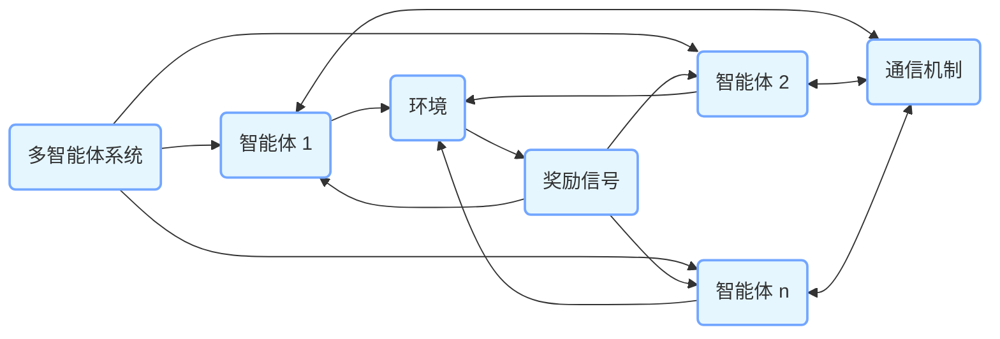

# 基于强化学习的多智能体协同推理框架设计

> 关键词：强化学习、多智能体、协同推理、框架设计、智能体协作

> 摘要：本文聚焦于基于强化学习的多智能体协同推理框架设计。随着人工智能技术的发展，多智能体系统在众多领域展现出巨大潜力，而协同推理是其实现高效任务执行的关键。强化学习作为一种强大的学习范式，能够使智能体在与环境交互中不断优化策略。文章详细阐述了相关核心概念、算法原理、数学模型，通过项目实战展示框架的具体实现和应用，探讨了实际应用场景，推荐了相关工具和资源，并对未来发展趋势与挑战进行了总结，旨在为该领域的研究和开发提供全面且深入的参考。

## 1. 背景介绍 
### 1.1 目的和范围
本研究的目的在于设计一个基于强化学习的多智能体协同推理框架，以解决多智能体系统在复杂环境下的协同决策和推理问题。范围涵盖从核心概念的阐述、算法原理的分析到实际项目的实现，以及对相关工具资源的推荐和未来发展趋势的探讨。通过该框架，期望能够提高多智能体系统的协同效率和智能水平，使其在诸如机器人协作、智能交通、分布式计算等领域得到更广泛和有效的应用。

### 1.2 预期读者
本文预期读者包括对人工智能、强化学习、多智能体系统等领域感兴趣的研究人员、工程师和学生。对于希望深入了解多智能体协同推理机制，以及想要开发相关应用的专业人士，本文提供了全面的技术指导和理论支持。同时，对于初学者来说，也可以作为一个系统学习该领域知识的参考资料。

### 1.3 文档结构概述
本文首先介绍背景信息，包括目的、预期读者和文档结构概述。接着阐述核心概念与联系，通过文本示意图和 Mermaid 流程图展示多智能体协同推理与强化学习的关系。然后详细讲解核心算法原理和具体操作步骤，使用 Python 源代码进行说明。之后介绍数学模型和公式，并举例说明。通过项目实战展示框架的具体实现和代码解读。探讨实际应用场景，推荐相关工具和资源。最后总结未来发展趋势与挑战，提供常见问题与解答和扩展阅读及参考资料。

### 1.4 术语表
#### 1.4.1 核心术语定义
- **强化学习（Reinforcement Learning）**：一种机器学习范式，智能体通过与环境进行交互，根据环境反馈的奖励信号来学习最优策略，以最大化长期累积奖励。
- **多智能体系统（Multi - Agent System，MAS）**：由多个智能体组成的系统，这些智能体可以感知环境、进行决策和行动，并且能够相互协作以完成共同的任务。
- **协同推理（Collaborative Reasoning）**：多智能体之间通过信息交流和协作，共同进行推理和决策，以实现整体最优的过程。
- **智能体（Agent）**：具有自主性、反应性、社会性和主动性的实体，能够在一定环境中感知信息、进行决策并采取行动。

#### 1.4.2 相关概念解释
- **环境（Environment）**：智能体所处的外部世界，智能体通过与环境交互获取状态信息，并对环境产生影响。
- **策略（Policy）**：智能体在不同状态下选择行动的规则，通常表示为从状态到行动的映射。
- **奖励（Reward）**：环境给予智能体的反馈信号，用于评价智能体行动的好坏，智能体的目标是最大化长期累积奖励。

#### 1.4.3 缩略词列表
- **MAS**：Multi - Agent System（多智能体系统）
- **RL**：Reinforcement Learning（强化学习）

## 2. 核心概念与联系 
### 2.1 多智能体协同推理概述
多智能体协同推理是指多个智能体在一个共同的任务环境中，通过相互协作和信息共享，共同进行推理和决策的过程。在多智能体系统中，每个智能体可能具有不同的能力、知识和目标，协同推理的目的是整合这些资源，以实现整体的最优性能。例如，在一个机器人协作任务中，不同类型的机器人可能负责不同的子任务，通过协同推理，它们可以更好地协调行动，完成复杂的任务。

### 2.2 强化学习在多智能体协同推理中的作用
强化学习为多智能体协同推理提供了一种有效的学习机制。在强化学习中，智能体通过与环境进行交互，不断尝试不同的行动，并根据环境反馈的奖励信号来调整自己的策略。在多智能体系统中，每个智能体可以独立地使用强化学习算法来学习最优策略，同时，智能体之间还可以通过协作和信息共享来提高整体的学习效率和性能。例如，智能体可以通过共享奖励信息、状态信息或策略信息，来更好地协调行动，避免冲突，实现协同优化。

### 2.3 核心概念原理和架构的文本示意图
多智能体协同推理框架的核心架构包括多个智能体、环境和一个通信机制。智能体通过传感器感知环境状态，根据自身的策略选择行动，并将行动作用于环境。环境根据智能体的行动更新状态，并给予智能体相应的奖励。智能体之间通过通信机制进行信息交流，包括状态信息、奖励信息和策略信息等。通过这种方式，智能体可以不断学习和优化自己的策略，实现协同推理。

### 2.4 Mermaid 流程图


## 3. 核心算法原理 & 具体操作步骤 
### 3.1 强化学习算法基础
强化学习的核心目标是让智能体学习一个最优策略 $\pi^*$，使得智能体在与环境交互过程中获得的长期累积奖励最大化。常用的强化学习算法包括 Q - learning、深度 Q 网络（Deep Q - Network，DQN）、策略梯度算法等。

### 3.2 Q - learning 算法原理
Q - learning 是一种无模型的强化学习算法，它通过学习一个动作价值函数 $Q(s, a)$ 来找到最优策略。动作价值函数 $Q(s, a)$ 表示在状态 $s$ 下采取动作 $a$ 并遵循最优策略后续能获得的累积奖励。Q - learning 的更新公式为：

$Q(s_t, a_t) \leftarrow Q(s_t, a_t) + \alpha [r_{t+1} + \gamma \max_{a} Q(s_{t+1}, a) - Q(s_t, a_t)]$

其中，$s_t$ 是当前状态，$a_t$ 是当前动作，$r_{t+1}$ 是执行动作 $a_t$ 后获得的奖励，$s_{t+1}$ 是下一个状态，$\alpha$ 是学习率，$\gamma$ 是折扣因子。

### 3.3 Python 代码实现 Q - learning 算法
```python
import numpy as np

# 定义环境参数
num_states = 10
num_actions = 4
gamma = 0.9
alpha = 0.1
epsilon = 0.1
num_episodes = 1000

# 初始化 Q 表
Q = np.zeros((num_states, num_actions))

# 定义 epsilon - greedy 策略
def epsilon_greedy_policy(state, Q, epsilon, num_actions):
    if np.random.uniform(0, 1) < epsilon:
        action = np.random.choice(num_actions)
    else:
        action = np.argmax(Q[state, :])
    return action

# Q - learning 算法实现
for episode in range(num_episodes):
    state = np.random.randint(0, num_states)
    done = False
    while not done:
        action = epsilon_greedy_policy(state, Q, epsilon, num_actions)
        # 模拟环境反馈
        next_state = np.random.randint(0, num_states)
        reward = np.random.randint(0, 10)
        # Q - learning 更新
        Q[state, action] = Q[state, action] + alpha * (reward + gamma * np.max(Q[next_state, :]) - Q[state, action])
        state = next_state
        # 模拟终止条件
        if np.random.uniform(0, 1) < 0.1:
            done = True
```

### 3.4 多智能体协同推理中的算法扩展
在多智能体系统中，每个智能体可以独立地使用 Q - learning 算法进行学习。同时，智能体之间可以通过通信机制共享 Q 表或部分信息，以实现协同学习。例如，智能体可以定期交换 Q 表的部分内容，或者共享奖励信息，从而加速学习过程，提高协同性能。

## 4. 数学模型和公式 & 详细讲解 & 举例说明 
### 4.1 强化学习的数学模型
强化学习可以用马尔可夫决策过程（Markov Decision Process，MDP）来建模。一个 MDP 可以表示为一个五元组 $(S, A, P, R, \gamma)$，其中：
- $S$ 是状态空间，表示智能体可能处于的所有状态的集合。
- $A$ 是动作空间，表示智能体可以采取的所有动作的集合。
- $P(s_{t+1} | s_t, a_t)$ 是状态转移概率，表示在状态 $s_t$ 下采取动作 $a_t$ 后转移到状态 $s_{t+1}$ 的概率。
- $R(s_t, a_t, s_{t+1})$ 是奖励函数，表示在状态 $s_t$ 下采取动作 $a_t$ 并转移到状态 $s_{t+1}$ 后获得的奖励。
- $\gamma \in [0, 1]$ 是折扣因子，用于权衡当前奖励和未来奖励的重要性。

### 4.2 价值函数和最优策略
价值函数是强化学习中的核心概念，主要包括状态价值函数 $V(s)$ 和动作价值函数 $Q(s, a)$。状态价值函数 $V(s)$ 表示从状态 $s$ 开始并遵循策略 $\pi$ 能获得的长期累积奖励的期望值，定义为：

$V^{\pi}(s) = \mathbb{E}_{\pi} \left[ \sum_{t=0}^{\infty} \gamma^t r_{t+1} | s_0 = s \right]$

动作价值函数 $Q(s, a)$ 表示在状态 $s$ 下采取动作 $a$ 并遵循策略 $\pi$ 后续能获得的长期累积奖励的期望值，定义为：

$Q^{\pi}(s, a) = \mathbb{E}_{\pi} \left[ \sum_{t=0}^{\infty} \gamma^t r_{t+1} | s_0 = s, a_0 = a \right]$

最优策略 $\pi^*$ 是使得状态价值函数或动作价值函数最大的策略，即：

$\pi^*(s) = \arg \max_{a} Q^*(s, a)$

其中，$Q^*(s, a)$ 是最优动作价值函数。

### 4.3 贝尔曼方程
贝尔曼方程是强化学习中的重要公式，它描述了价值函数的递归关系。对于状态价值函数 $V(s)$，贝尔曼方程为：

$V^{\pi}(s) = \sum_{a \in A} \pi(a|s) \sum_{s' \in S} P(s' | s, a) [R(s, a, s') + \gamma V^{\pi}(s')]$

对于动作价值函数 $Q(s, a)$，贝尔曼方程为：

$Q^{\pi}(s, a) = \sum_{s' \in S} P(s' | s, a) [R(s, a, s') + \gamma \sum_{a' \in A} \pi(a'|s') Q^{\pi}(s', a')]$

### 4.4 举例说明
考虑一个简单的网格世界环境，智能体在一个 $3 \times 3$ 的网格中移动，目标是到达右下角的网格。状态空间 $S$ 包含 9 个状态，动作空间 $A$ 包含 4 个动作（上、下、左、右）。状态转移概率 $P(s_{t+1} | s_t, a_t)$ 表示智能体在执行动作 $a_t$ 后从状态 $s_t$ 转移到状态 $s_{t+1}$ 的概率，奖励函数 $R(s_t, a_t, s_{t+1})$ 表示智能体在转移过程中获得的奖励。通过贝尔曼方程和强化学习算法，智能体可以学习到最优策略，快速到达目标位置。

## 5. 项目实战：代码实际案例和详细解释说明 
### 5.1  开发环境搭建
#### 5.1.1 安装 Python
首先，确保你已经安装了 Python 3.6 或更高版本。可以从 Python 官方网站（https://www.python.org/downloads/）下载并安装适合你操作系统的 Python 版本。

#### 5.1.2 安装必要的库
在项目中，我们将使用一些常见的 Python 库，如 NumPy、Matplotlib 等。可以使用以下命令安装这些库：
```sh
pip install numpy matplotlib
```

### 5.2  源代码详细实现和代码解读
#### 5.2.1 定义环境类
```python
import numpy as np

class GridWorld:
    def __init__(self, size=3):
        self.size = size
        self.state_space = size * size
        self.action_space = 4  # 上、下、左、右
        self.goal_state = size * size - 1
        self.current_state = 0

    def reset(self):
        self.current_state = 0
        return self.current_state

    def step(self, action):
        x, y = self._state_to_xy(self.current_state)
        if action == 0:  # 上
            y = max(0, y - 1)
        elif action == 1:  # 下
            y = min(self.size - 1, y + 1)
        elif action == 2:  # 左
            x = max(0, x - 1)
        elif action == 3:  # 右
            x = min(self.size - 1, x + 1)
        next_state = self._xy_to_state(x, y)
        reward = 1 if next_state == self.goal_state else 0
        done = next_state == self.goal_state
        self.current_state = next_state
        return next_state, reward, done

    def _state_to_xy(self, state):
        x = state % self.size
        y = state // self.size
        return x, y

    def _xy_to_state(self, x, y):
        return y * self.size + x
```
**代码解读**：
- `__init__` 方法：初始化网格世界的大小、状态空间、动作空间、目标状态和当前状态。
- `reset` 方法：将智能体的当前状态重置为初始状态，并返回初始状态。
- `step` 方法：根据智能体的动作更新当前状态，计算奖励和终止条件，并返回下一个状态、奖励和终止标志。
- `_state_to_xy` 和 `_xy_to_state` 方法：用于状态和坐标之间的转换。

#### 5.2.2 定义智能体类
```python
import numpy as np

class QLearningAgent:
    def __init__(self, state_space, action_space, gamma=0.9, alpha=0.1, epsilon=0.1):
        self.state_space = state_space
        self.action_space = action_space
        self.gamma = gamma
        self.alpha = alpha
        self.epsilon = epsilon
        self.Q = np.zeros((state_space, action_space))

    def epsilon_greedy_policy(self, state):
        if np.random.uniform(0, 1) < self.epsilon:
            action = np.random.choice(self.action_space)
        else:
            action = np.argmax(self.Q[state, :])
        return action

    def update(self, state, action, reward, next_state):
        max_q_next = np.max(self.Q[next_state, :])
        self.Q[state, action] = self.Q[state, action] + self.alpha * (reward + self.gamma * max_q_next - self.Q[state, action])
```
**代码解读**：
- `__init__` 方法：初始化智能体的状态空间、动作空间、折扣因子、学习率、探索率和 Q 表。
- `epsilon_greedy_policy` 方法：实现 epsilon - greedy 策略，用于选择动作。
- `update` 方法：根据 Q - learning 更新公式更新 Q 表。

#### 5.2.3 训练智能体
```python
import matplotlib.pyplot as plt

# 创建环境和智能体
env = GridWorld()
agent = QLearningAgent(env.state_space, env.action_space)

# 训练参数
num_episodes = 1000
episode_rewards = []

for episode in range(num_episodes):
    state = env.reset()
    total_reward = 0
    done = False
    while not done:
        action = agent.epsilon_greedy_policy(state)
        next_state, reward, done = env.step(action)
        agent.update(state, action, reward, next_state)
        state = next_state
        total_reward += reward
    episode_rewards.append(total_reward)

# 绘制奖励曲线
plt.plot(episode_rewards)
plt.xlabel('Episode')
plt.ylabel('Total Reward')
plt.title('Training Curve')
plt.show()
```
**代码解读**：
- 创建网格世界环境和 Q - learning 智能体。
- 进行 1000 个回合的训练，每个回合中智能体与环境交互，根据 epsilon - greedy 策略选择动作，更新 Q 表，并记录总奖励。
- 绘制训练过程中的总奖励曲线，用于观察智能体的学习效果。

### 5.3  代码解读与分析
#### 5.3.1 环境的设计
网格世界环境的设计简单直观，通过状态和动作的定义，模拟了智能体在网格中的移动过程。状态空间和动作空间的定义清晰，便于智能体进行决策和学习。

#### 5.3.2 智能体的学习过程
智能体使用 Q - learning 算法进行学习，通过 epsilon - greedy 策略平衡探索和利用。在每个回合中，智能体根据当前状态选择动作，与环境交互获得奖励和下一个状态，然后更新 Q 表。随着训练的进行，智能体逐渐学习到最优策略，总奖励逐渐增加。

#### 5.3.3 训练结果分析
通过绘制奖励曲线，可以观察到智能体的学习效果。在训练初期，总奖励可能较低，随着训练的进行，总奖励逐渐增加并趋于稳定，说明智能体已经学习到了较好的策略。

## 6. 实际应用场景 
### 6.1 机器人协作
在机器人协作任务中，多个机器人需要协同完成复杂的任务，如搬运重物、搜索救援等。基于强化学习的多智能体协同推理框架可以使机器人通过学习和协作，更好地协调行动，提高任务执行效率。例如，在搬运重物任务中，不同的机器人可以根据自身的位置和能力，通过协同推理选择最优的搬运策略，避免碰撞和冲突。

### 6.2 智能交通
在智能交通系统中，多个交通参与者（如车辆、行人、交通信号灯等）可以看作是智能体。通过多智能体协同推理框架，这些智能体可以根据实时交通信息和自身目标，协同决策，优化交通流量，减少拥堵。例如，车辆可以通过与其他车辆和交通设施的通信，选择最优的行驶路线和速度，提高道路通行效率。

### 6.3 分布式计算
在分布式计算系统中，多个计算节点可以看作是智能体。基于强化学习的多智能体协同推理框架可以使计算节点通过协作，优化任务分配和资源调度，提高计算效率。例如，计算节点可以根据自身的负载和任务需求，通过协同推理选择最优的任务执行策略，避免资源浪费和任务冲突。

### 6.4 金融交易
在金融交易领域，多个交易智能体可以通过多智能体协同推理框架进行协作，优化交易策略，降低风险。例如，不同的交易智能体可以根据市场行情和自身的风险偏好，通过协同推理选择最优的交易时机和交易数量，实现收益最大化。

## 7. 工具和资源推荐
### 7.1 学习资源推荐
#### 7.1.1 书籍推荐
- 《Reinforcement Learning: An Introduction》（Richard S. Sutton 和 Andrew G. Barto 著）：这是强化学习领域的经典教材，全面介绍了强化学习的基本概念、算法和应用。
- 《Multi - Agent Systems: Algorithmic, Game - Theoretic, and Logical Foundations》（Yoav Shoham 和 Kevin Leyton - Brown 著）：该书深入探讨了多智能体系统的理论和算法，是学习多智能体系统的重要参考书籍。

#### 7.1.2 在线课程
- Coursera 上的 “Reinforcement Learning Specialization”：由 University of Alberta 提供，系统地介绍了强化学习的理论和实践。
- edX 上的 “Multi - Agent Artificial Intelligence”：该课程详细讲解了多智能体系统的相关知识和技术。

#### 7.1.3 技术博客和网站
- OpenAI Blog（https://openai.com/blog/）：OpenAI 发布的关于人工智能和强化学习的最新研究成果和技术文章。
- ArXiv（https://arxiv.org/）：一个预印本平台，提供了大量关于强化学习和多智能体系统的研究论文。

### 7.2 开发工具框架推荐
#### 7.2.1 IDE和编辑器
- PyCharm：一款专业的 Python 集成开发环境，提供了丰富的代码编辑、调试和分析功能。
- Jupyter Notebook：一个交互式的开发环境，适合进行数据分析和算法实验。

#### 7.2.2 调试和性能分析工具
- TensorBoard：用于可视化和分析深度学习模型的训练过程和性能。
- cProfile：Python 内置的性能分析工具，用于分析代码的运行时间和性能瓶颈。

#### 7.2.3 相关框架和库
- OpenAI Gym：一个开源的强化学习环境库，提供了多种经典的强化学习环境，方便进行算法实验和开发。
- Stable Baselines3：一个基于 PyTorch 的强化学习库，提供了多种预训练的强化学习算法，易于使用和扩展。

### 7.3 相关论文著作推荐
#### 7.3.1 经典论文
- “Q - learning”（Christopher J. C. H. Watkins 和 Peter Dayan 著）：该论文首次提出了 Q - learning 算法，是强化学习领域的经典之作。
- “Multi - Agent Reinforcement Learning: A Selective Overview of Theories and Algorithms”（Leslie Pack Kaelbling 等著）：对多智能体强化学习的理论和算法进行了全面的综述。

#### 7.3.2 最新研究成果
- 关注顶级人工智能会议（如 NeurIPS、ICML、AAAI 等）上发表的关于强化学习和多智能体系统的最新研究论文，了解该领域的前沿动态。

#### 7.3.3 应用案例分析
- 查阅相关的学术期刊和会议论文，了解基于强化学习的多智能体协同推理框架在不同领域的实际应用案例，学习其设计思路和实现方法。

## 8. 总结：未来发展趋势与挑战
### 8.1 未来发展趋势
- **深度强化学习与多智能体系统的融合**：随着深度学习技术的不断发展，深度强化学习将在多智能体系统中得到更广泛的应用。通过结合深度神经网络，智能体可以处理更复杂的状态和动作空间，提高学习能力和决策水平。
- **多智能体的自适应协作**：未来的多智能体系统将更加注重智能体之间的自适应协作能力。智能体可以根据环境变化和其他智能体的行为，动态调整自己的策略和协作方式，实现更高效的协同推理。
- **跨领域应用拓展**：基于强化学习的多智能体协同推理框架将在更多领域得到应用，如医疗保健、能源管理、社交网络等。通过解决不同领域的实际问题，推动该技术的不断发展和完善。

### 8.2 挑战
- **通信和协调开销**：在多智能体系统中，智能体之间的通信和协调需要消耗一定的资源和时间。如何降低通信和协调开销，提高系统的效率和实时性，是一个亟待解决的问题。
- **环境不确定性和动态性**：实际应用中的环境往往具有不确定性和动态性，智能体需要在复杂多变的环境中进行决策和学习。如何提高智能体在不确定环境下的适应性和鲁棒性，是当前面临的挑战之一。
- **伦理和安全问题**：随着多智能体系统的广泛应用，伦理和安全问题日益凸显。例如，智能体的决策可能会对人类和社会产生影响，如何确保智能体的行为符合伦理和安全要求，是需要深入研究的问题。

## 9. 附录：常见问题与解答
### 9.1 多智能体协同推理与单智能体强化学习有什么区别？
多智能体协同推理涉及多个智能体之间的协作和信息共享，智能体需要考虑其他智能体的行为和策略，以实现整体最优。而单智能体强化学习只关注单个智能体的学习和决策，不需要考虑其他智能体的影响。

### 9.2 如何选择合适的强化学习算法？
选择合适的强化学习算法需要考虑多个因素，如问题的复杂度、状态和动作空间的大小、环境的特性等。对于简单的问题，可以选择传统的 Q - learning 算法；对于复杂的问题，可以考虑使用深度强化学习算法，如 DQN、A2C 等。

### 9.3 多智能体系统中智能体之间的通信机制有哪些？
常见的通信机制包括直接通信、广播通信、基于消息队列的通信等。直接通信是指智能体之间直接进行信息交换；广播通信是指一个智能体向所有其他智能体发送信息；基于消息队列的通信是指智能体通过消息队列进行信息传递。

### 9.4 如何评估多智能体协同推理框架的性能？
可以从多个方面评估多智能体协同推理框架的性能，如任务完成时间、任务成功率、资源利用率、智能体之间的协作效率等。通过对比不同框架或算法在相同任务下的性能指标，可以评估其优劣。

## 10. 扩展阅读 & 参考资料
### 10.1 扩展阅读
- 《Deep Reinforcement Learning Hands - On》（Max Lapan 著）：该书深入介绍了深度强化学习的原理和实践，适合进一步学习深度强化学习在多智能体系统中的应用。
- 《Game Theory for Applied Economists》（Robert Gibbons 著）：博弈论是多智能体系统中的重要理论基础，该书可以帮助读者深入理解智能体之间的策略交互和决策过程。

### 10.2 参考资料
- 相关的学术论文、技术报告和研究项目，如 OpenAI 发布的关于多智能体强化学习的研究成果。
- 开源代码库和项目，如 OpenAI Gym、Stable Baselines3 等的官方文档和代码实现。