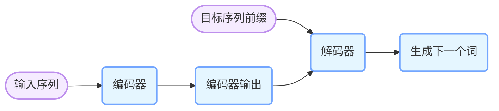

# 基于注意力机制的语言模型推理优化

> 关键词：注意力机制、语言模型、推理优化、Transformer、深度学习

> 摘要：本文围绕基于注意力机制的语言模型推理优化展开。首先介绍了相关背景知识，包括目的范围、预期读者等内容。接着阐述了注意力机制、语言模型等核心概念及其联系，通过文本示意图和Mermaid流程图进行了直观展示。详细讲解了核心算法原理，并结合Python源代码进行具体操作步骤的说明。给出了相关数学模型和公式，并举例进行解释。通过项目实战，展示了开发环境搭建、源代码实现与解读。探讨了该技术的实际应用场景，推荐了学习资源、开发工具框架以及相关论文著作。最后总结了未来发展趋势与挑战，还设置了常见问题解答和扩展阅读参考资料，旨在为读者全面深入地呈现基于注意力机制的语言模型推理优化的相关知识和技术。

## 1. 背景介绍 
### 1.1 目的和范围
在自然语言处理（NLP）领域，基于注意力机制的语言模型如Transformer及其变体取得了巨大的成功。然而，这些模型在推理阶段通常面临着计算效率低、内存占用大等问题。本文的目的在于深入探讨基于注意力机制的语言模型推理优化的方法和技术，旨在提高模型的推理速度、降低内存消耗，从而使这些强大的语言模型能够更高效地应用于实际场景中。范围涵盖了从核心概念的讲解到具体算法的实现，再到项目实战和实际应用场景的分析，以及相关学习资源和工具的推荐。

### 1.2 预期读者
本文预期读者包括对自然语言处理、深度学习领域感兴趣的研究人员、工程师、学生等。对于想要深入了解基于注意力机制的语言模型推理优化技术的初学者，本文将提供详细的基础知识和入门指导；对于有一定经验的专业人士，本文的算法原理分析、项目实战案例以及最新的研究成果等内容将为其提供有价值的参考和启发。

### 1.3 文档结构概述
本文首先介绍背景知识，包括目的范围、预期读者等。接着阐述核心概念与联系，通过文本示意图和流程图进行直观展示。然后详细讲解核心算法原理和具体操作步骤，结合Python代码进行说明。之后给出数学模型和公式，并举例解释。通过项目实战展示开发环境搭建、源代码实现与解读。探讨实际应用场景，推荐学习资源、开发工具框架和相关论文著作。最后总结未来发展趋势与挑战，设置常见问题解答和扩展阅读参考资料。

### 1.4 术语表
#### 1.4.1 核心术语定义
- **注意力机制（Attention Mechanism）**：一种在深度学习中用于动态地聚焦于输入序列中不同部分的机制，通过计算注意力权重来确定每个部分的重要性。
- **语言模型（Language Model）**：一种对自然语言进行建模的概率模型，用于预测给定上下文下下一个词的概率分布。
- **推理（Inference）**：在训练好的模型上对新数据进行预测的过程。
- **Transformer**：一种基于注意力机制的深度学习架构，广泛应用于自然语言处理任务中。

#### 1.4.2 相关概念解释
- **多头注意力（Multi - Head Attention）**：将注意力机制扩展为多个并行的注意力头，每个头关注输入序列的不同方面，从而提高模型的表达能力。
- **自注意力（Self - Attention）**：一种特殊的注意力机制，用于计算输入序列中每个元素与其他元素之间的相关性，从而捕捉序列中的长距离依赖关系。

#### 1.4.3 缩略词列表
- **NLP**：Natural Language Processing（自然语言处理）
- **GPU**：Graphics Processing Unit（图形处理单元）
- **CPU**：Central Processing Unit（中央处理单元）

## 2. 核心概念与联系 

### 2.1 注意力机制原理
注意力机制的核心思想是通过计算输入序列中每个元素的重要性权重，来动态地聚焦于输入序列的不同部分。具体来说，对于输入序列 $\mathbf{X} = [\mathbf{x}_1, \mathbf{x}_2, \cdots, \mathbf{x}_n]$，注意力机制首先通过线性变换将输入转换为查询（Query）、键（Key）和值（Value）三个向量：
$$
\mathbf{Q} = \mathbf{X} \mathbf{W}^Q, \quad \mathbf{K} = \mathbf{X} \mathbf{W}^K, \quad \mathbf{V} = \mathbf{X} \mathbf{W}^V
$$
其中 $\mathbf{W}^Q, \mathbf{W}^K, \mathbf{W}^V$ 是可学习的权重矩阵。然后，计算注意力分数：
$$
\text{Attention}(\mathbf{Q}, \mathbf{K}, \mathbf{V}) = \text{softmax}\left(\frac{\mathbf{Q} \mathbf{K}^T}{\sqrt{d_k}}\right) \mathbf{V}
$$
其中 $d_k$ 是键向量的维度，$\text{softmax}$ 函数用于将注意力分数归一化为概率分布。

### 2.2 语言模型与注意力机制的联系
基于注意力机制的语言模型，如Transformer，通过将注意力机制集成到模型架构中，能够更好地捕捉输入序列中的长距离依赖关系。在Transformer中，多头注意力机制被用于编码器和解码器中，以提高模型的表达能力。具体来说，编码器通过自注意力机制对输入序列进行编码，解码器通过自注意力机制和编码器 - 解码器注意力机制对输入序列进行解码。

### 2.3 文本示意图
基于注意力机制的语言模型通常包含编码器和解码器两部分。编码器接收输入序列，通过多层的自注意力和前馈神经网络对输入进行编码。解码器接收编码器的输出和目标序列的前缀，通过自注意力、编码器 - 解码器注意力和前馈神经网络生成目标序列的下一个词。

### 2.4 Mermaid 流程图


## 3. 核心算法原理 & 具体操作步骤 

### 3.1 核心算法原理
基于注意力机制的语言模型推理优化的核心算法主要包括量化、剪枝、知识蒸馏等。

#### 3.1.1 量化
量化是将模型的参数和计算从高精度（如32位浮点数）转换为低精度（如8位整数）的过程。通过量化，可以减少模型的内存占用和计算量，从而提高推理速度。常见的量化方法包括静态量化和动态量化。

#### 3.1.2 剪枝
剪枝是通过去除模型中不重要的连接或神经元，来减少模型的参数数量和计算量。常见的剪枝方法包括结构化剪枝和非结构化剪枝。

#### 3.1.3 知识蒸馏
知识蒸馏是将一个大的、复杂的教师模型的知识转移到一个小的、简单的学生模型中的过程。通过知识蒸馏，可以在不损失太多性能的前提下，减少学生模型的参数数量和计算量。

### 3.2 具体操作步骤
以下是基于Python和PyTorch实现量化的具体操作步骤：

```python
import torch
import torch.nn as nn
import torch.quantization

# 定义一个简单的语言模型
class SimpleLanguageModel(nn.Module):
    def __init__(self, vocab_size, embedding_dim, hidden_dim):
        super(SimpleLanguageModel, self).__init__()
        self.embedding = nn.Embedding(vocab_size, embedding_dim)
        self.fc = nn.Linear(embedding_dim, hidden_dim)
        self.out = nn.Linear(hidden_dim, vocab_size)

    def forward(self, x):
        x = self.embedding(x)
        x = self.fc(x)
        x = self.out(x)
        return x

# 初始化模型
vocab_size = 10000
embedding_dim = 128
hidden_dim = 256
model = SimpleLanguageModel(vocab_size, embedding_dim, hidden_dim)

# 定义量化配置
quantization_config = torch.quantization.get_default_qconfig('fbgemm')

# 准备模型进行量化
model.qconfig = quantization_config
torch.quantization.prepare(model, inplace=True)

# 进行校准（这里简单使用随机数据进行示例）
input_data = torch.randint(0, vocab_size, (10,))
model(input_data)

# 完成量化
torch.quantization.convert(model, inplace=True)

# 打印量化后的模型
print(model)
```

在上述代码中，首先定义了一个简单的语言模型 `SimpleLanguageModel`。然后，使用 `torch.quantization.get_default_qconfig` 定义了量化配置。接着，使用 `torch.quantization.prepare` 准备模型进行量化，并使用随机数据进行校准。最后，使用 `torch.quantization.convert` 完成量化。

## 4. 数学模型和公式 & 详细讲解 & 举例说明 

### 4.1 量化的数学模型和公式
#### 4.1.1 线性量化
线性量化将浮点数 $x$ 映射到整数 $x_q$，其数学公式为：
$$
x_q = \text{round}\left(\frac{x}{S}\right) + Z
$$
其中 $S$ 是缩放因子，$Z$ 是零点，$\text{round}$ 是四舍五入函数。反量化的公式为：
$$
x = S(x_q - Z)
$$

#### 4.1.2 举例说明
假设我们要将浮点数 $x = 2.5$ 量化到8位整数，缩放因子 $S = 0.1$，零点 $Z = 128$。则量化后的整数为：
$$
x_q = \text{round}\left(\frac{2.5}{0.1}\right) + 128 = 25 + 128 = 153
$$
反量化后的浮点数为：
$$
x = 0.1(153 - 128) = 2.5
$$

### 4.2 剪枝的数学模型和公式
#### 4.2.1 结构化剪枝
结构化剪枝通常通过设置一个阈值 $\theta$，将绝对值小于 $\theta$ 的权重置为零。假设权重矩阵 $\mathbf{W}$ 的元素为 $w_{ij}$，则剪枝后的权重矩阵 $\mathbf{W}'$ 的元素为：
$$
w_{ij}' = \begin{cases}
w_{ij}, & |w_{ij}| \geq \theta \\
0, & |w_{ij}| < \theta
\end{cases}
$$

#### 4.2.2 举例说明
假设权重矩阵 $\mathbf{W} = \begin{bmatrix}
0.1 & 0.2 \\
0.05 & 0.3
\end{bmatrix}$，阈值 $\theta = 0.1$。则剪枝后的权重矩阵为：
$$
\mathbf{W}' = \begin{bmatrix}
0.1 & 0.2 \\
0 & 0.3
\end{bmatrix}
$$

### 4.3 知识蒸馏的数学模型和公式
知识蒸馏的目标是最小化学生模型的输出分布 $p_s$ 和教师模型的输出分布 $p_t$ 之间的差异。通常使用KL散度作为损失函数：
$$
\mathcal{L}_{\text{KD}} = D_{\text{KL}}(p_s || p_t) = \sum_i p_t(i) \log\left(\frac{p_t(i)}{p_s(i)}\right)
$$
其中 $D_{\text{KL}}$ 是KL散度，$i$ 是类别索引。

## 5. 项目实战：代码实际案例和详细解释说明 

### 5.1  开发环境搭建
#### 5.1.1 安装Python
首先，确保你已经安装了Python 3.6或更高版本。可以从Python官方网站（https://www.python.org/downloads/） 下载并安装。

#### 5.1.2 安装PyTorch
使用以下命令安装PyTorch：
```sh
pip install torch torchvision
```

#### 5.1.3 安装其他依赖库
根据项目需求，可能还需要安装其他依赖库，如 `numpy`、`transformers` 等。可以使用以下命令安装：
```sh
pip install numpy transformers
```

### 5.2  源代码详细实现和代码解读
以下是一个基于Hugging Face Transformers库的语言模型推理优化的示例代码：

```python
from transformers import AutoTokenizer, AutoModelForCausalLM
import torch

# 加载预训练模型和分词器
model_name = "gpt2"
tokenizer = AutoTokenizer.from_pretrained(model_name)
model = AutoModelForCausalLM.from_pretrained(model_name)

# 量化模型
quantized_model = torch.quantization.quantize_dynamic(
    model, {torch.nn.Linear}, dtype=torch.qint8
)

# 输入文本
input_text = "Once upon a time"
input_ids = tokenizer.encode(input_text, return_tensors="pt")

# 进行推理
with torch.no_grad():
    output = quantized_model.generate(input_ids, max_length=50)

# 解码输出
output_text = tokenizer.decode(output[0], skip_special_tokens=True)
print(output_text)
```

### 5.3  代码解读与分析
1. **加载预训练模型和分词器**：使用 `AutoTokenizer.from_pretrained` 和 `AutoModelForCausalLM.from_pretrained` 加载预训练的GPT - 2模型和对应的分词器。
2. **量化模型**：使用 `torch.quantization.quantize_dynamic` 对模型中的线性层进行动态量化，将其数据类型转换为8位整数。
3. **输入文本处理**：使用分词器将输入文本编码为输入ID。
4. **进行推理**：使用 `generate` 方法生成文本，设置最大长度为50。
5. **解码输出**：使用分词器将输出ID解码为文本，并打印输出。

通过量化模型，我们可以减少模型的内存占用和计算量，从而提高推理速度。

## 6. 实际应用场景 
### 6.1 聊天机器人
在聊天机器人应用中，基于注意力机制的语言模型可以用于生成自然流畅的回复。通过推理优化，可以提高聊天机器人的响应速度，减少用户等待时间，提升用户体验。

### 6.2 机器翻译
在机器翻译任务中，语言模型可以用于生成高质量的翻译结果。推理优化可以使翻译系统更快地处理输入文本，提高翻译效率。

### 6.3 文本摘要
在文本摘要任务中，语言模型可以用于自动提取文本的关键信息。推理优化可以加速摘要生成过程，使系统能够更快地处理大量文本。

### 6.4 智能写作辅助
在智能写作辅助应用中，语言模型可以用于提供写作建议和自动补全功能。推理优化可以使写作辅助系统更加实时和高效。

## 7. 工具和资源推荐
### 7.1 学习资源推荐
#### 7.1.1 书籍推荐
- 《深度学习》（Deep Learning）：由Ian Goodfellow、Yoshua Bengio和Aaron Courville合著，是深度学习领域的经典教材。
- 《自然语言处理入门》（Natural Language Processing in Action）：介绍了自然语言处理的基本概念和技术，包括基于注意力机制的语言模型。

#### 7.1.2 在线课程
- Coursera上的“深度学习专项课程”（Deep Learning Specialization）：由Andrew Ng教授讲授，涵盖了深度学习的各个方面。
- edX上的“自然语言处理”（Natural Language Processing）：介绍了自然语言处理的前沿技术和应用。

#### 7.1.3 技术博客和网站
- Hugging Face博客（https://huggingface.co/blog）：提供了关于Transformer模型和自然语言处理的最新研究成果和应用案例。
- Towards Data Science（https://towardsdatascience.com）：有许多关于深度学习和自然语言处理的技术文章。

### 7.2 开发工具框架推荐
#### 7.2.1 IDE和编辑器
- PyCharm：是一款功能强大的Python集成开发环境，提供了代码编辑、调试、版本控制等功能。
- Visual Studio Code：是一款轻量级的代码编辑器，支持多种编程语言，有丰富的扩展插件。

#### 7.2.2 调试和性能分析工具
- PyTorch Profiler：是PyTorch自带的性能分析工具，可以帮助开发者分析模型的性能瓶颈。
- TensorBoard：是TensorFlow的可视化工具，也可以用于PyTorch模型的可视化和性能分析。

#### 7.2.3 相关框架和库
- Hugging Face Transformers：提供了丰富的预训练语言模型和工具，方便开发者进行自然语言处理任务。
- PyTorch Lightning：是一个轻量级的PyTorch扩展库，简化了模型的训练和部署过程。

### 7.3 相关论文著作推荐
#### 7.3.1 经典论文
- “Attention Is All You Need”：介绍了Transformer架构，是基于注意力机制的语言模型的经典论文。
- “Distilling the Knowledge in a Neural Network”：提出了知识蒸馏的概念和方法。

#### 7.3.2 最新研究成果
- 关注顶级学术会议如ACL（Association for Computational Linguistics）、EMNLP（Conference on Empirical Methods in Natural Language Processing）等的最新论文，了解基于注意力机制的语言模型推理优化的最新研究进展。

#### 7.3.3 应用案例分析
- 一些开源项目的文档和博客文章会分享基于注意力机制的语言模型在实际应用中的优化案例，可以从中学习到实际的优化经验和技巧。

## 8. 总结：未来发展趋势与挑战
### 8.1 未来发展趋势
- **更高效的优化算法**：随着研究的深入，将会出现更加高效的推理优化算法，进一步提高语言模型的推理速度和效率。
- **硬件与软件的协同优化**：未来的推理优化将更加注重硬件与软件的协同，通过专门的硬件加速器和优化的软件算法，实现更高的性能提升。
- **自适应优化**：语言模型将能够根据不同的应用场景和硬件环境，自适应地选择最优的推理优化策略。

### 8.2 挑战
- **性能与精度的平衡**：在进行推理优化时，如何在提高性能的同时保持模型的精度是一个挑战。
- **模型的可解释性**：基于注意力机制的语言模型通常具有较高的复杂度，如何提高模型的可解释性，使其在实际应用中更加可靠是一个重要问题。
- **跨平台兼容性**：不同的硬件平台和软件环境对推理优化的支持不同，如何实现跨平台的高效推理优化是一个挑战。

## 9. 附录：常见问题与解答
### 9.1 量化会对模型的精度产生多大影响？
量化通常会对模型的精度产生一定的影响，但通过合适的量化方法和校准技术，可以将精度损失控制在可接受的范围内。具体的精度损失程度取决于模型的结构、数据集和量化方法等因素。

### 9.2 剪枝是否会导致模型过拟合？
剪枝本身不会直接导致模型过拟合，但如果剪枝过度，可能会导致模型的表达能力下降，从而影响模型的性能。因此，在进行剪枝时，需要选择合适的剪枝比例和剪枝方法。

### 9.3 知识蒸馏需要多少数据？
知识蒸馏所需的数据量取决于教师模型和学生模型的复杂度。一般来说，使用与训练教师模型相同或相似的数据集进行知识蒸馏可以取得较好的效果。

## 10. 扩展阅读 & 参考资料
- Vaswani, Ashish, et al. "Attention is all you need." Advances in neural information processing systems. 2017.
- Hinton, Geoffrey, Oriol Vinyals, and Jeff Dean. "Distilling the knowledge in a neural network." arXiv preprint arXiv:1503.02531 (2015).
- Hugging Face官方文档：https://huggingface.co/docs
- PyTorch官方文档：https://pytorch.org/docs/stable/index.html