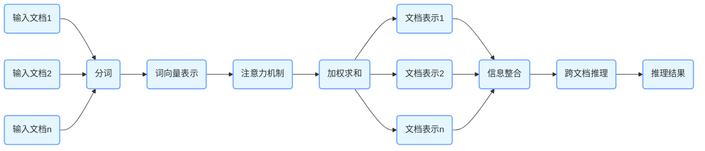

# 基于注意力机制的跨文档推理能力在情报分析中的应用

> 关键词：注意力机制、跨文档推理、情报分析、自然语言处理、深度学习

> 摘要：本文深入探讨了基于注意力机制的跨文档推理能力在情报分析领域的应用。首先介绍了相关背景知识，包括研究目的、预期读者等。接着详细阐述了注意力机制和跨文档推理的核心概念与联系，通过算法原理、数学模型等进行理论剖析。结合Python代码给出了具体的实现步骤和项目实战案例，分析了其在不同实际应用场景中的作用。还推荐了学习该领域知识的工具和资源，最后总结了未来发展趋势与挑战，并提供了常见问题解答和扩展阅读参考资料，旨在为情报分析领域引入新的技术思路和方法，提升情报分析的效率和准确性。

## 1. 背景介绍 
### 1.1 目的和范围
在当今信息爆炸的时代，情报分析面临着海量多源异构信息的挑战。传统的情报分析方法在处理大规模文档和复杂信息关系时效率低下，难以挖掘出隐藏在不同文档之间的深层关联和有价值的情报。基于注意力机制的跨文档推理技术为解决这些问题提供了新的途径。本研究的目的在于探索如何利用注意力机制的优势，实现有效的跨文档推理，并将其应用于情报分析中，提高情报分析的质量和效率。范围涵盖了注意力机制和跨文档推理的基本原理、相关算法、实际应用场景以及未来发展趋势等方面。

### 1.2 预期读者
本文预期读者包括情报分析领域的专业人员，如情报分析师、情报研究员等，他们可以从文中获取新的技术思路和方法，提升情报分析工作的水平；自然语言处理和人工智能领域的研究人员和开发者，能够了解该技术在情报分析中的应用案例，拓展研究和应用方向；对情报分析和人工智能技术感兴趣的学生和爱好者，通过阅读本文可以系统地学习相关知识，为进一步深入研究打下基础。

### 1.3 文档结构概述
本文首先介绍了基于注意力机制的跨文档推理在情报分析中应用的背景信息，包括目的、读者和文档结构等。然后阐述了核心概念与联系，通过示意图和流程图直观展示相关原理。接着详细讲解核心算法原理和具体操作步骤，结合Python代码进行说明。随后介绍数学模型和公式，并举例说明。通过项目实战部分给出实际代码案例和详细解释。之后分析了该技术在不同场景中的实际应用。推荐了相关的工具和资源，包括学习资源、开发工具框架和论文著作等。最后总结未来发展趋势与挑战，提供常见问题解答和扩展阅读参考资料。

### 1.4 术语表
#### 1.4.1 核心术语定义
- **注意力机制**：是一种模拟人类注意力的机制，在处理信息时能够自动聚焦于重要部分，忽略次要部分，从而提高信息处理的效率和准确性。在自然语言处理中，注意力机制可以帮助模型更好地捕捉文本中的关键信息和语义关系。
- **跨文档推理**：指的是在多个文档之间进行推理和关联分析的能力。通过对不同文档中的信息进行整合和推理，挖掘出隐藏在文档之间的逻辑关系和有价值的信息。
- **情报分析**：是指对各种来源的信息进行收集、整理、分析和评估，以获取有价值的情报，为决策提供支持的过程。

#### 1.4.2 相关概念解释
- **自然语言处理（NLP）**：是人工智能的一个重要分支，主要研究如何让计算机理解和处理人类语言。基于注意力机制的跨文档推理是自然语言处理中的一个重要研究方向，旨在解决多文档信息处理和推理的问题。
- **深度学习**：是一种基于人工神经网络的机器学习方法，通过构建多层神经网络模型来学习数据的特征和模式。注意力机制和跨文档推理通常借助深度学习模型来实现，如循环神经网络（RNN）、长短期记忆网络（LSTM）和Transformer等。

#### 1.4.3 缩略词列表
- **RNN**：Recurrent Neural Network，循环神经网络
- **LSTM**：Long Short-Term Memory，长短期记忆网络
- **NLP**：Natural Language Processing，自然语言处理

## 2. 核心概念与联系 

### 注意力机制原理
注意力机制的核心思想是模拟人类在处理信息时的注意力分配过程。在自然语言处理中，对于输入的文本序列，注意力机制可以计算每个词（或子词）的重要性权重，然后根据这些权重对文本进行加权求和，从而得到一个更能反映文本关键信息的表示。

以Transformer模型中的多头注意力机制为例，其基本流程如下：
1. 输入的词向量通过线性变换得到查询（Query）、键（Key）和值（Value）三个向量。
2. 计算查询向量和键向量之间的相似度，通常使用点积运算。
3. 对相似度得分进行归一化处理，得到注意力权重。
4. 根据注意力权重对值向量进行加权求和，得到输出。

### 跨文档推理原理
跨文档推理的目标是在多个文档之间建立联系，挖掘出隐藏在文档之间的逻辑关系和有价值的信息。它需要解决以下几个关键问题：
1. **文档表示**：将不同的文档转换为合适的向量表示，以便进行后续的推理操作。
2. **信息整合**：将多个文档的信息进行整合，捕捉文档之间的关联。
3. **推理决策**：根据整合后的信息进行推理，得出结论。

### 两者的联系
注意力机制在跨文档推理中起着关键作用。它可以帮助模型聚焦于不同文档中的关键信息，忽略无关信息，从而更好地进行信息整合和推理。例如，在跨文档的关系抽取任务中，注意力机制可以帮助模型关注不同文档中与目标关系相关的实体和描述，提高关系抽取的准确性。

### 文本示意图
```plaintext
输入文档1 -- 分词 -- 词向量表示 -- 注意力机制（计算权重） -- 加权求和 -- 文档表示1
输入文档2 -- 分词 -- 词向量表示 -- 注意力机制（计算权重） -- 加权求和 -- 文档表示2
...
输入文档n -- 分词 -- 词向量表示 -- 注意力机制（计算权重） -- 加权求和 -- 文档表示n

文档表示1、文档表示2、...、文档表示n -- 信息整合 -- 跨文档推理 -- 推理结果
```

### Mermaid流程图


## 3. 核心算法原理 & 具体操作步骤 

### 注意力机制算法原理
以Scaled Dot-Product Attention为例，其核心思想是通过计算查询（Query）和键（Key）之间的相似度来确定注意力权重，然后根据权重对值（Value）进行加权求和。

Python代码实现如下：
```python
import torch
import torch.nn as nn
import torch.nn.functional as F

class ScaledDotProductAttention(nn.Module):
    def __init__(self, d_k):
        super(ScaledDotProductAttention, self).__init__()
        self.d_k = d_k

    def forward(self, q, k, v, mask=None):
        attn_scores = torch.matmul(q, k.transpose(-2, -1)) / torch.sqrt(torch.tensor(self.d_k, dtype=torch.float32))
        if mask is not None:
            attn_scores = attn_scores.masked_fill(mask == 0, -1e9)
        attn_weights = F.softmax(attn_scores, dim=-1)
        output = torch.matmul(attn_weights, v)
        return output, attn_weights
```

### 具体操作步骤
1. **输入准备**：将输入的文本进行分词，并转换为词向量表示。
2. **线性变换**：将词向量通过线性变换得到查询（Query）、键（Key）和值（Value）三个向量。
3. **计算注意力得分**：使用Scaled Dot-Product Attention计算查询和键之间的相似度得分。
4. **归一化处理**：对注意力得分进行Softmax归一化处理，得到注意力权重。
5. **加权求和**：根据注意力权重对值向量进行加权求和，得到输出。

### 跨文档推理算法原理
跨文档推理通常基于深度学习模型，如Transformer。其基本思路是将多个文档的信息进行整合，然后通过神经网络进行推理。

Python代码实现如下：
```python
class TransformerEncoder(nn.Module):
    def __init__(self, d_model, nhead, num_layers):
        super(TransformerEncoder, self).__init__()
        encoder_layer = nn.TransformerEncoderLayer(d_model=d_model, nhead=nhead)
        self.transformer_encoder = nn.TransformerEncoder(encoder_layer, num_layers=num_layers)

    def forward(self, src):
        output = self.transformer_encoder(src)
        return output
```

### 具体操作步骤
1. **文档表示**：将多个文档的文本转换为词向量序列。
2. **信息整合**：使用Transformer编码器对多个文档的词向量序列进行信息整合。
3. **推理决策**：根据整合后的信息进行推理，例如通过全连接层进行分类或回归。

## 4. 数学模型和公式 & 详细讲解 & 举例说明 

### 注意力机制数学模型和公式
Scaled Dot-Product Attention的数学公式如下：
$$
\text{Attention}(Q, K, V) = \text{softmax}\left(\frac{QK^T}{\sqrt{d_k}}\right)V
$$
其中，$Q$ 是查询矩阵，$K$ 是键矩阵，$V$ 是值矩阵，$d_k$ 是查询和键向量的维度。

详细讲解：
- $QK^T$ 计算查询和键之间的相似度得分。
- $\frac{QK^T}{\sqrt{d_k}}$ 对相似度得分进行缩放，避免点积运算结果过大。
- $\text{softmax}\left(\frac{QK^T}{\sqrt{d_k}}\right)$ 对缩放后的得分进行归一化处理，得到注意力权重。
- $\text{softmax}\left(\frac{QK^T}{\sqrt{d_k}}\right)V$ 根据注意力权重对值矩阵进行加权求和，得到输出。

举例说明：
假设 $Q$ 是一个 $3\times 4$ 的矩阵，$K$ 是一个 $3\times 4$ 的矩阵，$V$ 是一个 $3\times 5$ 的矩阵，$d_k = 4$。
```python
import torch

Q = torch.randn(3, 4)
K = torch.randn(3, 4)
V = torch.randn(3, 5)
d_k = 4

attn_scores = torch.matmul(Q, K.transpose(-2, -1)) / torch.sqrt(torch.tensor(d_k, dtype=torch.float32))
attn_weights = torch.softmax(attn_scores, dim=-1)
output = torch.matmul(attn_weights, V)

print("Attention scores:", attn_scores)
print("Attention weights:", attn_weights)
print("Output:", output)
```

### 跨文档推理数学模型和公式
在Transformer模型中，编码器层的数学公式如下：
$$
\begin{align*}
\text{MultiHead}(Q, K, V) &= \text{Concat}(\text{head}_1, \cdots, \text{head}_h)W^O \\
\text{head}_i &= \text{Attention}(QW_i^Q, KW_i^K, VW_i^V)
\end{align*}
$$
其中，$h$ 是多头注意力的头数，$W_i^Q$、$W_i^K$、$W_i^V$ 是线性变换矩阵，$W^O$ 是输出的线性变换矩阵。

详细讲解：
- 多头注意力机制通过多个头并行计算注意力，然后将结果拼接起来，最后通过线性变换得到最终输出。
- 每个头的计算方式与Scaled Dot-Product Attention相同。

举例说明：
```python
import torch
import torch.nn as nn

d_model = 128
nhead = 8
num_layers = 6

encoder_layer = nn.TransformerEncoderLayer(d_model=d_model, nhead=nhead)
transformer_encoder = nn.TransformerEncoder(encoder_layer, num_layers=num_layers)

src = torch.randn(10, 32, d_model)  # 输入序列
output = transformer_encoder(src)

print("Output shape:", output.shape)
```

## 5. 项目实战：代码实际案例和详细解释说明 

### 5.1  开发环境搭建
1. **安装Python**：建议使用Python 3.7及以上版本。
2. **安装深度学习框架**：使用PyTorch作为深度学习框架，可以通过以下命令安装：
```sh
pip install torch torchvision
```
3. **安装自然语言处理库**：使用`transformers`库进行预训练模型的加载和使用，可以通过以下命令安装：
```sh
pip install transformers
```

### 5.2  源代码详细实现和代码解读
以下是一个基于Transformer的跨文档推理的简单示例，用于判断两个文档是否相关。

```python
import torch
import torch.nn as nn
from transformers import AutoTokenizer, AutoModel

class CrossDocumentReasoningModel(nn.Module):
    def __init__(self, model_name):
        super(CrossDocumentReasoningModel, self).__init__()
        self.bert = AutoModel.from_pretrained(model_name)
        self.fc = nn.Linear(self.bert.config.hidden_size * 2, 1)

    def forward(self, input_ids1, attention_mask1, input_ids2, attention_mask2):
        outputs1 = self.bert(input_ids=input_ids1, attention_mask=attention_mask1)
        outputs2 = self.bert(input_ids=input_ids2, attention_mask=attention_mask2)

        cls_output1 = outputs1.last_hidden_state[:, 0, :]
        cls_output2 = outputs2.last_hidden_state[:, 0, :]

        combined_output = torch.cat((cls_output1, cls_output2), dim=-1)
        logits = self.fc(combined_output)
        return logits

# 初始化模型和分词器
model_name = 'bert-base-uncased'
tokenizer = AutoTokenizer.from_pretrained(model_name)
model = CrossDocumentReasoningModel(model_name)

# 示例文档
document1 = "The cat is on the mat."
document2 = "A cat is sitting on a mat."

# 分词和编码
inputs1 = tokenizer(document1, return_tensors='pt')
inputs2 = tokenizer(document2, return_tensors='pt')

# 前向传播
logits = model(inputs1['input_ids'], inputs1['attention_mask'], inputs2['input_ids'], inputs2['attention_mask'])
print("Logits:", logits)
```

### 5.3  代码解读与分析
1. **模型定义**：`CrossDocumentReasoningModel`类继承自`nn.Module`，包含一个预训练的BERT模型和一个全连接层。
2. **前向传播**：将两个文档分别输入到BERT模型中，获取CLS标记的输出，然后将两个输出拼接起来，通过全连接层得到最终的logits。
3. **分词和编码**：使用`transformers`库的分词器将文本转换为输入ID和注意力掩码。
4. **推理**：将输入ID和注意力掩码输入到模型中，得到logits，用于判断两个文档是否相关。

## 6. 实际应用场景 
### 情报收集与整合
在情报收集过程中，往往会获取到来自不同渠道的大量文档，这些文档可能涉及不同的主题和领域。基于注意力机制的跨文档推理可以帮助情报人员快速筛选出相关文档，整合不同文档中的信息，形成全面的情报报告。例如，在军事情报分析中，可以通过跨文档推理整合来自不同侦察手段的情报，了解敌方的军事部署和行动意图。

### 事件关联分析
在情报分析中，需要对不同的事件进行关联分析，找出事件之间的潜在联系和因果关系。注意力机制可以帮助模型聚焦于事件的关键信息，跨文档推理可以在多个文档中挖掘事件之间的关联。例如，在反恐情报分析中，可以通过跨文档推理关联不同的恐怖袭击事件，找出恐怖组织的活动规律和作案手法。

### 风险评估与预警
基于注意力机制的跨文档推理可以对不同来源的情报进行综合分析，评估潜在的风险，并及时发出预警。例如，在金融情报分析中，可以通过跨文档推理分析市场动态、企业财务报表等信息，评估金融风险，为投资者提供决策支持。

### 竞争对手分析
在商业情报分析中，需要对竞争对手的信息进行收集和分析。跨文档推理可以帮助企业整合来自不同渠道的竞争对手信息，了解竞争对手的战略、产品、市场等情况，为企业制定竞争策略提供依据。

## 7. 工具和资源推荐
### 7.1 学习资源推荐
#### 7.1.1 书籍推荐
- 《深度学习》（Deep Learning）：由Ian Goodfellow、Yoshua Bengio和Aaron Courville合著，是深度学习领域的经典教材，全面介绍了深度学习的基本概念、算法和应用。
- 《自然语言处理入门》（Natural Language Processing in Action）：由Hobson Lane、Cole Howard和 Hannes Hapke合著，适合初学者学习自然语言处理的基础知识和实践技巧。
- 《Transformer自然语言处理》（Transformers for Natural Language Processing）：由Denis Rothman著，详细介绍了Transformer模型的原理和应用，对理解注意力机制和跨文档推理有很大帮助。

#### 7.1.2 在线课程
- Coursera上的“深度学习专项课程”（Deep Learning Specialization）：由Andrew Ng教授授课，系统地介绍了深度学习的各个方面，包括神经网络、卷积神经网络、循环神经网络等。
- edX上的“自然语言处理基础”（Foundations of Natural Language Processing）：由Columbia University提供，讲解了自然语言处理的基本概念、算法和技术。
- 哔哩哔哩上的“李沐深度学习”系列视频：由李沐老师讲解，内容生动易懂，适合初学者快速入门深度学习。

#### 7.1.3 技术博客和网站
- Medium：上面有很多关于自然语言处理和深度学习的技术博客文章，包括最新的研究成果和实践经验。
- arXiv：是一个预印本数据库，提供了大量的学术论文，包括自然语言处理和人工智能领域的最新研究成果。
- Hugging Face Blog：Hugging Face是一家专注于自然语言处理的公司，其博客上有很多关于Transformer模型和自然语言处理技术的介绍和应用案例。

### 7.2 开发工具框架推荐
#### 7.2.1 IDE和编辑器
- PyCharm：是一款专业的Python集成开发环境，提供了丰富的代码编辑、调试和项目管理功能，适合Python开发。
- Visual Studio Code：是一款轻量级的代码编辑器，支持多种编程语言和插件，可通过安装Python插件进行Python开发。
- Jupyter Notebook：是一个交互式的开发环境，适合进行数据探索、模型训练和可视化，常用于深度学习和自然语言处理的实验和开发。

#### 7.2.2 调试和性能分析工具
- PyTorch Profiler：是PyTorch提供的性能分析工具，可以帮助开发者分析模型的性能瓶颈，优化模型的训练和推理速度。
- TensorBoard：是TensorFlow提供的可视化工具，也可以与PyTorch结合使用，用于可视化模型的训练过程、损失曲线、准确率等指标。
- NVIDIA Nsight Systems：是一款用于分析GPU性能的工具，可以帮助开发者优化GPU代码，提高模型的训练和推理效率。

#### 7.2.3 相关框架和库
- PyTorch：是一个开源的深度学习框架，提供了丰富的神经网络模块和优化算法，广泛应用于自然语言处理和计算机视觉领域。
- Transformers：是Hugging Face开发的一个自然语言处理库，提供了多种预训练模型和工具，方便开发者进行自然语言处理任务的开发。
- SpaCy：是一个用于自然语言处理的Python库，提供了高效的分词、词性标注、命名实体识别等功能，可用于文本预处理。

### 7.3 相关论文著作推荐
#### 7.3.1 经典论文
- “Attention Is All You Need”：由Google Brain团队发表，提出了Transformer模型，引入了注意力机制，是自然语言处理领域的里程碑式论文。
- “BERT: Pre-training of Deep Bidirectional Transformers for Language Understanding”：由Google AI Language团队发表，提出了BERT预训练模型，在自然语言处理任务中取得了显著的效果。
- “Graph Attention Networks”：提出了图注意力网络（GAT），将注意力机制应用于图神经网络中，为图数据的处理提供了新的方法。

#### 7.3.2 最新研究成果
- 关注ACL（Association for Computational Linguistics）、EMNLP（Conference on Empirical Methods in Natural Language Processing）等自然语言处理领域的顶级会议，这些会议上会发表很多最新的研究成果。
- 关注arXiv上的最新预印本论文，了解自然语言处理和人工智能领域的前沿研究。

#### 7.3.3 应用案例分析
- 关注行业报告和企业博客，了解基于注意力机制的跨文档推理技术在实际应用中的案例和经验分享。例如，一些情报分析机构和科技公司会分享他们在情报分析和信息处理方面的应用案例。

## 8. 总结：未来发展趋势与挑战
### 未来发展趋势
- **多模态融合**：未来的跨文档推理技术将不仅仅局限于文本信息，还将融合图像、音频、视频等多模态信息，实现更全面、更准确的情报分析。例如，在军事情报分析中，可以结合卫星图像、无人机视频和文本情报进行综合分析。
- **知识图谱融合**：将跨文档推理与知识图谱相结合，可以更好地利用先验知识，提高推理的准确性和可解释性。知识图谱可以提供实体之间的关系和语义信息，帮助模型更好地理解文档中的信息。
- **强化学习应用**：引入强化学习算法可以使跨文档推理模型更加智能和自适应。通过与环境进行交互，模型可以不断学习和优化推理策略，提高情报分析的效率和效果。

### 挑战
- **数据质量和标注**：跨文档推理需要大量高质量的数据进行训练，但现实中的数据往往存在噪声、缺失和不一致等问题。此外，数据标注的成本较高，如何获取高质量的标注数据是一个挑战。
- **计算资源和效率**：基于深度学习的跨文档推理模型通常需要大量的计算资源和时间进行训练和推理。如何在有限的计算资源下提高模型的效率，是一个亟待解决的问题。
- **可解释性和信任度**：深度学习模型的黑盒性质使得其推理过程难以解释，这在情报分析等对可解释性要求较高的领域是一个挑战。如何提高模型的可解释性和信任度，是未来研究的重要方向。

## 9. 附录：常见问题与解答
### 1. 注意力机制和跨文档推理的区别是什么？
注意力机制是一种信息处理的方法，用于聚焦于重要信息，忽略次要信息。跨文档推理是一种任务，旨在在多个文档之间进行推理和关联分析。注意力机制可以作为跨文档推理的一个重要组成部分，帮助模型更好地处理和整合多个文档的信息。

### 2. 如何选择合适的预训练模型进行跨文档推理？
选择预训练模型时，需要考虑以下因素：
- **任务类型**：不同的预训练模型适用于不同的任务，例如BERT适用于自然语言理解任务，GPT适用于自然语言生成任务。
- **数据规模和领域**：如果数据规模较小，可以选择轻量级的预训练模型；如果数据来自特定领域，可以选择在该领域预训练的模型。
- **计算资源**：一些大型的预训练模型需要大量的计算资源，需要根据自己的计算资源情况选择合适的模型。

### 3. 跨文档推理在实际应用中可能会遇到哪些问题？
- **数据不一致**：不同文档中的信息可能存在不一致的情况，需要进行数据清洗和整合。
- **语义理解困难**：自然语言的语义复杂，模型可能难以准确理解文档中的语义信息。
- **推理效率低**：在处理大量文档时，跨文档推理的效率可能较低，需要优化算法和模型。

## 10. 扩展阅读 & 参考资料
### 扩展阅读
- 《人工智能：现代方法》（Artificial Intelligence: A Modern Approach）：全面介绍了人工智能的基本概念、算法和应用，对理解跨文档推理的背景和相关技术有很大帮助。
- 《神经网络与深度学习》（Neural Networks and Deep Learning）：由Michael Nielsen著，详细介绍了神经网络和深度学习的原理和实践，是深度学习领域的经典读物。

### 参考资料
- Attention Is All You Need. Ashish Vaswani, Noam Shazeer, Niki Parmar, Jakob Uszkoreit, Llion Jones, Aidan N. Gomez, Lukasz Kaiser, Illia Polosukhin. arXiv:1706.03762.
- BERT: Pre-training of Deep Bidirectional Transformers for Language Understanding. Jacob Devlin, Ming-Wei Chang, Kenton Lee, Kristina Toutanova. arXiv:1810.04805.
- Transformers for Natural Language Processing. Denis Rothman. Packt Publishing.