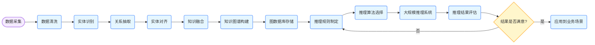

# 基于知识图谱的大规模推理系统架构创新

> 关键词：知识图谱、大规模推理系统、架构创新、语义网络、人工智能

> 摘要：本文聚焦于基于知识图谱的大规模推理系统架构创新。首先介绍了相关背景，包括研究目的、预期读者、文档结构等。接着详细阐述了知识图谱和大规模推理系统的核心概念及联系，给出了清晰的原理和架构示意图与流程图。深入探讨了核心算法原理并给出Python源代码示例，同时介绍了相关数学模型和公式。通过项目实战，展示了代码的实际案例及详细解释。分析了该系统的实际应用场景，推荐了学习资源、开发工具框架和相关论文著作。最后总结了未来发展趋势与挑战，解答了常见问题并提供了扩展阅读和参考资料，旨在为基于知识图谱的大规模推理系统架构的进一步研究和应用提供全面而深入的参考。

## 1. 背景介绍 
### 1.1 目的和范围
在当今信息爆炸的时代，海量的数据蕴含着丰富的知识，但如何从这些数据中高效地挖掘和利用知识成为了关键问题。知识图谱作为一种强大的知识表示和管理工具，能够将复杂的实体关系以图的形式清晰地展现出来。而大规模推理系统则可以基于知识图谱进行逻辑推理，挖掘出潜在的知识和关系。本研究的目的在于探索基于知识图谱的大规模推理系统架构的创新方法，提高推理系统的性能、可扩展性和准确性，以满足不同领域对知识推理的需求。研究范围涵盖知识图谱的构建、推理算法的优化、系统架构的设计与实现，以及在多个实际应用场景中的验证和评估。

### 1.2 预期读者
本文预期读者包括计算机科学领域的研究人员、人工智能开发者、软件架构师、数据科学家以及对知识图谱和推理系统感兴趣的技术爱好者。对于研究人员，本文可以为他们的学术研究提供新的思路和方法；对于开发者和架构师，本文提供了实际的技术实现细节和架构设计方案，有助于他们在项目中应用和优化相关系统；对于数据科学家，本文介绍的知识图谱和推理技术可以帮助他们更好地处理和分析复杂的数据；对于技术爱好者，本文可以帮助他们了解知识图谱和大规模推理系统的基本原理和前沿技术。

### 1.3 文档结构概述
本文将按照以下结构进行组织：首先介绍背景信息，包括研究目的、预期读者和文档结构概述等；接着阐述知识图谱和大规模推理系统的核心概念及联系，给出原理和架构示意图与流程图；然后详细介绍核心算法原理和具体操作步骤，给出Python源代码示例；再介绍相关的数学模型和公式，并举例说明；通过项目实战展示代码的实际案例及详细解释；分析该系统的实际应用场景；推荐学习资源、开发工具框架和相关论文著作；最后总结未来发展趋势与挑战，解答常见问题并提供扩展阅读和参考资料。

### 1.4 术语表
#### 1.4.1 核心术语定义
- **知识图谱**：一种用图模型来描述知识和建模世界万物之间关联关系的技术方法。它由实体、关系和属性组成，实体表示现实世界中的对象，关系表示实体之间的联系，属性表示实体的特征。
- **大规模推理系统**：一种能够处理大规模知识图谱数据，基于一定的推理规则和算法，挖掘出知识图谱中潜在的知识和关系的系统。
- **语义网络**：一种用节点和边来表示概念和概念之间关系的图结构，是知识图谱的一种重要表示形式。
- **本体**：对概念化的明确说明，用于描述领域内的概念、概念之间的关系以及概念的属性等，是知识图谱构建的重要基础。

#### 1.4.2 相关概念解释
- **实体对齐**：在知识图谱中，由于数据来源的多样性，可能会存在多个实体表示同一对象的情况。实体对齐就是将这些表示同一对象的不同实体进行合并的过程。
- **知识推理**：从已知的知识出发，运用一定的推理规则和算法，推导出新的知识和关系的过程。
- **图数据库**：一种专门用于存储和管理图数据的数据库，它能够高效地处理图的查询和操作，是知识图谱存储和管理的重要工具。

#### 1.4.3 缩略词列表
- **RDF**：Resource Description Framework，资源描述框架，是一种用于描述资源及其之间关系的标准数据模型。
- **OWL**：Web Ontology Language，网络本体语言，是一种用于描述本体的语言，能够表达更丰富的语义信息。
- **SPARQL**：SPARQL Protocol and RDF Query Language，是一种用于查询RDF数据的语言。

## 2. 核心概念与联系 

### 知识图谱核心概念原理
知识图谱的核心原理基于语义网络和本体。它通过将现实世界中的实体、关系和属性以图的形式进行表示，实现知识的结构化存储和管理。知识图谱的构建过程通常包括数据采集、数据清洗、实体识别、关系抽取、实体对齐和知识融合等步骤。在知识图谱中，实体用节点表示，关系用边表示，属性用节点的属性或边的属性表示。例如，在一个人物关系知识图谱中，“张三”和“李四”可以作为实体用节点表示，“朋友”关系可以用连接这两个节点的边表示，“年龄”、“职业”等属性可以作为节点的属性进行存储。

### 大规模推理系统核心概念原理
大规模推理系统的核心原理是基于知识图谱中的知识和一定的推理规则，运用推理算法挖掘出潜在的知识和关系。推理规则可以是基于逻辑的规则，如一阶逻辑、描述逻辑等，也可以是基于统计的规则。推理算法可以分为基于规则的推理算法、基于机器学习的推理算法和基于深度学习的推理算法等。例如，基于规则的推理算法可以根据“如果A是B的父亲，B是C的父亲，那么A是C的祖父”这样的规则进行推理。

### 知识图谱与大规模推理系统的联系
知识图谱为大规模推理系统提供了知识基础，大规模推理系统则是对知识图谱中知识的挖掘和利用。知识图谱的质量和规模直接影响着大规模推理系统的性能和效果。同时，大规模推理系统的推理结果可以反馈到知识图谱中，进一步完善和扩展知识图谱。例如，通过推理系统发现了新的实体关系，可以将这些关系添加到知识图谱中，丰富知识图谱的内容。

### 知识图谱与大规模推理系统架构的文本示意图
知识图谱与大规模推理系统架构主要包括数据层、存储层、推理层和应用层。数据层负责收集和整理各种数据源，包括结构化数据、半结构化数据和非结构化数据。存储层使用图数据库等工具对知识图谱进行存储和管理。推理层基于知识图谱和推理规则进行推理，挖掘潜在的知识和关系。应用层将推理结果应用到具体的业务场景中，如智能问答、推荐系统等。

### Mermaid 流程图


## 3. 核心算法原理 & 具体操作步骤 

### 基于规则的推理算法原理
基于规则的推理算法是根据预先定义的规则进行推理的算法。规则通常以逻辑表达式的形式表示，例如“如果A是B的父亲，B是C的父亲，那么A是C的祖父”可以表示为“father(A, B) ∧ father(B, C) → grandfather(A, C)”。在推理过程中，系统会遍历知识图谱中的所有事实，检查是否满足规则的前提条件，如果满足，则推导出规则的结论，并将结论添加到知识图谱中。

### Python 源代码示例
```python
# 定义知识图谱中的事实
facts = [
    ("father", "张三", "李四"),
    ("father", "李四", "王五")
]

# 定义推理规则
rules = [
    (["father", "?x", "?y", "father", "?y", "?z"], ["grandfather", "?x", "?z"])
]

# 推理函数
def infer(facts, rules):
    new_facts = []
    for rule in rules:
        premise, conclusion = rule
        for fact in facts:
            substitution = {}
            match = True
            for i in range(len(premise) // 2):
                if premise[2 * i] != fact[0]:
                    match = False
                    break
                if premise[2 * i + 1].startswith("?"):
                    if premise[2 * i + 1] not in substitution:
                        substitution[premise[2 * i + 1]] = fact[1]
                    elif substitution[premise[2 * i + 1]] != fact[1]:
                        match = False
                        break
                elif premise[2 * i + 1] != fact[1]:
                    match = False
                    break
                if premise[2 * i + 2].startswith("?"):
                    if premise[2 * i + 2] not in substitution:
                        substitution[premise[2 * i + 2]] = fact[2]
                    elif substitution[premise[2 * i + 2]] != fact[2]:
                        match = False
                        break
                elif premise[2 * i + 2] != fact[2]:
                    match = False
                    break
            if match:
                new_fact = [conclusion[0]]
                for var in conclusion[1:]:
                    if var.startswith("?"):
                        new_fact.append(substitution[var])
                    else:
                        new_fact.append(var)
                new_facts.append(tuple(new_fact))
    return new_facts

# 执行推理
new_facts = infer(facts, rules)
print("新的事实:", new_facts)
```

### 具体操作步骤
1. **规则定义**：根据业务需求和知识图谱的特点，定义合适的推理规则。规则的定义需要考虑知识图谱中的实体、关系和属性，以及推理的目标和约束条件。
2. **事实加载**：将知识图谱中的事实加载到系统中，这些事实可以是从图数据库中读取的，也可以是从其他数据源中获取的。
3. **推理执行**：调用推理函数，根据规则对事实进行推理，得到新的事实。
4. **结果合并**：将推理得到的新事实合并到知识图谱中，更新知识图谱的内容。
5. **结果评估**：对推理结果进行评估，检查推理结果的准确性和完整性。如果推理结果不满意，可以调整规则或重新执行推理。

## 4. 数学模型和公式 & 详细讲解 & 举例说明 

### 基于描述逻辑的数学模型
描述逻辑是一种基于逻辑的知识表示语言，它可以用来描述知识图谱中的概念、概念之间的关系以及概念的属性等。描述逻辑的基本元素包括概念（用大写字母表示）、角色（用小写字母表示）和个体（用常量表示）。描述逻辑的主要构造器包括合取（$C \sqcap D$）、析取（$C \sqcup D$）、否定（$\neg C$）、存在量词（$\exists r.C$）和全称量词（$\forall r.C$）等。

### 推理规则的数学公式表示
例如，“如果A是B的父亲，B是C的父亲，那么A是C的祖父”这个规则可以用描述逻辑表示为：
$$\forall x, y, z (father(x, y) \land father(y, z) \to grandfather(x, z))$$

### 详细讲解
在这个公式中，$\forall x, y, z$ 表示对于所有的个体 $x$、$y$ 和 $z$。$father(x, y)$ 表示 $x$ 是 $y$ 的父亲，$father(y, z)$ 表示 $y$ 是 $z$ 的父亲，$grandfather(x, z)$ 表示 $x$ 是 $z$ 的祖父。$\land$ 表示逻辑与，$\to$ 表示逻辑蕴含。这个公式的含义是，如果 $x$ 是 $y$ 的父亲且 $y$ 是 $z$ 的父亲，那么 $x$ 是 $z$ 的祖父。

### 举例说明
假设在知识图谱中有以下事实：
- $father(张三, 李四)$
- $father(李四, 王五)$

根据上述推理规则，可以推导出新的事实：
- $grandfather(张三, 王五)$

这个例子展示了如何使用描述逻辑的数学公式进行知识推理。

## 5. 项目实战：代码实际案例和详细解释说明 

### 5.1  开发环境搭建
- **操作系统**：可以选择Linux、Windows或Mac OS等操作系统。
- **编程语言**：使用Python作为开发语言，Python具有丰富的库和工具，方便进行知识图谱的处理和推理。
- **图数据库**：选择Neo4j作为图数据库，Neo4j是一种高性能的图数据库，支持高效的图查询和操作。
- **Python库**：安装以下Python库：
    - **py2neo**：用于与Neo4j数据库进行交互。
    - **rdflib**：用于处理RDF数据。
    - **networkx**：用于图的分析和处理。

### 5.2  源代码详细实现和代码解读
```python
from py2neo import Graph, Node, Relationship

# 连接到Neo4j数据库
graph = Graph("bolt://localhost:7687", auth=("neo4j", "password"))

# 创建知识图谱中的节点和关系
def create_knowledge_graph():
    # 创建人物节点
    zhangsan = Node("Person", name="张三")
    lisi = Node("Person", name="李四")
    wangwu = Node("Person", name="王五")

    # 创建关系
    father1 = Relationship(zhangsan, "father", lisi)
    father2 = Relationship(lisi, "father", wangwu)

    # 将节点和关系添加到图数据库中
    graph.create(zhangsan)
    graph.create(lisi)
    graph.create(wangwu)
    graph.create(father1)
    graph.create(father2)

# 执行推理
def infer_relationship():
    # 执行Cypher查询进行推理
    query = """
    MATCH (a:Person)-[:father]->(b:Person)-[:father]->(c:Person)
    CREATE (a)-[:grandfather]->(c)
    """
    graph.run(query)

# 查询推理结果
def query_result():
    query = """
    MATCH (a:Person)-[:grandfather]->(b:Person)
    RETURN a.name, b.name
    """
    results = graph.run(query)
    for result in results:
        print(f"{result['a.name']} 是 {result['b.name']} 的祖父")

if __name__ == "__main__":
    # 创建知识图谱
    create_knowledge_graph()

    # 执行推理
    infer_relationship()

    # 查询推理结果
    query_result()
```

### 5.3  代码解读与分析
- **连接到Neo4j数据库**：使用 `py2neo` 库连接到Neo4j数据库，需要提供数据库的地址和认证信息。
- **创建知识图谱**：定义 `create_knowledge_graph` 函数，创建人物节点和父子关系，并将它们添加到图数据库中。
- **执行推理**：定义 `infer_relationship` 函数，使用Cypher查询语言执行推理操作。通过匹配父子关系，创建祖父关系。
- **查询推理结果**：定义 `query_result` 函数，使用Cypher查询语言查询推理结果，并打印出来。

## 6. 实际应用场景 
### 智能问答系统
在智能问答系统中，知识图谱可以作为知识库，大规模推理系统可以根据用户的问题进行推理，找到相关的答案。例如，用户询问“张三的孙子是谁？”，推理系统可以根据知识图谱中的父子关系进行推理，找到张三的孙子。

### 推荐系统
在推荐系统中，知识图谱可以表示用户、物品和它们之间的关系。大规模推理系统可以根据用户的历史行为和知识图谱中的关系，推理出用户可能感兴趣的物品，从而进行个性化推荐。例如，根据用户的购买历史和知识图谱中的物品关联关系，推荐相关的物品。

### 金融风险评估
在金融领域，知识图谱可以表示企业、个人、金融产品和它们之间的关系。大规模推理系统可以根据知识图谱中的信息，推理出潜在的金融风险。例如，通过分析企业之间的股权关系、资金往来关系等，发现潜在的关联交易风险。

### 医疗诊断辅助
在医疗领域，知识图谱可以表示疾病、症状、药物和它们之间的关系。大规模推理系统可以根据患者的症状和知识图谱中的信息，推理出可能的疾病和治疗方案，为医生提供诊断辅助。例如，根据患者的症状和疾病的关联关系，推荐可能的疾病和相关的检查项目。

## 7. 工具和资源推荐
### 7.1 学习资源推荐
#### 7.1.1 书籍推荐
- 《知识图谱：方法、实践与应用》：详细介绍了知识图谱的基本概念、构建方法、推理技术和应用案例。
- 《人工智能：一种现代的方法》：全面介绍了人工智能的各个领域，包括知识表示、推理、机器学习等。
- 《图数据库实战》：介绍了图数据库的原理、应用和开发技术，对知识图谱的存储和管理有很大帮助。

#### 7.1.2 在线课程
- Coursera上的“Knowledge Graphs”课程：由知名教授授课，系统介绍了知识图谱的相关知识。
- edX上的“Artificial Intelligence”课程：涵盖了人工智能的多个方面，包括知识推理和知识图谱。

#### 7.1.3 技术博客和网站
- 开源中国（https://www.oschina.net/）：提供了丰富的技术文章和开源项目，包括知识图谱和推理系统的相关内容。
- 知乎（https://www.zhihu.com/）：有很多关于知识图谱和人工智能的讨论和分享。
- 知识图谱社区（https://kg.cs.tsinghua.edu.cn/）：专注于知识图谱领域的研究和交流。

### 7.2 开发工具框架推荐
#### 7.2.1 IDE和编辑器
- PyCharm：一款功能强大的Python集成开发环境，支持代码编辑、调试、版本控制等功能。
- Visual Studio Code：一款轻量级的代码编辑器，支持多种编程语言和插件扩展，适合快速开发。

#### 7.2.2 调试和性能分析工具
- PySnooper：一个简单易用的Python调试工具，可以自动打印函数的调用过程和变量的值。
- cProfile：Python内置的性能分析工具，可以分析代码的执行时间和调用次数。

#### 7.2.3 相关框架和库
- DGL（Deep Graph Library）：一个用于图神经网络的深度学习框架，可用于知识图谱的表示学习和推理。
- RDFlib：一个用于处理RDF数据的Python库，支持RDF数据的解析、存储和查询。

### 7.3 相关论文著作推荐
#### 7.3.1 经典论文
- “Knowledge Graph Embedding: A Survey of Approaches and Applications”：对知识图谱嵌入技术进行了全面的综述。
- “Semantic Web”：介绍了语义网的概念和技术，是知识图谱领域的经典论文。

#### 7.3.2 最新研究成果
- 可以通过IEEE Xplore、ACM Digital Library等学术数据库查找关于知识图谱和大规模推理系统的最新研究论文。

#### 7.3.3 应用案例分析
- 一些知名企业和研究机构会发布关于知识图谱和推理系统的应用案例，可以通过他们的官方网站或相关技术博客进行查找。

## 8. 总结：未来发展趋势与挑战
### 未来发展趋势
- **多模态知识图谱**：将图像、音频、视频等多模态数据融入知识图谱中，构建更加丰富和全面的知识图谱，提高推理系统的性能和应用范围。
- **深度学习与知识图谱的融合**：利用深度学习技术对知识图谱进行表示学习和推理，挖掘知识图谱中更深层次的信息和关系。
- **分布式推理系统**：随着知识图谱规模的不断增大，分布式推理系统将成为未来的发展方向，以提高推理系统的可扩展性和性能。
- **知识图谱的智能化应用**：知识图谱和推理系统将在更多的领域得到应用，如智能交通、智能家居、工业互联网等，推动各领域的智能化发展。

### 挑战
- **知识图谱的构建和维护**：知识图谱的构建需要大量的人力和物力，而且知识图谱的内容需要不断更新和维护，以保证其准确性和完整性。
- **推理算法的效率和准确性**：在大规模知识图谱上进行推理，需要高效的推理算法，同时要保证推理结果的准确性。
- **数据隐私和安全**：知识图谱中包含大量的敏感信息，如何保证数据的隐私和安全是一个重要的挑战。
- **跨领域知识融合**：不同领域的知识图谱具有不同的结构和语义，如何实现跨领域知识的融合和推理是一个亟待解决的问题。

## 9. 附录：常见问题与解答
### 问题1：知识图谱和传统数据库有什么区别？
知识图谱是一种基于图模型的知识表示方法，它强调实体之间的关系和语义信息，能够更好地表示复杂的知识结构。而传统数据库主要以表格的形式存储数据，更注重数据的结构化存储和查询。知识图谱可以更方便地进行知识推理和语义查询，而传统数据库在这方面的能力相对较弱。

### 问题2：如何选择合适的推理算法？
选择合适的推理算法需要考虑多个因素，如知识图谱的规模、复杂度、推理的目标和约束条件等。如果知识图谱的规模较小，且推理规则比较简单，可以选择基于规则的推理算法；如果知识图谱的规模较大，且需要挖掘深层次的信息和关系，可以选择基于机器学习或深度学习的推理算法。

### 问题3：知识图谱的构建过程中需要注意哪些问题？
在知识图谱的构建过程中，需要注意以下问题：
- **数据质量**：确保数据的准确性、完整性和一致性，避免数据噪声和错误。
- **实体对齐**：解决不同数据源中同一实体的不同表示问题，提高知识图谱的质量。
- **知识融合**：将不同来源的知识进行融合，避免知识的重复和冲突。
- **本体设计**：合理设计本体，明确概念、关系和属性的定义，保证知识图谱的语义一致性。

### 问题4：如何评估推理系统的性能？
评估推理系统的性能可以从以下几个方面进行：
- **推理准确性**：检查推理结果的正确性，通过与真实知识进行对比来评估。
- **推理效率**：测量推理系统的响应时间和吞吐量，评估其在大规模数据上的处理能力。
- **可扩展性**：测试推理系统在数据规模增大时的性能变化，评估其可扩展性。
- **召回率和准确率**：召回率表示推理系统能够发现的真实知识的比例，准确率表示推理系统发现的知识中正确的比例。

## 10. 扩展阅读 & 参考资料
### 扩展阅读
- 《大数据时代：生活、工作与思维的大变革》：介绍了大数据时代的背景和影响，对理解知识图谱和推理系统的应用场景有帮助。
- 《人工智能简史》：回顾了人工智能的发展历程，了解人工智能领域的发展趋势和重要事件。

### 参考资料
- [Neo4j官方文档](https://neo4j.com/docs/)：提供了Neo4j图数据库的详细文档和教程。
- [RDFlib官方文档](https://rdflib.readthedocs.io/)：RDFlib库的官方文档，介绍了其使用方法和API。
- [DGL官方文档](https://docs.dgl.ai/)：DGL深度学习框架的官方文档，包含了丰富的教程和示例代码。