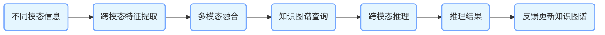

# 基于知识图谱的跨模态推理能力增强

> 关键词：知识图谱、跨模态推理、多模态融合、语义理解、人工智能

> 摘要：本文聚焦于基于知识图谱的跨模态推理能力增强这一前沿领域。在人工智能快速发展的当下，跨模态推理能够综合不同模态（如文本、图像、语音等）的信息进行推理决策，具有重要的研究价值和应用前景。知识图谱作为一种强大的语义知识表示工具，为跨模态推理提供了丰富的背景知识和语义关联。文章详细阐述了相关核心概念、算法原理、数学模型，通过项目实战展示了具体实现过程，探讨了实际应用场景，推荐了相关工具和资源，并对未来发展趋势与挑战进行了总结，旨在为该领域的研究和实践提供全面且深入的参考。

## 1. 背景介绍 
### 1.1 目的和范围
跨模态推理是人工智能领域的一个关键研究方向，旨在让计算机能够像人类一样，从多种不同的模态信息中获取知识并进行推理。然而，目前的跨模态推理技术仍面临诸多挑战，如不同模态之间的语义鸿沟、信息融合困难等。本文章的目的在于探讨如何利用知识图谱来增强跨模态推理能力，通过深入研究知识图谱与跨模态推理的结合机制，提出有效的方法和策略，以提高跨模态推理的准确性和效率。范围涵盖了从理论基础、算法原理到实际应用的多个层面，包括核心概念的阐述、算法的实现、数学模型的分析、项目实战案例的展示以及应用场景的探讨等。

### 1.2 预期读者
本文预期读者包括从事人工智能、计算机科学、机器学习等领域的研究人员和学者，他们希望深入了解跨模态推理和知识图谱相关技术，获取最新的研究动态和方法；也适合对该领域感兴趣的工程师和开发者，他们可以从文章中获取实际应用的指导和参考，用于解决实际项目中的问题；同时，对于相关专业的学生来说，本文可以作为学习和研究的资料，帮助他们建立对该领域的系统认识。

### 1.3 文档结构概述
本文将按照以下结构展开：首先介绍相关的背景知识，包括目的、预期读者和文档结构概述等；接着阐述核心概念与联系，包括知识图谱、跨模态推理的原理和架构，并通过文本示意图和 Mermaid 流程图进行直观展示；然后详细讲解核心算法原理和具体操作步骤，使用 Python 源代码进行阐述；随后介绍数学模型和公式，并通过举例说明其应用；再通过项目实战展示代码实际案例和详细解释说明；之后探讨实际应用场景；接着推荐相关的工具和资源；最后对未来发展趋势与挑战进行总结，并提供常见问题与解答以及扩展阅读和参考资料。

### 1.4 术语表
#### 1.4.1 核心术语定义
- **知识图谱**：是一种用图结构来描述知识和表达各类实体之间关系的语义网络，它将现实世界中的实体、概念及其之间的关系以图的形式进行表示，为计算机提供了一种结构化的知识表示方式。
- **跨模态推理**：指的是在不同模态（如文本、图像、语音等）的信息之间进行推理和决策的过程，通过综合不同模态的信息来获取更全面、准确的知识。
- **多模态融合**：是将来自不同模态的信息进行整合和处理的过程，旨在消除不同模态之间的差异，提取出有用的信息，以支持后续的推理和决策。

#### 1.4.2 相关概念解释
- **语义理解**：是指计算机对自然语言、图像、语音等信息的含义和语义的理解能力，它是跨模态推理的基础，通过语义理解可以将不同模态的信息映射到同一语义空间中。
- **图神经网络**：是一种专门处理图结构数据的神经网络，它可以对知识图谱中的节点和边进行学习和推理，挖掘节点之间的潜在关系。

#### 1.4.3 缩略词列表
- **KG**：Knowledge Graph，知识图谱
- **GNN**：Graph Neural Network，图神经网络
- **CNN**：Convolutional Neural Network，卷积神经网络
- **RNN**：Recurrent Neural Network，循环神经网络

## 2. 核心概念与联系 

### 知识图谱原理
知识图谱的核心思想是将现实世界中的实体、概念及其之间的关系以图的形式进行表示。一个知识图谱通常由节点和边组成，节点表示实体或概念，边表示实体或概念之间的关系。例如，在一个关于人物的知识图谱中，节点可以表示具体的人物，边可以表示人物之间的亲属关系、工作关系等。知识图谱通过三元组的形式来存储知识，每个三元组由头实体、关系和尾实体组成，例如（张三，是李四的父亲，李四）。

### 跨模态推理原理
跨模态推理的目标是在不同模态的信息之间进行推理和决策。不同模态的信息具有不同的特征和表示形式，例如文本信息是由字符组成的序列，图像信息是由像素组成的矩阵。跨模态推理需要将不同模态的信息进行映射和融合，将它们转换到同一语义空间中，以便进行统一的推理和决策。例如，在一个图像问答系统中，需要将图像信息和问题文本信息进行融合，然后根据融合后的信息进行推理，给出正确的答案。

### 知识图谱与跨模态推理的联系
知识图谱为跨模态推理提供了丰富的背景知识和语义关联。通过知识图谱，可以获取不同模态信息之间的潜在关系，帮助跨模态推理更好地理解和处理不同模态的信息。例如，在图像识别任务中，知识图谱可以提供关于图像中物体的语义信息和相关的背景知识，帮助识别模型更准确地识别物体。同时，跨模态推理的结果也可以反馈到知识图谱中，进一步丰富和完善知识图谱。

### 文本示意图
```plaintext
知识图谱 <----> 跨模态推理
|                 |
|                 |
| 提供背景知识    | 反馈推理结果
|                 |
|                 |
V                 V
不同模态信息（文本、图像、语音等）
```

### Mermaid 流程图


## 3. 核心算法原理 & 具体操作步骤 

### 跨模态特征提取算法
跨模态特征提取是跨模态推理的第一步，其目的是从不同模态的信息中提取出具有代表性的特征。对于文本信息，可以使用预训练的语言模型（如 BERT）来提取文本特征；对于图像信息，可以使用卷积神经网络（如 ResNet）来提取图像特征。以下是使用 Python 和 PyTorch 实现的简单示例：

```python
import torch
from transformers import BertModel, BertTokenizer
import torchvision.models as models

# 文本特征提取
tokenizer = BertTokenizer.from_pretrained('bert-base-uncased')
model = BertModel.from_pretrained('bert-base-uncased')

text = "This is a sample text."
inputs = tokenizer(text, return_tensors='pt')
outputs = model(**inputs)
text_features = outputs.last_hidden_state.mean(dim=1)

# 图像特征提取
resnet = models.resnet18(pretrained=True)
resnet.eval()

from PIL import Image
import torchvision.transforms as transforms

image = Image.open('sample_image.jpg')
transform = transforms.Compose([
    transforms.Resize((224, 224)),
    transforms.ToTensor(),
    transforms.Normalize(mean=[0.485, 0.456, 0.406], std=[0.229, 0.224, 0.225])
])
image = transform(image).unsqueeze(0)

with torch.no_grad():
    image_features = resnet(image)
```

### 多模态融合算法
多模态融合的目的是将不同模态的特征进行整合，消除不同模态之间的差异。常见的多模态融合方法包括早期融合、晚期融合和深度融合等。以下是一个简单的晚期融合示例：

```python
# 晚期融合
combined_features = torch.cat((text_features, image_features), dim=1)
```

### 基于知识图谱的推理算法
基于知识图谱的推理算法可以利用知识图谱中的知识和关系进行推理。一种常见的方法是使用图神经网络（GNN）来对知识图谱进行建模和推理。以下是一个简单的 GNN 推理示例：

```python
import torch
import torch.nn.functional as F
from torch_geometric.nn import GCNConv

class GNN(torch.nn.Module):
    def __init__(self, in_channels, hidden_channels, out_channels):
        super(GNN, self).__init__()
        self.conv1 = GCNConv(in_channels, hidden_channels)
        self.conv2 = GCNConv(hidden_channels, out_channels)

    def forward(self, x, edge_index):
        x = self.conv1(x, edge_index)
        x = F.relu(x)
        x = F.dropout(x, training=self.training)
        x = self.conv2(x, edge_index)
        return F.log_softmax(x, dim=1)

# 假设 x 是节点特征，edge_index 是边索引
x = torch.randn(10, 16)
edge_index = torch.tensor([[0, 1, 1, 2], [1, 0, 2, 1]], dtype=torch.long)

model = GNN(in_channels=16, hidden_channels=32, out_channels=2)
output = model(x, edge_index)
```

### 具体操作步骤
1. **数据预处理**：对不同模态的信息进行清洗、标注和格式化处理，以便后续的特征提取和处理。
2. **跨模态特征提取**：使用合适的模型和方法从不同模态的信息中提取出特征。
3. **多模态融合**：将提取的不同模态的特征进行融合，得到综合的特征表示。
4. **知识图谱查询**：根据融合后的特征，在知识图谱中查询相关的知识和关系。
5. **跨模态推理**：利用知识图谱中的知识和关系，结合融合后的特征进行推理，得到推理结果。
6. **结果评估和反馈**：对推理结果进行评估，根据评估结果对模型和知识图谱进行反馈和更新。

## 4. 数学模型和公式 & 详细讲解 & 举例说明 

### 跨模态特征提取的数学模型
在跨模态特征提取中，对于文本信息，通常使用预训练的语言模型进行特征提取。以 BERT 为例，其输入是一个文本序列 $X = [x_1, x_2, \cdots, x_n]$，经过词嵌入、位置嵌入和段嵌入后，得到输入表示 $E = [e_1, e_2, \cdots, e_n]$。然后，通过多层 Transformer 编码器进行处理，得到输出表示 $H = [h_1, h_2, \cdots, h_n]$。最后，可以取 $H$ 的均值作为文本的特征表示 $\mathbf{f}_{text}$：

$$\mathbf{f}_{text} = \frac{1}{n} \sum_{i=1}^{n} h_i$$

对于图像信息，使用卷积神经网络（如 ResNet）进行特征提取。假设输入图像为 $I$，经过卷积层、池化层等操作后，得到特征图 $F$。可以对特征图进行全局平均池化，得到图像的特征表示 $\mathbf{f}_{image}$：

$$\mathbf{f}_{image} = \frac{1}{W \times H} \sum_{i=1}^{W} \sum_{j=1}^{H} F_{i,j}$$

其中，$W$ 和 $H$ 分别是特征图的宽度和高度。

### 多模态融合的数学模型
晚期融合是一种简单且常用的多模态融合方法，其数学模型为将不同模态的特征进行拼接。假设文本特征为 $\mathbf{f}_{text}$，图像特征为 $\mathbf{f}_{image}$，则融合后的特征 $\mathbf{f}_{combined}$ 为：

$$\mathbf{f}_{combined} = [\mathbf{f}_{text}; \mathbf{f}_{image}]$$

其中，$[\cdot; \cdot]$ 表示向量的拼接操作。

### 基于知识图谱的推理数学模型
在基于知识图谱的推理中，使用图神经网络（GNN）进行建模。GNN 的核心是消息传递机制，通过节点之间的消息传递来更新节点的特征。以图卷积网络（GCN）为例，其节点特征更新公式为：

$$\mathbf{h}_i^{(l+1)} = \sigma \left( \sum_{j \in \mathcal{N}(i)} \frac{1}{\sqrt{d_i d_j}} \mathbf{W}^{(l)} \mathbf{h}_j^{(l)} \right)$$

其中，$\mathbf{h}_i^{(l)}$ 是节点 $i$ 在第 $l$ 层的特征表示，$\mathcal{N}(i)$ 是节点 $i$ 的邻居节点集合，$d_i$ 和 $d_j$ 分别是节点 $i$ 和节点 $j$ 的度，$\mathbf{W}^{(l)}$ 是第 $l$ 层的可学习权重矩阵，$\sigma$ 是激活函数。

### 举例说明
假设我们有一个图像问答系统，输入的图像是一张包含一只猫的图片，问题是“图片中的动物是什么？”。首先，使用 ResNet 提取图像特征 $\mathbf{f}_{image}$，使用 BERT 提取问题文本特征 $\mathbf{f}_{text}$。然后，将这两个特征进行晚期融合，得到 $\mathbf{f}_{combined}$。接着，根据 $\mathbf{f}_{combined}$ 在知识图谱中查询相关的知识，发现猫是一种动物。最后，利用 GNN 进行推理，得出答案是“猫”。

## 5. 项目实战：代码实际案例和详细解释说明 

### 5.1  开发环境搭建
#### 安装 Python
首先，确保你已经安装了 Python 3.7 或更高版本。可以从 Python 官方网站（https://www.python.org/downloads/） 下载并安装。

#### 安装必要的库
使用以下命令安装必要的库：
```bash
pip install torch torchvision transformers torch_geometric
```

### 5.2  源代码详细实现和代码解读
以下是一个简单的基于知识图谱的跨模态推理项目的代码实现：

```python
import torch
from transformers import BertModel, BertTokenizer
import torchvision.models as models
from torch_geometric.nn import GCNConv
import torch.nn.functional as F

# 文本特征提取
tokenizer = BertTokenizer.from_pretrained('bert-base-uncased')
model_text = BertModel.from_pretrained('bert-base-uncased')

def extract_text_features(text):
    inputs = tokenizer(text, return_tensors='pt')
    outputs = model_text(**inputs)
    text_features = outputs.last_hidden_state.mean(dim=1)
    return text_features

# 图像特征提取
resnet = models.resnet18(pretrained=True)
resnet.eval()

from PIL import Image
import torchvision.transforms as transforms

transform = transforms.Compose([
    transforms.Resize((224, 224)),
    transforms.ToTensor(),
    transforms.Normalize(mean=[0.485, 0.456, 0.406], std=[0.229, 0.224, 0.225])
])

def extract_image_features(image_path):
    image = Image.open(image_path)
    image = transform(image).unsqueeze(0)
    with torch.no_grad():
        image_features = resnet(image)
    return image_features

# 多模态融合
def multimodal_fusion(text_features, image_features):
    combined_features = torch.cat((text_features, image_features), dim=1)
    return combined_features

# 基于知识图谱的推理模型
class GNN(torch.nn.Module):
    def __init__(self, in_channels, hidden_channels, out_channels):
        super(GNN, self).__init__()
        self.conv1 = GCNConv(in_channels, hidden_channels)
        self.conv2 = GCNConv(hidden_channels, out_channels)

    def forward(self, x, edge_index):
        x = self.conv1(x, edge_index)
        x = F.relu(x)
        x = F.dropout(x, training=self.training)
        x = self.conv2(x, edge_index)
        return F.log_softmax(x, dim=1)

# 示例数据
text = "This is a sample text."
image_path = "sample_image.jpg"

# 提取特征
text_features = extract_text_features(text)
image_features = extract_image_features(image_path)

# 多模态融合
combined_features = multimodal_fusion(text_features, image_features)

# 假设的知识图谱数据
x = torch.randn(10, combined_features.shape[1])
edge_index = torch.tensor([[0, 1, 1, 2], [1, 0, 2, 1]], dtype=torch.long)

# 初始化推理模型
model_gnn = GNN(in_channels=combined_features.shape[1], hidden_channels=32, out_channels=2)

# 推理
output = model_gnn(x, edge_index)
print(output)
```

### 5.3  代码解读与分析
1. **文本特征提取**：使用 `BertTokenizer` 和 `BertModel` 从文本中提取特征，将文本转换为输入张量，经过 BERT 模型处理后，取最后一层隐藏状态的均值作为文本特征。
2. **图像特征提取**：使用 `ResNet18` 模型从图像中提取特征，首先对图像进行预处理，然后将处理后的图像输入到 ResNet 模型中，得到图像特征。
3. **多模态融合**：将文本特征和图像特征进行拼接，得到综合的特征表示。
4. **基于知识图谱的推理模型**：定义了一个简单的 GNN 模型，包含两个图卷积层，通过消息传递机制更新节点的特征，最后使用 `log_softmax` 函数输出推理结果。
5. **示例数据处理**：提供了示例文本和图像路径，调用相应的函数提取特征，进行多模态融合，然后使用 GNN 模型进行推理。

## 6. 实际应用场景 
### 智能客服
在智能客服系统中，用户可能会通过文本、语音或图像等多种方式提出问题。基于知识图谱的跨模态推理技术可以综合不同模态的信息，更好地理解用户的意图，提供更准确的回答。例如，用户可能会发送一张产品图片并询问相关问题，系统可以通过图像识别和知识图谱的关联，快速准确地回答用户的问题。

### 自动驾驶
在自动驾驶领域，车辆需要处理来自摄像头、雷达、激光雷达等多种传感器的信息。基于知识图谱的跨模态推理技术可以将不同传感器的信息进行融合，结合知识图谱中的交通规则、地图信息等，进行更准确的决策和规划。例如，通过图像识别和知识图谱的关联，识别出前方的交通标志和路况，从而调整车辆的行驶速度和方向。

### 医疗诊断
在医疗诊断中，医生通常会参考患者的病历、影像资料（如 X 光、CT 等）和症状描述等多种信息。基于知识图谱的跨模态推理技术可以将这些不同模态的信息进行整合，结合医学知识图谱中的疾病诊断知识，辅助医生进行更准确的诊断。例如，通过对患者的影像资料进行分析，结合病历和症状描述，利用知识图谱中的疾病诊断规则，给出可能的疾病诊断结果。

### 智能教育
在智能教育领域，学生的学习过程中会产生多种模态的信息，如学习记录、作业、考试成绩、学习视频等。基于知识图谱的跨模态推理技术可以综合这些信息，结合教育知识图谱中的知识结构和学习路径，为学生提供个性化的学习建议和辅导。例如，通过分析学生的学习视频和作业情况，结合知识图谱中的知识点关联，发现学生的薄弱环节，提供针对性的学习资源和练习。

## 7. 工具和资源推荐
### 7.1 学习资源推荐
#### 7.1.1 书籍推荐
- 《人工智能：一种现代的方法》：全面介绍了人工智能的各个领域，包括知识表示、推理、机器学习等，是学习人工智能的经典教材。
- 《深度学习》：由深度学习领域的三位先驱 Ian Goodfellow、Yoshua Bengio 和 Aaron Courville 撰写，详细介绍了深度学习的基本原理和算法。
- 《知识图谱：方法、实践与应用》：系统介绍了知识图谱的相关理论、方法和应用案例，对于深入了解知识图谱有很大帮助。

#### 7.1.2 在线课程
- Coursera 上的 “Deep Learning Specialization”：由 Andrew Ng 教授讲授，是深度学习领域的经典在线课程，涵盖了深度学习的各个方面。
- edX 上的 “Artificial Intelligence”：由麻省理工学院（MIT）提供，系统介绍了人工智能的基本概念、算法和应用。
- B 站上的 “知识图谱入门与实践”：由国内知名学者讲授，详细介绍了知识图谱的构建、推理和应用等方面的知识。

#### 7.1.3 技术博客和网站
- Medium：上面有很多关于人工智能、知识图谱和跨模态推理的技术文章和研究成果分享。
- arXiv：是一个预印本服务器，上面可以找到很多最新的学术论文和研究报告。
- 机器之心：专注于人工智能领域的技术资讯和深度报道，提供了很多有价值的技术文章和案例分析。

### 7.2 开发工具框架推荐
#### 7.2.1 IDE和编辑器
- PyCharm：是一款专门为 Python 开发设计的集成开发环境（IDE），具有强大的代码编辑、调试和自动补全功能。
- Jupyter Notebook：是一个交互式的开发环境，适合进行数据分析、模型训练和实验验证等工作。
- Visual Studio Code：是一款轻量级的代码编辑器，支持多种编程语言和插件扩展，具有良好的开发体验。

#### 7.2.2 调试和性能分析工具
- TensorBoard：是 TensorFlow 提供的可视化工具，可以用于可视化模型的训练过程、损失曲线、准确率等指标。
- PyTorch Profiler：是 PyTorch 提供的性能分析工具，可以帮助开发者分析模型的性能瓶颈，优化代码性能。
- cProfile：是 Python 内置的性能分析工具，可以用于分析 Python 代码的执行时间和函数调用关系。

#### 7.2.3 相关框架和库
- PyTorch：是一个开源的深度学习框架，提供了丰富的深度学习模型和工具，支持 GPU 加速，方便进行模型训练和推理。
- TensorFlow：是另一个广泛使用的深度学习框架，具有强大的分布式训练和部署能力，适合大规模的深度学习应用。
- DGL（Deep Graph Library）：是一个专门用于图神经网络的深度学习框架，提供了丰富的图神经网络模型和工具，方便进行知识图谱的建模和推理。

### 7.3 相关论文著作推荐
#### 7.3.1 经典论文
- “BERT: Pre-training of Deep Bidirectional Transformers for Language Understanding”：介绍了 BERT 模型的原理和训练方法，是自然语言处理领域的经典论文。
- “Deep Residual Learning for Image Recognition”：提出了残差网络（ResNet）的概念，解决了深度神经网络训练中的梯度消失问题，是计算机视觉领域的经典论文。
- “Knowledge Graph Embedding: A Survey of Approaches and Applications”：对知识图谱嵌入技术进行了全面的综述，介绍了各种知识图谱嵌入方法和应用场景。

#### 7.3.2 最新研究成果
- 在 arXiv 上搜索 “Knowledge Graph and Cross-modal Reasoning” 可以找到很多最新的研究论文，这些论文反映了该领域的最新研究动态和趋势。
- 参加相关的学术会议，如 ACL（Association for Computational Linguistics）、CVPR（IEEE Conference on Computer Vision and Pattern Recognition）等，这些会议上会有很多关于知识图谱和跨模态推理的最新研究成果发表。

#### 7.3.3 应用案例分析
- 在一些开源项目平台（如 GitHub）上可以找到很多基于知识图谱和跨模态推理的应用案例，通过分析这些案例可以学习到实际应用中的技术和方法。
- 一些企业和研究机构会发布他们的应用案例和技术报告，如 Google、Facebook 等公司的技术博客上会有很多关于人工智能和跨模态推理的应用案例分享。

## 8. 总结：未来发展趋势与挑战
### 未来发展趋势
- **多模态融合的深度和广度不断拓展**：未来的跨模态推理技术将不仅仅局限于文本、图像和语音等常见模态，还将涉及到更多的模态，如触觉、嗅觉等，实现更加全面和深入的多模态融合。
- **知识图谱的不断完善和扩展**：知识图谱将不断吸收和整合更多的知识和信息，涵盖更广泛的领域和场景，为跨模态推理提供更丰富和准确的背景知识。
- **与其他技术的融合创新**：基于知识图谱的跨模态推理技术将与其他人工智能技术（如强化学习、迁移学习等）进行融合创新，产生更强大的智能系统。
- **应用场景的不断拓展**：该技术将在更多的领域和场景中得到应用，如智能家居、智能金融、智能工业等，为人们的生活和工作带来更多的便利和价值。

### 挑战
- **语义鸿沟问题**：不同模态之间的语义差异仍然是跨模态推理面临的主要挑战之一，如何有效地消除语义鸿沟，实现不同模态信息的准确映射和融合，是需要进一步研究的问题。
- **知识图谱的构建和更新**：知识图谱的构建和更新需要大量的人力和物力投入，如何高效地构建和更新知识图谱，保证知识图谱的准确性和完整性，是一个亟待解决的问题。
- **计算资源和效率问题**：跨模态推理需要处理大量的多模态数据，对计算资源和效率提出了很高的要求。如何优化算法和模型，提高计算效率，降低计算成本，是需要解决的关键问题。
- **隐私和安全问题**：在跨模态推理过程中，涉及到大量的用户数据和隐私信息，如何保证数据的隐私和安全，防止数据泄露和滥用，是需要重视的问题。

## 9. 附录：常见问题与解答
### 问题 1：什么是跨模态推理？
答：跨模态推理是指在不同模态（如文本、图像、语音等）的信息之间进行推理和决策的过程，通过综合不同模态的信息来获取更全面、准确的知识。

### 问题 2：知识图谱在跨模态推理中有什么作用？
答：知识图谱为跨模态推理提供了丰富的背景知识和语义关联。通过知识图谱，可以获取不同模态信息之间的潜在关系，帮助跨模态推理更好地理解和处理不同模态的信息。

### 问题 3：如何进行跨模态特征提取？
答：对于文本信息，可以使用预训练的语言模型（如 BERT）来提取文本特征；对于图像信息，可以使用卷积神经网络（如 ResNet）来提取图像特征。

### 问题 4：多模态融合有哪些方法？
答：常见的多模态融合方法包括早期融合、晚期融合和深度融合等。早期融合是在特征提取之前将不同模态的信息进行融合；晚期融合是在特征提取之后将不同模态的特征进行融合；深度融合是在模型训练过程中同时处理不同模态的信息。

### 问题 5：如何评估跨模态推理的性能？
答：可以使用准确率、召回率、F1 值等指标来评估跨模态推理的性能。同时，还可以根据具体的应用场景和任务，设计相应的评估指标和方法。

## 10. 扩展阅读 & 参考资料
- [1] Goodfellow, I., Bengio, Y., & Courville, A. (2016). Deep Learning. MIT Press.
- [2] Russell, S. J., & Norvig, P. (2020). Artificial Intelligence: A Modern Approach. Pearson.
- [3] 陈华钧. 知识图谱：方法、实践与应用. 电子工业出版社.
- [4] Devlin, J., Chang, M. W., Lee, K., & Toutanova, K. (2018). BERT: Pre-training of Deep Bidirectional Transformers for Language Understanding. arXiv preprint arXiv:1810.04805.
- [5] He, K., Zhang, X., Ren, S., & Sun, J. (2016). Deep Residual Learning for Image Recognition. In Proceedings of the IEEE conference on computer vision and pattern recognition (pp. 770-778).
- [6] Wang, Q., Mao, Z., Wang, B., & Guo, L. (2017). Knowledge Graph Embedding: A Survey of Approaches and Applications. IEEE Transactions on Knowledge and Data Engineering, 29(12), 2724-2743.
- [7] PyTorch 官方文档：https://pytorch.org/docs/stable/index.html
- [8] TensorFlow 官方文档：https://www.tensorflow.org/api_docs
- [9] DGL 官方文档：https://docs.dgl.ai/
- [10] Coursera 课程：https://www.coursera.org/
- [11] edX 课程：https://www.edx.org/
- [12] arXiv 预印本服务器：https://arxiv.org/
- [13] Medium 技术博客：https://medium.com/
- [14] 机器之心：https://www.alienstar.com.cn/