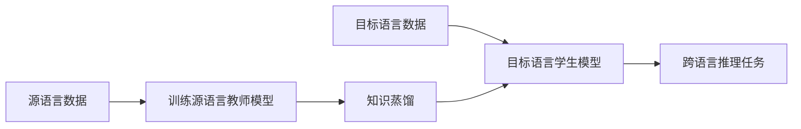

# 基于知识蒸馏的跨语言推理能力迁移技术

> 关键词：知识蒸馏、跨语言推理、能力迁移、自然语言处理、多语言模型

> 摘要：本文深入探讨基于知识蒸馏的跨语言推理能力迁移技术。随着全球化的发展，多语言环境下的自然语言处理需求日益增长，跨语言推理能力的迁移成为研究热点。知识蒸馏作为一种有效的模型压缩和知识传递方法，为实现跨语言推理能力的迁移提供了新的思路。文章详细介绍了该技术的背景、核心概念、算法原理、数学模型，通过项目实战展示其具体应用，分析实际应用场景，并推荐相关工具和资源，最后对未来发展趋势与挑战进行总结。

## 1. 背景介绍 
### 1.1 目的和范围
随着互联网的全球化，信息以多种语言形式存在。自然语言处理（NLP）任务需要处理多种语言的文本，如机器翻译、跨语言问答系统等。然而，不同语言之间存在着语法、词汇和语义等方面的差异，这给跨语言的推理和理解带来了挑战。基于知识蒸馏的跨语言推理能力迁移技术旨在解决这些问题，通过将一种语言的推理能力迁移到其他语言中，提高多语言模型的性能。本文的范围涵盖了该技术的理论基础、算法实现、实际应用等方面。

### 1.2 预期读者
本文预期读者包括自然语言处理领域的研究人员、开发者、对跨语言技术感兴趣的学者以及相关专业的学生。这些读者具备一定的自然语言处理和机器学习基础知识，希望深入了解基于知识蒸馏的跨语言推理能力迁移技术的原理和应用。

### 1.3 文档结构概述
本文将按照以下结构进行组织：首先介绍背景知识，包括目的、预期读者和文档结构概述；接着阐述核心概念与联系，包括知识蒸馏、跨语言推理等概念及其关系；然后详细讲解核心算法原理和具体操作步骤，并给出Python源代码；之后介绍数学模型和公式，并举例说明；通过项目实战展示代码实际案例和详细解释；分析实际应用场景；推荐相关工具和资源；最后总结未来发展趋势与挑战，并提供常见问题与解答和扩展阅读参考资料。

### 1.4 术语表
#### 1.4.1 核心术语定义
- **知识蒸馏（Knowledge Distillation）**：一种模型压缩技术，通过将一个大型的、表现良好的教师模型的知识传递给一个小型的学生模型，使得学生模型能够在保持较高性能的同时减少计算资源的消耗。
- **跨语言推理（Cross - Lingual Reasoning）**：在不同语言之间进行推理和理解的能力，即能够根据一种语言的文本信息，在另一种语言中进行合理的推理和判断。
- **能力迁移（Capability Transfer）**：将一种语言或模型所具备的某种能力（如推理能力）转移到另一种语言或模型中的过程。

#### 1.4.2 相关概念解释
- **教师模型（Teacher Model）**：在知识蒸馏中，通常是一个大型的、复杂的模型，具有较高的性能和丰富的知识。它作为知识的来源，将其学到的知识传递给学生模型。
- **学生模型（Student Model）**：在知识蒸馏中，是一个相对较小、较简单的模型，通过学习教师模型的知识来提高自身的性能。
- **多语言模型（Multilingual Model）**：能够处理多种语言文本的模型，旨在解决不同语言之间的共性和差异问题，实现跨语言的任务处理。

#### 1.4.3 缩略词列表
- **NLP**：Natural Language Processing（自然语言处理）
- **MLM**：Masked Language Model（掩码语言模型）

## 2. 核心概念与联系 

### 2.1 知识蒸馏原理
知识蒸馏的核心思想是通过让学生模型学习教师模型的输出概率分布，而不仅仅是学习训练数据的标签，从而将教师模型的知识传递给学生模型。教师模型通常在大规模数据上进行训练，具有更丰富的知识和更好的泛化能力。学生模型通过模仿教师模型的输出，能够更快地收敛并达到较好的性能。

下面是知识蒸馏的文本示意图：

教师模型（大型、高性能） -- 输出概率分布 --> 知识蒸馏 --> 学生模型（小型、待优化）

### 2.2 跨语言推理原理
跨语言推理的目标是在不同语言之间建立语义联系，使得模型能够在一种语言的文本输入下，在另一种语言中进行合理的推理。这通常需要解决语言之间的语法、词汇和语义差异。一种常见的方法是使用多语言模型，通过共享参数和表示学习，让模型能够捕捉不同语言之间的共性和差异。

### 2.3 能力迁移原理
能力迁移是将一种语言或模型所具备的推理能力转移到其他语言或模型中的过程。在基于知识蒸馏的跨语言推理能力迁移中，通过知识蒸馏将源语言的教师模型的推理能力传递给目标语言的学生模型，使得学生模型在目标语言上也能够进行有效的推理。

### 2.4 Mermaid 流程图


## 3. 核心算法原理 & 具体操作步骤 

### 3.1 知识蒸馏算法原理
知识蒸馏的核心是最小化学生模型的输出概率分布与教师模型的输出概率分布之间的差异。通常使用KL散度（Kullback - Leibler Divergence）作为损失函数来衡量这种差异。

Python源代码实现如下：
```python
import torch
import torch.nn.functional as F

# 定义教师模型和学生模型（这里简单用线性层代替）
teacher_model = torch.nn.Linear(10, 5)
student_model = torch.nn.Linear(10, 5)

# 定义输入数据
input_data = torch.randn(32, 10)

# 教师模型的输出
teacher_output = teacher_model(input_data)
teacher_probs = F.softmax(teacher_output / 2.0, dim = 1)  # 温度系数为2

# 学生模型的输出
student_output = student_model(input_data)
student_probs = F.softmax(student_output / 2.0, dim = 1)  # 温度系数为2

# 计算KL散度损失
kl_loss = F.kl_div(torch.log(student_probs), teacher_probs, reduction='batchmean')
```

### 3.2 跨语言推理能力迁移的具体操作步骤
1. **数据准备**：收集源语言和目标语言的平行语料或相关数据集，对数据进行预处理，如分词、标注等。
2. **训练源语言教师模型**：使用源语言的数据集训练一个大型的、高性能的教师模型，可以是基于Transformer架构的预训练模型。
3. **初始化目标语言学生模型**：可以使用随机初始化或基于多语言预训练模型进行初始化。
4. **知识蒸馏过程**：在目标语言的数据集上，通过知识蒸馏的方法，让学生模型学习教师模型的输出概率分布。在训练过程中，同时使用目标语言的标签信息和教师模型的软标签信息。
5. **评估和优化**：使用目标语言的测试集对学生模型进行评估，根据评估结果调整模型参数和训练策略，直到达到满意的性能。

### 3.3 代码实现知识蒸馏训练循环
```python
import torch
import torch.nn as nn
import torch.optim as optim
import torch.nn.functional as F

# 定义教师模型和学生模型
class TeacherModel(nn.Module):
    def __init__(self):
        super(TeacherModel, self).__init__()
        self.fc1 = nn.Linear(10, 20)
        self.fc2 = nn.Linear(20, 5)

    def forward(self, x):
        x = F.relu(self.fc1(x))
        x = self.fc2(x)
        return x

class StudentModel(nn.Module):
    def __init__(self):
        super(StudentModel, self).__init__()
        self.fc = nn.Linear(10, 5)

    def forward(self, x):
        x = self.fc(x)
        return x

# 初始化模型
teacher_model = TeacherModel()
student_model = StudentModel()

# 定义损失函数和优化器
criterion_ce = nn.CrossEntropyLoss()
criterion_kl = nn.KLDivLoss(reduction='batchmean')
optimizer = optim.Adam(student_model.parameters(), lr=0.001)

# 训练循环
num_epochs = 10
for epoch in range(num_epochs):
    # 生成随机输入数据和标签
    input_data = torch.randn(32, 10)
    labels = torch.randint(0, 5, (32,))

    # 教师模型的输出
    teacher_output = teacher_model(input_data)
    teacher_probs = F.softmax(teacher_output / 2.0, dim = 1)

    # 学生模型的输出
    student_output = student_model(input_data)
    student_probs = F.softmax(student_output / 2.0, dim = 1)

    # 计算损失
    ce_loss = criterion_ce(student_output, labels)
    kl_loss = criterion_kl(torch.log(student_probs), teacher_probs)
    total_loss = ce_loss + kl_loss

    # 反向传播和优化
    optimizer.zero_grad()
    total_loss.backward()
    optimizer.step()

    print(f'Epoch {epoch + 1}/{num_epochs}, Loss: {total_loss.item()}')
```

## 4. 数学模型和公式 & 详细讲解 & 举例说明 

### 4.1 KL散度公式
KL散度是用来衡量两个概率分布之间差异的一种度量。设 $P$ 和 $Q$ 是两个概率分布，它们的KL散度定义为：
$$
D_{KL}(P||Q)=\sum_{i}P(i)\log\frac{P(i)}{Q(i)}
$$
在知识蒸馏中，$P$ 通常是教师模型的输出概率分布，$Q$ 是学生模型的输出概率分布。

### 4.2 知识蒸馏损失函数
知识蒸馏的损失函数通常由两部分组成：交叉熵损失和KL散度损失。交叉熵损失用于衡量学生模型的输出与真实标签之间的差异，KL散度损失用于衡量学生模型的输出概率分布与教师模型的输出概率分布之间的差异。

总损失函数可以表示为：
$$
L = \alpha L_{CE}+(1 - \alpha)L_{KL}
$$
其中，$L_{CE}$ 是交叉熵损失，$L_{KL}$ 是KL散度损失，$\alpha$ 是一个超参数，用于平衡两部分损失的权重。

### 4.3 举例说明
假设我们有一个三分类任务，教师模型的输出概率分布为 $P = [0.1, 0.6, 0.3]$，学生模型的输出概率分布为 $Q = [0.2, 0.5, 0.3]$。

首先计算KL散度：
$$
D_{KL}(P||Q)=0.1\log\frac{0.1}{0.2}+0.6\log\frac{0.6}{0.5}+0.3\log\frac{0.3}{0.3}\approx0.051
$$

假设真实标签为 $[0, 1, 0]$，学生模型的原始输出为 $[1, 2, 0]$，则交叉熵损失为：
$$
L_{CE}=-\sum_{i}y_{i}\log p_{i}=- (0\times\log\frac{e^{1}}{e^{1}+e^{2}+e^{0}}+1\times\log\frac{e^{2}}{e^{1}+e^{2}+e^{0}}+0\times\log\frac{e^{0}}{e^{1}+e^{2}+e^{0}})\approx0.407
$$

假设 $\alpha = 0.5$，则总损失为：
$$
L = 0.5\times0.407+(1 - 0.5)\times0.051 = 0.229
$$

## 5. 项目实战：代码实际案例和详细解释说明 

### 5.1  开发环境搭建
- **操作系统**：Ubuntu 20.04
- **Python版本**：Python 3.8
- **深度学习框架**：PyTorch 1.9.0
- **其他依赖库**：`transformers`、`torchtext` 等

安装依赖库的命令如下：
```bash
pip install torch torchvision torchaudio
pip install transformers torchtext
```

### 5.2  源代码详细实现和代码解读
以下是一个基于 `transformers` 库的跨语言推理能力迁移的实际案例：
```python
import torch
from transformers import AutoTokenizer, AutoModelForSequenceClassification
from torch.utils.data import DataLoader, Dataset
import torch.nn.functional as F

# 定义数据集类
class CustomDataset(Dataset):
    def __init__(self, texts, labels, tokenizer, max_length):
        self.texts = texts
        self.labels = labels
        self.tokenizer = tokenizer
        self.max_length = max_length

    def __len__(self):
        return len(self.texts)

    def __getitem__(self, idx):
        text = self.texts[idx]
        label = self.labels[idx]
        encoding = self.tokenizer.encode_plus(
            text,
            add_special_tokens=True,
            max_length=self.max_length,
            padding='max_length',
            truncation=True,
            return_tensors='pt'
        )
        return {
            'input_ids': encoding['input_ids'].flatten(),
            'attention_mask': encoding['attention_mask'].flatten(),
            'labels': torch.tensor(label, dtype=torch.long)
        }

# 加载预训练的教师模型和学生模型
teacher_model_name = 'bert-base-multilingual-cased'
student_model_name = 'distilbert-base-multilingual-cased'

teacher_tokenizer = AutoTokenizer.from_pretrained(teacher_model_name)
teacher_model = AutoModelForSequenceClassification.from_pretrained(teacher_model_name, num_labels=2)

student_tokenizer = AutoTokenizer.from_pretrained(student_model_name)
student_model = AutoModelForSequenceClassification.from_pretrained(student_model_name, num_labels=2)

# 准备数据
train_texts = ['This is a positive sentence', 'This is a negative sentence']
train_labels = [1, 0]

train_dataset = CustomDataset(train_texts, train_labels, student_tokenizer, max_length=128)
train_dataloader = DataLoader(train_dataset, batch_size=2, shuffle=True)

# 定义损失函数和优化器
criterion_ce = torch.nn.CrossEntropyLoss()
criterion_kl = torch.nn.KLDivLoss(reduction='batchmean')
optimizer = torch.optim.Adam(student_model.parameters(), lr=2e-5)

# 训练循环
num_epochs = 3
for epoch in range(num_epochs):
    student_model.train()
    total_loss = 0
    for batch in train_dataloader:
        input_ids = batch['input_ids']
        attention_mask = batch['attention_mask']
        labels = batch['labels']

        # 教师模型的输出
        with torch.no_grad():
            teacher_outputs = teacher_model(input_ids, attention_mask=attention_mask)
            teacher_logits = teacher_outputs.logits
            teacher_probs = F.softmax(teacher_logits / 2.0, dim = 1)

        # 学生模型的输出
        student_outputs = student_model(input_ids, attention_mask=attention_mask)
        student_logits = student_outputs.logits
        student_probs = F.softmax(student_logits / 2.0, dim = 1)

        # 计算损失
        ce_loss = criterion_ce(student_logits, labels)
        kl_loss = criterion_kl(torch.log(student_probs), teacher_probs)
        loss = ce_loss + kl_loss

        # 反向传播和优化
        optimizer.zero_grad()
        loss.backward()
        optimizer.step()

        total_loss += loss.item()

    print(f'Epoch {epoch + 1}/{num_epochs}, Loss: {total_loss / len(train_dataloader)}')
```

### 5.3  代码解读与分析
- **数据集类 `CustomDataset`**：用于处理输入文本和标签，将文本进行分词和编码，转换为模型可以接受的输入格式。
- **加载预训练模型**：使用 `transformers` 库加载预训练的教师模型和学生模型，这里使用的是多语言的BERT和DistilBERT模型。
- **数据准备**：将训练文本和标签封装成数据集，并使用 `DataLoader` 进行批量处理。
- **损失函数和优化器**：使用交叉熵损失和KL散度损失作为总损失函数，使用Adam优化器进行参数更新。
- **训练循环**：在每个epoch中，首先让学生模型处于训练模式，然后遍历训练数据的每个批次。对于每个批次，计算教师模型的输出概率分布和学生模型的输出概率分布，计算损失并进行反向传播和优化。

## 6. 实际应用场景 
### 6.1 跨语言问答系统
在跨语言问答系统中，用户可以使用不同语言提出问题，系统需要能够理解问题并给出正确的答案。基于知识蒸馏的跨语言推理能力迁移技术可以将一种语言的问答推理能力迁移到其他语言中，提高系统的跨语言处理能力。

### 6.2 机器翻译
在机器翻译中，除了进行文本的翻译，还需要理解源语言和目标语言的语义信息，进行合理的推理。通过跨语言推理能力迁移，可以提高翻译的准确性和流畅性。

### 6.3 跨语言情感分析
跨语言情感分析需要判断不同语言文本的情感倾向。利用该技术可以将一种语言的情感分析推理能力迁移到其他语言中，实现更准确的跨语言情感分析。

### 6.4 多语言信息检索
在多语言信息检索中，用户可能使用不同语言进行查询，系统需要能够理解不同语言的查询意图并返回相关的信息。跨语言推理能力迁移技术可以帮助系统更好地理解不同语言的查询，提高检索的准确性。

## 7. 工具和资源推荐
### 7.1 学习资源推荐
#### 7.1.1 书籍推荐
- 《自然语言处理入门》：这本书系统地介绍了自然语言处理的基本概念、方法和技术，适合初学者入门。
- 《深度学习》：由Ian Goodfellow等人撰写，是深度学习领域的经典著作，对理解基于深度学习的跨语言推理技术有很大帮助。
- 《神经网络与深度学习》：详细介绍了神经网络和深度学习的原理和算法，对于深入理解知识蒸馏和跨语言模型有重要参考价值。

#### 7.1.2 在线课程
- Coursera上的“Natural Language Processing Specialization”：由顶尖大学的教授授课，全面介绍自然语言处理的各个方面。
- edX上的“Deep Learning Fundamentals”：帮助学习者掌握深度学习的基本原理和方法，为学习跨语言推理技术打下基础。
- 哔哩哔哩上的一些自然语言处理相关的教学视频：有很多博主分享了自然语言处理的实践经验和代码实现，对于实际操作有很大帮助。

#### 7.1.3 技术博客和网站
- Hugging Face博客：提供了大量关于自然语言处理模型和技术的最新研究成果和实践经验。
- Medium上的自然语言处理相关文章：有很多专业人士分享了自己的研究和实践心得。
- arXiv.org：是一个预印本论文库，能够及时获取自然语言处理领域的最新研究成果。

### 7.2 开发工具框架推荐
#### 7.2.1 IDE和编辑器
- PyCharm：是一款专业的Python集成开发环境，提供了丰富的代码编辑、调试和版本控制等功能。
- Visual Studio Code：轻量级的代码编辑器，支持多种编程语言和插件，适合快速开发和调试。

#### 7.2.2 调试和性能分析工具
- TensorBoard：是TensorFlow的可视化工具，也可以用于PyTorch模型的可视化和性能分析。
- PyTorch Profiler：可以帮助开发者分析模型的性能瓶颈，优化代码。

#### 7.2.3 相关框架和库
- `transformers`：Hugging Face开发的自然语言处理框架，提供了大量预训练的语言模型和工具，方便进行跨语言任务的开发。
- `torchtext`：PyTorch官方的自然语言处理库，提供了数据处理和加载的工具。
- `sentence-transformers`：用于生成句子嵌入的库，对于跨语言语义理解有很大帮助。

### 7.3 相关论文著作推荐
#### 7.3.1 经典论文
- “Distilling the Knowledge in a Neural Network”：这是知识蒸馏领域的经典论文，首次提出了知识蒸馏的概念和方法。
- “BERT: Pre-training of Deep Bidirectional Transformers for Language Understanding”：介绍了BERT模型的预训练方法和应用，对自然语言处理领域产生了深远影响。

#### 7.3.2 最新研究成果
- 关注ACL（Association for Computational Linguistics）、EMNLP（Conference on Empirical Methods in Natural Language Processing）等自然语言处理领域的顶级会议，获取最新的研究成果。
- 在arXiv上搜索“cross-lingual reasoning”和“knowledge distillation”等关键词，获取相关的最新预印本论文。

#### 7.3.3 应用案例分析
- 一些企业和研究机构会在自己的官方网站或技术博客上分享跨语言推理技术的应用案例，可以从中学习实际应用中的经验和方法。

## 8. 总结：未来发展趋势与挑战
### 8.1 未来发展趋势
- **多模态融合**：未来的跨语言推理技术可能会与图像、音频等多模态信息融合，实现更加全面和智能的跨语言理解和推理。
- **低资源语言支持**：随着全球化的发展，对低资源语言的处理需求日益增长。基于知识蒸馏的跨语言推理能力迁移技术可以帮助提高低资源语言的处理性能。
- **个性化跨语言推理**：根据用户的个性化需求和偏好，提供更加精准的跨语言推理服务。

### 8.2 挑战
- **语言差异处理**：不同语言之间存在着复杂的语法、词汇和语义差异，如何更好地处理这些差异是跨语言推理技术面临的重要挑战。
- **知识蒸馏效率**：知识蒸馏的过程可能会比较耗时和耗资源，如何提高知识蒸馏的效率是需要解决的问题。
- **数据质量和数量**：跨语言推理需要大量高质量的平行语料和标注数据，数据的获取和标注成本较高，数据质量也会影响模型的性能。

## 9. 附录：常见问题与解答
### 9.1 知识蒸馏中温度系数的作用是什么？
温度系数用于调整教师模型和学生模型输出概率分布的平滑程度。较高的温度系数会使概率分布更加平滑，使得模型更加关注类别之间的相对关系，有助于知识的传递。

### 9.2 如何选择合适的教师模型和学生模型？
教师模型通常选择性能较好、参数量较大的预训练模型，如BERT等。学生模型可以选择参数量较小的轻量级模型，如DistilBERT等。同时，要考虑模型的语言支持范围和任务适用性。

### 9.3 跨语言推理能力迁移技术对数据有什么要求？
需要有足够的平行语料或相关的多语言数据，数据的质量和标注的准确性对模型的性能有重要影响。同时，数据的分布要尽量覆盖不同的语言场景和任务需求。

## 10. 扩展阅读 & 参考资料
- [1] Hinton, G., Vinyals, O., & Dean, J. (2015). Distilling the Knowledge in a Neural Network. arXiv preprint arXiv:1503.02531.
- [2] Devlin, J., Chang, M. W., Lee, K., & Toutanova, K. (2018). BERT: Pre-training of Deep Bidirectional Transformers for Language Understanding. arXiv preprint arXiv:1810.04805.
- [3] Hugging Face官方文档：https://huggingface.co/docs
- [4] PyTorch官方文档：https://pytorch.org/docs/stable/index.html