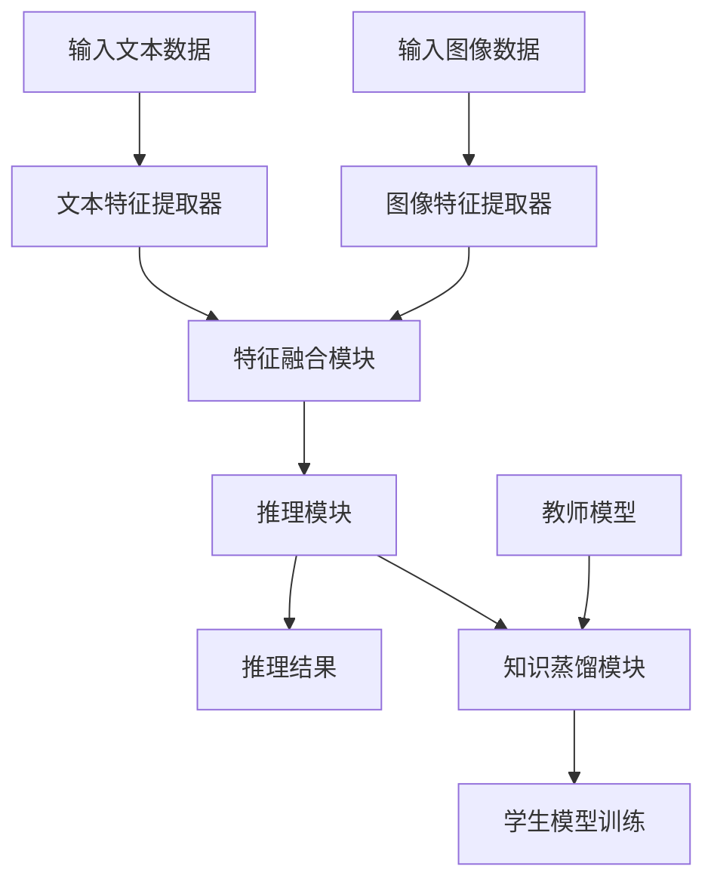

# 基于知识蒸馏的轻量级跨模态推理模型

> 关键词：知识蒸馏、轻量级模型、跨模态推理、深度学习、人工智能

> 摘要：本文围绕基于知识蒸馏的轻量级跨模态推理模型展开深入探讨。首先介绍了该模型研究的背景，包括其目的、预期读者、文档结构等内容。接着阐述了核心概念与联系，分析了相关原理和架构，并通过 Mermaid 流程图直观呈现。详细讲解了核心算法原理及具体操作步骤，结合 Python 源代码进行说明。对数学模型和公式进行深入剖析并举例。通过项目实战，给出代码实际案例及详细解释。探讨了该模型的实际应用场景，推荐了相关的工具和资源。最后总结了未来发展趋势与挑战，给出常见问题与解答及扩展阅读和参考资料，旨在为该领域的研究和应用提供全面且深入的指导。

## 1. 背景介绍 
### 1.1 目的和范围
在当今信息爆炸的时代，数据呈现出多样化的模态，如文本、图像、音频等。跨模态推理旨在利用不同模态数据之间的关联，实现更全面、深入的信息理解和处理。然而，传统的跨模态推理模型往往结构复杂、计算资源需求大，难以在资源受限的设备上高效运行。基于知识蒸馏的轻量级跨模态推理模型的研究目的在于，通过知识蒸馏技术将复杂的教师模型的知识迁移到轻量级的学生模型中，从而在保证一定推理性能的前提下，降低模型的复杂度和计算量，使其能够在移动设备、嵌入式系统等资源有限的环境中应用。本研究的范围涵盖了从核心概念的阐述、算法原理的分析、数学模型的构建，到实际项目的开发和应用场景的探讨等多个方面。

### 1.2 预期读者
本文预期读者包括从事人工智能、机器学习、深度学习等领域的研究人员和工程师，他们对跨模态推理技术有一定的了解，希望深入学习基于知识蒸馏的轻量级跨模态推理模型的原理和实现方法。同时，也适合相关专业的研究生和高年级本科生，作为学习和研究的参考资料。此外，对于对新兴技术感兴趣，希望了解跨模态推理技术在实际应用中如何优化的企业技术人员和决策者，本文也具有一定的参考价值。

### 1.3 文档结构概述
本文将按照以下结构进行阐述：首先介绍基于知识蒸馏的轻量级跨模态推理模型的背景信息，包括目的、预期读者和文档结构等。接着详细讲解核心概念与联系，通过文本示意图和 Mermaid 流程图展示模型的原理和架构。然后深入分析核心算法原理，并给出具体操作步骤，结合 Python 源代码进行说明。随后介绍数学模型和公式，进行详细讲解并举例。通过项目实战，给出代码实际案例及详细解释。探讨该模型的实际应用场景，推荐相关的工具和资源。最后总结未来发展趋势与挑战，给出常见问题与解答及扩展阅读和参考资料。

### 1.4 术语表
#### 1.4.1 核心术语定义
- **知识蒸馏**：一种模型压缩技术，通过让轻量级的学生模型学习复杂的教师模型的输出，将教师模型的知识迁移到学生模型中，从而使学生模型在保持一定性能的同时具有更小的规模和更低的计算成本。
- **跨模态推理**：指在不同模态的数据（如文本、图像、音频等）之间进行推理和信息融合的过程，旨在挖掘不同模态数据之间的内在联系，实现更全面、深入的信息理解和处理。
- **轻量级模型**：相对于传统的大型复杂模型，轻量级模型具有更少的参数、更低的计算复杂度和更小的内存占用，能够在资源受限的设备上高效运行。

#### 1.4.2 相关概念解释
- **模态**：在数据处理和信息科学中，模态指数据的不同表现形式，如文本、图像、音频、视频等。不同模态的数据具有不同的特征和表示方式。
- **教师模型**：在知识蒸馏中，教师模型通常是一个复杂的、性能较高的模型，它作为知识的提供者，将其学习到的知识传递给学生模型。
- **学生模型**：学生模型是轻量级的模型，通过学习教师模型的输出，试图在保持较小规模的同时达到接近教师模型的性能。

#### 1.4.3 缩略词列表
- **CNN**：Convolutional Neural Network，卷积神经网络，一种常用于图像和视频处理的深度学习模型。
- **RNN**：Recurrent Neural Network，循环神经网络，一种适用于处理序列数据的深度学习模型。
- **MLP**：Multilayer Perceptron，多层感知机，一种基本的神经网络模型。

## 2. 核心概念与联系 

### 核心概念原理
基于知识蒸馏的轻量级跨模态推理模型主要基于知识蒸馏和跨模态推理两个核心概念。知识蒸馏的基本原理是利用一个复杂的教师模型和一个轻量级的学生模型。教师模型在大规模数据集上进行训练，具有较高的性能和丰富的知识。学生模型则通过学习教师模型的输出，来模仿教师模型的行为。在跨模态推理中，不同模态的数据（如文本和图像）首先经过各自的特征提取模块，将不同模态的数据转换为特征向量。然后，这些特征向量通过融合模块进行融合，以挖掘不同模态数据之间的内在联系。最后，融合后的特征向量经过推理模块进行推理，得到最终的推理结果。

### 架构的文本示意图
基于知识蒸馏的轻量级跨模态推理模型的架构主要包括以下几个部分：
1. **模态特征提取模块**：针对不同模态的数据（如文本、图像），分别使用相应的特征提取器（如 CNN 用于图像特征提取，RNN 或 Transformer 用于文本特征提取），将原始数据转换为特征向量。
2. **特征融合模块**：将不同模态的特征向量进行融合，常用的融合方法包括拼接、加权求和等。融合后的特征向量包含了不同模态数据的综合信息。
3. **推理模块**：对融合后的特征向量进行推理，得到最终的推理结果。推理模块可以是一个简单的 MLP 或更复杂的神经网络结构。
4. **知识蒸馏模块**：在训练过程中，知识蒸馏模块将教师模型的输出作为软标签，让学生模型学习这些软标签，从而将教师模型的知识迁移到学生模型中。

### Mermaid 流程图


## 3. 核心算法原理 & 具体操作步骤 

### 核心算法原理
基于知识蒸馏的轻量级跨模态推理模型的核心算法主要包括两个部分：跨模态特征融合和知识蒸馏。

#### 跨模态特征融合
跨模态特征融合的目的是将不同模态的特征向量进行融合，以挖掘不同模态数据之间的内在联系。常用的融合方法包括拼接和加权求和。

- **拼接**：将不同模态的特征向量直接拼接在一起，形成一个更长的特征向量。假设文本特征向量为 $x_t \in \mathbb{R}^{d_t}$，图像特征向量为 $x_i \in \mathbb{R}^{d_i}$，则拼接后的特征向量为 $x = [x_t; x_i] \in \mathbb{R}^{d_t + d_i}$。
- **加权求和**：对不同模态的特征向量进行加权求和，得到融合后的特征向量。假设文本特征向量为 $x_t$，图像特征向量为 $x_i$，权重分别为 $\alpha$ 和 $\beta$，且 $\alpha + \beta = 1$，则融合后的特征向量为 $x = \alpha x_t + \beta x_i$。

#### 知识蒸馏
知识蒸馏的基本思想是让学生模型学习教师模型的输出，从而将教师模型的知识迁移到学生模型中。在训练过程中，除了使用真实标签计算损失外，还使用教师模型的输出作为软标签计算损失。具体来说，学生模型的损失函数可以表示为：

$L = \lambda L_{CE}(y, \hat{y}_s) + (1 - \lambda) L_{KL}(p_t, p_s)$

其中，$L_{CE}$ 是交叉熵损失函数，用于计算学生模型的输出 $\hat{y}_s$ 与真实标签 $y$ 之间的损失；$L_{KL}$ 是 KL 散度损失函数，用于计算教师模型的软标签 $p_t$ 与学生模型的输出 $p_s$ 之间的损失；$\lambda$ 是一个超参数，用于控制两种损失的权重。

### 具体操作步骤

#### 步骤 1：数据准备
收集和整理跨模态数据集，包括文本数据和图像数据。对数据进行预处理，如文本的分词、图像的缩放和归一化等。

#### 步骤 2：教师模型训练
使用大规模的跨模态数据集训练一个复杂的教师模型。教师模型可以是一个多模态的深度学习模型，如基于 CNN 和 RNN 的跨模态模型。

#### 步骤 3：学生模型设计
设计一个轻量级的学生模型，其结构可以比教师模型简单，参数数量更少。

#### 步骤 4：训练学生模型
在训练学生模型时，同时使用真实标签和教师模型的软标签计算损失。具体步骤如下：
1. 前向传播：将输入数据分别输入到学生模型和教师模型中，得到学生模型的输出 $\hat{y}_s$ 和教师模型的软标签 $p_t$。
2. 损失计算：计算交叉熵损失 $L_{CE}(y, \hat{y}_s)$ 和 KL 散度损失 $L_{KL}(p_t, p_s)$，并根据超参数 $\lambda$ 计算总损失 $L$。
3. 反向传播：根据总损失 $L$ 对学生模型的参数进行更新。

#### 步骤 5：模型评估
使用测试数据集对训练好的学生模型进行评估，计算其准确率、召回率、F1 值等评价指标。

### Python 源代码实现
```python
import torch
import torch.nn as nn
import torch.optim as optim
from torch.utils.data import DataLoader, Dataset

# 定义跨模态数据集类
class CrossModalDataset(Dataset):
    def __init__(self, text_data, image_data, labels):
        self.text_data = text_data
        self.image_data = image_data
        self.labels = labels

    def __len__(self):
        return len(self.labels)

    def __getitem__(self, idx):
        text = self.text_data[idx]
        image = self.image_data[idx]
        label = self.labels[idx]
        return text, image, label

# 定义文本特征提取器
class TextFeatureExtractor(nn.Module):
    def __init__(self, input_dim, hidden_dim):
        super(TextFeatureExtractor, self).__init__()
        self.fc1 = nn.Linear(input_dim, hidden_dim)
        self.relu = nn.ReLU()

    def forward(self, x):
        x = self.fc1(x)
        x = self.relu(x)
        return x

# 定义图像特征提取器
class ImageFeatureExtractor(nn.Module):
    def __init__(self, input_dim, hidden_dim):
        super(ImageFeatureExtractor, self).__init__()
        self.fc1 = nn.Linear(input_dim, hidden_dim)
        self.relu = nn.ReLU()

    def forward(self, x):
        x = self.fc1(x)
        x = self.relu(x)
        return x

# 定义特征融合模块
class FeatureFusion(nn.Module):
    def __init__(self, text_dim, image_dim, fusion_dim):
        super(FeatureFusion, self).__init__()
        self.fc1 = nn.Linear(text_dim + image_dim, fusion_dim)
        self.relu = nn.ReLU()

    def forward(self, text_feature, image_feature):
        x = torch.cat((text_feature, image_feature), dim=1)
        x = self.fc1(x)
        x = self.relu(x)
        return x

# 定义推理模块
class InferenceModule(nn.Module):
    def __init__(self, input_dim, output_dim):
        super(InferenceModule, self).__init__()
        self.fc1 = nn.Linear(input_dim, output_dim)

    def forward(self, x):
        x = self.fc1(x)
        return x

# 定义学生模型
class StudentModel(nn.Module):
    def __init__(self, text_input_dim, image_input_dim, text_hidden_dim, image_hidden_dim, fusion_dim, output_dim):
        super(StudentModel, self).__init__()
        self.text_feature_extractor = TextFeatureExtractor(text_input_dim, text_hidden_dim)
        self.image_feature_extractor = ImageFeatureExtractor(image_input_dim, image_hidden_dim)
        self.feature_fusion = FeatureFusion(text_hidden_dim, image_hidden_dim, fusion_dim)
        self.inference_module = InferenceModule(fusion_dim, output_dim)

    def forward(self, text, image):
        text_feature = self.text_feature_extractor(text)
        image_feature = self.image_feature_extractor(image)
        fused_feature = self.feature_fusion(text_feature, image_feature)
        output = self.inference_module(fused_feature)
        return output

# 定义教师模型（假设已经训练好）
class TeacherModel(nn.Module):
    def __init__(self, text_input_dim, image_input_dim, text_hidden_dim, image_hidden_dim, fusion_dim, output_dim):
        super(TeacherModel, self).__init__()
        # 教师模型结构可以更复杂
        self.text_feature_extractor = TextFeatureExtractor(text_input_dim, text_hidden_dim)
        self.image_feature_extractor = ImageFeatureExtractor(image_input_dim, image_hidden_dim)
        self.feature_fusion = FeatureFusion(text_hidden_dim, image_hidden_dim, fusion_dim)
        self.inference_module = InferenceModule(fusion_dim, output_dim)

    def forward(self, text, image):
        text_feature = self.text_feature_extractor(text)
        image_feature = self.image_feature_extractor(image)
        fused_feature = self.feature_fusion(text_feature, image_feature)
        output = self.inference_module(fused_feature)
        return output

# 定义知识蒸馏损失函数
def knowledge_distillation_loss(student_output, teacher_output, labels, alpha=0.5, temperature=1.0):
    ce_loss = nn.CrossEntropyLoss()(student_output, labels)
    kl_loss = nn.KLDivLoss()(nn.functional.log_softmax(student_output / temperature, dim=1),
                             nn.functional.softmax(teacher_output / temperature, dim=1))
    loss = alpha * ce_loss + (1 - alpha) * kl_loss * (temperature ** 2)
    return loss

# 训练学生模型
def train_student_model(student_model, teacher_model, train_loader, optimizer, epochs=10, alpha=0.5, temperature=1.0):
    student_model.train()
    for epoch in range(epochs):
        total_loss = 0
        for text, image, labels in train_loader:
            optimizer.zero_grad()
            student_output = student_model(text, image)
            teacher_output = teacher_model(text, image)
            loss = knowledge_distillation_loss(student_output, teacher_output, labels, alpha, temperature)
            loss.backward()
            optimizer.step()
            total_loss += loss.item()
        print(f'Epoch {epoch + 1}, Loss: {total_loss / len(train_loader)}')

# 示例数据
text_data = torch.randn(100, 10)
image_data = torch.randn(100, 20)
labels = torch.randint(0, 5, (100,))

# 创建数据集和数据加载器
dataset = CrossModalDataset(text_data, image_data, labels)
train_loader = DataLoader(dataset, batch_size=10, shuffle=True)

# 初始化学生模型和教师模型
student_model = StudentModel(10, 20, 5, 5, 10, 5)
teacher_model = TeacherModel(10, 20, 5, 5, 10, 5)

# 定义优化器
optimizer = optim.Adam(student_model.parameters(), lr=0.001)

# 训练学生模型
train_student_model(student_model, teacher_model, train_loader, optimizer)
```

## 4. 数学模型和公式 & 详细讲解 & 举例说明 

### 跨模态特征融合数学模型
#### 拼接融合
如前所述，拼接融合是将不同模态的特征向量直接拼接在一起。假设文本特征向量为 $x_t = [x_{t1}, x_{t2}, \cdots, x_{td_t}] \in \mathbb{R}^{d_t}$，图像特征向量为 $x_i = [x_{i1}, x_{i2}, \cdots, x_{id_i}] \in \mathbb{R}^{d_i}$，则拼接后的特征向量为：

$x = [x_{t1}, x_{t2}, \cdots, x_{td_t}, x_{i1}, x_{i2}, \cdots, x_{id_i}] \in \mathbb{R}^{d_t + d_i}$

例如，若文本特征向量 $x_t = [1, 2, 3]$，图像特征向量 $x_i = [4, 5]$，则拼接后的特征向量 $x = [1, 2, 3, 4, 5]$。

#### 加权求和融合
加权求和融合是对不同模态的特征向量进行加权求和。假设文本特征向量为 $x_t$，图像特征向量为 $x_i$，权重分别为 $\alpha$ 和 $\beta$，且 $\alpha + \beta = 1$，则融合后的特征向量为：

$x = \alpha x_t + \beta x_i$

例如，若文本特征向量 $x_t = [1, 2]$，图像特征向量 $x_i = [3, 4]$，$\alpha = 0.6$，$\beta = 0.4$，则融合后的特征向量为：

$x = 0.6 \times [1, 2] + 0.4 \times [3, 4] = [0.6, 1.2] + [1.2, 1.6] = [1.8, 2.8]$

### 知识蒸馏数学模型
知识蒸馏的损失函数为：

$L = \lambda L_{CE}(y, \hat{y}_s) + (1 - \lambda) L_{KL}(p_t, p_s)$

其中，$L_{CE}$ 是交叉熵损失函数，定义为：

$L_{CE}(y, \hat{y}_s) = -\sum_{i=1}^{C} y_i \log(\hat{y}_{si})$

其中，$y$ 是真实标签的 one - hot 编码，$\hat{y}_s$ 是学生模型的输出，$C$ 是类别数。

$L_{KL}$ 是 KL 散度损失函数，定义为：

$L_{KL}(p_t, p_s) = \sum_{i=1}^{C} p_{ti} \log(\frac{p_{ti}}{p_{si}})$

其中，$p_t$ 是教师模型的软标签，$p_s$ 是学生模型的输出。

例如，假设真实标签 $y = [1, 0, 0]$，学生模型的输出 $\hat{y}_s = [0.8, 0.1, 0.1]$，教师模型的软标签 $p_t = [0.7, 0.2, 0.1]$，$\lambda = 0.5$。

首先计算交叉熵损失：

$L_{CE}(y, \hat{y}_s) = - (1 \times \log(0.8) + 0 \times \log(0.1) + 0 \times \log(0.1)) \approx 0.223$

然后计算 KL 散度损失：

$L_{KL}(p_t, p_s) = 0.7 \times \log(\frac{0.7}{0.8}) + 0.2 \times \log(\frac{0.2}{0.1}) + 0.1 \times \log(\frac{0.1}{0.1}) \approx 0.077$

最后计算总损失：

$L = 0.5 \times 0.223 + (1 - 0.5) \times 0.077 = 0.15$

## 5. 项目实战：代码实际案例和详细解释说明 

### 5.1  开发环境搭建
#### 操作系统
本项目可以在多种操作系统上进行开发，如 Windows、Linux（Ubuntu 等）、macOS。建议使用 Linux 系统，因为它在深度学习开发中具有较好的稳定性和兼容性。

#### 编程语言和版本
使用 Python 3.7 及以上版本。Python 是一种广泛应用于深度学习和数据科学领域的编程语言，具有丰富的库和工具。

#### 深度学习框架
使用 PyTorch 深度学习框架。PyTorch 是一个开源的深度学习框架，具有动态图机制，易于使用和调试。可以使用以下命令安装 PyTorch：
```bash
pip install torch torchvision
```

#### 其他依赖库
还需要安装一些其他的依赖库，如 numpy、matplotlib 等。可以使用以下命令安装：
```bash
pip install numpy matplotlib
```

### 5.2  源代码详细实现和代码解读
#### 数据集类
```python
class CrossModalDataset(Dataset):
    def __init__(self, text_data, image_data, labels):
        self.text_data = text_data
        self.image_data = image_data
        self.labels = labels

    def __len__(self):
        return len(self.labels)

    def __getitem__(self, idx):
        text = self.text_data[idx]
        image = self.image_data[idx]
        label = self.labels[idx]
        return text, image, label
```
解读：该类继承自 PyTorch 的 `Dataset` 类，用于封装跨模态数据集。`__init__` 方法初始化数据集的文本数据、图像数据和标签。`__len__` 方法返回数据集的长度。`__getitem__` 方法根据索引返回对应的文本数据、图像数据和标签。

#### 特征提取器
```python
class TextFeatureExtractor(nn.Module):
    def __init__(self, input_dim, hidden_dim):
        super(TextFeatureExtractor, self).__init__()
        self.fc1 = nn.Linear(input_dim, hidden_dim)
        self.relu = nn.ReLU()

    def forward(self, x):
        x = self.fc1(x)
        x = self.relu(x)
        return x

class ImageFeatureExtractor(nn.Module):
    def __init__(self, input_dim, hidden_dim):
        super(ImageFeatureExtractor, self).__init__()
        self.fc1 = nn.Linear(input_dim, hidden_dim)
        self.relu = nn.ReLU()

    def forward(self, x):
        x = self.fc1(x)
        x = self.relu(x)
        return x
```
解读：`TextFeatureExtractor` 类和 `ImageFeatureExtractor` 类分别用于提取文本和图像的特征。它们都继承自 `nn.Module` 类，包含一个线性层和一个 ReLU 激活函数。`forward` 方法定义了前向传播的过程。

#### 特征融合模块
```python
class FeatureFusion(nn.Module):
    def __init__(self, text_dim, image_dim, fusion_dim):
        super(FeatureFusion, self).__init__()
        self.fc1 = nn.Linear(text_dim + image_dim, fusion_dim)
        self.relu = nn.ReLU()

    def forward(self, text_feature, image_feature):
        x = torch.cat((text_feature, image_feature), dim=1)
        x = self.fc1(x)
        x = self.relu(x)
        return x
```
解读：`FeatureFusion` 类用于将文本和图像的特征向量进行融合。它将两个特征向量拼接在一起，然后通过一个线性层和 ReLU 激活函数进行处理。

#### 推理模块
```python
class InferenceModule(nn.Module):
    def __init__(self, input_dim, output_dim):
        super(InferenceModule, self).__init__()
        self.fc1 = nn.Linear(input_dim, output_dim)

    def forward(self, x):
        x = self.fc1(x)
        return x
```
解读：`InferenceModule` 类用于对融合后的特征向量进行推理。它包含一个线性层，将输入特征向量映射到输出类别。

#### 学生模型和教师模型
```python
class StudentModel(nn.Module):
    def __init__(self, text_input_dim, image_input_dim, text_hidden_dim, image_hidden_dim, fusion_dim, output_dim):
        super(StudentModel, self).__init__()
        self.text_feature_extractor = TextFeatureExtractor(text_input_dim, text_hidden_dim)
        self.image_feature_extractor = ImageFeatureExtractor(image_input_dim, image_hidden_dim)
        self.feature_fusion = FeatureFusion(text_hidden_dim, image_hidden_dim, fusion_dim)
        self.inference_module = InferenceModule(fusion_dim, output_dim)

    def forward(self, text, image):
        text_feature = self.text_feature_extractor(text)
        image_feature = self.image_feature_extractor(image)
        fused_feature = self.feature_fusion(text_feature, image_feature)
        output = self.inference_module(fused_feature)
        return output

class TeacherModel(nn.Module):
    def __init__(self, text_input_dim, image_input_dim, text_hidden_dim, image_hidden_dim, fusion_dim, output_dim):
        super(TeacherModel, self).__init__()
        # 教师模型结构可以更复杂
        self.text_feature_extractor = TextFeatureExtractor(text_input_dim, text_hidden_dim)
        self.image_feature_extractor = ImageFeatureExtractor(image_input_dim, image_hidden_dim)
        self.feature_fusion = FeatureFusion(text_hidden_dim, image_hidden_dim, fusion_dim)
        self.inference_module = InferenceModule(fusion_dim, output_dim)

    def forward(self, text, image):
        text_feature = self.text_feature_extractor(text)
        image_feature = self.image_feature_extractor(image)
        fused_feature = self.feature_fusion(text_feature, image_feature)
        output = self.inference_module(fused_feature)
        return output
```
解读：`StudentModel` 类和 `TeacherModel` 类分别定义了学生模型和教师模型的结构。它们都包含特征提取器、特征融合模块和推理模块。教师模型的结构可以更复杂。

#### 知识蒸馏损失函数
```python
def knowledge_distillation_loss(student_output, teacher_output, labels, alpha=0.5, temperature=1.0):
    ce_loss = nn.CrossEntropyLoss()(student_output, labels)
    kl_loss = nn.KLDivLoss()(nn.functional.log_softmax(student_output / temperature, dim=1),
                             nn.functional.softmax(teacher_output / temperature, dim=1))
    loss = alpha * ce_loss + (1 - alpha) * kl_loss * (temperature ** 2)
    return loss
```
解读：该函数实现了知识蒸馏的损失函数，包括交叉熵损失和 KL 散度损失。`alpha` 是控制两种损失权重的超参数，`temperature` 是温度参数。

#### 训练学生模型
```python
def train_student_model(student_model, teacher_model, train_loader, optimizer, epochs=10, alpha=0.5, temperature=1.0):
    student_model.train()
    for epoch in range(epochs):
        total_loss = 0
        for text, image, labels in train_loader:
            optimizer.zero_grad()
            student_output = student_model(text, image)
            teacher_output = teacher_model(text, image)
            loss = knowledge_distillation_loss(student_output, teacher_output, labels, alpha, temperature)
            loss.backward()
            optimizer.step()
            total_loss += loss.item()
        print(f'Epoch {epoch + 1}, Loss: {total_loss / len(train_loader)}')
```
解读：该函数用于训练学生模型。在每个 epoch 中，遍历训练数据集，计算学生模型的输出和教师模型的软标签，然后计算知识蒸馏损失。通过反向传播更新学生模型的参数。

### 5.3  代码解读与分析
#### 模型结构分析
本项目的模型结构包括特征提取器、特征融合模块和推理模块。特征提取器将不同模态的数据转换为特征向量，特征融合模块将这些特征向量进行融合，推理模块对融合后的特征向量进行推理。学生模型和教师模型的结构相似，但教师模型可以更复杂。

#### 知识蒸馏分析
知识蒸馏通过让学生模型学习教师模型的软标签，将教师模型的知识迁移到学生模型中。在训练过程中，同时使用真实标签和教师模型的软标签计算损失，从而使学生模型在保持较小规模的同时达到接近教师模型的性能。

#### 超参数分析
超参数 `alpha` 控制交叉熵损失和 KL 散度损失的权重，`temperature` 是温度参数。调整这些超参数可以影响学生模型的训练效果。一般来说，较大的 `alpha` 会更注重真实标签的损失，较小的 `alpha` 会更注重教师模型的软标签的损失。`temperature` 可以控制软标签的平滑程度。

## 6. 实际应用场景 
### 智能客服
在智能客服系统中，用户的输入可能包括文本问题和上传的相关图片。基于知识蒸馏的轻量级跨模态推理模型可以同时处理文本和图像信息，更好地理解用户的需求，提供更准确的回答。例如，用户在咨询电子产品问题时，可能会上传产品的图片，模型可以结合图片中的外观信息和用户的文本描述，更精准地判断问题所在。

### 自动驾驶
在自动驾驶场景中，车辆需要处理多种模态的数据，如摄像头拍摄的图像、雷达检测的距离信息等。轻量级跨模态推理模型可以在保证实时性的前提下，对这些多模态数据进行融合和推理，帮助车辆做出更合理的决策，如判断前方障碍物的类型和距离，从而采取相应的驾驶策略。

### 医疗诊断
在医疗领域，医生可以通过患者的病历文本和医学影像（如 X 光、CT 等）来进行诊断。基于知识蒸馏的轻量级跨模态推理模型可以对病历文本和医学影像进行分析和融合，辅助医生进行疾病的诊断和预测。例如，模型可以根据患者的症状描述和影像特征，判断患者是否患有某种疾病，以及疾病的严重程度。

### 智能安防
在智能安防系统中，监控摄像头可以捕捉到视频图像，同时可能会有传感器采集到的其他信息（如声音、温度等）。轻量级跨模态推理模型可以对这些多模态数据进行处理，实现对异常事件的检测和预警。例如，模型可以根据图像中的人物行为和声音信息，判断是否发生了盗窃、暴力等事件。

## 7. 工具和资源推荐
### 7.1 学习资源推荐
#### 7.1.1 书籍推荐
- 《深度学习》（Deep Learning）：由 Ian Goodfellow、Yoshua Bengio 和 Aaron Courville 撰写，是深度学习领域的经典教材，全面介绍了深度学习的基本概念、算法和应用。
- 《Python 深度学习》（Deep Learning with Python）：由 Francois Chollet 撰写，作者是 Keras 深度学习框架的开发者。本书以 Keras 为基础，介绍了深度学习的实践方法，适合初学者。
- 《模式识别与机器学习》（Pattern Recognition and Machine Learning）：由 Christopher Bishop 撰写，是机器学习领域的经典著作，涵盖了模式识别、概率模型、神经网络等多个方面的内容。

#### 7.1.2 在线课程
- Coursera 上的《深度学习专项课程》（Deep Learning Specialization）：由 Andrew Ng 教授授课，包括深度学习的基础、卷积神经网络、循环神经网络等多个课程，内容丰富，适合系统学习深度学习。
- edX 上的《强化学习》（Reinforcement Learning）：介绍了强化学习的基本概念、算法和应用，对于理解智能体的决策和学习过程有很大帮助。
- 哔哩哔哩上的一些深度学习相关的视频教程，如李沐的《动手学深度学习》系列视频，通过实际代码演示，帮助学习者更好地理解和掌握深度学习的知识。

#### 7.1.3 技术博客和网站
- Medium 上的 Towards Data Science：是一个专注于数据科学和机器学习的技术博客平台，有很多优秀的文章和教程。
- arXiv：是一个预印本数据库，包含了大量的学术论文，对于了解最新的研究成果和技术趋势有很大帮助。
- 机器之心：是一个专注于人工智能领域的媒体平台，提供了丰富的技术文章、行业动态和研究报告。

### 7.2 开发工具框架推荐
#### 7.2.1 IDE和编辑器
- PyCharm：是一款专门为 Python 开发设计的集成开发环境（IDE），具有强大的代码编辑、调试和自动补全功能，适合开发大规模的 Python 项目。
- Jupyter Notebook：是一个交互式的开发环境，支持多种编程语言，如 Python、R 等。它以笔记本的形式展示代码和结果，方便进行数据探索和模型调试。
- Visual Studio Code：是一个轻量级的代码编辑器，支持多种编程语言和插件扩展。它具有丰富的插件生态系统，可以满足不同的开发需求。

#### 7.2.2 调试和性能分析工具
- PyTorch Profiler：是 PyTorch 自带的性能分析工具，可以帮助开发者分析模型的运行时间、内存使用等情况，找出性能瓶颈。
- TensorBoard：是 TensorFlow 提供的可视化工具，也可以与 PyTorch 结合使用。它可以可视化模型的训练过程、损失曲线、准确率等信息，帮助开发者更好地理解模型的性能。
- cProfile：是 Python 标准库中的性能分析工具，可以分析 Python 代码的运行时间和函数调用情况，帮助开发者优化代码性能。

#### 7.2.3 相关框架和库
- PyTorch：是一个开源的深度学习框架，具有动态图机制，易于使用和调试。它提供了丰富的神经网络层和优化器，支持多种硬件平台。
- TensorFlow：是另一个广泛使用的深度学习框架，具有强大的分布式训练和部署能力。它提供了高级的 API，如 Keras，方便快速搭建和训练模型。
- Scikit - learn：是一个用于机器学习的 Python 库，提供了丰富的机器学习算法和工具，如分类、回归、聚类等。它可以与 PyTorch 和 TensorFlow 结合使用，进行数据预处理和模型评估。

### 7.3 相关论文著作推荐
#### 7.3.1 经典论文
- “Distilling the Knowledge in a Neural Network”：由 Geoffrey Hinton 等人发表，首次提出了知识蒸馏的概念，为模型压缩和迁移学习提供了新的思路。
- “Show, Attend and Tell: Neural Image Caption Generation with Visual Attention”：提出了基于注意力机制的图像描述生成模型，为跨模态任务中的图像和文本关联提供了重要的方法。
- “Attention Is All You Need”：介绍了 Transformer 模型，该模型在自然语言处理领域取得了巨大的成功，也为跨模态任务中的序列处理提供了新的架构。

#### 7.3.2 最新研究成果
- 关注 arXiv 上关于知识蒸馏和跨模态推理的最新论文，了解该领域的最新技术和方法。
- 参加相关的学术会议，如 NeurIPS、ICML、CVPR 等，获取最新的研究成果和行业动态。

#### 7.3.3 应用案例分析
- 分析一些实际应用中的跨模态推理模型案例，如智能安防、医疗诊断等领域的应用。了解这些模型的设计思路、实现方法和应用效果，从中获取灵感和经验。

## 8. 总结：未来发展趋势与挑战
### 未来发展趋势
#### 模型性能提升
随着深度学习技术的不断发展，基于知识蒸馏的轻量级跨模态推理模型的性能将不断提升。研究人员将探索更有效的知识蒸馏方法和跨模态特征融合策略，以提高模型的准确率和泛化能力。

#### 多模态融合的深化
未来的跨模态推理模型将不仅仅局限于文本和图像的融合，还将涉及更多模态的数据，如音频、视频、传感器数据等。通过深化多模态融合，模型可以更全面地理解和处理复杂的信息。

#### 应用领域的拓展
基于知识蒸馏的轻量级跨模态推理模型将在更多领域得到应用，如智能家居、智能交通、工业自动化等。这些应用将为人们的生活和工作带来更多的便利和创新。

#### 与其他技术的结合
该模型将与其他技术，如强化学习、元学习、联邦学习等相结合，进一步提升模型的性能和应用范围。例如，结合强化学习可以使模型在动态环境中进行自适应学习和决策。

### 挑战
#### 数据融合难题
不同模态的数据具有不同的特征和表示方式，如何有效地融合这些数据是一个挑战。例如，文本数据是离散的符号序列，图像数据是连续的像素矩阵，如何找到一种合适的方法将它们融合在一起，是需要解决的问题。

#### 知识蒸馏的有效性
知识蒸馏的效果受到多种因素的影响，如教师模型的选择、蒸馏损失函数的设计、超参数的调整等。如何提高知识蒸馏的有效性，使学生模型能够更好地学习教师模型的知识，是一个需要深入研究的问题。

#### 计算资源和时间成本
虽然轻量级跨模态推理模型的计算资源需求相对较低，但在处理大规模数据集和复杂任务时，仍然需要较高的计算资源和时间成本。如何进一步优化模型结构和算法，降低计算资源和时间成本，是一个挑战。

#### 模型可解释性
深度学习模型通常是黑盒模型，缺乏可解释性。在一些对模型可解释性要求较高的应用场景中，如医疗诊断、金融风险评估等，如何提高基于知识蒸馏的轻量级跨模态推理模型的可解释性，是一个需要解决的问题。

## 9. 附录：常见问题与解答
### 问题 1：知识蒸馏中教师模型和学生模型的选择有什么要求？
解答：教师模型通常需要具有较高的性能和丰富的知识，因此可以选择结构复杂、参数数量多的模型。学生模型则需要设计得相对简单，参数数量较少，以实现轻量级的目标。同时，教师模型和学生模型的输入和输出格式需要保持一致，以便进行知识蒸馏。

### 问题 2：如何选择合适的跨模态特征融合方法？
解答：选择跨模态特征融合方法需要考虑数据的特点和任务的需求。拼接融合简单直接，适用于不同模态特征之间相对独立的情况；加权求和融合可以根据不同模态的重要性进行加权，适用于不同模态特征之间存在一定关联的情况。此外，还可以尝试其他更复杂的融合方法，如基于注意力机制的融合方法。

### 问题 3：知识蒸馏中的超参数如何调整？
解答：知识蒸馏中的超参数主要包括 $\lambda$ 和温度参数。$\lambda$ 控制交叉熵损失和 KL 散度损失的权重，可以通过实验进行调整。一般来说，可以从 0.5 开始尝试，根据模型的训练效果进行适当调整。温度参数可以控制软标签的平滑程度，较大的温度参数会使软标签更平滑，较小的温度参数会使软标签更接近真实标签。同样，可以通过实验来选择合适的温度参数。

### 问题 4：如何评估基于知识蒸馏的轻量级跨模态推理模型的性能？
解答：可以使用常见的评估指标，如准确率、召回率、F1 值等，来评估模型的分类性能。对于回归任务，可以使用均方误差（MSE）、平均绝对误差（MAE）等指标。此外，还可以考虑模型的计算复杂度、内存占用等指标，以评估模型的轻量级程度。

## 10. 扩展阅读 & 参考资料
### 扩展阅读
- 阅读更多关于知识蒸馏和跨模态推理的学术论文，深入了解该领域的最新研究成果和技术趋势。
- 学习其他相关的深度学习技术，如生成对抗网络（GAN）、变分自编码器（VAE）等，以拓宽知识面。
- 关注行业动态和技术博客，了解基于知识蒸馏的轻量级跨模态推理模型在实际应用中的案例和经验。

### 参考资料
- Goodfellow, I., Bengio, Y., & Courville, A. (2016). Deep Learning. MIT Press.
- Chollet, F. (2018). Deep Learning with Python. Manning Publications.
- Bishop, C. M. (2006). Pattern Recognition and Machine Learning. Springer.
- Hinton, G., Vinyals, O., & Dean, J. (2015). Distilling the Knowledge in a Neural Network. arXiv preprint arXiv:1503.02531.
- Xu, K., Ba, J., Kiros, R., Cho, K., Courville, A., Salakhutdinov, R., ... & Bengio, Y. (2015). Show, Attend and Tell: Neural Image Caption Generation with Visual Attention. arXiv preprint arXiv:1502.03044.
- Vaswani, A., Shazeer, N., Parmar, N., Uszkoreit, J., Jones, L., Gomez, A. N., ... & Polosukhin, I. (2017). Attention Is All You Need. arXiv preprint arXiv:1706.03762.