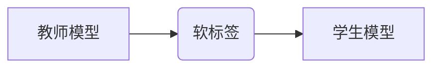
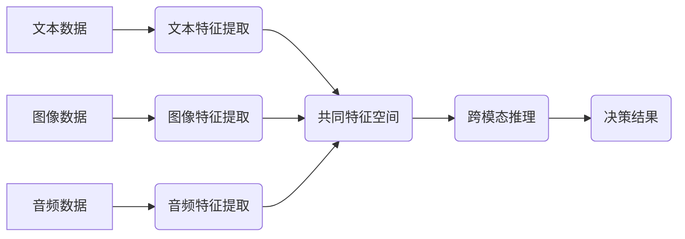

# 基于知识蒸馏的轻量级跨模态推理模型设计

> 关键词：知识蒸馏、轻量级模型、跨模态推理、深度学习、人工智能

> 摘要：本文聚焦于基于知识蒸馏的轻量级跨模态推理模型设计。随着人工智能的发展，跨模态推理在多个领域展现出重要价值，但传统模型往往面临计算资源消耗大、推理效率低等问题。知识蒸馏作为一种有效的模型压缩技术，为解决这些问题提供了新途径。文章首先介绍相关背景，阐述核心概念与联系，详细讲解核心算法原理及操作步骤，给出数学模型和公式并举例说明。通过项目实战展示代码实现和分析，探讨实际应用场景，推荐相关工具和资源，最后总结未来发展趋势与挑战，为该领域的研究和实践提供全面而深入的参考。

## 1. 背景介绍 
### 1.1 目的和范围
在当今信息爆炸的时代，数据呈现出多模态的特点，如文本、图像、音频等。跨模态推理旨在不同模态的数据之间建立联系，挖掘其中的潜在信息，以实现更智能的决策和理解。然而，现有的跨模态推理模型通常规模庞大，需要大量的计算资源和存储，这限制了其在资源受限设备上的应用，如移动终端、嵌入式系统等。本研究的目的是设计一种基于知识蒸馏的轻量级跨模态推理模型，在保证推理性能的前提下，显著降低模型的复杂度和计算成本，扩大跨模态推理技术的应用范围。本研究的范围涵盖从核心概念的阐述、算法原理的推导、数学模型的建立，到实际项目的实现和应用场景的探讨。

### 1.2 预期读者
本文预期读者包括对深度学习、跨模态推理、模型压缩等领域感兴趣的研究人员、工程师和学生。对于希望深入了解知识蒸馏技术在跨模态推理中的应用，以及如何设计轻量级模型的读者，本文将提供系统而深入的知识和实践指导。

### 1.3 文档结构概述
本文共分为十个部分。第一部分介绍背景信息，包括目的、预期读者和文档结构概述等。第二部分阐述核心概念与联系，通过文本示意图和 Mermaid 流程图展示知识蒸馏和跨模态推理的原理和架构。第三部分详细讲解核心算法原理，并给出具体的 Python 代码实现。第四部分建立数学模型和公式，进行详细讲解并举例说明。第五部分通过项目实战，展示开发环境搭建、源代码实现和代码解读。第六部分探讨实际应用场景。第七部分推荐相关的学习资源、开发工具框架和论文著作。第八部分总结未来发展趋势与挑战。第九部分是附录，解答常见问题。第十部分提供扩展阅读和参考资料。

### 1.4 术语表
#### 1.4.1 核心术语定义
- **知识蒸馏**：一种模型压缩技术，通过将一个大型的、性能较好的教师模型的知识传递给一个小型的学生模型，使学生模型在保持一定性能的前提下，减少模型的复杂度和计算量。
- **跨模态推理**：指在不同模态的数据（如文本、图像、音频等）之间进行推理和理解的过程，旨在挖掘不同模态数据之间的内在联系和潜在信息。
- **轻量级模型**：具有较小的模型参数规模和计算复杂度，能够在资源受限的设备上高效运行的模型。

#### 1.4.2 相关概念解释
- **模态**：指数据的不同表现形式，如文本、图像、音频等。不同模态的数据具有不同的特征和表示方式。
- **教师模型**：在知识蒸馏中，通常是一个性能较好但规模较大的模型，用于向学生模型传递知识。
- **学生模型**：在知识蒸馏中，是一个规模较小的模型，通过学习教师模型的知识来提高自身性能。

#### 1.4.3 缩略词列表
- **DNN**：Deep Neural Network，深度神经网络
- **CNN**：Convolutional Neural Network，卷积神经网络
- **RNN**：Recurrent Neural Network，循环神经网络
- **BERT**：Bidirectional Encoder Representations from Transformers，基于变换器的双向编码器表示

## 2. 核心概念与联系 
### 知识蒸馏原理
知识蒸馏的核心思想是让一个小型的学生模型学习一个大型的教师模型的输出分布，从而获得教师模型的知识。教师模型通常在大规模数据集上进行训练，具有较高的性能，但模型复杂度也较高。学生模型通过模仿教师模型的输出，能够在较小的模型规模下达到接近教师模型的性能。

文本示意图：
教师模型（大规模、高性能） -> 软标签（知识） -> 学生模型（小规模、轻量级）

Mermaid 流程图：


### 跨模态推理原理
跨模态推理的目标是在不同模态的数据之间建立联系，实现信息的交互和推理。通常，不同模态的数据需要经过特征提取和表示学习，将其映射到一个共同的特征空间中，然后在这个空间中进行推理和决策。

文本示意图：
文本数据 -> 文本特征提取 -> 共同特征空间
图像数据 -> 图像特征提取 -> 共同特征空间
音频数据 -> 音频特征提取 -> 共同特征空间
共同特征空间 -> 跨模态推理 -> 决策结果

Mermaid 流程图：


### 知识蒸馏与跨模态推理的联系
在跨模态推理中，使用知识蒸馏可以将大型的跨模态推理模型（教师模型）的知识传递给小型的跨模态推理模型（学生模型），从而实现轻量级跨模态推理模型的设计。通过知识蒸馏，学生模型可以学习到教师模型在不同模态数据之间的推理知识，提高自身的跨模态推理能力，同时降低模型的复杂度和计算成本。

## 3. 核心算法原理 & 具体操作步骤 
### 知识蒸馏算法原理
知识蒸馏的核心在于最小化学生模型的输出分布与教师模型的输出分布之间的差异。通常使用 KL 散度（Kullback - Leibler Divergence）来衡量两个分布之间的差异。

设教师模型的输出为 $p_t$，学生模型的输出为 $p_s$，温度参数为 $T$，则知识蒸馏的损失函数可以表示为：

$L_{KD} = KL(p_t^T || p_s^T)$

其中，$p_t^T$ 和 $p_s^T$ 分别是教师模型和学生模型在温度 $T$ 下的软化后的输出分布。

具体操作步骤如下：
1. 训练教师模型：在大规模数据集上训练一个性能较好的跨模态推理模型作为教师模型。
2. 初始化学生模型：随机初始化一个小型的跨模态推理模型作为学生模型。
3. 计算软标签：在训练学生模型时，将输入数据同时输入到教师模型和学生模型中，得到教师模型的软标签 $p_t^T$ 和学生模型的输出 $p_s^T$。
4. 计算损失：根据上述损失函数计算知识蒸馏的损失 $L_{KD}$。
5. 更新学生模型：使用反向传播算法更新学生模型的参数，以最小化 $L_{KD}$。

### Python 代码实现
```python
import torch
import torch.nn as nn
import torch.optim as optim

# 定义教师模型
class TeacherModel(nn.Module):
    def __init__(self):
        super(TeacherModel, self).__init__()
        # 定义教师模型的层结构
        self.fc1 = nn.Linear(10, 20)
        self.fc2 = nn.Linear(20, 5)

    def forward(self, x):
        x = torch.relu(self.fc1(x))
        x = self.fc2(x)
        return x

# 定义学生模型
class StudentModel(nn.Module):
    def __init__(self):
        super(StudentModel, self).__init__()
        # 定义学生模型的层结构
        self.fc1 = nn.Linear(10, 10)
        self.fc2 = nn.Linear(10, 5)

    def forward(self, x):
        x = torch.relu(self.fc1(x))
        x = self.fc2(x)
        return x

# 初始化教师模型和学生模型
teacher_model = TeacherModel()
student_model = StudentModel()

# 定义温度参数
T = 2.0

# 定义损失函数
kl_loss = nn.KLDivLoss(reduction='batchmean')

# 定义优化器
optimizer = optim.Adam(student_model.parameters(), lr=0.001)

# 训练学生模型
for epoch in range(100):
    # 生成随机输入数据
    input_data = torch.randn(32, 10)

    # 计算教师模型的软标签
    teacher_output = teacher_model(input_data)
    teacher_soft_labels = torch.softmax(teacher_output / T, dim=1)

    # 计算学生模型的输出
    student_output = student_model(input_data)
    student_soft_output = torch.log_softmax(student_output / T, dim=1)

    # 计算知识蒸馏损失
    loss = kl_loss(student_soft_output, teacher_soft_labels) * (T ** 2)

    # 反向传播和参数更新
    optimizer.zero_grad()
    loss.backward()
    optimizer.step()

    if epoch % 10 == 0:
        print(f'Epoch {epoch}, Loss: {loss.item()}')
```

## 4. 数学模型和公式 & 详细讲解 & 举例说明 
### KL 散度的数学定义
KL 散度是一种衡量两个概率分布之间差异的度量。设 $P$ 和 $Q$ 是两个离散概率分布，它们的 KL 散度定义为：

$$
KL(P || Q) = \sum_{i} P(i) \log \frac{P(i)}{Q(i)}
$$

其中，$i$ 表示离散变量的取值。

在知识蒸馏中，$P$ 通常是教师模型的软化后的输出分布 $p_t^T$，$Q$ 是学生模型的软化后的输出分布 $p_s^T$。

### 温度参数的作用
温度参数 $T$ 用于软化模型的输出分布。在原始的 softmax 函数中，输出分布往往比较尖锐，即概率集中在少数几个类别上。通过引入温度参数 $T$，可以使输出分布变得更加平滑，从而在知识蒸馏中传递更多的知识。

软化后的 softmax 函数定义为：

$$
p_i^T = \frac{\exp(z_i / T)}{\sum_{j} \exp(z_j / T)}
$$

其中，$z_i$ 是模型的原始输出，$p_i^T$ 是软化后的输出概率。

### 举例说明
假设教师模型的原始输出为 $z_t = [1, 2, 3]$，学生模型的原始输出为 $z_s = [0.5, 1.5, 2.5]$，温度参数 $T = 2$。

首先计算教师模型的软化后的输出分布：

$$
p_{t1}^T = \frac{\exp(1 / 2)}{\exp(1 / 2) + \exp(2 / 2) + \exp(3 / 2)} \approx 0.20
$$
$$
p_{t2}^T = \frac{\exp(2 / 2)}{\exp(1 / 2) + \exp(2 / 2) + \exp(3 / 2)} \approx 0.33
$$
$$
p_{t3}^T = \frac{\exp(3 / 2)}{\exp(1 / 2) + \exp(2 / 2) + \exp(3 / 2)} \approx 0.47
$$

然后计算学生模型的软化后的输出分布：

$$
p_{s1}^T = \frac{\exp(0.5 / 2)}{\exp(0.5 / 2) + \exp(1.5 / 2) + \exp(2.5 / 2)} \approx 0.23
$$
$$
p_{s2}^T = \frac{\exp(1.5 / 2)}{\exp(0.5 / 2) + \exp(1.5 / 2) + \exp(2.5 / 2)} \approx 0.32
$$
$$
p_{s3}^T = \frac{\exp(2.5 / 2)}{\exp(0.5 / 2) + \exp(1.5 / 2) + \exp(2.5 / 2)} \approx 0.45
$$

最后计算 KL 散度：

$$
KL(p_t^T || p_s^T) = 0.20 \log \frac{0.20}{0.23} + 0.33 \log \frac{0.33}{0.32} + 0.47 \log \frac{0.47}{0.45} \approx 0.01
$$

## 5. 项目实战：代码实际案例和详细解释说明 
### 5.1  开发环境搭建
#### 操作系统
推荐使用 Linux 或 macOS 操作系统，因为它们对深度学习开发有更好的支持。如果使用 Windows 系统，建议安装 Windows Subsystem for Linux (WSL)。

#### 编程语言
使用 Python 3.7 或更高版本。可以通过 Anaconda 或 Miniconda 来管理 Python 环境。

#### 深度学习框架
使用 PyTorch 深度学习框架。可以通过以下命令安装：
```bash
pip install torch torchvision
```

#### 其他依赖库
安装必要的依赖库，如 numpy、matplotlib 等：
```bash
pip install numpy matplotlib
```

### 5.2  源代码详细实现和代码解读
#### 数据准备
首先，我们需要准备跨模态数据集。假设我们使用的是一个包含图像和文本的数据集。

```python
import torch
from torch.utils.data import Dataset, DataLoader
import numpy as np

# 定义跨模态数据集类
class CrossModalDataset(Dataset):
    def __init__(self, image_data, text_data, labels):
        self.image_data = image_data
        self.text_data = text_data
        self.labels = labels

    def __len__(self):
        return len(self.labels)

    def __getitem__(self, idx):
        image = self.image_data[idx]
        text = self.text_data[idx]
        label = self.labels[idx]
        return image, text, label

# 生成随机数据示例
image_data = np.random.randn(100, 3, 32, 32)
text_data = np.random.randn(100, 100)
labels = np.random.randint(0, 10, 100)

# 创建数据集和数据加载器
dataset = CrossModalDataset(image_data, text_data, labels)
dataloader = DataLoader(dataset, batch_size=32, shuffle=True)
```

#### 定义教师模型和学生模型
```python
import torch.nn as nn

# 定义图像特征提取器
class ImageFeatureExtractor(nn.Module):
    def __init__(self):
        super(ImageFeatureExtractor, self).__init__()
        self.conv1 = nn.Conv2d(3, 16, kernel_size=3, padding=1)
        self.pool = nn.MaxPool2d(2, 2)
        self.conv2 = nn.Conv2d(16, 32, kernel_size=3, padding=1)
        self.fc1 = nn.Linear(32 * 8 * 8, 128)

    def forward(self, x):
        x = self.pool(torch.relu(self.conv1(x)))
        x = self.pool(torch.relu(self.conv2(x)))
        x = x.view(-1, 32 * 8 * 8)
        x = torch.relu(self.fc1(x))
        return x

# 定义文本特征提取器
class TextFeatureExtractor(nn.Module):
    def __init__(self):
        super(TextFeatureExtractor, self).__init__()
        self.fc1 = nn.Linear(100, 128)

    def forward(self, x):
        x = torch.relu(self.fc1(x))
        return x

# 定义教师模型
class TeacherModel(nn.Module):
    def __init__(self):
        super(TeacherModel, self).__init__()
        self.image_extractor = ImageFeatureExtractor()
        self.text_extractor = TextFeatureExtractor()
        self.fc = nn.Linear(256, 10)

    def forward(self, image, text):
        image_features = self.image_extractor(image)
        text_features = self.text_extractor(text)
        combined_features = torch.cat((image_features, text_features), dim=1)
        output = self.fc(combined_features)
        return output

# 定义学生模型
class StudentModel(nn.Module):
    def __init__(self):
        super(StudentModel, self).__init__()
        self.image_extractor = ImageFeatureExtractor()
        self.text_extractor = TextFeatureExtractor()
        self.fc = nn.Linear(256, 10)

    def forward(self, image, text):
        image_features = self.image_extractor(image)
        text_features = self.text_extractor(text)
        combined_features = torch.cat((image_features, text_features), dim=1)
        output = self.fc(combined_features)
        return output
```

#### 训练学生模型
```python
import torch.optim as optim
import torch.nn.functional as F

# 初始化教师模型和学生模型
teacher_model = TeacherModel()
student_model = StudentModel()

# 定义温度参数
T = 2.0

# 定义损失函数
kl_loss = nn.KLDivLoss(reduction='batchmean')
ce_loss = nn.CrossEntropyLoss()

# 定义优化器
optimizer = optim.Adam(student_model.parameters(), lr=0.001)

# 训练学生模型
num_epochs = 10
for epoch in range(num_epochs):
    running_loss = 0.0
    for images, texts, labels in dataloader:
        images = images.float()
        texts = texts.float()
        labels = labels.long()

        # 计算教师模型的软标签
        teacher_output = teacher_model(images, texts)
        teacher_soft_labels = F.softmax(teacher_output / T, dim=1)

        # 计算学生模型的输出
        student_output = student_model(images, texts)
        student_soft_output = F.log_softmax(student_output / T, dim=1)

        # 计算知识蒸馏损失
        kl_loss_value = kl_loss(student_soft_output, teacher_soft_labels) * (T ** 2)

        # 计算交叉熵损失
        ce_loss_value = ce_loss(student_output, labels)

        # 总损失
        total_loss = kl_loss_value + ce_loss_value

        # 反向传播和参数更新
        optimizer.zero_grad()
        total_loss.backward()
        optimizer.step()

        running_loss += total_loss.item()

    print(f'Epoch {epoch + 1}, Loss: {running_loss / len(dataloader)}')
```

### 5.3  代码解读与分析
- **数据准备**：我们定义了一个 `CrossModalDataset` 类来封装跨模态数据集，并使用 `DataLoader` 来批量加载数据。
- **模型定义**：我们定义了图像特征提取器、文本特征提取器、教师模型和学生模型。教师模型和学生模型的结构相似，但学生模型的参数规模可以更小。
- **训练过程**：在训练过程中，我们计算教师模型的软标签和学生模型的输出，然后使用 KL 散度计算知识蒸馏损失，同时使用交叉熵损失来监督学生模型的训练。最后将两种损失相加得到总损失，使用反向传播算法更新学生模型的参数。

## 6. 实际应用场景 
### 智能安防
在智能安防领域，跨模态推理可以结合图像和视频监控数据与文本描述、传感器数据等信息，实现更准确的目标检测、行为分析和事件预警。基于知识蒸馏的轻量级跨模态推理模型可以部署在边缘设备上，实时处理监控数据，提高安防系统的响应速度和效率。

### 智能医疗
在智能医疗领域，跨模态推理可以结合医学图像（如 X 光、CT 等）和病历文本信息，辅助医生进行疾病诊断和治疗方案制定。轻量级跨模态推理模型可以在移动医疗设备上运行，方便医生随时随地获取诊断支持，提高医疗服务的可及性。

### 智能交通
在智能交通领域，跨模态推理可以结合交通摄像头的图像数据、车辆传感器数据和交通信息文本，实现交通流量预测、交通事故预警和自动驾驶决策。轻量级跨模态推理模型可以部署在车载设备上，提高车辆的智能化水平和安全性。

### 智能教育
在智能教育领域，跨模态推理可以结合教学视频、学生作业文本和学习行为数据，实现个性化学习推荐和学习效果评估。轻量级跨模态推理模型可以在智能学习设备上运行，为学生提供更加个性化的学习服务。

## 7. 工具和资源推荐
### 7.1 学习资源推荐
#### 7.1.1 书籍推荐
- 《深度学习》（Deep Learning）：由 Ian Goodfellow、Yoshua Bengio 和 Aaron Courville 合著，是深度学习领域的经典教材，涵盖了深度学习的基本原理、算法和应用。
- 《Python 深度学习》（Deep Learning with Python）：由 Francois Chollet 著，以 Keras 框架为例，介绍了深度学习的实践方法。
- 《动手学深度学习》（Dive into Deep Learning）：由 Aston Zhang、Zack C. Lipton、Mu Li 和 Alexander J. Smola 合著，提供了丰富的深度学习代码示例和实践教程。

#### 7.1.2 在线课程
- Coursera 上的《深度学习专项课程》（Deep Learning Specialization）：由 Andrew Ng 教授授课，系统介绍了深度学习的理论和实践。
- edX 上的《使用 PyTorch 进行深度学习》（Deep Learning with PyTorch）：详细介绍了 PyTorch 深度学习框架的使用方法。
- 哔哩哔哩（B 站）上的深度学习相关教程：有许多优质的深度学习教程视频，适合初学者学习。

#### 7.1.3 技术博客和网站
- Medium 上的深度学习专栏：有许多深度学习领域的专家分享最新的研究成果和实践经验。
- arXiv 网站：提供了大量的学术论文，包括深度学习、跨模态推理等领域的最新研究。
- Kaggle 网站：是一个数据科学和机器学习竞赛平台，有许多优秀的数据集和代码示例，可以学习到实际的项目经验。

### 7.2 开发工具框架推荐
#### 7.2.1 IDE和编辑器
- PyCharm：是一款专门为 Python 开发设计的集成开发环境（IDE），提供了丰富的代码编辑、调试和分析功能。
- Visual Studio Code：是一款轻量级的代码编辑器，支持多种编程语言，通过安装相关插件可以实现深度学习开发的高效工作。
- Jupyter Notebook：是一个交互式的笔记本环境，适合进行数据分析、模型训练和结果可视化。

#### 7.2.2 调试和性能分析工具
- PyTorch Profiler：是 PyTorch 自带的性能分析工具，可以帮助开发者分析模型的运行时间、内存使用等性能指标。
- TensorBoard：是 TensorFlow 提供的可视化工具，也可以与 PyTorch 结合使用，用于可视化模型的训练过程和性能指标。
- NVIDIA Nsight Systems：是 NVIDIA 提供的性能分析工具，可用于分析 GPU 加速的深度学习模型的性能。

#### 7.2.3 相关框架和库
- PyTorch：是一个开源的深度学习框架，具有动态图计算、丰富的模型库和高效的 GPU 支持等特点。
- Torchvision：是 PyTorch 的视觉库，提供了许多预训练的模型和图像处理工具。
- Transformers：是一个基于 PyTorch 和 TensorFlow 的自然语言处理库，提供了许多预训练的语言模型，如 BERT、GPT 等。

### 7.3 相关论文著作推荐
#### 7.3.1 经典论文
- “Distilling the Knowledge in a Neural Network”：由 Geoffrey Hinton 等人发表，首次提出了知识蒸馏的概念。
- “Show, Attend and Tell: Neural Image Caption Generation with Visual Attention”：提出了基于注意力机制的图像描述生成模型，是跨模态推理领域的经典论文。
- “BERT: Pre-training of Deep Bidirectional Transformers for Language Understanding”：介绍了 BERT 模型，是自然语言处理领域的重要突破。

#### 7.3.2 最新研究成果
- 关注 arXiv 网站上关于知识蒸馏、跨模态推理等领域的最新论文，了解该领域的最新研究动态。
- 参加国际学术会议，如 NeurIPS、ICCV、CVPR 等，获取最新的研究成果和学术交流机会。

#### 7.3.3 应用案例分析
- 阅读相关的技术博客和论文，了解知识蒸馏和跨模态推理在实际应用中的案例和经验，如智能安防、智能医疗等领域的应用案例。

## 8. 总结：未来发展趋势与挑战
### 未来发展趋势
- **模型融合与创新**：未来的轻量级跨模态推理模型可能会融合更多的先进技术，如强化学习、元学习等，以提高模型的性能和泛化能力。同时，不断探索新的模型架构和算法，以适应不同的应用场景。
- **多模态数据融合的深化**：随着数据模态的不断增加，如触觉、嗅觉等模态数据的出现，未来的跨模态推理将更加注重多模态数据的深度融合，挖掘不同模态数据之间的潜在关系，实现更加智能的决策和理解。
- **边缘计算与物联网的结合**：随着边缘计算和物联网技术的发展，轻量级跨模态推理模型将更多地部署在边缘设备上，实现实时、高效的数据处理和决策，推动物联网的智能化发展。
- **跨领域应用拓展**：跨模态推理技术将在更多的领域得到应用，如金融、农业、娱乐等，为这些领域带来新的发展机遇和创新解决方案。

### 挑战
- **数据标注和质量问题**：跨模态数据的标注工作难度较大，需要耗费大量的人力和时间。同时，数据的质量也会影响模型的性能，如何获取高质量的跨模态数据是一个挑战。
- **计算资源和效率问题**：虽然知识蒸馏可以降低模型的复杂度，但在处理大规模的跨模态数据时，仍然需要大量的计算资源和时间。如何进一步提高模型的计算效率，降低资源消耗是一个重要的研究方向。
- **模型解释性问题**：深度学习模型通常是黑盒模型，缺乏解释性。在跨模态推理中，模型的决策过程更加复杂，如何提高模型的解释性，让用户理解模型的决策依据是一个亟待解决的问题。
- **隐私和安全问题**：跨模态数据通常包含用户的敏感信息，如医疗数据、个人图像等。如何保护这些数据的隐私和安全，防止数据泄露和滥用是一个重要的挑战。

## 9. 附录：常见问题与解答
### 问题 1：知识蒸馏中的温度参数 T 如何选择？
温度参数 T 的选择需要根据具体的任务和数据集进行调整。一般来说，T 的值越大，输出分布越平滑，传递的知识越多，但也可能导致学生模型的收敛速度变慢。通常可以从较小的值（如 2）开始尝试，然后根据实验结果进行调整。

### 问题 2：在跨模态推理中，如何处理不同模态数据的特征维度差异？
可以通过特征提取和降维等方法来处理不同模态数据的特征维度差异。例如，使用卷积神经网络（CNN）提取图像特征，使用循环神经网络（RNN）或变换器（Transformer）提取文本特征，然后通过全连接层将不同模态的特征映射到相同的维度。

### 问题 3：轻量级跨模态推理模型的性能是否会明显低于大型模型？
在一定程度上，轻量级跨模态推理模型的性能可能会低于大型模型。但通过知识蒸馏等技术，可以让轻量级模型学习到大型模型的知识，从而在保持一定性能的前提下，显著降低模型的复杂度和计算成本。在实际应用中，可以根据具体的需求和资源限制来选择合适的模型。

### 问题 4：如何评估轻量级跨模态推理模型的性能？
可以使用多种指标来评估轻量级跨模态推理模型的性能，如准确率、召回率、F1 值等。对于不同的应用场景，还可以根据具体的任务需求选择合适的评估指标。例如，在图像分类任务中，可以使用准确率来评估模型的性能；在目标检测任务中，可以使用平均精度均值（mAP）来评估模型的性能。

## 10. 扩展阅读 & 参考资料
### 扩展阅读
- 《人工智能：一种现代方法》（Artificial Intelligence: A Modern Approach）：全面介绍了人工智能的基本概念、算法和应用，是人工智能领域的经典教材。
- 《深度学习进阶：自然语言处理》（Deep Learning for Natural Language Processing）：深入介绍了深度学习在自然语言处理领域的应用，包括文本分类、机器翻译等任务。
- 《计算机视觉：算法与应用》（Computer Vision: Algorithms and Applications）：详细介绍了计算机视觉的基本算法和应用，包括图像分类、目标检测、图像分割等任务。

### 参考资料
- Hinton, G., Vinyals, O., & Dean, J. (2015). Distilling the Knowledge in a Neural Network. arXiv preprint arXiv:1503.02531.
- Xu, K., Ba, J. L., Kiros, R., Cho, K., Courville, A., Salakhutdinov, R., ... & Bengio, Y. (2015). Show, attend and tell: Neural image caption generation with visual attention. In Advances in neural information processing systems (pp. 2048-2056).
- Devlin, J., Chang, M. W., Lee, K., & Toutanova, K. (2018). BERT: Pre-training of Deep Bidirectional Transformers for Language Understanding. arXiv preprint arXiv:1810.04805.
- PyTorch 官方文档：https://pytorch.org/docs/stable/index.html
- Torchvision 官方文档：https://pytorch.org/vision/stable/index.html
- Transformers 官方文档：https://huggingface.co/docs/transformers/index