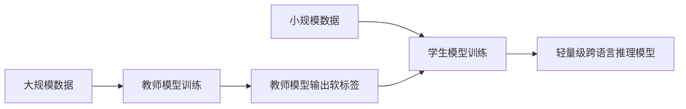

# 基于知识蒸馏的轻量级跨语言推理模型设计

> 关键词：知识蒸馏、轻量级模型、跨语言推理、自然语言处理、模型压缩

> 摘要：本文聚焦于基于知识蒸馏的轻量级跨语言推理模型设计。随着自然语言处理技术的发展，跨语言推理任务变得愈发重要，但传统的大规模语言模型在资源受限的场景下应用存在困难。知识蒸馏作为一种有效的模型压缩技术，为解决这一问题提供了途径。本文深入探讨了知识蒸馏的核心概念、相关算法原理，详细阐述了数学模型和公式，通过项目实战展示了如何实现轻量级跨语言推理模型，并分析了其实际应用场景。同时，推荐了相关的学习资源、开发工具和论文著作，最后总结了该领域的未来发展趋势与挑战，以期为相关研究和实践提供全面的参考。

## 1. 背景介绍 
### 1.1 目的和范围
随着全球化的发展，跨语言交流的需求日益增长，跨语言推理作为自然语言处理中的关键任务，旨在理解和处理不同语言文本之间的逻辑关系。然而，现有的跨语言推理模型往往规模庞大，需要大量的计算资源和存储空间，这限制了其在移动设备、边缘计算等资源受限场景下的应用。本文的目的是设计一种基于知识蒸馏的轻量级跨语言推理模型，在保证一定推理性能的前提下，减少模型的参数量和计算量，提高模型的效率和可移植性。

本文的范围涵盖了知识蒸馏的基本原理、轻量级跨语言推理模型的设计与实现、相关算法的详细阐述、数学模型的推导、项目实战案例以及实际应用场景的分析等方面。

### 1.2 预期读者
本文预期读者包括自然语言处理领域的研究人员、开发者、对人工智能和机器学习感兴趣的学生以及相关行业的技术人员。希望通过本文的介绍，读者能够深入理解基于知识蒸馏的轻量级跨语言推理模型的设计原理和实现方法，为其在实际项目中的应用提供参考。

### 1.3 文档结构概述
本文将按照以下结构进行组织：
1. **背景介绍**：介绍本文的目的、范围、预期读者和文档结构概述，并给出相关术语的定义和解释。
2. **核心概念与联系**：阐述知识蒸馏、轻量级模型和跨语言推理的核心概念，以及它们之间的联系，并给出相应的文本示意图和 Mermaid 流程图。
3. **核心算法原理 & 具体操作步骤**：详细讲解知识蒸馏的核心算法原理，并使用 Python 源代码进行具体操作步骤的阐述。
4. **数学模型和公式 & 详细讲解 & 举例说明**：推导知识蒸馏的数学模型和公式，并通过具体例子进行详细讲解。
5. **项目实战：代码实际案例和详细解释说明**：展示如何搭建开发环境，实现轻量级跨语言推理模型的源代码，并对代码进行详细解读和分析。
6. **实际应用场景**：分析基于知识蒸馏的轻量级跨语言推理模型在不同领域的实际应用场景。
7. **工具和资源推荐**：推荐相关的学习资源、开发工具框架和论文著作。
8. **总结：未来发展趋势与挑战**：总结该领域的未来发展趋势和面临的挑战。
9. **附录：常见问题与解答**：解答读者在阅读本文过程中可能遇到的常见问题。
10. **扩展阅读 & 参考资料**：提供相关的扩展阅读材料和参考资料。

### 1.4 术语表
#### 1.4.1 核心术语定义
- **知识蒸馏（Knowledge Distillation）**：一种模型压缩技术，通过将一个大型教师模型的知识迁移到一个小型学生模型中，使学生模型能够在保持一定性能的前提下，减少参数量和计算量。
- **轻量级模型（Lightweight Model）**：指参数量少、计算量小、对资源要求低的模型，适合在资源受限的环境中运行。
- **跨语言推理（Cross - Language Inference）**：处理不同语言文本之间逻辑关系的任务，例如判断不同语言的两个句子是否蕴含、矛盾或中立关系。
- **教师模型（Teacher Model）**：在知识蒸馏中，通常是一个大型、复杂且性能良好的模型，用于提供知识给学生模型。
- **学生模型（Student Model）**：在知识蒸馏中，是一个小型、简单的模型，通过学习教师模型的知识来提高自身性能。

#### 1.4.2 相关概念解释
- **模型压缩（Model Compression）**：通过各种技术手段减少模型的参数量和计算量，提高模型的效率和可移植性，知识蒸馏是其中一种重要的方法。
- **软标签（Soft Labels）**：在知识蒸馏中，教师模型输出的概率分布作为软标签，包含了比硬标签（如类别标签）更多的信息，学生模型可以从软标签中学习到更多的知识。

#### 1.4.3 缩略词列表
- **NLP**：自然语言处理（Natural Language Processing）
- **ML**：机器学习（Machine Learning）
- **DNN**：深度神经网络（Deep Neural Network）

## 2. 核心概念与联系 
### 知识蒸馏的核心概念
知识蒸馏的基本思想是让一个小型的学生模型学习一个大型教师模型的知识。教师模型通常是一个在大规模数据上训练得到的性能良好的模型，它的输出包含了丰富的知识信息。学生模型通过模仿教师模型的输出，来学习这些知识。

在知识蒸馏中，通常使用软标签来传递知识。软标签是教师模型输出的概率分布，它反映了不同类别之间的相对可能性。与硬标签（如类别标签）相比，软标签包含了更多的信息，学生模型可以从软标签中学习到更多的知识。

### 轻量级模型的核心概念
轻量级模型是指参数量少、计算量小、对资源要求低的模型。轻量级模型的设计通常采用以下几种方法：
1. **网络结构设计**：采用更简单的网络结构，如减少层数、通道数等。
2. **参数共享**：在模型中共享一些参数，减少参数量。
3. **量化**：将模型的参数从浮点数转换为低精度的整数，减少存储和计算量。

### 跨语言推理的核心概念
跨语言推理是处理不同语言文本之间逻辑关系的任务。在跨语言推理中，需要解决的主要问题包括：
1. **语言差异**：不同语言的语法、词汇和表达方式不同，需要进行有效的跨语言表示学习。
2. **语义理解**：需要理解不同语言文本的语义，判断它们之间的逻辑关系。

### 核心概念之间的联系
知识蒸馏可以用于设计轻量级的跨语言推理模型。通过将一个大型的跨语言推理教师模型的知识蒸馏到一个小型的学生模型中，可以在保证一定推理性能的前提下，减少模型的参数量和计算量，从而得到一个轻量级的跨语言推理模型。

### 文本示意图
知识蒸馏的过程可以用以下文本示意图表示：

教师模型（大型跨语言推理模型） -> 软标签（概率分布） -> 学生模型（轻量级跨语言推理模型）

学生模型通过学习教师模型的软标签，来模仿教师模型的行为，从而提高自身的跨语言推理性能。

### Mermaid 流程图


## 3. 核心算法原理 & 具体操作步骤 
### 知识蒸馏的核心算法原理
知识蒸馏的核心思想是通过最小化学生模型和教师模型输出之间的差异，来让学生模型学习教师模型的知识。通常使用 KL 散度（Kullback - Leibler Divergence）来衡量两个概率分布之间的差异。

设教师模型的输出概率分布为 $p_T$，学生模型的输出概率分布为 $p_S$，则知识蒸馏的损失函数可以表示为：

$$L_{KD} = \alpha T^2 KL(p_T || p_S) + (1 - \alpha) L_{CE}$$

其中，$L_{KD}$ 是知识蒸馏的总损失函数，$\alpha$ 是一个超参数，用于控制软标签损失和硬标签损失的权重，$T$ 是温度参数，$KL(p_T || p_S)$ 是 KL 散度，$L_{CE}$ 是学生模型在真实标签上的交叉熵损失。

### 具体操作步骤
以下是基于知识蒸馏的轻量级跨语言推理模型训练的具体操作步骤：

1. **教师模型训练**：使用大规模的跨语言推理数据集训练一个大型的教师模型。
2. **学生模型初始化**：初始化一个小型的学生模型。
3. **知识蒸馏训练**：在训练学生模型时，同时计算软标签损失和硬标签损失，更新学生模型的参数。

### Python 源代码实现
```python
import torch
import torch.nn as nn
import torch.optim as optim
from torch.utils.data import DataLoader, Dataset

# 定义教师模型
class TeacherModel(nn.Module):
    def __init__(self, input_size, hidden_size, output_size):
        super(TeacherModel, self).__init__()
        self.fc1 = nn.Linear(input_size, hidden_size)
        self.relu = nn.ReLU()
        self.fc2 = nn.Linear(hidden_size, output_size)

    def forward(self, x):
        out = self.fc1(x)
        out = self.relu(out)
        out = self.fc2(out)
        return out

# 定义学生模型
class StudentModel(nn.Module):
    def __init__(self, input_size, hidden_size, output_size):
        super(StudentModel, self).__init__()
        self.fc1 = nn.Linear(input_size, hidden_size)
        self.relu = nn.ReLU()
        self.fc2 = nn.Linear(hidden_size, output_size)

    def forward(self, x):
        out = self.fc1(x)
        out = self.relu(out)
        out = self.fc2(out)
        return out

# 定义数据集
class CustomDataset(Dataset):
    def __init__(self, data, labels):
        self.data = data
        self.labels = labels

    def __len__(self):
        return len(self.data)

    def __getitem__(self, idx):
        return self.data[idx], self.labels[idx]

# 知识蒸馏训练函数
def knowledge_distillation(teacher_model, student_model, train_data, train_labels, epochs, alpha, T, learning_rate):
    dataset = CustomDataset(train_data, train_labels)
    dataloader = DataLoader(dataset, batch_size=32, shuffle=True)

    criterion_kl = nn.KLDivLoss(reduction='batchmean')
    criterion_ce = nn.CrossEntropyLoss()
    optimizer = optim.Adam(student_model.parameters(), lr=learning_rate)

    teacher_model.eval()
    for epoch in range(epochs):
        running_loss = 0.0
        for inputs, labels in dataloader:
            optimizer.zero_grad()

            # 教师模型输出软标签
            with torch.no_grad():
                teacher_outputs = teacher_model(inputs)
                teacher_probs = nn.functional.softmax(teacher_outputs / T, dim=1)

            # 学生模型输出
            student_outputs = student_model(inputs)
            student_probs = nn.functional.softmax(student_outputs / T, dim=1)

            # 计算软标签损失
            kl_loss = criterion_kl(student_probs.log(), teacher_probs) * (T**2)

            # 计算硬标签损失
            ce_loss = criterion_ce(student_outputs, labels)

            # 计算总损失
            loss = alpha * kl_loss + (1 - alpha) * ce_loss

            # 反向传播和参数更新
            loss.backward()
            optimizer.step()

            running_loss += loss.item()

        print(f'Epoch {epoch + 1}/{epochs}, Loss: {running_loss / len(dataloader)}')

# 示例参数
input_size = 100
hidden_size = 50
output_size = 10
epochs = 10
alpha = 0.5
T = 2
learning_rate = 0.001

# 初始化教师模型和学生模型
teacher_model = TeacherModel(input_size, hidden_size, output_size)
student_model = StudentModel(input_size, hidden_size, output_size)

# 生成示例数据
train_data = torch.randn(1000, input_size)
train_labels = torch.randint(0, output_size, (1000,))

# 进行知识蒸馏训练
knowledge_distillation(teacher_model, student_model, train_data, train_labels, epochs, alpha, T, learning_rate)
```

## 4. 数学模型和公式 & 详细讲解 & 举例说明 
### KL 散度的定义
KL 散度是用来衡量两个概率分布之间差异的一种方法。设 $p$ 和 $q$ 是两个离散概率分布，则它们之间的 KL 散度定义为：

$$KL(p || q) = \sum_{i} p(i) \log \frac{p(i)}{q(i)}$$

其中，$i$ 表示所有可能的取值。

### 知识蒸馏损失函数的推导
知识蒸馏的损失函数由两部分组成：软标签损失和硬标签损失。

#### 软标签损失
软标签损失使用 KL 散度来衡量学生模型和教师模型输出概率分布之间的差异。设教师模型的输出概率分布为 $p_T$，学生模型的输出概率分布为 $p_S$，则软标签损失为：

$$L_{soft} = T^2 KL(p_T || p_S)$$

其中，$T$ 是温度参数。温度参数的作用是平滑概率分布，使得教师模型的输出概率分布更加平缓，从而让学生模型能够学习到更多的知识。

#### 硬标签损失
硬标签损失是学生模型在真实标签上的交叉熵损失。设真实标签为 $y$，学生模型的输出为 $z$，则硬标签损失为：

$$L_{hard} = L_{CE}(z, y)$$

其中，$L_{CE}$ 是交叉熵损失函数。

#### 总损失函数
知识蒸馏的总损失函数是软标签损失和硬标签损失的加权和：

$$L_{KD} = \alpha T^2 KL(p_T || p_S) + (1 - \alpha) L_{CE}$$

其中，$\alpha$ 是一个超参数，用于控制软标签损失和硬标签损失的权重。

### 举例说明
假设我们有一个二分类问题，教师模型的输出概率分布为 $p_T = [0.8, 0.2]$，学生模型的输出概率分布为 $p_S = [0.6, 0.4]$，温度参数 $T = 2$，$\alpha = 0.5$，真实标签为 $y = [1, 0]$。

#### 计算软标签损失
首先，计算 $p_T$ 和 $p_S$ 的 KL 散度：

$$KL(p_T || p_S) = 0.8 \log \frac{0.8}{0.6} + 0.2 \log \frac{0.2}{0.4} \approx 0.098$$

则软标签损失为：

$$L_{soft} = T^2 KL(p_T || p_S) = 2^2 \times 0.098 = 0.392$$

#### 计算硬标签损失
学生模型的输出为 $z = [0.6, 0.4]$，真实标签为 $y = [1, 0]$，则交叉熵损失为：

$$L_{CE} = - \log(0.6) \approx 0.511$$

#### 计算总损失
总损失为：

$$L_{KD} = \alpha T^2 KL(p_T || p_S) + (1 - \alpha) L_{CE} = 0.5 \times 0.392 + 0.5 \times 0.511 = 0.4515$$

## 5. 项目实战：代码实际案例和详细解释说明 
### 5.1  开发环境搭建
#### 安装 Python
首先，确保你已经安装了 Python 3.6 或更高版本。你可以从 Python 官方网站（https://www.python.org/downloads/） 下载并安装 Python。

#### 安装深度学习框架
本项目使用 PyTorch 作为深度学习框架。你可以使用以下命令安装 PyTorch：

```sh
pip install torch torchvision
```

#### 安装其他依赖库
还需要安装一些其他的依赖库，如 numpy、tqdm 等。可以使用以下命令安装：

```sh
pip install numpy tqdm
```

### 5.2  源代码详细实现和代码解读
#### 数据集准备
在本项目中，我们使用一个模拟的跨语言推理数据集。实际应用中，你可以使用公开的跨语言推理数据集，如 XNLI 等。

```python
import torch
import torch.nn as nn
import torch.optim as optim
from torch.utils.data import DataLoader, Dataset
import numpy as np
from tqdm import tqdm

# 定义数据集
class CrossLanguageInferenceDataset(Dataset):
    def __init__(self, data, labels):
        self.data = data
        self.labels = labels

    def __len__(self):
        return len(self.data)

    def __getitem__(self, idx):
        return self.data[idx], self.labels[idx]

# 生成模拟数据集
input_size = 100
num_samples = 1000
output_size = 3
train_data = torch.randn(num_samples, input_size)
train_labels = torch.randint(0, output_size, (num_samples,))

train_dataset = CrossLanguageInferenceDataset(train_data, train_labels)
train_dataloader = DataLoader(train_dataset, batch_size=32, shuffle=True)
```

#### 定义教师模型和学生模型
```python
# 定义教师模型
class TeacherModel(nn.Module):
    def __init__(self, input_size, hidden_size, output_size):
        super(TeacherModel, self).__init__()
        self.fc1 = nn.Linear(input_size, hidden_size)
        self.relu = nn.ReLU()
        self.fc2 = nn.Linear(hidden_size, output_size)

    def forward(self, x):
        out = self.fc1(x)
        out = self.relu(out)
        out = self.fc2(out)
        return out

# 定义学生模型
class StudentModel(nn.Module):
    def __init__(self, input_size, hidden_size, output_size):
        super(StudentModel, self).__init__()
        self.fc1 = nn.Linear(input_size, hidden_size // 2)  # 学生模型隐藏层尺寸更小
        self.relu = nn.ReLU()
        self.fc2 = nn.Linear(hidden_size // 2, output_size)

    def forward(self, x):
        out = self.fc1(x)
        out = self.relu(out)
        out = self.fc2(out)
        return out

# 初始化教师模型和学生模型
teacher_model = TeacherModel(input_size, 50, output_size)
student_model = StudentModel(input_size, 50, output_size)
```

#### 知识蒸馏训练
```python
# 知识蒸馏训练函数
def knowledge_distillation(teacher_model, student_model, train_dataloader, epochs, alpha, T, learning_rate):
    criterion_kl = nn.KLDivLoss(reduction='batchmean')
    criterion_ce = nn.CrossEntropyLoss()
    optimizer = optim.Adam(student_model.parameters(), lr=learning_rate)

    teacher_model.eval()
    for epoch in range(epochs):
        running_loss = 0.0
        for inputs, labels in tqdm(train_dataloader):
            optimizer.zero_grad()

            # 教师模型输出软标签
            with torch.no_grad():
                teacher_outputs = teacher_model(inputs)
                teacher_probs = nn.functional.softmax(teacher_outputs / T, dim=1)

            # 学生模型输出
            student_outputs = student_model(inputs)
            student_probs = nn.functional.softmax(student_outputs / T, dim=1)

            # 计算软标签损失
            kl_loss = criterion_kl(student_probs.log(), teacher_probs) * (T**2)

            # 计算硬标签损失
            ce_loss = criterion_ce(student_outputs, labels)

            # 计算总损失
            loss = alpha * kl_loss + (1 - alpha) * ce_loss

            # 反向传播和参数更新
            loss.backward()
            optimizer.step()

            running_loss += loss.item()

        print(f'Epoch {epoch + 1}/{epochs}, Loss: {running_loss / len(train_dataloader)}')

# 训练参数
epochs = 10
alpha = 0.5
T = 2
learning_rate = 0.001

# 进行知识蒸馏训练
knowledge_distillation(teacher_model, student_model, train_dataloader, epochs, alpha, T, learning_rate)
```

### 5.3  代码解读与分析
#### 数据集部分
`CrossLanguageInferenceDataset` 类用于封装数据集，方便数据的加载和处理。`__getitem__` 方法用于返回单个样本和对应的标签。

#### 模型部分
`TeacherModel` 和 `StudentModel` 分别定义了教师模型和学生模型。学生模型的隐藏层尺寸更小，以实现轻量级的目的。

#### 知识蒸馏训练部分
在知识蒸馏训练过程中，首先将教师模型设置为评估模式，然后在每个训练批次中，计算教师模型的软标签和学生模型的输出，分别计算软标签损失和硬标签损失，最后将两者加权求和得到总损失，并进行反向传播和参数更新。

## 6. 实际应用场景 
### 智能翻译助手
在智能翻译助手中，跨语言推理可以帮助判断翻译结果是否符合原文的逻辑关系。基于知识蒸馏的轻量级跨语言推理模型可以在移动设备上运行，实时对翻译结果进行推理和校验，提高翻译的准确性和可靠性。

### 跨语言信息检索
在跨语言信息检索中，需要理解不同语言的查询和文档之间的逻辑关系。轻量级跨语言推理模型可以在搜索引擎的服务器端或客户端快速进行推理，提高信息检索的效率和准确性。

### 跨国社交平台
在跨国社交平台中，用户使用不同的语言进行交流。跨语言推理模型可以帮助理解用户之间的对话逻辑，实现自动翻译、情感分析等功能，提高用户体验。

### 国际商务谈判辅助
在国际商务谈判中，涉及到不同语言的交流和逻辑推理。轻量级跨语言推理模型可以在谈判现场的移动设备或便携式终端上运行，实时分析双方的言论逻辑，为谈判人员提供决策支持。

## 7. 工具和资源推荐
### 7.1 学习资源推荐
#### 7.1.1 书籍推荐
- 《深度学习》（Deep Learning）：由 Ian Goodfellow、Yoshua Bengio 和 Aaron Courville 所著，是深度学习领域的经典教材，涵盖了深度学习的基本原理、算法和应用。
- 《自然语言处理入门》：介绍了自然语言处理的基本概念、方法和技术，适合初学者入门。
- 《知识蒸馏：原理与实践》：专门介绍知识蒸馏的书籍，详细讲解了知识蒸馏的原理、算法和应用案例。

#### 7.1.2 在线课程
- Coursera 上的“深度学习专项课程”（Deep Learning Specialization）：由 Andrew Ng 教授授课，全面介绍了深度学习的各个方面。
- edX 上的“自然语言处理”（Natural Language Processing）课程：系统讲解了自然语言处理的理论和实践。
- B 站等平台上的一些关于知识蒸馏和跨语言推理的教程视频，适合快速学习和了解相关知识。

#### 7.1.3 技术博客和网站
- arXiv（https://arxiv.org/）：一个预印本论文库，包含了大量关于人工智能、机器学习和自然语言处理的最新研究成果。
- Medium（https://medium.com/）：有很多技术博客文章，涉及知识蒸馏、轻量级模型等领域的最新进展。
- Hugging Face（https://huggingface.co/）：提供了丰富的自然语言处理模型和数据集，以及相关的教程和文档。

### 7.2 开发工具框架推荐
#### 7.2.1 IDE和编辑器
- PyCharm：一款功能强大的 Python 集成开发环境，提供了代码编辑、调试、版本控制等功能，适合开发深度学习项目。
- Visual Studio Code：一款轻量级的代码编辑器，支持多种编程语言和插件，可通过安装相关插件来进行深度学习开发。

#### 7.2.2 调试和性能分析工具
- PyTorch Profiler：PyTorch 自带的性能分析工具，可以帮助分析模型的计算性能和内存使用情况。
- TensorBoard：一个可视化工具，可以用于可视化模型的训练过程、损失曲线、准确率等指标。

#### 7.2.3 相关框架和库
- PyTorch：一个开源的深度学习框架，提供了丰富的深度学习模型和工具，方便进行模型开发和训练。
- Transformers：Hugging Face 开发的一个自然语言处理库，提供了大量的预训练模型和工具，可用于跨语言推理任务。
- Sentence Transformers：一个用于句子嵌入的库，可以方便地进行跨语言文本的表示学习。

### 7.3 相关论文著作推荐
#### 7.3.1 经典论文
- “Distilling the Knowledge in a Neural Network”：由 Geoffrey Hinton 等人发表的经典论文，首次提出了知识蒸馏的概念。
- “XNLI: Evaluating Cross - Lingual Sentence Representations”：介绍了 XNLI 数据集和跨语言推理的评估方法。

#### 7.3.2 最新研究成果
- 关注 arXiv 上关于知识蒸馏和跨语言推理的最新预印本论文，了解该领域的最新研究进展。

#### 7.3.3 应用案例分析
- 一些学术会议（如 ACL、EMNLP 等）上的论文，会介绍基于知识蒸馏的轻量级跨语言推理模型在实际应用中的案例和效果分析。

## 8. 总结：未来发展趋势与挑战
### 未来发展趋势
#### 更高效的知识蒸馏算法
未来的研究将致力于开发更高效的知识蒸馏算法，进一步提高学生模型的性能，同时减少蒸馏过程的计算量和时间成本。

#### 多模态跨语言推理
随着多模态技术的发展，未来的跨语言推理模型将不仅处理文本信息，还将融合图像、音频等多模态信息，实现更全面的跨语言理解和推理。

#### 自适应轻量级模型
开发能够根据不同的应用场景和资源限制，自适应调整模型结构和参数的轻量级跨语言推理模型，提高模型的灵活性和可扩展性。

#### 跨语言预训练模型的优化
不断优化跨语言预训练模型，提高其在不同语言和任务上的通用性和性能，为轻量级跨语言推理模型的设计提供更好的基础。

### 面临的挑战
#### 语言多样性问题
世界上的语言种类繁多，每种语言都有其独特的语法、词汇和表达方式。如何处理语言的多样性，提高跨语言推理模型在不同语言上的性能，是一个巨大的挑战。

#### 知识迁移的局限性
知识蒸馏中，教师模型的知识迁移到学生模型时，可能会存在信息损失和迁移不充分的问题。如何解决这些问题，提高知识迁移的效果，是需要进一步研究的方向。

#### 计算资源和时间成本
虽然轻量级模型的目的是减少计算资源和时间成本，但在大规模数据和复杂任务的情况下，知识蒸馏和模型训练仍然需要大量的计算资源和时间。如何在保证模型性能的前提下，进一步降低计算资源和时间成本，是一个亟待解决的问题。

#### 模型可解释性
跨语言推理模型通常是黑盒模型，其决策过程难以解释。在一些对模型可解释性要求较高的应用场景中，如何提高模型的可解释性，是一个重要的挑战。

## 9. 附录：常见问题与解答
### 问题 1：知识蒸馏中的温度参数 $T$ 有什么作用？
温度参数 $T$ 的作用是平滑概率分布。在知识蒸馏中，教师模型的输出概率分布通常比较尖锐，即某个类别对应的概率很高，其他类别对应的概率很低。通过引入温度参数 $T$，可以将概率分布变得更加平缓，使得教师模型的输出包含更多的信息，学生模型可以从这些信息中学习到更多的知识。

### 问题 2：如何选择知识蒸馏中的超参数 $\alpha$？
超参数 $\alpha$ 用于控制软标签损失和硬标签损失的权重。一般来说，可以通过实验的方法来选择合适的 $\alpha$ 值。可以在验证集上尝试不同的 $\alpha$ 值，选择使得模型性能最优的 $\alpha$ 值。

### 问题 3：轻量级模型的性能是否会比大型模型差很多？
轻量级模型的性能通常会比大型模型略差一些，但通过知识蒸馏等技术，可以在保证一定性能的前提下，显著减少模型的参数量和计算量。在实际应用中，需要根据具体的需求和资源限制，权衡模型的性能和效率。

### 问题 4：跨语言推理模型如何处理不同语言的编码问题？
在跨语言推理模型中，通常使用预训练的跨语言模型来处理不同语言的编码问题。这些预训练模型在大规模的跨语言数据上进行训练，能够学习到不同语言之间的语义关系和表示。在实际应用中，可以直接使用这些预训练模型的输出作为输入特征，来进行跨语言推理任务。

## 10. 扩展阅读 & 参考资料
### 扩展阅读
- 关于模型压缩和量化的相关资料，了解更多减少模型参数量和计算量的方法。
- 关于跨语言表示学习的最新研究成果，深入了解跨语言推理的理论和技术。

### 参考资料
- 相关的学术论文和书籍，如本文中推荐的经典论文和书籍。
- 开源代码库，如 GitHub 上关于知识蒸馏和跨语言推理的项目，参考其实现细节和代码结构。