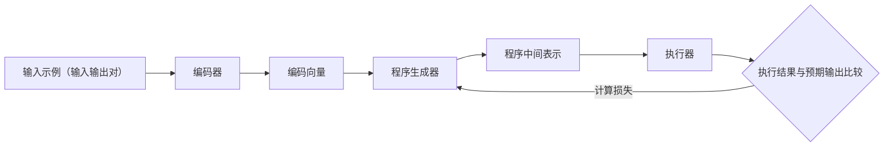

# 基于神经程序归纳的自动推理算法生成

> 关键词：神经程序归纳、自动推理、算法生成、深度学习、人工智能

> 摘要：本文聚焦于基于神经程序归纳的自动推理算法生成这一前沿领域。详细介绍了神经程序归纳的核心概念、原理及架构，深入剖析了相关的核心算法，包括使用 Python 代码进行具体实现。通过数学模型和公式对其进行理论阐释，并结合实际案例展示了算法生成的过程。同时探讨了该技术在不同场景下的实际应用，推荐了相关的学习资源、开发工具和论文著作。最后对其未来发展趋势与挑战进行了总结，旨在为读者全面呈现基于神经程序归纳的自动推理算法生成的全貌，推动该领域的研究与应用发展。

## 1. 背景介绍 
### 1.1 目的和范围
自动推理算法生成是人工智能领域极具挑战性和潜力的研究方向。其目的在于实现自动化地生成能够解决特定推理任务的算法，减少人工编写算法的工作量和错误率，提高算法开发的效率和质量。基于神经程序归纳的方法为自动推理算法生成提供了新的思路和技术手段。本文章的范围涵盖了神经程序归纳的基本概念、相关算法原理、数学模型、实际应用案例以及未来发展趋势等方面，旨在全面介绍基于神经程序归纳的自动推理算法生成技术。

### 1.2 预期读者
本文预期读者包括对人工智能、机器学习、自动推理等领域感兴趣的研究人员、工程师、学生等。对于希望深入了解神经程序归纳技术以及自动推理算法生成方法的读者，本文将提供有价值的参考信息。

### 1.3 文档结构概述
本文首先介绍了背景知识，包括目的、预期读者和文档结构概述等内容。接着阐述了神经程序归纳的核心概念与联系，包括原理和架构。然后详细讲解了核心算法原理及具体操作步骤，并通过 Python 代码进行了实现。随后介绍了相关的数学模型和公式，并举例说明。之后通过项目实战展示了代码的实际案例和详细解释。接着探讨了该技术的实际应用场景。再推荐了相关的工具和资源。最后对未来发展趋势与挑战进行了总结，并提供了常见问题与解答以及扩展阅读和参考资料。

### 1.4 术语表
#### 1.4.1 核心术语定义
- **神经程序归纳（Neural Program Induction）**：利用神经网络模型从示例输入输出对中学习并归纳出程序的过程。
- **自动推理（Automated Reasoning）**：让计算机自动进行逻辑推理，以解决问题或证明定理的技术。
- **算法生成（Algorithm Generation）**：自动创建能够完成特定任务的算法的过程。

#### 1.4.2 相关概念解释
- **深度学习（Deep Learning）**：一种基于人工神经网络的机器学习技术，通过多层神经网络学习数据的复杂模式和特征。
- **程序合成（Program Synthesis）**：根据给定的规范或示例，自动生成满足要求的程序的技术。

#### 1.4.3 缩略词列表
- **DNN**：深度神经网络（Deep Neural Network）
- **RNN**：循环神经网络（Recurrent Neural Network）
- **LSTM**：长短期记忆网络（Long Short - Term Memory Network）

## 2. 核心概念与联系 
### 核心概念原理
神经程序归纳的核心思想是将程序看作是一种可以从数据中学习的表示。给定一组输入输出示例，神经程序归纳系统试图学习一个程序，该程序能够在给定输入时产生正确的输出。其原理基于深度学习模型，通过对大量示例的学习，神经网络可以捕捉到程序的结构和逻辑模式。

在自动推理算法生成的场景中，神经程序归纳系统会将推理任务的输入输出示例作为训练数据。例如，在数学定理证明的推理任务中，输入可以是定理的前提条件，输出可以是定理的结论。神经网络通过学习这些示例，尝试归纳出能够完成推理任务的算法。

### 架构
神经程序归纳系统通常由以下几个主要部分组成：
1. **编码器（Encoder）**：将输入的示例（如输入输出对）编码为向量表示。编码器可以是基于卷积神经网络（CNN）、循环神经网络（RNN）或变压器（Transformer）等结构的神经网络。其作用是提取输入示例的特征信息。
2. **程序生成器（Program Generator）**：根据编码器输出的向量表示，生成程序的中间表示。程序生成器可以是一个基于解码器的神经网络，如循环神经网络解码器或变压器解码器。它会逐步生成程序的各个部分，如函数调用、变量赋值等。
3. **执行器（Executor）**：对生成的程序进行执行，将输入数据作为程序的输入，得到输出结果。执行器会将执行结果与预期输出进行比较，计算损失值，用于训练神经网络。

### 文本示意图
```plaintext
输入示例（输入输出对） --> 编码器 --> 编码向量 --> 程序生成器 --> 程序中间表示 --> 执行器
                                                             |
                                                             v
                                                     执行结果与预期输出比较，计算损失
```

### Mermaid 流程图


## 3. 核心算法原理 & 具体操作步骤 
### 算法原理
神经程序归纳的核心算法通常基于强化学习或监督学习。在监督学习中，系统通过最小化生成程序的输出与预期输出之间的损失来学习。在强化学习中，系统通过与环境交互，根据奖励信号来优化生成的程序。

下面以基于监督学习的神经程序归纳算法为例，详细介绍其原理。

假设我们有一组输入输出示例 $\{(x_1, y_1), (x_2, y_2), \cdots, (x_n, y_n)\}$，其中 $x_i$ 是输入数据，$y_i$ 是对应的预期输出。神经程序归纳系统的目标是学习一个程序 $p$，使得对于每个输入 $x_i$，程序 $p$ 的输出 $p(x_i)$ 尽可能接近预期输出 $y_i$。

我们使用一个神经网络模型 $f_{\theta}$ 来表示程序生成器，其中 $\theta$ 是神经网络的参数。对于每个输入示例 $(x_i, y_i)$，我们首先将输入 $x_i$ 经过编码器编码为向量 $h_i$，然后将 $h_i$ 输入到程序生成器 $f_{\theta}$ 中，生成程序的中间表示 $p_i$。接着，我们使用执行器执行程序 $p_i$，得到输出 $\hat{y}_i$。

损失函数可以定义为预期输出 $y_i$ 与生成输出 $\hat{y}_i$ 之间的差异，例如均方误差损失：
$$L(\theta) = \frac{1}{n} \sum_{i=1}^{n} ||y_i - \hat{y}_i||^2$$

通过最小化损失函数 $L(\theta)$，我们可以更新神经网络的参数 $\theta$，使得生成的程序越来越接近最优解。

### 具体操作步骤
1. **数据准备**：收集和整理输入输出示例数据集。对数据进行预处理，如归一化、编码等操作。
2. **模型定义**：定义编码器、程序生成器和执行器的神经网络结构。选择合适的损失函数和优化器。
3. **训练过程**：
    - 对于每个训练迭代，从数据集中随机选择一个批次的输入输出示例。
    - 将输入示例经过编码器编码为向量。
    - 使用程序生成器生成程序的中间表示。
    - 执行生成的程序，得到输出结果。
    - 计算损失值。
    - 使用优化器更新神经网络的参数。
4. **测试和评估**：使用测试数据集对训练好的模型进行测试和评估。计算评估指标，如准确率、召回率等。

### Python 源代码实现
```python
import torch
import torch.nn as nn
import torch.optim as optim

# 定义编码器
class Encoder(nn.Module):
    def __init__(self, input_size, hidden_size):
        super(Encoder, self).__init__()
        self.fc = nn.Linear(input_size, hidden_size)
        self.relu = nn.ReLU()

    def forward(self, x):
        out = self.fc(x)
        out = self.relu(out)
        return out

# 定义程序生成器
class ProgramGenerator(nn.Module):
    def __init__(self, hidden_size, output_size):
        super(ProgramGenerator, self).__init__()
        self.fc = nn.Linear(hidden_size, output_size)

    def forward(self, h):
        out = self.fc(h)
        return out

# 定义执行器（简单示例，实际中需要根据具体任务实现）
def executor(p, x):
    # 这里简单将程序 p 与输入 x 相乘作为输出
    return p * x

# 数据准备
input_size = 10
hidden_size = 20
output_size = 1
num_examples = 100
x = torch.randn(num_examples, input_size)
y = torch.randn(num_examples, output_size)

# 模型定义
encoder = Encoder(input_size, hidden_size)
program_generator = ProgramGenerator(hidden_size, output_size)
criterion = nn.MSELoss()
optimizer = optim.Adam(list(encoder.parameters()) + list(program_generator.parameters()), lr=0.001)

# 训练过程
num_epochs = 100
for epoch in range(num_epochs):
    optimizer.zero_grad()
    # 编码输入
    h = encoder(x)
    # 生成程序
    p = program_generator(h)
    # 执行程序
    y_pred = executor(p, x)
    # 计算损失
    loss = criterion(y_pred, y)
    # 反向传播和更新参数
    loss.backward()
    optimizer.step()

    if (epoch + 1) % 10 == 0:
        print(f'Epoch [{epoch + 1}/{num_epochs}], Loss: {loss.item():.4f}')

# 测试和评估（简单示例）
test_x = torch.randn(10, input_size)
test_y = torch.randn(10, output_size)
h_test = encoder(test_x)
p_test = program_generator(h_test)
y_pred_test = executor(p_test, test_x)
test_loss = criterion(y_pred_test, test_y)
print(f'Test Loss: {test_loss.item():.4f}')
```

## 4. 数学模型和公式 & 详细讲解 & 举例说明 
### 数学模型
神经程序归纳的数学模型可以基于概率图模型或神经网络模型。在基于神经网络的模型中，我们可以将其看作是一个条件概率模型。

设 $X$ 是输入示例的集合，$Y$ 是输出示例的集合，$P$ 是程序的集合。神经程序归纳系统的目标是学习一个条件概率分布 $P(p|x)$，其中 $p \in P$ 是程序，$x \in X$ 是输入示例。

根据贝叶斯定理，我们有：
$$P(p|x) = \frac{P(x|p)P(p)}{P(x)}$$

其中，$P(x|p)$ 是在给定程序 $p$ 的情况下生成输入示例 $x$ 的概率，$P(p)$ 是程序 $p$ 的先验概率，$P(x)$ 是输入示例 $x$ 的边缘概率。

在实际应用中，由于 $P(x)$ 是一个归一化常数，我们通常只需要考虑 $P(x|p)P(p)$。

### 详细讲解
- **$P(x|p)$**：表示程序 $p$ 生成输入示例 $x$ 的可能性。在监督学习中，我们通常通过执行程序 $p$ 并比较其输出与预期输出的差异来估计 $P(x|p)$。例如，如果程序 $p$ 的输出与预期输出完全一致，则 $P(x|p)$ 可以设置为 1；如果差异较大，则 $P(x|p)$ 会较小。
- **$P(p)$**：表示程序 $p$ 的先验概率。可以根据程序的复杂度、常见性等因素来定义 $P(p)$。例如，简单的程序可能具有较高的先验概率，而复杂的程序可能具有较低的先验概率。

### 举例说明
假设我们有一个简单的加法任务，输入示例 $x = (2, 3)$，预期输出 $y = 5$。程序 $p$ 可以表示为一个简单的加法函数 $p(a, b) = a + b$。

- **$P(x|p)$**：当我们执行程序 $p$ 并输入 $x = (2, 3)$ 时，得到输出 $p(2, 3) = 5$，与预期输出一致。因此，$P(x|p)$ 可以设置为 1。
- **$P(p)$**：由于加法函数是一个非常常见和简单的程序，我们可以将其先验概率 $P(p)$ 设置为一个较高的值，例如 0.8。

则 $P(p|x) \propto P(x|p)P(p) = 1 \times 0.8 = 0.8$。

## 5. 项目实战：代码实际案例和详细解释说明 
### 5.1  开发环境搭建
- **操作系统**：可以选择 Linux（如 Ubuntu）、Windows 或 macOS。
- **编程语言**：Python 3.x
- **深度学习框架**：PyTorch
- **开发工具**：可以选择 PyCharm、Jupyter Notebook 等。

安装 PyTorch 可以使用以下命令（根据自己的 CUDA 版本选择合适的安装方式）：
```bash
pip install torch torchvision
```

### 5.2  源代码详细实现和代码解读
以下是一个更完整的基于神经程序归纳的自动推理算法生成的代码示例，以简单的数学表达式生成任务为例。

```python
import torch
import torch.nn as nn
import torch.optim as optim
import random

# 定义编码器
class Encoder(nn.Module):
    def __init__(self, input_size, hidden_size):
        super(Encoder, self).__init__()
        self.fc = nn.Linear(input_size, hidden_size)
        self.relu = nn.ReLU()

    def forward(self, x):
        out = self.fc(x)
        out = self.relu(out)
        return out

# 定义程序生成器
class ProgramGenerator(nn.Module):
    def __init__(self, hidden_size, output_size):
        super(ProgramGenerator, self).__init__()
        self.fc = nn.Linear(hidden_size, output_size)
        self.softmax = nn.Softmax(dim=1)

    def forward(self, h):
        out = self.fc(h)
        out = self.softmax(out)
        return out

# 定义执行器
def executor(p, x):
    # 假设程序 p 是一个表示操作的概率分布，这里简单选择概率最大的操作
    op_index = torch.argmax(p, dim=1)
    results = []
    for i in range(len(x)):
        if op_index[i] == 0:
            result = x[i][0] + x[i][1]
        elif op_index[i] == 1:
            result = x[i][0] - x[i][1]
        elif op_index[i] == 2:
            result = x[i][0] * x[i][1]
        else:
            result = x[i][0] / x[i][1]
        results.append(result)
    return torch.tensor(results).unsqueeze(1)

# 数据准备
input_size = 2
hidden_size = 10
output_size = 4  # 4 种操作：加、减、乘、除
num_examples = 100
x = torch.randn(num_examples, input_size)
y = []
for i in range(num_examples):
    op = random.randint(0, 3)
    if op == 0:
        y.append(x[i][0] + x[i][1])
    elif op == 1:
        y.append(x[i][0] - x[i][1])
    elif op == 2:
        y.append(x[i][0] * x[i][1])
    else:
        y.append(x[i][0] / x[i][1])
y = torch.tensor(y).unsqueeze(1)

# 模型定义
encoder = Encoder(input_size, hidden_size)
program_generator = ProgramGenerator(hidden_size, output_size)
criterion = nn.MSELoss()
optimizer = optim.Adam(list(encoder.parameters()) + list(program_generator.parameters()), lr=0.001)

# 训练过程
num_epochs = 100
for epoch in range(num_epochs):
    optimizer.zero_grad()
    # 编码输入
    h = encoder(x)
    # 生成程序
    p = program_generator(h)
    # 执行程序
    y_pred = executor(p, x)
    # 计算损失
    loss = criterion(y_pred, y)
    # 反向传播和更新参数
    loss.backward()
    optimizer.step()

    if (epoch + 1) % 10 == 0:
        print(f'Epoch [{epoch + 1}/{num_epochs}], Loss: {loss.item():.4f}')

# 测试和评估
test_x = torch.randn(10, input_size)
test_y = []
for i in range(10):
    op = random.randint(0, 3)
    if op == 0:
        test_y.append(test_x[i][0] + test_x[i][1])
    elif op == 1:
        test_y.append(test_x[i][0] - test_x[i][1])
    elif op == 2:
        test_y.append(test_x[i][0] * test_x[i][1])
    else:
        test_y.append(test_x[i][0] / test_x[i][1])
test_y = torch.tensor(test_y).unsqueeze(1)

h_test = encoder(test_x)
p_test = program_generator(h_test)
y_pred_test = executor(p_test, test_x)
test_loss = criterion(y_pred_test, test_y)
print(f'Test Loss: {test_loss.item():.4f}')
```

### 5.3  代码解读与分析
- **编码器（Encoder）**：将输入的二维向量 $x$ 编码为隐藏层向量 $h$。使用一个全连接层和 ReLU 激活函数进行特征提取。
- **程序生成器（ProgramGenerator）**：根据编码器输出的隐藏层向量 $h$，生成一个表示操作的概率分布 $p$。使用一个全连接层和 Softmax 函数将输出转换为概率分布。
- **执行器（executor）**：根据程序生成器生成的概率分布 $p$，选择概率最大的操作，并对输入 $x$ 执行该操作，得到输出结果 $y_pred$。
- **数据准备**：生成 100 个输入示例 $x$，并随机选择加、减、乘、除四种操作之一，计算对应的预期输出 $y$。
- **训练过程**：通过多次迭代，不断更新编码器和程序生成器的参数，使得生成的输出 $y_pred$ 与预期输出 $y$ 之间的损失最小化。
- **测试和评估**：使用新生成的测试数据进行测试，计算测试损失，评估模型的性能。

## 6. 实际应用场景 
### 数学定理证明
在数学领域，自动推理算法生成可以用于辅助定理证明。通过神经程序归纳，系统可以从已有的定理证明示例中学习，自动生成可能的证明步骤和算法。例如，在几何定理证明中，系统可以根据已知的几何条件和结论，自动生成证明过程。

### 程序合成
在软件开发中，自动推理算法生成可以用于程序合成。给定程序的功能规范和示例输入输出，系统可以自动生成满足要求的程序代码。这可以大大提高软件开发的效率，减少人工编写代码的工作量。

### 智能辅导系统
在教育领域，自动推理算法生成可以用于智能辅导系统。系统可以根据学生的问题和学习情况，自动生成解题思路和推理过程，帮助学生更好地理解和掌握知识。

### 机器人规划
在机器人领域，自动推理算法生成可以用于机器人的任务规划。机器人可以根据环境信息和任务目标，自动生成执行任务的动作序列和算法，提高机器人的自主性和智能性。

## 7. 工具和资源推荐
### 7.1 学习资源推荐
#### 7.1.1 书籍推荐
- 《深度学习》（Deep Learning），Ian Goodfellow、Yoshua Bengio 和 Aaron Courville 著，这本书是深度学习领域的经典教材，详细介绍了深度学习的基本原理和算法。
- 《人工智能：一种现代的方法》（Artificial Intelligence: A Modern Approach），Stuart Russell 和 Peter Norvig 著，全面介绍了人工智能的各个方面，包括自动推理、机器学习等。

#### 7.1.2 在线课程
- Coursera 上的“深度学习专项课程”（Deep Learning Specialization），由 Andrew Ng 教授授课，提供了深度学习的全面学习资源。
- edX 上的“人工智能导论”（Introduction to Artificial Intelligence），介绍了人工智能的基本概念和算法。

#### 7.1.3 技术博客和网站
- Medium 上的 Towards Data Science，有很多关于深度学习、人工智能的技术文章和教程。
- arXiv.org 是一个预印本服务器，提供了大量的学术论文和研究成果。

### 7.2 开发工具框架推荐
#### 7.2.1 IDE和编辑器
- PyCharm：是一款专门为 Python 开发设计的集成开发环境，提供了丰富的代码编辑、调试和分析功能。
- Jupyter Notebook：是一个交互式的开发环境，适合进行数据探索和模型实验。

#### 7.2.2 调试和性能分析工具
- PyTorch Profiler：是 PyTorch 提供的性能分析工具，可以帮助用户分析模型的性能瓶颈。
- TensorBoard：是 TensorFlow 提供的可视化工具，也可以用于 PyTorch 模型的训练过程可视化。

#### 7.2.3 相关框架和库
- PyTorch：是一个开源的深度学习框架，提供了丰富的神经网络模型和工具。
- NumPy：是 Python 中用于科学计算的基础库，提供了高效的数组操作和数学函数。
- Pandas：是 Python 中用于数据处理和分析的库，提供了数据结构和数据操作功能。

### 7.3 相关论文著作推荐
#### 7.3.1 经典论文
- “Neural Program Induction by Sketching”，介绍了基于草图的神经程序归纳方法。
- “Learning to Execute”，探讨了如何让神经网络学习执行程序的能力。

#### 7.3.2 最新研究成果
- 可以通过 arXiv.org 搜索最新的关于神经程序归纳和自动推理算法生成的研究论文。

#### 7.3.3 应用案例分析
- 一些学术会议（如 NeurIPS、ICML 等）的论文中会有关于神经程序归纳在实际应用中的案例分析。

## 8. 总结：未来发展趋势与挑战
### 未来发展趋势
- **更强大的模型和算法**：随着深度学习技术的不断发展，未来可能会出现更强大的神经程序归纳模型和算法，能够处理更复杂的推理任务和程序生成问题。
- **跨领域应用**：神经程序归纳的自动推理算法生成技术将在更多领域得到应用，如医疗、金融、交通等，为这些领域带来智能化的解决方案。
- **与其他技术的融合**：该技术可能会与知识图谱、强化学习、迁移学习等技术相结合，提高自动推理和算法生成的性能和效率。

### 挑战
- **数据获取和标注**：获取高质量的输入输出示例数据并进行标注是一项具有挑战性的任务，尤其是在一些专业领域。
- **模型可解释性**：神经程序归纳模型通常是黑盒模型，其决策过程和生成的程序难以解释，这在一些对可解释性要求较高的应用场景中是一个问题。
- **计算资源需求**：训练复杂的神经程序归纳模型需要大量的计算资源和时间，这限制了其在实际应用中的推广。

## 9. 附录：常见问题与解答
### 问题 1：神经程序归纳与传统程序合成有什么区别？
答：传统程序合成通常基于规则和逻辑推理，需要人工编写大量的规则和约束条件。而神经程序归纳基于深度学习模型，通过学习示例数据来自动生成程序，不需要显式的规则定义。

### 问题 2：如何评估神经程序归纳生成的程序的质量？
答：可以使用多种评估指标，如准确率、召回率、F1 值等，根据具体任务的需求选择合适的评估指标。同时，还可以通过人工检查和实际应用测试来评估程序的质量。

### 问题 3：神经程序归纳在处理大规模数据时会遇到什么问题？
答：在处理大规模数据时，神经程序归纳可能会遇到计算资源不足、训练时间过长等问题。可以采用数据采样、分布式训练等方法来缓解这些问题。

## 10. 扩展阅读 & 参考资料
- Goodfellow, I., Bengio, Y., & Courville, A. (2016). Deep Learning. MIT Press.
- Russell, S. J., & Norvig, P. (2009). Artificial Intelligence: A Modern Approach. Prentice Hall.
- Neural Program Induction by Sketching, https://arxiv.org/abs/1611.01855
- Learning to Execute, https://arxiv.org/abs/1410.4615
- PyTorch 官方文档, https://pytorch.org/docs/stable/
- NumPy 官方文档, https://numpy.org/doc/
- Pandas 官方文档, https://pandas.pydata.org/docs/