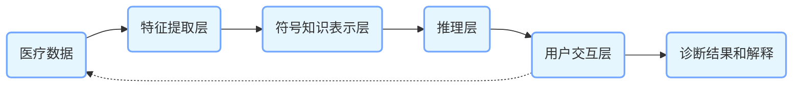

# 基于神经符号整合的可解释决策系统在医疗诊断中的优化

> 关键词：神经符号整合、可解释决策系统、医疗诊断、优化、人工智能

> 摘要：本文聚焦于基于神经符号整合的可解释决策系统在医疗诊断中的优化。首先介绍了该领域的研究背景，包括目的、预期读者等内容。接着阐述了神经符号整合及可解释决策系统的核心概念与联系，详细讲解了相关算法原理和操作步骤，并给出了对应的数学模型和公式。通过项目实战展示了代码实现及解读，分析了其在实际医疗诊断场景中的应用。同时推荐了学习资源、开发工具框架以及相关论文著作。最后总结了未来发展趋势与挑战，还提供了常见问题解答和参考资料，旨在为推动该技术在医疗诊断领域的发展提供全面且深入的参考。

## 1. 背景介绍 
### 1.1 目的和范围
在医疗诊断领域，准确且可解释的决策至关重要。传统的医疗诊断方法往往依赖医生的经验和专业知识，存在主观性和局限性。随着人工智能技术的发展，机器学习和深度学习模型在医疗数据处理和诊断预测方面取得了显著成果。然而，这些模型大多是黑盒模型，缺乏可解释性，使得医生和患者难以理解模型的决策过程和依据，限制了其在医疗领域的广泛应用。

基于神经符号整合的可解释决策系统旨在结合神经网络强大的学习能力和符号系统的逻辑推理与可解释性，为医疗诊断提供更加准确、可靠且可解释的决策支持。本研究的范围主要集中在探讨如何优化该系统在医疗诊断中的应用，包括系统架构的改进、算法的优化、数据的处理等方面。

### 1.2 预期读者
本文的预期读者包括医疗领域的专业人员，如医生、医学研究人员等，他们可以通过了解该系统的原理和应用，更好地利用人工智能技术辅助医疗诊断；计算机科学和人工智能领域的研究人员和开发者，他们可以从中获取关于神经符号整合和可解释决策系统的最新研究成果和技术实现细节；以及对医疗人工智能感兴趣的学生和爱好者，帮助他们深入理解该领域的知识和技术。

### 1.3 文档结构概述
本文将按照以下结构进行阐述：首先介绍神经符号整合和可解释决策系统的核心概念与联系，包括其原理和架构；接着详细讲解核心算法原理和具体操作步骤，并给出对应的 Python 源代码；然后介绍相关的数学模型和公式，并通过举例进行说明；通过项目实战展示代码的实际案例和详细解释；分析该系统在实际医疗诊断中的应用场景；推荐相关的学习资源、开发工具框架和论文著作；总结未来发展趋势与挑战；提供常见问题解答和参考资料。

### 1.4 术语表
#### 1.4.1 核心术语定义
- **神经符号整合**：将神经网络的学习能力与符号系统的逻辑推理和可解释性相结合的一种技术方法。神经网络可以自动从数据中学习特征和模式，而符号系统则可以进行逻辑推理和知识表示，两者相互补充，实现更强大的智能系统。
- **可解释决策系统**：能够提供决策过程和依据的解释，使得用户可以理解系统是如何做出决策的系统。在医疗诊断中，可解释性对于医生和患者来说非常重要，它可以帮助医生验证诊断结果的可靠性，也可以让患者更好地理解自己的病情和治疗方案。
- **医疗诊断**：医生通过对患者的症状、体征、检查结果等信息进行分析和判断，确定患者所患疾病的过程。在本研究中，基于神经符号整合的可解释决策系统旨在辅助医生进行更准确、可解释的医疗诊断。

#### 1.4.2 相关概念解释
- **神经网络**：一种模仿人类神经系统的计算模型，由大量的神经元组成。神经网络可以通过学习数据中的模式和特征，自动进行分类、预测等任务。常见的神经网络包括多层感知机（MLP）、卷积神经网络（CNN）、循环神经网络（RNN）等。
- **符号系统**：一种基于符号和规则的知识表示和推理系统。符号系统可以用逻辑表达式、规则等方式表示知识，并通过推理引擎进行逻辑推理。符号系统的优点是具有明确的语义和可解释性，但在处理复杂的、不确定的信息时存在一定的局限性。
- **知识图谱**：一种以图的形式表示知识的方法，由实体、关系和属性组成。知识图谱可以将领域知识进行结构化表示，方便进行知识的查询、推理和共享。在医疗领域，知识图谱可以用于表示疾病、症状、药物等之间的关系，为医疗诊断提供知识支持。

#### 1.4.3 缩略词列表
- **MLP**：多层感知机（Multilayer Perceptron）
- **CNN**：卷积神经网络（Convolutional Neural Network）
- **RNN**：循环神经网络（Recurrent Neural Network）
- **AI**：人工智能（Artificial Intelligence）
- **ML**：机器学习（Machine Learning）
- **DL**：深度学习（Deep Learning）

## 2. 核心概念与联系 

### 核心概念原理
神经符号整合的核心思想是将神经网络和符号系统的优势相结合。神经网络具有强大的感知和学习能力，可以从大量的数据中自动提取特征和模式。例如，在医疗图像诊断中，卷积神经网络可以自动识别图像中的病变特征。然而，神经网络的决策过程往往是黑盒的，难以解释。

符号系统则具有明确的语义和可解释性，可以用逻辑规则和知识表示来进行推理。例如，在医疗诊断中，可以用规则“如果患者有咳嗽、发热、乏力等症状，且肺部 CT 显示有炎症，则可能患有肺炎”来进行诊断推理。但是，符号系统在处理复杂的、不确定的信息时存在一定的局限性，需要大量的人工知识工程。

神经符号整合的方法可以分为两种：一种是松散耦合，即神经网络和符号系统分别独立工作，通过中间层进行信息交互；另一种是紧密耦合，即神经网络和符号系统深度融合，共同进行学习和推理。

### 架构的文本示意图
基于神经符号整合的可解释决策系统在医疗诊断中的架构可以分为以下几个层次：
1. **数据层**：收集和存储医疗数据，包括患者的病历、检查报告、图像等。
2. **特征提取层**：使用神经网络对医疗数据进行特征提取，例如使用卷积神经网络对医疗图像进行特征提取，使用循环神经网络对病历文本进行特征提取。
3. **符号知识表示层**：将领域知识用符号系统进行表示，例如构建医疗知识图谱，将疾病、症状、药物等之间的关系进行结构化表示。
4. **推理层**：结合神经网络提取的特征和符号系统表示的知识进行推理，生成诊断结果和解释。
5. **用户交互层**：将诊断结果和解释呈现给用户，例如医生和患者，并接收用户的反馈。

### Mermaid 流程图


## 3. 核心算法原理 & 具体操作步骤 

### 核心算法原理
基于神经符号整合的可解释决策系统在医疗诊断中主要涉及以下几个核心算法：
1. **神经网络特征提取算法**：使用卷积神经网络（CNN）对医疗图像进行特征提取，使用循环神经网络（RNN）或长短期记忆网络（LSTM）对病历文本进行特征提取。以 CNN 为例，其原理是通过卷积层提取图像的局部特征，通过池化层对特征进行降维，最后通过全连接层将特征映射到分类或回归的输出。
2. **符号知识表示与推理算法**：使用知识图谱来表示医疗领域的知识，知识图谱中的实体表示疾病、症状、药物等，关系表示它们之间的关联。推理算法可以基于规则推理或基于图的推理，例如基于规则的推理可以根据知识图谱中的规则“如果患者有症状 A 和症状 B，则可能患有疾病 C”进行诊断推理。
3. **神经符号整合算法**：将神经网络提取的特征和符号系统的知识进行整合。一种方法是将神经网络的输出作为符号系统的输入，通过符号系统进行推理；另一种方法是将符号系统的知识作为约束条件，引导神经网络的学习。

### 具体操作步骤
#### 步骤 1：数据预处理
- 收集医疗数据，包括图像、文本等。
- 对图像数据进行预处理，如归一化、裁剪、缩放等。
- 对文本数据进行预处理，如分词、去除停用词、词嵌入等。

#### 步骤 2：特征提取
- 使用 CNN 对图像数据进行特征提取。以下是一个简单的 Python 代码示例：
```python
import torch
import torch.nn as nn

class SimpleCNN(nn.Module):
    def __init__(self):
        super(SimpleCNN, self).__init__()
        self.conv1 = nn.Conv2d(3, 16, kernel_size=3, padding=1)
        self.relu1 = nn.ReLU()
        self.pool1 = nn.MaxPool2d(2)
        self.conv2 = nn.Conv2d(16, 32, kernel_size=3, padding=1)
        self.relu2 = nn.ReLU()
        self.pool2 = nn.MaxPool2d(2)
        self.fc1 = nn.Linear(32 * 8 * 8, 128)
        self.relu3 = nn.ReLU()
        self.fc2 = nn.Linear(128, 10)

    def forward(self, x):
        x = self.pool1(self.relu1(self.conv1(x)))
        x = self.pool2(self.relu2(self.conv2(x)))
        x = x.view(-1, 32 * 8 * 8)
        x = self.relu3(self.fc1(x))
        x = self.fc2(x)
        return x

# 示例使用
model = SimpleCNN()
input_image = torch.randn(1, 3, 32, 32)
features = model(input_image)
```
- 使用 RNN 或 LSTM 对文本数据进行特征提取。以下是一个简单的 LSTM 代码示例：
```python
import torch
import torch.nn as nn

class SimpleLSTM(nn.Module):
    def __init__(self, input_size, hidden_size, num_layers, num_classes):
        super(SimpleLSTM, self).__init__()
        self.hidden_size = hidden_size
        self.num_layers = num_layers
        self.lstm = nn.LSTM(input_size, hidden_size, num_layers, batch_first=True)
        self.fc = nn.Linear(hidden_size, num_classes)

    def forward(self, x):
        h0 = torch.zeros(self.num_layers, x.size(0), self.hidden_size).to(x.device)
        c0 = torch.zeros(self.num_layers, x.size(0), self.hidden_size).to(x.device)
        out, _ = self.lstm(x, (h0, c0))
        out = out[:, -1, :]
        out = self.fc(out)
        return out

# 示例使用
input_size = 100
hidden_size = 64
num_layers = 2
num_classes = 5
model = SimpleLSTM(input_size, hidden_size, num_layers, num_classes)
input_text = torch.randn(1, 20, input_size)
features = model(input_text)
```

#### 步骤 3：知识图谱构建
- 收集医疗领域的知识，包括疾病、症状、药物等信息。
- 定义实体和关系，构建知识图谱的图结构。
- 使用图数据库（如 Neo4j）存储知识图谱。

#### 步骤 4：神经符号整合与推理
- 将神经网络提取的特征作为符号系统的输入，结合知识图谱进行推理。
- 根据推理结果生成诊断结果和解释。

## 4. 数学模型和公式 & 详细讲解 & 举例说明 

### 神经网络特征提取的数学模型
以卷积神经网络（CNN）为例，其数学模型可以表示为一系列的卷积、池化和全连接操作。

#### 卷积操作
卷积操作可以表示为：
$$y_{i,j}^k = \sum_{m=0}^{M-1} \sum_{n=0}^{N-1} x_{i+m,j+n}^l \cdot w_{m,n}^{l,k} + b^k$$
其中，$x_{i,j}^l$ 是第 $l$ 层的输入特征图的 $(i,j)$ 位置的值，$w_{m,n}^{l,k}$ 是第 $l$ 层到第 $k$ 层的卷积核的 $(m,n)$ 位置的值，$b^k$ 是第 $k$ 层的偏置，$y_{i,j}^k$ 是第 $k$ 层的输出特征图的 $(i,j)$ 位置的值。

#### 池化操作
最大池化操作可以表示为：
$$y_{i,j}^k = \max_{m=0}^{M-1} \max_{n=0}^{N-1} x_{i \times s + m,j \times s + n}^l$$
其中，$s$ 是池化的步长，$M$ 和 $N$ 是池化窗口的大小。

#### 全连接操作
全连接操作可以表示为：
$$y^k = \sum_{i=0}^{D-1} x^l_i \cdot w_i^k + b^k$$
其中，$x^l_i$ 是第 $l$ 层的输入向量的第 $i$ 个元素，$w_i^k$ 是第 $l$ 层到第 $k$ 层的权重，$b^k$ 是第 $k$ 层的偏置，$y^k$ 是第 $k$ 层的输出。

### 符号推理的数学模型
基于规则的推理可以用逻辑表达式来表示。例如，规则“如果患者有症状 A 和症状 B，则可能患有疾病 C”可以表示为：
$$\text{Symptom}(A) \land \text{Symptom}(B) \rightarrow \text{Disease}(C)$$
其中，$\land$ 表示逻辑与，$\rightarrow$ 表示逻辑蕴含。

### 神经符号整合的数学模型
一种简单的神经符号整合方法是将神经网络的输出作为符号系统的输入。假设神经网络的输出为 $y_{nn}$，符号系统的规则为 $R$，则整合后的推理结果可以表示为：
$$y_{result} = \text{Inference}(y_{nn}, R)$$
其中，$\text{Inference}$ 是符号系统的推理函数。

### 举例说明
假设有一个简单的医疗诊断问题，输入是患者的症状（用文本表示）和胸部 X 光图像。首先，使用 LSTM 对症状文本进行特征提取，得到特征向量 $x_{text}$，使用 CNN 对胸部 X 光图像进行特征提取，得到特征向量 $x_{image}$。然后，将这两个特征向量拼接成一个新的特征向量 $x = [x_{text}, x_{image}]$。

知识图谱中包含规则“如果患者有咳嗽、发热症状，且胸部 X 光图像显示有阴影，则可能患有肺炎”。将特征向量 $x$ 输入到符号系统中，根据规则进行推理。如果 $x$ 中包含咳嗽、发热的特征，且胸部 X 光图像的特征表示有阴影，则推理结果为可能患有肺炎。

## 5. 项目实战：代码实际案例和详细解释说明 

### 5.1  开发环境搭建
#### 硬件环境
- 计算机：CPU 建议为 Intel Core i7 及以上，内存建议为 16GB 及以上，GPU 建议为 NVIDIA GeForce GTX 1080 及以上（用于加速深度学习训练）。
- 存储设备：建议使用固态硬盘（SSD），以提高数据读写速度。

#### 软件环境
- 操作系统：建议使用 Linux 系统（如 Ubuntu 18.04 及以上）或 Windows 10 系统。
- 编程语言：Python 3.7 及以上。
- 深度学习框架：PyTorch 1.7 及以上。
- 图数据库：Neo4j 4.0 及以上。

#### 安装步骤
1. 安装 Python：可以从 Python 官方网站（https://www.python.org/downloads/） 下载并安装 Python。
2. 安装 PyTorch：根据自己的 CUDA 版本和操作系统，从 PyTorch 官方网站（https://pytorch.org/get-started/locally/） 选择合适的安装命令进行安装。
3. 安装 Neo4j：从 Neo4j 官方网站（https://neo4j.com/download/） 下载并安装 Neo4j。

### 5.2  源代码详细实现和代码解读
#### 数据预处理
```python
import torch
from torchvision import transforms
from torchtext.data.utils import get_tokenizer
from torchtext.vocab import build_vocab_from_iterator

# 图像数据预处理
image_transform = transforms.Compose([
    transforms.Resize((224, 224)),
    transforms.ToTensor(),
    transforms.Normalize(mean=[0.485, 0.456, 0.406], std=[0.229, 0.224, 0.225])
])

# 文本数据预处理
tokenizer = get_tokenizer('basic_english')

def yield_tokens(data_iter):
    for text in data_iter:
        yield tokenizer(text)

vocab = build_vocab_from_iterator(yield_tokens(text_data), specials=["<unk>"])
vocab.set_default_index(vocab["<unk>"])

def text_pipeline(x):
    return vocab(tokenizer(x))
```
代码解读：
- `image_transform`：定义了图像数据的预处理步骤，包括调整图像大小、转换为张量和归一化。
- `tokenizer`：使用 `torchtext` 提供的基本英语分词器对文本进行分词。
- `vocab`：根据文本数据构建词汇表，并设置默认索引。
- `text_pipeline`：将文本转换为词汇表中的索引序列。

#### 特征提取
```python
import torch.nn as nn
import torchvision.models as models

# 图像特征提取模型
resnet = models.resnet18(pretrained=True)
image_feature_extractor = nn.Sequential(*list(resnet.children())[:-1])

# 文本特征提取模型
class TextLSTM(nn.Module):
    def __init__(self, vocab_size, embedding_dim, hidden_dim, num_layers, num_classes):
        super(TextLSTM, self).__init__()
        self.embedding = nn.Embedding(vocab_size, embedding_dim)
        self.lstm = nn.LSTM(embedding_dim, hidden_dim, num_layers, batch_first=True)
        self.fc = nn.Linear(hidden_dim, num_classes)

    def forward(self, x):
        x = self.embedding(x)
        out, _ = self.lstm(x)
        out = out[:, -1, :]
        out = self.fc(out)
        return out

text_feature_extractor = TextLSTM(len(vocab), 100, 64, 2, 10)
```
代码解读：
- `image_feature_extractor`：使用预训练的 ResNet18 模型作为图像特征提取器，去除最后一层全连接层。
- `TextLSTM`：定义了一个简单的 LSTM 模型用于文本特征提取，包括嵌入层、LSTM 层和全连接层。

#### 知识图谱构建与推理
```python
from py2neo import Graph, Node, Relationship

# 连接 Neo4j 数据库
graph = Graph("bolt://localhost:7687", auth=("neo4j", "password"))

# 构建知识图谱
disease_node = Node("Disease", name="肺炎")
symptom1_node = Node("Symptom", name="咳嗽")
symptom2_node = Node("Symptom", name="发热")
rel1 = Relationship(symptom1_node, "CAUSES", disease_node)
rel2 = Relationship(symptom2_node, "CAUSES", disease_node)
graph.create(disease_node)
graph.create(symptom1_node)
graph.create(symptom2_node)
graph.create(rel1)
graph.create(rel2)

# 推理函数
def inference(image_features, text_features):
    # 简单示例：假设如果文本特征中包含咳嗽和发热的索引，则认为可能患有肺炎
    cough_index = vocab["咳嗽"]
    fever_index = vocab["发热"]
    if cough_index in text_features and fever_index in text_features:
        return "可能患有肺炎"
    else:
        return "未发现相关症状"
```
代码解读：
- `graph`：连接到 Neo4j 数据库。
- 构建知识图谱：创建疾病节点、症状节点和关系，并将其添加到图数据库中。
- `inference`：简单的推理函数，根据文本特征中是否包含咳嗽和发热的索引来判断是否可能患有肺炎。

### 5.3  代码解读与分析
#### 数据预处理
数据预处理是整个系统的基础，它可以提高模型的训练效果和泛化能力。图像数据的预处理可以使图像具有统一的大小和分布，便于模型处理。文本数据的预处理可以将文本转换为数字序列，方便模型进行计算。

#### 特征提取
特征提取是将原始数据转换为具有代表性的特征向量的过程。图像特征提取使用预训练的模型可以利用其在大规模图像数据上学习到的特征，提高特征提取的效率和准确性。文本特征提取使用 LSTM 模型可以捕捉文本的序列信息。

#### 知识图谱构建与推理
知识图谱可以将医疗领域的知识进行结构化表示，方便进行知识的查询和推理。推理函数根据知识图谱中的规则和特征提取的结果进行推理，生成诊断结果。

## 6. 实际应用场景 
### 疾病诊断辅助
基于神经符号整合的可解释决策系统可以辅助医生进行疾病诊断。医生可以输入患者的症状、检查结果等信息，系统通过对这些信息进行分析和推理，给出可能的疾病诊断结果和解释。例如，在肺癌诊断中，系统可以结合患者的胸部 CT 图像、病历文本等信息，利用神经网络提取图像和文本的特征，再结合知识图谱中的肺癌相关知识进行推理，给出肺癌的诊断概率和依据，帮助医生做出更准确的诊断。

### 治疗方案推荐
该系统还可以根据患者的诊断结果和个体信息，推荐合适的治疗方案。知识图谱中可以包含各种疾病的治疗指南、药物信息等知识，系统通过对患者的特征和知识图谱的推理，生成个性化的治疗方案推荐，并解释推荐的理由。例如，对于患有糖尿病的患者，系统可以根据患者的血糖水平、并发症情况等信息，结合知识图谱中的糖尿病治疗知识，推荐合适的药物和饮食方案。

### 医学研究支持
在医学研究中，该系统可以帮助研究人员分析大量的医疗数据，发现潜在的疾病关联和治疗规律。通过对医疗数据的特征提取和知识图谱的推理，研究人员可以发现新的疾病亚型、药物疗效等信息，为医学研究提供支持。例如，在癌症研究中，系统可以分析大量的癌症患者的基因数据、临床数据等，发现不同癌症亚型的特征和治疗靶点。

## 7. 工具和资源推荐
### 7.1 学习资源推荐
#### 7.1.1 书籍推荐
- 《深度学习》（Deep Learning）：由 Ian Goodfellow、Yoshua Bengio 和 Aaron Courville 合著，是深度学习领域的经典教材，全面介绍了深度学习的基本概念、算法和应用。
- 《人工智能：一种现代的方法》（Artificial Intelligence: A Modern Approach）：由 Stuart Russell 和 Peter Norvig 合著，是人工智能领域的权威教材，涵盖了人工智能的各个方面，包括搜索算法、知识表示、机器学习等。
- 《Python 深度学习》（Deep Learning with Python）：由 Francois Chollet 著，是一本介绍如何使用 Python 和 Keras 进行深度学习的书籍，适合初学者快速入门。

#### 7.1.2 在线课程
- Coursera 上的“深度学习专项课程”（Deep Learning Specialization）：由 Andrew Ng 教授讲授，包括深度学习的基础知识、卷积神经网络、循环神经网络等内容，是学习深度学习的优质课程。
- edX 上的“人工智能导论”（Introduction to Artificial Intelligence）：由麻省理工学院（MIT）提供，全面介绍了人工智能的基本概念、算法和应用。
- 中国大学 MOOC 上的“机器学习”：由周志华教授讲授，是国内机器学习领域的经典课程，适合深入学习机器学习的理论和算法。

#### 7.1.3 技术博客和网站
- Medium：一个技术博客平台，上面有很多关于人工智能、深度学习的优质文章。
- arXiv：一个预印本服务器，提供了大量的学术论文，包括人工智能、机器学习等领域的最新研究成果。
- 机器之心：一个专注于人工智能领域的媒体平台，提供了人工智能的最新技术、应用案例和行业动态。

### 7.2 开发工具框架推荐
#### 7.2.1 IDE和编辑器
- PyCharm：一个专业的 Python 集成开发环境（IDE），提供了代码编辑、调试、版本控制等功能，适合开发 Python 项目。
- Jupyter Notebook：一个交互式的笔记本环境，适合进行数据探索、模型训练和可视化等工作。
- Visual Studio Code：一个轻量级的代码编辑器，支持多种编程语言和插件，具有丰富的扩展功能。

#### 7.2.2 调试和性能分析工具
- PyTorch Profiler：PyTorch 提供的性能分析工具，可以帮助用户分析模型的性能瓶颈，优化模型的训练和推理速度。
- TensorBoard：TensorFlow 提供的可视化工具，也可以与 PyTorch 结合使用，用于可视化模型的训练过程、损失曲线、参数分布等信息。
- cProfile：Python 内置的性能分析工具，可以帮助用户分析 Python 代码的性能瓶颈。

#### 7.2.3 相关框架和库
- PyTorch：一个开源的深度学习框架，提供了丰富的神经网络模块和优化算法，适合进行深度学习模型的开发和训练。
- TensorFlow：另一个开源的深度学习框架，具有强大的分布式训练和部署能力，广泛应用于工业界。
- Neo4j Python Driver：用于连接和操作 Neo4j 图数据库的 Python 驱动程序，方便进行知识图谱的构建和查询。

### 7.3 相关论文著作推荐
#### 7.3.1 经典论文
- “Deep Residual Learning for Image Recognition”：提出了残差网络（ResNet），解决了深度神经网络训练中的梯度消失问题，是计算机视觉领域的经典论文。
- “Attention Is All You Need”：提出了 Transformer 模型，在自然语言处理领域取得了巨大的成功，是近年来最具影响力的论文之一。
- “Neural-Symbolic Learning and Reasoning: A Survey and Interpretation”：对神经符号学习和推理进行了全面的综述和解读，是该领域的重要论文。

#### 7.3.2 最新研究成果
- 关注 arXiv 上的最新论文，了解神经符号整合、可解释人工智能等领域的最新研究进展。
- 参加国际人工智能会议，如 NeurIPS、ICML、AAAI 等，获取最新的研究成果和前沿技术。

#### 7.3.3 应用案例分析
- 阅读相关的学术论文和技术报告，了解基于神经符号整合的可解释决策系统在医疗诊断、金融风险评估、自动驾驶等领域的应用案例和实践经验。

## 8. 总结：未来发展趋势与挑战
### 未来发展趋势
#### 多模态数据融合
未来的基于神经符号整合的可解释决策系统将更加注重多模态数据的融合，包括图像、文本、音频、视频等多种数据类型。通过融合多模态数据，可以获取更全面的信息，提高医疗诊断的准确性和可靠性。例如，在肿瘤诊断中，结合患者的医学影像、病历文本和基因测序数据，可以更准确地判断肿瘤的类型和分期。

#### 知识图谱的扩展和更新
知识图谱是神经符号整合的重要组成部分，未来的知识图谱将不断扩展和更新。随着医学研究的不断发展，新的疾病、症状、药物等知识将不断涌现，知识图谱需要及时更新以反映最新的医学知识。同时，知识图谱的规模也将不断扩大，涵盖更多的领域知识，为医疗诊断提供更强大的知识支持。

#### 与医疗物联网的结合
医疗物联网的发展使得大量的医疗设备可以实时采集患者的生理数据，如心率、血压、血糖等。未来的可解释决策系统将与医疗物联网相结合，实时获取患者的生理数据，并进行分析和推理。例如，通过实时监测患者的心率和血压数据，系统可以及时发现患者的健康异常，并给出相应的预警和建议。

### 挑战
#### 数据隐私和安全
在医疗诊断中，患者的医疗数据包含大量的个人隐私信息，如病历、检查报告等。如何保证这些数据的隐私和安全是一个重要的挑战。在使用神经符号整合的可解释决策系统时，需要采用严格的数据加密、访问控制等技术手段，确保患者数据不被泄露和滥用。

#### 知识表示和推理的复杂性
医疗领域的知识非常复杂，涉及到疾病的分类、症状的描述、药物的作用机制等多个方面。如何准确地表示这些知识，并进行有效的推理是一个挑战。知识图谱的构建需要大量的人工知识工程，而且在处理复杂的、不确定的知识时存在一定的局限性。

#### 可解释性的评估和验证
虽然可解释决策系统的目标是提供决策的解释，但如何评估和验证这些解释的准确性和可靠性是一个难题。目前还没有统一的标准和方法来评估可解释性，需要进一步的研究和探索。

## 9. 附录：常见问题与解答
### 问题 1：神经符号整合的可解释决策系统与传统的机器学习模型有什么区别？
传统的机器学习模型大多是黑盒模型，其决策过程难以理解，缺乏可解释性。而基于神经符号整合的可解释决策系统结合了神经网络的学习能力和符号系统的逻辑推理与可解释性，可以提供决策的过程和依据，使得用户可以理解系统是如何做出决策的。

### 问题 2：知识图谱在医疗诊断中有什么作用？
知识图谱可以将医疗领域的知识进行结构化表示，包括疾病、症状、药物等之间的关系。在医疗诊断中，知识图谱可以为推理提供知识支持，帮助系统根据患者的症状和检查结果进行诊断推理，并生成诊断结果和解释。

### 问题 3：如何保证神经符号整合的可解释决策系统的准确性和可靠性？
为了保证系统的准确性和可靠性，需要从多个方面进行考虑。首先，要使用高质量的医疗数据进行训练和验证，确保数据的准确性和完整性。其次，要选择合适的神经网络模型和符号推理算法，并进行优化和调参。此外，还需要对系统进行严格的测试和评估，不断改进和完善系统。

### 问题 4：该系统在实际医疗应用中面临哪些障碍？
该系统在实际医疗应用中面临一些障碍，如数据隐私和安全问题、医生和患者对人工智能技术的接受程度、系统的可解释性评估和验证等。此外，医疗领域的复杂性和不确定性也给系统的开发和应用带来了挑战。

## 10. 扩展阅读 & 参考资料
### 扩展阅读
- “Explainable Artificial Intelligence: A Review of the Concepts and Applications”：对可解释人工智能的概念和应用进行了全面的综述。
- “Medical Knowledge Graph: A Survey”：对医疗知识图谱的研究现状进行了综述。
- “Deep Learning in Healthcare: A Review of the State-of-the-Art”：对深度学习在医疗领域的应用进行了综述。

### 参考资料
- 相关的学术论文和研究报告，如在 IEEE、ACM 等学术数据库中搜索到的关于神经符号整合、可解释人工智能、医疗诊断等方面的论文。
- 开源项目和代码库，如 GitHub 上的相关项目，可参考其实现思路和代码。
- 官方文档和技术手册，如 PyTorch、Neo4j 等框架和工具的官方文档。