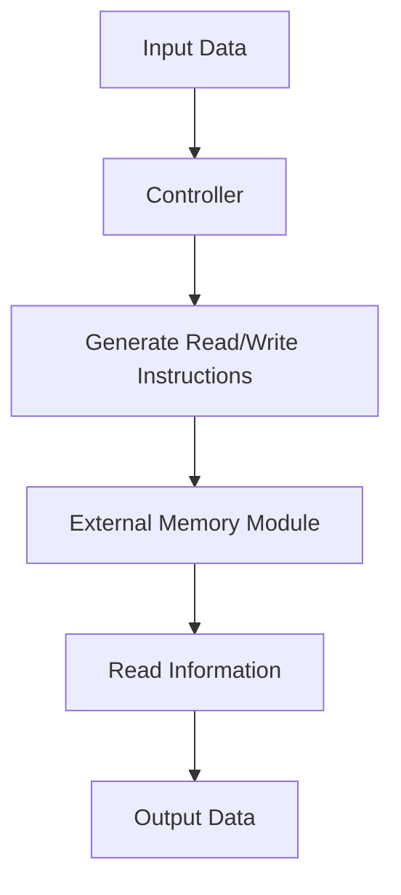

# 基于记忆增强网络的长期依赖推理性能优化技术

> 关键词：记忆增强网络、长期依赖、推理性能优化、深度学习、循环神经网络

> 摘要：本文聚焦于基于记忆增强网络的长期依赖推理性能优化技术。首先介绍了该技术的背景，包括其目的、预期读者等。详细阐述了记忆增强网络等核心概念及其联系，给出了相应的原理和架构示意图与流程图。深入讲解了核心算法原理并通过 Python 源代码进行阐述，同时介绍了相关的数学模型和公式。通过项目实战展示了代码的实际案例并进行详细解释。探讨了该技术的实际应用场景，推荐了学习资源、开发工具框架以及相关论文著作。最后总结了未来发展趋势与挑战，并提供了常见问题解答和扩展阅读参考资料，旨在为读者全面深入地介绍基于记忆增强网络的长期依赖推理性能优化技术。

## 1. 背景介绍 
### 1.1 目的和范围
在深度学习领域，处理序列数据时长期依赖问题一直是一个关键挑战。许多实际应用，如自然语言处理、语音识别、时间序列预测等，都需要模型能够捕捉序列中远距离元素之间的依赖关系。传统的神经网络，如前馈神经网络，由于其结构的局限性，无法有效地处理长期依赖问题。而循环神经网络（RNN）虽然在理论上能够处理序列数据，但在实际应用中，由于梯度消失或梯度爆炸问题，也难以捕捉到长期依赖信息。

记忆增强网络（Memory Augmented Neural Networks，MANNs）作为一种新兴的技术，旨在通过引入外部记忆模块来增强网络的记忆能力，从而更好地处理长期依赖问题。本技术博客的目的在于深入探讨基于记忆增强网络的长期依赖推理性能优化技术，包括其核心概念、算法原理、数学模型、实际应用等方面，帮助读者全面了解和掌握该技术。

### 1.2 预期读者
本文预期读者包括但不限于以下几类人群：
- **深度学习研究者**：希望深入了解记忆增强网络在处理长期依赖问题上的最新进展和技术细节，为自己的研究提供参考和启发。
- **人工智能从业者**：在实际项目中遇到长期依赖问题，希望通过学习记忆增强网络技术来优化模型性能，提高推理效率。
- **计算机科学相关专业的学生**：对深度学习和人工智能领域感兴趣，希望通过阅读本文系统地学习基于记忆增强网络的长期依赖推理性能优化技术。

### 1.3 文档结构概述
本文将按照以下结构进行组织：
1. **背景介绍**：介绍本文的目的、预期读者、文档结构概述以及相关术语表。
2. **核心概念与联系**：详细阐述记忆增强网络等核心概念的原理和架构，给出相应的文本示意图和 Mermaid 流程图。
3. **核心算法原理 & 具体操作步骤**：讲解核心算法原理，并使用 Python 源代码进行详细阐述。
4. **数学模型和公式 & 详细讲解 & 举例说明**：介绍相关的数学模型和公式，并进行详细讲解和举例说明。
5. **项目实战：代码实际案例和详细解释说明**：通过实际项目案例展示代码的实现过程，并进行详细的代码解读和分析。
6. **实际应用场景**：探讨基于记忆增强网络的长期依赖推理性能优化技术在不同领域的实际应用场景。
7. **工具和资源推荐**：推荐学习资源、开发工具框架以及相关论文著作。
8. **总结：未来发展趋势与挑战**：总结该技术的未来发展趋势和面临的挑战。
9. **附录：常见问题与解答**：解答读者在学习和应用过程中可能遇到的常见问题。
10. **扩展阅读 & 参考资料**：提供扩展阅读的相关资料和参考文献。

### 1.4 术语表
#### 1.4.1 核心术语定义
- **记忆增强网络（Memory Augmented Neural Networks，MANNs）**：一种在传统神经网络基础上引入外部记忆模块的神经网络，通过记忆模块来存储和检索信息，从而增强网络的记忆能力，更好地处理长期依赖问题。
- **长期依赖（Long-Term Dependencies）**：在序列数据中，远距离元素之间存在的依赖关系。例如，在自然语言处理中，一个句子中前面的单词可能会对后面的单词产生影响，这种影响可能跨越多个单词，形成长期依赖关系。
- **推理性能（Inference Performance）**：指模型在进行预测或推理时的效率和准确性。在处理长期依赖问题时，提高推理性能意味着模型能够更快速、准确地捕捉序列中的长期依赖信息。
- **循环神经网络（Recurrent Neural Networks，RNN）**：一种专门用于处理序列数据的神经网络，通过在网络中引入循环结构，使得网络能够记住之前的输入信息。但由于梯度消失或梯度爆炸问题，RNN 在处理长期依赖问题时存在一定的局限性。

#### 1.4.2 相关概念解释
- **外部记忆模块（External Memory Module）**：记忆增强网络中的一个重要组成部分，用于存储和检索信息。外部记忆模块通常具有较大的容量，可以存储大量的历史信息，从而帮助网络更好地处理长期依赖问题。
- **注意力机制（Attention Mechanism）**：一种在深度学习中广泛应用的机制，用于自动地选择和聚焦于输入序列中的重要部分。在记忆增强网络中，注意力机制可以帮助网络更好地从外部记忆模块中检索和利用相关信息。
- **梯度消失（Gradient Vanishing）**：在神经网络训练过程中，由于反向传播算法的原因，梯度在传播过程中逐渐变小，导致网络无法有效地学习到长期依赖信息。这是传统 RNN 面临的一个主要问题。
- **梯度爆炸（Gradient Explosion）**：与梯度消失相反，梯度在传播过程中逐渐变大，导致网络无法收敛，甚至出现数值不稳定的情况。

#### 1.4.3 缩略词列表
- **MANNs**：Memory Augmented Neural Networks（记忆增强网络）
- **RNN**：Recurrent Neural Networks（循环神经网络）
- **LSTM**：Long Short-Term Memory（长短期记忆网络）
- **GRU**：Gated Recurrent Unit（门控循环单元）

## 2. 核心概念与联系 

### 2.1 记忆增强网络的原理
记忆增强网络（MANNs）的核心思想是在传统神经网络的基础上引入外部记忆模块，以增强网络的记忆能力。传统的神经网络，如前馈神经网络和循环神经网络，其内部状态的存储容量有限，难以处理长期依赖问题。而记忆增强网络通过外部记忆模块，可以存储更多的历史信息，并在需要时进行检索和利用。

记忆增强网络通常由以下几个部分组成：
- **控制器（Controller）**：可以是一个前馈神经网络或循环神经网络，负责处理输入数据，并生成对外部记忆模块的读写操作指令。
- **外部记忆模块（External Memory Module）**：用于存储和检索信息。外部记忆模块通常是一个矩阵，其中每一行代表一个记忆单元，每个记忆单元可以存储一定的信息。
- **读写头（Read/Write Heads）**：负责对外部记忆模块进行读写操作。读写头可以根据控制器生成的指令，从外部记忆模块中读取信息或向外部记忆模块中写入信息。

### 2.2 记忆增强网络的架构
下面是记忆增强网络的架构示意图：

```plaintext
+---------------------+
|       Input Data    |
+---------------------+
          |
          v
+---------------------+
|      Controller     |
+---------------------+
          |
          | Read/Write Instructions
          v
+---------------------+
|  External Memory    |
|      Module         |
+---------------------+
          |
          | Read Information
          v
+---------------------+
|      Output Data    |
+---------------------+
```

### 2.3 Mermaid 流程图


### 2.4 核心概念之间的联系
记忆增强网络中的各个核心概念之间存在着紧密的联系。控制器根据输入数据生成对外部记忆模块的读写操作指令，读写头根据这些指令对外部记忆模块进行读写操作。外部记忆模块存储了大量的历史信息，通过读写操作，网络可以检索和利用这些信息，从而更好地处理长期依赖问题。注意力机制可以在读写操作中发挥作用，帮助网络自动地选择和聚焦于相关的记忆单元，提高信息检索和利用的效率。

## 3. 核心算法原理 & 具体操作步骤 

### 3.1 核心算法原理
记忆增强网络的核心算法主要包括以下几个步骤：
1. **输入处理**：将输入数据传递给控制器，控制器对输入数据进行处理，生成对外部记忆模块的读写操作指令。
2. **读写操作**：读写头根据控制器生成的指令，对外部记忆模块进行读写操作。读操作从外部记忆模块中检索相关信息，写操作将新的信息写入外部记忆模块。
3. **输出生成**：控制器根据从外部记忆模块中读取的信息和输入数据，生成输出数据。

### 3.2 具体操作步骤
下面是使用 Python 实现一个简单的记忆增强网络的具体操作步骤和源代码：

```python
import torch
import torch.nn as nn
import torch.optim as optim

# 定义控制器
class Controller(nn.Module):
    def __init__(self, input_size, hidden_size, output_size):
        super(Controller, self).__init__()
        self.fc1 = nn.Linear(input_size, hidden_size)
        self.relu = nn.ReLU()
        self.fc2 = nn.Linear(hidden_size, output_size)

    def forward(self, x):
        x = self.fc1(x)
        x = self.relu(x)
        x = self.fc2(x)
        return x

# 定义外部记忆模块
class ExternalMemoryModule:
    def __init__(self, memory_size, memory_dim):
        self.memory = torch.randn(memory_size, memory_dim)

    def read(self, read_weights):
        read_vector = torch.matmul(read_weights, self.memory)
        return read_vector

    def write(self, write_weights, write_vector):
        self.memory = self.memory + torch.matmul(write_weights.t(), write_vector)

# 定义记忆增强网络
class MemoryAugmentedNeuralNetwork(nn.Module):
    def __init__(self, input_size, hidden_size, output_size, memory_size, memory_dim):
        super(MemoryAugmentedNeuralNetwork, self).__init__()
        self.controller = Controller(input_size, hidden_size, output_size + memory_size)
        self.memory_module = ExternalMemoryModule(memory_size, memory_dim)

    def forward(self, x):
        # 控制器生成读写操作指令
        output = self.controller(x)
        read_weights = torch.softmax(output[:, :self.memory_module.memory.shape[0]], dim=1)
        write_weights = torch.softmax(output[:, self.memory_module.memory.shape[0]:], dim=1)

        # 读操作
        read_vector = self.memory_module.read(read_weights)

        # 输出生成
        final_output = output[:, -1] + read_vector
        return final_output

# 训练模型
input_size = 10
hidden_size = 20
output_size = 1
memory_size = 5
memory_dim = 10

model = MemoryAugmentedNeuralNetwork(input_size, hidden_size, output_size, memory_size, memory_dim)
criterion = nn.MSELoss()
optimizer = optim.Adam(model.parameters(), lr=0.001)

# 生成一些示例数据
input_data = torch.randn(100, input_size)
target_data = torch.randn(100, output_size)

# 训练循环
for epoch in range(100):
    optimizer.zero_grad()
    output = model(input_data)
    loss = criterion(output, target_data)
    loss.backward()
    optimizer.step()
    if epoch % 10 == 0:
        print(f'Epoch {epoch}, Loss: {loss.item()}')
```

### 3.3 代码解释
1. **控制器（Controller）**：使用一个简单的全连接神经网络来处理输入数据，并生成对外部记忆模块的读写操作指令。
2. **外部记忆模块（ExternalMemoryModule）**：使用一个矩阵来存储信息，提供了读和写两个操作方法。
3. **记忆增强网络（MemoryAugmentedNeuralNetwork）**：将控制器和外部记忆模块组合在一起，实现了整个记忆增强网络的前向传播过程。
4. **训练过程**：使用均方误差损失函数（MSE）和 Adam 优化器对模型进行训练。

## 4. 数学模型和公式 & 详细讲解 & 举例说明 

### 4.1 数学模型
记忆增强网络的数学模型可以表示为以下几个部分：

#### 4.1.1 控制器输出
控制器的输出可以表示为：
$$
\mathbf{o}_t = f(\mathbf{x}_t; \theta_c)
$$
其中，$\mathbf{x}_t$ 是时刻 $t$ 的输入数据，$\theta_c$ 是控制器的参数，$f$ 是控制器的函数，$\mathbf{o}_t$ 是控制器的输出。

#### 4.1.2 读写权重
读写权重可以通过对控制器的输出进行 softmax 操作得到：
$$
\mathbf{w}^r_t = \text{softmax}(\mathbf{o}^r_t)
$$
$$
\mathbf{w}^w_t = \text{softmax}(\mathbf{o}^w_t)
$$
其中，$\mathbf{o}^r_t$ 和 $\mathbf{o}^w_t$ 分别是控制器输出中用于生成读权重和写权重的部分，$\mathbf{w}^r_t$ 和 $\mathbf{w}^w_t$ 分别是时刻 $t$ 的读权重和写权重。

#### 4.1.3 读操作
读操作可以表示为：
$$
\mathbf{r}_t = \sum_{i=1}^N w^r_{t,i} \mathbf{m}_i
$$
其中，$\mathbf{r}_t$ 是时刻 $t$ 从外部记忆模块中读取的信息，$N$ 是外部记忆模块中记忆单元的数量，$w^r_{t,i}$ 是时刻 $t$ 对第 $i$ 个记忆单元的读权重，$\mathbf{m}_i$ 是第 $i$ 个记忆单元的信息。

#### 4.1.4 写操作
写操作可以表示为：
$$
\mathbf{m}_i \leftarrow \mathbf{m}_i + w^w_{t,i} \mathbf{v}_t
$$
其中，$\mathbf{v}_t$ 是时刻 $t$ 要写入外部记忆模块的信息，$w^w_{t,i}$ 是时刻 $t$ 对第 $i$ 个记忆单元的写权重。

#### 4.1.5 输出生成
最终的输出可以表示为：
$$
\mathbf{y}_t = g(\mathbf{x}_t, \mathbf{r}_t; \theta_y)
$$
其中，$\theta_y$ 是输出层的参数，$g$ 是输出层的函数，$\mathbf{y}_t$ 是时刻 $t$ 的输出。

### 4.2 详细讲解
- **控制器输出**：控制器根据输入数据生成对外部记忆模块的读写操作指令。控制器可以是一个前馈神经网络或循环神经网络，通过学习输入数据和输出指令之间的映射关系，来生成合适的指令。
- **读写权重**：读写权重用于控制对外部记忆模块中不同记忆单元的读写操作。通过 softmax 操作，将控制器的输出转换为概率分布，从而确定每个记忆单元的读写权重。
- **读操作**：读操作根据读权重从外部记忆模块中检索相关信息。通过加权求和的方式，将不同记忆单元的信息组合成一个读向量。
- **写操作**：写操作根据写权重将新的信息写入外部记忆模块。通过更新记忆单元的信息，来存储新的历史信息。
- **输出生成**：最终的输出是根据输入数据和从外部记忆模块中读取的信息生成的。输出层可以是一个简单的全连接层，通过学习输入数据、读向量和输出之间的映射关系，来生成最终的输出。

### 4.3 举例说明
假设我们有一个外部记忆模块，其中包含 3 个记忆单元，每个记忆单元的维度为 2：
$$
\mathbf{M} = \begin{bmatrix}
1 & 2 \\
3 & 4 \\
5 & 6
\end{bmatrix}
$$
时刻 $t$ 的读权重为：
$$
\mathbf{w}^r_t = \begin{bmatrix}
0.2 \\
0.3 \\
0.5
\end{bmatrix}
$$
则时刻 $t$ 从外部记忆模块中读取的信息为：
$$
\mathbf{r}_t = 0.2 \begin{bmatrix}
1 \\
2
\end{bmatrix} + 0.3 \begin{bmatrix}
3 \\
4
\end{bmatrix} + 0.5 \begin{bmatrix}
5 \\
6
\end{bmatrix} = \begin{bmatrix}
3.6 \\
4.8
\end{bmatrix}
$$

假设时刻 $t$ 要写入外部记忆模块的信息为：
$$
\mathbf{v}_t = \begin{bmatrix}
7 \\
8
\end{bmatrix}
$$
时刻 $t$ 的写权重为：
$$
\mathbf{w}^w_t = \begin{bmatrix}
0.1 \\
0.2 \\
0.7
\end{bmatrix}
$$
则更新后的外部记忆模块为：
$$
\mathbf{M}' = \begin{bmatrix}
1 + 0.1 \times 7 & 2 + 0.1 \times 8 \\
3 + 0.2 \times 7 & 4 + 0.2 \times 8 \\
5 + 0.7 \times 7 & 6 + 0.7 \times 8
\end{bmatrix} = \begin{bmatrix}
1.7 & 2.8 \\
4.4 & 5.6 \\
9.9 & 11.6
\end{bmatrix}
$$

## 5. 项目实战：代码实际案例和详细解释说明 

### 5.1  开发环境搭建
在进行基于记忆增强网络的长期依赖推理性能优化技术的项目实战之前，需要搭建相应的开发环境。以下是具体的步骤：

#### 5.1.1 安装 Python
首先，确保你已经安装了 Python 3.x 版本。可以从 Python 官方网站（https://www.python.org/downloads/） 下载并安装适合你操作系统的 Python 版本。

#### 5.1.2 安装深度学习框架
我们将使用 PyTorch 作为深度学习框架。可以使用以下命令安装 PyTorch：
```sh
pip install torch torchvision
```

#### 5.1.3 安装其他依赖库
还需要安装一些其他的依赖库，如 NumPy、Matplotlib 等。可以使用以下命令安装：
```sh
pip install numpy matplotlib
```

### 5.2  源代码详细实现和代码解读
下面是一个基于记忆增强网络的时间序列预测项目的源代码实现和详细解读：

```python
import torch
import torch.nn as nn
import torch.optim as optim
import numpy as np
import matplotlib.pyplot as plt

# 生成时间序列数据
def generate_time_series(n_steps):
    time = np.linspace(0, 2 * np.pi, n_steps)
    series = np.sin(time)
    return series

# 准备数据集
def prepare_dataset(series, n_steps_in, n_steps_out):
    X, y = [], []
    for i in range(len(series) - n_steps_in - n_steps_out + 1):
        X.append(series[i:i + n_steps_in])
        y.append(series[i + n_steps_in:i + n_steps_in + n_steps_out])
    X = np.array(X)
    y = np.array(y)
    X = torch.tensor(X, dtype=torch.float32).unsqueeze(2)
    y = torch.tensor(y, dtype=torch.float32)
    return X, y

# 定义控制器
class Controller(nn.Module):
    def __init__(self, input_size, hidden_size, output_size):
        super(Controller, self).__init__()
        self.fc1 = nn.Linear(input_size, hidden_size)
        self.relu = nn.ReLU()
        self.fc2 = nn.Linear(hidden_size, output_size)

    def forward(self, x):
        x = self.fc1(x)
        x = self.relu(x)
        x = self.fc2(x)
        return x

# 定义外部记忆模块
class ExternalMemoryModule:
    def __init__(self, memory_size, memory_dim):
        self.memory = torch.randn(memory_size, memory_dim)

    def read(self, read_weights):
        read_vector = torch.matmul(read_weights, self.memory)
        return read_vector

    def write(self, write_weights, write_vector):
        self.memory = self.memory + torch.matmul(write_weights.t(), write_vector)

# 定义记忆增强网络
class MemoryAugmentedNeuralNetwork(nn.Module):
    def __init__(self, input_size, hidden_size, output_size, memory_size, memory_dim):
        super(MemoryAugmentedNeuralNetwork, self).__init__()
        self.controller = Controller(input_size, hidden_size, output_size + memory_size)
        self.memory_module = ExternalMemoryModule(memory_size, memory_dim)

    def forward(self, x):
        batch_size = x.shape[0]
        x = x.view(batch_size, -1)
        # 控制器生成读写操作指令
        output = self.controller(x)
        read_weights = torch.softmax(output[:, :self.memory_module.memory.shape[0]], dim=1)
        write_weights = torch.softmax(output[:, self.memory_module.memory.shape[0]:], dim=1)

        # 读操作
        read_vector = self.memory_module.read(read_weights)

        # 输出生成
        final_output = output[:, -1].unsqueeze(1) + read_vector
        return final_output

# 训练模型
n_steps = 100
n_steps_in = 10
n_steps_out = 1
input_size = n_steps_in
hidden_size = 20
output_size = n_steps_out
memory_size = 5
memory_dim = 10

series = generate_time_series(n_steps)
X, y = prepare_dataset(series, n_steps_in, n_steps_out)

model = MemoryAugmentedNeuralNetwork(input_size, hidden_size, output_size, memory_size, memory_dim)
criterion = nn.MSELoss()
optimizer = optim.Adam(model.parameters(), lr=0.001)

# 训练循环
num_epochs = 100
train_losses = []
for epoch in range(num_epochs):
    optimizer.zero_grad()
    output = model(X)
    loss = criterion(output, y)
    loss.backward()
    optimizer.step()
    train_losses.append(loss.item())
    if epoch % 10 == 0:
        print(f'Epoch {epoch}, Loss: {loss.item()}')

# 绘制训练损失曲线
plt.plot(train_losses)
plt.xlabel('Epoch')
plt.ylabel('Loss')
plt.title('Training Loss')
plt.show()

# 进行预测
test_series = generate_time_series(20)
test_X, test_y = prepare_dataset(test_series, n_steps_in, n_steps_out)
predictions = model(test_X).detach().numpy()

# 绘制预测结果
plt.plot(test_y.numpy(), label='Actual')
plt.plot(predictions, label='Predicted')
plt.xlabel('Time Step')
plt.ylabel('Value')
plt.title('Time Series Prediction')
plt.legend()
plt.show()
```

### 5.3  代码解读与分析
#### 5.3.1 数据生成与准备
- `generate_time_series` 函数用于生成一个简单的正弦时间序列数据。
- `prepare_dataset` 函数将时间序列数据转换为适合模型训练的输入输出对。

#### 5.3.2 控制器、外部记忆模块和记忆增强网络的定义
- `Controller` 类定义了一个简单的全连接神经网络作为控制器，用于生成读写操作指令。
- `ExternalMemoryModule` 类定义了外部记忆模块，提供了读和写两个操作方法。
- `MemoryAugmentedNeuralNetwork` 类将控制器和外部记忆模块组合在一起，实现了整个记忆增强网络的前向传播过程。

#### 5.3.3 训练过程
- 使用均方误差损失函数（MSE）和 Adam 优化器对模型进行训练。
- 在训练过程中，记录每个 epoch 的训练损失，并绘制训练损失曲线。

#### 5.3.4 预测过程
- 生成测试时间序列数据，并使用训练好的模型进行预测。
- 绘制实际值和预测值的曲线，直观地展示模型的预测效果。

## 6. 实际应用场景 
基于记忆增强网络的长期依赖推理性能优化技术在许多领域都有广泛的应用，以下是一些具体的应用场景：

### 6.1 自然语言处理
- **机器翻译**：在机器翻译任务中，需要处理句子中远距离单词之间的依赖关系。记忆增强网络可以通过外部记忆模块存储和检索历史信息，从而更好地捕捉句子中的长期依赖关系，提高翻译的准确性。
- **文本生成**：在文本生成任务中，如故事生成、诗歌创作等，需要模型能够生成连贯、有逻辑的文本。记忆增强网络可以帮助模型记住之前生成的文本信息，从而更好地生成符合上下文的文本。

### 6.2 语音识别
- **语音转录**：在语音转录任务中，需要处理语音信号中的长期依赖关系。记忆增强网络可以通过外部记忆模块存储和检索语音特征信息，从而更好地捕捉语音信号中的长期依赖关系，提高语音转录的准确性。

### 6.3 时间序列预测
- **股票价格预测**：在股票价格预测任务中，需要处理股票价格时间序列中的长期依赖关系。记忆增强网络可以通过外部记忆模块存储和检索历史股票价格信息，从而更好地捕捉股票价格时间序列中的长期依赖关系，提高股票价格预测的准确性。
- **能源负荷预测**：在能源负荷预测任务中，需要处理能源负荷时间序列中的长期依赖关系。记忆增强网络可以通过外部记忆模块存储和检索历史能源负荷信息，从而更好地捕捉能源负荷时间序列中的长期依赖关系，提高能源负荷预测的准确性。

### 6.4 游戏 AI
- **策略游戏**：在策略游戏中，需要 AI 能够处理游戏状态中的长期依赖关系。记忆增强网络可以通过外部记忆模块存储和检索游戏历史信息，从而更好地制定游戏策略，提高游戏 AI 的性能。

## 7. 工具和资源推荐
### 7.1 学习资源推荐
#### 7.1.1 书籍推荐
- 《深度学习》（Deep Learning）：由 Ian Goodfellow、Yoshua Bengio 和 Aaron Courville 合著，是深度学习领域的经典教材，涵盖了深度学习的基本概念、算法和应用。
- 《Python 深度学习》（Deep Learning with Python）：由 Francois Chollet 著，以 Keras 框架为例，详细介绍了深度学习的实践方法和应用。

#### 7.1.2 在线课程
- Coursera 上的《深度学习专项课程》（Deep Learning Specialization）：由 Andrew Ng 教授授课，包括神经网络和深度学习、改善深层神经网络、结构化机器学习项目、卷积神经网络和序列模型等课程。
- edX 上的《强化学习基础》（Fundamentals of Reinforcement Learning）：介绍了强化学习的基本概念、算法和应用。

#### 7.1.3 技术博客和网站
- arXiv（https://arxiv.org/）：是一个收集物理学、数学、计算机科学等领域预印本论文的网站，提供了大量的最新研究成果。
- Medium（https://medium.com/）：有许多关于深度学习和人工智能的技术博客文章，涵盖了各种主题和应用。

### 7.2 开发工具框架推荐
#### 7.2.1 IDE和编辑器
- PyCharm：是一款专门为 Python 开发设计的集成开发环境（IDE），提供了丰富的功能和工具，如代码编辑、调试、版本控制等。
- Jupyter Notebook：是一个交互式的开发环境，支持 Python、R 等多种编程语言，适合进行数据分析、模型训练和实验。

#### 7.2.2 调试和性能分析工具
- TensorBoard：是 TensorFlow 提供的一个可视化工具，用于监控模型训练过程中的各种指标，如损失函数、准确率等。
- PyTorch Profiler：是 PyTorch 提供的一个性能分析工具，用于分析模型的性能瓶颈，如计算时间、内存使用等。

#### 7.2.3 相关框架和库
- PyTorch：是一个开源的深度学习框架，提供了丰富的神经网络层和优化算法，支持 GPU 加速。
- TensorFlow：是另一个广泛使用的开源深度学习框架，提供了高级 API 和低级 API，支持分布式训练。

### 7.3 相关论文著作推荐
#### 7.3.1 经典论文
- "Neural Turing Machines"（https://arxiv.org/abs/1410.5401）：首次提出了神经图灵机（Neural Turing Machines，NTM）的概念，是记忆增强网络领域的经典论文。
- "Memory Networks"（https://arxiv.org/abs/1410.3916）：提出了记忆网络（Memory Networks）的概念，为记忆增强网络的发展奠定了基础。

#### 7.3.2 最新研究成果
- 可以通过 arXiv 网站搜索最新的关于记忆增强网络的研究论文，了解该领域的最新进展。

#### 7.3.3 应用案例分析
- 许多研究机构和企业会发布关于记忆增强网络在不同领域的应用案例，可以通过相关的技术博客、会议论文等渠道获取。

## 8. 总结：未来发展趋势与挑战
### 8.1 未来发展趋势
- **与其他技术的融合**：记忆增强网络可能会与其他技术，如注意力机制、强化学习等进一步融合，以提高模型的性能和效率。
- **在更多领域的应用**：随着技术的不断发展，记忆增强网络可能会在更多领域得到应用，如医疗、金融、交通等。
- **模型的轻量化和高效化**：为了满足实际应用的需求，未来的记忆增强网络模型可能会朝着轻量化和高效化的方向发展，以减少计算资源的消耗。

### 8.2 挑战
- **计算资源需求**：记忆增强网络通常需要大量的计算资源来进行训练和推理，这限制了其在一些资源受限的设备上的应用。
- **模型可解释性**：记忆增强网络的内部机制较为复杂，模型的可解释性较差，这在一些对模型可解释性要求较高的领域，如医疗、金融等，可能会成为一个问题。
- **数据隐私和安全**：在使用记忆增强网络处理敏感数据时，如个人信息、医疗记录等，需要考虑数据隐私和安全问题。

## 9. 附录：常见问题与解答
### 9.1 记忆增强网络与传统神经网络有什么区别？
记忆增强网络在传统神经网络的基础上引入了外部记忆模块，通过外部记忆模块可以存储和检索更多的历史信息，从而更好地处理长期依赖问题。而传统神经网络，如前馈神经网络和循环神经网络，其内部状态的存储容量有限，难以处理长期依赖问题。

### 9.2 如何选择合适的记忆模块大小？
记忆模块的大小需要根据具体的应用场景和数据特点来选择。一般来说，如果数据的长期依赖关系较为复杂，需要存储更多的历史信息，则可以选择较大的记忆模块大小；如果数据的长期依赖关系相对简单，则可以选择较小的记忆模块大小。同时，还需要考虑计算资源的限制，因为较大的记忆模块会增加计算资源的消耗。

### 9.3 记忆增强网络的训练时间会很长吗？
记忆增强网络的训练时间通常会比传统神经网络长，因为记忆增强网络需要处理外部记忆模块的读写操作，这会增加计算复杂度。此外，记忆增强网络的参数数量通常也会比传统神经网络多，这也会增加训练时间。但是，可以通过一些优化方法，如使用 GPU 加速、调整学习率等，来缩短训练时间。

### 9.4 记忆增强网络在实际应用中可能会遇到哪些问题？
记忆增强网络在实际应用中可能会遇到以下问题：
- **计算资源需求**：记忆增强网络需要大量的计算资源来进行训练和推理，这可能会限制其在一些资源受限的设备上的应用。
- **模型可解释性**：记忆增强网络的内部机制较为复杂，模型的可解释性较差，这在一些对模型可解释性要求较高的领域，如医疗、金融等，可能会成为一个问题。
- **数据隐私和安全**：在使用记忆增强网络处理敏感数据时，如个人信息、医疗记录等，需要考虑数据隐私和安全问题。

## 10. 扩展阅读 & 参考资料
### 10.1 扩展阅读
- "Show, Attend and Tell: Neural Image Caption Generation with Visual Attention"（https://arxiv.org/abs/1502.03044）：介绍了注意力机制在图像描述生成任务中的应用。
- "Proximal Policy Optimization Algorithms"（https://arxiv.org/abs/1707.06347）：介绍了近端策略优化算法（Proximal Policy Optimization，PPO）在强化学习中的应用。

### 10.2 参考资料
- Goodfellow, I., Bengio, Y., & Courville, A. (2016). Deep Learning. MIT Press.
- Chollet, F. (2017). Deep Learning with Python. Manning Publications.