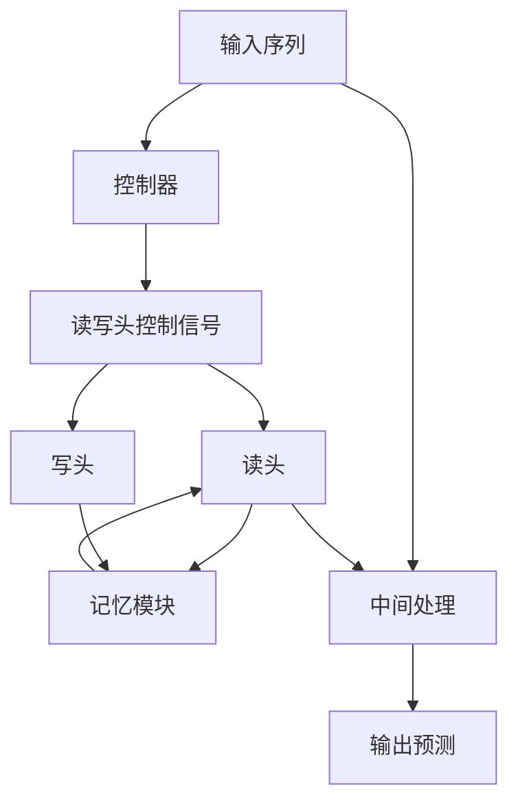

# 基于记忆增强网络的长期依赖推理性能优化技术研究

> 关键词：记忆增强网络、长期依赖、推理性能优化、深度学习、神经网络

> 摘要：本文围绕基于记忆增强网络的长期依赖推理性能优化技术展开深入研究。首先介绍了该研究的背景、目的和预期读者等内容，接着阐述了记忆增强网络等核心概念及其联系，详细讲解了核心算法原理和具体操作步骤，给出了相关数学模型和公式并举例说明。通过项目实战展示了代码实现及解读，分析了实际应用场景。同时推荐了学习资源、开发工具框架以及相关论文著作。最后总结了未来发展趋势与挑战，还提供了常见问题解答和扩展阅读参考资料，旨在为该领域的研究和实践提供全面且深入的技术指导。

## 1. 背景介绍 
### 1.1 目的和范围
在深度学习领域，处理序列数据时长期依赖问题一直是一个关键挑战。传统的神经网络在处理长序列时，往往难以捕捉到远距离的依赖关系，导致推理性能下降。记忆增强网络作为一种新兴的技术，为解决长期依赖问题提供了新的思路。本研究的目的在于深入探讨基于记忆增强网络的长期依赖推理性能优化技术，通过理论分析和实验验证，提出有效的优化策略和方法，提高模型在处理长序列数据时的推理性能。研究范围涵盖了记忆增强网络的原理、核心算法、数学模型，以及在实际项目中的应用和性能优化技术。

### 1.2 预期读者
本文预期读者包括对深度学习、神经网络感兴趣的研究人员、工程师和学生。对于从事自然语言处理、语音识别、时间序列分析等领域的专业人士，本文提供的技术和方法可以帮助他们更好地处理长期依赖问题，提高模型性能。同时，对于初学者来说，本文也可以作为了解记忆增强网络和长期依赖问题的入门资料。

### 1.3 文档结构概述
本文将按照以下结构进行组织：首先介绍相关背景知识，包括目的、预期读者和文档结构概述等内容；接着详细阐述核心概念与联系，包括记忆增强网络的原理和架构；然后讲解核心算法原理和具体操作步骤，并给出相关的 Python 源代码；再介绍数学模型和公式，并举例说明；通过项目实战展示代码实现和详细解释；分析实际应用场景；推荐学习资源、开发工具框架和相关论文著作；最后总结未来发展趋势与挑战，提供常见问题解答和扩展阅读参考资料。

### 1.4 术语表
#### 1.4.1 核心术语定义
- **记忆增强网络（Memory Augmented Neural Network，MANN）**：一种结合了神经网络和外部记忆模块的模型，通过对记忆模块的读写操作来增强网络的记忆能力，从而更好地处理长期依赖问题。
- **长期依赖（Long-Term Dependency）**：在序列数据中，远距离的元素之间存在的依赖关系。例如，在自然语言处理中，一个句子开头的单词可能会对后面较远位置的单词产生影响。
- **推理性能（Inference Performance）**：模型在进行推理时的性能指标，包括准确率、速度、效率等方面。

#### 1.4.2 相关概念解释
- **外部记忆模块（External Memory Module）**：记忆增强网络中的一个重要组成部分，用于存储和管理信息。它可以是一个矩阵或张量，通过读写操作与神经网络进行交互。
- **读写操作（Read and Write Operations）**：对外部记忆模块进行的操作。读操作从记忆模块中获取信息，写操作将信息存储到记忆模块中。

#### 1.4.3 缩略词列表
- **MANN**：Memory Augmented Neural Network（记忆增强网络）
- **RNN**：Recurrent Neural Network（循环神经网络）
- **LSTM**：Long Short-Term Memory（长短期记忆网络）

## 2. 核心概念与联系 

### 2.1 记忆增强网络的原理
记忆增强网络的核心思想是在传统神经网络的基础上引入外部记忆模块，通过对记忆模块的读写操作来增强网络的记忆能力。传统的神经网络，如循环神经网络（RNN）和长短期记忆网络（LSTM），虽然在一定程度上能够处理序列数据，但在处理长序列时仍然存在局限性。记忆增强网络通过外部记忆模块可以存储更多的信息，并且可以根据需要灵活地访问和更新这些信息，从而更好地捕捉长期依赖关系。

### 2.2 记忆增强网络的架构
记忆增强网络主要由三部分组成：控制器（Controller）、外部记忆模块（External Memory Module）和读写头（Read and Write Heads）。

- **控制器**：通常是一个神经网络，如多层感知机（MLP）或循环神经网络（RNN）。它接收输入序列，并根据输入生成读写头的控制信号，以及对输入进行处理和预测。
- **外部记忆模块**：是一个矩阵或张量，用于存储信息。它的大小和结构可以根据具体任务进行调整。
- **读写头**：包括读头和写头。读头从外部记忆模块中读取信息，写头将信息写入外部记忆模块。读写头的操作由控制器生成的控制信号控制。

下面是记忆增强网络架构的文本示意图：

```plaintext
输入序列 --> 控制器 --> 读写头控制信号
读写头控制信号 --> 读头 --> 从记忆模块读取信息
读写头控制信号 --> 写头 --> 将信息写入记忆模块
记忆模块信息 + 输入序列 --> 控制器 --> 输出预测
```

### 2.3 Mermaid 流程图


## 3. 核心算法原理 & 具体操作步骤 

### 3.1 核心算法原理
记忆增强网络的核心算法主要包括读操作、写操作和控制器的更新。

- **读操作**：读头根据控制器生成的控制信号从记忆模块中读取信息。读操作通常使用注意力机制，通过计算读头的查询向量与记忆模块中每个位置的相似度，得到一个注意力分布，然后根据注意力分布对记忆模块中的信息进行加权求和，得到读取的信息。

- **写操作**：写头根据控制器生成的控制信号将信息写入记忆模块。写操作通常包括擦除和写入两个步骤。擦除操作根据擦除向量对记忆模块中的信息进行部分擦除，写入操作将新的信息写入擦除后的记忆模块。

- **控制器的更新**：控制器根据输入序列和从记忆模块中读取的信息进行更新，通过反向传播算法调整控制器的参数，使得模型的输出预测更加准确。

### 3.2 具体操作步骤

下面是使用 Python 和 PyTorch 实现的记忆增强网络的具体操作步骤和源代码：

```python
import torch
import torch.nn as nn
import torch.nn.functional as F

# 定义记忆模块
class MemoryModule(nn.Module):
    def __init__(self, memory_size, memory_dim):
        super(MemoryModule, self).__init__()
        self.memory = nn.Parameter(torch.randn(memory_size, memory_dim))

    def read(self, query, key_strength):
        # 计算注意力分布
        similarities = F.cosine_similarity(query.unsqueeze(1), self.memory, dim=2)
        attention = F.softmax(key_strength * similarities, dim=1)
        # 读取信息
        read_info = torch.sum(attention.unsqueeze(2) * self.memory, dim=1)
        return read_info

    def write(self, erase_vector, add_vector):
        # 擦除操作
        self.memory = self.memory * (1 - erase_vector.unsqueeze(1))
        # 写入操作
        self.memory = self.memory + add_vector.unsqueeze(1)

# 定义控制器
class Controller(nn.Module):
    def __init__(self, input_dim, hidden_dim, output_dim, memory_dim):
        super(Controller, self).__init__()
        self.fc1 = nn.Linear(input_dim + memory_dim, hidden_dim)
        self.fc2 = nn.Linear(hidden_dim, output_dim)
        self.fc_read_key = nn.Linear(hidden_dim, memory_dim)
        self.fc_read_strength = nn.Linear(hidden_dim, 1)
        self.fc_erase = nn.Linear(hidden_dim, memory_dim)
        self.fc_add = nn.Linear(hidden_dim, memory_dim)

    def forward(self, input, read_info):
        # 合并输入和读取的信息
        combined_input = torch.cat((input, read_info), dim=1)
        # 前向传播
        hidden = F.relu(self.fc1(combined_input))
        output = self.fc2(hidden)
        # 生成读写头的控制信号
        read_key = self.fc_read_key(hidden)
        read_strength = F.softplus(self.fc_read_strength(hidden))
        erase_vector = torch.sigmoid(self.fc_erase(hidden))
        add_vector = self.fc_add(hidden)
        return output, read_key, read_strength, erase_vector, add_vector

# 定义记忆增强网络
class MemoryAugmentedNetwork(nn.Module):
    def __init__(self, input_dim, hidden_dim, output_dim, memory_size, memory_dim):
        super(MemoryAugmentedNetwork, self).__init__()
        self.memory_module = MemoryModule(memory_size, memory_dim)
        self.controller = Controller(input_dim, hidden_dim, output_dim, memory_dim)

    def forward(self, input):
        # 初始化读取信息
        read_info = torch.zeros(input.size(0), self.memory_module.memory.size(1)).to(input.device)
        # 前向传播
        output, read_key, read_strength, erase_vector, add_vector = self.controller(input, read_info)
        # 读操作
        read_info = self.memory_module.read(read_key, read_strength)
        # 写操作
        self.memory_module.write(erase_vector, add_vector)
        return output
```

### 3.3 代码解释
- **MemoryModule 类**：实现了记忆模块的读和写操作。`read` 方法根据查询向量和键强度计算注意力分布，并从记忆模块中读取信息。`write` 方法根据擦除向量和添加向量对记忆模块进行擦除和写入操作。
- **Controller 类**：实现了控制器的前向传播。它接收输入和读取的信息，通过全连接层生成输出预测和读写头的控制信号。
- **MemoryAugmentedNetwork 类**：将记忆模块和控制器组合在一起，实现了记忆增强网络的前向传播。它首先初始化读取信息，然后通过控制器生成输出和控制信号，接着进行读操作和写操作。

## 4. 数学模型和公式 & 详细讲解 & 举例说明 

### 4.1 读操作的数学模型和公式
读操作的核心是计算注意力分布，然后根据注意力分布对记忆模块中的信息进行加权求和。

设记忆模块为 $M \in \mathbb{R}^{N \times D}$，其中 $N$ 是记忆模块的大小，$D$ 是记忆向量的维度。读头的查询向量为 $q \in \mathbb{R}^{D}$，键强度为 $\beta \in \mathbb{R}$。

注意力分布 $w \in \mathbb{R}^{N}$ 的计算公式为：

$$w_i = \frac{\exp(\beta \cdot \text{cosine}(q, M_i))}{\sum_{j=1}^{N} \exp(\beta \cdot \text{cosine}(q, M_j))}$$

其中 $\text{cosine}(q, M_i)$ 是查询向量 $q$ 与记忆模块中第 $i$ 个位置的记忆向量 $M_i$ 的余弦相似度。

读取的信息 $r \in \mathbb{R}^{D}$ 的计算公式为：

$$r = \sum_{i=1}^{N} w_i \cdot M_i$$

### 4.2 写操作的数学模型和公式
写操作包括擦除和写入两个步骤。设擦除向量为 $e \in \mathbb{R}^{D}$，添加向量为 $a \in \mathbb{R}^{D}$。

擦除操作的计算公式为：

$$M_i' = M_i \cdot (1 - e)$$

写入操作的计算公式为：

$$M_i'' = M_i' + a$$

### 4.3 举例说明
假设记忆模块 $M$ 为：

$$M = \begin{bmatrix}
1 & 2 \\
3 & 4 \\
5 & 6
\end{bmatrix}$$

查询向量 $q = \begin{bmatrix} 1 & 1 \end{bmatrix}$，键强度 $\beta = 1$。

首先计算余弦相似度：

$$\text{cosine}(q, M_1) = \frac{1 \times 1 + 1 \times 2}{\sqrt{1^2 + 1^2} \cdot \sqrt{1^2 + 2^2}} = \frac{3}{\sqrt{2} \cdot \sqrt{5}} \approx 0.9487$$

$$\text{cosine}(q, M_2) = \frac{1 \times 3 + 1 \times 4}{\sqrt{1^2 + 1^2} \cdot \sqrt{3^2 + 4^2}} = \frac{7}{\sqrt{2} \cdot \sqrt{25}} \approx 0.9899$$

$$\text{cosine}(q, M_3) = \frac{1 \times 5 + 1 \times 6}{\sqrt{1^2 + 1^2} \cdot \sqrt{5^2 + 6^2}} = \frac{11}{\sqrt{2} \cdot \sqrt{61}} \approx 0.9972$$

然后计算注意力分布：

$$w_1 = \frac{\exp(1 \times 0.9487)}{\exp(1 \times 0.9487) + \exp(1 \times 0.9899) + \exp(1 \times 0.9972)} \approx 0.29$$

$$w_2 = \frac{\exp(1 \times 0.9899)}{\exp(1 \times 0.9487) + \exp(1 \times 0.9899) + \exp(1 \times 0.9972)} \approx 0.33$$

$$w_3 = \frac{\exp(1 \times 0.9972)}{\exp(1 \times 0.9487) + \exp(1 \times 0.9899) + \exp(1 \times 0.9972)} \approx 0.38$$

最后计算读取的信息：

$$r = 0.29 \times \begin{bmatrix} 1 & 2 \end{bmatrix} + 0.33 \times \begin{bmatrix} 3 & 4 \end{bmatrix} + 0.38 \times \begin{bmatrix} 5 & 6 \end{bmatrix} = \begin{bmatrix} 3.36 & 4.36 \end{bmatrix}$$

## 5. 项目实战：代码实际案例和详细解释说明 

### 5.1  开发环境搭建
在进行项目实战之前，需要搭建开发环境。以下是搭建开发环境的步骤：

1. **安装 Python**：建议安装 Python 3.7 或以上版本。
2. **安装 PyTorch**：根据自己的显卡情况选择合适的 PyTorch 版本。可以使用以下命令安装：

```bash
pip install torch torchvision
```

3. **安装其他依赖库**：根据项目需要安装其他依赖库，如 numpy、matplotlib 等。

```bash
pip install numpy matplotlib
```

### 5.2  源代码详细实现和代码解读
下面是一个使用记忆增强网络进行序列预测的实际案例：

```python
import torch
import torch.nn as nn
import torch.optim as optim
import numpy as np
import matplotlib.pyplot as plt

# 定义记忆模块
class MemoryModule(nn.Module):
    def __init__(self, memory_size, memory_dim):
        super(MemoryModule, self).__init__()
        self.memory = nn.Parameter(torch.randn(memory_size, memory_dim))

    def read(self, query, key_strength):
        similarities = F.cosine_similarity(query.unsqueeze(1), self.memory, dim=2)
        attention = F.softmax(key_strength * similarities, dim=1)
        read_info = torch.sum(attention.unsqueeze(2) * self.memory, dim=1)
        return read_info

    def write(self, erase_vector, add_vector):
        self.memory = self.memory * (1 - erase_vector.unsqueeze(1))
        self.memory = self.memory + add_vector.unsqueeze(1)

# 定义控制器
class Controller(nn.Module):
    def __init__(self, input_dim, hidden_dim, output_dim, memory_dim):
        super(Controller, self).__init__()
        self.fc1 = nn.Linear(input_dim + memory_dim, hidden_dim)
        self.fc2 = nn.Linear(hidden_dim, output_dim)
        self.fc_read_key = nn.Linear(hidden_dim, memory_dim)
        self.fc_read_strength = nn.Linear(hidden_dim, 1)
        self.fc_erase = nn.Linear(hidden_dim, memory_dim)
        self.fc_add = nn.Linear(hidden_dim, memory_dim)

    def forward(self, input, read_info):
        combined_input = torch.cat((input, read_info), dim=1)
        hidden = F.relu(self.fc1(combined_input))
        output = self.fc2(hidden)
        read_key = self.fc_read_key(hidden)
        read_strength = F.softplus(self.fc_read_strength(hidden))
        erase_vector = torch.sigmoid(self.fc_erase(hidden))
        add_vector = self.fc_add(hidden)
        return output, read_key, read_strength, erase_vector, add_vector

# 定义记忆增强网络
class MemoryAugmentedNetwork(nn.Module):
    def __init__(self, input_dim, hidden_dim, output_dim, memory_size, memory_dim):
        super(MemoryAugmentedNetwork, self).__init__()
        self.memory_module = MemoryModule(memory_size, memory_dim)
        self.controller = Controller(input_dim, hidden_dim, output_dim, memory_dim)

    def forward(self, input):
        read_info = torch.zeros(input.size(0), self.memory_module.memory.size(1)).to(input.device)
        output, read_key, read_strength, erase_vector, add_vector = self.controller(input, read_info)
        read_info = self.memory_module.read(read_key, read_strength)
        self.memory_module.write(erase_vector, add_vector)
        return output

# 生成数据集
def generate_data(num_samples, seq_length):
    data = np.random.randint(0, 2, size=(num_samples, seq_length))
    labels = np.sum(data, axis=1) % 2
    return data.astype(np.float32), labels.astype(np.float32)

# 训练模型
def train_model(model, num_epochs, batch_size, learning_rate):
    criterion = nn.BCEWithLogitsLoss()
    optimizer = optim.Adam(model.parameters(), lr=learning_rate)

    train_data, train_labels = generate_data(1000, 20)
    train_data = torch.from_numpy(train_data)
    train_labels = torch.from_numpy(train_labels).unsqueeze(1)

    losses = []
    for epoch in range(num_epochs):
        for i in range(0, len(train_data), batch_size):
            batch_data = train_data[i:i+batch_size]
            batch_labels = train_labels[i:i+batch_size]

            optimizer.zero_grad()
            outputs = model(batch_data)
            loss = criterion(outputs, batch_labels)
            loss.backward()
            optimizer.step()

        losses.append(loss.item())
        print(f'Epoch {epoch+1}/{num_epochs}, Loss: {loss.item()}')

    plt.plot(losses)
    plt.xlabel('Epoch')
    plt.ylabel('Loss')
    plt.show()

# 初始化模型并训练
input_dim = 1
hidden_dim = 10
output_dim = 1
memory_size = 5
memory_dim = 5

model = MemoryAugmentedNetwork(input_dim, hidden_dim, output_dim, memory_size, memory_dim)
train_model(model, num_epochs=100, batch_size=32, learning_rate=0.001)
```

### 5.3  代码解读与分析
- **数据集生成**：`generate_data` 函数生成了一个简单的序列数据集，每个序列由 0 和 1 组成，标签是序列中所有元素的和对 2 取余的结果。
- **模型训练**：`train_model` 函数使用二元交叉熵损失函数和 Adam 优化器对模型进行训练。在每个 epoch 中，将数据集分成多个批次进行训练，并记录每个 epoch 的损失值。
- **模型评估**：通过绘制损失曲线可以直观地观察模型的训练过程。如果损失曲线逐渐下降并趋于稳定，说明模型在不断学习和优化。

## 6. 实际应用场景 
### 6.1 自然语言处理
在自然语言处理中，记忆增强网络可以用于处理长文本的理解和生成任务。例如，在机器翻译中，源语言句子中的远距离依赖关系对翻译结果有重要影响。记忆增强网络可以通过外部记忆模块存储和管理源语言句子中的信息，从而更好地捕捉这些长期依赖关系，提高翻译的准确性。

### 6.2 语音识别
在语音识别中，语音信号是一个长序列数据，不同时间步的语音特征之间存在长期依赖关系。记忆增强网络可以用于处理这些长期依赖关系，提高语音识别的准确率。例如，在连续语音识别中，记忆增强网络可以根据之前的语音信息更好地预测当前的语音内容。

### 6.3 时间序列分析
在时间序列分析中，如股票价格预测、气象预报等，时间序列数据中的长期依赖关系对预测结果有重要影响。记忆增强网络可以用于捕捉这些长期依赖关系，提高预测的准确性。例如，在股票价格预测中，记忆增强网络可以根据历史股票价格信息和其他相关信息，更好地预测未来的股票价格走势。

## 7. 工具和资源推荐
### 7.1 学习资源推荐
#### 7.1.1 书籍推荐
- 《深度学习》（Deep Learning）：由 Ian Goodfellow、Yoshua Bengio 和 Aaron Courville 所著，是深度学习领域的经典教材，涵盖了深度学习的基本原理、算法和应用。
- 《神经网络与深度学习》（Neural Networks and Deep Learning）：由 Michael Nielsen 所著，以通俗易懂的方式介绍了神经网络和深度学习的基本概念和算法。

#### 7.1.2 在线课程
- Coursera 上的《深度学习专项课程》（Deep Learning Specialization）：由 Andrew Ng 教授授课，包括深度学习的基础、卷积神经网络、循环神经网络等内容。
- edX 上的《人工智能导论》（Introduction to Artificial Intelligence）：介绍了人工智能的基本概念、算法和应用，包括深度学习的相关内容。

#### 7.1.3 技术博客和网站
- Medium 上的 Towards Data Science：是一个专注于数据科学和机器学习的技术博客，有很多关于深度学习和记忆增强网络的文章。
- arXiv.org：是一个预印本服务器，提供了大量关于深度学习和人工智能的最新研究成果。

### 7.2 开发工具框架推荐
#### 7.2.1 IDE和编辑器
- PyCharm：是一个专门为 Python 开发设计的集成开发环境，提供了丰富的功能和插件，方便进行深度学习项目的开发和调试。
- Jupyter Notebook：是一个交互式的开发环境，适合进行数据分析和模型实验。

#### 7.2.2 调试和性能分析工具
- TensorBoard：是 TensorFlow 提供的一个可视化工具，可以用于可视化模型的训练过程、损失曲线、准确率等指标。
- PyTorch Profiler：是 PyTorch 提供的一个性能分析工具，可以用于分析模型的性能瓶颈和内存使用情况。

#### 7.2.3 相关框架和库
- PyTorch：是一个开源的深度学习框架，提供了丰富的神经网络层和优化算法，方便进行深度学习模型的开发和训练。
- TensorFlow：是另一个广泛使用的开源深度学习框架，提供了高效的分布式训练和部署功能。

### 7.3 相关论文著作推荐
#### 7.3.1 经典论文
- "Memory Networks"（2014）：由 Jason Weston 等人发表，首次提出了记忆网络的概念，为记忆增强网络的发展奠定了基础。
- "Neural Turing Machines"（2014）：由 Alex Graves 等人发表，提出了神经图灵机的概念，是记忆增强网络的一个重要分支。

#### 7.3.2 最新研究成果
- 可以在 arXiv.org 上搜索关于记忆增强网络的最新研究论文，了解该领域的最新发展动态。

#### 7.3.3 应用案例分析
- 可以在学术数据库和会议论文集中搜索关于记忆增强网络在自然语言处理、语音识别、时间序列分析等领域的应用案例，学习和借鉴他人的经验。

## 8. 总结：未来发展趋势与挑战
### 8.1 未来发展趋势
- **模型结构的创新**：未来可能会出现更多新颖的记忆增强网络模型结构，以更好地处理长期依赖问题和提高推理性能。例如，结合注意力机制、图神经网络等技术，进一步增强模型的表达能力。
- **应用领域的拓展**：记忆增强网络将在更多领域得到应用，如医疗保健、自动驾驶、金融等。通过处理这些领域中的长序列数据，提高决策的准确性和效率。
- **与其他技术的融合**：记忆增强网络将与其他技术，如强化学习、迁移学习等相结合，实现更复杂的任务和更智能的系统。

### 8.2 挑战
- **计算资源的需求**：记忆增强网络通常需要大量的计算资源和内存，这限制了其在一些资源受限的设备上的应用。未来需要研究更高效的算法和模型结构，以降低计算资源的需求。
- **可解释性问题**：记忆增强网络是一种黑盒模型，其决策过程和内部机制难以解释。在一些对可解释性要求较高的领域，如医疗和金融，这是一个亟待解决的问题。
- **数据隐私和安全**：记忆增强网络需要处理大量的数据，这些数据可能包含敏感信息。如何保护数据的隐私和安全是一个重要的挑战。

## 9. 附录：常见问题与解答
### 9.1 记忆增强网络与传统神经网络有什么区别？
记忆增强网络在传统神经网络的基础上引入了外部记忆模块，通过对记忆模块的读写操作来增强网络的记忆能力，从而更好地处理长期依赖问题。传统神经网络，如 RNN 和 LSTM，虽然在一定程度上能够处理序列数据，但在处理长序列时仍然存在局限性。

### 9.2 如何选择记忆模块的大小和维度？
记忆模块的大小和维度需要根据具体任务进行调整。一般来说，记忆模块的大小越大，存储的信息就越多，但计算复杂度也会相应增加。记忆模块的维度需要根据输入数据的特征和模型的需求进行选择。

### 9.3 记忆增强网络的训练过程中可能会遇到哪些问题？
记忆增强网络的训练过程中可能会遇到梯度消失、梯度爆炸、过拟合等问题。可以通过使用合适的优化算法、正则化方法和调整模型参数等方式来解决这些问题。

## 10. 扩展阅读 & 参考资料
- Goodfellow, I., Bengio, Y., & Courville, A. (2016). Deep Learning. MIT Press.
- Nielsen, M. A. (2015). Neural Networks and Deep Learning. Determination Press.
- Weston, J., Chopra, S., & Bordes, A. (2014). Memory Networks. arXiv preprint arXiv:1410.3916.
- Graves, A., Wayne, G., & Danihelka, I. (2014). Neural Turing Machines. arXiv preprint arXiv:1410.5401.
- 相关的学术论文和技术博客文章，可以通过 Google Scholar、arXiv.org、Medium 等渠道进行搜索。