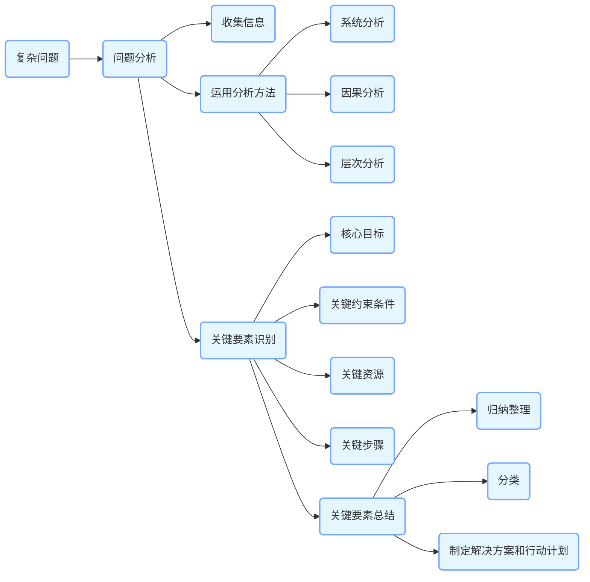

# 复杂问题解题过程中关键要素的识别与总结

> 关键词：复杂问题、关键要素、识别、总结、解题过程、问题分析、解决方案

> 摘要：本文聚焦于复杂问题解题过程中关键要素的识别与总结。首先介绍了相关背景信息，包括目的范围、预期读者等内容。接着阐述了核心概念及它们之间的联系，通过文本示意图和 Mermaid 流程图进行直观展示。详细讲解了核心算法原理，并结合 Python 源代码给出具体操作步骤。同时给出了相关数学模型和公式，且举例说明。通过项目实战，展示代码实际案例并进行详细解释。分析了实际应用场景，推荐了学习资源、开发工具框架以及相关论文著作。最后总结未来发展趋势与挑战，提供常见问题解答和扩展阅读参考资料，旨在帮助读者系统地掌握复杂问题解题过程中关键要素的识别与总结方法，提升解决复杂问题的能力。

## 1. 背景介绍 
### 1.1 目的和范围
在当今的科技、商业、社会等各个领域，我们面临着越来越多的复杂问题。这些问题往往具有高度的不确定性、多因素相互影响以及动态变化等特点。准确识别和总结复杂问题解题过程中的关键要素，对于高效、有效地解决问题至关重要。本文的目的在于深入探讨如何识别和总结这些关键要素，为解决复杂问题提供一套科学、系统的方法和思路。范围涵盖了各种类型的复杂问题，包括但不限于技术难题、管理决策、社会矛盾等，并适用于不同行业和领域。

### 1.2 预期读者
本文预期读者包括但不限于专业技术人员，如程序员、工程师等，他们在日常工作中经常需要解决复杂的技术问题；企业管理人员，需要处理战略决策、资源分配等复杂管理问题；科研人员，在学术研究中遇到各种复杂的理论和实践问题；以及对解决复杂问题有兴趣的普通读者，希望通过学习相关方法提升自己解决问题的能力。

### 1.3 文档结构概述
本文将按照以下结构进行阐述：首先介绍背景信息，包括目的范围、预期读者等；接着阐述核心概念及它们之间的联系，通过文本示意图和 Mermaid 流程图进行直观展示；详细讲解核心算法原理，并结合 Python 源代码给出具体操作步骤；同时给出相关数学模型和公式，且举例说明；通过项目实战，展示代码实际案例并进行详细解释；分析实际应用场景，推荐学习资源、开发工具框架以及相关论文著作；最后总结未来发展趋势与挑战，提供常见问题解答和扩展阅读参考资料。

### 1.4 术语表
#### 1.4.1 核心术语定义
- **复杂问题**：指具有高度不确定性、多因素相互作用、动态变化且难以用简单方法解决的问题。
- **关键要素**：在解决复杂问题过程中，对问题的解决起到关键作用的因素，包括但不限于问题的关键变量、关键步骤、关键资源等。
- **识别**：指从复杂的问题情境中找出关键要素的过程。
- **总结**：指对识别出的关键要素进行归纳、整理和提炼，形成具有指导意义的结论和方法的过程。

#### 1.4.2 相关概念解释
- **问题分析**：对复杂问题进行全面、深入的研究和理解，包括问题的背景、现状、影响因素等，为识别关键要素提供基础。
- **解决方案**：针对复杂问题提出的具体解决办法和措施，关键要素的识别和总结有助于制定更有效的解决方案。

#### 1.4.3 缩略词列表
- **AI**：Artificial Intelligence，人工智能
- **ML**：Machine Learning，机器学习
- **NLP**：Natural Language Processing，自然语言处理

## 2. 核心概念与联系 
### 核心概念原理
复杂问题的解决是一个系统性的过程，关键要素的识别与总结贯穿其中。首先，我们需要对复杂问题进行全面的分析，这涉及到收集和整理与问题相关的各种信息，包括问题的背景、现状、相关数据等。在这个过程中，我们要运用各种分析方法，如系统分析、因果分析、层次分析等，以找出问题的关键变量和影响因素。

识别关键要素是解决复杂问题的重要步骤。关键要素可能包括问题的核心目标、关键约束条件、关键资源、关键步骤等。这些要素相互关联，共同影响着问题的解决。例如，在一个软件开发项目中，关键要素可能包括项目的需求规格、技术架构、开发团队的能力和资源等。

总结关键要素则是对识别出的要素进行归纳和整理，形成具有指导意义的结论和方法。通过总结，我们可以发现问题的本质规律，找到解决问题的有效途径。例如，我们可以将关键要素按照重要性、关联性等进行分类，制定相应的解决方案和行动计划。

### 文本示意图
```plaintext
复杂问题解决过程
|-- 问题分析
|   |-- 收集信息
|   |-- 运用分析方法
|       |-- 系统分析
|       |-- 因果分析
|       |-- 层次分析
|-- 关键要素识别
|   |-- 核心目标
|   |-- 关键约束条件
|   |-- 关键资源
|   |-- 关键步骤
|-- 关键要素总结
|   |-- 归纳整理
|   |-- 分类
|   |-- 制定解决方案和行动计划
```

### Mermaid 流程图


## 3. 核心算法原理 & 具体操作步骤 
### 核心算法原理
在识别复杂问题的关键要素时，我们可以采用启发式搜索算法的思想。启发式搜索是一种在搜索过程中利用启发信息来引导搜索方向的算法，它可以帮助我们更快地找到问题的关键要素。

具体来说，我们可以将复杂问题看作一个搜索空间，其中每个可能的要素都是搜索空间中的一个节点。我们通过定义一个启发函数来评估每个节点的重要性，启发函数可以根据问题的特点和领域知识来设计。例如，在一个项目管理问题中，启发函数可以考虑要素对项目进度、成本、质量等方面的影响。

在搜索过程中，我们从初始状态开始，根据启发函数的评估结果选择最有希望的节点进行扩展，直到找到关键要素或达到搜索终止条件。

### 具体操作步骤
以下是使用 Python 实现启发式搜索算法来识别复杂问题关键要素的具体步骤和代码示例：

```python
# 定义问题的节点类
class Node:
    def __init__(self, element, heuristic_value):
        self.element = element
        self.heuristic_value = heuristic_value

    def __lt__(self, other):
        return self.heuristic_value < other.heuristic_value

# 定义启发式搜索函数
def heuristic_search(initial_state, heuristic_function, termination_condition):
    open_list = [Node(initial_state, heuristic_function(initial_state))]
    closed_list = set()

    while open_list:
        current_node = min(open_list)
        open_list.remove(current_node)

        if termination_condition(current_node.element):
            return current_node.element

        closed_list.add(current_node.element)

        # 扩展当前节点
        for neighbor in get_neighbors(current_node.element):
            if neighbor not in closed_list:
                heuristic_value = heuristic_function(neighbor)
                new_node = Node(neighbor, heuristic_value)
                open_list.append(new_node)

    return None

# 定义获取邻居节点的函数（示例）
def get_neighbors(element):
    # 这里需要根据具体问题实现获取邻居节点的逻辑
    # 示例：简单地返回元素的一些可能变化
    neighbors = []
    # 假设元素是一个列表
    for i in range(len(element)):
        new_element = element.copy()
        new_element[i] += 1
        neighbors.append(new_element)
    return neighbors

# 定义启发式函数（示例）
def heuristic_function(element):
    # 这里需要根据具体问题实现启发式函数的逻辑
    # 示例：简单地计算元素的和
    return sum(element)

# 定义终止条件（示例）
def termination_condition(element):
    # 这里需要根据具体问题实现终止条件的逻辑
    # 示例：当元素的和大于 10 时终止
    return sum(element) > 10

# 示例使用
initial_state = [1, 1, 1]
result = heuristic_search(initial_state, heuristic_function, termination_condition)
print("找到的关键要素：", result)
```

### 代码解释
1. **Node 类**：用于表示搜索空间中的节点，每个节点包含一个要素和一个启发式值。
2. **heuristic_search 函数**：实现了启发式搜索算法的核心逻辑，包括维护开放列表和关闭列表，选择最有希望的节点进行扩展，直到找到关键要素或达到终止条件。
3. **get_neighbors 函数**：用于获取当前节点的邻居节点，需要根据具体问题进行实现。
4. **heuristic_function 函数**：用于计算节点的启发式值，需要根据具体问题进行实现。
5. **termination_condition 函数**：用于判断是否达到搜索终止条件，需要根据具体问题进行实现。

## 4. 数学模型和公式 & 详细讲解 & 举例说明 
### 数学模型
在复杂问题的解决过程中，我们可以将关键要素的识别和总结看作一个优化问题。设 $X$ 为所有可能的要素集合，$f(x)$ 为评估要素 $x \in X$ 重要性的目标函数，$g_i(x) \leq 0$，$i = 1, 2, \cdots, m$ 为约束条件。我们的目标是在满足约束条件的前提下，找到使目标函数 $f(x)$ 达到最优的要素 $x^*$。

数学模型可以表示为：
$$
\begin{align*}
\max_{x \in X} &\quad f(x) \\
\text{s.t.} &\quad g_i(x) \leq 0, \quad i = 1, 2, \cdots, m
\end{align*}
$$

### 详细讲解
- **目标函数 $f(x)$**：目标函数用于评估每个要素的重要性，它可以根据问题的具体要求进行定义。例如，在一个项目管理问题中，目标函数可以考虑要素对项目进度、成本、质量等方面的综合影响。
- **约束条件 $g_i(x)$**：约束条件表示在识别关键要素时需要满足的限制条件。例如，在资源分配问题中，约束条件可能包括资源的总量限制、时间限制等。

### 举例说明
假设我们要解决一个生产计划问题，目标是最大化生产利润。设 $x_1$ 和 $x_2$ 分别表示两种产品的生产数量，单位利润分别为 $p_1 = 10$ 和 $p_2 = 15$。生产这两种产品需要消耗两种资源，资源 1 的总量为 $R_1 = 100$，资源 2 的总量为 $R_2 = 120$。生产单位产品 1 需要消耗资源 1 的量为 $a_{11} = 2$，消耗资源 2 的量为 $a_{12} = 3$；生产单位产品 2 需要消耗资源 1 的量为 $a_{21} = 4$，消耗资源 2 的量为 $a_{22} = 2$。

则目标函数为：
$$
f(x_1, x_2) = 10x_1 + 15x_2
$$

约束条件为：
$$
\begin{align*}
2x_1 + 4x_2 &\leq 100 \\
3x_1 + 2x_2 &\leq 120 \\
x_1 &\geq 0 \\
x_2 &\geq 0
\end{align*}
$$

我们的目标是在满足约束条件的前提下，找到使目标函数 $f(x_1, x_2)$ 达到最大值的 $x_1^*$ 和 $x_2^*$，这两个值对应的生产计划就是关键要素。

我们可以使用线性规划的方法来求解这个问题，例如使用 Python 的 `scipy.optimize.linprog` 函数：

```python
from scipy.optimize import linprog

# 目标函数的系数（注意：linprog 是求最小值，所以取负）
c = [-10, -15]

# 不等式约束的系数矩阵
A = [[2, 4], [3, 2]]
# 不等式约束的右侧常数
b = [100, 120]

# 变量的边界
x_bounds = (0, None)
y_bounds = (0, None)
bounds = [x_bounds, y_bounds]

# 求解线性规划问题
res = linprog(c, A_ub=A, b_ub=b, bounds=bounds)

print("最优生产计划：", res.x)
print("最大利润：", -res.fun)
```

## 5. 项目实战：代码实际案例和详细解释说明 
### 5.1  开发环境搭建
假设我们要解决一个简单的路径规划问题，即找到从起点到终点的最短路径。我们将使用 Python 语言和 `networkx` 库来实现。

#### 安装 Python
首先，确保你已经安装了 Python 3.x 版本。你可以从 Python 官方网站（https://www.python.org/downloads/） 下载并安装。

#### 安装 `networkx` 库
打开命令行工具，运行以下命令安装 `networkx` 库：
```sh
pip install networkx
```

### 5.2  源代码详细实现和代码解读
```python
import networkx as nx
import matplotlib.pyplot as plt

# 创建一个有向图
G = nx.DiGraph()

# 添加节点
G.add_nodes_from([1, 2, 3, 4, 5])

# 添加边和权重
G.add_edge(1, 2, weight=2)
G.add_edge(1, 3, weight=4)
G.add_edge(2, 3, weight=1)
G.add_edge(2, 4, weight=7)
G.add_edge(3, 4, weight=3)
G.add_edge(3, 5, weight=5)
G.add_edge(4, 5, weight=2)

# 定义起点和终点
start_node = 1
end_node = 5

# 使用 Dijkstra 算法找到最短路径
try:
    shortest_path = nx.dijkstra_path(G, start_node, end_node)
    shortest_path_length = nx.dijkstra_path_length(G, start_node, end_node)
    print("最短路径：", shortest_path)
    print("最短路径长度：", shortest_path_length)
except nx.NetworkXNoPath:
    print("没有从起点到终点的路径。")

# 绘制图
pos = nx.spring_layout(G)
nx.draw_networkx(G, pos)
labels = nx.get_edge_attributes(G, 'weight')
nx.draw_networkx_edge_labels(G, pos, edge_labels=labels)
plt.title("路径规划图")
plt.show()
```

### 5.3  代码解读与分析
1. **创建有向图**：使用 `networkx.DiGraph()` 创建一个有向图对象 `G`。
2. **添加节点和边**：使用 `add_nodes_from` 方法添加节点，使用 `add_edge` 方法添加边并指定权重。
3. **定义起点和终点**：指定起点和终点的节点编号。
4. **使用 Dijkstra 算法找到最短路径**：使用 `nx.dijkstra_path` 函数找到从起点到终点的最短路径，使用 `nx.dijkstra_path_length` 函数计算最短路径的长度。
5. **处理异常情况**：如果没有从起点到终点的路径，捕获 `nx.NetworkXNoPath` 异常并输出相应信息。
6. **绘制图**：使用 `networkx` 和 `matplotlib` 库绘制图，并标注边的权重。

在这个项目中，关键要素包括图的节点、边和权重，以及起点和终点。通过识别这些关键要素，我们可以使用 Dijkstra 算法找到最短路径。

## 6. 实际应用场景 
### 技术领域
在软件开发中，复杂问题如系统性能优化、代码重构等，需要识别关键要素，如性能瓶颈的代码模块、影响系统架构的关键组件等。通过分析这些关键要素，可以制定针对性的解决方案，提高软件的质量和性能。

在人工智能领域，训练复杂的模型如深度学习模型时，关键要素包括数据集的质量和规模、模型的架构、优化算法的选择等。准确识别这些关键要素，可以提高模型的训练效率和性能。

### 商业领域
在企业战略规划中，需要考虑市场趋势、竞争对手、自身资源等关键要素，以制定适合企业发展的战略。例如，在进入新市场时，要识别市场的需求、竞争态势、政策法规等关键要素，降低市场风险。

在项目管理中，关键要素包括项目的目标、进度、成本、质量等。通过对这些关键要素的监控和管理，可以确保项目按时、按质量要求完成。

### 社会领域
在解决社会矛盾和问题时，如环境污染治理、交通拥堵治理等，需要识别关键要素，如污染源、交通流量高峰时段等。通过对这些关键要素的分析和处理，可以制定有效的治理措施。

在教育领域，提高学生的学习效果是一个复杂问题。关键要素包括教学方法、课程设置、学生的学习兴趣和能力等。通过识别和优化这些关键要素，可以提高教育质量。

## 7. 工具和资源推荐
### 7.1 学习资源推荐
#### 7.1.1 书籍推荐
- 《如何解决复杂问题：适应未知的科学》：本书介绍了应对复杂问题的科学方法和策略，帮助读者提高解决复杂问题的能力。
- 《思考，快与慢》：探讨了人类思维的两种模式，对于理解问题分析和决策过程有很大帮助。
- 《系统思考》：介绍了系统思考的方法和工具，有助于从整体上分析和解决复杂问题。

#### 7.1.2 在线课程
- Coursera 平台上的“Problem Solving, Decision Making, and Analytics”课程：讲解了问题解决、决策制定和分析的方法和技巧。
- edX 平台上的“Systems Thinking for Complex Problem Solving”课程：专注于系统思考在解决复杂问题中的应用。

#### 7.1.3 技术博客和网站
- Medium 上有许多关于问题解决和创新思维的博客文章，提供了不同领域的实践经验和见解。
- Hacker News 是一个关注技术和创业的社区，其中有很多关于解决复杂技术问题的讨论和分享。

### 7.2 开发工具框架推荐
#### 7.2.1 IDE和编辑器
- PyCharm：是一款功能强大的 Python 集成开发环境，提供了代码编辑、调试、代码分析等功能，适合开发各种 Python 项目。
- Visual Studio Code：是一个轻量级的代码编辑器，支持多种编程语言，具有丰富的插件生态系统，可以满足不同的开发需求。

#### 7.2.2 调试和性能分析工具
- pdb：是 Python 自带的调试器，可以帮助开发者定位和解决代码中的问题。
- cProfile：是 Python 标准库中的性能分析工具，可以分析代码的运行时间和函数调用情况，帮助优化代码性能。

#### 7.2.3 相关框架和库
- `numpy`：是 Python 中用于科学计算的基础库，提供了高效的数组操作和数学函数。
- `pandas`：是一个用于数据处理和分析的库，提供了数据结构和数据分析工具，方便处理复杂的数据。

### 7.3 相关论文著作推荐
#### 7.3.1 经典论文
- “A Mathematical Theory of Communication”（信息论的经典论文，奠定了信息科学的基础）
- “The Nature of the Firm”（关于企业理论的经典论文，对理解企业的本质和决策有重要意义）

#### 7.3.2 最新研究成果
- 关注顶级学术期刊如《Science》《Nature》《ACM Transactions》等，其中有许多关于复杂问题解决和相关领域的最新研究成果。

#### 7.3.3 应用案例分析
- 可以在 IEEE Xplore、ACM Digital Library 等数据库中查找相关的应用案例分析论文，了解不同领域复杂问题的解决方法和实践经验。

## 8. 总结：未来发展趋势与挑战
### 未来发展趋势
- **智能化**：随着人工智能技术的不断发展，将有更多的智能工具和算法用于复杂问题的解决。例如，基于机器学习和深度学习的算法可以自动识别和分析复杂问题中的关键要素，提供更智能的解决方案。
- **跨学科融合**：复杂问题往往涉及多个学科领域，未来的解决方法将更加注重跨学科的融合。例如，结合生物学、物理学、计算机科学等多学科知识，解决复杂的生态、能源等问题。
- **大数据驱动**：大数据的发展为复杂问题的解决提供了丰富的数据资源。通过对大数据的分析和挖掘，可以更准确地识别关键要素，制定更有效的解决方案。

### 挑战
- **数据质量和隐私问题**：在大数据驱动的背景下，数据质量和隐私问题是需要解决的重要挑战。低质量的数据可能导致错误的分析结果，而隐私问题则涉及到用户的权益和安全。
- **算法的可解释性**：一些复杂的人工智能算法，如深度学习算法，往往具有较高的复杂度和黑盒性，其决策过程难以解释。在解决复杂问题时，需要提高算法的可解释性，以便用户理解和信任。
- **人类思维的局限性**：人类在解决复杂问题时，往往受到自身思维模式和认知能力的限制。如何突破这些局限性，提高人类解决复杂问题的能力，是一个长期的挑战。

## 9. 附录：常见问题与解答
### 如何判断一个问题是否复杂？
复杂问题通常具有以下特点：高度的不确定性、多因素相互作用、动态变化、难以用简单方法解决等。如果一个问题涉及多个领域的知识，有多个变量和影响因素，并且解决方案不明确，那么它很可能是一个复杂问题。

### 如何提高识别关键要素的能力？
可以通过学习相关的分析方法和工具，如系统分析、因果分析、层次分析等，提高问题分析的能力。同时，积累不同领域的知识和经验，了解问题的背景和特点，有助于更准确地识别关键要素。此外，多参与实际问题的解决，不断实践和总结，也可以提高识别关键要素的能力。

### 关键要素识别和总结后，如何制定有效的解决方案？
根据识别和总结出的关键要素，结合问题的目标和约束条件，制定相应的解决方案。可以采用头脑风暴、SWOT 分析等方法，提出多种可能的解决方案，然后对这些方案进行评估和筛选，选择最优的方案。在实施解决方案的过程中，要不断监控和调整，确保方案的有效性。

## 10. 扩展阅读 & 参考资料
### 扩展阅读
- 《创新算法：TRIZ 系统创新理论》：介绍了 TRIZ 理论，这是一种解决发明创造问题的有效方法，对于解决复杂问题有一定的启示作用。
- 《第五项修炼：学习型组织的艺术与实践》：强调了系统思考和团队学习在解决复杂问题中的重要性。

### 参考资料
- 相关学术期刊和会议论文
- 技术书籍和教材
- 在线技术文档和教程
- 行业报告和研究资料