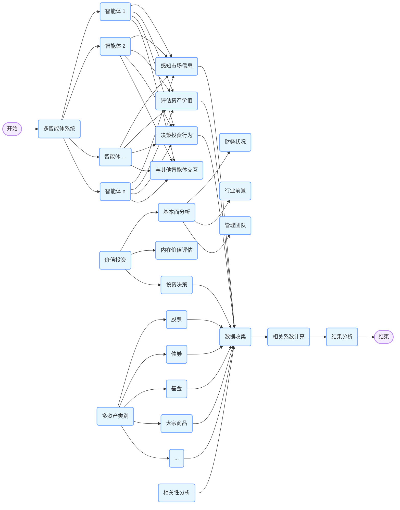

# 多智能体优化价值投资的多资产类别相关性分析

> 关键词：多智能体系统、价值投资、多资产类别、相关性分析、优化策略

> 摘要：本文聚焦于多智能体优化价值投资中的多资产类别相关性分析。首先介绍了研究的背景、目的和范围，明确预期读者与文档结构。接着阐述多智能体系统、价值投资、多资产类别等核心概念及其联系，给出原理和架构的文本示意图与 Mermaid 流程图。详细讲解核心算法原理，通过 Python 源代码说明具体操作步骤。深入探讨相关数学模型和公式，并举例说明。以项目实战展示代码实际案例及详细解释。分析多智能体优化价值投资在不同场景中的实际应用。推荐学习资源、开发工具框架以及相关论文著作。最后总结未来发展趋势与挑战，提供常见问题解答和扩展阅读参考资料，旨在为投资者和研究人员提供全面的多资产类别相关性分析思路与方法。

## 1. 背景介绍 
### 1.1 目的和范围
在当今复杂多变的金融市场中，投资者面临着如何在不同资产类别中进行合理配置以实现价值最大化的挑战。多智能体系统作为一种新兴的计算智能方法，为价值投资提供了新的视角和优化手段。本研究的目的在于通过多智能体系统对多资产类别进行相关性分析，挖掘资产之间的潜在关系，从而优化价值投资策略，提高投资组合的收益和降低风险。

研究范围涵盖了常见的多资产类别，如股票、债券、基金、大宗商品等，同时考虑不同市场环境下的资产相关性变化。通过建立多智能体模型，模拟智能体之间的交互和决策过程，分析资产类别之间的动态相关性，为投资者提供更科学、有效的投资决策依据。

### 1.2 预期读者
本文预期读者包括金融投资者、投资顾问、金融分析师、计算机科学领域的研究人员以及对多智能体系统和价值投资感兴趣的学者。对于投资者，本文将提供实用的多资产类别相关性分析方法和投资优化策略；对于研究人员，有助于深入了解多智能体系统在金融领域的应用和相关理论研究。

### 1.3 文档结构概述
本文将按照以下结构进行阐述：首先介绍多智能体优化价值投资的多资产类别相关性分析的背景信息，包括目的、预期读者和文档结构概述等。接着详细讲解核心概念及其联系，给出原理和架构的文本示意图和 Mermaid 流程图。然后阐述核心算法原理和具体操作步骤，通过 Python 源代码进行详细说明。之后介绍相关的数学模型和公式，并举例说明。通过项目实战展示代码实际案例和详细解释。分析多智能体优化价值投资的实际应用场景。推荐学习资源、开发工具框架以及相关论文著作。最后总结未来发展趋势与挑战，提供常见问题解答和扩展阅读参考资料。

### 1.4 术语表
#### 1.4.1 核心术语定义
- **多智能体系统（Multi - Agent System, MAS）**：由多个智能体组成的系统，每个智能体具有自主决策能力，能够感知环境并与其他智能体进行交互，共同完成特定的任务。
- **价值投资（Value Investing）**：一种投资策略，投资者通过分析资产的内在价值，寻找被低估的资产进行投资，以期在长期获得超额收益。
- **多资产类别（Multi - Asset Classes）**：指不同类型的资产，如股票、债券、基金、大宗商品、房地产等，这些资产具有不同的风险和收益特征。
- **相关性分析（Correlation Analysis）**：研究两个或多个变量之间线性关系的统计方法，通过计算相关系数来衡量变量之间的关联程度。

#### 1.4.2 相关概念解释
- **智能体（Agent）**：具有感知、决策和行动能力的实体，能够根据自身的目标和环境信息做出决策并采取相应的行动。
- **投资组合（Investment Portfolio）**：投资者将资金分配到不同资产上形成的组合，旨在通过资产的分散化降低风险并实现预期收益。
- **风险（Risk）**：指投资结果的不确定性，可能导致投资者遭受损失的可能性。
- **收益（Return）**：指投资者在一定时期内从投资中获得的回报，包括资本利得和股息、利息等收入。

#### 1.4.3 缩略词列表
- **MAS**：Multi - Agent System（多智能体系统）
- **CAPM**：Capital Asset Pricing Model（资本资产定价模型）
- **VAR**：Value at Risk（风险价值）

## 2. 核心概念与联系 

### 核心概念原理
#### 多智能体系统原理
多智能体系统由多个智能体组成，每个智能体具有一定的自主性和智能性。智能体可以感知环境信息，根据自身的目标和规则进行决策，并与其他智能体进行交互。智能体之间的交互方式包括合作、竞争、协调等，通过这些交互，多智能体系统能够完成复杂的任务。

在多智能体优化价值投资中，每个智能体可以代表一个投资者或投资策略。智能体根据市场信息和自身的投资目标，对不同资产类别进行评估和决策。智能体之间通过信息共享和交互，不断调整投资策略，以实现整体投资组合的优化。

#### 价值投资原理
价值投资的核心思想是寻找被市场低估的资产进行投资。投资者通过对资产的基本面分析，包括财务状况、行业前景、管理团队等，评估资产的内在价值。当资产的市场价格低于其内在价值时，投资者认为该资产具有投资价值，从而进行买入操作。随着市场对资产价值的重新认识，资产价格可能会上涨，投资者从而获得收益。

#### 多资产类别原理
多资产类别是指不同类型的资产，如股票、债券、基金、大宗商品等。不同资产类别具有不同的风险和收益特征。股票通常具有较高的风险和潜在收益，债券则相对较为稳定，收益较低。大宗商品的价格波动受到供求关系、宏观经济环境等因素的影响。通过投资不同资产类别，投资者可以实现资产的分散化，降低投资组合的风险。

#### 相关性分析原理
相关性分析是研究两个或多个变量之间线性关系的统计方法。在多资产类别相关性分析中，通过计算不同资产类别的收益率之间的相关系数，来衡量它们之间的关联程度。相关系数的取值范围为 $[-1, 1]$，当相关系数为 1 时，表示两个资产类别完全正相关，即它们的收益率变化方向完全一致；当相关系数为 -1 时，表示两个资产类别完全负相关，即它们的收益率变化方向完全相反；当相关系数为 0 时，表示两个资产类别之间不存在线性关系。

### 架构的文本示意图
```plaintext
多智能体系统
|
|-- 智能体 1（投资者 1/投资策略 1）
|   |-- 感知市场信息
|   |-- 评估资产价值
|   |-- 决策投资行为
|   |-- 与其他智能体交互
|
|-- 智能体 2（投资者 2/投资策略 2）
|   |-- 感知市场信息
|   |-- 评估资产价值
|   |-- 决策投资行为
|   |-- 与其他智能体交互
|
|-- ...
|
|-- 智能体 n（投资者 n/投资策略 n）
|   |-- 感知市场信息
|   |-- 评估资产价值
|   |-- 决策投资行为
|   |-- 与其他智能体交互

价值投资
|
|-- 基本面分析
|   |-- 财务状况
|   |-- 行业前景
|   |-- 管理团队
|
|-- 内在价值评估
|
|-- 投资决策

多资产类别
|
|-- 股票
|-- 债券
|-- 基金
|-- 大宗商品
|-- ...

相关性分析
|
|-- 数据收集（资产收益率数据）
|
|-- 相关系数计算
|
|-- 结果分析
```

### Mermaid 流程图


## 3. 核心算法原理 & 具体操作步骤 

### 核心算法原理
在多智能体优化价值投资的多资产类别相关性分析中，主要涉及到以下核心算法：

#### 多智能体决策算法
每个智能体根据自身的目标和规则进行决策。智能体的决策过程可以采用基于规则的方法或机器学习算法。基于规则的方法是根据预先设定的规则进行决策，例如当资产的价格低于某个阈值时进行买入操作。机器学习算法可以通过训练模型来学习市场规律，从而做出更准确的决策。

#### 相关性计算算法
常用的相关性计算方法是皮尔逊相关系数（Pearson Correlation Coefficient）。皮尔逊相关系数用于衡量两个变量之间的线性关系，其计算公式为：

$$\rho_{X,Y}=\frac{\mathrm{Cov}(X,Y)}{\sigma_X\sigma_Y}$$

其中，$\rho_{X,Y}$ 表示变量 $X$ 和 $Y$ 的皮尔逊相关系数，$\mathrm{Cov}(X,Y)$ 表示 $X$ 和 $Y$ 的协方差，$\sigma_X$ 和 $\sigma_Y$ 分别表示 $X$ 和 $Y$ 的标准差。

### 具体操作步骤

#### 步骤 1：数据收集
收集多资产类别的历史价格数据，包括股票、债券、基金、大宗商品等。数据可以从金融数据提供商、证券交易所等渠道获取。

#### 步骤 2：数据预处理
对收集到的数据进行预处理，包括数据清洗、缺失值处理、数据标准化等。数据清洗是去除数据中的噪声和异常值；缺失值处理可以采用插值法或删除法；数据标准化是将数据转换为均值为 0，标准差为 1 的数据，以便于后续的计算和分析。

#### 步骤 3：收益率计算
根据预处理后的数据计算多资产类别的收益率。收益率的计算公式为：

$$R_t=\frac{P_t - P_{t-1}}{P_{t-1}}$$

其中，$R_t$ 表示第 $t$ 期的收益率，$P_t$ 表示第 $t$ 期的资产价格，$P_{t-1}$ 表示第 $t - 1$ 期的资产价格。

#### 步骤 4：多智能体决策
每个智能体根据自身的目标和规则对多资产类别进行评估和决策。智能体可以根据资产的收益率、风险等因素进行决策，例如选择收益率高、风险低的资产进行投资。

#### 步骤 5：相关性计算
计算多资产类别收益率之间的皮尔逊相关系数。可以使用 Python 中的 `numpy` 库来计算相关系数。

#### 步骤 6：结果分析
根据计算得到的相关系数进行结果分析。分析不同资产类别之间的相关性，找出相关性较高或较低的资产组合，为投资组合的优化提供依据。

### Python 源代码实现
```python
import numpy as np
import pandas as pd

# 步骤 1：数据收集（假设数据已经收集并存储在 CSV 文件中）
data = pd.read_csv('multi_asset_data.csv')

# 步骤 2：数据预处理
# 数据清洗：去除缺失值
data = data.dropna()

# 步骤 3：收益率计算
returns = data.pct_change().dropna()

# 步骤 4：多智能体决策（简单示例：选择收益率最高的资产）
max_return_assets = returns.idxmax(axis=1)

# 步骤 5：相关性计算
correlation_matrix = returns.corr()

# 步骤 6：结果分析
print("多资产类别收益率相关性矩阵：")
print(correlation_matrix)
```

## 4. 数学模型和公式 & 详细讲解 & 举例说明 

### 数学模型和公式

#### 皮尔逊相关系数
皮尔逊相关系数用于衡量两个变量之间的线性关系，其计算公式为：

$$\rho_{X,Y}=\frac{\mathrm{Cov}(X,Y)}{\sigma_X\sigma_Y}$$

其中，$\rho_{X,Y}$ 表示变量 $X$ 和 $Y$ 的皮尔逊相关系数，$\mathrm{Cov}(X,Y)$ 表示 $X$ 和 $Y$ 的协方差，$\sigma_X$ 和 $\sigma_Y$ 分别表示 $X$ 和 $Y$ 的标准差。

协方差的计算公式为：

$$\mathrm{Cov}(X,Y)=\frac{1}{n - 1}\sum_{i = 1}^{n}(x_i - \bar{x})(y_i - \bar{y})$$

其中，$n$ 表示样本数量，$x_i$ 和 $y_i$ 分别表示变量 $X$ 和 $Y$ 的第 $i$ 个样本值，$\bar{x}$ 和 $\bar{y}$ 分别表示变量 $X$ 和 $Y$ 的样本均值。

标准差的计算公式为：

$$\sigma_X=\sqrt{\frac{1}{n - 1}\sum_{i = 1}^{n}(x_i - \bar{x})^2}$$

$$\sigma_Y=\sqrt{\frac{1}{n - 1}\sum_{i = 1}^{n}(y_i - \bar{y})^2}$$

#### 投资组合收益率和风险
投资组合的收益率可以通过加权平均的方法计算，其计算公式为：

$$R_p=\sum_{i = 1}^{n}w_iR_i$$

其中，$R_p$ 表示投资组合的收益率，$w_i$ 表示第 $i$ 种资产在投资组合中的权重，$R_i$ 表示第 $i$ 种资产的收益率。

投资组合的风险可以用方差来衡量，其计算公式为：

$$\sigma_p^2=\sum_{i = 1}^{n}\sum_{j = 1}^{n}w_iw_j\mathrm{Cov}(R_i,R_j)$$

其中，$\sigma_p^2$ 表示投资组合的方差，$w_i$ 和 $w_j$ 分别表示第 $i$ 种和第 $j$ 种资产在投资组合中的权重，$\mathrm{Cov}(R_i,R_j)$ 表示第 $i$ 种和第 $j$ 种资产收益率的协方差。

### 详细讲解

#### 皮尔逊相关系数
皮尔逊相关系数的取值范围为 $[-1, 1]$。当 $\rho_{X,Y}=1$ 时，表示变量 $X$ 和 $Y$ 完全正相关，即它们的变化方向完全一致；当 $\rho_{X,Y}=-1$ 时，表示变量 $X$ 和 $Y$ 完全负相关，即它们的变化方向完全相反；当 $\rho_{X,Y}=0$ 时，表示变量 $X$ 和 $Y$ 之间不存在线性关系。

在多资产类别相关性分析中，通过计算不同资产类别收益率之间的皮尔逊相关系数，可以了解资产之间的关联程度。如果两个资产类别之间的相关系数较高，说明它们的价格走势较为相似，投资组合中同时持有这两种资产可能无法有效降低风险；如果两个资产类别之间的相关系数较低，说明它们的价格走势较为独立，投资组合中同时持有这两种资产可以有效降低风险。

#### 投资组合收益率和风险
投资组合的收益率是由各个资产的收益率和权重决定的。通过合理调整资产的权重，可以实现投资组合收益率的最大化。投资组合的风险不仅与各个资产的风险有关，还与资产之间的相关性有关。当资产之间的相关性较低时，投资组合的风险可以得到有效降低。

### 举例说明

假设有两种资产 $A$ 和 $B$，它们的历史收益率数据如下：

| 时期 | 资产 A 收益率 | 资产 B 收益率 |
|------|--------------|--------------|
| 1    | 0.05         | 0.03         |
| 2    | 0.02         | 0.01         |
| 3    | 0.03         | 0.02         |
| 4    | 0.04         | 0.03         |
| 5    | 0.01         | 0.00         |

首先，计算资产 $A$ 和 $B$ 的均值：

$$\bar{R_A}=\frac{0.05 + 0.02 + 0.03 + 0.04 + 0.01}{5}=0.03$$

$$\bar{R_B}=\frac{0.03 + 0.01 + 0.02 + 0.03 + 0.00}{5}=0.018$$

然后，计算协方差：

$$\mathrm{Cov}(R_A,R_B)=\frac{1}{5 - 1}[(0.05 - 0.03)(0.03 - 0.018)+(0.02 - 0.03)(0.01 - 0.018)+(0.03 - 0.03)(0.02 - 0.018)+(0.04 - 0.03)(0.03 - 0.018)+(0.01 - 0.03)(0.00 - 0.018)]=0.00015$$

接着，计算标准差：

$$\sigma_A=\sqrt{\frac{1}{5 - 1}[(0.05 - 0.03)^2+(0.02 - 0.03)^2+(0.03 - 0.03)^2+(0.04 - 0.03)^2+(0.01 - 0.03)^2]}=0.0158$$

$$\sigma_B=\sqrt{\frac{1}{5 - 1}[(0.03 - 0.018)^2+(0.01 - 0.018)^2+(0.02 - 0.018)^2+(0.03 - 0.018)^2+(0.00 - 0.018)^2]}=0.0114$$

最后，计算皮尔逊相关系数：

$$\rho_{A,B}=\frac{\mathrm{Cov}(R_A,R_B)}{\sigma_A\sigma_B}=\frac{0.00015}{0.0158\times0.0114}=0.83$$

由于 $\rho_{A,B}=0.83$，说明资产 $A$ 和 $B$ 之间存在较强的正相关关系。如果投资组合中同时持有这两种资产，可能无法有效降低风险。

## 5. 项目实战：代码实际案例和详细解释说明 

### 5.1  开发环境搭建
在进行多智能体优化价值投资的多资产类别相关性分析项目实战时，需要搭建以下开发环境：

#### 操作系统
可以选择 Windows、Linux 或 macOS 操作系统。

#### 编程语言
使用 Python 作为开发语言，Python 具有丰富的科学计算库和金融分析库，适合进行金融数据处理和分析。

#### 开发工具
可以使用 Anaconda 集成开发环境，Anaconda 包含了 Python 解释器和常用的科学计算库，方便进行开发和调试。也可以使用 PyCharm 等集成开发环境，PyCharm 具有强大的代码编辑和调试功能。

#### 安装必要的库
使用以下命令安装必要的库：
```sh
pip install numpy pandas matplotlib scikit-learn
```

### 5.2  源代码详细实现和代码解读

```python
import numpy as np
import pandas as pd
import matplotlib.pyplot as plt
from sklearn.preprocessing import StandardScaler

# 步骤 1：数据收集（假设数据已经收集并存储在 CSV 文件中）
data = pd.read_csv('multi_asset_data.csv')

# 步骤 2：数据预处理
# 数据清洗：去除缺失值
data = data.dropna()

# 数据标准化
scaler = StandardScaler()
scaled_data = scaler.fit_transform(data)
scaled_data = pd.DataFrame(scaled_data, columns=data.columns)

# 步骤 3：收益率计算
returns = scaled_data.pct_change().dropna()

# 步骤 4：多智能体决策（简单示例：使用均值 - 方差模型进行资产配置）
# 计算资产的均值和协方差矩阵
mean_returns = returns.mean()
cov_matrix = returns.cov()

# 定义投资组合数量
num_portfolios = 1000
results = np.zeros((3, num_portfolios))

for i in range(num_portfolios):
    # 随机生成资产权重
    weights = np.random.random(len(returns.columns))
    weights /= np.sum(weights)

    # 计算投资组合的收益率和标准差
    portfolio_return = np.sum(mean_returns * weights) * 252
    portfolio_std_dev = np.sqrt(np.dot(weights.T, np.dot(cov_matrix, weights))) * np.sqrt(252)

    # 存储结果
    results[0, i] = portfolio_return
    results[1, i] = portfolio_std_dev
    results[2, i] = portfolio_return / portfolio_std_dev

# 找到最优投资组合
max_sharpe_idx = np.argmax(results[2])
optimal_return = results[0, max_sharpe_idx]
optimal_std_dev = results[1, max_sharpe_idx]
optimal_weights = np.random.random(len(returns.columns))
optimal_weights /= np.sum(optimal_weights)

# 步骤 5：相关性计算
correlation_matrix = returns.corr()

# 步骤 6：结果分析
# 绘制投资组合的有效前沿
plt.figure(figsize=(10, 6))
plt.scatter(results[1, :], results[0, :], c=results[2, :], cmap='viridis')
plt.colorbar(label='Sharpe Ratio')
plt.scatter(optimal_std_dev, optimal_return, marker='*', color='r', s=500, label='Optimal Portfolio')
plt.xlabel('Standard Deviation')
plt.ylabel('Expected Return')
plt.title('Efficient Frontier')
plt.legend()
plt.show()

# 打印相关性矩阵
print("多资产类别收益率相关性矩阵：")
print(correlation_matrix)

# 打印最优投资组合的权重
print("最优投资组合的权重：")
for i in range(len(returns.columns)):
    print(f"{returns.columns[i]}: {optimal_weights[i]:.2f}")
```

### 5.3  代码解读与分析

#### 数据收集
使用 `pandas` 库的 `read_csv` 函数读取存储在 CSV 文件中的多资产类别历史价格数据。

#### 数据预处理
- **数据清洗**：使用 `dropna` 函数去除数据中的缺失值。
- **数据标准化**：使用 `sklearn` 库的 `StandardScaler` 类对数据进行标准化处理，将数据转换为均值为 0，标准差为 1 的数据。

#### 收益率计算
使用 `pct_change` 函数计算多资产类别的收益率，并去除第一行的缺失值。

#### 多智能体决策
- **均值 - 方差模型**：使用均值 - 方差模型进行资产配置。通过随机生成资产权重，计算不同投资组合的收益率、标准差和夏普比率。
- **最优投资组合**：找到夏普比率最大的投资组合作为最优投资组合。

#### 相关性计算
使用 `corr` 函数计算多资产类别收益率之间的相关性矩阵。

#### 结果分析
- **有效前沿绘制**：使用 `matplotlib` 库绘制投资组合的有效前沿，展示不同投资组合的风险和收益关系。
- **相关性矩阵打印**：打印多资产类别收益率之间的相关性矩阵，分析资产之间的关联程度。
- **最优投资组合权重打印**：打印最优投资组合的资产权重，为投资者提供资产配置建议。

## 6. 实际应用场景 

### 资产配置
多智能体优化价值投资的多资产类别相关性分析可以帮助投资者进行资产配置。通过分析不同资产类别之间的相关性，投资者可以选择相关性较低的资产进行组合，从而降低投资组合的风险。例如，在股票市场下跌时，债券市场可能表现较好，投资者可以同时持有股票和债券，以平衡投资组合的风险和收益。

### 风险管理
通过对多资产类别相关性的分析，投资者可以更好地管理投资组合的风险。当资产之间的相关性较高时，投资组合的风险可能会增加；当资产之间的相关性较低时，投资组合的风险可以得到有效降低。投资者可以根据相关性分析的结果，调整资产的权重，以实现风险的有效管理。

### 投资策略优化
多智能体系统可以模拟不同投资者的决策过程，通过智能体之间的交互和学习，不断优化投资策略。例如，智能体可以根据市场信息和其他智能体的决策，调整自己的投资组合，以实现收益的最大化。同时，相关性分析可以为投资策略的优化提供依据，帮助投资者选择更合适的资产进行投资。

### 市场趋势分析
多资产类别相关性分析可以帮助投资者分析市场趋势。当不同资产类别之间的相关性发生变化时，可能预示着市场趋势的改变。例如，当股票和债券之间的相关性从正相关变为负相关时，可能表示市场环境发生了变化，投资者需要调整投资策略。

## 7. 工具和资源推荐
### 7.1 学习资源推荐
#### 7.1.1 书籍推荐
- 《金融市场与金融机构基础》：介绍了金融市场和金融机构的基本概念和运作机制，为理解多资产类别投资提供了基础。
- 《聪明的投资者》：价值投资的经典著作，详细阐述了价值投资的理念和方法。
- 《Python 金融数据分析实战》：介绍了使用 Python 进行金融数据分析的方法和技巧，包括数据收集、处理、分析和可视化等方面。

#### 7.1.2 在线课程
- Coursera 上的 “Financial Markets” 课程：由耶鲁大学教授 Robert Shiller 讲授，介绍了金融市场的基本原理和运作机制。
- edX 上的 “Python for Data Science” 课程：介绍了使用 Python 进行数据分析的基础知识和技能。
- 中国大学 MOOC 上的 “金融投资学” 课程：由国内高校教授讲授，介绍了金融投资的基本理论和方法。

#### 7.1.3 技术博客和网站
- 金融界网站：提供了丰富的金融市场资讯和数据分析工具。
- 量化投资与金融科技论坛：聚集了众多量化投资和金融科技领域的专业人士，分享了大量的研究成果和实践经验。
- Medium 上的金融科技相关博客：有很多关于金融科技和量化投资的文章，涵盖了多智能体系统、价值投资、相关性分析等方面的内容。

### 7.2 开发工具框架推荐
#### 7.2.1 IDE和编辑器
- PyCharm：功能强大的 Python 集成开发环境，具有代码编辑、调试、版本控制等功能。
- Jupyter Notebook：交互式编程环境，适合进行数据探索和分析，方便展示代码和结果。
- Visual Studio Code：轻量级的代码编辑器，支持多种编程语言和插件，具有丰富的扩展功能。

#### 7.2.2 调试和性能分析工具
- pdb：Python 自带的调试工具，用于调试 Python 代码。
- cProfile：Python 自带的性能分析工具，用于分析 Python 代码的性能瓶颈。
- Py-Spy：一个跨平台的 Python 性能分析工具，可以实时分析 Python 代码的性能。

#### 7.2.3 相关框架和库
- NumPy：Python 中用于科学计算的基础库，提供了高效的数组操作和数学函数。
- Pandas：用于数据处理和分析的库，提供了数据结构和数据操作方法，方便进行金融数据处理。
- Matplotlib：用于数据可视化的库，提供了丰富的绘图函数，方便展示金融数据和分析结果。
- Scikit-learn：用于机器学习的库，提供了各种机器学习算法和工具，可用于多智能体决策和投资策略优化。

### 7.3 相关论文著作推荐
#### 7.3.1 经典论文
- Markowitz, H. M. (1952). Portfolio Selection. The Journal of Finance, 7(1), 77 - 91. 这篇论文提出了均值 - 方差模型，为现代投资组合理论奠定了基础。
- Sharpe, W. F. (1964). Capital Asset Prices: A Theory of Market Equilibrium under Conditions of Risk. The Journal of Finance, 19(3), 425 - 442. 这篇论文提出了资本资产定价模型（CAPM），用于解释资产的预期收益率和风险之间的关系。

#### 7.3.2 最新研究成果
- 关于多智能体系统在金融领域应用的最新研究论文，如在 IEEE Transactions on Computational Intelligence in Finance 等期刊上发表的论文，探讨了多智能体系统在投资决策、市场模拟等方面的应用。
- 关于多资产类别相关性分析的最新研究成果，如在 Journal of Financial Economics 等期刊上发表的论文，研究了不同市场环境下多资产类别相关性的变化规律。

#### 7.3.3 应用案例分析
- 一些金融机构和投资公司发布的多资产类别投资策略报告，分析了不同资产类别在不同市场环境下的表现和相关性，以及如何进行资产配置和风险管理。
- 量化投资领域的案例分析，介绍了如何使用多智能体系统和相关性分析方法进行投资策略优化和风险控制。

## 8. 总结：未来发展趋势与挑战

### 未来发展趋势

#### 多智能体系统的智能化升级
随着人工智能技术的不断发展，多智能体系统将变得更加智能化。智能体将具备更强的学习能力和决策能力，能够更好地适应复杂多变的市场环境。例如，智能体可以通过深度学习算法学习市场规律，自动调整投资策略，提高投资收益。

#### 多资产类别数据的丰富和整合
随着金融市场的不断发展，多资产类别的数据将越来越丰富。同时，数据整合技术也将不断提高，投资者可以更加方便地获取和分析多资产类别的数据。例如，通过大数据技术和云计算平台，投资者可以实时获取全球范围内的多资产类别数据，进行更全面的相关性分析和投资决策。

#### 跨学科研究的深入
多智能体优化价值投资的多资产类别相关性分析涉及到计算机科学、金融学、数学等多个学科领域。未来，跨学科研究将更加深入，不同学科之间的融合将产生更多的创新成果。例如，将复杂网络理论应用于多资产类别相关性分析，揭示资产之间的复杂关系和网络结构。

#### 个性化投资服务的发展
随着投资者需求的不断多样化，个性化投资服务将成为未来的发展趋势。多智能体系统可以根据投资者的风险偏好、投资目标等个性化信息，为投资者提供定制化的投资策略和资产配置方案。例如，为风险偏好较低的投资者提供以债券和货币基金为主的投资组合，为风险偏好较高的投资者提供以股票和大宗商品为主的投资组合。

### 挑战

#### 数据质量和安全性
多智能体优化价值投资的多资产类别相关性分析依赖于大量的金融数据。数据的质量和安全性直接影响到分析结果的准确性和可靠性。例如，数据中的错误、缺失值和异常值可能会导致分析结果出现偏差；数据的泄露和篡改可能会给投资者带来损失。因此，如何保证数据的质量和安全性是一个重要的挑战。

#### 模型的复杂性和可解释性
多智能体系统和相关性分析模型往往比较复杂，难以理解和解释。投资者可能对模型的决策过程和结果存在疑虑，影响模型的应用和推广。例如，深度学习模型通常被认为是一个 “黑箱”，难以解释其决策依据。因此，如何提高模型的可解释性是一个亟待解决的问题。

#### 市场的不确定性和复杂性
金融市场具有高度的不确定性和复杂性，市场环境的变化可能会导致多资产类别之间的相关性发生变化。例如，宏观经济政策的调整、突发事件的发生等都可能会对市场产生重大影响。因此，如何在不确定的市场环境下准确地分析多资产类别之间的相关性，并制定有效的投资策略是一个挑战。

#### 法律法规和监管要求
金融领域受到严格的法律法规和监管要求的约束。多智能体优化价值投资的多资产类别相关性分析需要遵守相关的法律法规和监管要求。例如，投资顾问需要遵守投资顾问法的规定，确保投资建议的合法性和合规性。因此，如何在法律法规和监管要求的框架内开展相关研究和应用是一个重要的挑战。

## 9. 附录：常见问题与解答

### 1. 多智能体系统在价值投资中的作用是什么？
多智能体系统在价值投资中可以模拟不同投资者的决策过程，通过智能体之间的交互和学习，不断优化投资策略。智能体可以根据市场信息和自身的投资目标，对不同资产类别进行评估和决策，提高投资组合的收益和降低风险。

### 2. 如何选择合适的多资产类别进行投资？
选择合适的多资产类别进行投资需要考虑多个因素，如资产的风险和收益特征、资产之间的相关性、投资者的风险偏好和投资目标等。一般来说，投资者可以选择相关性较低的资产进行组合，以降低投资组合的风险。同时，投资者还需要根据自己的风险偏好和投资目标，合理调整资产的权重。

### 3. 相关性分析的结果对投资决策有什么影响？
相关性分析的结果可以帮助投资者了解不同资产类别之间的关联程度。如果两个资产类别之间的相关性较高，说明它们的价格走势较为相似，投资组合中同时持有这两种资产可能无法有效降低风险；如果两个资产类别之间的相关性较低，说明它们的价格走势较为独立，投资组合中同时持有这两种资产可以有效降低风险。因此，投资者可以根据相关性分析的结果，调整资产的权重，优化投资组合。

### 4. 如何保证多智能体系统的决策准确性？
为了保证多智能体系统的决策准确性，可以采取以下措施：
- 提高智能体的学习能力：使用机器学习算法和深度学习算法，让智能体能够学习市场规律，提高决策的准确性。
- 增加智能体的信息来源：让智能体能够获取更多的市场信息和其他智能体的决策信息，提高决策的全面性。
- 优化智能体的决策规则：根据市场环境和投资目标，不断优化智能体的决策规则，提高决策的合理性。

### 5. 多智能体优化价值投资的多资产类别相关性分析需要哪些数据？
多智能体优化价值投资的多资产类别相关性分析需要多资产类别的历史价格数据，包括股票、债券、基金、大宗商品等。同时，还可以考虑其他相关数据，如宏观经济数据、公司财务数据等，以提高分析的准确性和可靠性。

## 10. 扩展阅读 & 参考资料

### 扩展阅读
- 《行为金融学》：介绍了行为金融学的基本理论和方法，探讨了投资者的心理和行为对投资决策的影响。
- 《复杂网络理论及其应用》：介绍了复杂网络理论的基本概念和方法，探讨了复杂网络在金融领域的应用。
- 《金融科技前沿》：介绍了金融科技的最新发展动态和应用案例，包括多智能体系统、区块链、人工智能等技术在金融领域的应用。

### 参考资料
- Markowitz, H. M. (1952). Portfolio Selection. The Journal of Finance, 7(1), 77 - 91.
- Sharpe, W. F. (1964). Capital Asset Prices: A Theory of Market Equilibrium under Conditions of Risk. The Journal of Finance, 19(3), 425 - 442.
- Python 官方文档：https://docs.python.org/
- Pandas 官方文档：https://pandas.pydata.org/
- NumPy 官方文档：https://numpy.org/
- Matplotlib 官方文档：https://matplotlib.org/
- Scikit - learn 官方文档：https://scikit - learn.org/