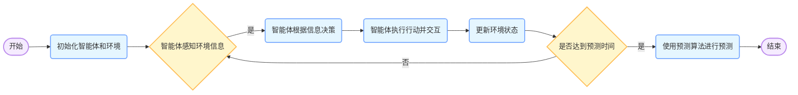

# 多智能体协作进行宏观经济预测

> 关键词：多智能体系统、宏观经济预测、智能体协作、经济模型、预测算法

> 摘要：本文围绕多智能体协作进行宏观经济预测展开深入探讨。首先介绍了多智能体协作在宏观经济预测领域的背景和意义，阐述了相关核心概念和联系，详细讲解了核心算法原理及具体操作步骤，通过数学模型和公式进行理论分析并举例说明。接着给出项目实战案例，包括开发环境搭建、源代码实现与解读。之后探讨了多智能体协作进行宏观经济预测的实际应用场景，推荐了相关的工具和资源。最后对未来发展趋势与挑战进行总结，并提供常见问题解答和扩展阅读参考资料，旨在为该领域的研究和实践提供全面且深入的指导。

## 1. 背景介绍 
### 1.1 目的和范围
宏观经济预测对于政府制定政策、企业规划战略以及投资者做出决策都具有至关重要的意义。传统的宏观经济预测方法往往基于单一模型或简单的统计分析，难以全面、准确地捕捉经济系统中复杂的动态变化和相互作用。多智能体协作作为一种新兴的方法，能够模拟经济系统中众多参与者的行为和交互，从而为宏观经济预测提供更丰富、更准确的信息。

本文的范围涵盖了多智能体协作进行宏观经济预测的基本原理、算法实现、实际应用等方面，旨在深入探讨该方法的优势和潜力，为相关研究和实践提供理论支持和技术指导。

### 1.2 预期读者
本文预期读者包括从事宏观经济研究的学者、经济政策制定者、金融分析师、人工智能与计算机科学领域的研究人员和开发者，以及对宏观经济预测和多智能体系统感兴趣的爱好者。

### 1.3 文档结构概述
本文将按照以下结构进行组织：首先介绍多智能体协作进行宏观经济预测的背景信息，包括目的、预期读者和文档结构概述等；接着阐述相关的核心概念与联系，通过文本示意图和 Mermaid 流程图进行说明；然后详细讲解核心算法原理和具体操作步骤，并使用 Python 源代码进行阐述；之后介绍数学模型和公式，并通过举例进行说明；再给出项目实战案例，包括开发环境搭建、源代码实现与解读；探讨实际应用场景；推荐相关的工具和资源；最后对未来发展趋势与挑战进行总结，并提供常见问题解答和扩展阅读参考资料。

### 1.4 术语表
#### 1.4.1 核心术语定义
- **多智能体系统（Multi - Agent System, MAS）**：由多个智能体组成的系统，这些智能体能够感知环境、自主决策并与其他智能体进行交互，以实现共同的目标。
- **智能体（Agent）**：具有自主性、反应性、社会性和主动性等特征的实体，能够在特定的环境中执行特定的任务。
- **宏观经济预测**：对宏观经济变量（如国内生产总值、通货膨胀率、失业率等）的未来走势进行预测的过程。
- **协作（Collaboration）**：多个智能体为了实现共同的目标而进行的合作行为，通过信息共享、协调行动等方式提高系统的整体性能。

#### 1.4.2 相关概念解释
- **经济模型**：对经济系统的抽象描述，用于分析经济现象和预测经济变量的变化。常见的经济模型包括凯恩斯模型、新古典模型等。
- **博弈论**：研究决策主体在相互作用时的决策和均衡问题的理论，在多智能体协作中可以用于分析智能体之间的策略选择和交互行为。
- **机器学习**：让计算机通过数据和经验自动学习模式和规律的技术，在宏观经济预测中可以用于构建预测模型。

#### 1.4.3 缩略词列表
- **MAS**：Multi - Agent System（多智能体系统）
- **GDP**：Gross Domestic Product（国内生产总值）
- **AI**：Artificial Intelligence（人工智能）

## 2. 核心概念与联系 

### 核心概念原理
多智能体协作进行宏观经济预测的核心思想是将宏观经济系统看作是由多个具有不同行为和决策能力的智能体组成的复杂系统。每个智能体代表经济系统中的一个参与者，如家庭、企业、政府等。这些智能体具有自主性，能够根据自身的目标和环境信息做出决策，并与其他智能体进行交互。

智能体之间的交互可以通过多种方式实现，如信息共享、合作、竞争等。通过这种交互，智能体可以不断调整自己的行为，从而影响整个经济系统的状态。多智能体系统通过模拟这些智能体的行为和交互，来预测宏观经济变量的变化。

### 架构的文本示意图
多智能体协作进行宏观经济预测的架构主要包括以下几个部分：
1. **智能体层**：由多个智能体组成，每个智能体代表经济系统中的一个参与者，具有自己的属性、行为和决策规则。
2. **环境层**：表示宏观经济环境，包括各种经济变量（如价格、利率、税收等）和政策因素。智能体在环境中感知信息，并根据环境的变化调整自己的行为。
3. **交互层**：负责智能体之间的信息传递和交互，通过通信协议和机制实现智能体之间的合作、竞争等行为。
4. **预测层**：根据智能体的行为和交互结果，以及环境信息，使用预测算法对宏观经济变量进行预测。

### Mermaid 流程图


## 3. 核心算法原理 & 具体操作步骤 

### 核心算法原理
多智能体协作进行宏观经济预测常用的算法包括基于规则的算法、机器学习算法等。下面以基于规则的算法为例进行讲解。

基于规则的算法是根据智能体的属性和环境信息，通过预先定义的规则来确定智能体的行为和决策。例如，企业智能体根据市场需求、成本等信息，按照一定的生产规则来决定生产数量；家庭智能体根据收入、物价等信息，按照消费规则来决定消费金额。

### 具体操作步骤
1. **智能体建模**：定义每个智能体的属性（如初始资产、生产能力、消费偏好等）、行为（如生产、消费、投资等）和决策规则。
2. **环境建模**：定义宏观经济环境的变量（如价格、利率、税收等）和变化规则。
3. **初始化**：初始化智能体的状态和环境的初始值。
4. **循环迭代**：
    - 智能体感知环境信息。
    - 智能体根据决策规则做出决策。
    - 智能体执行决策并与其他智能体进行交互。
    - 更新环境状态。
5. **预测**：在达到预测时间后，根据智能体的行为和环境状态，使用预测算法对宏观经济变量进行预测。

### Python 源代码阐述
```python
# 定义智能体类
class Agent:
    def __init__(self, initial_asset, production_capacity, consumption_preference):
        self.asset = initial_asset
        self.production_capacity = production_capacity
        self.consumption_preference = consumption_preference

    def perceive_environment(self, price, income):
        # 感知环境信息
        self.price = price
        self.income = income

    def make_decision(self):
        # 根据决策规则做出决策
        if self.income > self.price * self.consumption_preference:
            self.consumption = self.consumption_preference
        else:
            self.consumption = self.income / self.price
        self.production = min(self.production_capacity, self.consumption)

    def execute_action(self):
        # 执行决策
        self.asset += self.production * self.price - self.consumption * self.price

# 定义环境类
class Environment:
    def __init__(self, initial_price, initial_income):
        self.price = initial_price
        self.income = initial_income

    def update_state(self, agents):
        # 更新环境状态
        total_production = sum([agent.production for agent in agents])
        total_consumption = sum([agent.consumption for agent in agents])
        if total_production > total_consumption:
            self.price -= 0.1
        else:
            self.price += 0.1
        self.income += 1

# 主函数
def main():
    # 初始化智能体
    agents = [Agent(100, 10, 5) for _ in range(10)]
    # 初始化环境
    env = Environment(10, 50)

    # 循环迭代
    for _ in range(10):
        for agent in agents:
            agent.perceive_environment(env.price, env.income)
            agent.make_decision()
            agent.execute_action()
        env.update_state(agents)

    # 预测
    total_asset = sum([agent.asset for agent in agents])
    print(f"预测的总资产: {total_asset}")

if __name__ == "__main__":
    main()
```

## 4. 数学模型和公式 & 详细讲解 & 举例说明 

### 数学模型
多智能体协作进行宏观经济预测可以使用多种数学模型，如动态系统模型、博弈论模型等。下面以简单的动态系统模型为例进行讲解。

假设宏观经济系统可以用一组状态变量 $X = [x_1, x_2, \cdots, x_n]$ 来描述，其中 $x_i$ 表示第 $i$ 个经济变量（如 GDP、通货膨胀率等）。智能体的行为和交互会影响这些状态变量的变化，其变化可以用以下动态方程表示：

$$\frac{dX}{dt} = f(X, U)$$

其中，$U = [u_1, u_2, \cdots, u_m]$ 表示智能体的决策变量，$f$ 是一个非线性函数，表示状态变量的变化率与当前状态和智能体决策之间的关系。

### 详细讲解
上述动态方程描述了宏观经济系统的动态变化过程。智能体的决策 $U$ 会影响状态变量 $X$ 的变化率，从而导致状态变量的变化。通过求解这个动态方程，可以得到状态变量随时间的变化轨迹，从而实现对宏观经济变量的预测。

### 举例说明
假设宏观经济系统只有两个状态变量：GDP ($x_1$) 和通货膨胀率 ($x_2$)，智能体的决策变量是政府的财政支出 ($u_1$) 和中央银行的货币供应量 ($u_2$)。动态方程可以表示为：

$$\frac{dx_1}{dt} = a_1x_1 + b_1u_1 + c_1u_2$$

$$\frac{dx_2}{dt} = a_2x_2 + b_2u_1 + c_2u_2$$

其中，$a_1, a_2, b_1, b_2, c_1, c_2$ 是系数，反映了状态变量和决策变量之间的关系。

例如，假设初始状态为 $x_1(0) = 100$，$x_2(0) = 0.05$，系数 $a_1 = 0.1$，$a_2 = 0.05$，$b_1 = 0.2$，$b_2 = 0.1$，$c_1 = 0.1$，$c_2 = 0.15$，政府的财政支出 $u_1 = 10$，中央银行的货币供应量 $u_2 = 20$。

使用欧拉法求解上述动态方程：

$$x_1(t + \Delta t) = x_1(t) + \Delta t \cdot (a_1x_1(t) + b_1u_1 + c_1u_2)$$

$$x_2(t + \Delta t) = x_2(t) + \Delta t \cdot (a_2x_2(t) + b_2u_1 + c_2u_2)$$

假设 $\Delta t = 1$，经过 10 个时间步后：

```python
x1 = 100
x2 = 0.05
a1 = 0.1
a2 = 0.05
b1 = 0.2
b2 = 0.1
c1 = 0.1
c2 = 0.15
u1 = 10
u2 = 20
dt = 1

for _ in range(10):
    x1 = x1 + dt * (a1 * x1 + b1 * u1 + c1 * u2)
    x2 = x2 + dt * (a2 * x2 + b2 * u1 + c2 * u2)

print(f"预测的 GDP: {x1}")
print(f"预测的通货膨胀率: {x2}")
```

## 5. 项目实战：代码实际案例和详细解释说明 

### 5.1  开发环境搭建
- **操作系统**：推荐使用 Linux 或 macOS，也可以使用 Windows。
- **编程语言**：Python 3.x
- **开发工具**：推荐使用 PyCharm 或 Jupyter Notebook。
- **相关库**：numpy、pandas、matplotlib 等。

安装相关库可以使用以下命令：
```sh
pip install numpy pandas matplotlib
```

### 5.2  源代码详细实现和代码解读
以下是一个更复杂的多智能体协作进行宏观经济预测的代码示例：

```python
import numpy as np
import pandas as pd
import matplotlib.pyplot as plt

# 定义智能体类
class Agent:
    def __init__(self, initial_asset, production_capacity, consumption_preference):
        self.asset = initial_asset
        self.production_capacity = production_capacity
        self.consumption_preference = consumption_preference
        self.production = 0
        self.consumption = 0

    def perceive_environment(self, price, income):
        self.price = price
        self.income = income

    def make_decision(self):
        if self.income > self.price * self.consumption_preference:
            self.consumption = self.consumption_preference
        else:
            self.consumption = self.income / self.price
        self.production = min(self.production_capacity, self.consumption)

    def execute_action(self):
        self.asset += self.production * self.price - self.consumption * self.price

# 定义环境类
class Environment:
    def __init__(self, initial_price, initial_income):
        self.price = initial_price
        self.income = initial_income
        self.history_price = [initial_price]
        self.history_income = [initial_income]

    def update_state(self, agents):
        total_production = sum([agent.production for agent in agents])
        total_consumption = sum([agent.consumption for agent in agents])
        if total_production > total_consumption:
            self.price -= 0.1
        else:
            self.price += 0.1
        self.income += 1
        self.history_price.append(self.price)
        self.history_income.append(self.income)

# 主函数
def main():
    num_agents = 20
    agents = [Agent(100, 10, 5) for _ in range(num_agents)]
    env = Environment(10, 50)

    num_steps = 50
    total_assets = []

    for step in range(num_steps):
        for agent in agents:
            agent.perceive_environment(env.price, env.income)
            agent.make_decision()
            agent.execute_action()
        env.update_state(agents)
        total_asset = sum([agent.asset for agent in agents])
        total_assets.append(total_asset)

    # 绘制价格和总收入的变化曲线
    plt.figure(figsize=(12, 6))
    plt.subplot(1, 2, 1)
    plt.plot(env.history_price, label='Price')
    plt.plot(env.history_income, label='Income')
    plt.xlabel('Time Step')
    plt.ylabel('Value')
    plt.title('Price and Income over Time')
    plt.legend()

    # 绘制总资产的变化曲线
    plt.subplot(1, 2, 2)
    plt.plot(total_assets, label='Total Assets')
    plt.xlabel('Time Step')
    plt.ylabel('Total Assets')
    plt.title('Total Assets over Time')
    plt.legend()

    plt.show()

if __name__ == "__main__":
    main()
```

### 5.3  代码解读与分析
- **智能体类（Agent）**：
    - `__init__` 方法：初始化智能体的属性，包括初始资产、生产能力和消费偏好。
    - `perceive_environment` 方法：智能体感知环境信息，包括价格和收入。
    - `make_decision` 方法：智能体根据感知到的信息做出决策，确定生产和消费的数量。
    - `execute_action` 方法：智能体执行决策，更新自己的资产。

- **环境类（Environment）**：
    - `__init__` 方法：初始化环境的属性，包括初始价格和收入，并记录价格和收入的历史数据。
    - `update_state` 方法：根据智能体的生产和消费情况更新环境状态，包括价格和收入，并记录历史数据。

- **主函数（main）**：
    - 初始化智能体和环境。
    - 进行多次迭代，每次迭代中智能体感知环境、做出决策、执行行动，环境更新状态。
    - 记录总资产的变化，并绘制价格、收入和总资产的变化曲线。

通过这个代码示例，可以观察到多智能体协作对宏观经济变量（如价格、收入、总资产）的影响，从而实现对宏观经济的预测。

## 6. 实际应用场景 
### 政府政策制定
政府在制定宏观经济政策时，需要考虑政策对经济系统中各个参与者的影响。多智能体协作进行宏观经济预测可以模拟不同政策下各个智能体的行为和交互，从而预测政策的效果。例如，政府可以模拟税收政策、财政支出政策等对企业生产、家庭消费和经济增长的影响，为政策制定提供科学依据。

### 企业战略规划
企业在制定战略规划时，需要了解宏观经济环境的变化趋势。多智能体协作进行宏观经济预测可以帮助企业预测市场需求、价格走势等，从而制定合理的生产、销售和投资策略。例如，企业可以根据预测结果调整生产规模、优化产品结构、选择合适的投资项目等。

### 金融投资决策
金融投资者在做出投资决策时，需要对宏观经济形势进行分析和预测。多智能体协作进行宏观经济预测可以提供更准确的宏观经济信息，帮助投资者评估投资风险和收益。例如，投资者可以根据预测结果选择合适的投资资产（如股票、债券、房地产等），调整投资组合，降低投资风险。

### 经济危机预警
多智能体协作进行宏观经济预测可以实时监测经济系统的运行状态，发现潜在的经济危机信号。通过模拟智能体的行为和交互，预测经济变量的变化趋势，当出现异常情况时及时发出预警。例如，当预测到通货膨胀率过高、失业率上升、经济增长放缓等情况时，及时采取措施避免经济危机的发生。

## 7. 工具和资源推荐
### 7.1 学习资源推荐
#### 7.1.1 书籍推荐
- 《多智能体系统导论》：全面介绍了多智能体系统的基本概念、理论和方法，是学习多智能体系统的经典教材。
- 《宏观经济学》：系统阐述了宏观经济学的基本原理和模型，为宏观经济预测提供了理论基础。
- 《Python 数据分析实战》：介绍了使用 Python 进行数据分析和处理的方法和技巧，对于实现多智能体协作进行宏观经济预测的代码开发有很大帮助。

#### 7.1.2 在线课程
- Coursera 上的“Multi - Agent Systems”课程：由知名高校的教授授课，深入讲解多智能体系统的理论和应用。
- edX 上的“Macroeconomics Principles”课程：系统介绍宏观经济学的基本原理和方法。
- 中国大学 MOOC 上的“Python 语言程序设计”课程：帮助学习者掌握 Python 编程语言的基础知识和应用。

#### 7.1.3 技术博客和网站
- arXiv.org：提供了大量关于多智能体系统、宏观经济预测等领域的学术论文和研究成果。
- Towards Data Science：分享了许多关于数据分析、机器学习和人工智能的技术文章和实践经验。
- 经济研究网：提供了丰富的宏观经济数据和研究报告，为宏观经济预测提供数据支持。

### 7.2 开发工具框架推荐
#### 7.2.1 IDE和编辑器
- PyCharm：功能强大的 Python 集成开发环境，提供了代码编辑、调试、版本控制等功能，适合开发多智能体协作进行宏观经济预测的代码。
- Jupyter Notebook：交互式的开发环境，方便进行数据探索、模型实验和结果展示，适合进行宏观经济预测的数据分析和可视化。
- Visual Studio Code：轻量级的代码编辑器，支持多种编程语言和插件，具有良好的扩展性，适合快速开发和调试代码。

#### 7.2.2 调试和性能分析工具
- pdb：Python 内置的调试器，可以帮助开发者定位代码中的错误和问题。
- cProfile：Python 标准库中的性能分析工具，可以分析代码的执行时间和性能瓶颈，帮助开发者优化代码。
- Py-Spy：一个快速的 Python 性能分析工具，可以实时监测 Python 程序的性能，找出性能瓶颈。

#### 7.2.3 相关框架和库
- Mesa：一个用于构建多智能体系统的 Python 框架，提供了智能体建模、环境模拟、交互机制等功能，方便开发者实现多智能体协作进行宏观经济预测的模型。
- NumPy：Python 中用于科学计算的基础库，提供了高效的数组操作和数学函数，对于处理宏观经济数据和实现预测算法有很大帮助。
- Pandas：Python 中用于数据处理和分析的库，提供了数据结构和数据操作工具，方便对宏观经济数据进行清洗、整理和分析。

### 7.3 相关论文著作推荐
#### 7.3.1 经典论文
- "Multi - Agent Systems: A Modern Approach to Distributed Artificial Intelligence"：该论文系统地介绍了多智能体系统的基本概念、理论和方法，是多智能体系统领域的经典之作。
- "Macroeconomic Forecasting with Agent - Based Models"：探讨了使用多智能体模型进行宏观经济预测的方法和应用，为该领域的研究提供了重要的参考。
- "The Role of Agents in Economic Modeling"：分析了智能体在经济建模中的作用和意义，为多智能体协作进行宏观经济预测提供了理论支持。

#### 7.3.2 最新研究成果
- 关注顶级学术会议（如 AAAI、IJCAI、EC）和期刊（如 Journal of Artificial Intelligence Research、Journal of Economic Dynamics and Control）上发表的关于多智能体系统和宏观经济预测的最新研究论文，了解该领域的最新进展和前沿技术。

#### 7.3.3 应用案例分析
- 一些国际组织（如世界银行、国际货币基金组织）和政府机构发布的关于宏观经济预测和政策评估的报告，其中可能包含多智能体协作进行宏观经济预测的应用案例，可以从中学习和借鉴实际应用经验。

## 8. 总结：未来发展趋势与挑战
### 未来发展趋势
- **与其他技术的融合**：多智能体协作进行宏观经济预测将与大数据、人工智能、区块链等技术深度融合。大数据技术可以提供更丰富、更准确的经济数据，人工智能技术可以提高预测算法的性能和精度，区块链技术可以保证数据的安全性和可信度。
- **个性化和定制化**：随着经济系统的复杂性不断增加，不同用户对宏观经济预测的需求也越来越多样化。未来的多智能体协作宏观经济预测系统将更加注重个性化和定制化，根据用户的需求和偏好提供定制化的预测服务。
- **实时预测和动态调整**：传统的宏观经济预测方法往往是基于历史数据进行静态分析，难以实时反映经济系统的动态变化。未来的多智能体协作宏观经济预测系统将具备实时预测和动态调整的能力，能够根据实时数据和市场变化及时调整预测结果和决策建议。

### 挑战
- **数据质量和可用性**：多智能体协作进行宏观经济预测需要大量的高质量经济数据作为支撑。然而，目前经济数据存在数据缺失、数据不准确、数据不一致等问题，影响了预测的准确性和可靠性。此外，一些关键经济数据可能受到隐私保护和安全限制，难以获取和使用。
- **模型复杂性和可解释性**：多智能体系统的模型通常比较复杂，包含大量的智能体和交互关系，增加了模型的理解和解释难度。在实际应用中，用户不仅需要知道预测结果，还需要了解预测结果的产生原因和依据。因此，如何提高多智能体模型的可解释性是一个亟待解决的问题。
- **计算资源和效率**：多智能体协作进行宏观经济预测需要进行大量的计算和模拟，对计算资源的需求较高。在大规模智能体系统和复杂经济环境下，计算效率成为制约该方法应用的重要因素。如何优化算法和模型，提高计算效率，是未来需要研究的重点。

## 9. 附录：常见问题与解答
### 1. 多智能体协作进行宏观经济预测与传统预测方法有什么区别？
传统的宏观经济预测方法往往基于单一模型或简单的统计分析，难以全面、准确地捕捉经济系统中复杂的动态变化和相互作用。多智能体协作进行宏观经济预测将宏观经济系统看作是由多个具有不同行为和决策能力的智能体组成的复杂系统，通过模拟智能体的行为和交互来预测宏观经济变量的变化，能够更真实地反映经济系统的实际情况。

### 2. 如何确定智能体的行为和决策规则？
智能体的行为和决策规则可以根据经济理论、经验数据和专家知识来确定。例如，可以根据凯恩斯理论确定家庭的消费函数，根据新古典理论确定企业的生产函数。此外，还可以使用机器学习算法从历史数据中学习智能体的行为和决策规则。

### 3. 多智能体协作进行宏观经济预测的准确性如何？
多智能体协作进行宏观经济预测的准确性受到多种因素的影响，如数据质量、模型结构、算法选择等。在实际应用中，需要不断优化模型和算法，提高数据质量，以提高预测的准确性。同时，还可以结合其他预测方法进行综合分析，以降低预测误差。

### 4. 多智能体协作进行宏观经济预测需要哪些数据？
多智能体协作进行宏观经济预测需要大量的经济数据，包括宏观经济数据（如 GDP、通货膨胀率、失业率等）、微观经济数据（如企业生产数据、家庭消费数据等）、政策数据（如税收政策、财政支出政策等）。此外，还需要一些关于智能体属性和行为的数据，如企业的生产能力、家庭的消费偏好等。

## 10. 扩展阅读 & 参考资料
### 扩展阅读
- 《复杂经济学：经济思想的新框架》：探讨了复杂经济学的基本概念和理论，为理解多智能体协作进行宏观经济预测提供了新的视角。
- 《人工智能：现代方法》：全面介绍了人工智能的基本概念、技术和应用，对于学习多智能体系统和宏观经济预测中的人工智能算法有很大帮助。

### 参考资料
- 相关学术论文和研究报告，如上述推荐的经典论文和最新研究成果。
- 经济数据来源，如国家统计局网站、世界银行数据库、国际货币基金组织数据库等。
- 多智能体系统和宏观经济预测相关的开源代码库和项目，如 Mesa 框架的官方文档和示例代码。