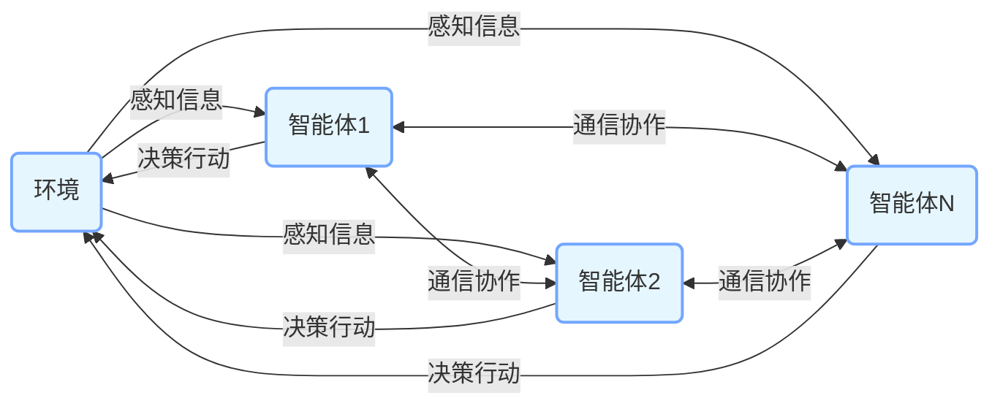

# 多智能体协同学习增强群体推理效果

> 关键词：多智能体系统、协同学习、群体推理、强化学习、分布式智能

> 摘要：本文聚焦于多智能体协同学习如何增强群体推理效果这一核心问题。首先介绍多智能体协同学习及群体推理的背景知识，阐述其目的、范围和相关术语。接着深入剖析核心概念与联系，通过文本示意图和 Mermaid 流程图展示原理和架构。详细讲解核心算法原理，用 Python 源代码进行说明，同时给出相关数学模型和公式并举例。通过项目实战，展示代码实际案例并详细解释。探讨多智能体协同学习在不同场景的实际应用，推荐相关工具和资源。最后总结未来发展趋势与挑战，解答常见问题并提供扩展阅读和参考资料，旨在为读者全面呈现多智能体协同学习增强群体推理效果的理论与实践内容。

## 1. 背景介绍 
### 1.1 目的和范围
在当今复杂的现实世界中，许多任务需要多个智能体共同协作来完成。多智能体系统（Multi - Agent System，MAS）能够模拟人类社会中的协作行为，通过多个智能体之间的交互和合作来解决复杂问题。群体推理则是指多个智能体共同对信息进行处理和分析，以得出更准确、更全面的结论。本文章的目的在于深入探讨多智能体协同学习如何提升群体推理的效果，范围涵盖多智能体协同学习的基本理论、核心算法、实际应用以及相关工具和资源等方面。

### 1.2 预期读者
本文预期读者包括计算机科学、人工智能、自动化控制等领域的研究人员和学生，他们对多智能体系统、协同学习和群体推理等相关技术有一定的兴趣和基础。同时，也适合从事智能系统开发、机器人控制等实际应用项目的工程师和技术人员，帮助他们更好地理解和应用多智能体协同学习技术来提高群体推理的性能。

### 1.3 文档结构概述
本文首先介绍多智能体协同学习和群体推理的背景知识，包括目的、范围、预期读者和相关术语。然后深入探讨核心概念与联系，通过文本示意图和 Mermaid 流程图展示其原理和架构。接着详细讲解核心算法原理，并用 Python 源代码进行说明，同时给出相关数学模型和公式并举例。之后通过项目实战展示代码实际案例并详细解释。再探讨多智能体协同学习在不同场景的实际应用，推荐相关工具和资源。最后总结未来发展趋势与挑战，解答常见问题并提供扩展阅读和参考资料。

### 1.4 术语表
#### 1.4.1 核心术语定义
- **多智能体系统（Multi - Agent System，MAS）**：由多个智能体组成的系统，这些智能体能够感知环境、进行决策并采取行动，通过相互之间的交互和协作来完成特定的任务。
- **协同学习（Collaborative Learning）**：多个智能体通过共享信息、相互协作和学习，以提高各自的性能和整个系统的性能。
- **群体推理（Group Reasoning）**：多个智能体共同对信息进行处理和分析，以得出更准确、更全面的结论的过程。
- **智能体（Agent）**：具有感知、决策和行动能力的实体，能够根据环境的变化自主地做出决策并采取相应的行动。

#### 1.4.2 相关概念解释
- **分布式智能**：多智能体系统中的智能体分布在不同的位置，通过通信和协作来实现整体的智能。与集中式智能相比，分布式智能具有更高的灵活性和鲁棒性。
- **强化学习**：智能体通过与环境进行交互，根据环境反馈的奖励信号来学习最优的行为策略。在多智能体系统中，强化学习可以用于智能体的决策和协作。

#### 1.4.3 缩略词列表
- **MAS**：Multi - Agent System（多智能体系统）
- **RL**：Reinforcement Learning（强化学习）

## 2. 核心概念与联系 
### 核心概念原理
多智能体协同学习的核心原理在于多个智能体之间的信息共享和协作。每个智能体都有自己的感知能力和决策能力，通过与其他智能体进行通信和交互，共享各自的信息和经验，从而实现协同学习。群体推理则是在多智能体协同学习的基础上，多个智能体共同对信息进行处理和分析，利用各自的知识和推理能力，得出更准确、更全面的结论。

### 架构的文本示意图
多智能体协同学习系统通常包括多个智能体、通信模块和环境。智能体通过感知模块获取环境信息，根据自身的决策算法做出决策，并通过执行模块采取行动。通信模块负责智能体之间的信息交换，使得智能体能够共享信息和协作。环境则是智能体活动的空间，提供智能体所需的信息和反馈。

### Mermaid 流程图

该流程图展示了多智能体系统中智能体与环境以及智能体之间的关系。智能体从环境中感知信息，根据信息做出决策并采取行动，同时智能体之间通过通信进行协作。

## 3. 核心算法原理 & 具体操作步骤 
### 核心算法原理
在多智能体协同学习中，一种常用的算法是基于强化学习的算法。强化学习的基本思想是智能体通过与环境进行交互，根据环境反馈的奖励信号来学习最优的行为策略。在多智能体系统中，每个智能体都有自己的奖励函数，同时也需要考虑其他智能体的行为和奖励，以实现协同学习。

### 具体操作步骤
1. **初始化**：初始化每个智能体的策略网络和价值网络，以及环境的初始状态。
2. **智能体感知环境**：每个智能体通过感知模块获取环境的当前状态。
3. **智能体决策**：每个智能体根据自身的策略网络，在当前状态下选择一个动作。
4. **智能体行动**：智能体执行选择的动作，环境根据智能体的动作发生变化，并返回新的状态和奖励信号。
5. **更新策略和价值网络**：每个智能体根据环境返回的奖励信号和新的状态，更新自己的策略网络和价值网络。
6. **通信协作**：智能体之间通过通信模块共享信息，例如奖励信号、状态信息等，以实现协同学习。
7. **重复步骤 2 - 6**：直到达到终止条件，例如达到最大迭代次数或任务完成。

### Python 源代码实现
```python
import numpy as np
import torch
import torch.nn as nn
import torch.optim as optim

# 定义智能体类
class Agent(nn.Module):
    def __init__(self, state_size, action_size):
        super(Agent, self).__init__()
        self.fc1 = nn.Linear(state_size, 64)
        self.fc2 = nn.Linear(64, 64)
        self.fc3 = nn.Linear(64, action_size)

    def forward(self, x):
        x = torch.relu(self.fc1(x))
        x = torch.relu(self.fc2(x))
        x = self.fc3(x)
        return x

# 定义环境类
class Environment:
    def __init__(self):
        self.state_size = 10
        self.action_size = 5
        self.reset()

    def reset(self):
        self.state = np.random.rand(self.state_size)
        return self.state

    def step(self, actions):
        # 简单示例：随机生成奖励
        rewards = np.random.rand(len(actions))
        new_state = np.random.rand(self.state_size)
        return new_state, rewards

# 多智能体协同学习
def multi_agent_learning(num_agents, num_episodes):
    agents = [Agent(10, 5) for _ in range(num_agents)]
    optimizers = [optim.Adam(agent.parameters(), lr=0.001) for agent in agents]
    env = Environment()

    for episode in range(num_episodes):
        state = env.reset()
        states = [torch.FloatTensor(state) for _ in range(num_agents)]
        episode_rewards = [0 for _ in range(num_agents)]

        while True:
            actions = []
            for i in range(num_agents):
                action_probs = agents[i](states[i])
                action = torch.argmax(action_probs).item()
                actions.append(action)

            new_state, rewards = env.step(actions)
            new_states = [torch.FloatTensor(new_state) for _ in range(num_agents)]

            for i in range(num_agents):
                optimizer = optimizers[i]
                agent = agents[i]
                optimizer.zero_grad()
                action_probs = agent(states[i])
                action = torch.argmax(action_probs).item()
                loss = -torch.log(action_probs[action]) * rewards[i]
                loss.backward()
                optimizer.step()

            states = new_states
            for i in range(num_agents):
                episode_rewards[i] += rewards[i]

            # 终止条件
            if np.random.rand() < 0.1:
                break

        print(f"Episode {episode}: Rewards = {episode_rewards}")
```
### 代码解释
1. **Agent 类**：定义了智能体的神经网络结构，包括三个全连接层。
2. **Environment 类**：定义了环境的状态和动作空间，以及重置和执行步骤的方法。
3. **multi_agent_learning 函数**：实现了多智能体协同学习的过程，包括初始化智能体和优化器，智能体的决策、行动和学习，以及环境的更新。

## 4. 数学模型和公式 & 详细讲解 & 举例说明 
### 数学模型
在多智能体强化学习中，常用的数学模型是马尔可夫决策过程（Markov Decision Process，MDP）的扩展，即分散式部分可观测马尔可夫决策过程（Decentralized Partially Observable Markov Decision Process，Dec - POMDP）。

### 公式
Dec - POMDP 可以用一个七元组 $(\mathcal{I}, \mathcal{S}, \mathcal{A}, \mathcal{O}, \mathcal{T}, \mathcal{Z}, \mathcal{R})$ 表示，其中：
- $\mathcal{I} = \{1, 2, \cdots, n\}$ 是智能体的集合，$n$ 是智能体的数量。
- $\mathcal{S}$ 是环境的状态空间。
- $\mathcal{A} = \mathcal{A}_1 \times \mathcal{A}_2 \times \cdots \times \mathcal{A}_n$ 是联合动作空间，$\mathcal{A}_i$ 是第 $i$ 个智能体的动作空间。
- $\mathcal{O} = \mathcal{O}_1 \times \mathcal{O}_2 \times \cdots \times \mathcal{O}_n$ 是联合观测空间，$\mathcal{O}_i$ 是第 $i$ 个智能体的观测空间。
- $\mathcal{T}: \mathcal{S} \times \mathcal{A} \times \mathcal{S} \to [0, 1]$ 是状态转移概率函数，表示在当前状态 $s \in \mathcal{S}$ 下，执行联合动作 $a \in \mathcal{A}$ 后转移到下一个状态 $s' \in \mathcal{S}$ 的概率。
- $\mathcal{Z}: \mathcal{S} \times \mathcal{A} \times \mathcal{O} \to [0, 1]$ 是观测概率函数，表示在状态 $s \in \mathcal{S}$ 下，执行联合动作 $a \in \mathcal{A}$ 后，智能体获得联合观测 $o \in \mathcal{O}$ 的概率。
- $\mathcal{R}: \mathcal{S} \times \mathcal{A} \to \mathbb{R}$ 是奖励函数，表示在状态 $s \in \mathcal{S}$ 下，执行联合动作 $a \in \mathcal{A}$ 后获得的奖励。

### 详细讲解
在 Dec - POMDP 中，每个智能体只能部分观测到环境的状态，需要通过与其他智能体的通信和协作来获取更多的信息。智能体的目标是最大化长期累积奖励，即找到最优的策略 $\pi = (\pi_1, \pi_2, \cdots, \pi_n)$，其中 $\pi_i: \mathcal{O}_i^* \to \mathcal{A}_i$ 是第 $i$ 个智能体的策略，$\mathcal{O}_i^*$ 是第 $i$ 个智能体的观测历史空间。

### 举例说明
假设有两个智能体在一个网格世界中进行协作任务。环境的状态空间 $\mathcal{S}$ 是网格世界的所有可能状态，每个智能体的动作空间 $\mathcal{A}_i$ 包括上下左右移动和停留。每个智能体只能观测到自己周围的部分网格信息，观测空间 $\mathcal{O}_i$ 是其局部观测的集合。状态转移概率函数 $\mathcal{T}$ 描述了智能体执行动作后环境状态的变化，观测概率函数 $\mathcal{Z}$ 描述了智能体获得观测的概率。奖励函数 $\mathcal{R}$ 可以根据智能体是否完成任务、是否碰撞等来定义。

## 5. 项目实战：代码实际案例和详细解释说明 
### 5.1  开发环境搭建
1. **安装 Python**：确保你的系统中安装了 Python 3.6 或更高版本。
2. **安装 PyTorch**：根据你的系统和显卡情况，选择合适的 PyTorch 版本进行安装。可以使用以下命令安装：
```bash
pip install torch torchvision
```
3. **安装其他依赖库**：根据项目需求，安装其他必要的依赖库，例如 `numpy` 等。
```bash
pip install numpy
```

### 5.2  源代码详细实现和代码解读
```python
import numpy as np
import torch
import torch.nn as nn
import torch.optim as optim

# 定义智能体类
class Agent(nn.Module):
    def __init__(self, state_size, action_size):
        super(Agent, self).__init__()
        self.fc1 = nn.Linear(state_size, 64)
        self.fc2 = nn.Linear(64, 64)
        self.fc3 = nn.Linear(64, action_size)

    def forward(self, x):
        x = torch.relu(self.fc1(x))
        x = torch.relu(self.fc2(x))
        x = self.fc3(x)
        return x

# 定义环境类
class Environment:
    def __init__(self):
        self.state_size = 10
        self.action_size = 5
        self.reset()

    def reset(self):
        self.state = np.random.rand(self.state_size)
        return self.state

    def step(self, actions):
        # 简单示例：随机生成奖励
        rewards = np.random.rand(len(actions))
        new_state = np.random.rand(self.state_size)
        return new_state, rewards

# 多智能体协同学习
def multi_agent_learning(num_agents, num_episodes):
    agents = [Agent(10, 5) for _ in range(num_agents)]
    optimizers = [optim.Adam(agent.parameters(), lr=0.001) for agent in agents]
    env = Environment()

    for episode in range(num_episodes):
        state = env.reset()
        states = [torch.FloatTensor(state) for _ in range(num_agents)]
        episode_rewards = [0 for _ in range(num_agents)]

        while True:
            actions = []
            for i in range(num_agents):
                action_probs = agents[i](states[i])
                action = torch.argmax(action_probs).item()
                actions.append(action)

            new_state, rewards = env.step(actions)
            new_states = [torch.FloatTensor(new_state) for _ in range(num_agents)]

            for i in range(num_agents):
                optimizer = optimizers[i]
                agent = agents[i]
                optimizer.zero_grad()
                action_probs = agent(states[i])
                action = torch.argmax(action_probs).item()
                loss = -torch.log(action_probs[action]) * rewards[i]
                loss.backward()
                optimizer.step()

            states = new_states
            for i in range(num_agents):
                episode_rewards[i] += rewards[i]

            # 终止条件
            if np.random.rand() < 0.1:
                break

        print(f"Episode {episode}: Rewards = {episode_rewards}")

# 运行多智能体协同学习
if __name__ == "__main__":
    num_agents = 3
    num_episodes = 100
    multi_agent_learning(num_agents, num_episodes)
```
### 代码解读与分析
1. **Agent 类**：
    - `__init__` 方法：初始化智能体的神经网络结构，包括三个全连接层。
    - `forward` 方法：定义了神经网络的前向传播过程，使用 ReLU 激活函数。
2. **Environment 类**：
    - `__init__` 方法：初始化环境的状态和动作空间，并重置环境。
    - `reset` 方法：重置环境的状态，并返回初始状态。
    - `step` 方法：根据智能体的动作更新环境的状态，并返回新的状态和奖励。
3. **multi_agent_learning 函数**：
    - 初始化智能体和优化器。
    - 进行多轮训练，每轮训练包括多个时间步。
    - 在每个时间步，智能体根据当前状态选择动作，执行动作后更新环境状态和奖励。
    - 每个智能体根据奖励信号更新自己的神经网络参数。
4. **主程序**：设置智能体的数量和训练的轮数，调用 `multi_agent_learning` 函数进行训练。

## 6. 实际应用场景 
### 机器人协作
在机器人领域，多智能体协同学习可以用于多个机器人的协作任务，例如机器人搬运、搜索救援等。多个机器人通过协同学习，能够更好地分工合作，提高任务的完成效率。例如，在仓库物流中，多个搬运机器人可以通过协同学习，根据货物的位置和需求，合理分配任务，快速完成货物的搬运工作。

### 交通控制
在交通领域，多智能体协同学习可以用于交通信号控制和车辆调度。多个智能体可以代表不同的交通路口或车辆，通过协同学习，优化交通信号的控制策略，减少交通拥堵。例如，在城市交通中，不同路口的交通信号控制器可以通过协同学习，根据实时的交通流量调整信号灯的时间，提高道路的通行能力。

### 智能电网
在智能电网领域，多智能体协同学习可以用于电力系统的调度和管理。多个智能体可以代表不同的发电设备、储能设备和用户，通过协同学习，实现电力的优化分配和调度，提高电网的稳定性和效率。例如，在分布式能源系统中，多个分布式电源和储能设备可以通过协同学习，根据用户的用电需求和电网的状态，合理调整发电和储能策略。

### 游戏竞技
在游戏领域，多智能体协同学习可以用于多人游戏的策略优化。多个智能体可以代表不同的游戏角色，通过协同学习，提高团队的协作能力和竞技水平。例如，在电子竞技游戏中，多个玩家的角色可以通过协同学习，制定更好的战术策略，提高团队的胜率。

## 7. 工具和资源推荐
### 7.1 学习资源推荐
#### 7.1.1 书籍推荐
- 《Multiagent Systems: Algorithmic, Game - Theoretic, and Logical Foundations》：这本书全面介绍了多智能体系统的理论和算法，包括多智能体决策、博弈论、逻辑推理等方面的内容。
- 《Reinforcement Learning: An Introduction》：这是强化学习领域的经典教材，详细介绍了强化学习的基本概念、算法和应用，对于理解多智能体强化学习有很大的帮助。

#### 7.1.2 在线课程
- Coursera 上的“Multi - Agent Artificial Intelligence”课程：该课程由知名高校的教授授课，系统地介绍了多智能体系统的相关知识和技术。
- edX 上的“Reinforcement Learning Fundamentals”课程：该课程重点讲解了强化学习的基本原理和算法，适合初学者学习。

#### 7.1.3 技术博客和网站
- Medium 上的“Multi - Agent Learning”专栏：该专栏汇集了多智能体学习领域的最新研究成果和技术文章，对于了解行业动态和前沿技术有很大的帮助。
- arXiv 网站：该网站是一个预印本平台，提供了大量的学术论文，包括多智能体协同学习和群体推理方面的研究论文。

### 7.2 开发工具框架推荐
#### 7.2.1 IDE和编辑器
- PyCharm：一款功能强大的 Python 集成开发环境，提供了代码编辑、调试、版本控制等功能，适合开发多智能体系统的 Python 代码。
- Visual Studio Code：一款轻量级的代码编辑器，支持多种编程语言和插件，具有丰富的扩展功能，方便开发和调试多智能体系统的代码。

#### 7.2.2 调试和性能分析工具
- PyTorch Profiler：PyTorch 提供的性能分析工具，可以帮助开发者分析代码的性能瓶颈，优化代码的执行效率。
- TensorBoard：一个可视化工具，可以用于可视化训练过程中的损失函数、奖励曲线等信息，帮助开发者更好地理解模型的训练过程。

#### 7.2.3 相关框架和库
- OpenAI Gym：一个开源的强化学习环境库，提供了多种不同类型的环境，方便开发者进行强化学习算法的实验和测试。
- PettingZoo：一个用于多智能体强化学习的环境库，提供了多种多智能体环境，支持不同的智能体算法和策略。

### 7.3 相关论文著作推荐
#### 7.3.1 经典论文
- “Multiagent Planning with Coordination Graphs”：该论文提出了一种基于协调图的多智能体规划算法，为多智能体协同学习提供了一种有效的方法。
- “Deep Reinforcement Learning for Multi - Agent Systems: A Review of Challenges, Solutions, and Applications”：该论文对多智能体强化学习的挑战、解决方案和应用进行了全面的综述，对于了解多智能体强化学习的研究现状有很大的帮助。

#### 7.3.2 最新研究成果
- 关注 AAAI、IJCAI、NeurIPS 等顶级学术会议的论文，这些会议上的论文通常代表了多智能体协同学习和群体推理领域的最新研究成果。
- 关注《Journal of Artificial Intelligence Research》、《Artificial Intelligence》等学术期刊的论文，这些期刊上的论文质量较高，反映了该领域的前沿研究。

#### 7.3.3 应用案例分析
- 参考一些实际应用案例的论文，例如机器人协作、交通控制、智能电网等领域的应用案例，了解多智能体协同学习在实际应用中的具体实现和效果。

## 8. 总结：未来发展趋势与挑战
### 未来发展趋势
- **深度融合人工智能技术**：多智能体协同学习将与深度学习、自然语言处理等人工智能技术深度融合，实现更加复杂和智能的协同学习和群体推理。例如，智能体可以通过自然语言处理技术进行更有效的通信和协作。
- **应用领域不断拓展**：多智能体协同学习将在更多的领域得到应用，如医疗保健、金融、教育等。在医疗保健领域，多个智能体可以协同分析患者的病历和检测数据，提供更准确的诊断和治疗方案。
- **强化学习算法的改进**：随着强化学习算法的不断发展，多智能体强化学习算法将得到进一步的改进和优化，提高学习效率和性能。例如，开发更高效的探索策略和奖励机制。

### 挑战
- **通信和协调问题**：多个智能体之间的通信和协调是多智能体协同学习的关键问题。在实际应用中，可能会面临通信延迟、带宽限制、信息不一致等问题，影响智能体之间的协作效果。
- **可扩展性问题**：随着智能体数量的增加，多智能体系统的复杂度会呈指数级增长，导致算法的可扩展性变差。如何设计高效的算法和架构，以应对大规模多智能体系统的挑战，是一个亟待解决的问题。
- **安全和隐私问题**：在多智能体系统中，智能体之间需要共享信息和协作，这可能会涉及到安全和隐私问题。例如，智能体的决策信息可能被泄露，导致系统的安全性受到威胁。

## 9. 附录：常见问题与解答
### 问题 1：多智能体协同学习和单智能体学习有什么区别？
答：单智能体学习是指单个智能体独立地与环境进行交互和学习，而多智能体协同学习是指多个智能体之间通过通信和协作来共同学习。多智能体协同学习需要考虑智能体之间的交互和协作关系，以及如何实现整体的最优性能，而单智能体学习只需要关注单个智能体的性能优化。

### 问题 2：多智能体协同学习中如何解决智能体之间的冲突？
答：可以通过多种方法解决智能体之间的冲突，例如设计合理的奖励机制，使得智能体在追求自身利益的同时也考虑到其他智能体的利益；采用协商和协调算法，让智能体通过通信和协商来解决冲突；使用博弈论的方法，分析智能体之间的策略互动，找到最优的解决方案。

### 问题 3：多智能体协同学习的计算复杂度高吗？
答：多智能体协同学习的计算复杂度通常较高，尤其是在智能体数量较多的情况下。这是因为多个智能体之间的交互和协作会增加算法的复杂度，同时需要处理大量的信息和数据。为了降低计算复杂度，可以采用分布式计算、并行计算等技术，以及设计高效的算法和架构。

## 10. 扩展阅读 & 参考资料
### 扩展阅读
- 《Artificial Intelligence: A Modern Approach》：这本书是人工智能领域的经典教材，涵盖了人工智能的各个方面，包括多智能体系统、机器学习等内容，对于深入了解人工智能技术有很大的帮助。
- 《Game Theory: An Introduction》：博弈论是多智能体协同学习中的重要理论基础，这本书系统地介绍了博弈论的基本概念、模型和算法，对于理解多智能体之间的策略互动有很大的帮助。

### 参考资料
- [OpenAI Gym 官方文档](https://gym.openai.com/docs/)
- [PyTorch 官方文档](https://pytorch.org/docs/stable/index.html)
- [PettingZoo 官方文档](https://www.pettingzoo.ml/)