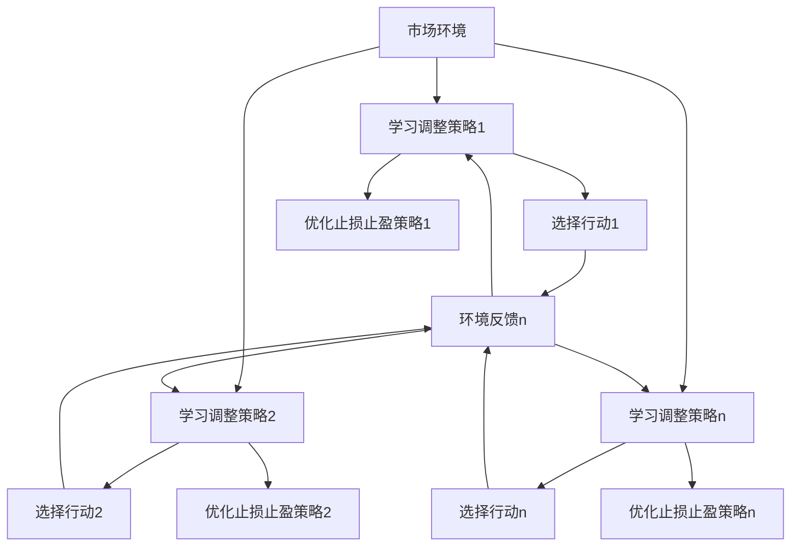

# 多智能体强化学习在优化止损和止盈策略中的应用

> 关键词：多智能体强化学习、止损策略、止盈策略、金融优化、智能决策

> 摘要：本文聚焦于多智能体强化学习在优化止损和止盈策略中的应用。首先介绍了相关背景知识，包括研究目的、预期读者和文档结构等。接着深入探讨了多智能体强化学习的核心概念及其与止损止盈策略的联系，详细阐述了核心算法原理和具体操作步骤，给出了相应的数学模型和公式并举例说明。通过项目实战展示了如何在实际中实现相关策略，分析了实际应用场景。还推荐了相关的学习资源、开发工具框架以及论文著作。最后总结了未来发展趋势与挑战，并提供了常见问题的解答和扩展阅读参考资料，旨在为金融领域的从业者和研究者提供全面的技术指导和理论支持，以提升止损和止盈策略的优化水平。

## 1. 背景介绍 
### 1.1 目的和范围
在金融投资领域，止损和止盈策略是投资者控制风险、锁定收益的重要手段。然而，传统的止损和止盈策略往往基于固定的规则或简单的经验，难以适应复杂多变的市场环境。多智能体强化学习作为一种新兴的人工智能技术，能够通过智能体之间的交互和学习，不断优化决策策略，为优化止损和止盈策略提供了新的思路和方法。

本文的范围主要涵盖多智能体强化学习的基本原理、如何将其应用于止损和止盈策略的优化，以及通过实际案例展示具体的实现过程和效果分析。同时，还将探讨该技术在金融市场中的应用前景和面临的挑战。

### 1.2 预期读者
本文预期读者包括金融领域的从业者，如投资者、交易员、风险管理人员等，他们可以通过本文了解多智能体强化学习在优化止损和止盈策略方面的应用，为实际投资决策提供参考。同时，也适合人工智能和机器学习领域的研究者和开发者，他们可以从金融应用的角度深入理解多智能体强化学习的实际应用场景和挑战。此外，对金融科技感兴趣的学生和爱好者也可以通过本文获取相关知识和信息。

### 1.3 文档结构概述
本文将按照以下结构进行组织：首先介绍多智能体强化学习和止损止盈策略的相关背景知识，包括术语表等内容。然后深入探讨核心概念及其联系，给出相应的文本示意图和 Mermaid 流程图。接着详细阐述核心算法原理和具体操作步骤，使用 Python 源代码进行说明。之后介绍数学模型和公式，并举例说明。通过项目实战展示代码实际案例和详细解释。分析实际应用场景，推荐相关的工具和资源。最后总结未来发展趋势与挑战，提供常见问题解答和扩展阅读参考资料。

### 1.4 术语表
#### 1.4.1 核心术语定义
- **多智能体强化学习（Multi - Agent Reinforcement Learning，MARL）**：是一种机器学习方法，多个智能体在环境中进行交互和学习，通过与环境的反馈来优化各自的策略，以实现共同或各自的目标。
- **止损策略（Stop - Loss Strategy）**：是一种风险管理策略，当投资损失达到一定程度时，及时卖出资产，以避免进一步的损失。
- **止盈策略（Take - Profit Strategy）**：是一种锁定收益的策略，当投资收益达到一定目标时，及时卖出资产，以确保获得预期的利润。
- **智能体（Agent）**：在多智能体强化学习中，智能体是能够感知环境、做出决策并采取行动的实体。
- **环境（Environment）**：是智能体所处的外部世界，智能体的行动会对环境产生影响，同时环境也会给智能体提供反馈信息。

#### 1.4.2 相关概念解释
- **强化学习（Reinforcement Learning）**：是一种通过智能体与环境的交互来学习最优策略的机器学习方法。智能体在环境中采取行动，环境会根据智能体的行动给出奖励或惩罚，智能体的目标是通过不断学习来最大化长期累积奖励。
- **策略（Policy）**：是智能体在不同状态下选择行动的规则。在强化学习中，智能体的目标就是学习到一个最优策略，使得长期累积奖励最大。
- **状态（State）**：是环境在某一时刻的特征描述，智能体根据当前状态来选择行动。

#### 1.4.3 缩略词列表
- **MARL**：Multi - Agent Reinforcement Learning（多智能体强化学习）
- **RL**：Reinforcement Learning（强化学习）

## 2. 核心概念与联系 
### 2.1 多智能体强化学习原理
多智能体强化学习是在强化学习的基础上发展而来的。在单智能体强化学习中，只有一个智能体与环境进行交互，而在多智能体强化学习中，存在多个智能体，这些智能体之间可以进行合作、竞争或其他形式的交互。

每个智能体都有自己的状态空间、行动空间和奖励函数。智能体根据当前状态选择行动，环境会根据所有智能体的行动给出相应的奖励和下一个状态。智能体的目标是通过不断学习来优化自己的策略，以最大化长期累积奖励。

### 2.2 止损和止盈策略原理
止损策略的核心思想是设定一个损失阈值，当投资的损失达到该阈值时，立即卖出资产，以避免损失进一步扩大。例如，投资者购买了一只股票，设定止损比例为 10%，当股票价格下跌 10% 时，就卖出该股票。

止盈策略则是设定一个收益目标，当投资的收益达到该目标时，及时卖出资产，以锁定利润。比如，投资者设定止盈比例为 20%，当股票价格上涨 20% 时，就卖出股票。

### 2.3 多智能体强化学习与止损止盈策略的联系
多智能体强化学习可以用于优化止损和止盈策略。在金融市场中，可以将不同的智能体看作是不同的投资者或交易策略。这些智能体可以通过交互和学习，不断调整自己的止损和止盈阈值，以适应市场的变化。

例如，一个智能体可以根据市场的趋势和其他智能体的行为来动态调整自己的止损和止盈策略，以提高投资的收益和降低风险。通过多智能体之间的合作和竞争，能够更好地挖掘市场信息，优化决策策略。

### 2.4 文本示意图
多智能体强化学习在优化止损和止盈策略中的应用可以用以下文本示意图表示：

多个智能体在金融市场环境中进行交互。每个智能体根据市场状态（如股票价格、成交量等）选择行动（如买入、卖出、持有等）。环境根据所有智能体的行动给出奖励（如投资收益、风险等）。智能体根据奖励不断学习和调整自己的止损和止盈策略，以最大化长期累积奖励。

### 2.5 Mermaid 流程图


## 3. 核心算法原理 & 具体操作步骤 
### 3.1 核心算法原理
多智能体强化学习有多种算法，这里以深度 Q 网络（Deep Q - Network，DQN）的扩展——多智能体深度 Q 网络（Multi - Agent Deep Q - Network，MADQN）为例进行介绍。

DQN 是一种将深度神经网络与 Q 学习相结合的强化学习算法。在单智能体情况下，Q 学习的目标是学习一个 Q 函数 $Q(s, a)$，表示在状态 $s$ 下采取行动 $a$ 的预期累积奖励。DQN 通过一个深度神经网络来近似这个 Q 函数。

在多智能体情况下，MADQN 为每个智能体都维护一个 Q 网络。每个智能体根据自己的局部状态和其他智能体的部分信息来选择行动，以最大化自己的长期累积奖励。

### 3.2 具体操作步骤
#### 3.2.1 初始化
- 初始化所有智能体的 Q 网络的参数。
- 初始化环境状态。

#### 3.2.2 循环执行以下步骤
1. **观察状态**：每个智能体观察当前的局部状态和其他智能体的部分信息。
2. **选择行动**：每个智能体根据自己的 Q 网络和当前状态选择行动。可以使用 $\epsilon$-贪心策略，以一定的概率 $\epsilon$ 随机选择行动，以探索新的策略，以 $1 - \epsilon$ 的概率选择 Q 值最大的行动。
3. **执行行动**：所有智能体同时执行选择的行动，环境根据所有智能体的行动更新状态，并给出每个智能体的奖励。
4. **存储经验**：将每个智能体的当前状态、选择的行动、获得的奖励和下一个状态存储到经验回放缓冲区中。
5. **经验回放**：从经验回放缓冲区中随机采样一批经验，用于训练每个智能体的 Q 网络。
6. **更新 Q 网络**：使用采样的经验，通过梯度下降算法更新每个智能体的 Q 网络的参数，以最小化 Q 函数的预测误差。

#### 3.2.3 终止条件
当达到预设的训练步数或满足其他终止条件时，训练结束。

### 3.3 Python 源代码实现
```python
import numpy as np
import torch
import torch.nn as nn
import torch.optim as optim
import random

# 定义 Q 网络
class QNetwork(nn.Module):
    def __init__(self, state_size, action_size):
        super(QNetwork, self).__init__()
        self.fc1 = nn.Linear(state_size, 64)
        self.fc2 = nn.Linear(64, 64)
        self.fc3 = nn.Linear(64, action_size)

    def forward(self, x):
        x = torch.relu(self.fc1(x))
        x = torch.relu(self.fc2(x))
        return self.fc3(x)

# 定义智能体类
class Agent:
    def __init__(self, state_size, action_size, learning_rate=0.001, gamma=0.99, epsilon=1.0, epsilon_decay=0.995, epsilon_min=0.01):
        self.state_size = state_size
        self.action_size = action_size
        self.learning_rate = learning_rate
        self.gamma = gamma
        self.epsilon = epsilon
        self.epsilon_decay = epsilon_decay
        self.epsilon_min = epsilon_min
        self.q_network = QNetwork(state_size, action_size)
        self.optimizer = optim.Adam(self.q_network.parameters(), lr=learning_rate)
        self.criterion = nn.MSELoss()
        self.memory = []

    def act(self, state):
        if np.random.rand() <= self.epsilon:
            return random.randrange(self.action_size)
        state = torch.FloatTensor(state).unsqueeze(0)
        q_values = self.q_network(state)
        action = torch.argmax(q_values).item()
        return action

    def remember(self, state, action, reward, next_state):
        self.memory.append((state, action, reward, next_state))

    def replay(self, batch_size):
        if len(self.memory) < batch_size:
            return
        minibatch = random.sample(self.memory, batch_size)
        for state, action, reward, next_state in minibatch:
            state = torch.FloatTensor(state).unsqueeze(0)
            next_state = torch.FloatTensor(next_state).unsqueeze(0)
            target = reward + self.gamma * torch.max(self.q_network(next_state)).item()
            target_f = self.q_network(state)
            target_f[0][action] = target
            self.optimizer.zero_grad()
            loss = self.criterion(self.q_network(state), target_f)
            loss.backward()
            self.optimizer.step()
        if self.epsilon > self.epsilon_min:
            self.epsilon *= self.epsilon_decay

# 定义多智能体环境
class MultiAgentEnvironment:
    def __init__(self, num_agents, state_size, action_size):
        self.num_agents = num_agents
        self.state_size = state_size
        self.action_size = action_size
        self.agents = [Agent(state_size, action_size) for _ in range(num_agents)]
        self.current_state = np.random.rand(num_agents, state_size)

    def step(self):
        actions = []
        for agent in self.agents:
            action = agent.act(self.current_state)
            actions.append(action)
        # 模拟环境反馈
        next_states = np.random.rand(self.num_agents, self.state_size)
        rewards = np.random.rand(self.num_agents)
        for i, agent in enumerate(self.agents):
            agent.remember(self.current_state[i], actions[i], rewards[i], next_states[i])
            agent.replay(32)
        self.current_state = next_states
        return next_states, rewards

# 训练多智能体系统
env = MultiAgentEnvironment(num_agents=3, state_size=5, action_size=3)
num_episodes = 1000
for episode in range(num_episodes):
    for _ in range(100):
        next_states, rewards = env.step()
    print(f"Episode {episode}: Rewards = {rewards}")
```

## 4. 数学模型和公式 & 详细讲解 & 举例说明 
### 4.1 Q 学习基本公式
在单智能体 Q 学习中，Q 函数的更新公式为：

$$Q(s_t, a_t) \leftarrow Q(s_t, a_t) + \alpha [r_t + \gamma \max_{a} Q(s_{t + 1}, a) - Q(s_t, a_t)]$$

其中：
- $s_t$ 表示在时间步 $t$ 的状态。
- $a_t$ 表示在时间步 $t$ 采取的行动。
- $r_t$ 表示在时间步 $t$ 获得的奖励。
- $s_{t + 1}$ 表示在时间步 $t + 1$ 的状态。
- $\alpha$ 是学习率，控制每次更新的步长。
- $\gamma$ 是折扣因子，用于权衡当前奖励和未来奖励的重要性。

### 4.2 多智能体 Q 学习扩展
在多智能体情况下，每个智能体 $i$ 有自己的 Q 函数 $Q_i$。智能体 $i$ 的 Q 函数更新公式可以表示为：

$$Q_i(s_t^i, a_t^i) \leftarrow Q_i(s_t^i, a_t^i) + \alpha_i [r_t^i + \gamma_i \max_{a^i} Q_i(s_{t + 1}^i, a^i) - Q_i(s_t^i, a_t^i)]$$

其中：
- $s_t^i$ 表示智能体 $i$ 在时间步 $t$ 的局部状态。
- $a_t^i$ 表示智能体 $i$ 在时间步 $t$ 采取的行动。
- $r_t^i$ 表示智能体 $i$ 在时间步 $t$ 获得的奖励。
- $s_{t + 1}^i$ 表示智能体 $i$ 在时间步 $t + 1$ 的局部状态。
- $\alpha_i$ 是智能体 $i$ 的学习率。
- $\gamma_i$ 是智能体 $i$ 的折扣因子。

### 4.3 详细讲解
Q 学习的核心思想是通过不断更新 Q 函数来逼近最优 Q 函数。在每次更新中，我们根据当前的奖励和下一个状态的最大 Q 值来更新当前状态 - 行动对的 Q 值。学习率 $\alpha$ 控制了每次更新的步长，如果 $\alpha$ 过大，可能会导致学习不稳定；如果 $\alpha$ 过小，学习速度会很慢。折扣因子 $\gamma$ 表示未来奖励的重要性，$\gamma$ 越接近 1，智能体越关注长期奖励；$\gamma$ 越接近 0，智能体越关注当前奖励。

在多智能体情况下，每个智能体独立地更新自己的 Q 函数，根据自己的局部状态和奖励来学习最优策略。

### 4.4 举例说明
假设我们有一个简单的金融投资场景，有两个智能体（投资者）在股票市场中进行交易。每个智能体的状态包括当前股票价格、自己的持仓数量等信息。行动空间包括买入、卖出和持有。

智能体 1 在某一时刻的状态 $s_t^1$ 下选择了行动 $a_t^1$（买入），获得了奖励 $r_t^1$（可能是由于股票价格上涨带来的收益）。下一个状态为 $s_{t + 1}^1$。智能体 1 根据上述 Q 函数更新公式来更新自己的 Q 函数 $Q_1(s_t^1, a_t^1)$，以学习到更好的投资策略。

## 5. 项目实战：代码实际案例和详细解释说明 
### 5.1 开发环境搭建
#### 5.1.1 安装 Python
首先需要安装 Python 环境，建议使用 Python 3.7 及以上版本。可以从 Python 官方网站（https://www.python.org/downloads/） 下载并安装。

#### 5.1.2 安装依赖库
需要安装以下主要的依赖库：
- **PyTorch**：用于构建和训练深度神经网络。可以根据自己的 CUDA 版本和操作系统选择合适的安装方式，参考 PyTorch 官方文档（https://pytorch.org/get-started/locally/）。
- **NumPy**：用于数值计算。可以使用以下命令安装：
```sh
pip install numpy
```
- **Matplotlib**：用于可视化结果。安装命令如下：
```sh
pip install matplotlib
```

### 5.2 源代码详细实现和代码解读
```python
import numpy as np
import torch
import torch.nn as nn
import torch.optim as optim
import random
import matplotlib.pyplot as plt

# 定义 Q 网络
class QNetwork(nn.Module):
    def __init__(self, state_size, action_size):
        super(QNetwork, self).__init__()
        self.fc1 = nn.Linear(state_size, 64)
        self.fc2 = nn.Linear(64, 64)
        self.fc3 = nn.Linear(64, action_size)

    def forward(self, x):
        x = torch.relu(self.fc1(x))
        x = torch.relu(self.fc2(x))
        return self.fc3(x)

# 定义智能体类
class Agent:
    def __init__(self, state_size, action_size, learning_rate=0.001, gamma=0.99, epsilon=1.0, epsilon_decay=0.995, epsilon_min=0.01):
        self.state_size = state_size
        self.action_size = action_size
        self.learning_rate = learning_rate
        self.gamma = gamma
        self.epsilon = epsilon
        self.epsilon_decay = epsilon_decay
        self.epsilon_min = epsilon_min
        self.q_network = QNetwork(state_size, action_size)
        self.optimizer = optim.Adam(self.q_network.parameters(), lr=learning_rate)
        self.criterion = nn.MSELoss()
        self.memory = []

    def act(self, state):
        if np.random.rand() <= self.epsilon:
            return random.randrange(self.action_size)
        state = torch.FloatTensor(state).unsqueeze(0)
        q_values = self.q_network(state)
        action = torch.argmax(q_values).item()
        return action

    def remember(self, state, action, reward, next_state):
        self.memory.append((state, action, reward, next_state))

    def replay(self, batch_size):
        if len(self.memory) < batch_size:
            return
        minibatch = random.sample(self.memory, batch_size)
        for state, action, reward, next_state in minibatch:
            state = torch.FloatTensor(state).unsqueeze(0)
            next_state = torch.FloatTensor(next_state).unsqueeze(0)
            target = reward + self.gamma * torch.max(self.q_network(next_state)).item()
            target_f = self.q_network(state)
            target_f[0][action] = target
            self.optimizer.zero_grad()
            loss = self.criterion(self.q_network(state), target_f)
            loss.backward()
            self.optimizer.step()
        if self.epsilon > self.epsilon_min:
            self.epsilon *= self.epsilon_decay

# 定义金融市场环境
class FinancialMarketEnvironment:
    def __init__(self, initial_price=100, volatility=0.1, num_agents=2, state_size=3, action_size=3):
        self.initial_price = initial_price
        self.volatility = volatility
        self.num_agents = num_agents
        self.state_size = state_size
        self.action_size = action_size
        self.current_price = initial_price
        self.agents = [Agent(state_size, action_size) for _ in range(num_agents)]
        self.agent_positions = [0] * num_agents

    def step(self):
        actions = []
        for agent in self.agents:
            state = np.array([self.current_price, self.agent_positions[agent], 0])  # 简单的状态表示
            action = agent.act(state)
            actions.append(action)

        # 模拟价格变动
        self.current_price += np.random.normal(0, self.volatility)

        rewards = []
        for i, action in enumerate(actions):
            if action == 0:  # 买入
                self.agent_positions[i] += 1
                reward = -self.current_price
            elif action == 1:  # 卖出
                if self.agent_positions[i] > 0:
                    self.agent_positions[i] -= 1
                    reward = self.current_price
                else:
                    reward = 0
            else:  # 持有
                reward = 0
            rewards.append(reward)

        for i, agent in enumerate(self.agents):
            next_state = np.array([self.current_price, self.agent_positions[agent], 0])
            agent.remember(np.array([self.current_price, self.agent_positions[agent], 0]), actions[i], rewards[i], next_state)
            agent.replay(32)

        return rewards

# 训练多智能体系统
env = FinancialMarketEnvironment()
num_episodes = 1000
total_rewards = []
for episode in range(num_episodes):
    episode_rewards = env.step()
    total_rewards.append(sum(episode_rewards))
    if episode % 100 == 0:
        print(f"Episode {episode}: Total Rewards = {sum(episode_rewards)}")

# 可视化结果
plt.plot(total_rewards)
plt.xlabel('Episode')
plt.ylabel('Total Rewards')
plt.title('Training Rewards over Episodes')
plt.show()
```

### 5.3 代码解读与分析
#### 5.3.1 Q 网络
`QNetwork` 类定义了一个简单的三层全连接神经网络，用于近似 Q 函数。输入层的维度为状态空间的大小，输出层的维度为行动空间的大小。

#### 5.3.2 智能体类
`Agent` 类实现了智能体的基本功能，包括选择行动、存储经验和经验回放。`act` 方法根据 $\epsilon$-贪心策略选择行动，`remember` 方法将经验存储到记忆中，`replay` 方法从记忆中采样并更新 Q 网络的参数。

#### 5.3.3 金融市场环境类
`FinancialMarketEnvironment` 类模拟了一个简单的金融市场环境。`step` 方法实现了一个时间步的交互过程，包括智能体选择行动、价格变动、计算奖励和更新智能体的状态等。

#### 5.3.4 训练过程
在训练过程中，我们循环执行多个回合的交互，每个回合中智能体与环境进行交互，根据环境的反馈更新自己的策略。最后，使用 `Matplotlib` 库将训练过程中的总奖励进行可视化，以便观察智能体的学习效果。

## 6. 实际应用场景 
### 6.1 股票投资
在股票投资中，多智能体强化学习可以用于优化止损和止盈策略。不同的智能体可以代表不同的投资风格或策略，如价值投资、趋势投资等。这些智能体通过交互和学习，根据市场的实时信息动态调整自己的止损和止盈阈值，以提高投资的收益和降低风险。

例如，一个智能体可以根据股票的基本面信息和其他智能体的交易行为来判断股票的价值，当股票价格下跌到一定程度时，根据学习到的策略及时止损；当股票价格上涨到预期目标时，及时止盈。

### 6.2 期货交易
期货市场具有高风险性和高杠杆性，止损和止盈策略尤为重要。多智能体强化学习可以应用于期货交易中，智能体可以根据期货的价格走势、成交量、持仓量等信息来优化止损和止盈策略。

不同的智能体可以关注不同的期货品种或市场因素，通过合作和竞争来挖掘市场信息，提高交易的成功率。例如，一个智能体可以专门关注宏观经济因素对期货价格的影响，另一个智能体可以关注技术指标，它们通过交互和学习来共同优化交易策略。

### 6.3 外汇交易
外汇市场是全球最大的金融市场之一，汇率波动频繁。多智能体强化学习可以帮助外汇交易者优化止损和止盈策略。智能体可以根据各国的经济数据、货币政策、地缘政治等因素来分析汇率走势，动态调整止损和止盈阈值。

例如，当一个国家发布重要的经济数据时，智能体可以根据数据的好坏和其他智能体的反应来决定是否调整止损和止盈策略，以避免汇率波动带来的损失或获取更多的收益。

## 7. 工具和资源推荐
### 7.1 学习资源推荐
#### 7.1.1 书籍推荐
- 《强化学习：原理与Python实现》：全面介绍了强化学习的基本原理和算法，并用 Python 代码进行了实现，适合初学者入门。
- 《多智能体系统：算法、博弈论及应用》：深入探讨了多智能体系统的相关理论和算法，包括多智能体强化学习，对于理解多智能体系统的原理和应用有很大帮助。
- 《金融市场技术分析》：介绍了金融市场的技术分析方法，对于理解金融市场的价格走势和交易策略有重要的参考价值。

#### 7.1.2 在线课程
- Coursera 上的“强化学习专项课程”：由知名学者授课，系统地介绍了强化学习的理论和实践，包括多智能体强化学习的相关内容。
- edX 上的“多智能体系统”：提供了多智能体系统的深入学习资源，包括理论讲解和实践案例。

#### 7.1.3 技术博客和网站
- OpenAI 博客：OpenAI 发布了许多关于强化学习和人工智能的最新研究成果和技术文章，对于了解前沿技术有很大帮助。
- arXiv 预印本平台：可以找到许多关于多智能体强化学习和金融应用的最新研究论文。

### 7.2 开发工具框架推荐
#### 7.2.1 IDE和编辑器
- PyCharm：是一款专业的 Python 集成开发环境，具有代码编辑、调试、自动补全等功能，非常适合开发 Python 项目。
- Jupyter Notebook：可以方便地进行代码编写、运行和可视化，适合进行实验和数据分析。

#### 7.2.2 调试和性能分析工具
- PyTorch 自带的调试工具：可以帮助开发者调试 PyTorch 代码，检查模型的参数和梯度等信息。
- TensorBoard：可以用于可视化训练过程中的损失函数、准确率等指标，帮助开发者分析模型的性能。

#### 7.2.3 相关框架和库
- Stable Baselines3：是一个基于 PyTorch 的强化学习库，提供了许多预实现的强化学习算法，方便开发者快速实现强化学习模型。
- Ray RLlib：是一个可扩展的强化学习库，支持多智能体强化学习，可以在分布式环境中进行训练。

### 7.3 相关论文著作推荐
#### 7.3.1 经典论文
- “Playing Atari with Deep Reinforcement Learning”：介绍了深度 Q 网络（DQN）的基本原理和实现，是强化学习领域的经典论文。
- “Multi - Agent Actor - Critic for Mixed Cooperative - Competitive Environments”：提出了一种多智能体演员 - 评论家算法，用于解决混合合作 - 竞争环境中的多智能体强化学习问题。

#### 7.3.2 最新研究成果
- 关注 arXiv 上关于多智能体强化学习和金融应用的最新预印本论文，了解该领域的最新研究动态。

#### 7.3.3 应用案例分析
- 一些金融科技公司或研究机构发布的关于多智能体强化学习在金融领域应用的案例分析报告，可以帮助我们了解实际应用中的问题和解决方案。

## 8. 总结：未来发展趋势与挑战
### 8.1 未来发展趋势
- **更复杂的智能体交互模型**：未来的多智能体强化学习可能会发展出更复杂的智能体交互模型，考虑更多的因素和约束条件，如智能体之间的信任关系、合作机制等，以更好地模拟现实世界中的金融市场环境。
- **与其他技术的融合**：多智能体强化学习可能会与其他技术，如区块链、大数据、云计算等进行融合，以提高金融交易的安全性、效率和透明度。例如，区块链技术可以提供不可篡改的交易记录，为多智能体强化学习提供更可靠的数据支持。
- **跨领域应用拓展**：除了金融领域，多智能体强化学习可能会在其他领域得到更广泛的应用，如交通管理、能源管理、医疗保健等。在这些领域中，多智能体强化学习可以用于优化资源分配、协调决策等问题。

### 8.2 挑战
- **计算资源需求**：多智能体强化学习通常需要大量的计算资源来进行训练和推理，尤其是在处理复杂的金融市场环境时。如何有效地利用计算资源，提高算法的效率，是一个亟待解决的问题。
- **数据质量和隐私问题**：金融数据通常具有高敏感性和隐私性，如何在保证数据质量的前提下，保护数据的隐私和安全，是多智能体强化学习在金融领域应用的一个重要挑战。
- **策略的可解释性**：多智能体强化学习的策略通常是基于深度神经网络等复杂模型，其决策过程往往难以解释。在金融领域，决策者需要了解策略的决策依据，以确保决策的合理性和合规性。因此，提高策略的可解释性是一个重要的研究方向。

## 9. 附录：常见问题与解答
### 9.1 多智能体强化学习与单智能体强化学习有什么区别？
多智能体强化学习存在多个智能体，这些智能体之间可以进行交互和学习，而单智能体强化学习只有一个智能体与环境进行交互。在多智能体强化学习中，智能体的决策不仅受到环境的影响，还受到其他智能体的影响，因此需要考虑智能体之间的合作、竞争等关系。

### 9.2 如何选择合适的学习率和折扣因子？
学习率和折扣因子的选择通常需要通过实验来确定。一般来说，学习率不宜过大，否则会导致学习不稳定；也不宜过小，否则学习速度会很慢。折扣因子越接近 1，智能体越关注长期奖励；越接近 0，智能体越关注当前奖励。可以在不同的取值范围内进行试验，观察智能体的学习效果，选择最优的参数。

### 9.3 多智能体强化学习在金融领域的应用有哪些局限性？
多智能体强化学习在金融领域的应用存在一些局限性，如计算资源需求大、数据质量和隐私问题、策略的可解释性等。此外，金融市场具有高度的不确定性和复杂性，多智能体强化学习的模型可能无法完全捕捉市场的所有信息和变化，导致策略的效果受到影响。

## 10. 扩展阅读 & 参考资料
- Sutton, R. S., & Barto, A. G. (2018). Reinforcement Learning: An Introduction. MIT press.
- Shoham, Y., & Leyton - Brown, K. (2008). Multiagent Systems: Algorithmic, Game - Theoretic, and Logical Foundations. Cambridge University Press.
- Murphy, K. P. (2012). Machine Learning: A Probabilistic Perspective. MIT press.
- OpenAI. (2023). OpenAI Blog. https://openai.com/blog
- arXiv. (2023). arXiv.org e - print archive. https://arxiv.org
- PyTorch. (2023). PyTorch Documentation. https://pytorch.org/docs/stable/index.html