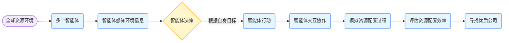

# 多智能体系统在全球资源配置效率评估中的应用：寻找优质公司

> 关键词：多智能体系统、全球资源配置效率评估、优质公司、人工智能、资源优化

> 摘要：本文深入探讨了多智能体系统在全球资源配置效率评估中的应用，旨在寻找优质公司。首先介绍了相关背景知识，包括目的范围、预期读者等。接着阐述了多智能体系统的核心概念与联系，详细讲解了其核心算法原理及具体操作步骤，并给出了数学模型和公式。通过项目实战，展示了如何运用多智能体系统进行资源配置效率评估和优质公司筛选，分析了实际应用场景。同时推荐了相关的工具和资源，最后总结了未来发展趋势与挑战，还提供了常见问题解答和扩展阅读参考资料，为该领域的研究和实践提供了全面而深入的指导。

## 1. 背景介绍 
### 1.1 目的和范围
在全球化的经济格局下，资源的有效配置对于企业的发展和全球经济的稳定增长至关重要。全球资源配置效率评估是一个复杂且关键的问题，它涉及到多个领域和众多因素。本研究的目的在于探索多智能体系统在全球资源配置效率评估中的应用，通过该系统的独特优势，更准确地评估资源配置效率，并以此为依据寻找优质公司。

本研究的范围涵盖了全球不同地区、不同行业的各类公司。我们将综合考虑公司的财务状况、市场竞争力、创新能力、社会责任等多个维度的因素，运用多智能体系统构建全面的评估模型，以实现对全球资源配置效率的有效评估和优质公司的筛选。

### 1.2 预期读者
本文预期读者包括对人工智能、资源配置、企业评估等领域感兴趣的科研人员、高校师生、企业管理者以及金融从业者等。对于科研人员，本文提供了多智能体系统在资源配置效率评估领域的前沿研究成果和方法；对于高校师生，可作为相关课程的参考资料，帮助他们深入理解多智能体系统的应用和资源配置效率评估的理论与实践；企业管理者可以借鉴本文的方法和模型，优化企业的资源配置决策，提升企业的竞争力；金融从业者则可以利用本文的研究成果，更好地评估投资对象，做出更明智的投资决策。

### 1.3 文档结构概述
本文将按照以下结构展开：首先介绍多智能体系统和全球资源配置效率评估的相关背景知识，包括术语定义和概念解释；接着阐述多智能体系统的核心概念与联系，通过文本示意图和 Mermaid 流程图展示其架构和原理；然后详细讲解核心算法原理及具体操作步骤，使用 Python 源代码进行说明；再给出数学模型和公式，并结合具体例子进行详细讲解；通过项目实战展示代码实现和分析；探讨多智能体系统在实际应用中的场景；推荐相关的学习资源、开发工具框架和论文著作；最后总结未来发展趋势与挑战，提供常见问题解答和扩展阅读参考资料。

### 1.4 术语表
#### 1.4.1 核心术语定义
- **多智能体系统（Multi - Agent System，MAS）**：由多个智能体组成的系统，这些智能体能够感知环境、自主决策并与其他智能体进行交互，以实现系统的整体目标。
- **全球资源配置效率评估**：对全球范围内资源在不同地区、不同行业、不同企业之间的分配和利用效率进行评估的过程。
- **优质公司**：在财务状况、市场竞争力、创新能力、社会责任等多个方面表现出色，具有较高的资源配置效率和发展潜力的公司。

#### 1.4.2 相关概念解释
- **智能体（Agent）**：具有一定的自主性、适应性和交互性的实体，能够根据自身的目标和感知到的环境信息进行决策和行动。
- **资源配置**：将有限的资源分配到不同的用途和领域，以实现资源的最优利用和效益最大化。
- **效率评估**：通过一定的指标和方法，对某个系统或过程的效率进行量化和评价的过程。

#### 1.4.3 缩略词列表
- **MAS**：Multi - Agent System（多智能体系统）
- **AI**：Artificial Intelligence（人工智能）

## 2. 核心概念与联系 

### 多智能体系统的核心概念
多智能体系统是一种分布式人工智能系统，它由多个智能体组成。每个智能体都具有一定的自主性、反应性、社会性和能动性。自主性意味着智能体能够在没有外界干预的情况下独立地完成任务；反应性表示智能体能够感知环境的变化并做出相应的反应；社会性体现了智能体之间能够进行交互和协作；能动性则表示智能体具有目标导向性，能够主动地采取行动以实现自己的目标。

### 多智能体系统与全球资源配置效率评估的联系
在全球资源配置效率评估中，多智能体系统可以模拟不同的市场主体（如企业、投资者、政府等）的行为和决策过程。每个智能体可以代表一个市场主体，它们根据自身的目标和感知到的环境信息（如市场需求、资源价格、政策法规等）进行决策和行动。通过智能体之间的交互和协作，可以模拟全球资源的流动和配置过程，从而更准确地评估资源配置效率。

### 文本示意图
多智能体系统在全球资源配置效率评估中的应用可以用以下文本示意图表示：

全球资源环境（市场需求、资源价格、政策法规等） -> 多个智能体（企业智能体、投资者智能体、政府智能体等） -> 智能体感知环境信息 -> 智能体根据自身目标进行决策和行动 -> 智能体之间交互和协作 -> 模拟全球资源配置过程 -> 评估资源配置效率 -> 寻找优质公司

### Mermaid 流程图


## 3. 核心算法原理 & 具体操作步骤 

### 核心算法原理
在多智能体系统中，常用的算法包括强化学习算法、博弈论算法等。这里我们以强化学习算法为例进行讲解。

强化学习是一种通过智能体与环境进行交互，不断尝试和学习，以获得最大累积奖励的学习方法。在全球资源配置效率评估中，智能体可以是企业，环境可以是全球市场，奖励可以是企业的利润或资源配置效率。

智能体的目标是通过选择合适的行动（如资源分配决策）来最大化自己的奖励。在每一个时间步，智能体根据当前的状态（如市场需求、资源价格等）选择一个行动，然后环境会根据智能体的行动返回一个新的状态和一个奖励。智能体根据这个奖励来更新自己的策略，以提高未来获得奖励的可能性。

### Python 源代码实现
```python
import numpy as np

# 定义智能体类
class Agent:
    def __init__(self, num_actions, learning_rate=0.1, discount_factor=0.9):
        self.num_actions = num_actions
        self.learning_rate = learning_rate
        self.discount_factor = discount_factor
        # 初始化 Q 表
        self.q_table = np.zeros((1, num_actions))

    def choose_action(self, state):
        # 选择行动，这里使用贪心策略
        if np.random.uniform(0, 1) < 0.1:
            action = np.random.choice(self.num_actions)
        else:
            action = np.argmax(self.q_table[state])
        return action

    def update_q_table(self, state, action, reward, next_state):
        # 更新 Q 表
        max_q_next = np.max(self.q_table[next_state])
        self.q_table[state, action] += self.learning_rate * (reward + self.discount_factor * max_q_next - self.q_table[state, action])

# 模拟环境
class Environment:
    def __init__(self):
        self.state = 0
        self.num_actions = 3

    def step(self, action):
        # 根据行动返回新的状态和奖励
        if action == 0:
            new_state = 0
            reward = 1
        elif action == 1:
            new_state = 0
            reward = -1
        else:
            new_state = 0
            reward = 0
        return new_state, reward

# 主循环
if __name__ == "__main__":
    agent = Agent(num_actions=3)
    env = Environment()
    num_episodes = 100

    for episode in range(num_episodes):
        state = env.state
        for step in range(10):
            action = agent.choose_action(state)
            next_state, reward = env.step(action)
            agent.update_q_table(state, action, reward, next_state)
            state = next_state
        print(f"Episode {episode}: Total Reward = {sum([env.step(agent.choose_action(env.state))[1] for _ in range(10)])}")
```

### 具体操作步骤
1. **定义智能体和环境**：根据实际问题，定义智能体的数量、行动空间和环境的状态空间。
2. **初始化智能体的策略**：例如，使用随机策略或初始的 Q 表。
3. **智能体与环境交互**：在每个时间步，智能体根据当前状态选择一个行动，环境根据智能体的行动返回新的状态和奖励。
4. **更新智能体的策略**：智能体根据获得的奖励更新自己的策略，以提高未来获得奖励的可能性。
5. **重复步骤 3 和 4**：直到达到预设的训练次数或满足其他终止条件。
6. **评估资源配置效率**：根据智能体的最终策略，模拟全球资源配置过程，评估资源配置效率。
7. **寻找优质公司**：根据资源配置效率评估结果，筛选出优质公司。

## 4. 数学模型和公式 & 详细讲解 & 举例说明 

### 强化学习的数学模型
在强化学习中，常用的数学模型是马尔可夫决策过程（Markov Decision Process，MDP）。一个 MDP 可以用一个五元组 $<S, A, P, R, \gamma>$ 表示，其中：
- $S$ 是状态空间，即环境可能处于的所有状态的集合。
- $A$ 是行动空间，即智能体可以采取的所有行动的集合。
- $P$ 是状态转移概率函数，$P(s'|s, a)$ 表示在状态 $s$ 采取行动 $a$ 后转移到状态 $s'$ 的概率。
- $R$ 是奖励函数，$R(s, a)$ 表示在状态 $s$ 采取行动 $a$ 后获得的奖励。
- $\gamma$ 是折扣因子，$0 \leq \gamma \leq 1$，用于衡量未来奖励的重要性。

### Q 学习算法的公式
Q 学习是一种基于值函数的强化学习算法，其核心是更新 Q 表。Q 表中的每个元素 $Q(s, a)$ 表示在状态 $s$ 采取行动 $a$ 的价值。Q 学习的更新公式为：

$$Q(s, a) \leftarrow Q(s, a) + \alpha [R(s, a) + \gamma \max_{a'} Q(s', a') - Q(s, a)]$$

其中：
- $\alpha$ 是学习率，控制每次更新的步长。
- $\gamma$ 是折扣因子。
- $R(s, a)$ 是在状态 $s$ 采取行动 $a$ 后获得的奖励。
- $s'$ 是在状态 $s$ 采取行动 $a$ 后转移到的新状态。
- $\max_{a'} Q(s', a')$ 表示在新状态 $s'$ 下所有可能行动的最大 Q 值。

### 举例说明
假设一个简单的资源配置问题，状态空间 $S = \{s_1, s_2\}$，行动空间 $A = \{a_1, a_2\}$。初始时，$Q(s_1, a_1) = 0$，$Q(s_1, a_2) = 0$，$Q(s_2, a_1) = 0$，$Q(s_2, a_2) = 0$。学习率 $\alpha = 0.1$，折扣因子 $\gamma = 0.9$。

在状态 $s_1$ 采取行动 $a_1$ 后，转移到状态 $s_2$，获得奖励 $R(s_1, a_1) = 1$。则根据 Q 学习的更新公式：

$$Q(s_1, a_1) \leftarrow Q(s_1, a_1) + 0.1 [1 + 0.9 \max_{a'} Q(s_2, a') - Q(s_1, a_1)]$$

由于 $Q(s_2, a_1) = 0$，$Q(s_2, a_2) = 0$，所以 $\max_{a'} Q(s_2, a') = 0$。则：

$$Q(s_1, a_1) \leftarrow 0 + 0.1 [1 + 0.9 \times 0 - 0] = 0.1$$

这样，Q 表中的 $Q(s_1, a_1)$ 就更新为 0.1。

## 5. 项目实战：代码实际案例和详细解释说明 

### 5.1  开发环境搭建
- **Python 环境**：建议使用 Python 3.7 及以上版本。可以从 Python 官方网站（https://www.python.org/downloads/）下载并安装。
- **开发工具**：推荐使用 PyCharm 或 Jupyter Notebook。PyCharm 是一款功能强大的 Python 集成开发环境，Jupyter Notebook 则适合进行交互式编程和数据分析。
- **相关库**：需要安装 numpy 库，用于数值计算。可以使用以下命令进行安装：
```sh
pip install numpy
```

### 5.2  源代码详细实现和代码解读
```python
import numpy as np

# 定义智能体类
class Agent:
    def __init__(self, num_actions, learning_rate=0.1, discount_factor=0.9):
        # 初始化智能体的行动数量、学习率和折扣因子
        self.num_actions = num_actions
        self.learning_rate = learning_rate
        self.discount_factor = discount_factor
        # 初始化 Q 表，用于存储每个状态和行动的价值
        self.q_table = np.zeros((1, num_actions))

    def choose_action(self, state):
        # 选择行动的方法
        if np.random.uniform(0, 1) < 0.1:
            # 以 10% 的概率随机选择一个行动
            action = np.random.choice(self.num_actions)
        else:
            # 以 90% 的概率选择 Q 值最大的行动
            action = np.argmax(self.q_table[state])
        return action

    def update_q_table(self, state, action, reward, next_state):
        # 更新 Q 表的方法
        # 计算下一个状态的最大 Q 值
        max_q_next = np.max(self.q_table[next_state])
        # 根据 Q 学习的更新公式更新 Q 表
        self.q_table[state, action] += self.learning_rate * (reward + self.discount_factor * max_q_next - self.q_table[state, action])

# 模拟环境类
class Environment:
    def __init__(self):
        # 初始化环境的状态和行动数量
        self.state = 0
        self.num_actions = 3

    def step(self, action):
        # 根据行动返回新的状态和奖励的方法
        if action == 0:
            new_state = 0
            reward = 1
        elif action == 1:
            new_state = 0
            reward = -1
        else:
            new_state = 0
            reward = 0
        return new_state, reward

# 主循环
if __name__ == "__main__":
    # 创建智能体和环境对象
    agent = Agent(num_actions=3)
    env = Environment()
    # 设置训练的回合数
    num_episodes = 100

    for episode in range(num_episodes):
        # 重置环境状态
        state = env.state
        for step in range(10):
            # 智能体选择行动
            action = agent.choose_action(state)
            # 环境根据行动返回新的状态和奖励
            next_state, reward = env.step(action)
            # 智能体更新 Q 表
            agent.update_q_table(state, action, reward, next_state)
            # 更新当前状态
            state = next_state
        # 打印每个回合的总奖励
        print(f"Episode {episode}: Total Reward = {sum([env.step(agent.choose_action(env.state))[1] for _ in range(10)])}")
```

### 5.3  代码解读与分析
- **智能体类（Agent）**：
  - `__init__` 方法：初始化智能体的行动数量、学习率、折扣因子和 Q 表。
  - `choose_action` 方法：根据当前状态选择一个行动，使用了贪心策略，以一定的概率随机选择行动，以避免陷入局部最优。
  - `update_q_table` 方法：根据 Q 学习的更新公式更新 Q 表，以提高智能体的策略。
- **环境类（Environment）**：
  - `__init__` 方法：初始化环境的状态和行动数量。
  - `step` 方法：根据智能体的行动返回新的状态和奖励。
- **主循环**：
  - 初始化智能体和环境对象，设置训练的回合数。
  - 在每个回合中，智能体与环境进行交互，选择行动，获得奖励，更新 Q 表。
  - 打印每个回合的总奖励，以观察智能体的学习过程。

通过这个代码示例，我们可以看到如何使用强化学习算法来模拟智能体在环境中的决策过程，从而实现资源配置效率的优化。

## 6. 实际应用场景 
### 金融投资领域
在金融投资领域，多智能体系统可以用于评估不同公司的资源配置效率，帮助投资者寻找优质公司进行投资。投资者可以将不同的投资策略表示为智能体，这些智能体根据市场信息（如公司财务报表、行业趋势等）进行决策，通过多智能体系统的交互和协作，模拟不同投资组合的收益情况，评估资源配置效率，从而选择最优的投资组合。

### 企业战略决策
企业在制定战略决策时，需要考虑资源的有效配置。多智能体系统可以模拟企业内部不同部门（如研发、生产、销售等）的行为和决策过程，以及企业与外部市场环境（如供应商、客户、竞争对手等）的交互。通过多智能体系统的模拟和评估，企业可以更好地了解资源配置的效率，优化资源分配方案，提高企业的竞争力。

### 政府政策制定
政府在制定经济政策时，需要考虑资源在不同地区、不同行业之间的合理配置。多智能体系统可以模拟不同经济主体（如企业、消费者、投资者等）的行为和决策过程，以及政策对资源配置的影响。通过多智能体系统的模拟和评估，政府可以制定更加科学合理的政策，提高资源配置效率，促进经济的可持续发展。

## 7. 工具和资源推荐
### 7.1 学习资源推荐
#### 7.1.1 书籍推荐
- 《人工智能：一种现代的方法》（Artificial Intelligence: A Modern Approach）：这是一本经典的人工智能教材，涵盖了多智能体系统等多个领域的知识，对多智能体系统的原理、算法和应用进行了详细的介绍。
- 《强化学习：原理与Python实现》：这本书专门介绍了强化学习的原理和实现方法，对于理解多智能体系统中常用的强化学习算法非常有帮助。
- 《多智能体系统导论》（An Introduction to Multi - Agent Systems）：全面介绍了多智能体系统的基本概念、理论和应用，是学习多智能体系统的重要参考书籍。

#### 7.1.2 在线课程
- Coursera 上的“Artificial Intelligence”课程：由斯坦福大学的教授授课，涵盖了人工智能的多个领域，包括多智能体系统。
- edX 上的“Reinforcement Learning”课程：详细介绍了强化学习的理论和实践，对于学习多智能体系统中的强化学习算法很有帮助。
- 中国大学MOOC上的“人工智能基础”课程：由国内知名高校的教授授课，讲解了人工智能的基本概念和方法，包括多智能体系统的相关知识。

#### 7.1.3 技术博客和网站
- Towards Data Science：这是一个专注于数据科学和人工智能的技术博客平台，上面有很多关于多智能体系统和强化学习的优秀文章。
- OpenAI Blog：OpenAI 发布的技术博客，提供了人工智能领域的最新研究成果和应用案例，包括多智能体系统的相关内容。
- AI Stack Exchange：一个人工智能领域的问答社区，可以在这里提问和交流关于多智能体系统的问题和经验。

### 7.2 开发工具框架推荐
#### 7.2.1 IDE和编辑器
- PyCharm：一款功能强大的 Python 集成开发环境，提供了代码编辑、调试、版本控制等丰富的功能，适合开发多智能体系统的 Python 代码。
- Jupyter Notebook：一个交互式的编程环境，支持 Python 等多种编程语言，适合进行数据分析和算法验证，对于多智能体系统的实验和调试非常方便。
- Visual Studio Code：一款轻量级的代码编辑器，支持多种编程语言和插件扩展，具有丰富的开发工具和功能，可用于开发多智能体系统的代码。

#### 7.2.2 调试和性能分析工具
- PDB：Python 自带的调试器，可以帮助开发者在代码中设置断点，逐步执行代码，查看变量的值，进行调试。
- cProfile：Python 标准库中的性能分析工具，可以分析代码的执行时间和函数调用情况，帮助开发者优化代码性能。
- TensorBoard：一个用于可视化深度学习模型训练过程的工具，对于使用深度学习算法的多智能体系统，可以使用 TensorBoard 来可视化训练过程和结果。

#### 7.2.3 相关框架和库
- NumPy：一个用于数值计算的 Python 库，提供了高效的数组操作和数学函数，在多智能体系统的开发中经常用于数据处理和算法实现。
- OpenAI Gym：一个用于开发和比较强化学习算法的工具包，提供了多种环境和接口，方便开发者进行强化学习算法的实验和测试。
- Mesa：一个用于构建基于智能体的模型的 Python 框架，提供了智能体、环境、调度器等基本组件，方便开发者快速构建多智能体系统。

### 7.3 相关论文著作推荐
#### 7.3.1 经典论文
- “Multi - Agent Systems: A Modern Approach to Distributed Artificial Intelligence”：这篇论文对多智能体系统的基本概念、理论和应用进行了系统的阐述，是多智能体系统领域的经典论文之一。
- “Q - learning”：这篇论文提出了 Q 学习算法，是强化学习领域的经典论文，对于理解多智能体系统中常用的强化学习算法非常重要。
- “The Complexity of Cooperation: Agent - Based Models of Competition and Collaboration”：探讨了多智能体系统中智能体之间的合作和竞争关系，以及如何通过多智能体系统来模拟和分析这些关系。

#### 7.3.2 最新研究成果
- 可以关注顶级人工智能会议（如 AAAI、IJCAI、NeurIPS 等）和期刊（如 Journal of Artificial Intelligence Research、Artificial Intelligence 等）上发表的关于多智能体系统的最新研究成果。这些研究成果通常代表了多智能体系统领域的前沿技术和发展趋势。

#### 7.3.3 应用案例分析
- 可以参考一些实际应用多智能体系统的案例分析，如多智能体系统在交通控制、能源管理、供应链优化等领域的应用案例。这些案例分析可以帮助我们更好地理解多智能体系统的实际应用场景和实现方法。

## 8. 总结：未来发展趋势与挑战
### 未来发展趋势
- **与其他技术的融合**：多智能体系统将与深度学习、区块链、物联网等技术进一步融合，实现更强大的功能和应用。例如，与深度学习结合可以提高智能体的感知和决策能力；与区块链结合可以实现智能体之间的可信交互和协作；与物联网结合可以实现对物理世界的实时感知和控制。
- **应用领域的拓展**：多智能体系统的应用领域将不断拓展，除了金融、企业管理、政府政策制定等领域，还将在医疗、教育、农业等领域得到广泛应用。例如，在医疗领域，多智能体系统可以用于医疗资源的优化配置和疾病的诊断与治疗；在教育领域，多智能体系统可以用于个性化学习和教学管理。
- **智能化和自主化程度的提高**：未来的多智能体系统将具有更高的智能化和自主化程度，智能体能够更好地理解环境和其他智能体的行为，进行更复杂的决策和协作。例如，智能体可以自动调整自己的策略以适应环境的变化，实现自我优化和进化。

### 挑战
- **智能体的建模和设计**：如何准确地建模和设计智能体的行为和决策过程是一个挑战。智能体的行为和决策受到多种因素的影响，如环境信息、自身目标、其他智能体的行为等，需要综合考虑这些因素来设计智能体的模型。
- **智能体之间的协调和协作**：在多智能体系统中，智能体之间的协调和协作是一个关键问题。由于智能体具有自主性和多样性，它们的目标和利益可能存在冲突，需要设计有效的协调和协作机制来解决这些冲突，实现系统的整体目标。
- **计算资源和时间复杂度**：多智能体系统的计算复杂度通常较高，尤其是在处理大规模问题时，需要大量的计算资源和时间。如何优化算法和模型，降低计算复杂度，提高系统的效率是一个亟待解决的问题。

## 9. 附录：常见问题与解答
### 问题 1：多智能体系统与传统的人工智能系统有什么区别？
解答：传统的人工智能系统通常是集中式的，由一个中心控制器进行决策和控制。而多智能体系统是分布式的，由多个智能体组成，每个智能体都具有一定的自主性和决策能力。多智能体系统更强调智能体之间的交互和协作，能够更好地模拟复杂的现实世界系统。

### 问题 2：如何选择适合的强化学习算法？
解答：选择适合的强化学习算法需要考虑多个因素，如问题的类型、状态空间和行动空间的大小、是否有模型信息等。例如，如果问题的状态空间和行动空间较小，可以选择 Q 学习等基于值函数的算法；如果问题的状态空间和行动空间较大，可以选择策略梯度算法等基于策略的算法。

### 问题 3：多智能体系统在实际应用中可能会遇到哪些问题？
解答：多智能体系统在实际应用中可能会遇到以下问题：智能体之间的通信和协调问题、智能体的可靠性和安全性问题、计算资源和时间复杂度问题、环境的不确定性和动态性问题等。需要针对这些问题采取相应的解决措施，如设计有效的通信协议、提高智能体的可靠性和安全性、优化算法和模型等。

## 10. 扩展阅读 & 参考资料
### 扩展阅读
- 《复杂系统与复杂网络》：这本书介绍了复杂系统和复杂网络的基本概念、理论和方法，对于理解多智能体系统中的复杂交互和网络结构有很大的帮助。
- 《博弈论》：博弈论是研究智能体之间策略互动的数学理论，对于理解多智能体系统中智能体的决策和协作机制非常重要。

### 参考资料
- 相关的学术论文和研究报告，可以从学术数据库（如 IEEE Xplore、ACM Digital Library 等）中获取。
- 开源的多智能体系统代码和项目，可以从 GitHub 等代码托管平台上查找。