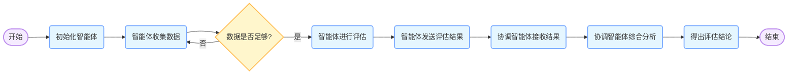

# 多智能体系统如何评估公司的数字化转型能力

> 关键词：多智能体系统、数字化转型能力、评估模型、智能决策、数据分析

> 摘要：本文围绕多智能体系统如何评估公司的数字化转型能力展开深入探讨。首先介绍多智能体系统及数字化转型能力的背景知识，阐述核心概念及相互联系，详细讲解相关核心算法原理与具体操作步骤。通过数学模型和公式进一步剖析评估过程，结合项目实战给出代码实际案例及解释说明。分析多智能体系统评估在不同实际应用场景中的作用，推荐相关学习资源、开发工具框架和论文著作。最后总结未来发展趋势与挑战，解答常见问题并提供扩展阅读和参考资料，旨在为公司利用多智能体系统评估数字化转型能力提供全面且深入的技术指导。

## 1. 背景介绍 
### 1.1 目的和范围
随着数字化时代的到来，公司的数字化转型已成为提升竞争力和适应市场变化的关键举措。然而，如何准确、全面地评估公司的数字化转型能力是一个具有挑战性的问题。本研究的目的在于探讨多智能体系统在评估公司数字化转型能力方面的应用，通过多智能体系统的协同和智能决策能力，构建科学、合理的评估模型，为公司的数字化转型提供有效的指导和决策依据。

本研究的范围涵盖多智能体系统的基本原理、数字化转型能力的构成要素、评估模型的构建方法、算法实现以及实际应用场景等方面。旨在从理论和实践两个层面深入研究多智能体系统在公司数字化转型能力评估中的应用。

### 1.2 预期读者
本文的预期读者包括公司的高层管理人员、数字化转型项目负责人、信息技术专家、科研人员以及对多智能体系统和数字化转型感兴趣的相关人员。对于公司管理人员，本文可以帮助他们了解如何利用多智能体系统评估公司的数字化转型能力，从而制定合理的转型策略；对于信息技术专家和科研人员，本文提供了多智能体系统在数字化转型评估领域的技术实现和研究思路；对于其他感兴趣的人员，本文可以作为了解多智能体系统和数字化转型相关知识的参考资料。

### 1.3 文档结构概述
本文共分为十个部分。第一部分为背景介绍，阐述研究的目的、范围、预期读者和文档结构概述，并给出相关术语表；第二部分介绍多智能体系统和数字化转型能力的核心概念及相互联系，包括原理和架构的文本示意图及 Mermaid 流程图；第三部分详细讲解核心算法原理及具体操作步骤，通过 Python 源代码进行阐述；第四部分给出数学模型和公式，并进行详细讲解和举例说明；第五部分是项目实战，包括开发环境搭建、源代码详细实现和代码解读；第六部分分析多智能体系统评估在实际应用场景中的作用；第七部分推荐相关的学习资源、开发工具框架和论文著作；第八部分总结未来发展趋势与挑战；第九部分是附录，解答常见问题；第十部分提供扩展阅读和参考资料。

### 1.4 术语表
#### 1.4.1 核心术语定义
- **多智能体系统（Multi - Agent System, MAS）**：由多个智能体组成的系统，智能体之间可以通过通信、协作和竞争等方式进行交互，共同完成复杂的任务。
- **数字化转型能力**：公司在数字化时代中，利用信息技术和数字资源，对业务流程、组织架构、商业模式等进行全面变革和创新，以提升竞争力和适应市场变化的能力。
- **智能体（Agent）**：具有自主性、反应性、社会性和主动性等特性的实体，能够感知环境、做出决策并执行相应的动作。
- **评估模型**：用于评估公司数字化转型能力的数学模型或逻辑框架，通过对相关指标的量化和分析，得出评估结果。

#### 1.4.2 相关概念解释
- **自主性**：智能体能够在没有外界干预的情况下，独立地完成任务和做出决策。
- **反应性**：智能体能够对环境的变化做出及时的响应。
- **社会性**：智能体能够与其他智能体进行通信和协作，共同完成任务。
- **主动性**：智能体能够主动地发起行动，以实现自身的目标。

#### 1.4.3 缩略词列表
- **MAS**：Multi - Agent System（多智能体系统）
- **AI**：Artificial Intelligence（人工智能）
- **ML**：Machine Learning（机器学习）

## 2. 核心概念与联系 
### 2.1 多智能体系统原理
多智能体系统由多个智能体组成，每个智能体都具有一定的感知、决策和执行能力。智能体之间通过通信机制进行信息交换和协作，以实现共同的目标。智能体的基本结构包括感知模块、决策模块和执行模块。感知模块用于获取环境信息，决策模块根据感知到的信息和自身的目标做出决策，执行模块则执行决策模块给出的动作。

多智能体系统的协作方式主要有合作、竞争和协调等。在合作中，智能体共同努力实现一个共同的目标；在竞争中，智能体为了自身的利益而相互竞争；在协调中，智能体通过协商和调整自己的行为，以避免冲突和实现整体的最优。

### 2.2 数字化转型能力构成要素
公司的数字化转型能力主要包括以下几个方面：
- **战略规划能力**：公司制定数字化转型战略的能力，包括明确转型目标、制定转型计划和资源配置等。
- **技术应用能力**：公司应用信息技术和数字资源的能力，包括大数据、人工智能、云计算等技术的应用。
- **组织管理能力**：公司在数字化转型过程中进行组织架构调整、流程优化和人员管理的能力。
- **创新能力**：公司在数字化时代中进行业务创新、产品创新和商业模式创新的能力。
- **数据管理能力**：公司对数据的采集、存储、分析和利用的能力。

### 2.3 多智能体系统与数字化转型能力评估的联系
多智能体系统可以通过对数字化转型能力的各个构成要素进行评估，实现对公司数字化转型能力的全面评估。每个智能体可以负责评估一个或多个构成要素，通过智能体之间的通信和协作，整合各个智能体的评估结果，得出最终的评估结论。

例如，一个智能体可以负责评估公司的技术应用能力，通过收集公司在信息技术应用方面的数据，如技术投入、技术创新成果等，进行分析和评估；另一个智能体可以负责评估公司的组织管理能力，通过调查公司的组织架构、流程优化情况等进行评估。最后，各个智能体将评估结果发送给一个协调智能体，由协调智能体进行综合分析和处理，得出公司数字化转型能力的整体评估结果。

### 2.4 核心概念原理和架构的文本示意图
多智能体系统评估公司数字化转型能力的架构主要包括以下几个部分：
- **智能体层**：由多个智能体组成，每个智能体负责评估数字化转型能力的一个或多个构成要素。
- **通信层**：负责智能体之间的信息交换和通信，确保智能体之间能够协同工作。
- **协调层**：负责整合各个智能体的评估结果，进行综合分析和处理，得出最终的评估结论。
- **数据层**：存储评估所需的数据，包括公司的业务数据、技术数据、组织管理数据等。

### 2.5 Mermaid 流程图


## 3. 核心算法原理 & 具体操作步骤 
### 3.1 核心算法原理
多智能体系统评估公司数字化转型能力的核心算法主要包括数据采集算法、评估算法和综合分析算法。

#### 3.1.1 数据采集算法
数据采集算法用于智能体收集评估所需的数据。智能体可以通过多种方式采集数据，如网络爬虫、数据库查询、传感器数据采集等。在采集数据时，智能体需要根据评估的需求，选择合适的数据来源和采集方法。

以下是一个简单的 Python 示例，演示如何使用网络爬虫采集网页数据：
```python
import requests
from bs4 import BeautifulSoup

def get_web_data(url):
    try:
        response = requests.get(url)
        response.raise_for_status()
        response.encoding = response.apparent_encoding
        soup = BeautifulSoup(response.text, 'html.parser')
        # 这里可以根据具体需求提取数据
        data = soup.get_text()
        return data
    except Exception as e:
        print(f"数据采集失败: {e}")
        return None
```

#### 3.1.2 评估算法
评估算法用于智能体根据采集到的数据对数字化转型能力的构成要素进行评估。评估算法可以采用多种方法，如层次分析法、模糊综合评价法、神经网络等。

以下是一个简单的基于层次分析法的评估算法示例：
```python
import numpy as np

def ahp_evaluation(criteria_matrix):
    # 计算特征向量和特征值
    eigenvalues, eigenvectors = np.linalg.eig(criteria_matrix)
    max_eigenvalue = max(eigenvalues)
    index = np.argmax(eigenvalues)
    eigenvector = eigenvectors[:, index]
    # 归一化特征向量
    weight_vector = eigenvector / np.sum(eigenvector)
    return weight_vector.real
```

#### 3.1.3 综合分析算法
综合分析算法用于协调智能体整合各个智能体的评估结果，进行综合分析和处理，得出最终的评估结论。综合分析算法可以采用加权平均法、线性组合法等。

以下是一个简单的加权平均法示例：
```python
def weighted_average_analysis(evaluation_results, weights):
    result = np.dot(evaluation_results, weights)
    return result
```

### 3.2 具体操作步骤
#### 3.2.1 初始化智能体
根据数字化转型能力的构成要素，初始化相应的智能体。每个智能体需要设置自己的评估目标和任务。

#### 3.2.2 数据采集
智能体根据自己的任务，采集评估所需的数据。数据采集可以是实时的，也可以是批量的。

#### 3.2.3 数据预处理
对采集到的数据进行预处理，如数据清洗、数据转换、数据归一化等，以提高数据的质量和可用性。

#### 3.2.4 评估计算
智能体根据评估算法，对采集到的数据进行评估计算，得出各个构成要素的评估结果。

#### 3.2.5 结果发送
智能体将评估结果发送给协调智能体。

#### 3.2.6 综合分析
协调智能体接收各个智能体的评估结果，根据综合分析算法进行综合分析，得出最终的评估结论。

#### 3.2.7 结果输出
将最终的评估结论输出，为公司的数字化转型决策提供依据。

## 4. 数学模型和公式 & 详细讲解 & 举例说明 
### 4.1 层次分析法数学模型
层次分析法（Analytic Hierarchy Process, AHP）是一种将定性和定量分析相结合的决策方法。其基本思想是将复杂的问题分解为多个层次，通过比较各层次中元素的相对重要性，确定各元素的权重。

#### 4.1.1 构建判断矩阵
假设我们要评估数字化转型能力的三个构成要素：战略规划能力 $A_1$、技术应用能力 $A_2$ 和组织管理能力 $A_3$。我们可以通过专家打分的方式构建判断矩阵 $A$：
$$
A = 
\begin{bmatrix}
1 & a_{12} & a_{13} \\
a_{21} & 1 & a_{23} \\
a_{31} & a_{32} & 1
\end{bmatrix}
$$
其中，$a_{ij}$ 表示要素 $i$ 相对于要素 $j$ 的重要性程度，通常采用 1 - 9 标度法进行赋值，如 $a_{ij}=1$ 表示要素 $i$ 与要素 $j$ 同等重要，$a_{ij}=3$ 表示要素 $i$ 比要素 $j$ 稍微重要，$a_{ij}=9$ 表示要素 $i$ 比要素 $j$ 极其重要。

#### 4.1.2 计算特征向量和特征值
判断矩阵 $A$ 的特征方程为：
$$
|A - \lambda I| = 0
$$
其中，$\lambda$ 为特征值，$I$ 为单位矩阵。通过求解特征方程，得到最大特征值 $\lambda_{max}$ 和对应的特征向量 $W$。

#### 4.1.3 一致性检验
为了保证判断矩阵的一致性，需要进行一致性检验。一致性指标 $CI$ 定义为：
$$
CI = \frac{\lambda_{max} - n}{n - 1}
$$
其中，$n$ 为判断矩阵的阶数。随机一致性指标 $RI$ 可以通过查表得到。一致性比率 $CR$ 定义为：
$$
CR = \frac{CI}{RI}
$$
当 $CR < 0.1$ 时，认为判断矩阵具有满意的一致性；否则，需要重新调整判断矩阵。

#### 4.1.4 计算权重向量
将特征向量 $W$ 进行归一化处理，得到权重向量 $w$：
$$
w_i = \frac{W_i}{\sum_{j = 1}^{n} W_j}
$$
其中，$w_i$ 为要素 $i$ 的权重。

### 4.2 举例说明
假设我们通过专家打分得到判断矩阵 $A$ 如下：
$$
A = 
\begin{bmatrix}
1 & 3 & 5 \\
\frac{1}{3} & 1 & 3 \\
\frac{1}{5} & \frac{1}{3} & 1
\end{bmatrix}
$$
首先，计算特征值和特征向量：
```python
import numpy as np

A = np.array([[1, 3, 5], [1/3, 1, 3], [1/5, 1/3, 1]])
eigenvalues, eigenvectors = np.linalg.eig(A)
max_eigenvalue = max(eigenvalues)
index = np.argmax(eigenvalues)
eigenvector = eigenvectors[:, index]
```
然后，计算一致性指标 $CI$：
```python
n = A.shape[0]
CI = (max_eigenvalue - n) / (n - 1)
```
假设 $RI = 0.58$（$n = 3$ 时），计算一致性比率 $CR$：
```python
RI = 0.58
CR = CI / RI
```
最后，计算权重向量：
```python
weight_vector = eigenvector / np.sum(eigenvector)
print("权重向量:", weight_vector.real)
```

## 5. 项目实战：代码实际案例和详细解释说明 
### 5.1  开发环境搭建
#### 5.1.1 安装 Python
首先，需要安装 Python 开发环境。可以从 Python 官方网站（https://www.python.org/downloads/） 下载适合自己操作系统的 Python 版本，并按照安装向导进行安装。

#### 5.1.2 安装相关库
安装项目所需的 Python 库，如 `numpy`、`requests`、`beautifulsoup4` 等。可以使用 `pip` 命令进行安装：
```sh
pip install numpy requests beautifulsoup4
```

### 5.2  源代码详细实现和代码解读
以下是一个完整的多智能体系统评估公司数字化转型能力的 Python 代码示例：
```python
import numpy as np
import requests
from bs4 import BeautifulSoup

# 数据采集函数
def get_web_data(url):
    try:
        response = requests.get(url)
        response.raise_for_status()
        response.encoding = response.apparent_encoding
        soup = BeautifulSoup(response.text, 'html.parser')
        data = soup.get_text()
        return data
    except Exception as e:
        print(f"数据采集失败: {e}")
        return None

# 层次分析法评估函数
def ahp_evaluation(criteria_matrix):
    eigenvalues, eigenvectors = np.linalg.eig(criteria_matrix)
    max_eigenvalue = max(eigenvalues)
    index = np.argmax(eigenvalues)
    eigenvector = eigenvectors[:, index]
    weight_vector = eigenvector / np.sum(eigenvector)
    return weight_vector.real

# 加权平均综合分析函数
def weighted_average_analysis(evaluation_results, weights):
    result = np.dot(evaluation_results, weights)
    return result

# 主函数
def main():
    # 初始化判断矩阵
    criteria_matrix = np.array([[1, 3, 5], [1/3, 1, 3], [1/5, 1/3, 1]])
    # 计算权重向量
    weights = ahp_evaluation(criteria_matrix)
    print("权重向量:", weights)

    # 模拟数据采集
    data_sources = ["https://example.com/strategy", "https://example.com/technology", "https://example.com/organization"]
    evaluation_results = []
    for url in data_sources:
        data = get_web_data(url)
        # 这里可以根据具体需求对数据进行处理和评估
        # 为了简化，我们假设评估结果为随机值
        evaluation_result = np.random.rand()
        evaluation_results.append(evaluation_result)

    # 综合分析
    final_result = weighted_average_analysis(np.array(evaluation_results), weights)
    print("最终评估结果:", final_result)

if __name__ == "__main__":
    main()
```

### 5.3  代码解读与分析
- **数据采集函数 `get_web_data`**：该函数使用 `requests` 库发送 HTTP 请求，获取网页内容，并使用 `BeautifulSoup` 库对网页内容进行解析，提取文本数据。
- **层次分析法评估函数 `ahp_evaluation`**：该函数根据输入的判断矩阵，计算特征向量和特征值，进行一致性检验（示例中省略），并返回权重向量。
- **加权平均综合分析函数 `weighted_average_analysis`**：该函数根据输入的评估结果和权重向量，计算最终的评估结果。
- **主函数 `main`**：该函数是程序的入口点，首先初始化判断矩阵，计算权重向量；然后模拟数据采集过程，获取评估结果；最后进行综合分析，输出最终的评估结果。

## 6. 实际应用场景 
### 6.1 企业战略决策
多智能体系统评估公司数字化转型能力可以为企业的战略决策提供重要依据。通过对公司数字化转型能力的全面评估，企业可以了解自身的优势和劣势，制定合理的数字化转型战略。例如，如果评估结果显示公司的技术应用能力较弱，企业可以加大在技术研发和人才培养方面的投入；如果组织管理能力存在问题，企业可以进行组织架构调整和流程优化。

### 6.2 投资决策
投资者在进行投资决策时，需要了解公司的数字化转型能力。多智能体系统评估结果可以帮助投资者评估公司的发展潜力和风险，从而做出合理的投资决策。例如，如果一家公司的数字化转型能力较强，投资者可能更愿意对其进行投资；反之，如果公司的数字化转型能力较弱，投资者可能会谨慎考虑。

### 6.3 行业对标
企业可以通过多智能体系统评估自身的数字化转型能力，并与同行业的其他企业进行对标。通过对标，企业可以了解自己在行业中的地位，发现自身的差距，从而学习借鉴其他企业的先进经验，提升自己的数字化转型能力。

### 6.4 数字化转型项目评估
在数字化转型项目实施过程中，多智能体系统可以对项目的进展和效果进行评估。通过实时监测项目的各项指标，及时发现项目中存在的问题，并采取相应的措施进行调整，确保项目的顺利进行。

## 7. 工具和资源推荐
### 7.1 学习资源推荐
#### 7.1.1 书籍推荐
- 《多智能体系统导论》：全面介绍了多智能体系统的基本概念、理论和方法，是学习多智能体系统的经典教材。
- 《数字化转型：企业如何实现跨越式发展》：深入探讨了企业数字化转型的战略、方法和实践，为企业的数字化转型提供了有益的指导。
- 《人工智能：一种现代的方法》：涵盖了人工智能的各个领域，包括多智能体系统，是学习人工智能的权威书籍。

#### 7.1.2 在线课程
- Coursera 平台上的“Multi - Agent Systems”课程：由知名高校的教授授课，系统地介绍了多智能体系统的相关知识。
- edX 平台上的“Digital Transformation Strategy”课程：帮助学习者了解企业数字化转型的战略和方法。
- 中国大学 MOOC 平台上的“人工智能基础”课程：提供了人工智能的基础知识，包括多智能体系统的相关内容。

#### 7.1.3 技术博客和网站
- AI 研习社：提供了丰富的人工智能技术文章和案例，包括多智能体系统和数字化转型的相关内容。
- 机器之心：专注于人工智能领域的前沿技术和动态，有很多关于多智能体系统和数字化转型的深度报道。
- 开源中国：提供了大量的开源项目和技术文章，对于学习多智能体系统的开发和应用有很大的帮助。

### 7.2 开发工具框架推荐
#### 7.2.1 IDE和编辑器
- PyCharm：是一款专业的 Python 集成开发环境，提供了丰富的功能和插件，方便进行多智能体系统的开发。
- Visual Studio Code：是一款轻量级的代码编辑器，支持多种编程语言，有丰富的插件可以扩展功能，适合快速开发和调试多智能体系统。
- Jupyter Notebook：是一种交互式的开发环境，适合进行数据分析和算法实验，对于多智能体系统的研究和开发也非常有用。

#### 7.2.2 调试和性能分析工具
- pdb：是 Python 自带的调试工具，可以帮助开发者定位代码中的问题。
- cProfile：是 Python 标准库中的性能分析工具，可以分析代码的运行时间和函数调用情况，帮助优化代码性能。
- Py-Spy：是一个轻量级的 Python 性能分析工具，可以实时监控 Python 程序的性能。

#### 7.2.3 相关框架和库
- Mesa：是一个用于构建多智能体系统的 Python 框架，提供了丰富的工具和模型，方便快速开发多智能体系统。
- NumPy：是 Python 中用于科学计算的基础库，提供了高效的数组操作和数学函数，对于多智能体系统的算法实现非常有用。
- Pandas：是 Python 中用于数据处理和分析的库，提供了丰富的数据结构和数据处理方法，对于多智能体系统的数据采集和预处理有很大的帮助。

### 7.3 相关论文著作推荐
#### 7.3.1 经典论文
- “Multi - Agent Systems: A Modern Approach to Distributed Artificial Intelligence”：该论文系统地介绍了多智能体系统的基本概念、理论和方法，是多智能体系统领域的经典论文。
- “Digital Transformation: A Multidisciplinary Reflection and Research Agenda”：对数字化转型进行了多学科的反思和研究，提出了数字化转型的研究议程。
- “Agent - Based Modeling and Simulation: A Tutorial”：介绍了基于智能体的建模和仿真方法，对于多智能体系统的建模和仿真有很大的帮助。

#### 7.3.2 最新研究成果
- 关注顶级学术会议如 IJCAI（国际人工智能联合会议）、AAAI（美国人工智能协会会议）等的论文，这些会议上的论文反映了多智能体系统和数字化转型领域的最新研究成果。
- 阅读相关学术期刊如《Artificial Intelligence》、《ACM Transactions on Intelligent Systems and Technology》等上的论文，获取最新的研究动态。

#### 7.3.3 应用案例分析
- 分析一些知名企业的数字化转型案例，如亚马逊、谷歌、阿里巴巴等，了解它们在数字化转型过程中的经验和做法。
- 参考一些行业报告和研究机构的分析，如 Gartner、IDC 等发布的关于数字化转型的报告，获取行业的最新动态和应用案例。

## 8. 总结：未来发展趋势与挑战
### 8.1 未来发展趋势
#### 8.1.1 智能化程度不断提高
随着人工智能技术的不断发展，多智能体系统的智能化程度将不断提高。智能体将具备更强的感知、决策和学习能力，能够更好地适应复杂多变的环境。

#### 8.1.2 与其他技术深度融合
多智能体系统将与大数据、云计算、物联网等技术深度融合，形成更加复杂和强大的系统。例如，多智能体系统可以利用大数据进行数据分析和决策，通过云计算实现资源共享和协同计算，借助物联网实现对物理世界的感知和控制。

#### 8.1.3 应用领域不断拓展
多智能体系统在公司数字化转型能力评估中的应用将不断拓展到其他领域，如智能交通、智能医疗、智能家居等。在这些领域中，多智能体系统可以发挥其协同和智能决策的优势，解决复杂的问题。

### 8.2 挑战
#### 8.2.1 智能体的自主性和协作性
如何确保智能体的自主性和协作性是一个挑战。智能体需要在保证自身自主性的前提下，与其他智能体进行有效的协作，实现共同的目标。

#### 8.2.2 数据安全和隐私保护
在多智能体系统中，数据的安全和隐私保护至关重要。智能体在采集、处理和传输数据时，需要采取有效的措施保护数据的安全和隐私。

#### 8.2.3 系统的可扩展性和可靠性
随着多智能体系统的规模不断扩大，系统的可扩展性和可靠性成为一个挑战。需要设计合理的架构和算法，确保系统在大规模应用时能够保持高效和稳定。

## 9. 附录：常见问题与解答
### 9.1 多智能体系统评估公司数字化转型能力的准确性如何保证？
为了保证评估的准确性，需要从以下几个方面入手：
- **数据质量**：确保采集到的数据准确、完整、可靠。可以采用多种数据采集方法，对数据进行验证和清洗。
- **评估算法**：选择合适的评估算法，如层次分析法、模糊综合评价法等，并进行合理的参数设置和模型优化。
- **专家知识**：引入专家知识，对评估结果进行验证和调整，提高评估的准确性和可信度。

### 9.2 多智能体系统的开发难度大吗？
多智能体系统的开发难度取决于系统的复杂度和应用场景。对于简单的多智能体系统，可以使用现有的框架和库进行快速开发；对于复杂的多智能体系统，需要深入理解多智能体系统的理论和方法，掌握相关的编程技术和算法。

### 9.3 多智能体系统评估公司数字化转型能力需要哪些数据？
多智能体系统评估公司数字化转型能力需要的数据包括公司的战略规划数据、技术应用数据、组织管理数据、创新数据、数据管理数据等。具体的数据需求可以根据评估的目标和指标体系进行确定。

## 10. 扩展阅读 & 参考资料
### 10.1 扩展阅读
- 《智能系统中的多智能体理论与应用》：深入探讨了多智能体系统在智能系统中的应用，提供了更多的理论和实践案例。
- 《数字化企业：从战略到执行》：详细介绍了企业数字化转型的战略规划和执行方法，对于企业的数字化转型有很大的指导意义。
- 《多智能体机器学习：基础与前沿》：介绍了多智能体机器学习的相关知识，为多智能体系统的进一步发展提供了理论支持。

### 10.2 参考资料
- 相关学术论文和研究报告，如《Journal of Artificial Intelligence Research》、《Gartner Digital Transformation Hype Cycle》等。
- 行业标准和规范，如 ISO/IEC 30141《Information technology — Digital transformation management systems — Requirements with guidance for use》等。
- 开源项目和代码库，如 GitHub 上的多智能体系统相关项目。