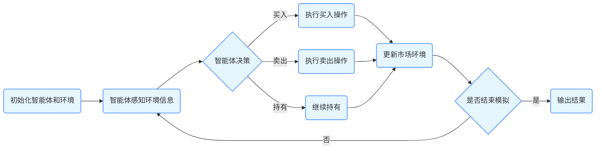

# 多智能体系统模拟投资者行为

> 关键词：多智能体系统、投资者行为模拟、人工智能、金融市场、复杂系统

> 摘要：本文围绕多智能体系统模拟投资者行为展开深入探讨。首先介绍了多智能体系统模拟投资者行为的背景和相关概念，包括目的、预期读者等。详细阐述了多智能体系统的核心概念、算法原理及具体操作步骤，通过Python代码进行了说明。还介绍了相关的数学模型和公式，并给出了实际案例进行分析。探讨了该模拟在金融市场等方面的实际应用场景，推荐了学习资源、开发工具框架以及相关论文著作。最后对未来发展趋势与挑战进行了总结，并提供了常见问题解答和参考资料，旨在为相关领域的研究和实践提供全面而深入的指导。

## 1. 背景介绍 
### 1.1 目的和范围
金融市场是一个复杂的系统，投资者的行为受到多种因素的影响，如个人心理、市场信息、宏观经济环境等。传统的金融理论往往基于一些简化的假设，难以准确描述投资者的真实行为和市场的动态变化。多智能体系统（Multi - Agent System，MAS）提供了一种新的研究视角，它可以模拟多个具有不同特征和行为规则的投资者在市场中的交互，从而更好地理解金融市场的运行机制和投资者行为的复杂性。

本文的范围主要包括多智能体系统模拟投资者行为的基本原理、算法实现、数学模型、实际应用案例等方面。通过这些内容，帮助读者全面了解如何利用多智能体系统来模拟投资者行为，并为相关的研究和实践提供参考。

### 1.2 预期读者
本文预期读者包括金融领域的研究人员、计算机科学领域对复杂系统模拟感兴趣的学者、金融机构的分析师和交易员，以及对人工智能和金融市场交叉领域有兴趣的学生和爱好者。

### 1.3 文档结构概述
本文首先介绍多智能体系统模拟投资者行为的背景信息，包括目的、预期读者和文档结构。接着阐述多智能体系统的核心概念及其联系，给出原理和架构的文本示意图与Mermaid流程图。然后详细讲解核心算法原理和具体操作步骤，并通过Python源代码进行说明。之后介绍相关的数学模型和公式，并举例说明。再通过项目实战给出代码实际案例和详细解释。随后探讨该模拟的实际应用场景。推荐相关的学习资源、开发工具框架和论文著作。最后总结未来发展趋势与挑战，提供常见问题解答和参考资料。

### 1.4 术语表
#### 1.4.1 核心术语定义
- **多智能体系统（Multi - Agent System，MAS）**：由多个智能体组成的系统，每个智能体具有一定的自治性、交互性和适应性，能够在一定的环境中自主地执行任务并与其他智能体进行交互。
- **智能体（Agent）**：具有感知、决策和行动能力的实体，在多智能体系统中，智能体可以表示投资者、市场参与者等。
- **投资者行为模拟**：通过建立模型和算法，模拟投资者在金融市场中的决策过程和行为表现。

#### 1.4.2 相关概念解释
- **自治性**：智能体能够独立地感知环境、做出决策并采取行动，不受其他智能体的直接控制。
- **交互性**：智能体之间可以通过某种通信机制进行信息交换和协作，以实现共同的目标或解决问题。
- **适应性**：智能体能够根据环境的变化和自身的经验调整自己的行为和策略。

#### 1.4.3 缩略词列表
- **MAS**：Multi - Agent System（多智能体系统）
- **AI**：Artificial Intelligence（人工智能）

## 2. 核心概念与联系 
### 核心概念原理
多智能体系统模拟投资者行为的核心思想是将投资者抽象为一个个智能体，每个智能体具有自己的特征、偏好和行为规则。这些智能体在一个虚拟的金融市场环境中进行交互，通过感知市场信息、分析其他智能体的行为，做出自己的投资决策。

智能体的特征可以包括投资者的风险偏好、投资经验、资金规模等。行为规则可以基于不同的投资理论和策略，如基本面分析、技术分析、行为金融学等。市场环境则包括股票价格、交易量、宏观经济数据等信息。

### 架构的文本示意图
多智能体系统模拟投资者行为的架构主要包括以下几个部分：
1. **智能体层**：由多个投资者智能体组成，每个智能体具有自己的内部状态和行为规则。
2. **环境层**：模拟金融市场环境，提供市场信息，如股票价格、交易量等。
3. **交互层**：负责智能体之间以及智能体与环境之间的信息交互和通信。
4. **决策层**：智能体根据感知到的信息和自身的行为规则做出投资决策。
5. **结果层**：记录智能体的投资决策和市场的运行结果，用于分析和评估。

### Mermaid 流程图


## 3. 核心算法原理 & 具体操作步骤 
### 核心算法原理
多智能体系统模拟投资者行为的核心算法主要包括智能体的感知、决策和行动三个部分。

#### 感知
智能体通过感知环境信息来了解市场的状态。这些信息可以包括股票价格、交易量、宏观经济数据等。在Python中，可以使用以下代码模拟智能体的感知过程：
```python
class Agent:
    def __init__(self):
        self.perceived_info = {}

    def perceive(self, market_info):
        # 模拟感知市场信息
        self.perceived_info = market_info
```

#### 决策
智能体根据感知到的信息和自身的行为规则做出投资决策。这里以一个简单的基于价格趋势的决策规则为例：如果股票价格上涨，则考虑买入；如果股票价格下跌，则考虑卖出。
```python
class Agent:
    def __init__(self):
        self.perceived_info = {}
        self.decision = None

    def perceive(self, market_info):
        self.perceived_info = market_info

    def make_decision(self):
        if 'stock_price' in self.perceived_info:
            price_trend = self.perceived_info.get('price_trend', 'stable')
            if price_trend == 'up':
                self.decision = 'buy'
            elif price_trend == 'down':
                self.decision = 'sell'
            else:
                self.decision = 'hold'
```

#### 行动
智能体根据决策结果执行相应的投资操作，如买入、卖出或持有股票。
```python
class Agent:
    def __init__(self):
        self.perceived_info = {}
        self.decision = None
        self.portfolio = []

    def perceive(self, market_info):
        self.perceived_info = market_info

    def make_decision(self):
        if 'stock_price' in self.perceived_info:
            price_trend = self.perceived_info.get('price_trend', 'stable')
            if price_trend == 'up':
                self.decision = 'buy'
            elif price_trend == 'down':
                self.decision = 'sell'
            else:
                self.decision = 'hold'

    def act(self):
        if self.decision == 'buy':
            # 模拟买入操作
            stock = self.perceived_info.get('stock', None)
            if stock:
                self.portfolio.append(stock)
        elif self.decision == 'sell':
            # 模拟卖出操作
            if self.portfolio:
                self.portfolio.pop()
```

### 具体操作步骤
1. **初始化**：创建多个投资者智能体和模拟的金融市场环境。
2. **循环模拟**：在每个模拟周期内，智能体感知市场信息，做出决策并执行相应的行动。
3. **更新环境**：根据智能体的行动结果更新市场环境，如股票价格、交易量等。
4. **判断结束条件**：判断是否达到模拟的结束条件，如达到指定的模拟周期数或满足特定的市场条件。
5. **输出结果**：输出智能体的投资决策和市场的运行结果，用于分析和评估。

以下是一个完整的模拟示例：
```python
# 模拟市场环境
market_info = {
    'stock': 'ABC',
    'stock_price': 100,
    'price_trend': 'up'
}

# 创建智能体
agent = Agent()

# 模拟过程
for _ in range(10):
    agent.perceive(market_info)
    agent.make_decision()
    agent.act()
    # 更新市场信息
    market_info['stock_price'] += 1
    if market_info['stock_price'] > 105:
        market_info['price_trend'] = 'down'
    else:
        market_info['price_trend'] = 'up'

# 输出结果
print("Agent's portfolio:", agent.portfolio)
```

## 4. 数学模型和公式 & 详细讲解 & 举例说明 
### 投资者效用函数
投资者的决策通常基于最大化自身的效用。一个常见的效用函数可以表示为：
$$U = E(R) - \frac{1}{2}A\sigma^2$$
其中，$U$ 表示投资者的效用，$E(R)$ 表示投资组合的预期收益率，$A$ 表示投资者的风险厌恶系数，$\sigma^2$ 表示投资组合的方差。

### 详细讲解
- **预期收益率 $E(R)$**：预期收益率是投资组合中各种资产收益率的加权平均值。假设投资组合中有 $n$ 种资产，第 $i$ 种资产的收益率为 $R_i$，权重为 $w_i$，则预期收益率可以表示为：
$$E(R)=\sum_{i = 1}^{n}w_iR_i$$
- **风险厌恶系数 $A$**：风险厌恶系数反映了投资者对风险的厌恶程度。$A$ 值越大，投资者越厌恶风险。
- **方差 $\sigma^2$**：方差衡量了投资组合收益率的波动程度。投资组合的方差可以表示为：
$$\sigma^2=\sum_{i = 1}^{n}\sum_{j = 1}^{n}w_iw_j\sigma_{ij}$$
其中，$\sigma_{ij}$ 表示第 $i$ 种资产和第 $j$ 种资产收益率的协方差。

### 举例说明
假设投资者有两种资产可以选择：股票和债券。股票的预期收益率为 $10\%$，方差为 $0.2$；债券的预期收益率为 $5\%$，方差为 $0.05$。两种资产收益率的协方差为 $0.01$。投资者的风险厌恶系数 $A = 2$。

设投资者投资股票的权重为 $w_1$，投资债券的权重为 $w_2 = 1 - w_1$。

预期收益率：
$$E(R)=w_1\times0.1+(1 - w_1)\times0.05=0.05 + 0.05w_1$$

方差：
$$\sigma^2=w_1^2\times0.2+(1 - w_1)^2\times0.05+2w_1(1 - w_1)\times0.01$$
$$=0.2w_1^2+0.05(1 - 2w_1+w_1^2)+0.02w_1(1 - w_1)$$
$$=0.2w_1^2+0.05 - 0.1w_1+0.05w_1^2+0.02w_1 - 0.02w_1^2$$
$$=0.23w_1^2 - 0.08w_1+0.05$$

效用函数：
$$U = 0.05 + 0.05w_1-\frac{1}{2}\times2\times(0.23w_1^2 - 0.08w_1+0.05)$$
$$=0.05 + 0.05w_1-(0.23w_1^2 - 0.08w_1+0.05)$$
$$=- 0.23w_1^2+0.13w_1$$

为了最大化效用，对 $U$ 求关于 $w_1$ 的导数并令其为 $0$：
$$U^\prime=-0.46w_1 + 0.13 = 0$$
解得 $w_1=\frac{0.13}{0.46}\approx0.28$，$w_2 = 1 - w_1\approx0.72$。

因此，投资者应该将 $28\%$ 的资金投资于股票，$72\%$ 的资金投资于债券，以最大化自身的效用。

## 5. 项目实战：代码实际案例和详细解释说明 
### 5.1  开发环境搭建
#### 编程语言
本文使用Python进行开发，Python是一种功能强大、易于学习的编程语言，拥有丰富的库和工具，适合用于多智能体系统的开发。

#### 开发工具
可以使用以下开发工具：
- **PyCharm**：一款专业的Python集成开发环境（IDE），提供了代码编辑、调试、版本控制等功能。
- **Jupyter Notebook**：一种交互式的开发环境，适合用于快速原型开发和数据分析。

#### 相关库
- **NumPy**：用于数值计算和数组操作。
- **Pandas**：用于数据处理和分析。
- **Matplotlib**：用于数据可视化。

可以使用以下命令安装这些库：
```sh
pip install numpy pandas matplotlib
```

### 5.2  源代码详细实现和代码解读
以下是一个更复杂的多智能体系统模拟投资者行为的代码示例：
```python
import numpy as np
import pandas as pd
import matplotlib.pyplot as plt

# 定义投资者智能体类
class InvestorAgent:
    def __init__(self, id, initial_funds, risk_aversion):
        self.id = id
        self.funds = initial_funds
        self.risk_aversion = risk_aversion
        self.portfolio = {}
        self.history = []

    def perceive(self, market_info):
        # 感知市场信息
        self.market_info = market_info

    def make_decision(self):
        # 简单的决策规则：根据价格趋势和风险偏好
        stock_price = self.market_info['stock_price']
        price_trend = self.market_info['price_trend']
        if price_trend == 'up' and self.funds > stock_price:
            # 买入
            self.funds -= stock_price
            if 'stock' in self.portfolio:
                self.portfolio['stock'] += 1
            else:
                self.portfolio['stock'] = 1
        elif price_trend == 'down' and 'stock' in self.portfolio and self.portfolio['stock'] > 0:
            # 卖出
            self.funds += stock_price
            self.portfolio['stock'] -= 1
        self.history.append(self.portfolio.copy())

    def act(self):
        # 执行决策
        pass

# 定义市场环境类
class MarketEnvironment:
    def __init__(self, initial_price):
        self.stock_price = initial_price
        self.price_trend = 'stable'
        self.history = []

    def update(self):
        # 更新市场价格和趋势
        change = np.random.normal(0, 1)
        self.stock_price += change
        if change > 0:
            self.price_trend = 'up'
        elif change < 0:
            self.price_trend = 'down'
        else:
            self.price_trend = 'stable'
        self.history.append(self.stock_price)

    def get_info(self):
        return {
            'stock_price': self.stock_price,
            'price_trend': self.price_trend
        }

# 模拟过程
def simulate(num_agents, initial_funds, initial_price, num_steps):
    # 创建投资者智能体
    agents = [InvestorAgent(i, initial_funds, np.random.uniform(0, 1)) for i in range(num_agents)]
    # 创建市场环境
    market = MarketEnvironment(initial_price)

    for step in range(num_steps):
        # 市场更新
        market.update()
        market_info = market.get_info()
        for agent in agents:
            # 智能体感知信息
            agent.perceive(market_info)
            # 智能体做出决策
            agent.make_decision()
            # 智能体执行决策
            agent.act()

    # 绘制市场价格历史
    plt.plot(market.history)
    plt.xlabel('Time Step')
    plt.ylabel('Stock Price')
    plt.title('Stock Price History')
    plt.show()

    # 绘制投资者投资组合历史
    for agent in agents:
        portfolio_history = [p.get('stock', 0) for p in agent.history]
        plt.plot(portfolio_history, label=f'Agent {agent.id}')
    plt.xlabel('Time Step')
    plt.ylabel('Number of Stocks in Portfolio')
    plt.title('Investor Portfolio History')
    plt.legend()
    plt.show()

# 运行模拟
simulate(num_agents=5, initial_funds=1000, initial_price=100, num_steps=100)
```

### 5.3  代码解读与分析
#### 投资者智能体类 `InvestorAgent`
- `__init__` 方法：初始化投资者的基本信息，包括ID、初始资金、风险厌恶系数、投资组合和历史记录。
- `perceive` 方法：感知市场信息，将市场信息存储在智能体的属性中。
- `make_decision` 方法：根据市场信息和简单的决策规则做出投资决策，更新投资组合和历史记录。
- `act` 方法：执行决策，这里暂时为空。

#### 市场环境类 `MarketEnvironment`
- `__init__` 方法：初始化市场的初始价格和价格趋势，以及历史记录。
- `update` 方法：更新市场价格和趋势，使用正态分布模拟价格的随机变化。
- `get_info` 方法：返回当前的市场信息。

#### 模拟过程函数 `simulate`
- 创建多个投资者智能体和市场环境。
- 在每个模拟步骤中，更新市场环境，让智能体感知信息、做出决策并执行决策。
- 绘制市场价格历史和投资者投资组合历史，用于可视化分析。

通过这个代码示例，可以看到多智能体系统如何模拟投资者在市场中的行为，以及市场价格和投资者投资组合的动态变化。

## 6. 实际应用场景 
### 金融市场研究
多智能体系统模拟投资者行为可以帮助研究人员更好地理解金融市场的运行机制和投资者行为的复杂性。通过模拟不同类型的投资者和市场环境，可以研究市场的稳定性、波动性、价格形成机制等问题，为金融理论的发展提供实证支持。

### 投资策略优化
投资者可以利用多智能体系统模拟不同的投资策略，评估其在不同市场环境下的表现。通过对模拟结果的分析，投资者可以优化自己的投资策略，提高投资收益和降低风险。

### 风险管理
金融机构可以使用多智能体系统模拟投资者行为，评估市场风险和信用风险。通过模拟不同的市场情景和投资者行为，可以预测市场的变化和风险的传播，为风险管理提供决策依据。

### 政策制定
政府和监管机构可以利用多智能体系统模拟投资者行为，评估金融政策的效果。通过模拟不同政策下投资者的行为和市场的反应，可以制定更加合理和有效的金融政策，维护金融市场的稳定和健康发展。

## 7. 工具和资源推荐
### 7.1 学习资源推荐
#### 7.1.1 书籍推荐
- 《多智能体系统》：介绍了多智能体系统的基本概念、理论和方法，是学习多智能体系统的经典教材。
- 《金融市场的行为与演化》：探讨了金融市场中投资者的行为和市场的演化过程，结合了行为金融学和复杂系统理论。
- 《Python数据分析实战》：介绍了Python在数据分析和金融领域的应用，对于使用Python实现多智能体系统模拟投资者行为有很大帮助。

#### 7.1.2 在线课程
- Coursera上的“Multi - Agent Systems”课程：由知名高校的教授授课，系统地介绍了多智能体系统的相关知识。
- edX上的“Behavioral Finance”课程：讲解了行为金融学的基本理论和应用，有助于理解投资者的行为。
- 网易云课堂上的“Python金融数据分析”课程：介绍了Python在金融数据分析中的应用，包括数据处理、可视化和建模等方面。

#### 7.1.3 技术博客和网站
- AI Time Hub：提供人工智能领域的最新研究成果和技术动态，包括多智能体系统的相关内容。
- 机器之心：关注人工智能、机器学习等领域的前沿技术，有很多关于复杂系统模拟和金融科技的文章。
- 知乎：在知乎上可以搜索到关于多智能体系统、投资者行为模拟等方面的讨论和经验分享。

### 7.2 开发工具框架推荐
#### 7.2.1 IDE和编辑器
- PyCharm：功能强大的Python集成开发环境，提供了代码编辑、调试、版本控制等功能，适合专业的Python开发。
- Jupyter Notebook：交互式的开发环境，适合快速原型开发和数据分析，方便代码的展示和分享。
- Visual Studio Code：轻量级的代码编辑器，支持多种编程语言，有丰富的插件可以扩展功能。

#### 7.2.2 调试和性能分析工具
- PySnooper：简单易用的调试工具，可以自动记录函数的执行过程和变量的值，方便调试代码。
- cProfile：Python内置的性能分析工具，可以分析代码的运行时间和函数调用次数，帮助优化代码性能。
- Memory Profiler：用于分析Python代码的内存使用情况，找出内存泄漏和性能瓶颈。

#### 7.2.3 相关框架和库
- Mesa：一个用于构建多智能体系统的Python框架，提供了丰富的工具和类库，方便快速开发多智能体系统。
- NetworkX：用于创建、操作和研究复杂网络的Python库，可以用于模拟智能体之间的交互网络。
- NumPy、Pandas、Matplotlib：用于数值计算、数据处理和可视化的Python库，在多智能体系统模拟中经常使用。

### 7.3 相关论文著作推荐
#### 7.3.1 经典论文
- “Agent - Based Computational Finance: Suggested Readings and Early Research”：该论文介绍了基于智能体的计算金融的基本概念和早期研究成果，是该领域的经典文献。
- “Heterogeneous Agents in Financial Markets: A Survey”：对金融市场中异质智能体的研究进行了综述，探讨了不同类型智能体的行为和市场的影响。
- “The Emergence of Cooperation Among Egoists Under Noisy Conditions”：研究了在噪声环境下利己主义者之间合作的出现，对于理解智能体之间的交互和合作有重要意义。

#### 7.3.2 最新研究成果
- 在《Journal of Financial Economics》《Review of Financial Studies》等金融领域的顶级期刊上可以找到关于多智能体系统模拟投资者行为的最新研究成果。
- 在人工智能和复杂系统领域的会议，如AAAI、IJCAI等，也会有相关的研究论文发表。

#### 7.3.3 应用案例分析
- 一些金融机构和研究机构会发布关于多智能体系统在金融市场应用的案例分析报告，可以通过它们的官方网站或相关数据库获取。
- 一些开源项目中也会有多智能体系统模拟投资者行为的实际应用案例，可以在GitHub等代码托管平台上搜索。

## 8. 总结：未来发展趋势与挑战
### 未来发展趋势
#### 与深度学习的融合
未来，多智能体系统模拟投资者行为可能会与深度学习技术相结合。深度学习可以用于处理复杂的市场信息，如文本数据、图像数据等，为智能体提供更全面的信息感知能力。同时，深度学习模型可以用于智能体的决策过程，提高决策的准确性和适应性。

#### 考虑更多的行为因素
目前的多智能体系统模拟投资者行为主要考虑了一些基本的行为因素，如风险偏好、价格趋势等。未来的研究可能会考虑更多的行为因素，如投资者的情绪、社会网络影响等，以更真实地模拟投资者的行为。

#### 大规模模拟和分布式计算
随着计算机技术的发展，未来可以进行更大规模的多智能体系统模拟，考虑更多的投资者和更复杂的市场环境。同时，分布式计算技术可以提高模拟的效率，加快模拟的速度。

### 挑战
#### 模型的复杂性和可解释性
多智能体系统模拟投资者行为的模型往往比较复杂，包含多个智能体和复杂的交互规则。这使得模型的理解和解释变得困难，需要进一步研究如何提高模型的可解释性。

#### 数据的获取和处理
准确的市场数据和投资者行为数据是多智能体系统模拟的基础。然而，数据的获取和处理往往面临着诸多困难，如数据的缺失、噪声、隐私等问题。需要研究如何有效地获取和处理数据，提高模拟的准确性。

#### 计算资源的需求
大规模的多智能体系统模拟需要大量的计算资源，包括计算能力、存储能力等。如何在有限的计算资源下进行高效的模拟是一个挑战，需要研究优化算法和分布式计算技术。

## 9. 附录：常见问题与解答
### 问题1：多智能体系统模拟投资者行为的准确性如何？
多智能体系统模拟投资者行为的准确性受到多种因素的影响，如模型的复杂度、数据的准确性、行为规则的合理性等。虽然多智能体系统可以模拟投资者的行为，但由于金融市场的复杂性和不确定性，模拟结果可能与实际情况存在一定的偏差。因此，在使用模拟结果进行决策时，需要谨慎考虑。

### 问题2：如何选择合适的智能体行为规则？
选择合适的智能体行为规则需要考虑多个因素，如投资者的类型、市场环境、研究目的等。可以参考金融理论和实证研究的结果，结合实际情况选择合适的行为规则。同时，也可以通过实验和优化来不断调整行为规则，提高模拟的准确性。

### 问题3：多智能体系统模拟投资者行为需要哪些数据？
多智能体系统模拟投资者行为需要的数据包括市场数据和投资者行为数据。市场数据可以包括股票价格、交易量、宏观经济数据等；投资者行为数据可以包括投资者的交易记录、风险偏好、投资经验等。数据的准确性和完整性对模拟结果有重要影响，因此需要尽可能获取准确和完整的数据。

### 问题4：如何评估多智能体系统模拟投资者行为的效果？
可以从多个方面评估多智能体系统模拟投资者行为的效果，如模拟结果与实际市场数据的拟合程度、投资者的收益和风险指标、市场的稳定性和波动性等。可以使用统计分析方法和机器学习算法对模拟结果进行评估和验证，以确定模拟的有效性和可靠性。

## 10. 扩展阅读 & 参考资料
### 扩展阅读
- 《复杂经济学：经济思想的新框架》：探讨了复杂系统理论在经济学中的应用，对于理解金融市场的复杂性和投资者行为有很大帮助。
- 《人工智能：一种现代的方法》：全面介绍了人工智能的基本概念、理论和方法，包括多智能体系统的相关内容。
- 《行为金融学通识》：系统地介绍了行为金融学的基本理论和应用，有助于深入理解投资者的行为。

### 参考资料
- 相关的学术论文和研究报告，如上述提到的经典论文和最新研究成果。
- 开源项目的文档和代码，如Mesa框架的官方文档和示例代码。
- 相关的书籍和在线课程，如上述推荐的学习资源。