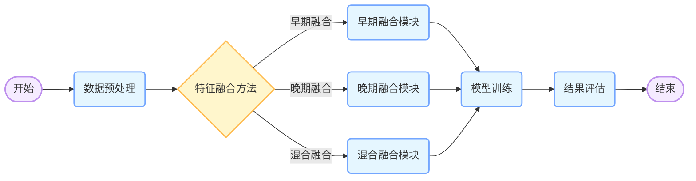

# 多模态融合:整合不同类型的输入数据

> 关键词：多模态融合、输入数据、数据整合、特征提取、深度学习

> 摘要：本文围绕多模态融合这一核心主题，深入探讨如何整合不同类型的输入数据。首先介绍了多模态融合的背景知识，包括目的、预期读者、文档结构等。接着阐述了核心概念与联系，通过文本示意图和 Mermaid 流程图直观展示其原理和架构。详细讲解了核心算法原理及具体操作步骤，并给出 Python 源代码示例。深入分析了相关数学模型和公式，通过举例说明其应用。结合项目实战，介绍了开发环境搭建、源代码实现与解读。探讨了多模态融合的实际应用场景，推荐了相关的学习资源、开发工具框架和论文著作。最后总结了未来发展趋势与挑战，提供了常见问题解答及扩展阅读参考资料，旨在为读者全面深入地了解多模态融合提供有力的技术支持。

## 1. 背景介绍 
### 1.1 目的和范围
在当今数字化时代，数据来源呈现出多样化的特点，不同类型的数据如文本、图像、音频、视频等蕴含着丰富的信息。多模态融合的目的在于将这些不同类型的输入数据进行有效的整合，挖掘出单一模态数据中难以发现的信息，从而提高数据处理和分析的准确性、全面性和可靠性。其范围涵盖了多个领域，如计算机视觉、自然语言处理、智能医疗、自动驾驶、智能家居等，旨在解决这些领域中复杂的问题，提升系统的智能水平和性能。

### 1.2 预期读者
本文预期读者包括计算机科学、人工智能、模式识别等相关专业的学生、研究人员，以及从事数据处理、机器学习、深度学习等领域的工程师和技术爱好者。对于希望深入了解多模态融合技术，掌握其原理和应用方法的读者具有较高的参考价值。

### 1.3 文档结构概述
本文将按照以下结构展开：首先介绍多模态融合的背景知识，包括目的、预期读者和文档结构等内容；接着阐述多模态融合的核心概念与联系，通过文本示意图和 Mermaid 流程图直观展示其原理和架构；详细讲解核心算法原理及具体操作步骤，并给出 Python 源代码示例；深入分析相关数学模型和公式，通过举例说明其应用；结合项目实战，介绍开发环境搭建、源代码实现与解读；探讨多模态融合的实际应用场景；推荐相关的学习资源、开发工具框架和论文著作；最后总结未来发展趋势与挑战，提供常见问题解答及扩展阅读参考资料。

### 1.4 术语表
#### 1.4.1 核心术语定义
- **多模态数据**：指来自不同数据源、具有不同表示形式的数据，如文本、图像、音频、视频等。
- **多模态融合**：将不同模态的数据进行整合，以获取更全面、准确的信息，提高系统的性能和智能水平。
- **特征提取**：从原始数据中提取出具有代表性和区分性的特征，以便后续的处理和分析。
- **深度学习**：一种基于人工神经网络的机器学习方法，能够自动从大量数据中学习到复杂的模式和特征。

#### 1.4.2 相关概念解释
- **模态互补性**：不同模态的数据具有各自的特点和优势，它们之间相互补充，能够提供更丰富的信息。例如，图像数据可以直观地展示物体的外观特征，而文本数据可以提供关于物体的详细描述。
- **数据对齐**：在多模态融合中，需要将不同模态的数据在时间、空间或语义等方面进行对齐，以便进行有效的整合。例如，在处理视频和音频数据时，需要确保它们在时间上同步。

#### 1.4.3 缩略词列表
- **CNN**：Convolutional Neural Network，卷积神经网络
- **RNN**：Recurrent Neural Network，循环神经网络
- **LSTM**：Long Short-Term Memory，长短期记忆网络
- **GRU**：Gated Recurrent Unit，门控循环单元
- **Transformer**：一种基于注意力机制的深度学习模型

## 2. 核心概念与联系 
### 核心概念原理
多模态融合的核心思想是将不同模态的数据进行整合，以充分利用各模态数据的互补性，挖掘出更全面、准确的信息。其原理主要基于以下几点：
- **数据互补性**：不同模态的数据具有各自独特的信息，通过融合可以弥补单一模态数据的不足。例如，在图像分类任务中，图像数据可以提供物体的外观特征，而文本数据可以提供关于物体的语义信息，两者融合可以提高分类的准确性。
- **特征交互**：不同模态的数据在特征层面上可能存在相互作用和影响。通过融合不同模态的特征，可以捕捉到更复杂的模式和关系，从而提高模型的性能。
- **联合表示学习**：通过构建合适的模型，学习不同模态数据的联合表示，使得融合后的数据能够在一个统一的特征空间中进行处理和分析。

### 架构的文本示意图
多模态融合的架构通常包括以下几个主要部分：
1. **数据预处理**：对不同模态的数据进行清洗、归一化、特征提取等操作，以提高数据的质量和可用性。
2. **特征融合**：将不同模态的特征进行融合，可以采用早期融合、晚期融合、混合融合等方法。
3. **模型训练**：使用融合后的特征训练机器学习或深度学习模型，以完成具体的任务，如分类、回归、预测等。
4. **结果评估**：对训练好的模型进行评估，使用合适的指标来衡量模型的性能，如准确率、召回率、F1 值等。

### Mermaid 流程图


## 3. 核心算法原理 & 具体操作步骤 
### 核心算法原理
多模态融合的核心算法主要包括特征提取算法和融合算法。常见的特征提取算法有卷积神经网络（CNN）用于图像特征提取，循环神经网络（RNN）及其变体（如 LSTM、GRU）用于文本和序列数据特征提取，Transformer 模型用于处理各种模态的数据。融合算法主要有以下几种：
- **早期融合**：在数据预处理阶段将不同模态的数据直接拼接在一起，然后输入到一个统一的模型中进行处理。这种方法简单直接，但可能会忽略不同模态数据之间的差异。
- **晚期融合**：分别对不同模态的数据进行特征提取和模型训练，然后将各个模型的输出进行融合，得到最终的结果。这种方法可以充分利用各模态数据的特点，但可能会增加模型的复杂度。
- **混合融合**：结合了早期融合和晚期融合的优点，在不同阶段进行部分融合，以达到更好的融合效果。

### 具体操作步骤
1. **数据收集**：收集不同模态的输入数据，如文本、图像、音频等。
2. **数据预处理**：对收集到的数据进行清洗、归一化、特征提取等操作。例如，对于图像数据，可以使用 CNN 提取特征；对于文本数据，可以使用词嵌入技术将文本转换为向量表示。
3. **特征融合**：根据具体的任务和数据特点选择合适的融合方法，将不同模态的特征进行融合。
4. **模型训练**：使用融合后的特征训练机器学习或深度学习模型，如分类器、回归器等。
5. **模型评估**：使用测试数据对训练好的模型进行评估，使用合适的指标来衡量模型的性能。

### Python 源代码示例
以下是一个简单的早期融合示例，使用 Python 和 PyTorch 库：

```python
import torch
import torch.nn as nn
import torch.optim as optim

# 定义图像特征提取模型
class ImageFeatureExtractor(nn.Module):
    def __init__(self):
        super(ImageFeatureExtractor, self).__init__()
        self.conv1 = nn.Conv2d(3, 16, kernel_size=3, padding=1)
        self.relu = nn.ReLU()
        self.pool = nn.MaxPool2d(2, 2)
        self.fc1 = nn.Linear(16 * 16 * 16, 128)

    def forward(self, x):
        x = self.pool(self.relu(self.conv1(x)))
        x = x.view(-1, 16 * 16 * 16)
        x = self.relu(self.fc1(x))
        return x

# 定义文本特征提取模型
class TextFeatureExtractor(nn.Module):
    def __init__(self):
        super(TextFeatureExtractor, self).__init__()
        self.fc1 = nn.Linear(100, 128)
        self.relu = nn.ReLU()

    def forward(self, x):
        x = self.relu(self.fc1(x))
        return x

# 定义融合模型
class FusionModel(nn.Module):
    def __init__(self):
        super(FusionModel, self).__init__()
        self.image_extractor = ImageFeatureExtractor()
        self.text_extractor = TextFeatureExtractor()
        self.fc1 = nn.Linear(256, 128)
        self.fc2 = nn.Linear(128, 10)
        self.relu = nn.ReLU()

    def forward(self, image, text):
        image_features = self.image_extractor(image)
        text_features = self.text_extractor(text)
        combined_features = torch.cat((image_features, text_features), dim=1)
        x = self.relu(self.fc1(combined_features))
        x = self.fc2(x)
        return x

# 初始化模型
model = FusionModel()

# 定义损失函数和优化器
criterion = nn.CrossEntropyLoss()
optimizer = optim.Adam(model.parameters(), lr=0.001)

# 模拟训练数据
image_data = torch.randn(10, 3, 32, 32)
text_data = torch.randn(10, 100)
labels = torch.randint(0, 10, (10,))

# 训练模型
for epoch in range(10):
    optimizer.zero_grad()
    outputs = model(image_data, text_data)
    loss = criterion(outputs, labels)
    loss.backward()
    optimizer.step()
    print(f'Epoch {epoch+1}, Loss: {loss.item()}')
```

## 4. 数学模型和公式 & 详细讲解 & 举例说明 
### 数学模型
多模态融合的数学模型可以表示为一个函数 $F$，它将不同模态的数据 $X_1, X_2, \cdots, X_n$ 融合成一个统一的表示 $Y$：

$$Y = F(X_1, X_2, \cdots, X_n)$$

其中，$X_i$ 表示第 $i$ 个模态的数据，$n$ 表示模态的数量。

### 公式详细讲解
- **早期融合**：早期融合通常采用简单的拼接操作，将不同模态的特征向量直接连接在一起。假设 $x_1 \in \mathbb{R}^{d_1}$ 和 $x_2 \in \mathbb{R}^{d_2}$ 分别是两个模态的特征向量，则融合后的特征向量 $y$ 可以表示为：

$$y = [x_1; x_2] \in \mathbb{R}^{d_1 + d_2}$$

其中，$[x_1; x_2]$ 表示将 $x_1$ 和 $x_2$ 按列拼接在一起。

- **晚期融合**：晚期融合通常采用加权求和的方法，将各个模型的输出进行融合。假设 $o_1 \in \mathbb{R}^{k}$ 和 $o_2 \in \mathbb{R}^{k}$ 分别是两个模型的输出，$\alpha$ 和 $\beta$ 是权重系数，且 $\alpha + \beta = 1$，则融合后的输出 $y$ 可以表示为：

$$y = \alpha o_1 + \beta o_2$$

### 举例说明
假设我们有一个图像分类任务，同时使用图像数据和文本描述数据。图像数据经过 CNN 提取特征后得到一个 128 维的特征向量 $x_1$，文本数据经过词嵌入和 RNN 处理后得到一个 128 维的特征向量 $x_2$。

- **早期融合**：将 $x_1$ 和 $x_2$ 直接拼接在一起，得到一个 256 维的特征向量 $y = [x_1; x_2]$，然后将 $y$ 输入到一个全连接层进行分类。
- **晚期融合**：分别使用图像特征 $x_1$ 和文本特征 $x_2$ 训练两个分类器，得到两个分类结果 $o_1$ 和 $o_2$。假设 $\alpha = 0.6$，$\beta = 0.4$，则最终的分类结果 $y = 0.6o_1 + 0.4o_2$。

## 5. 项目实战：代码实际案例和详细解释说明 
### 5.1  开发环境搭建
- **操作系统**：推荐使用 Linux 或 macOS 系统，也可以使用 Windows 系统。
- **编程语言**：Python 3.x
- **深度学习框架**：PyTorch 或 TensorFlow
- **其他库**：NumPy、Pandas、Matplotlib 等

以下是安装 PyTorch 的示例命令：
```bash
pip install torch torchvision
```

### 5.2  源代码详细实现和代码解读
我们以一个多模态情感分析任务为例，结合图像和文本数据进行情感分类。

```python
import torch
import torch.nn as nn
import torch.optim as optim
from torch.utils.data import Dataset, DataLoader
import numpy as np
import pandas as pd

# 定义数据集类
class MultiModalDataset(Dataset):
    def __init__(self, image_data, text_data, labels):
        self.image_data = image_data
        self.text_data = text_data
        self.labels = labels

    def __len__(self):
        return len(self.labels)

    def __getitem__(self, idx):
        image = self.image_data[idx]
        text = self.text_data[idx]
        label = self.labels[idx]
        return image, text, label

# 定义图像特征提取模型
class ImageFeatureExtractor(nn.Module):
    def __init__(self):
        super(ImageFeatureExtractor, self).__init__()
        self.conv1 = nn.Conv2d(3, 16, kernel_size=3, padding=1)
        self.relu = nn.ReLU()
        self.pool = nn.MaxPool2d(2, 2)
        self.fc1 = nn.Linear(16 * 16 * 16, 128)

    def forward(self, x):
        x = self.pool(self.relu(self.conv1(x)))
        x = x.view(-1, 16 * 16 * 16)
        x = self.relu(self.fc1(x))
        return x

# 定义文本特征提取模型
class TextFeatureExtractor(nn.Module):
    def __init__(self):
        super(TextFeatureExtractor, self).__init__()
        self.fc1 = nn.Linear(100, 128)
        self.relu = nn.ReLU()

    def forward(self, x):
        x = self.relu(self.fc1(x))
        return x

# 定义融合模型
class FusionModel(nn.Module):
    def __init__(self):
        super(FusionModel, self).__init__()
        self.image_extractor = ImageFeatureExtractor()
        self.text_extractor = TextFeatureExtractor()
        self.fc1 = nn.Linear(256, 128)
        self.fc2 = nn.Linear(128, 2)
        self.relu = nn.ReLU()

    def forward(self, image, text):
        image_features = self.image_extractor(image)
        text_features = self.text_extractor(text)
        combined_features = torch.cat((image_features, text_features), dim=1)
        x = self.relu(self.fc1(combined_features))
        x = self.fc2(x)
        return x

# 模拟数据
image_data = np.random.randn(100, 3, 32, 32).astype(np.float32)
text_data = np.random.randn(100, 100).astype(np.float32)
labels = np.random.randint(0, 2, 100)

# 创建数据集和数据加载器
dataset = MultiModalDataset(image_data, text_data, labels)
dataloader = DataLoader(dataset, batch_size=10, shuffle=True)

# 初始化模型
model = FusionModel()

# 定义损失函数和优化器
criterion = nn.CrossEntropyLoss()
optimizer = optim.Adam(model.parameters(), lr=0.001)

# 训练模型
num_epochs = 10
for epoch in range(num_epochs):
    running_loss = 0.0
    for images, texts, labels in dataloader:
        optimizer.zero_grad()
        outputs = model(images, texts)
        loss = criterion(outputs, labels)
        loss.backward()
        optimizer.step()
        running_loss += loss.item()
    print(f'Epoch {epoch+1}, Loss: {running_loss / len(dataloader)}')
```

### 5.3  代码解读与分析
- **数据集类**：`MultiModalDataset` 类继承自 `torch.utils.data.Dataset`，用于封装多模态数据。`__getitem__` 方法返回一个样本的图像、文本和标签。
- **特征提取模型**：`ImageFeatureExtractor` 类和 `TextFeatureExtractor` 类分别用于提取图像和文本的特征。
- **融合模型**：`FusionModel` 类将图像和文本的特征进行融合，然后通过全连接层进行分类。
- **训练过程**：使用 `DataLoader` 加载数据，通过 `Adam` 优化器和交叉熵损失函数进行模型训练。

## 6. 实际应用场景 
### 智能医疗
在智能医疗领域，多模态融合可以整合患者的病历文本、医学影像（如 X 光、CT、MRI 等）、生理信号（如心电图、脑电图等）等多种数据，辅助医生进行疾病诊断、治疗方案制定和病情预测。例如，结合病历文本中的症状描述和医学影像中的病变特征，可以更准确地诊断疾病。

### 自动驾驶
在自动驾驶中，多模态融合可以将摄像头图像、激光雷达点云、毫米波雷达数据等进行整合，提高环境感知的准确性和可靠性。例如，通过融合图像和点云数据，可以更精确地识别道路、车辆、行人等目标，为自动驾驶决策提供更全面的信息。

### 智能家居
在智能家居系统中，多模态融合可以整合语音指令、图像识别、传感器数据等多种输入，实现更智能、便捷的家居控制。例如，用户可以通过语音指令控制家电设备，同时系统可以通过图像识别检测用户的行为和状态，提供个性化的服务。

### 智能教育
在智能教育领域，多模态融合可以结合学生的学习日志、考试成绩、课堂表现视频等多种数据，对学生的学习情况进行全面评估和分析，为学生提供个性化的学习建议和辅导。例如，通过分析学生的学习日志和课堂表现视频，可以了解学生的学习习惯和问题，针对性地进行教学。

## 7. 工具和资源推荐
### 7.1 学习资源推荐
#### 7.1.1 书籍推荐
- 《深度学习》（Deep Learning）：由 Ian Goodfellow、Yoshua Bengio 和 Aaron Courville 合著，是深度学习领域的经典教材，涵盖了多模态学习的相关内容。
- 《模式识别与机器学习》（Pattern Recognition and Machine Learning）：由 Christopher M. Bishop 著，介绍了模式识别和机器学习的基本原理和方法，对多模态融合的理论基础有一定的帮助。

#### 7.1.2 在线课程
- Coursera 上的“深度学习专项课程”（Deep Learning Specialization）：由 Andrew Ng 教授授课，包含多个深度学习相关的课程，对多模态学习有一定的涉及。
- edX 上的“人工智能基础”（Fundamentals of Artificial Intelligence）：介绍了人工智能的基本概念和方法，包括多模态融合的相关内容。

#### 7.1.3 技术博客和网站
- Medium 上的 Towards Data Science：有很多关于多模态学习和深度学习的技术文章和案例分享。
- arXiv.org：提供了大量的学术论文，包括多模态融合领域的最新研究成果。

### 7.2 开发工具框架推荐
#### 7.2.1 IDE和编辑器
- PyCharm：功能强大的 Python 集成开发环境，提供了丰富的代码编辑、调试和分析工具。
- Jupyter Notebook：交互式的开发环境，适合进行数据探索、模型实验和代码演示。

#### 7.2.2 调试和性能分析工具
- TensorBoard：TensorFlow 提供的可视化工具，可以用于查看模型的训练过程、性能指标等。
- PyTorch Profiler：PyTorch 提供的性能分析工具，可以帮助用户分析模型的性能瓶颈。

#### 7.2.3 相关框架和库
- PyTorch：开源的深度学习框架，提供了丰富的神经网络层和优化算法，方便进行多模态融合模型的开发。
- TensorFlow：另一个流行的深度学习框架，具有强大的分布式训练和部署能力。
- Transformers：Hugging Face 开发的自然语言处理库，提供了多种预训练的 Transformer 模型，可用于文本特征提取。

### 7.3 相关论文著作推荐
#### 7.3.1 经典论文
- “Multimodal Machine Learning: A Survey and Taxonomy”：对多模态机器学习进行了全面的综述和分类，介绍了多模态融合的基本概念、方法和应用。
- “Show, Attend and Tell: Neural Image Caption Generation with Visual Attention”：提出了一种基于注意力机制的图像描述生成方法，是多模态学习领域的经典论文。

#### 7.3.2 最新研究成果
- 关注 arXiv.org 上关于多模态融合的最新论文，了解该领域的前沿研究动态。
- 参加相关的学术会议，如 CVPR、ICML、NeurIPS 等，获取最新的研究成果。

#### 7.3.3 应用案例分析
- 可以在 IEEE Xplore、ACM Digital Library 等数据库中查找多模态融合在不同领域的应用案例，学习其实现方法和经验。

## 8. 总结：未来发展趋势与挑战
### 未来发展趋势
- **更复杂的融合模型**：随着深度学习技术的不断发展，未来的多模态融合模型将更加复杂和强大，能够处理更复杂的多模态数据和任务。例如，结合多种注意力机制、图神经网络等技术，提高模型的性能和可解释性。
- **跨模态迁移学习**：通过跨模态迁移学习，将一个模态的知识迁移到另一个模态，提高模型的泛化能力和学习效率。例如，将图像领域的预训练模型迁移到文本或音频领域。
- **多模态生成**：未来的多模态融合技术将不仅限于分类、回归等任务，还将在多模态生成领域取得重要进展。例如，生成包含图像、文本和音频的多模态内容。

### 挑战
- **数据对齐问题**：不同模态的数据在时间、空间或语义等方面可能存在不一致性，如何有效地进行数据对齐是多模态融合面临的一个重要挑战。
- **计算资源需求**：多模态融合模型通常比较复杂，需要大量的计算资源和时间进行训练。如何优化模型结构和训练算法，降低计算资源需求是一个亟待解决的问题。
- **可解释性问题**：多模态融合模型的决策过程往往比较复杂，难以解释其决策依据。如何提高模型的可解释性，增强用户对模型的信任是一个重要的研究方向。

## 9. 附录：常见问题与解答
### 问题 1：多模态融合中如何选择合适的特征提取方法？
解答：选择合适的特征提取方法需要考虑数据的类型、特点和任务的需求。对于图像数据，常用的特征提取方法有 CNN；对于文本数据，常用的方法有词嵌入、RNN、Transformer 等。可以根据具体情况进行尝试和比较，选择性能最优的方法。

### 问题 2：多模态融合中如何处理缺失数据？
解答：处理缺失数据的方法有多种，如删除缺失数据、填充缺失值（如使用均值、中位数等）、使用生成模型生成缺失数据等。具体方法需要根据数据的特点和任务的需求进行选择。

### 问题 3：多模态融合模型的训练时间较长，如何优化？
解答：可以通过以下方法优化训练时间：使用更高效的硬件设备（如 GPU）、优化模型结构（如减少模型参数）、使用批量归一化等技术加速训练过程、采用分布式训练等方法并行计算。

## 10. 扩展阅读 & 参考资料
### 扩展阅读
- 《人工智能：一种现代的方法》（Artificial Intelligence: A Modern Approach）：全面介绍了人工智能的各个领域，包括多模态学习的相关内容。
- 《自然语言处理入门》（Natural Language Processing in Action）：介绍了自然语言处理的基本概念和方法，对多模态融合中的文本处理有一定的参考价值。

### 参考资料
- 相关学术论文和研究报告。
- 深度学习框架的官方文档和教程。
- 技术博客和论坛上的相关文章和讨论。