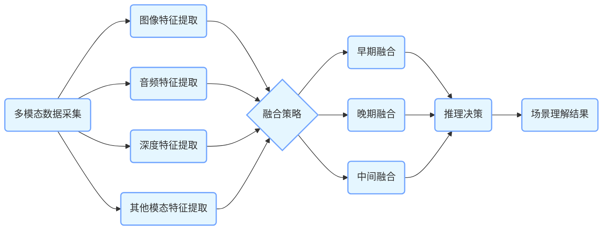

# 多模态融合推理在复杂场景理解中的新方法

> 关键词：多模态融合推理、复杂场景理解、多传感器数据、深度学习、跨模态交互、场景感知、推理决策

> 摘要：本文聚焦于多模态融合推理在复杂场景理解中的新方法。复杂场景理解是人工智能领域的重要挑战，单一模态数据往往难以全面准确地刻画场景信息。多模态融合推理通过整合多种不同类型的传感器数据，挖掘数据间的内在关联，为复杂场景理解提供了更有效的途径。文章详细阐述了多模态融合推理的核心概念、算法原理、数学模型，结合实际项目案例进行深入分析，探讨其在不同领域的应用场景，推荐相关学习资源、开发工具和研究论文，最后对多模态融合推理的未来发展趋势与挑战进行总结与展望。

## 1. 背景介绍 
### 1.1 目的和范围
复杂场景理解在自动驾驶、智能安防、智能家居等众多领域都具有至关重要的意义。然而，现实世界中的场景往往包含丰富多样的信息，如视觉、听觉、触觉等多种模态的数据。单一模态的数据在面对复杂场景时存在局限性，例如视觉数据可能受到光照、遮挡等因素的影响，听觉数据可能存在噪声干扰。多模态融合推理的目的在于整合多种模态的数据，充分发挥各模态数据的优势，提高对复杂场景的理解能力和推理准确性。

本文的范围涵盖多模态融合推理的基本概念、核心算法、数学模型、实际应用案例等方面，旨在全面介绍多模态融合推理在复杂场景理解中的新方法，为相关领域的研究和实践提供参考。

### 1.2 预期读者
本文预期读者包括人工智能、计算机科学、控制工程等领域的研究人员、工程师、研究生和高年级本科生。对于对多模态融合推理和复杂场景理解感兴趣的技术爱好者也具有一定的参考价值。

### 1.3 文档结构概述
本文首先介绍多模态融合推理的背景知识，包括目的、预期读者和文档结构概述。接着阐述多模态融合推理的核心概念与联系，通过文本示意图和 Mermaid 流程图进行详细说明。然后讲解核心算法原理和具体操作步骤，结合 Python 源代码进行阐述。之后介绍数学模型和公式，并通过举例进行详细讲解。再通过项目实战展示代码实际案例和详细解释说明。接着探讨多模态融合推理的实际应用场景。推荐相关的工具和资源，包括学习资源、开发工具框架和相关论文著作。最后总结多模态融合推理的未来发展趋势与挑战，并提供常见问题与解答和扩展阅读及参考资料。

### 1.4 术语表
#### 1.4.1 核心术语定义
- **多模态数据**：指来自不同传感器或数据源的多种类型的数据，如图像、音频、文本、深度信息等。
- **多模态融合推理**：将多种模态的数据进行整合，并基于整合后的数据进行推理决策的过程。
- **复杂场景理解**：对包含多种元素、动态变化且具有一定复杂性的场景进行感知、分析和理解的过程。
- **跨模态交互**：不同模态数据之间的相互作用和信息传递。

#### 1.4.2 相关概念解释
- **传感器融合**：将多个传感器的数据进行合并处理，以提高数据的准确性和可靠性。多模态融合推理是传感器融合的一种高级形式，不仅关注数据的合并，还注重对不同模态数据内在关联的挖掘和利用。
- **深度学习**：一种基于人工神经网络的机器学习方法，在多模态融合推理中常用于特征提取、数据表示和推理决策。

#### 1.4.3 缩略词列表
- **CNN**：Convolutional Neural Network，卷积神经网络
- **RNN**：Recurrent Neural Network，循环神经网络
- **LSTM**：Long Short - Term Memory，长短期记忆网络
- **GRU**：Gated Recurrent Unit，门控循环单元
- **RGB**：Red, Green, Blue，红绿蓝，用于表示彩色图像
- **LiDAR**：Light Detection and Ranging，激光雷达

## 2. 核心概念与联系 
### 核心概念原理
多模态融合推理的核心原理在于利用不同模态数据之间的互补性和相关性，通过融合多种模态的数据来获得更全面、准确的场景信息。不同模态的数据具有各自的特点和优势，例如图像数据能够提供丰富的视觉信息，音频数据可以反映环境中的声音特征，深度数据可以给出场景的三维结构信息。通过融合这些不同模态的数据，可以弥补单一模态数据的不足，提高对复杂场景的理解能力。

多模态融合推理通常包括以下几个关键步骤：
1. **数据采集**：使用不同类型的传感器采集多种模态的数据，如摄像头采集图像数据、麦克风采集音频数据、激光雷达采集深度数据等。
2. **特征提取**：对采集到的不同模态的数据进行特征提取，将原始数据转换为具有代表性的特征向量。常用的特征提取方法包括卷积神经网络（CNN）用于图像特征提取，循环神经网络（RNN）及其变体（如 LSTM、GRU）用于音频和文本特征提取。
3. **融合策略**：选择合适的融合策略将不同模态的特征进行融合。常见的融合策略包括早期融合、晚期融合和中间融合。
    - **早期融合**：在特征提取之前将不同模态的原始数据进行合并，然后一起进行特征提取和后续处理。
    - **晚期融合**：先对不同模态的数据分别进行特征提取和处理，最后在决策层将不同模态的结果进行融合。
    - **中间融合**：在特征提取过程中的某个中间阶段将不同模态的特征进行融合。
4. **推理决策**：基于融合后的特征进行推理决策，例如判断场景中的物体类别、预测事件的发生等。

### 架构的文本示意图
```plaintext
多模态融合推理架构

输入层：
|-- 图像数据（摄像头）
|-- 音频数据（麦克风）
|-- 深度数据（激光雷达）
|-- 其他模态数据（如文本、触觉等）

特征提取层：
|-- 图像特征提取（CNN）
|-- 音频特征提取（RNN/LSTM/GRU）
|-- 深度特征提取（自定义网络）
|-- 其他模态特征提取（对应网络）

融合层：
|-- 早期融合（原始数据合并）
|-- 晚期融合（特征结果合并）
|-- 中间融合（中间特征合并）

推理决策层：
|-- 分类器（如全连接网络）
|-- 回归器（如线性回归）
|-- 预测器（如循环预测网络）

输出层：
|-- 场景理解结果（物体类别、事件预测等）
```

### Mermaid 流程图


## 3. 核心算法原理 & 具体操作步骤 
### 核心算法原理
多模态融合推理的核心算法主要涉及特征提取、融合策略和推理决策三个方面。下面分别介绍这些方面的算法原理，并给出相应的 Python 源代码示例。

#### 特征提取
- **图像特征提取**：使用卷积神经网络（CNN）进行图像特征提取。以 ResNet 为例，ResNet 是一种深度残差网络，通过引入残差块解决了深度神经网络训练过程中的梯度消失和梯度爆炸问题。
```python
import torch
import torchvision.models as models

# 加载预训练的 ResNet 模型
resnet = models.resnet18(pretrained=True)
# 去掉最后一层全连接层，用于特征提取
feature_extractor = torch.nn.Sequential(*list(resnet.children())[:-1])

# 假设输入图像
image = torch.randn(1, 3, 224, 224)
# 提取图像特征
image_features = feature_extractor(image).squeeze()
print("图像特征形状:", image_features.shape)
```
- **音频特征提取**：使用循环神经网络（RNN）及其变体（如 LSTM、GRU）进行音频特征提取。以 LSTM 为例，LSTM 能够处理序列数据中的长期依赖关系。
```python
import torch
import torch.nn as nn

# 定义 LSTM 模型
class LSTMFeatureExtractor(nn.Module):
    def __init__(self, input_size, hidden_size, num_layers):
        super(LSTMFeatureExtractor, self).__init__()
        self.lstm = nn.LSTM(input_size, hidden_size, num_layers, batch_first=True)

    def forward(self, x):
        _, (h_n, _) = self.lstm(x)
        return h_n.squeeze()

# 假设输入音频特征序列
audio_sequence = torch.randn(1, 100, 128)
# 初始化 LSTM 特征提取器
lstm_extractor = LSTMFeatureExtractor(input_size=128, hidden_size=256, num_layers=2)
# 提取音频特征
audio_features = lstm_extractor(audio_sequence)
print("音频特征形状:", audio_features.shape)
```

#### 融合策略
- **早期融合**：将不同模态的原始数据进行合并，然后一起进行特征提取。
```python
import torch

# 假设图像数据和音频数据
image_data = torch.randn(1, 3, 224, 224)
audio_data = torch.randn(1, 100, 128)

# 早期融合：将图像数据和音频数据在某个维度上拼接
early_fused_data = torch.cat((image_data.view(1, -1), audio_data.view(1, -1)), dim=1)
print("早期融合数据形状:", early_fused_data.shape)
```
- **晚期融合**：先对不同模态的数据分别进行特征提取，最后在决策层将不同模态的特征进行融合。
```python
import torch
import torch.nn as nn

# 假设已经提取的图像特征和音频特征
image_features = torch.randn(1, 512)
audio_features = torch.randn(1, 256)

# 定义全连接层进行晚期融合
class LateFusionClassifier(nn.Module):
    def __init__(self, image_feature_size, audio_feature_size, output_size):
        super(LateFusionClassifier, self).__init__()
        self.fc = nn.Linear(image_feature_size + audio_feature_size, output_size)

    def forward(self, image_features, audio_features):
        fused_features = torch.cat((image_features, audio_features), dim=1)
        output = self.fc(fused_features)
        return output

# 初始化晚期融合分类器
late_fusion_classifier = LateFusionClassifier(image_feature_size=512, audio_feature_size=256, output_size=10)
# 进行晚期融合和分类
output = late_fusion_classifier(image_features, audio_features)
print("晚期融合分类结果形状:", output.shape)
```

#### 推理决策
推理决策通常使用分类器或回归器对融合后的特征进行处理。以全连接网络作为分类器为例：
```python
import torch
import torch.nn as nn

# 假设融合后的特征
fused_features = torch.randn(1, 768)

# 定义全连接分类器
class Classifier(nn.Module):
    def __init__(self, input_size, output_size):
        super(Classifier, self).__init__()
        self.fc = nn.Linear(input_size, output_size)

    def forward(self, x):
        output = self.fc(x)
        return output

# 初始化分类器
classifier = Classifier(input_size=768, output_size=10)
# 进行推理决策
decision = classifier(fused_features)
print("推理决策结果形状:", decision.shape)
```

### 具体操作步骤
1. **数据准备**：收集不同模态的原始数据，并进行预处理，如图像的缩放、裁剪、归一化，音频的采样、滤波等。
2. **特征提取**：使用合适的特征提取网络对不同模态的数据进行特征提取。
3. **融合操作**：根据选择的融合策略，将不同模态的特征进行融合。
4. **推理决策**：使用分类器或回归器对融合后的特征进行推理决策，得到最终的场景理解结果。
5. **模型训练和评估**：使用标注好的数据集对多模态融合推理模型进行训练，并使用验证集和测试集对模型进行评估和优化。

## 4. 数学模型和公式 & 详细讲解 & 举例说明 
### 特征提取的数学模型
#### 卷积神经网络（CNN）
卷积神经网络的核心操作是卷积运算。设输入图像为 $X \in \mathbb{R}^{H \times W \times C}$，其中 $H$ 是图像的高度，$W$ 是图像的宽度，$C$ 是图像的通道数。卷积核为 $K \in \mathbb{R}^{k_h \times k_w \times C \times N}$，其中 $k_h$ 和 $k_w$ 是卷积核的高度和宽度，$N$ 是卷积核的数量。卷积运算的输出特征图为 $Y \in \mathbb{R}^{H' \times W' \times N}$，其计算公式为：
$$
Y_{i,j,n} = \sum_{c=0}^{C - 1} \sum_{p=0}^{k_h - 1} \sum_{q=0}^{k_w - 1} K_{p,q,c,n} \cdot X_{i + p, j + q, c} + b_n
$$
其中 $b_n$ 是偏置项，$i = 0, 1, \cdots, H' - 1$，$j = 0, 1, \cdots, W' - 1$，$n = 0, 1, \cdots, N - 1$。

#### 循环神经网络（RNN）
循环神经网络的状态更新公式为：
$$
h_t = \sigma(W_{hh} h_{t - 1} + W_{xh} x_t + b_h)
$$
其中 $h_t$ 是时刻 $t$ 的隐藏状态，$x_t$ 是时刻 $t$ 的输入，$W_{hh}$ 和 $W_{xh}$ 是权重矩阵，$b_h$ 是偏置项，$\sigma$ 是激活函数（如 Sigmoid 函数）。

### 融合策略的数学模型
#### 早期融合
早期融合是将不同模态的原始数据在某个维度上进行拼接。设图像数据为 $X_{img} \in \mathbb{R}^{d_{img}}$，音频数据为 $X_{audio} \in \mathbb{R}^{d_{audio}}$，则早期融合后的数据为 $X_{early} \in \mathbb{R}^{d_{img} + d_{audio}}$，其计算公式为：
$$
X_{early} = [X_{img}; X_{audio}]
$$

#### 晚期融合
晚期融合是将不同模态的特征在决策层进行拼接。设图像特征为 $F_{img} \in \mathbb{R}^{d_{f_{img}}}$，音频特征为 $F_{audio} \in \mathbb{R}^{d_{f_{audio}}}$，则晚期融合后的特征为 $F_{late} \in \mathbb{R}^{d_{f_{img}} + d_{f_{audio}}}$，其计算公式为：
$$
F_{late} = [F_{img}; F_{audio}]
$$

### 推理决策的数学模型
以全连接网络作为分类器为例，设输入特征为 $F \in \mathbb{R}^{d_f}$，全连接层的权重矩阵为 $W \in \mathbb{R}^{d_f \times d_{out}}$，偏置向量为 $b \in \mathbb{R}^{d_{out}}$，则分类器的输出为 $y \in \mathbb{R}^{d_{out}}$，其计算公式为：
$$
y = W^T F + b
$$

### 举例说明
假设我们有一张 $224 \times 224$ 的彩色图像（$C = 3$），使用一个 $3 \times 3$ 的卷积核（$k_h = k_w = 3$），卷积核数量为 $64$（$N = 64$）进行卷积运算。输入图像的尺寸 $H = W = 224$，假设步长为 $1$，填充为 $1$，则输出特征图的尺寸 $H' = W' = 224$。

对于早期融合，假设图像数据的维度 $d_{img} = 100$，音频数据的维度 $d_{audio} = 50$，则早期融合后的数据维度为 $d_{img} + d_{audio} = 150$。

对于晚期融合，假设图像特征的维度 $d_{f_{img}} = 256$，音频特征的维度 $d_{f_{audio}} = 128$，则晚期融合后的特征维度为 $d_{f_{img}} + d_{f_{audio}} = 384$。

对于推理决策，假设输入特征的维度 $d_f = 384$，分类器的输出维度 $d_{out} = 10$，则全连接层的权重矩阵 $W$ 的维度为 $384 \times 10$，偏置向量 $b$ 的维度为 $10$。

## 5. 项目实战：代码实际案例和详细解释说明 
### 5.1  开发环境搭建
#### 硬件环境
- **处理器**：Intel Core i7 及以上或 AMD 同等性能处理器
- **内存**：16GB 及以上
- **显卡**：NVIDIA GPU（如 GeForce GTX 1080 及以上），支持 CUDA 计算

#### 软件环境
- **操作系统**：Ubuntu 18.04 及以上或 Windows 10 及以上
- **Python**：3.7 及以上
- **深度学习框架**：PyTorch 1.7 及以上
- **其他库**：torchvision、numpy、matplotlib 等

#### 环境安装步骤
1. 安装 Python：从 Python 官方网站下载并安装 Python 3.7 及以上版本。
2. 安装 PyTorch：根据自己的 CUDA 版本和操作系统，从 PyTorch 官方网站选择合适的安装命令进行安装。例如，对于 CUDA 11.1 的系统，可以使用以下命令安装：
```bash
pip install torch torchvision torchaudio --extra-index-url https://download.pytorch.org/whl/cu111
```
3. 安装其他库：使用 pip 安装 numpy、matplotlib 等库。
```bash
pip install numpy matplotlib
```

### 5.2  源代码详细实现和代码解读
#### 项目概述
本项目实现一个简单的多模态融合推理模型，用于对图像和音频数据进行分类。数据集使用自定义的图像 - 音频对数据集，每个样本包含一张图像和一段音频，对应一个类别标签。

#### 代码实现
```python
import torch
import torch.nn as nn
import torch.optim as optim
from torch.utils.data import Dataset, DataLoader
import torchvision.models as models
import numpy as np
import os

# 定义自定义数据集类
class MultiModalDataset(Dataset):
    def __init__(self, image_dir, audio_dir, labels):
        self.image_dir = image_dir
        self.audio_dir = audio_dir
        self.labels = labels
        self.image_files = sorted(os.listdir(image_dir))
        self.audio_files = sorted(os.listdir(audio_dir))

    def __len__(self):
        return len(self.image_files)

    def __getitem__(self, idx):
        image_path = os.path.join(self.image_dir, self.image_files[idx])
        audio_path = os.path.join(self.audio_dir, self.audio_files[idx])
        # 这里简单模拟图像和音频数据的读取
        image = torch.randn(3, 224, 224)
        audio = torch.randn(100, 128)
        label = self.labels[idx]
        return image, audio, label

# 定义图像特征提取器
class ImageFeatureExtractor(nn.Module):
    def __init__(self):
        super(ImageFeatureExtractor, self).__init__()
        self.resnet = models.resnet18(pretrained=True)
        self.feature_extractor = nn.Sequential(*list(self.resnet.children())[:-1])

    def forward(self, x):
        features = self.feature_extractor(x).squeeze()
        return features

# 定义音频特征提取器
class AudioFeatureExtractor(nn.Module):
    def __init__(self, input_size, hidden_size, num_layers):
        super(AudioFeatureExtractor, self).__init__()
        self.lstm = nn.LSTM(input_size, hidden_size, num_layers, batch_first=True)

    def forward(self, x):
        _, (h_n, _) = self.lstm(x)
        return h_n.squeeze()

# 定义多模态融合推理模型
class MultiModalClassifier(nn.Module):
    def __init__(self, image_feature_size, audio_feature_size, output_size):
        super(MultiModalClassifier, self).__init__()
        self.image_extractor = ImageFeatureExtractor()
        self.audio_extractor = AudioFeatureExtractor(input_size=128, hidden_size=256, num_layers=2)
        self.fc = nn.Linear(image_feature_size + audio_feature_size, output_size)

    def forward(self, image, audio):
        image_features = self.image_extractor(image)
        audio_features = self.audio_extractor(audio)
        fused_features = torch.cat((image_features, audio_features), dim=1)
        output = self.fc(fused_features)
        return output

# 训练模型
def train_model(model, dataloader, criterion, optimizer, num_epochs=10):
    device = torch.device("cuda" if torch.cuda.is_available() else "cpu")
    model.to(device)
    for epoch in range(num_epochs):
        running_loss = 0.0
        for images, audios, labels in dataloader:
            images = images.to(device)
            audios = audios.to(device)
            labels = labels.to(device)

            optimizer.zero_grad()
            outputs = model(images, audios)
            loss = criterion(outputs, labels)
            loss.backward()
            optimizer.step()

            running_loss += loss.item()
        print(f'Epoch {epoch + 1}/{num_epochs}, Loss: {running_loss / len(dataloader)}')

# 主函数
if __name__ == '__main__':
    # 数据集路径和标签
    image_dir = 'path/to/images'
    audio_dir = 'path/to/audios'
    labels = np.random.randint(0, 10, 100)  # 简单模拟标签

    # 创建数据集和数据加载器
    dataset = MultiModalDataset(image_dir, audio_dir, labels)
    dataloader = DataLoader(dataset, batch_size=4, shuffle=True)

    # 初始化模型、损失函数和优化器
    model = MultiModalClassifier(image_feature_size=512, audio_feature_size=256, output_size=10)
    criterion = nn.CrossEntropyLoss()
    optimizer = optim.Adam(model.parameters(), lr=0.001)

    # 训练模型
    train_model(model, dataloader, criterion, optimizer, num_epochs=10)
```

#### 代码解读
1. **MultiModalDataset 类**：自定义数据集类，用于加载图像和音频数据。`__getitem__` 方法返回一个样本的图像、音频和对应的标签。
2. **ImageFeatureExtractor 类**：使用预训练的 ResNet 模型提取图像特征。
3. **AudioFeatureExtractor 类**：使用 LSTM 网络提取音频特征。
4. **MultiModalClassifier 类**：多模态融合推理模型，将图像特征和音频特征进行拼接，然后通过全连接层进行分类。
5. **train_model 函数**：训练模型的函数，使用交叉熵损失函数和 Adam 优化器进行训练。
6. **主函数**：创建数据集和数据加载器，初始化模型、损失函数和优化器，然后调用 `train_model` 函数进行训练。

### 5.3  代码解读与分析
#### 模型结构分析
本项目的多模态融合推理模型采用晚期融合策略，先分别对图像和音频数据进行特征提取，然后将提取的特征进行拼接，最后通过全连接层进行分类。这种结构可以充分利用不同模态数据的特征，提高分类的准确性。

#### 训练过程分析
在训练过程中，使用交叉熵损失函数来衡量模型的预测结果与真实标签之间的差异，使用 Adam 优化器来更新模型的参数。通过多个 epoch 的训练，模型逐渐学习到不同模态数据之间的关联和特征，从而提高分类性能。

#### 可能的改进方向
- **数据增强**：对图像和音频数据进行数据增强，如图像的旋转、翻转、裁剪，音频的添加噪声、改变音量等，以增加数据集的多样性，提高模型的泛化能力。
- **融合策略优化**：尝试不同的融合策略，如中间融合，或使用注意力机制来动态地融合不同模态的特征。
- **模型结构优化**：使用更复杂的模型结构，如 Transformer 网络，来提高特征提取和融合的效果。

## 6. 实际应用场景 
### 自动驾驶
在自动驾驶领域，多模态融合推理可以综合利用摄像头、激光雷达、毫米波雷达、麦克风等多种传感器的数据，实现对复杂交通场景的准确理解。例如，摄像头可以提供丰富的视觉信息，用于识别交通标志、车道线、行人等；激光雷达可以提供高精度的三维环境信息，用于检测障碍物的位置和距离；毫米波雷达可以在恶劣天气条件下提供可靠的目标检测信息；麦克风可以感知周围环境的声音，如车辆的鸣笛声、行人的呼喊声等。通过多模态融合推理，可以将这些不同模态的数据进行整合，提高自动驾驶系统对复杂场景的感知和决策能力，从而确保行车安全。

### 智能安防
在智能安防领域，多模态融合推理可以结合视频监控、音频监控、门禁系统等多种数据源，实现对复杂安防场景的全面监控和分析。例如，视频监控可以实时捕捉人员的行为和活动，音频监控可以监听环境中的声音，门禁系统可以记录人员的出入信息。通过多模态融合推理，可以对这些不同模态的数据进行关联和分析，及时发现异常行为和事件，如非法入侵、盗窃等，并采取相应的措施，如报警、录像等。

### 智能家居
在智能家居领域，多模态融合推理可以整合摄像头、麦克风、传感器等多种设备的数据，实现对家居环境的智能感知和控制。例如，摄像头可以监测房间内的人员活动和物体状态，麦克风可以识别语音指令，传感器可以检测温度、湿度、光照等环境参数。通过多模态融合推理，可以根据不同模态的数据综合判断用户的需求和环境状态，自动调节家居设备的运行，如智能灯光的亮度、空调的温度、窗帘的开合等，为用户提供更加舒适、便捷的家居生活体验。

### 医疗诊断
在医疗诊断领域，多模态融合推理可以结合医学影像（如 X 光、CT、MRI 等）、生理信号（如心电图、脑电图等）、临床文本等多种数据，辅助医生进行疾病的诊断和治疗决策。例如，医学影像可以提供人体内部器官的形态和结构信息，生理信号可以反映人体的生理功能状态，临床文本可以记录患者的病史、症状等信息。通过多模态融合推理，可以综合分析这些不同模态的数据，提高疾病诊断的准确性和效率，为患者提供更加个性化的医疗服务。

## 7. 工具和资源推荐
### 7.1 学习资源推荐
#### 7.1.1 书籍推荐
- 《深度学习》（Deep Learning）：由 Ian Goodfellow、Yoshua Bengio 和 Aaron Courville 撰写，是深度学习领域的经典教材，涵盖了深度学习的基本概念、算法和应用。
- 《模式识别与机器学习》（Pattern Recognition and Machine Learning）：由 Christopher M. Bishop 撰写，介绍了模式识别和机器学习的基本理论和方法，对理解多模态融合推理的理论基础有很大帮助。
- 《计算机视觉：算法与应用》（Computer Vision: Algorithms and Applications）：由 Richard Szeliski 撰写，详细介绍了计算机视觉的各种算法和应用，对于多模态融合推理中的图像数据处理有很好的参考价值。

#### 7.1.2 在线课程
- Coursera 上的“深度学习专项课程”（Deep Learning Specialization）：由 Andrew Ng 教授授课，系统地介绍了深度学习的各个方面，包括卷积神经网络、循环神经网络、强化学习等。
- edX 上的“人工智能基础”（Introduction to Artificial Intelligence）：介绍了人工智能的基本概念、算法和应用，对多模态融合推理的整体理解有帮助。
- B 站上的“李宏毅机器学习”课程：由李宏毅教授授课，课程内容生动有趣，对深度学习和机器学习的讲解深入浅出。

#### 7.1.3 技术博客和网站
- Medium 上的 Towards Data Science：有很多关于人工智能、机器学习、深度学习的技术文章和案例分享。
- arXiv.org：提供了大量的学术论文，涵盖了多模态融合推理等领域的最新研究成果。
- 知乎上的人工智能相关话题：有很多专业人士分享的经验和见解，可以帮助我们了解多模态融合推理的最新动态和发展趋势。

### 7.2 开发工具框架推荐
#### 7.2.1 IDE和编辑器
- PyCharm：一款专业的 Python 集成开发环境，提供了代码编辑、调试、版本控制等功能，非常适合开发多模态融合推理项目。
- Jupyter Notebook：一种交互式的开发环境，可以方便地进行代码编写、数据可视化和实验验证，对于快速原型开发和研究非常有用。
- Visual Studio Code：一款轻量级的代码编辑器，支持多种编程语言和插件扩展，可以通过安装相关插件来进行 Python 开发和调试。

#### 7.2.2 调试和性能分析工具
- PyTorch Profiler：PyTorch 自带的性能分析工具，可以帮助我们分析模型的训练和推理时间、内存使用情况等，找出性能瓶颈。
- TensorBoard：一款可视化工具，可以用于可视化模型的训练过程、损失曲线、准确率等指标，帮助我们更好地理解模型的性能和训练效果。
- NVIDIA Nsight Systems：一款用于 GPU 性能分析的工具，可以帮助我们优化 GPU 代码，提高模型的训练和推理速度。

#### 7.2.3 相关框架和库
- PyTorch：一个开源的深度学习框架，提供了丰富的神经网络模块和工具，方便我们实现多模态融合推理模型。
- TensorFlow：另一个广泛使用的深度学习框架，具有强大的分布式训练和部署能力。
- OpenCV：一个开源的计算机视觉库，提供了各种图像处理和计算机视觉算法，可用于多模态融合推理中的图像数据处理。
- librosa：一个用于音频信号处理的 Python 库，可以帮助我们进行音频特征提取和处理。

### 7.3 相关论文著作推荐
#### 7.3.1 经典论文
- “Attention Is All You Need”：提出了 Transformer 模型，为自然语言处理和多模态融合推理等领域带来了新的突破。
- “Deep Residual Learning for Image Recognition”：提出了 ResNet 模型，解决了深度神经网络训练过程中的梯度消失和梯度爆炸问题，在图像特征提取方面取得了很好的效果。
- “Long Short-Term Memory”：介绍了 LSTM 网络，解决了传统循环神经网络在处理长序列数据时的梯度消失问题，在音频和文本特征提取方面有广泛应用。

#### 7.3.2 最新研究成果
- 关注 arXiv.org 上关于多模态融合推理的最新论文，了解该领域的最新研究进展和技术趋势。
- 参加相关的学术会议，如 CVPR（计算机视觉与模式识别会议）、ICML（国际机器学习会议）、NeurIPS（神经信息处理系统大会）等，获取最新的研究成果和前沿技术。

#### 7.3.3 应用案例分析
- 一些知名企业和研究机构会发布多模态融合推理在实际应用中的案例分析，如百度在自动驾驶领域的多模态融合技术应用、谷歌在智能安防领域的多模态感知系统等。可以通过企业官网、技术博客等渠道获取这些案例分析，学习他们的实践经验和解决方案。

## 8. 总结：未来发展趋势与挑战
### 未来发展趋势
#### 更复杂的多模态融合方法
未来的多模态融合推理将不再局限于简单的特征拼接和晚期融合，而是会探索更复杂、更有效的融合方法。例如，引入注意力机制来动态地分配不同模态数据的权重，实现更加自适应的融合；使用生成对抗网络（GAN）来生成多模态数据，提高数据的多样性和质量。

#### 跨领域的多模态融合应用
多模态融合推理将在更多的领域得到应用，并且会出现跨领域的融合应用。例如，将医疗领域的多模态数据与教育领域的学习数据进行融合，实现个性化的医疗教育服务；将交通领域的多模态数据与能源领域的能源消耗数据进行融合，优化城市的交通和能源管理。

#### 与边缘计算和物联网的结合
随着边缘计算和物联网技术的发展，多模态融合推理将与这些技术紧密结合。在边缘设备上实现多模态数据的实时处理和推理，减少数据传输延迟，提高系统的响应速度和效率。同时，物联网设备可以提供更丰富的多模态数据，为多模态融合推理提供更多的数据源。

#### 多模态融合推理的可解释性研究
多模态融合推理模型通常是复杂的深度学习模型，其决策过程往往难以解释。未来的研究将更加关注多模态融合推理模型的可解释性，通过开发可解释的模型架构和解释方法，让用户更好地理解模型的决策过程和依据，提高模型的可信度和可靠性。

### 挑战
#### 数据的异质性和不平衡性
不同模态的数据具有不同的特征和分布，存在数据的异质性问题。同时，不同模态的数据量和质量也可能存在不平衡性，这给多模态融合推理带来了挑战。如何有效地处理数据的异质性和不平衡性，是多模态融合推理需要解决的重要问题。

#### 计算资源和时间成本
多模态融合推理需要处理大量的多模态数据，并且模型结构通常比较复杂，这对计算资源和时间成本提出了很高的要求。如何在有限的计算资源和时间内实现高效的多模态融合推理，是一个亟待解决的问题。

#### 隐私和安全问题
多模态数据通常包含用户的敏感信息，如个人图像、音频等，隐私和安全问题是多模态融合推理面临的重要挑战。如何在多模态融合推理过程中保护用户的隐私和数据安全，防止数据泄露和滥用，是需要深入研究的问题。

#### 标准和规范的缺乏
目前多模态融合推理领域还缺乏统一的标准和规范，不同的研究和应用采用的方法和技术各不相同，这给多模态融合推理的发展和应用带来了一定的困难。建立统一的标准和规范，促进多模态融合推理技术的标准化和规范化发展，是未来的重要任务。

## 9. 附录：常见问题与解答
### 多模态融合推理与传统的单模态推理有什么区别？
单模态推理只使用一种类型的数据进行推理，而多模态融合推理整合了多种不同类型的模态数据进行推理。多模态融合推理可以充分利用不同模态数据之间的互补性和相关性，提供更全面、准确的信息，从而提高推理的准确性和可靠性。相比之下，单模态推理在面对复杂场景时可能会受到数据局限性的影响，导致推理结果不准确。

### 如何选择合适的融合策略？
选择合适的融合策略需要考虑多个因素，如数据的特点、任务的需求、模型的复杂度等。早期融合适用于不同模态数据之间具有较强的相关性，且可以在原始数据层面进行有效整合的情况；晚期融合适用于不同模态数据之间的特征表示差异较大，需要分别进行处理和分析的情况；中间融合则可以在特征提取过程中的某个中间阶段进行融合，综合了早期融合和晚期融合的优点。在实际应用中，可以通过实验和比较不同融合策略的性能，选择最适合的融合策略。

### 多模态融合推理模型的训练需要注意什么？
多模态融合推理模型的训练需要注意以下几点：
1. **数据预处理**：对不同模态的数据进行统一的预处理，如归一化、缩放、裁剪等，以确保数据的一致性和可比性。
2. **模型初始化**：合理初始化模型的参数，避免梯度消失或梯度爆炸问题。
3. **损失函数选择**：选择合适的损失函数来衡量模型的预测结果与真实标签之间的差异，根据任务的类型（如分类、回归等）选择相应的损失函数。
4. **优化器选择**：选择合适的优化器来更新模型的参数，如 Adam、SGD 等，并调整优化器的学习率等超参数。
5. **模型评估**：使用验证集和测试集对模型进行评估和优化，避免过拟合和欠拟合问题。

### 多模态融合推理在实际应用中可能会遇到哪些问题？
多模态融合推理在实际应用中可能会遇到以下问题：
1. **数据缺失或损坏**：由于传感器故障、数据传输问题等原因，可能会导致部分模态的数据缺失或损坏，影响融合推理的效果。
2. **环境干扰**：实际环境中可能存在各种干扰因素，如光照变化、噪声干扰等，会影响不同模态数据的质量和准确性。
3. **模型复杂度和计算资源限制**：多模态融合推理模型通常比较复杂，需要大量的计算资源和时间，在实际应用中可能会受到硬件设备和计算能力的限制。
4. **隐私和安全问题**：多模态数据通常包含用户的敏感信息，需要注意保护用户的隐私和数据安全，防止数据泄露和滥用。

## 10. 扩展阅读 & 参考资料
### 扩展阅读
- 相关领域的学术期刊，如《IEEE Transactions on Pattern Analysis and Machine Intelligence》、《Artificial Intelligence》等，可获取多模态融合推理的最新研究成果和技术进展。
- 行业报告和白皮书，如 Gartner、IDC 等机构发布的关于人工智能、自动驾驶、智能安防等领域的报告，了解多模态融合推理在实际应用中的发展趋势和市场需求。

### 参考资料
1. Goodfellow, I., Bengio, Y., & Courville, A. (2016). Deep Learning. MIT Press.
2. Bishop, C. M. (2006). Pattern Recognition and Machine Learning. Springer.
3. Szeliski, R. (2010). Computer Vision: Algorithms and Applications. Springer.
4. Vaswani, A., Shazeer, N., Parmar, N., Uszkoreit, J., Jones, L., Gomez, A. N., ... & Polosukhin, I. (2017). Attention is all you need. In Advances in neural information processing systems (pp. 5998 - 6008).
5. He, K., Zhang, X., Ren, S., & Sun, J. (2016). Deep residual learning for image recognition. In Proceedings of the IEEE conference on computer vision and pattern recognition (pp. 770 - 778).
6. Hochreiter, S., & Schmidhuber, J. (1997). Long short - term memory. Neural computation, 9(8), 1735 - 1780.