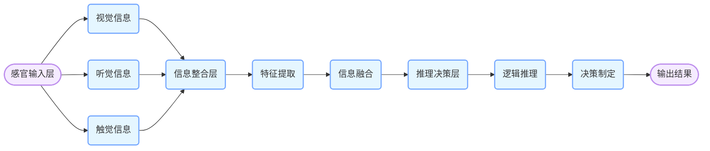

# 多模态融合推理的认知神经机制研究

> 关键词：多模态融合、推理、认知神经机制、神经科学、人工智能、脑成像技术、神经计算模型

> 摘要：本文聚焦于多模态融合推理的认知神经机制研究。多模态融合推理在人类的认知过程中起着关键作用，它涉及到将来自不同感官通道的信息进行整合并做出推理决策。文章首先介绍了研究的背景、目的、预期读者等内容，接着阐述了多模态融合推理的核心概念与联系，深入探讨了其核心算法原理及具体操作步骤，通过数学模型和公式进行详细讲解并举例说明。然后通过项目实战展示代码实现及解读，分析了实际应用场景。同时推荐了相关的学习资源、开发工具框架和论文著作。最后对多模态融合推理的未来发展趋势与挑战进行总结，并提供常见问题解答和扩展阅读参考资料，旨在全面深入地揭示多模态融合推理的认知神经机制，为相关领域的研究和应用提供理论和实践支持。

## 1. 背景介绍 
### 1.1 目的和范围
多模态融合推理的认知神经机制研究旨在深入理解人类大脑如何整合来自不同感官模态（如视觉、听觉、触觉等）的信息，并基于这些整合的信息进行推理和决策。这一研究不仅有助于揭示人类认知的本质，还为人工智能领域的多模态融合技术提供了生物学灵感。本研究的范围涵盖了从神经科学的基础理论到人工智能算法的实现，包括对大脑神经活动的监测、分析，以及利用计算模型模拟多模态融合推理的过程。

### 1.2 预期读者
本文的预期读者包括神经科学领域的研究人员、人工智能领域的工程师和研究人员、认知心理学专业的学生和学者，以及对人类认知和多模态信息处理感兴趣的其他专业人士。

### 1.3 文档结构概述
本文将按照以下结构展开：首先介绍多模态融合推理的背景知识，包括相关术语和概念；接着阐述多模态融合推理的核心概念与联系，通过示意图和流程图进行直观展示；然后详细讲解核心算法原理及具体操作步骤，并用Python代码进行说明；再通过数学模型和公式深入分析多模态融合推理的机制，并举例说明；之后进行项目实战，展示代码实现和解读；分析多模态融合推理的实际应用场景；推荐相关的学习资源、开发工具框架和论文著作；最后总结多模态融合推理的未来发展趋势与挑战，提供常见问题解答和扩展阅读参考资料。

### 1.4 术语表
#### 1.4.1 核心术语定义
- **多模态融合**：指将来自不同感官模态（如视觉、听觉、触觉等）的信息进行整合的过程。
- **推理**：根据已知信息得出结论或做出决策的认知过程。
- **认知神经机制**：研究大脑如何实现认知功能的神经生物学基础。
- **脑成像技术**：用于观察和记录大脑结构和功能活动的技术，如功能性磁共振成像（fMRI）、脑电图（EEG）等。
- **神经计算模型**：用数学和计算方法模拟神经元和神经网络的行为，以研究大脑的信息处理机制。

#### 1.4.2 相关概念解释
- **感官模态**：指人类感知外界信息的不同方式，如视觉通过眼睛感知图像，听觉通过耳朵感知声音等。
- **信息整合**：将来自不同来源或模态的信息进行综合处理，以形成更全面、准确的认知。
- **决策**：在多个可能的选项中做出选择的过程，通常基于对各种信息的评估和推理。

#### 1.4.3 缩略词列表
- **fMRI**：功能性磁共振成像（Functional Magnetic Resonance Imaging）
- **EEG**：脑电图（Electroencephalogram）
- **MEG**：脑磁图（Magnetoencephalogram）
- **PET**：正电子发射断层扫描（Positron Emission Tomography）

## 2. 核心概念与联系 

### 多模态融合推理的原理
多模态融合推理的核心原理在于大脑能够有效地整合来自不同感官模态的信息，并利用这些整合后的信息进行推理和决策。不同的感官模态提供了关于外界环境的不同方面的信息，例如视觉信息可以提供物体的形状、颜色和空间位置，听觉信息可以提供声音的来源和特征，触觉信息可以提供物体的质地和硬度等。大脑通过对这些多模态信息的整合，能够形成更全面、准确的认知，从而做出更合理的推理和决策。

### 多模态融合推理的架构
多模态融合推理的架构可以分为三个主要层次：感官输入层、信息整合层和推理决策层。感官输入层负责接收来自不同感官模态的信息，并将其转换为神经信号。信息整合层则对这些来自不同感官模态的神经信号进行整合，提取出有用的信息特征。推理决策层根据整合后的信息特征进行推理和决策，最终输出相应的行为或认知结果。

### 文本示意图
多模态融合推理的架构可以用以下文本示意图表示：

```plaintext
           +-----------------+
           |  感官输入层    |
           |  (视觉、听觉、  |
           |   触觉等)       |
           +-----------------+
                    |
                    v
           +-----------------+
           |  信息整合层    |
           |  (特征提取、    |
           |   信息融合)     |
           +-----------------+
                    |
                    v
           +-----------------+
           |  推理决策层    |
           |  (逻辑推理、    |
           |   决策制定)     |
           +-----------------+
```

### Mermaid 流程图


## 3. 核心算法原理 & 具体操作步骤 

### 多模态信息融合算法原理
多模态信息融合的核心思想是将来自不同感官模态的信息进行有机结合，以提高信息的准确性和可靠性。一种常用的多模态信息融合算法是基于贝叶斯推理的方法。贝叶斯推理通过利用先验知识和新的观测数据来更新对某个事件的概率估计。

### 基于贝叶斯推理的多模态信息融合算法步骤
1. **定义先验概率**：根据以往的经验或知识，对不同模态信息的可靠性和相关性进行估计，得到先验概率分布。
2. **获取观测数据**：从不同的感官模态中获取当前的观测数据。
3. **计算似然函数**：根据观测数据和每个模态的概率模型，计算似然函数，表示在给定某个假设下观测到当前数据的概率。
4. **更新后验概率**：利用贝叶斯公式，结合先验概率和似然函数，更新对不同假设的后验概率分布。
5. **做出决策**：根据更新后的后验概率分布，选择概率最大的假设作为最终的决策结果。

### Python 源代码实现
```python
import numpy as np

# 定义先验概率
prior_prob = np.array([0.3, 0.4, 0.3])  # 假设有三个假设，先验概率分别为 0.3, 0.4, 0.3

# 定义似然函数
def likelihood(observation, hypothesis):
    # 这里简单假设似然函数是一个固定的矩阵
    likelihood_matrix = np.array([[0.7, 0.2, 0.1],
                                  [0.1, 0.8, 0.1],
                                  [0.2, 0.1, 0.7]])
    return likelihood_matrix[observation, hypothesis]

# 获取观测数据
observation = 1  # 假设观测到的数据为 1

# 计算似然值
likelihood_values = np.array([likelihood(observation, i) for i in range(len(prior_prob))])

# 更新后验概率
posterior_prob = prior_prob * likelihood_values
posterior_prob = posterior_prob / np.sum(posterior_prob)  # 归一化

# 做出决策
decision = np.argmax(posterior_prob)

print("后验概率分布:", posterior_prob)
print("决策结果:", decision)
```

### 代码解释
1. **先验概率**：`prior_prob` 数组表示对三个假设的先验概率估计。
2. **似然函数**：`likelihood` 函数根据观测数据和假设计算似然值，这里使用一个固定的似然矩阵来表示。
3. **观测数据**：`observation` 变量表示当前观测到的数据。
4. **似然值计算**：通过循环计算每个假设的似然值。
5. **后验概率更新**：根据贝叶斯公式更新后验概率，并进行归一化处理。
6. **决策制定**：选择后验概率最大的假设作为最终的决策结果。

## 4. 数学模型和公式 & 详细讲解 & 举例说明 

### 贝叶斯公式
贝叶斯公式是多模态信息融合中常用的数学模型，其表达式为：

$$P(H_i|D)=\frac{P(D|H_i)P(H_i)}{\sum_{j=1}^{n}P(D|H_j)P(H_j)}$$

其中：
- $P(H_i|D)$ 是在观测到数据 $D$ 的条件下，假设 $H_i$ 的后验概率。
- $P(D|H_i)$ 是在假设 $H_i$ 成立的条件下，观测到数据 $D$ 的似然概率。
- $P(H_i)$ 是假设 $H_i$ 的先验概率。
- $n$ 是假设的总数。

### 详细讲解
贝叶斯公式的核心思想是利用先验知识和新的观测数据来更新对某个事件的概率估计。先验概率 $P(H_i)$ 表示在没有观测到任何数据之前，对假设 $H_i$ 的概率估计。似然概率 $P(D|H_i)$ 表示在假设 $H_i$ 成立的条件下，观测到数据 $D$ 的概率。后验概率 $P(H_i|D)$ 则是在观测到数据 $D$ 之后，对假设 $H_i$ 的概率更新。

### 举例说明
假设我们要判断一个水果是苹果、香蕉还是橙子，这就是三个假设 $H_1$（苹果）、$H_2$（香蕉）、$H_3$（橙子）。根据以往的经验，我们知道在这个环境中苹果出现的概率是 0.3，香蕉出现的概率是 0.4，橙子出现的概率是 0.3，即先验概率 $P(H_1)=0.3$，$P(H_2)=0.4$，$P(H_3)=0.3$。

现在我们观测到这个水果是黄色的，这就是观测数据 $D$。根据统计，苹果是黄色的概率是 0.1，香蕉是黄色的概率是 0.8，橙子是黄色的概率是 0.2，即似然概率 $P(D|H_1)=0.1$，$P(D|H_2)=0.8$，$P(D|H_3)=0.2$。

根据贝叶斯公式计算后验概率：

$$P(H_1|D)=\frac{P(D|H_1)P(H_1)}{P(D|H_1)P(H_1)+P(D|H_2)P(H_2)+P(D|H_3)P(H_3)}=\frac{0.1\times0.3}{0.1\times0.3 + 0.8\times0.4 + 0.2\times0.3}=\frac{0.03}{0.03 + 0.32 + 0.06}=\frac{0.03}{0.41}\approx0.073$$

$$P(H_2|D)=\frac{P(D|H_2)P(H_2)}{P(D|H_1)P(H_1)+P(D|H_2)P(H_2)+P(D|H_3)P(H_3)}=\frac{0.8\times0.4}{0.1\times0.3 + 0.8\times0.4 + 0.2\times0.3}=\frac{0.32}{0.03 + 0.32 + 0.06}=\frac{0.32}{0.41}\approx0.780$$

$$P(H_3|D)=\frac{P(D|H_3)P(H_3)}{P(D|H_1)P(H_1)+P(D|H_2)P(H_2)+P(D|H_3)P(H_3)}=\frac{0.2\times0.3}{0.1\times0.3 + 0.8\times0.4 + 0.2\times0.3}=\frac{0.06}{0.03 + 0.32 + 0.06}=\frac{0.06}{0.41}\approx0.146$$

由于 $P(H_2|D)$ 最大，所以我们可以判断这个水果更有可能是香蕉。

## 5. 项目实战：代码实际案例和详细解释说明 

### 5.1  开发环境搭建
本项目使用 Python 进行开发，需要安装以下必要的库：
- **NumPy**：用于数值计算和数组操作。
- **Matplotlib**：用于数据可视化。

可以使用以下命令进行安装：
```sh
pip install numpy matplotlib
```

### 5.2  源代码详细实现和代码解读
```python
import numpy as np
import matplotlib.pyplot as plt

# 定义先验概率
prior_prob = np.array([0.2, 0.3, 0.5])  # 假设有三个假设，先验概率分别为 0.2, 0.3, 0.5

# 定义似然函数
def likelihood(observation, hypothesis):
    # 这里简单假设似然函数是一个固定的矩阵
    likelihood_matrix = np.array([[0.6, 0.3, 0.1],
                                  [0.2, 0.7, 0.1],
                                  [0.1, 0.2, 0.7]])
    return likelihood_matrix[observation, hypothesis]

# 模拟多次观测数据
num_observations = 10
observations = np.random.randint(0, 3, num_observations)  # 随机生成 10 个观测数据

# 初始化后验概率
posterior_prob = prior_prob.copy()

# 存储每次观测后的后验概率
posterior_probs = [posterior_prob]

# 进行多次观测和更新
for observation in observations:
    # 计算似然值
    likelihood_values = np.array([likelihood(observation, i) for i in range(len(posterior_prob))])
    
    # 更新后验概率
    posterior_prob = posterior_prob * likelihood_values
    posterior_prob = posterior_prob / np.sum(posterior_prob)  # 归一化
    
    # 存储更新后的后验概率
    posterior_probs.append(posterior_prob)

# 转换为数组
posterior_probs = np.array(posterior_probs)

# 可视化后验概率的变化
plt.figure(figsize=(10, 6))
for i in range(len(prior_prob)):
    plt.plot(posterior_probs[:, i], label=f'Hypothesis {i + 1}')

plt.xlabel('Number of Observations')
plt.ylabel('Posterior Probability')
plt.title('Evolution of Posterior Probabilities with Multiple Observations')
plt.legend()
plt.grid(True)
plt.show()
```

### 5.3  代码解读与分析
1. **先验概率**：`prior_prob` 数组定义了三个假设的先验概率。
2. **似然函数**：`likelihood` 函数根据观测数据和假设计算似然值，使用一个固定的似然矩阵。
3. **观测数据模拟**：`observations` 数组随机生成 10 个观测数据。
4. **后验概率更新**：在每次观测后，根据贝叶斯公式更新后验概率，并进行归一化处理。
5. **可视化**：使用 `Matplotlib` 库将每次观测后的后验概率变化进行可视化展示。

通过这个项目实战，我们可以直观地看到随着观测数据的增加，后验概率是如何逐渐更新和收敛的，从而更好地理解多模态信息融合的过程。

## 6. 实际应用场景 
### 智能机器人
在智能机器人领域，多模态融合推理技术可以帮助机器人更准确地感知和理解周围环境。机器人可以通过视觉传感器获取图像信息，通过听觉传感器获取声音信息，通过触觉传感器获取接触信息等。通过多模态信息融合，机器人可以更全面地了解周围的物体和场景，从而做出更合理的决策和行动。例如，机器人在执行搜索和救援任务时，可以通过视觉识别目标物体的位置和形状，通过听觉感知周围的声音信号，判断是否有生命迹象或危险情况，通过触觉感知物体的质地和硬度，以便更好地操作和搬运物体。

### 虚拟现实和增强现实
在虚拟现实（VR）和增强现实（AR）领域，多模态融合推理技术可以提供更加沉浸式和真实的用户体验。通过将视觉、听觉、触觉等多模态信息进行融合，用户可以在虚拟环境中更加真实地感受到周围的场景和物体。例如，在 VR 游戏中，用户可以通过视觉看到游戏场景和角色，通过听觉听到游戏中的音效和对话，通过触觉设备感受到游戏中的碰撞和震动等，从而增强游戏的沉浸感和趣味性。

### 医疗诊断
在医疗诊断领域，多模态融合推理技术可以帮助医生更准确地诊断疾病。医生可以通过多种检查手段获取患者的多模态信息，如影像学检查（如 X 光、CT、MRI 等）获取患者的身体结构信息，实验室检查获取患者的生理指标信息，问诊获取患者的症状和病史信息等。通过将这些多模态信息进行融合和分析，医生可以更全面地了解患者的病情，从而做出更准确的诊断和治疗方案。例如，在癌症诊断中，医生可以结合影像学检查结果、病理检查结果和患者的症状信息，综合判断癌症的类型、分期和治疗方案。

### 自动驾驶
在自动驾驶领域，多模态融合推理技术对于车辆的安全行驶至关重要。自动驾驶车辆可以通过多种传感器获取多模态信息，如摄像头获取图像信息，雷达获取距离和速度信息，激光雷达获取三维空间信息等。通过将这些多模态信息进行融合和分析，车辆可以更准确地感知周围的交通环境，预测其他车辆和行人的行为，从而做出更合理的驾驶决策。例如，在遇到复杂的交通场景时，车辆可以结合视觉信息和雷达信息，判断前方车辆的行驶状态和距离，及时做出加速、减速或避让等决策。

## 7. 工具和资源推荐
### 7.1 学习资源推荐
#### 7.1.1 书籍推荐
- 《认知神经科学：关于心智的生物学》（*Cognitive Neuroscience: The Biology of the Mind*）：这本书全面介绍了认知神经科学的基本理论和研究方法，对于理解多模态融合推理的认知神经机制有很大的帮助。
- 《人工智能：一种现代的方法》（*Artificial Intelligence: A Modern Approach*）：这本书是人工智能领域的经典教材，涵盖了多模态融合、推理等方面的内容，对于人工智能算法的实现和应用有详细的讲解。
- 《贝叶斯数据分析》（*Bayesian Data Analysis*）：这本书深入介绍了贝叶斯推理的理论和方法，对于理解多模态信息融合中贝叶斯算法的原理和应用非常有帮助。

#### 7.1.2 在线课程
- Coursera 上的“认知神经科学”课程：由知名大学的教授授课，系统地介绍了认知神经科学的基本概念、研究方法和最新进展。
- edX 上的“人工智能基础”课程：涵盖了人工智能的基本算法和应用，包括多模态融合和推理等方面的内容。
- Udemy 上的“贝叶斯统计和机器学习”课程：专门讲解贝叶斯统计的理论和方法，以及在机器学习中的应用。

#### 7.1.3 技术博客和网站
- 神经科学新闻网（Neuroscience News）：提供最新的神经科学研究成果和新闻报道，对于了解多模态融合推理的认知神经机制的最新进展非常有帮助。
- 人工智能开源社区（AI Open Source）：分享人工智能领域的开源代码、算法和应用案例，对于学习多模态融合推理的算法实现和应用有很大的参考价值。
- 认知科学学会（Cognitive Science Society）官网：发布认知科学领域的最新研究成果和学术会议信息，是了解认知科学前沿动态的重要渠道。

### 7.2 开发工具框架推荐
#### 7.2.1 IDE和编辑器
- PyCharm：一款功能强大的 Python 集成开发环境（IDE），提供代码编辑、调试、版本控制等功能，非常适合 Python 开发。
- Jupyter Notebook：一种交互式的开发环境，支持代码、文本、图像等多种格式的展示，方便进行数据分析和实验验证。
- Visual Studio Code：一款轻量级的代码编辑器，支持多种编程语言和插件扩展，对于快速开发和调试代码非常方便。

#### 7.2.2 调试和性能分析工具
- PDB：Python 自带的调试工具，可以帮助开发者在代码执行过程中进行断点调试，查看变量值和程序执行流程。
- cProfile：Python 内置的性能分析工具，可以统计代码中各个函数的执行时间和调用次数，帮助开发者找出性能瓶颈。
- Py-Spy：一个用于分析 Python 程序性能的工具，可以实时查看 Python 程序的 CPU 使用率和函数调用情况。

#### 7.2.3 相关框架和库
- TensorFlow：一个开源的机器学习框架，提供了丰富的深度学习模型和工具，对于实现多模态融合推理的深度学习算法非常有帮助。
- PyTorch：另一个流行的深度学习框架，具有简洁的 API 和高效的计算性能，适合快速开发和实验。
- Scikit-learn：一个用于机器学习的 Python 库，提供了多种机器学习算法和工具，对于实现传统的多模态融合推理算法非常方便。

### 7.3 相关论文著作推荐
#### 7.3.1 经典论文
- *The neural basis of multisensory integration in humans*：这篇论文探讨了人类大脑中多模态信息整合的神经基础，对于理解多模态融合推理的认知神经机制具有重要的参考价值。
- *Multisensory perception: Beyond the senses*：该论文介绍了多模态感知的最新研究进展，包括多模态信息融合的机制和应用。
- *Bayesian inference in cognitive science*：这篇论文阐述了贝叶斯推理在认知科学中的应用，对于理解多模态信息融合中贝叶斯算法的原理和作用非常有帮助。

#### 7.3.2 最新研究成果
- 关注《Neuron》《Nature Neuroscience》《Science》等顶级学术期刊，这些期刊经常发表多模态融合推理的认知神经机制方面的最新研究成果。
- 参加神经科学和人工智能领域的国际学术会议，如神经信息处理系统大会（NeurIPS）、认知科学学会年会（CogSci）等，了解最新的研究动态和趋势。

#### 7.3.3 应用案例分析
- 分析智能机器人、虚拟现实、医疗诊断、自动驾驶等领域中多模态融合推理技术的应用案例，了解这些技术在实际应用中的实现方法和效果。
- 参考相关的行业报告和白皮书，了解多模态融合推理技术在不同行业的应用现状和发展趋势。

## 8. 总结：未来发展趋势与挑战
### 未来发展趋势
- **跨学科融合**：多模态融合推理的研究将更加注重跨学科融合，结合神经科学、人工智能、认知心理学、数学等多个学科的知识和方法，深入揭示其认知神经机制，并开发出更加智能和高效的多模态融合推理算法和系统。
- **深度学习与神经科学的结合**：深度学习技术将与神经科学的研究成果更加紧密地结合，通过模拟大脑的神经结构和信息处理机制，开发出更具生物合理性的深度学习模型，提高多模态融合推理的性能和效率。
- **应用领域的拓展**：多模态融合推理技术将在更多的领域得到应用，如智能家居、智能教育、金融风控等，为人们的生活和工作带来更多的便利和创新。
- **个性化和自适应**：未来的多模态融合推理系统将更加注重个性化和自适应，能够根据不同用户的需求和偏好，自动调整融合策略和推理方法，提供更加个性化的服务和体验。

### 挑战
- **神经机制的复杂性**：大脑的多模态融合推理机制非常复杂，目前我们对其了解还非常有限。如何深入揭示大脑的神经机制，建立准确的神经计算模型，是多模态融合推理研究面临的一个重大挑战。
- **数据的多样性和复杂性**：多模态数据具有多样性和复杂性的特点，包括不同的模态、不同的格式、不同的噪声水平等。如何有效地处理和融合这些多模态数据，提高数据的质量和可用性，是多模态融合推理技术应用的关键问题。
- **计算资源的限制**：多模态融合推理通常需要大量的计算资源，尤其是在处理大规模的多模态数据和复杂的深度学习模型时。如何优化算法和模型，减少计算资源的需求，提高系统的效率和性能，是一个亟待解决的问题。
- **伦理和法律问题**：随着多模态融合推理技术的广泛应用，涉及到的伦理和法律问题也越来越多，如隐私保护、数据安全、算法偏见等。如何制定相应的伦理和法律规范，保障技术的合法、合规和安全应用，是多模态融合推理技术发展面临的重要挑战。

## 9. 附录：常见问题与解答
### 问题 1：多模态融合推理和单模态推理有什么区别？
答：单模态推理只利用单一感官模态的信息进行推理，而多模态融合推理则将来自不同感官模态的信息进行整合，利用更全面的信息进行推理。多模态融合推理可以提高推理的准确性和可靠性，因为不同的感官模态可以提供互补的信息，从而更全面地了解外界环境。

### 问题 2：多模态信息融合有哪些常见的方法？
答：常见的多模态信息融合方法包括基于贝叶斯推理的方法、基于深度学习的方法、基于特征融合的方法等。基于贝叶斯推理的方法通过利用先验知识和新的观测数据来更新对某个事件的概率估计；基于深度学习的方法通过构建深度神经网络来自动学习多模态信息之间的关系；基于特征融合的方法则是将不同模态的特征进行提取和融合，然后利用融合后的特征进行推理。

### 问题 3：如何评估多模态融合推理系统的性能？
答：评估多模态融合推理系统的性能可以从多个方面进行，如推理的准确性、可靠性、效率、鲁棒性等。可以使用一些常用的评估指标，如准确率、召回率、F1 值、均方误差等，来衡量系统的性能。此外，还可以通过用户实验和实际应用案例来评估系统的性能和用户体验。

### 问题 4：多模态融合推理技术在实际应用中面临哪些困难？
答：多模态融合推理技术在实际应用中面临的困难包括数据的多样性和复杂性、计算资源的限制、神经机制的复杂性、伦理和法律问题等。数据的多样性和复杂性使得数据的处理和融合变得困难；计算资源的限制影响了系统的效率和性能；神经机制的复杂性使得我们难以建立准确的模型；伦理和法律问题则涉及到隐私保护、数据安全等方面。

## 10. 扩展阅读 & 参考资料
### 扩展阅读
- 《神经科学原理》（*Principles of Neural Science*）：全面介绍了神经科学的基本理论和研究方法，对于深入了解大脑的神经机制有很大的帮助。
- 《深度学习》（*Deep Learning*）：深度学习领域的经典著作，详细介绍了深度学习的算法和应用，对于学习多模态融合推理中的深度学习技术有重要的参考价值。
- 《认知心理学》（*Cognitive Psychology*）：介绍了认知心理学的基本理论和研究方法，对于理解人类的认知过程和多模态融合推理的认知基础有很大的帮助。

### 参考资料
- 相关学术期刊上的研究论文，如《Neuron》《Nature Neuroscience》《Science》《Journal of Cognitive Neuroscience》等。
- 国际学术会议的论文集，如神经信息处理系统大会（NeurIPS）、认知科学学会年会（CogSci）等。
- 相关的技术报告和行业白皮书，如智能机器人、虚拟现实、医疗诊断、自动驾驶等领域的报告和白皮书。