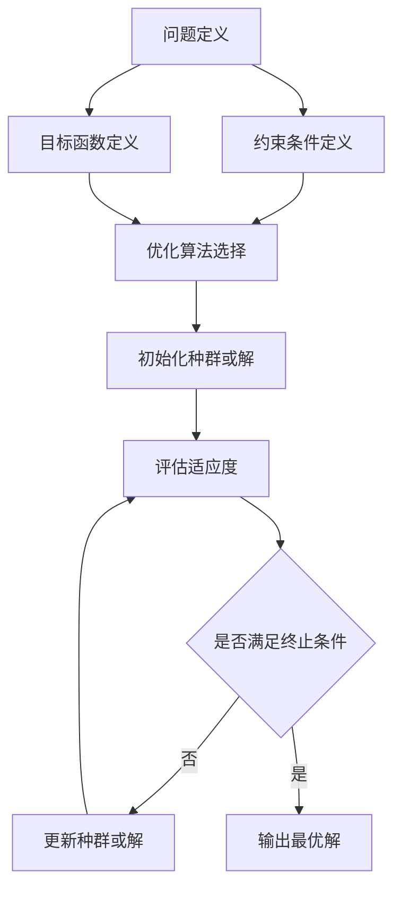

# 多约束优化:AI创造力的新维度

> 关键词：多约束优化、AI创造力、约束条件、优化算法、智能系统、创新应用、未来趋势

> 摘要：本文聚焦于多约束优化这一主题，深入探讨其与AI创造力之间的紧密联系。首先介绍多约束优化的背景知识，包括其目的、预期读者和文档结构等。接着阐述多约束优化的核心概念与联系，通过文本示意图和Mermaid流程图直观呈现其原理和架构。详细讲解核心算法原理，并用Python源代码进行具体操作步骤的阐述。同时，给出相关的数学模型和公式，并举例说明。通过项目实战，展示多约束优化在实际中的代码实现和详细解释。分析多约束优化的实际应用场景，推荐相关的工具和资源。最后总结多约束优化的未来发展趋势与挑战，解答常见问题并提供扩展阅读和参考资料，旨在全面深入地揭示多约束优化作为AI创造力新维度的重要意义和应用价值。

## 1. 背景介绍 
### 1.1 目的和范围
多约束优化在当今AI领域具有至关重要的地位。其目的在于在满足多个复杂约束条件的前提下，寻找最优的解决方案。在AI的发展过程中，传统的优化方法往往只能处理单一或少数几个约束，而随着AI应用场景的不断拓展和复杂化，如自动驾驶、智能医疗、金融风险评估等，需要同时考虑多个相互关联的约束条件。多约束优化的研究范围涵盖了从理论算法的创新到实际应用的落地，涉及计算机科学、数学、物理学、工程学等多个学科领域。通过多约束优化，能够提升AI系统的性能、效率和可靠性，挖掘出AI更深层次的创造力。

### 1.2 预期读者
本文预期读者包括从事AI、计算机科学、数学优化等领域的研究人员和学者，他们可以从文中深入了解多约束优化的最新理论和技术，为其研究工作提供新的思路和方法。对于AI和软件开发工程师，能够获取多约束优化在实际项目中的应用经验和代码实现技巧，提升其解决复杂问题的能力。同时，对AI和优化技术感兴趣的爱好者也可以通过本文初步了解多约束优化的基本概念和重要意义，激发他们进一步探索的兴趣。

### 1.3 文档结构概述
本文首先介绍多约束优化的背景知识，包括目的、预期读者和文档结构等，让读者对多约束优化有一个初步的认识。接着阐述核心概念与联系，通过文本示意图和Mermaid流程图直观呈现多约束优化的原理和架构。详细讲解核心算法原理，并用Python源代码进行具体操作步骤的阐述。给出相关的数学模型和公式，并举例说明。通过项目实战，展示多约束优化在实际中的代码实现和详细解释。分析多约束优化的实际应用场景，推荐相关的工具和资源。最后总结多约束优化的未来发展趋势与挑战，解答常见问题并提供扩展阅读和参考资料，形成一个完整的知识体系。

### 1.4 术语表
#### 1.4.1 核心术语定义
- **多约束优化**：在多个约束条件的限制下，寻找目标函数最优解的过程。约束条件可以是等式约束、不等式约束等，目标函数可以是最大化或最小化的函数。
- **AI创造力**：AI系统在解决问题、生成内容等方面表现出的创新性和独特性，能够产生新颖、有价值的结果。
- **约束条件**：对优化问题的解施加的限制条件，例如资源限制、时间限制、物理规律等。
- **目标函数**：用于衡量优化问题解的优劣的函数，优化的目标是使目标函数达到最大值或最小值。
- **最优解**：在满足所有约束条件的前提下，使目标函数达到最优值的解。

#### 1.4.2 相关概念解释
- **优化算法**：用于求解优化问题的算法，常见的有遗传算法、模拟退火算法、粒子群算法等。这些算法通过不断迭代搜索，逐步逼近最优解。
- **约束处理技术**：在多约束优化中，处理约束条件的技术，例如罚函数法、约束违背度法等。这些技术的目的是在优化过程中保证解满足约束条件。
- **智能系统**：具有感知、学习、推理、决策等能力的系统，多约束优化可以应用于智能系统的各个环节，提升其性能和效率。

#### 1.4.3 缩略词列表
- **GA**：Genetic Algorithm，遗传算法
- **SA**：Simulated Annealing，模拟退火算法
- **PSO**：Particle Swarm Optimization，粒子群算法

## 2. 核心概念与联系 
### 核心概念原理
多约束优化的核心在于在满足多个约束条件的情况下，对目标函数进行优化。约束条件可以是等式约束 $g_i(x) = 0$，其中 $i = 1,2,\cdots,m$，也可以是不等式约束 $h_j(x) \leq 0$，其中 $j = 1,2,\cdots,n$，$x$ 是决策变量。目标函数 $f(x)$ 可以是最大化目标 $max f(x)$ 或最小化目标 $min f(x)$。

多约束优化的难点在于约束条件之间可能相互冲突，需要在这些冲突中找到一个平衡，使得目标函数达到最优。例如，在一个资源分配问题中，可能存在资源总量的限制（不等式约束），同时不同任务之间可能存在依赖关系（等式约束），需要在满足这些约束的前提下，最大化资源的利用效率（目标函数）。

### 架构的文本示意图
多约束优化的架构可以分为三个主要部分：约束条件定义、目标函数定义和优化算法选择。

- **约束条件定义**：明确问题中存在的所有约束条件，包括等式约束和不等式约束。这些约束条件可以是基于物理规律、业务规则、资源限制等。
- **目标函数定义**：确定衡量问题解优劣的目标函数，根据问题的不同，目标函数可以是最大化利润、最小化成本、最大化效率等。
- **优化算法选择**：根据问题的特点和约束条件的复杂程度，选择合适的优化算法。常见的优化算法有遗传算法、模拟退火算法、粒子群算法等。

这三个部分相互关联，约束条件和目标函数共同定义了优化问题，而优化算法则用于求解这个问题。

### Mermaid 流程图


这个流程图展示了多约束优化的基本流程。首先进行问题定义，包括约束条件和目标函数的定义。然后选择合适的优化算法，初始化种群或解。接着评估解的适应度，判断是否满足终止条件。如果不满足，则更新种群或解，继续评估适应度；如果满足，则输出最优解。

## 3. 核心算法原理 & 具体操作步骤 
### 遗传算法原理
遗传算法（GA）是一种基于自然选择和遗传机制的优化算法。它通过模拟生物进化过程，在解空间中搜索最优解。遗传算法的基本操作包括选择、交叉和变异。

- **选择**：根据个体的适应度值，选择优秀的个体作为父代，用于产生下一代。适应度值越高的个体，被选择的概率越大。
- **交叉**：将父代个体的染色体进行交换，产生新的子代个体。交叉操作可以增加种群的多样性。
- **变异**：对新产生的子代个体的染色体进行随机变异，以防止算法陷入局部最优解。

### Python 源代码实现
```python
import numpy as np

# 定义目标函数
def objective_function(x):
    return np.sum(x**2)

# 定义约束条件
def constraint1(x):
    return np.sum(x) - 1

def constraint2(x):
    return x[0] - 0.5

# 定义适应度函数，考虑约束条件
def fitness_function(x):
    penalty = 0
    if constraint1(x) > 0:
        penalty += constraint1(x)**2
    if constraint2(x) > 0:
        penalty += constraint2(x)**2
    return objective_function(x) + penalty

# 初始化种群
def initialize_population(pop_size, dim, lower_bound, upper_bound):
    population = []
    for _ in range(pop_size):
        individual = np.random.uniform(lower_bound, upper_bound, dim)
        population.append(individual)
    return np.array(population)

# 选择操作
def selection(population, fitness_values):
    total_fitness = np.sum(fitness_values)
    probabilities = fitness_values / total_fitness
    indices = np.random.choice(len(population), size=2, p=probabilities)
    return population[indices[0]], population[indices[1]]

# 交叉操作
def crossover(parent1, parent2):
    crossover_point = np.random.randint(1, len(parent1))
    child1 = np.concatenate((parent1[:crossover_point], parent2[crossover_point:]))
    child2 = np.concatenate((parent2[:crossover_point], parent1[crossover_point:]))
    return child1, child2

# 变异操作
def mutation(individual, mutation_rate, lower_bound, upper_bound):
    for i in range(len(individual)):
        if np.random.rand() < mutation_rate:
            individual[i] = np.random.uniform(lower_bound, upper_bound)
    return individual

# 遗传算法主函数
def genetic_algorithm(pop_size, dim, lower_bound, upper_bound, max_generations, mutation_rate):
    population = initialize_population(pop_size, dim, lower_bound, upper_bound)
    for generation in range(max_generations):
        fitness_values = np.array([fitness_function(individual) for individual in population])
        new_population = []
        for _ in range(pop_size // 2):
            parent1, parent2 = selection(population, fitness_values)
            child1, child2 = crossover(parent1, parent2)
            child1 = mutation(child1, mutation_rate, lower_bound, upper_bound)
            child2 = mutation(child2, mutation_rate, lower_bound, upper_bound)
            new_population.extend([child1, child2])
        population = np.array(new_population)
    best_index = np.argmin([fitness_function(individual) for individual in population])
    best_solution = population[best_index]
    return best_solution

# 运行遗传算法
pop_size = 50
dim = 3
lower_bound = -5
upper_bound = 5
max_generations = 100
mutation_rate = 0.1
best_solution = genetic_algorithm(pop_size, dim, lower_bound, upper_bound, max_generations, mutation_rate)
print("Best solution:", best_solution)
print("Objective value:", objective_function(best_solution))
```

### 具体操作步骤
1. **问题定义**：确定目标函数和约束条件。在上述代码中，目标函数是 $f(x)=\sum_{i=1}^{n}x_i^2$，约束条件是 $\sum_{i=1}^{n}x_i - 1 \leq 0$ 和 $x_0 - 0.5 \leq 0$。
2. **初始化种群**：随机生成一定数量的个体，作为初始种群。
3. **评估适应度**：计算每个个体的适应度值，考虑约束条件的惩罚项。
4. **选择操作**：根据适应度值选择优秀的个体作为父代。
5. **交叉操作**：对父代个体进行交叉，产生新的子代个体。
6. **变异操作**：对子代个体进行变异，增加种群的多样性。
7. **更新种群**：用新产生的子代个体替换旧的种群。
8. **判断终止条件**：如果达到最大迭代次数，则停止算法，输出最优解；否则，返回步骤 3 继续迭代。

## 4. 数学模型和公式 & 详细讲解 & 举例说明 
### 数学模型
多约束优化问题可以用以下数学模型表示：

$$
\begin{align*}
\min_{x} &\quad f(x) \\
\text{s.t.} &\quad g_i(x) = 0, \quad i = 1,2,\cdots,m \\
&\quad h_j(x) \leq 0, \quad j = 1,2,\cdots,n
\end{align*}
$$

其中 $x \in \mathbb{R}^d$ 是决策变量，$f(x)$ 是目标函数，$g_i(x)$ 是等式约束条件，$h_j(x)$ 是不等式约束条件。

### 详细讲解
- **目标函数**：$f(x)$ 用于衡量解的优劣，优化的目标是使 $f(x)$ 达到最小值。例如，在一个生产计划问题中，$f(x)$ 可以表示生产成本，我们希望在满足各种约束条件的前提下，最小化生产成本。
- **等式约束**：$g_i(x) = 0$ 表示解必须满足的等式关系。例如，在一个电路问题中，基尔霍夫定律可以表示为等式约束。
- **不等式约束**：$h_j(x) \leq 0$ 表示解必须满足的不等式关系。例如，在一个资源分配问题中，资源总量的限制可以表示为不等式约束。

### 举例说明
考虑一个简单的二维优化问题：

$$
\begin{align*}
\min_{x_1,x_2} &\quad (x_1 - 2)^2 + (x_2 - 3)^2 \\
\text{s.t.} &\quad x_1 + x_2 - 5 \leq 0 \\
&\quad x_1 - 1 \geq 0 \\
&\quad x_2 - 1 \geq 0
\end{align*}
$$

- **目标函数**：$f(x_1,x_2) = (x_1 - 2)^2 + (x_2 - 3)^2$，表示点 $(x_1,x_2)$ 到点 $(2,3)$ 的距离的平方，我们希望找到距离最小的点。
- **不等式约束**：
  - $x_1 + x_2 - 5 \leq 0$ 表示点 $(x_1,x_2)$ 必须在直线 $x_1 + x_2 = 5$ 的下方。
  - $x_1 - 1 \geq 0$ 表示点 $(x_1,x_2)$ 必须在直线 $x_1 = 1$ 的右侧。
  - $x_2 - 1 \geq 0$ 表示点 $(x_1,x_2)$ 必须在直线 $x_2 = 1$ 的上方。

通过求解这个优化问题，我们可以找到满足所有约束条件的最优解。

## 5. 项目实战：代码实际案例和详细解释说明 
### 5.1  开发环境搭建
在进行多约束优化的项目实战之前，需要搭建相应的开发环境。以下是具体的步骤：

1. **安装 Python**：Python 是一种广泛使用的编程语言，具有丰富的科学计算库。可以从 Python 官方网站（https://www.python.org/downloads/） 下载并安装最新版本的 Python。
2. **安装必要的库**：在多约束优化项目中，需要使用一些科学计算库，如 NumPy、SciPy 等。可以使用以下命令进行安装：
```sh
pip install numpy scipy
```
3. **选择开发工具**：可以选择使用集成开发环境（IDE），如 PyCharm、VS Code 等，也可以使用文本编辑器，如 Sublime Text、Atom 等。

### 5.2  源代码详细实现和代码解读
以下是一个使用 SciPy 库解决多约束优化问题的实际案例：

```python
import numpy as np
from scipy.optimize import minimize

# 定义目标函数
def objective(x):
    return (x[0] - 2)**2 + (x[1] - 3)**2

# 定义不等式约束条件
def constraint1(x):
    return 5 - x[0] - x[1]

def constraint2(x):
    return x[0] - 1

def constraint3(x):
    return x[1] - 1

# 定义约束条件字典
con1 = {'type': 'ineq', 'fun': constraint1}
con2 = {'type': 'ineq', 'fun': constraint2}
con3 = {'type': 'ineq', 'fun': constraint3}
cons = [con1, con2, con3]

# 定义初始猜测值
x0 = np.array([2, 2])

# 求解优化问题
result = minimize(objective, x0, method='SLSQP', constraints=cons)

# 输出结果
print('Optimal solution:', result.x)
print('Objective value:', result.fun)
```

### 代码解读与分析
1. **目标函数定义**：`objective(x)` 定义了要优化的目标函数，即 $(x_0 - 2)^2 + (x_1 - 3)^2$。
2. **约束条件定义**：`constraint1(x)`、`constraint2(x)` 和 `constraint3(x)` 分别定义了三个不等式约束条件。
3. **约束条件字典**：将约束条件转换为字典的形式，`type` 表示约束类型（`ineq` 表示不等式约束），`fun` 表示约束函数。
4. **初始猜测值**：`x0` 是优化算法的初始猜测值。
5. **求解优化问题**：使用 `scipy.optimize.minimize` 函数求解优化问题，`method='SLSQP'` 表示使用序列最小二乘法（Sequential Least Squares Quadratic Programming）求解，`constraints=cons` 表示使用定义的约束条件。
6. **输出结果**：`result.x` 是最优解，`result.fun` 是最优解对应的目标函数值。

## 6. 实际应用场景 
### 自动驾驶
在自动驾驶领域，多约束优化起着至关重要的作用。自动驾驶车辆需要在满足多个约束条件的前提下，规划出最优的行驶路径。例如，车辆需要遵守交通规则（如限速、交通信号等），同时要考虑安全距离、避免碰撞等约束条件。在保证安全的前提下，还需要优化行驶时间、能耗等目标函数。通过多约束优化算法，可以在复杂的交通环境中快速找到最优的行驶策略，提高自动驾驶的安全性和效率。

### 智能医疗
在智能医疗领域，多约束优化可以应用于医疗资源分配、治疗方案优化等方面。例如，在医院中，需要根据患者的病情、治疗需求、医疗资源的可用性等多个约束条件，合理分配医疗资源，如病床、医生、设备等。同时，在制定治疗方案时，需要考虑患者的身体状况、药物副作用、治疗效果等多个因素，通过多约束优化算法，可以找到最优的治疗方案，提高医疗质量和效率。

### 金融风险评估
在金融领域，多约束优化可以用于风险评估和投资组合优化。金融机构需要在满足风险约束条件的前提下，最大化投资收益。例如，在投资组合优化中，需要考虑资产的收益率、风险水平、投资比例限制等多个约束条件。通过多约束优化算法，可以找到最优的投资组合，降低投资风险，提高投资收益。

### 工业生产
在工业生产领域，多约束优化可以应用于生产计划、调度、资源分配等方面。例如，在工厂中，需要根据订单需求、设备产能、原材料供应等多个约束条件，制定最优的生产计划和调度方案。同时，在资源分配方面，需要考虑能源消耗、成本等多个因素，通过多约束优化算法，可以提高生产效率，降低生产成本。

## 7. 工具和资源推荐
### 7.1 学习资源推荐
#### 7.1.1 书籍推荐
- 《优化理论与方法》：这本书系统地介绍了优化理论和方法的基本概念、算法和应用，是学习优化领域的经典教材。
- 《遗传算法原理及应用》：详细介绍了遗传算法的原理、操作和应用，对于理解和应用遗传算法解决多约束优化问题有很大的帮助。
- 《机器学习》：虽然主要介绍机器学习的内容，但其中也涉及到了一些优化算法和技术，对于理解多约束优化在机器学习中的应用有一定的参考价值。

#### 7.1.2 在线课程
- Coursera 上的“Optimization Methods in Engineering”：该课程由知名教授授课，系统地介绍了优化方法在工程领域的应用，包括多约束优化问题的求解。
- edX 上的“Introduction to Optimization”：这是一门入门级的优化课程，适合初学者学习优化的基本概念和方法。
- 中国大学 MOOC 上的“最优化方法”：国内高校开设的课程，结合了理论和实践，对于理解多约束优化有很大的帮助。

#### 7.1.3 技术博客和网站
- 知乎：知乎上有很多关于多约束优化的讨论和分享，可以从中获取最新的研究成果和应用案例。
- GitHub：GitHub 上有很多开源的多约束优化项目和代码，可以学习和参考。
- 博客园：博客园上有很多技术博客，其中不乏关于多约束优化的文章，可以深入了解相关技术和方法。

### 7.2 开发工具框架推荐
#### 7.2.1 IDE和编辑器
- PyCharm：一款功能强大的 Python 集成开发环境，具有代码自动补全、调试、版本控制等功能，适合开发多约束优化相关的 Python 代码。
- VS Code：一款轻量级的代码编辑器，支持多种编程语言，通过安装插件可以实现代码调试、版本控制等功能，也可以用于开发多约束优化项目。
- Jupyter Notebook：一种交互式的开发环境，适合进行数据分析和算法实验，对于验证多约束优化算法的效果非常有用。

#### 7.2.2 调试和性能分析工具
- pdb：Python 自带的调试工具，可以帮助开发者调试 Python 代码，定位问题所在。
- cProfile：Python 自带的性能分析工具，可以分析代码的运行时间和函数调用情况，帮助开发者优化代码性能。
- Py-Spy：一款跨平台的 Python 性能分析工具，可以实时监控 Python 程序的性能，找出性能瓶颈。

#### 7.2.3 相关框架和库
- NumPy：Python 中用于科学计算的基础库，提供了高效的数组操作和数学函数，对于实现多约束优化算法非常有用。
- SciPy：基于 NumPy 的科学计算库，提供了丰富的优化算法和工具，如线性规划、非线性规划等，可以直接用于解决多约束优化问题。
- DEAP：一个用于实现进化算法的 Python 库，包括遗传算法、进化策略等，适合用于解决复杂的多约束优化问题。

### 7.3 相关论文著作推荐
#### 7.3.1 经典论文
- “A Fast and Elitist Multiobjective Genetic Algorithm: NSGA-II”：该论文提出了一种快速且高效的多目标遗传算法 NSGA-II，对于解决多约束优化问题中的多目标优化问题有很大的影响。
- “Simulated Annealing - A Tutorial”：这篇教程详细介绍了模拟退火算法的原理、操作和应用，是学习模拟退火算法的经典文献。
- “Particle Swarm Optimization”：该论文首次提出了粒子群优化算法，对于解决多约束优化问题提供了一种新的思路和方法。

#### 7.3.2 最新研究成果
- 可以通过 IEEE Xplore、ACM Digital Library 等学术数据库，搜索关于多约束优化的最新研究成果，了解该领域的前沿动态。
- 参加相关的学术会议，如 IEEE Conference on Evolutionary Computation、ACM SIGKDD Conference on Knowledge Discovery and Data Mining 等，获取最新的研究进展和成果。

#### 7.3.3 应用案例分析
- 可以参考一些实际应用案例分析的论文和报告，了解多约束优化在不同领域的应用情况和效果。例如，自动驾驶领域的路径规划案例、智能医疗领域的资源分配案例等。

## 8. 总结：未来发展趋势与挑战
### 未来发展趋势
- **与 AI 深度融合**：多约束优化将与 AI 技术更加深度融合，如结合深度学习、强化学习等技术，提高优化算法的智能性和适应性。例如，在自动驾驶中，通过深度学习模型预测交通状况，再结合多约束优化算法进行路径规划。
- **跨学科应用拓展**：多约束优化将在更多的跨学科领域得到应用，如生物医学、环境科学、社会科学等。例如，在生物医学中，结合基因测序数据和多约束优化算法，进行疾病诊断和治疗方案优化。
- **实时优化需求增加**：随着实时性要求较高的应用场景不断增加，如实时决策、实时控制等，多约束优化算法需要具备更高的实时性和效率。例如，在工业自动化中，需要实时调整生产计划和调度方案。
- **多目标多约束优化**：未来的优化问题将更加复杂，需要同时考虑多个目标和多个约束条件。多目标多约束优化将成为研究的热点，需要开发更加高效的算法和方法。

### 挑战
- **算法复杂度**：随着约束条件和目标函数的增加，优化问题的复杂度会急剧增加，传统的优化算法可能无法在合理的时间内找到最优解。需要开发更加高效的算法，降低算法的时间复杂度和空间复杂度。
- **约束处理**：在多约束优化中，约束条件之间可能相互冲突，如何有效地处理这些冲突是一个挑战。需要开发更加先进的约束处理技术，保证解的可行性。
- **数据不确定性**：在实际应用中，数据往往存在不确定性，如测量误差、噪声等。如何在数据不确定性的情况下进行多约束优化是一个需要解决的问题。
- **可解释性**：随着 AI 技术的发展，优化算法的可解释性变得越来越重要。如何解释优化算法的决策过程和结果，让用户理解和信任优化结果是一个挑战。

## 9. 附录：常见问题与解答
### 问题 1：多约束优化和单约束优化有什么区别？
答：单约束优化只需要考虑一个约束条件，而多约束优化需要同时考虑多个约束条件。多约束优化的问题更加复杂，因为约束条件之间可能相互冲突，需要在这些冲突中找到一个平衡，使得目标函数达到最优。

### 问题 2：如何选择合适的优化算法？
答：选择合适的优化算法需要考虑问题的特点和约束条件的复杂程度。例如，如果问题的搜索空间较大，且约束条件较为复杂，可以选择遗传算法、模拟退火算法等全局优化算法；如果问题的搜索空间较小，且约束条件较为简单，可以选择线性规划、非线性规划等局部优化算法。

### 问题 3：在多约束优化中，如何处理约束条件？
答：常见的约束处理技术有罚函数法、约束违背度法、可行解保留法等。罚函数法是在目标函数中加入惩罚项，对不满足约束条件的解进行惩罚；约束违背度法是根据解违反约束条件的程度来评价解的优劣；可行解保留法是在优化过程中只保留满足约束条件的解。

### 问题 4：多约束优化在实际应用中存在哪些困难？
答：多约束优化在实际应用中存在算法复杂度高、约束处理困难、数据不确定性、可解释性差等困难。需要开发更加高效的算法和技术，解决这些困难，提高多约束优化在实际应用中的效果和可靠性。

## 10. 扩展阅读 & 参考资料
### 扩展阅读
- 《智能优化算法及其应用》：深入介绍了各种智能优化算法，包括遗传算法、模拟退火算法、粒子群算法等，并通过大量的实例展示了这些算法在不同领域的应用。
- 《多目标优化理论与方法》：系统地介绍了多目标优化的理论和方法，对于理解和解决多目标多约束优化问题有很大的帮助。
- 《约束优化与拉格朗日乘子法》：详细介绍了约束优化的基本理论和拉格朗日乘子法的原理和应用，对于深入理解多约束优化的数学原理有很大的帮助。

### 参考资料
- 相关学术论文：可以通过 IEEE Xplore、ACM Digital Library、ScienceDirect 等学术数据库搜索相关的学术论文，获取最新的研究成果和技术。
- 开源项目：可以参考 GitHub 上的开源项目，学习和借鉴他人的代码实现和经验。
- 官方文档：对于使用的库和工具，如 NumPy、SciPy、DEAP 等，可以参考其官方文档，了解其详细的使用方法和功能。