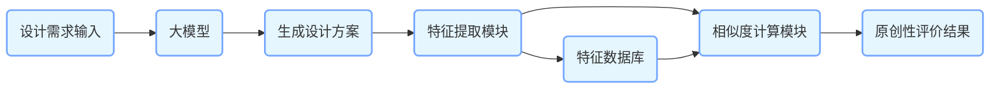

# 大模型在创意设计推理任务中的原创性评价

> 关键词：大模型、创意设计推理任务、原创性评价、评价指标、评价方法

> 摘要：随着大模型在创意设计推理任务中的应用日益广泛，其生成结果的原创性评价成为了重要议题。本文旨在深入探讨大模型在创意设计推理任务中原创性评价的相关内容。首先介绍了研究的背景、目的、预期读者等信息，接着阐述了核心概念与联系，包括相关概念的原理和架构。详细讲解了核心算法原理及具体操作步骤，通过Python源代码进行说明。给出了数学模型和公式，并举例阐释。通过项目实战展示了代码实现和解读。分析了实际应用场景，推荐了相关的工具和资源。最后总结了未来发展趋势与挑战，解答了常见问题并提供了扩展阅读和参考资料，以期为该领域的研究和实践提供全面且深入的指导。

## 1. 背景介绍 
### 1.1 目的和范围
在当今数字化时代，大模型凭借其强大的语言处理和生成能力，在创意设计推理任务中发挥着越来越重要的作用。然而，对于大模型生成的创意设计结果，其原创性的准确评价至关重要。本研究的目的在于构建一套科学、有效的原创性评价体系，用于评估大模型在创意设计推理任务中的表现。范围涵盖了多种类型的创意设计领域，如平面设计、工业设计、广告创意等，以及不同架构和规模的大模型。

### 1.2 预期读者
本文预期读者包括人工智能领域的研究人员、创意设计行业的从业者、对大模型应用感兴趣的技术爱好者以及相关专业的学生。对于研究人员，本文可为其深入研究大模型原创性评价提供理论和方法参考；对于从业者，有助于其在实际工作中更好地选择和应用大模型进行创意设计；对于技术爱好者和学生，能够帮助他们了解该领域的前沿知识和技术。

### 1.3 文档结构概述
本文将按照以下结构展开：首先介绍相关的核心概念与联系，明确原创性评价的基本原理和架构；接着详细阐述核心算法原理及具体操作步骤，通过Python代码进行说明；然后给出数学模型和公式，并结合实例进行讲解；通过项目实战展示代码的实际应用和解读；分析大模型在创意设计推理任务中的实际应用场景；推荐相关的学习资源、开发工具框架和论文著作；最后总结未来发展趋势与挑战，解答常见问题并提供扩展阅读和参考资料。

### 1.4 术语表
#### 1.4.1 核心术语定义
- **大模型**：指具有大量参数和强大计算能力的人工智能模型，如GPT系列、BERT等，能够处理复杂的自然语言处理和生成任务。
- **创意设计推理任务**：要求模型根据给定的设计需求和相关信息，生成具有创新性和实用性的设计方案的任务。
- **原创性**：指设计结果在思想、形式、内容等方面具有独特性和新颖性，不依赖于已有的设计。

#### 1.4.2 相关概念解释
- **创意设计**：是一种创造性的活动，旨在通过各种手段和方法，将设计师的创意和想法转化为具体的设计作品。
- **推理任务**：在人工智能中，指模型根据输入的信息进行逻辑推导和判断，得出相应的输出结果。
- **评价指标**：用于衡量大模型生成结果原创性的具体参数和标准。

#### 1.4.3 缩略词列表
- **GPT**：Generative Pretrained Transformer（生成式预训练变换器）
- **BERT**：Bidirectional Encoder Representations from Transformers（基于变换器的双向编码器表示）

## 2. 核心概念与联系 

### 核心概念原理
大模型在创意设计推理任务中的原创性评价涉及多个方面的概念和原理。首先，大模型通过学习大量的文本数据和设计案例，掌握了一定的设计知识和语言模式。在创意设计推理任务中，它根据输入的设计需求，利用这些知识和模式生成设计方案。然而，生成的方案可能会受到训练数据的影响，存在与已有设计相似的情况。因此，原创性评价的核心在于判断生成方案与已有设计的差异程度。

原创性评价的原理基于对设计方案的特征提取和分析。通过提取设计方案的关键特征，如颜色、形状、布局、语义等，将其与已有设计的特征进行对比，计算相似度。相似度越低，说明原创性越高。

### 架构示意图
以下是大模型在创意设计推理任务中原创性评价的架构示意图：



### 架构说明
1. **设计需求输入**：用户将创意设计的需求输入到大模型中，作为生成设计方案的依据。
2. **大模型**：根据输入的设计需求，利用其学习到的知识和模式，生成相应的设计方案。
3. **特征提取模块**：对生成的设计方案进行特征提取，将其转换为可以进行比较的特征向量。
4. **特征数据库**：存储了大量已有设计的特征向量，作为对比的参考。
5. **相似度计算模块**：将生成设计方案的特征向量与特征数据库中的特征向量进行对比，计算相似度。
6. **原创性评价结果**：根据相似度计算结果，得出生成设计方案的原创性评价结果。

## 3. 核心算法原理 & 具体操作步骤 

### 核心算法原理
本研究采用基于特征相似度的原创性评价算法。具体来说，通过计算生成设计方案的特征向量与特征数据库中已有设计的特征向量之间的距离，来衡量它们的相似度。常用的距离度量方法包括欧几里得距离、余弦相似度等。

### 欧几里得距离
欧几里得距离是最常用的距离度量方法之一，用于计算两个向量之间的直线距离。对于两个向量 $\mathbf{x}=(x_1,x_2,\cdots,x_n)$ 和 $\mathbf{y}=(y_1,y_2,\cdots,y_n)$，它们之间的欧几里得距离 $d(\mathbf{x},\mathbf{y})$ 定义为：

$$d(\mathbf{x},\mathbf{y})=\sqrt{\sum_{i=1}^{n}(x_i - y_i)^2}$$

### 余弦相似度
余弦相似度用于衡量两个向量之间的夹角余弦值，反映了它们的方向相似性。对于两个向量 $\mathbf{x}$ 和 $\mathbf{y}$，它们之间的余弦相似度 $s(\mathbf{x},\mathbf{y})$ 定义为：

$$s(\mathbf{x},\mathbf{y})=\frac{\mathbf{x}\cdot\mathbf{y}}{\|\mathbf{x}\|\|\mathbf{y}\|}=\frac{\sum_{i=1}^{n}x_iy_i}{\sqrt{\sum_{i=1}^{n}x_i^2}\sqrt{\sum_{i=1}^{n}y_i^2}}$$

### 具体操作步骤
以下是基于Python的实现代码：

```python
import numpy as np

# 特征提取函数（示例）
def extract_features(design):
    # 这里简单地将设计转换为一维向量作为特征
    return np.array(design).flatten()

# 欧几里得距离计算函数
def euclidean_distance(x, y):
    return np.sqrt(np.sum((x - y) ** 2))

# 余弦相似度计算函数
def cosine_similarity(x, y):
    dot_product = np.dot(x, y)
    norm_x = np.linalg.norm(x)
    norm_y = np.linalg.norm(y)
    if norm_x == 0 or norm_y == 0:
        return 0
    return dot_product / (norm_x * norm_y)

# 原创性评价函数
def originality_evaluation(generated_design, feature_database, similarity_threshold=0.8):
    generated_features = extract_features(generated_design)
    min_similarity = 1
    for existing_features in feature_database:
        similarity = cosine_similarity(generated_features, existing_features)
        if similarity < min_similarity:
            min_similarity = similarity
    if min_similarity < similarity_threshold:
        return "高原创性"
    else:
        return "低原创性"

# 示例数据
generated_design = [[1, 2, 3], [4, 5, 6]]
feature_database = [np.array([1, 2, 3, 4, 5, 6]), np.array([7, 8, 9, 10, 11, 12])]

# 进行原创性评价
result = originality_evaluation(generated_design, feature_database)
print("原创性评价结果:", result)
```

### 代码解释
1. **extract_features** 函数：用于提取设计方案的特征，这里简单地将设计转换为一维向量。
2. **euclidean_distance** 函数：计算两个向量之间的欧几里得距离。
3. **cosine_similarity** 函数：计算两个向量之间的余弦相似度。
4. **originality_evaluation** 函数：对生成的设计方案进行原创性评价，通过比较其与特征数据库中已有设计的相似度，判断其原创性高低。
5. **示例数据**：定义了一个生成的设计方案和一个特征数据库，调用 `originality_evaluation` 函数进行原创性评价，并输出结果。

## 4. 数学模型和公式 & 详细讲解 & 举例说明 

### 数学模型
在大模型在创意设计推理任务中的原创性评价中，我们可以建立一个基于相似度的数学模型。设 $D_g$ 为生成的设计方案，$D_i$ 为特征数据库中的第 $i$ 个已有设计方案，$F_g$ 为 $D_g$ 的特征向量，$F_i$ 为 $D_i$ 的特征向量。

我们可以定义原创性得分 $O$ 为：

$$O = 1 - \max_{i} s(F_g,F_i)$$

其中，$s(F_g,F_i)$ 表示 $F_g$ 和 $F_i$ 之间的相似度，$\max_{i} s(F_g,F_i)$ 表示生成设计方案的特征向量与特征数据库中所有已有设计方案的特征向量之间的最大相似度。

### 详细讲解
原创性得分 $O$ 的取值范围为 $[0,1]$。当 $O$ 接近 1 时，表示生成的设计方案与已有设计方案的相似度很低，原创性很高；当 $O$ 接近 0 时，表示生成的设计方案与已有设计方案的相似度很高，原创性很低。

### 举例说明
假设我们有一个特征数据库，其中包含三个已有设计方案的特征向量：

$F_1 = [0.1, 0.2, 0.3]$

$F_2 = [0.4, 0.5, 0.6]$

$F_3 = [0.7, 0.8, 0.9]$

生成的设计方案的特征向量为：

$F_g = [0.2, 0.3, 0.4]$

我们使用余弦相似度来计算 $F_g$ 与 $F_1$、$F_2$、$F_3$ 之间的相似度：

$s(F_g,F_1)=\frac{0.1\times0.2 + 0.2\times0.3 + 0.3\times0.4}{\sqrt{0.1^2 + 0.2^2 + 0.3^2}\sqrt{0.2^2 + 0.3^2 + 0.4^2}}\approx0.99$

$s(F_g,F_2)=\frac{0.2\times0.4 + 0.3\times0.5 + 0.4\times0.6}{\sqrt{0.2^2 + 0.3^2 + 0.4^2}\sqrt{0.4^2 + 0.5^2 + 0.6^2}}\approx0.97$

$s(F_g,F_3)=\frac{0.2\times0.7 + 0.3\times0.8 + 0.4\times0.9}{\sqrt{0.2^2 + 0.3^2 + 0.4^2}\sqrt{0.7^2 + 0.8^2 + 0.9^2}}\approx0.94$

$\max_{i} s(F_g,F_i)=0.99$

原创性得分 $O = 1 - 0.99 = 0.01$

由于 $O$ 接近 0，说明生成的设计方案与已有设计方案的相似度很高，原创性很低。

## 5. 项目实战：代码实际案例和详细解释说明 

### 5.1  开发环境搭建
本项目使用Python进行开发，需要安装以下库：
- **numpy**：用于数值计算和向量操作。
- **matplotlib**：用于数据可视化（可选）。

可以使用以下命令安装这些库：

```sh
pip install numpy matplotlib
```

### 5.2  源代码详细实现和代码解读
以下是一个更完整的项目实战代码示例：

```python
import numpy as np
import matplotlib.pyplot as plt

# 特征提取函数（示例）
def extract_features(design):
    # 这里简单地将设计转换为一维向量作为特征
    return np.array(design).flatten()

# 欧几里得距离计算函数
def euclidean_distance(x, y):
    return np.sqrt(np.sum((x - y) ** 2))

# 余弦相似度计算函数
def cosine_similarity(x, y):
    dot_product = np.dot(x, y)
    norm_x = np.linalg.norm(x)
    norm_y = np.linalg.norm(y)
    if norm_x == 0 or norm_y == 0:
        return 0
    return dot_product / (norm_x * norm_y)

# 原创性评价函数
def originality_evaluation(generated_design, feature_database, similarity_threshold=0.8):
    generated_features = extract_features(generated_design)
    similarities = []
    for existing_features in feature_database:
        similarity = cosine_similarity(generated_features, existing_features)
        similarities.append(similarity)
    max_similarity = max(similarities)
    originality_score = 1 - max_similarity
    if originality_score > 1 - similarity_threshold:
        return "高原创性", originality_score
    else:
        return "低原创性", originality_score

# 生成示例数据
np.random.seed(42)
num_designs = 10
design_dim = 5
feature_database = [np.random.rand(design_dim) for _ in range(num_designs)]
generated_design = np.random.rand(design_dim)

# 进行原创性评价
result, score = originality_evaluation(generated_design, feature_database)
print("原创性评价结果:", result)
print("原创性得分:", score)

# 可视化相似度分布
similarities = []
generated_features = extract_features(generated_design)
for existing_features in feature_database:
    similarity = cosine_similarity(generated_features, existing_features)
    similarities.append(similarity)

plt.bar(range(len(similarities)), similarities)
plt.xlabel('已有设计')
plt.ylabel('相似度')
plt.title('生成设计与已有设计的相似度分布')
plt.show()
```

### 5.3  代码解读与分析
1. **特征提取函数**：`extract_features` 函数将设计方案转换为一维向量，作为其特征表示。
2. **距离和相似度计算函数**：`euclidean_distance` 函数计算欧几里得距离，`cosine_similarity` 函数计算余弦相似度。
3. **原创性评价函数**：`originality_evaluation` 函数对生成的设计方案进行原创性评价，计算其与特征数据库中已有设计的最大相似度，并根据相似度阈值判断其原创性高低。
4. **示例数据生成**：使用 `numpy` 生成示例数据，包括特征数据库和生成的设计方案。
5. **原创性评价和结果输出**：调用 `originality_evaluation` 函数进行原创性评价，并输出评价结果和原创性得分。
6. **可视化**：使用 `matplotlib` 绘制生成设计与已有设计的相似度分布直方图，直观展示相似度情况。

## 6. 实际应用场景 
### 平面设计
在平面设计领域，大模型可以根据用户的需求生成海报、宣传册、图标等设计方案。通过原创性评价，可以筛选出具有独特创意和新颖性的设计方案，避免设计抄袭和雷同。例如，广告公司可以使用大模型生成多种广告海报设计方案，然后利用原创性评价指标选择最具原创性的方案进行投放。

### 工业设计
在工业设计中，大模型可以辅助设计师进行产品外观设计、结构设计等。原创性评价可以帮助设计师评估生成的设计方案是否具有创新性，是否能够在市场上脱颖而出。例如，汽车制造商可以使用大模型生成汽车外观设计方案，通过原创性评价选择最具特色的设计方案进行量产。

### 广告创意
在广告创意领域，大模型可以生成广告文案、广告语、广告视频脚本等。原创性评价可以确保生成的广告创意具有独特性和吸引力，提高广告的效果和影响力。例如，广告策划公司可以使用大模型生成多个广告创意方案，通过原创性评价选择最具创意的方案进行广告制作。

## 7. 工具和资源推荐
### 7.1 学习资源推荐
#### 7.1.1 书籍推荐
- 《人工智能：一种现代方法》：全面介绍了人工智能的基本概念、算法和应用，是人工智能领域的经典教材。
- 《深度学习》：详细讲解了深度学习的原理、算法和实践，对于理解大模型的工作原理有很大帮助。
- 《设计心理学》：介绍了设计的心理学原理和方法，对于理解创意设计的本质和用户需求有重要意义。

#### 7.1.2 在线课程
- Coursera上的“深度学习专项课程”：由深度学习领域的知名学者授课，系统讲解了深度学习的理论和实践。
- edX上的“人工智能基础”：介绍了人工智能的基本概念、算法和应用，适合初学者学习。
- 中国大学MOOC上的“设计思维与创新方法”：讲解了设计思维的原理和方法，以及如何在创意设计中应用创新方法。

#### 7.1.3 技术博客和网站
- Medium：是一个技术博客平台，上面有很多关于人工智能、创意设计等领域的优秀文章。
- arXiv：是一个预印本数据库，上面有很多最新的学术研究成果，包括大模型、创意设计等领域的研究论文。
- 开源中国：是一个开源技术社区，上面有很多关于人工智能、创意设计等领域的开源项目和技术文章。

### 7.2 开发工具框架推荐
#### 7.2.1 IDE和编辑器
- PyCharm：是一款专业的Python集成开发环境，具有强大的代码编辑、调试和项目管理功能。
- Jupyter Notebook：是一个交互式的开发环境，适合进行数据分析、模型训练和实验。
- Visual Studio Code：是一款轻量级的代码编辑器，支持多种编程语言和插件扩展，具有良好的开发体验。

#### 7.2.2 调试和性能分析工具
- TensorBoard：是TensorFlow的可视化工具，可以用于查看模型的训练过程、性能指标等信息。
- PyTorch Profiler：是PyTorch的性能分析工具，可以用于分析模型的运行时间、内存使用等情况。
- cProfile：是Python的内置性能分析工具，可以用于分析Python代码的性能瓶颈。

#### 7.2.3 相关框架和库
- TensorFlow：是一个开源的机器学习框架，提供了丰富的工具和接口，用于构建和训练深度学习模型。
- PyTorch：是一个开源的深度学习框架，具有动态图、易于使用等特点，广泛应用于学术界和工业界。
- Scikit-learn：是一个开源的机器学习库，提供了丰富的机器学习算法和工具，用于数据预处理、模型训练和评估等任务。

### 7.3 相关论文著作推荐
#### 7.3.1 经典论文
- “Attention Is All You Need”：介绍了Transformer架构，是大模型发展的重要里程碑。
- “Generative Adversarial Nets”：提出了生成对抗网络（GAN），为创意设计生成提供了新的思路。
- “A Survey on Creativity Support Tools”：对创意支持工具进行了全面的综述，包括大模型在创意设计中的应用。

#### 7.3.2 最新研究成果
- 关注顶级学术会议，如NeurIPS、ICML、CVPR等，上面有很多关于大模型、创意设计等领域的最新研究成果。
- 关注知名学术期刊，如Journal of Artificial Intelligence Research、Artificial Intelligence等，上面有很多高质量的学术论文。

#### 7.3.3 应用案例分析
- 关注相关行业的案例分析报告，如广告公司、设计公司等发布的案例分析报告，了解大模型在实际应用中的效果和经验。
- 关注开源项目的文档和案例，如GitHub上的开源创意设计项目，学习他人的实践经验。

## 8. 总结：未来发展趋势与挑战
### 未来发展趋势
- **多模态融合**：未来大模型在创意设计推理任务中的应用将更加注重多模态融合，结合图像、文本、音频等多种信息，生成更加丰富和生动的设计方案。
- **个性化定制**：随着用户需求的多样化，大模型将能够根据用户的个性化需求生成更加符合用户喜好的创意设计方案，提高用户满意度。
- **可解释性增强**：为了更好地理解大模型的决策过程和生成结果，未来的研究将更加注重提高大模型的可解释性，让设计师能够更好地控制和调整设计方案。

### 挑战
- **数据隐私和安全**：大模型的训练需要大量的数据，这些数据可能包含用户的隐私信息。如何保护数据隐私和安全，是大模型在创意设计推理任务中面临的重要挑战。
- **原创性评价标准的统一**：目前，对于大模型生成结果的原创性评价还没有统一的标准和方法。如何建立科学、客观、统一的原创性评价标准，是该领域需要解决的问题。
- **计算资源和效率**：大模型的训练和推理需要大量的计算资源和时间。如何提高大模型的计算效率，降低计算成本，是未来发展的关键。

## 9. 附录：常见问题与解答
### 问题1：大模型生成的设计方案一定具有高原创性吗？
答：不一定。大模型的生成结果受到训练数据和模型架构的影响，可能会存在与已有设计相似的情况。因此，需要对生成的设计方案进行原创性评价，以确保其具有足够的原创性。

### 问题2：如何提高大模型生成设计方案的原创性？
答：可以从以下几个方面入手：
- 扩大训练数据的多样性，让大模型学习到更多不同类型的设计案例。
- 采用生成对抗网络（GAN）等技术，增强大模型的生成能力和创造力。
- 结合人类设计师的创意和经验，对大模型生成的设计方案进行优化和改进。

### 问题3：原创性评价指标有哪些局限性？
答：原创性评价指标存在一定的局限性，例如：
- 特征提取方法可能不够准确，导致评价结果存在偏差。
- 相似度计算方法可能无法全面反映设计方案的原创性，例如某些设计方案可能在局部有创新，但整体相似度较高。
- 评价指标可能无法考虑到设计方案的文化背景、用户需求等因素，导致评价结果不够全面。

## 10. 扩展阅读 & 参考资料
### 扩展阅读
- 《创意设计的思维与方法》
- 《人工智能与未来设计》
- 《深度学习实战》

### 参考资料
- Goodfellow, I. J., et al. (2014). Generative adversarial nets. Advances in neural information processing systems.
- Vaswani, A., et al. (2017). Attention is all you need. Advances in neural information processing systems.
- Bisk, Y., et al. (2020). A survey on creativity support tools. ACM Computing Surveys (CSUR).