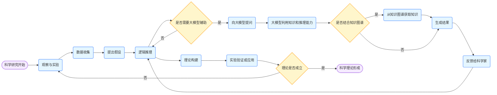

# 大模型在科学理论构建过程中的推理辅助角色分析

> 关键词：大模型、科学理论构建、推理辅助、人工智能、知识图谱、自然语言处理、科学发现

> 摘要：本文旨在深入分析大模型在科学理论构建过程中所扮演的推理辅助角色。首先介绍了相关背景，包括目的范围、预期读者等内容。接着阐述了大模型、科学理论构建等核心概念及其联系，通过文本示意图和 Mermaid 流程图进行直观展示。详细讲解了大模型用于推理辅助的核心算法原理，并给出 Python 代码示例。对涉及的数学模型和公式进行了推导和举例说明。通过项目实战展示了大模型在科学推理中的实际应用，包括开发环境搭建、代码实现与解读。探讨了大模型在不同科学领域的实际应用场景，推荐了学习资源、开发工具框架以及相关论文著作。最后总结了大模型在科学理论构建中未来的发展趋势与面临的挑战，同时提供了常见问题解答和扩展阅读参考资料，以期为相关领域的研究和实践提供全面且深入的参考。

## 1. 背景介绍 
### 1.1 目的和范围
本研究的目的在于全面且深入地探讨大模型在科学理论构建过程中所起到的推理辅助作用。科学理论的构建是一个复杂且漫长的过程，涉及到对大量信息的收集、整理、分析和推理。随着人工智能技术的快速发展，大模型凭借其强大的语言理解和生成能力，逐渐在科学研究领域崭露头角。本研究将聚焦于大模型如何为科学理论构建中的推理环节提供支持，包括但不限于知识检索、逻辑推理、假设生成等方面。研究范围涵盖自然科学、社会科学等多个领域，旨在揭示大模型在不同科学场景下的推理辅助潜力和局限性。

### 1.2 预期读者
本文预期读者包括从事科学研究的科研人员，他们可以从文中了解大模型如何助力科学理论的构建，为其研究工作提供新的思路和方法；人工智能领域的研究者和开发者，能够从中获取大模型在科学应用中的具体实现和技术细节；以及对科学与技术交叉领域感兴趣的学生和爱好者，帮助他们理解大模型在科学推理中的重要作用和应用前景。

### 1.3 文档结构概述
本文将按照以下结构展开：首先介绍相关背景信息，包括目的、预期读者和文档结构概述等内容。接着详细阐述大模型、科学理论构建等核心概念及其相互联系，并通过文本示意图和 Mermaid 流程图进行直观展示。然后深入讲解大模型用于推理辅助的核心算法原理，并给出 Python 代码示例。对涉及的数学模型和公式进行推导和举例说明。通过项目实战展示大模型在科学推理中的实际应用，包括开发环境搭建、代码实现与解读。探讨大模型在不同科学领域的实际应用场景，推荐学习资源、开发工具框架以及相关论文著作。最后总结大模型在科学理论构建中未来的发展趋势与面临的挑战，同时提供常见问题解答和扩展阅读参考资料。

### 1.4 术语表
#### 1.4.1 核心术语定义
- **大模型**：通常指基于深度学习的大规模神经网络模型，具有大量的参数和强大的学习能力，能够处理复杂的自然语言处理、图像识别等任务。例如，GPT - 3、BERT 等都是知名的大模型。
- **科学理论构建**：是指科学家通过对自然现象或社会现象的观察、实验和分析，提出假设、进行推理和验证，最终形成具有普遍性和系统性的科学理论的过程。
- **推理辅助**：大模型在科学理论构建过程中，通过提供知识、进行逻辑推理、生成假设等方式，帮助科学家更高效地进行推理和理论构建的作用。

#### 1.4.2 相关概念解释
- **知识图谱**：是一种语义网络，用于表示实体之间的关系和知识。在科学理论构建中，知识图谱可以为大模型提供结构化的知识，辅助推理过程。
- **自然语言处理（NLP）**：是人工智能的一个重要领域，研究如何让计算机理解和处理人类语言。大模型在科学推理中的应用往往依赖于自然语言处理技术。

#### 1.4.3 缩略词列表
- **GPT**：Generative Pretrained Transformer，生成式预训练变换器。
- **BERT**：Bidirectional Encoder Representations from Transformers，基于变换器的双向编码器表示。
- **NLP**：Natural Language Processing，自然语言处理。

## 2. 核心概念与联系 
### 核心概念原理
#### 大模型原理
大模型通常基于深度学习中的神经网络架构，如 Transformer 架构。Transformer 架构通过自注意力机制（Self - Attention Mechanism）能够捕捉输入序列中不同位置之间的依赖关系，从而更好地理解和处理长文本。在训练过程中，大模型使用大量的文本数据进行无监督学习，学习语言的模式和规律。预训练后的模型可以通过微调（Fine - Tuning）应用于不同的自然语言处理任务，如文本分类、问答系统等。

#### 科学理论构建原理
科学理论构建是一个基于实证研究和逻辑推理的过程。科学家首先对研究对象进行观察和实验，收集相关数据。然后根据这些数据提出假设，通过逻辑推理和数学推导对假设进行进一步的发展和完善。最后，通过实验验证或实际应用来检验理论的正确性和有效性。

### 架构的文本示意图
大模型在科学理论构建中的推理辅助角色可以用以下文本示意图表示：

科学家进行科学研究，在观察、实验和推理的过程中，需要获取相关知识和进行逻辑推理。大模型作为一个知识源和推理工具，通过自然语言处理技术与科学家进行交互。科学家可以向大模型提出问题，大模型利用其预训练的知识和推理能力，提供相关的知识信息、生成假设或进行逻辑推理。同时，大模型可以与知识图谱相结合，从知识图谱中获取结构化的知识，进一步增强其推理能力。生成的结果可以反馈给科学家，帮助他们进行科学理论的构建。

### Mermaid 流程图


## 3. 核心算法原理 & 具体操作步骤 
### 核心算法原理
大模型在推理辅助中常用的算法原理包括基于 Transformer 的语言模型和知识图谱嵌入算法。

#### 基于 Transformer 的语言模型
Transformer 架构由编码器和解码器组成。编码器负责将输入的文本序列转换为一系列的特征表示，解码器则根据这些特征表示生成输出文本。自注意力机制是 Transformer 的核心，它可以计算输入序列中每个位置与其他位置的相关性，从而更好地捕捉序列中的语义信息。

以下是一个简化的自注意力机制的 Python 代码示例：
```python
import torch
import torch.nn as nn
import torch.nn.functional as F

class SelfAttention(nn.Module):
    def __init__(self, input_dim, d_k, d_v):
        super(SelfAttention, self).__init__()
        self.W_q = nn.Linear(input_dim, d_k)
        self.W_k = nn.Linear(input_dim, d_k)
        self.W_v = nn.Linear(input_dim, d_v)

    def forward(self, x):
        Q = self.W_q(x)
        K = self.W_k(x)
        V = self.W_v(x)

        attn_scores = torch.matmul(Q, K.transpose(-2, -1)) / torch.sqrt(torch.tensor(Q.size(-1), dtype=torch.float32))
        attn_probs = F.softmax(attn_scores, dim=-1)
        output = torch.matmul(attn_probs, V)
        return output
```

#### 知识图谱嵌入算法
知识图谱嵌入算法的目的是将知识图谱中的实体和关系嵌入到低维向量空间中，以便于大模型进行处理。常见的知识图谱嵌入算法包括 TransE、DistMult 等。

以下是一个简化的 TransE 算法的 Python 代码示例：
```python
import torch
import torch.nn as nn
import torch.optim as optim

class TransE(nn.Module):
    def __init__(self, entity_num, relation_num, embedding_dim):
        super(TransE, self).__init__()
        self.entity_embeddings = nn.Embedding(entity_num, embedding_dim)
        self.relation_embeddings = nn.Embedding(relation_num, embedding_dim)

    def forward(self, head, relation, tail):
        head_emb = self.entity_embeddings(head)
        relation_emb = self.relation_embeddings(relation)
        tail_emb = self.entity_embeddings(tail)

        score = torch.norm(head_emb + relation_emb - tail_emb, p=1, dim=-1)
        return score
```

### 具体操作步骤
1. **数据预处理**：将科学文本数据进行清洗、分词等预处理操作，以便于大模型进行处理。
2. **模型训练**：使用大规模的文本数据对大模型进行预训练，学习语言的模式和规律。
3. **微调模型**：根据具体的科学推理任务，对预训练的大模型进行微调，使其适应特定的任务需求。
4. **知识图谱构建**：收集和整理科学领域的知识，构建知识图谱，并使用知识图谱嵌入算法将其嵌入到低维向量空间中。
5. **推理辅助**：在科学理论构建过程中，科学家向大模型提出问题，大模型结合自身的知识和推理能力，以及知识图谱中的信息，进行推理和生成结果。

## 4. 数学模型和公式 & 详细讲解 & 举例说明 
### 自注意力机制的数学模型和公式
自注意力机制的核心是计算注意力分数，然后通过 softmax 函数将其转换为注意力概率，最后根据注意力概率对值向量进行加权求和。

设输入序列为 $X = [x_1, x_2, \cdots, x_n]$，其中 $x_i \in \mathbb{R}^d$ 表示第 $i$ 个位置的输入向量，$d$ 是输入向量的维度。

首先，通过线性变换将输入向量转换为查询向量 $Q$、键向量 $K$ 和值向量 $V$：
$$
Q = W_q X \\
K = W_k X \\
V = W_v X
$$
其中 $W_q \in \mathbb{R}^{d \times d_k}$，$W_k \in \mathbb{R}^{d \times d_k}$，$W_v \in \mathbb{R}^{d \times d_v}$ 是可学习的权重矩阵，$d_k$ 和 $d_v$ 分别是查询向量、键向量和值向量的维度。

然后，计算注意力分数：
$$
\text{Attention Scores}_{ij} = \frac{Q_i K_j^T}{\sqrt{d_k}}
$$
其中 $Q_i$ 和 $K_j$ 分别是查询向量和键向量的第 $i$ 行和第 $j$ 行。

接着，通过 softmax 函数将注意力分数转换为注意力概率：
$$
\text{Attention Probs}_{ij} = \frac{\exp(\text{Attention Scores}_{ij})}{\sum_{k = 1}^{n} \exp(\text{Attention Scores}_{ik})}
$$

最后，根据注意力概率对值向量进行加权求和，得到输出向量：
$$
\text{Output}_i = \sum_{j = 1}^{n} \text{Attention Probs}_{ij} V_j
$$

### 举例说明
假设输入序列 $X = \begin{bmatrix} 1 & 2 \\ 3 & 4 \\ 5 & 6 \end{bmatrix}$，$d = 2$，$d_k = d_v = 2$。

设 $W_q = \begin{bmatrix} 1 & 0 \\ 0 & 1 \end{bmatrix}$，$W_k = \begin{bmatrix} 1 & 0 \\ 0 & 1 \end{bmatrix}$，$W_v = \begin{bmatrix} 1 & 0 \\ 0 & 1 \end{bmatrix}$。

则 $Q = W_q X = \begin{bmatrix} 1 & 2 \\ 3 & 4 \\ 5 & 6 \end{bmatrix}$，$K = W_k X = \begin{bmatrix} 1 & 2 \\ 3 & 4 \\ 5 & 6 \end{bmatrix}$，$V = W_v X = \begin{bmatrix} 1 & 2 \\ 3 & 4 \\ 5 & 6 \end{bmatrix}$。

计算注意力分数：
$$
\text{Attention Scores} = \frac{Q K^T}{\sqrt{2}} = \frac{1}{\sqrt{2}} \begin{bmatrix} 1 & 2 \\ 3 & 4 \\ 5 & 6 \end{bmatrix} \begin{bmatrix} 1 & 3 & 5 \\ 2 & 4 & 6 \end{bmatrix} = \frac{1}{\sqrt{2}} \begin{bmatrix} 5 & 11 & 17 \\ 11 & 25 & 39 \\ 17 & 39 & 61 \end{bmatrix}
$$

计算注意力概率：
$$
\text{Attention Probs} = \text{softmax}(\text{Attention Scores})
$$

最后，根据注意力概率对值向量进行加权求和，得到输出向量。

### TransE 算法的数学模型和公式
TransE 算法的核心思想是将知识图谱中的实体和关系嵌入到低维向量空间中，使得对于一个三元组 $(h, r, t)$（其中 $h$ 是头实体，$r$ 是关系，$t$ 是尾实体），满足 $h + r \approx t$。

设 $e_h$、$e_r$ 和 $e_t$ 分别是头实体、关系和尾实体的嵌入向量。则 TransE 算法的目标是最小化以下损失函数：
$$
L = \sum_{(h, r, t) \in S} \sum_{(h', r', t') \in S'} [\gamma + d(h + r, t) - d(h' + r', t')]_+
$$
其中 $S$ 是正样本集合，$S'$ 是负样本集合，$\gamma$ 是边际超参数，$d(x, y) = \|x - y\|_1$ 是 L1 距离，$[z]_+ = \max(0, z)$ 是合页损失函数。

### 举例说明
假设知识图谱中有一个三元组 $(h, r, t)$，其中 $h$ 表示“苹果”，$r$ 表示“属于”，$t$ 表示“水果”。将“苹果”、“属于”和“水果”分别嵌入到三维向量空间中，设 $e_h = [0.1, 0.2, 0.3]$，$e_r = [0.4, 0.5, 0.6]$，$e_t = [0.5, 0.7, 0.9]$。

则 $h + r = [0.1 + 0.4, 0.2 + 0.5, 0.3 + 0.6] = [0.5, 0.7, 0.9]$，$d(h + r, t) = \| [0.5, 0.7, 0.9] - [0.5, 0.7, 0.9] \|_1 = 0$。

## 5. 项目实战：代码实际案例和详细解释说明 
### 5.1  开发环境搭建
#### 安装 Python
首先，确保你已经安装了 Python 3.7 或更高版本。可以从 Python 官方网站（https://www.python.org/downloads/） 下载并安装适合你操作系统的 Python 版本。

#### 安装深度学习框架
本项目使用 PyTorch 作为深度学习框架。可以使用以下命令安装 PyTorch：
```sh
pip install torch torchvision
```

#### 安装自然语言处理库
安装 Hugging Face 的 Transformers 库，用于使用预训练的大模型：
```sh
pip install transformers
```

#### 安装知识图谱处理库
安装 rdflib 库，用于处理知识图谱数据：
```sh
pip install rdflib
```

### 5.2  源代码详细实现和代码解读
#### 加载预训练的大模型
```python
from transformers import AutoTokenizer, AutoModelForQuestionAnswering
import torch

# 加载预训练的模型和分词器
tokenizer = AutoTokenizer.from_pretrained("bert-large-uncased-whole-word-masking-finetuned-squad")
model = AutoModelForQuestionAnswering.from_pretrained("bert-large-uncased-whole-word-masking-finetuned-squad")

# 定义问题和文本
question = "科学理论构建的步骤有哪些？"
text = "科学理论构建通常包括观察与实验、数据收集、提出假设、逻辑推理、理论构建、实验验证或应用等步骤。"

# 对问题和文本进行编码
inputs = tokenizer(question, text, return_tensors='pt')

# 进行推理
with torch.no_grad():
    outputs = model(**inputs)

# 获取答案的起始和结束位置
answer_start_index = outputs.start_logits.argmax()
answer_end_index = outputs.end_logits.argmax()

# 获取答案
predict_answer_tokens = inputs.input_ids[0, answer_start_index : answer_end_index + 1]
answer = tokenizer.decode(predict_answer_tokens)

print("答案：", answer)
```
**代码解读**：
1. **加载预训练的模型和分词器**：使用 Hugging Face 的 Transformers 库加载预训练的 BERT 模型和对应的分词器。
2. **定义问题和文本**：定义要查询的问题和相关的文本。
3. **对问题和文本进行编码**：使用分词器将问题和文本转换为模型可以处理的输入格式。
4. **进行推理**：使用预训练的模型对输入进行推理，得到答案的起始和结束位置的对数几率。
5. **获取答案**：根据起始和结束位置的对数几率，找出概率最大的位置，提取答案的 token 并解码为文本。

#### 知识图谱处理和推理
```python
from rdflib import Graph, Literal, RDF, URIRef
from rdflib.namespace import FOAF, XSD

# 创建一个知识图谱
g = Graph()

# 定义实体和关系
apple = URIRef("http://example.org/apple")
fruit = URIRef("http://example.org/fruit")
belongs_to = URIRef("http://example.org/belongs_to")

# 添加三元组到知识图谱
g.add((apple, belongs_to, fruit))

# 查询知识图谱
query = """
SELECT ?subject ?predicate ?object
WHERE {
    ?subject ?predicate ?object .
}
"""

# 执行查询
results = g.query(query)

# 输出查询结果
for row in results:
    print(f"{row.subject} {row.predicate} {row.object}")
```
**代码解读**：
1. **创建一个知识图谱**：使用 rdflib 库创建一个空的知识图谱。
2. **定义实体和关系**：使用 URIRef 定义知识图谱中的实体和关系。
3. **添加三元组到知识图谱**：使用 add 方法将三元组添加到知识图谱中。
4. **查询知识图谱**：使用 SPARQL 查询语言编写查询语句，查询知识图谱中的所有三元组。
5. **执行查询并输出结果**：使用 query 方法执行查询，并遍历查询结果输出。

### 5.3  代码解读与分析
#### 大模型推理代码分析
在大模型推理代码中，我们使用了预训练的 BERT 模型进行问答任务。BERT 模型通过在大规模文本数据上进行预训练，学习到了语言的模式和规律。在微调阶段，模型针对问答任务进行了优化，能够更好地理解问题和文本之间的关系，从而准确地找出答案的位置。

#### 知识图谱处理代码分析
在知识图谱处理代码中，我们使用 rdflib 库创建和管理知识图谱。知识图谱以三元组的形式存储知识，通过 SPARQL 查询语言可以方便地进行查询和推理。知识图谱可以为大模型提供结构化的知识，辅助大模型进行推理。

## 6. 实际应用场景 
### 自然科学领域
#### 物理学
在物理学中，大模型可以帮助物理学家在理论构建过程中进行知识检索和推理。例如，当物理学家研究新的物理现象时，可以向大模型提问相关的物理知识，如经典力学、量子力学等。大模型可以提供相关的理论和实验数据，帮助物理学家提出假设和进行推理。同时，大模型可以结合知识图谱中的物理知识，进行逻辑推理，验证假设的合理性。

#### 化学
在化学领域，大模型可以用于分子结构预测、化学反应机理研究等。例如，通过输入分子的化学式和相关条件，大模型可以预测分子的结构和性质。在研究化学反应机理时，大模型可以根据已知的反应数据和化学知识，生成可能的反应路径和中间产物，为化学家提供参考。

### 社会科学领域
#### 经济学
在经济学中，大模型可以帮助经济学家分析经济数据、预测经济趋势和构建经济理论。例如，大模型可以对大量的经济数据进行分析，挖掘数据中的规律和趋势。在构建经济理论时，大模型可以提供相关的经济理论和案例，帮助经济学家进行逻辑推理和模型构建。

#### 社会学
在社会学领域，大模型可以用于社会现象分析和社会理论构建。例如，通过分析社交媒体数据和调查问卷数据，大模型可以了解社会群体的行为和态度。在构建社会理论时，大模型可以提供相关的社会学理论和研究成果，帮助社会学家进行推理和验证。

## 7. 工具和资源推荐
### 7.1 学习资源推荐
#### 7.1.1 书籍推荐
- 《深度学习》（Deep Learning）：由 Ian Goodfellow、Yoshua Bengio 和 Aaron Courville 所著，是深度学习领域的经典教材，全面介绍了深度学习的基本概念、算法和应用。
- 《自然语言处理入门》（Natural Language Processing with Python）：由 Steven Bird、Ewan Klein 和 Edward Loper 所著，详细介绍了自然语言处理的基本技术和方法，包括分词、词性标注、命名实体识别等。
- 《知识图谱：方法、实践与应用》：由王昊奋、漆桂林、陈华钧 等编著，系统介绍了知识图谱的构建、表示、推理和应用等方面的知识。

#### 7.1.2 在线课程
- Coursera 上的“深度学习专项课程”（Deep Learning Specialization）：由 Andrew Ng 教授讲授，包括深度学习的基础知识、卷积神经网络、循环神经网络等内容。
- edX 上的“自然语言处理”（Natural Language Processing）：由哥伦比亚大学的教授讲授，介绍了自然语言处理的最新技术和应用。
- 中国大学 MOOC 上的“知识图谱与语义网”：由陈华钧教授讲授，详细介绍了知识图谱的相关知识和技术。

#### 7.1.3 技术博客和网站
- Hugging Face 博客（https://huggingface.co/blog）：提供了关于自然语言处理、大模型等方面的最新研究成果和技术文章。
- arXiv（https://arxiv.org/）：一个预印本平台，包含了大量的计算机科学、物理学等领域的研究论文。
- Medium 上的 AI 相关博客：有许多优秀的 AI 技术博客，如 Towards Data Science 等，提供了关于人工智能、机器学习等方面的技术文章和案例分析。

### 7.2 开发工具框架推荐
#### 7.2.1 IDE和编辑器
- PyCharm：一款专业的 Python 集成开发环境，提供了代码编辑、调试、版本控制等功能，方便开发人员进行 Python 项目的开发。
- Jupyter Notebook：一个交互式的开发环境，适合进行数据探索、模型训练和可视化等工作。

#### 7.2.2 调试和性能分析工具
- TensorBoard：一个可视化工具，用于监控和分析深度学习模型的训练过程，如损失函数曲线、准确率曲线等。
- PyTorch Profiler：PyTorch 提供的性能分析工具，可以帮助开发人员找出模型训练过程中的性能瓶颈。

#### 7.2.3 相关框架和库
- PyTorch：一个开源的深度学习框架，提供了丰富的深度学习模型和工具，支持 GPU 加速。
- Transformers：Hugging Face 开发的自然语言处理库，提供了大量的预训练模型和工具，方便开发人员进行自然语言处理任务。
- rdflib：一个用于处理 RDF 数据的 Python 库，支持知识图谱的创建、查询和推理。

### 7.3 相关论文著作推荐
#### 7.3.1 经典论文
- “Attention Is All You Need”：介绍了 Transformer 架构，是自然语言处理领域的经典论文。
- “BERT: Pre - training of Deep Bidirectional Transformers for Language Understanding”：提出了 BERT 模型，推动了自然语言处理技术的发展。
- “Translating Embeddings for Modeling Multi - relational Data”：提出了 TransE 算法，是知识图谱嵌入领域的经典论文。

#### 7.3.2 最新研究成果
- 关注 ACL（Association for Computational Linguistics）、NeurIPS（Conference on Neural Information Processing Systems）等顶级学术会议的最新论文，了解大模型和科学推理领域的最新研究成果。
- 查阅顶级学术期刊，如 Journal of Artificial Intelligence Research（JAIR）、Artificial Intelligence 等，获取相关的研究论文。

#### 7.3.3 应用案例分析
- 参考相关的学术论文和技术报告，了解大模型在不同科学领域的应用案例，如大模型在医学领域的疾病诊断、在天文学领域的天体分类等。

## 8. 总结：未来发展趋势与挑战
### 未来发展趋势
#### 更强大的推理能力
随着大模型技术的不断发展，其推理能力将不断增强。未来的大模型将能够处理更加复杂的科学推理任务，如多步推理、不确定性推理等。同时，大模型将能够更好地结合知识图谱等外部知识源，提供更加准确和全面的推理结果。

#### 跨学科融合
科学研究越来越呈现出跨学科的特点，未来的大模型将能够更好地支持跨学科的科学理论构建。大模型将能够整合不同学科的知识和方法，为科学家提供跨学科的推理辅助，促进科学的交叉融合和创新发展。

#### 与实验设备的集成
大模型将与实验设备进行更紧密的集成，实现从实验设计、数据采集到理论构建的全流程支持。例如，大模型可以根据实验目的和条件，自动设计实验方案，并对实验数据进行实时分析和推理，加速科学发现的过程。

### 挑战
#### 知识的准确性和可靠性
大模型的推理结果依赖于其训练数据和知识图谱中的知识。然而，这些知识可能存在错误、过时或不完整的情况，导致推理结果的不准确和不可靠。因此，如何确保大模型所使用的知识的准确性和可靠性是一个重要的挑战。

#### 可解释性问题
大模型通常是基于深度学习的黑盒模型，其推理过程难以解释。在科学理论构建中，科学家需要理解模型的推理过程和依据，以便对结果进行评估和验证。因此，如何提高大模型的可解释性是一个亟待解决的问题。

#### 伦理和法律问题
大模型在科学研究中的应用可能会带来一系列的伦理和法律问题，如数据隐私、知识产权、责任归属等。如何在大模型的应用中保障数据的安全和隐私，明确知识产权和责任归属，是需要解决的重要问题。

## 9. 附录：常见问题与解答
### 大模型在科学理论构建中的推理辅助是否能替代科学家的工作？
不能。大模型在科学理论构建中起到推理辅助的作用，它可以为科学家提供知识和推理支持，但不能替代科学家的创造性思维和实践能力。科学理论的构建需要科学家进行观察、实验、提出假设等创造性工作，大模型只是辅助工具。

### 如何评估大模型在科学推理中的性能？
可以从多个方面评估大模型在科学推理中的性能，如推理结果的准确性、召回率、F1 值等。同时，还可以考虑模型的推理速度、可解释性等因素。此外，通过实际的科学应用案例来评估大模型的性能也是一种有效的方法。

### 大模型在科学推理中如何处理不确定性？
大模型可以通过概率推理、贝叶斯网络等方法来处理不确定性。例如，在推理过程中，大模型可以给出不同结果的概率分布，帮助科学家评估结果的可靠性。同时，结合知识图谱中的不确定性信息，大模型可以更好地处理不确定性推理任务。

## 10. 扩展阅读 & 参考资料
### 扩展阅读
- 《人工智能时代的科学革命》：探讨了人工智能技术对科学研究的影响和变革。
- 《科学发现的逻辑》：卡尔·波普尔的经典著作，介绍了科学发现的逻辑和方法。

### 参考资料
- Hugging Face 官方文档（https://huggingface.co/docs）
- PyTorch 官方文档（https://pytorch.org/docs/stable/index.html）
- rdflib 官方文档（https://rdflib.readthedocs.io/en/stable/）