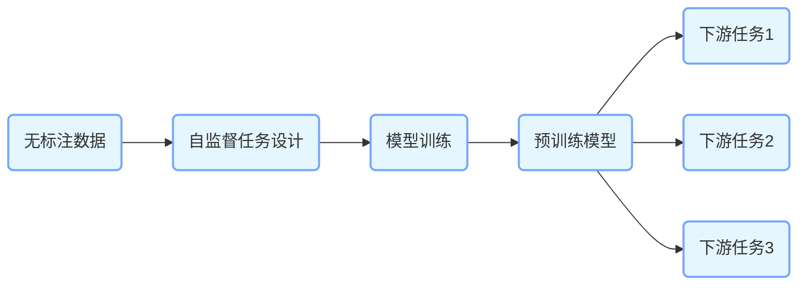

# 大规模自监督学习:利用无标注数据的新方法

> 关键词：大规模自监督学习、无标注数据、预训练模型、自监督任务、表征学习

> 摘要：本文围绕大规模自监督学习这一利用无标注数据的新方法展开。首先介绍了大规模自监督学习的背景，包括其目的、预期读者等。接着阐述了核心概念与联系，展示了其原理和架构。详细讲解了核心算法原理及具体操作步骤，并通过Python代码进行阐述。深入分析了数学模型和公式，辅以举例说明。通过项目实战给出代码实际案例并进行详细解释。探讨了实际应用场景，推荐了相关的工具和资源。最后总结了未来发展趋势与挑战，解答了常见问题并提供了扩展阅读和参考资料，旨在全面剖析大规模自监督学习这一新兴技术，帮助读者深入理解和应用该方法。

## 1. 背景介绍 
### 1.1 目的和范围
在传统的机器学习和深度学习任务中，标注数据的获取往往是一项耗时、费力且成本高昂的工作。大量有价值的数据由于缺乏标注而无法被充分利用。大规模自监督学习的出现为解决这一问题提供了新的途径。其目的在于利用无标注数据自动学习到数据的有用表征，从而提升模型在各种下游任务中的性能。

本文的范围涵盖大规模自监督学习的基本概念、核心算法、数学模型、实际应用以及相关的工具和资源等方面，旨在为读者提供一个全面而深入的关于大规模自监督学习的知识体系。

### 1.2 预期读者
本文预期读者包括对机器学习、深度学习领域感兴趣的研究人员、学生，以及从事相关应用开发的工程师。对于希望深入了解如何利用无标注数据进行模型训练，提升模型性能的专业人士，本文将提供有价值的参考。同时，对于初学者来说，也可以通过本文初步了解大规模自监督学习的基本原理和应用场景。

### 1.3 文档结构概述
本文首先介绍大规模自监督学习的背景知识，包括目的、预期读者和文档结构等。接着阐述核心概念与联系，让读者了解大规模自监督学习的基本原理和架构。然后详细讲解核心算法原理及具体操作步骤，通过Python代码进行说明。之后介绍数学模型和公式，并举例说明。再通过项目实战展示代码实际案例并进行详细解释。随后探讨实际应用场景，推荐相关的工具和资源。最后总结未来发展趋势与挑战，解答常见问题并提供扩展阅读和参考资料。

### 1.4 术语表
#### 1.4.1 核心术语定义
- **自监督学习**：一种无监督学习方法，通过构造自监督任务，利用数据自身的信息来学习数据的表征，无需人工标注。
- **无标注数据**：没有经过人工标记或注释的数据，通常包含大量的原始信息，但缺乏明确的标签信息。
- **预训练模型**：在大规模无标注数据上进行自监督学习得到的模型，其学习到的表征可以迁移到各种下游任务中。
- **表征学习**：从原始数据中自动学习到具有语义信息的特征表示，使得模型能够更好地理解和处理数据。
- **下游任务**：在预训练模型的基础上，针对具体的应用场景进行微调或直接使用的任务，如分类、检测、生成等。

#### 1.4.2 相关概念解释
- **自监督任务**：为了让模型从无标注数据中学习到有用的信息，需要设计一些特定的任务，如图像的旋转预测、掩码语言模型等。这些任务的目标是让模型在解决这些任务的过程中学习到数据的内在结构和特征。
- **对比学习**：一种自监督学习的方法，通过对比正样本和负样本之间的相似度，让模型学习到数据的区分性特征。

#### 1.4.3 缩略词列表
- **SSL**：Self-Supervised Learning（自监督学习）
- **BERT**：Bidirectional Encoder Representations from Transformers（基于Transformer的双向编码器表征）
- **GPT**：Generative Pretrained Transformer（生成式预训练Transformer）

## 2. 核心概念与联系 
大规模自监督学习的核心思想是利用无标注数据自动学习到数据的有用表征。其基本原理是通过设计自监督任务，让模型在解决这些任务的过程中学习到数据的内在结构和语义信息。

### 核心概念原理
自监督学习通过构造一些代理任务（proxy task），利用数据自身的信息作为监督信号。例如，在图像领域，可以将图像进行旋转，然后让模型预测旋转的角度；在自然语言处理领域，可以将句子中的一些单词掩码，然后让模型预测这些掩码的单词。通过解决这些代理任务，模型可以学习到数据的特征表示。

预训练模型是大规模自监督学习的重要产物。在大规模无标注数据上进行自监督学习得到的预训练模型，其学习到的表征具有通用性和可迁移性。可以将预训练模型应用到各种下游任务中，通过微调或直接使用的方式，提升下游任务的性能。

### 架构示意图
下面是一个简单的大规模自监督学习的架构示意图：



该示意图展示了大规模自监督学习的基本流程。首先，利用无标注数据设计自监督任务，然后通过模型训练得到预训练模型，最后将预训练模型应用到各种下游任务中。

## 3. 核心算法原理 & 具体操作步骤 
### 核心算法原理
以对比学习为例，对比学习的核心思想是让模型学习到正样本之间的相似度高，负样本之间的相似度低。具体来说，给定一个样本 $x$，通过数据增强等方式生成其正样本 $x^+$，同时从数据集中随机选取一些负样本 $x^-$。模型的目标是最大化正样本对之间的相似度，最小化负样本对之间的相似度。

常用的对比学习损失函数是 InfoNCE（Info Noise Contrastive Estimation）损失函数，其公式为：

$$
\mathcal{L}_{InfoNCE} = -\log \frac{\exp(\text{sim}(z, z^+)/\tau)}{\sum_{i=0}^{N} \exp(\text{sim}(z, z_i)/\tau)}
$$

其中，$z$ 和 $z^+$ 分别是样本 $x$ 和其正样本 $x^+$ 的特征表示，$z_i$ 是负样本的特征表示，$\text{sim}$ 表示相似度度量（如余弦相似度），$\tau$ 是温度参数。

### 具体操作步骤
下面是一个使用Python和PyTorch实现简单对比学习的示例代码：

```python
import torch
import torch.nn as nn
import torch.optim as optim
import torchvision.transforms as transforms
from torch.utils.data import DataLoader, Dataset
from torchvision.datasets import CIFAR10
import numpy as np

# 定义数据集
class ContrastiveDataset(Dataset):
    def __init__(self, dataset):
        self.dataset = dataset
        self.transform = transforms.Compose([
            transforms.RandomResizedCrop(32),
            transforms.RandomHorizontalFlip(),
            transforms.ToTensor(),
            transforms.Normalize((0.5, 0.5, 0.5), (0.5, 0.5, 0.5))
        ])

    def __len__(self):
        return len(self.dataset)

    def __getitem__(self, idx):
        img, _ = self.dataset[idx]
        img1 = self.transform(img)
        img2 = self.transform(img)
        return img1, img2

# 定义模型
class Encoder(nn.Module):
    def __init__(self):
        super(Encoder, self).__init__()
        self.conv1 = nn.Conv2d(3, 64, kernel_size=3, stride=1, padding=1)
        self.relu = nn.ReLU()
        self.pool = nn.MaxPool2d(kernel_size=2, stride=2)
        self.fc = nn.Linear(64 * 16 * 16, 128)

    def forward(self, x):
        x = self.conv1(x)
        x = self.relu(x)
        x = self.pool(x)
        x = x.view(-1, 64 * 16 * 16)
        x = self.fc(x)
        return x

# 定义对比学习损失函数
class InfoNCELoss(nn.Module):
    def __init__(self, temperature=0.1):
        super(InfoNCELoss, self).__init__()
        self.temperature = temperature
        self.criterion = nn.CrossEntropyLoss()

    def forward(self, features):
        labels = torch.arange(features.shape[0]).to(features.device)
        similarity_matrix = torch.matmul(features, features.T) / self.temperature
        return self.criterion(similarity_matrix, labels)

# 训练过程
def train(model, dataloader, criterion, optimizer, device, epochs):
    model.train()
    for epoch in range(epochs):
        running_loss = 0.0
        for img1, img2 in dataloader:
            img1 = img1.to(device)
            img2 = img2.to(device)

            features1 = model(img1)
            features2 = model(img2)
            features = torch.cat((features1, features2), dim=0)

            loss = criterion(features)

            optimizer.zero_grad()
            loss.backward()
            optimizer.step()

            running_loss += loss.item()

        print(f'Epoch {epoch + 1}, Loss: {running_loss / len(dataloader)}')

# 主函数
if __name__ == '__main__':
    device = torch.device('cuda' if torch.cuda.is_available() else 'cpu')

    # 加载数据集
    cifar10 = CIFAR10(root='./data', train=True, download=True)
    contrastive_dataset = ContrastiveDataset(cifar10)
    dataloader = DataLoader(contrastive_dataset, batch_size=32, shuffle=True)

    # 初始化模型、损失函数和优化器
    model = Encoder().to(device)
    criterion = InfoNCELoss()
    optimizer = optim.Adam(model.parameters(), lr=0.001)

    # 训练模型
    train(model, dataloader, criterion, optimizer, device, epochs=10)
```

### 代码解释
1. **数据集定义**：`ContrastiveDataset` 类继承自 `torch.utils.data.Dataset`，用于生成正样本对。通过数据增强的方式对同一张图像进行两次变换，得到正样本对。
2. **模型定义**：`Encoder` 类是一个简单的卷积神经网络，用于提取图像的特征表示。
3. **损失函数定义**：`InfoNCELoss` 类实现了 InfoNCE 损失函数，通过计算特征之间的相似度矩阵，并使用交叉熵损失函数进行优化。
4. **训练过程**：`train` 函数用于训练模型，在每个 epoch 中，遍历数据集，计算损失并更新模型参数。

## 4. 数学模型和公式 & 详细讲解 & 举例说明 
### 数学模型和公式
#### InfoNCE 损失函数
InfoNCE 损失函数的公式为：

$$
\mathcal{L}_{InfoNCE} = -\log \frac{\exp(\text{sim}(z, z^+)/\tau)}{\sum_{i=0}^{N} \exp(\text{sim}(z, z_i)/\tau)}
$$

其中，$z$ 和 $z^+$ 分别是样本 $x$ 和其正样本 $x^+$ 的特征表示，$z_i$ 是负样本的特征表示，$\text{sim}$ 表示相似度度量（如余弦相似度），$\tau$ 是温度参数。

#### 余弦相似度
余弦相似度是一种常用的相似度度量方法，其公式为：

$$
\text{sim}(a, b) = \frac{a \cdot b}{\|a\| \|b\|}
$$

其中，$a$ 和 $b$ 是两个向量，$\cdot$ 表示点积，$\|a\|$ 和 $\|b\|$ 分别表示向量 $a$ 和 $b$ 的模。

### 详细讲解
InfoNCE 损失函数的目标是最大化正样本对之间的相似度，最小化负样本对之间的相似度。通过对数函数和指数函数的组合，将相似度的比较转化为概率的比较。温度参数 $\tau$ 控制了相似度的平滑程度，当 $\tau$ 较小时，相似度的差异会被放大，模型会更加关注正样本对和负样本对之间的差异；当 $\tau$ 较大时，相似度的差异会被缩小，模型会更加关注整体的分布。

余弦相似度通过计算两个向量之间的夹角余弦值来度量它们的相似度。当两个向量的方向相同时，余弦相似度为 1；当两个向量的方向相反时，余弦相似度为 -1。

### 举例说明
假设我们有一个样本 $x$，其特征表示为 $z = [0.1, 0.2, 0.3]$，其正样本 $x^+$ 的特征表示为 $z^+ = [0.12, 0.22, 0.32]$，负样本 $x^-$ 的特征表示为 $z^- = [-0.1, -0.2, -0.3]$。温度参数 $\tau = 0.1$。

首先，计算余弦相似度：

$$
\text{sim}(z, z^+) = \frac{0.1 \times 0.12 + 0.2 \times 0.22 + 0.3 \times 0.32}{\sqrt{0.1^2 + 0.2^2 + 0.3^2} \sqrt{0.12^2 + 0.22^2 + 0.32^2}} \approx 0.99
$$

$$
\text{sim}(z, z^-) = \frac{0.1 \times (-0.1) + 0.2 \times (-0.2) + 0.3 \times (-0.3)}{\sqrt{0.1^2 + 0.2^2 + 0.3^2} \sqrt{(-0.1)^2 + (-0.2)^2 + (-0.3)^2}} \approx -1
$$

然后，计算 InfoNCE 损失函数：

$$
\mathcal{L}_{InfoNCE} = -\log \frac{\exp(0.99/0.1)}{\exp(0.99/0.1) + \exp(-1/0.1)} \approx 0.0001
$$

这个例子展示了如何计算 InfoNCE 损失函数，以及正样本对和负样本对之间的相似度对损失函数的影响。

## 5. 项目实战：代码实际案例和详细解释说明 
### 5.1  开发环境搭建
#### 安装Python
首先，确保你已经安装了Python 3.6或更高版本。可以从Python官方网站（https://www.python.org/downloads/） 下载并安装。

#### 安装深度学习框架
本项目使用PyTorch作为深度学习框架，可以根据自己的需求选择合适的安装方式。可以参考PyTorch官方网站（https://pytorch.org/get-started/locally/） 进行安装。

#### 安装其他依赖库
除了PyTorch，还需要安装一些其他的依赖库，如 `torchvision`、`numpy` 等。可以使用以下命令进行安装：

```sh
pip install torchvision numpy
```

### 5.2  源代码详细实现和代码解读
下面是一个使用自监督学习进行图像分类的完整代码示例：

```python
import torch
import torch.nn as nn
import torch.optim as optim
import torchvision.transforms as transforms
from torch.utils.data import DataLoader, Dataset
from torchvision.datasets import CIFAR10
import numpy as np

# 定义自监督任务数据集
class SelfSupervisedDataset(Dataset):
    def __init__(self, dataset):
        self.dataset = dataset
        self.transform = transforms.Compose([
            transforms.RandomResizedCrop(32),
            transforms.RandomHorizontalFlip(),
            transforms.ToTensor(),
            transforms.Normalize((0.5, 0.5, 0.5), (0.5, 0.5, 0.5))
        ])

    def __len__(self):
        return len(self.dataset)

    def __getitem__(self, idx):
        img, _ = self.dataset[idx]
        img1 = self.transform(img)
        img2 = self.transform(img)
        return img1, img2

# 定义模型
class Encoder(nn.Module):
    def __init__(self):
        super(Encoder, self).__init__()
        self.conv1 = nn.Conv2d(3, 64, kernel_size=3, stride=1, padding=1)
        self.relu = nn.ReLU()
        self.pool = nn.MaxPool2d(kernel_size=2, stride=2)
        self.fc = nn.Linear(64 * 16 * 16, 128)

    def forward(self, x):
        x = self.conv1(x)
        x = self.relu(x)
        x = self.pool(x)
        x = x.view(-1, 64 * 16 * 16)
        x = self.fc(x)
        return x

# 定义对比学习损失函数
class InfoNCELoss(nn.Module):
    def __init__(self, temperature=0.1):
        super(InfoNCELoss, self).__init__()
        self.temperature = temperature
        self.criterion = nn.CrossEntropyLoss()

    def forward(self, features):
        labels = torch.arange(features.shape[0]).to(features.device)
        similarity_matrix = torch.matmul(features, features.T) / self.temperature
        return self.criterion(similarity_matrix, labels)

# 自监督训练过程
def self_supervised_train(model, dataloader, criterion, optimizer, device, epochs):
    model.train()
    for epoch in range(epochs):
        running_loss = 0.0
        for img1, img2 in dataloader:
            img1 = img1.to(device)
            img2 = img2.to(device)

            features1 = model(img1)
            features2 = model(img2)
            features = torch.cat((features1, features2), dim=0)

            loss = criterion(features)

            optimizer.zero_grad()
            loss.backward()
            optimizer.step()

            running_loss += loss.item()

        print(f'Self-Supervised Epoch {epoch + 1}, Loss: {running_loss / len(dataloader)}')

# 定义分类数据集
class ClassificationDataset(Dataset):
    def __init__(self, dataset):
        self.dataset = dataset
        self.transform = transforms.Compose([
            transforms.ToTensor(),
            transforms.Normalize((0.5, 0.5, 0.5), (0.5, 0.5, 0.5))
        ])

    def __len__(self):
        return len(self.dataset)

    def __getitem__(self, idx):
        img, label = self.dataset[idx]
        img = self.transform(img)
        return img, label

# 定义分类模型
class Classifier(nn.Module):
    def __init__(self, encoder):
        super(Classifier, self).__init__()
        self.encoder = encoder
        self.fc = nn.Linear(128, 10)

    def forward(self, x):
        x = self.encoder(x)
        x = self.fc(x)
        return x

# 分类训练过程
def classification_train(model, dataloader, criterion, optimizer, device, epochs):
    model.train()
    for epoch in range(epochs):
        running_loss = 0.0
        correct = 0
        total = 0
        for img, label in dataloader:
            img = img.to(device)
            label = label.to(device)

            output = model(img)
            loss = criterion(output, label)

            optimizer.zero_grad()
            loss.backward()
            optimizer.step()

            running_loss += loss.item()
            _, predicted = torch.max(output.data, 1)
            total += label.size(0)
            correct += (predicted == label).sum().item()

        print(f'Classification Epoch {epoch + 1}, Loss: {running_loss / len(dataloader)}, Accuracy: {100 * correct / total}%')

# 主函数
if __name__ == '__main__':
    device = torch.device('cuda' if torch.cuda.is_available() else 'cpu')

    # 加载自监督任务数据集
    cifar10 = CIFAR10(root='./data', train=True, download=True)
    self_supervised_dataset = SelfSupervisedDataset(cifar10)
    self_supervised_dataloader = DataLoader(self_supervised_dataset, batch_size=32, shuffle=True)

    # 初始化模型、损失函数和优化器
    encoder = Encoder().to(device)
    criterion = InfoNCELoss()
    optimizer = optim.Adam(encoder.parameters(), lr=0.001)

    # 自监督训练
    self_supervised_train(encoder, self_supervised_dataloader, criterion, optimizer, device, epochs=10)

    # 加载分类数据集
    classification_dataset = ClassificationDataset(cifar10)
    classification_dataloader = DataLoader(classification_dataset, batch_size=32, shuffle=True)

    # 初始化分类模型、损失函数和优化器
    classifier = Classifier(encoder).to(device)
    classification_criterion = nn.CrossEntropyLoss()
    classification_optimizer = optim.Adam(classifier.parameters(), lr=0.001)

    # 分类训练
    classification_train(classifier, classification_dataloader, classification_criterion, classification_optimizer, device, epochs=10)
```

### 5.3  代码解读与分析
#### 自监督学习部分
- **数据集定义**：`SelfSupervisedDataset` 类用于生成自监督任务的数据集，通过数据增强的方式对同一张图像进行两次变换，得到正样本对。
- **模型定义**：`Encoder` 类是一个简单的卷积神经网络，用于提取图像的特征表示。
- **损失函数定义**：`InfoNCELoss` 类实现了 InfoNCE 损失函数，通过计算特征之间的相似度矩阵，并使用交叉熵损失函数进行优化。
- **训练过程**：`self_supervised_train` 函数用于自监督训练，在每个 epoch 中，遍历数据集，计算损失并更新模型参数。

#### 分类学习部分
- **数据集定义**：`ClassificationDataset` 类用于生成分类任务的数据集，对图像进行简单的预处理。
- **模型定义**：`Classifier` 类在 `Encoder` 模型的基础上添加了一个全连接层，用于进行分类任务。
- **损失函数定义**：`nn.CrossEntropyLoss` 用于分类任务的损失计算。
- **训练过程**：`classification_train` 函数用于分类训练，在每个 epoch 中，遍历数据集，计算损失和准确率，并更新模型参数。

通过这个代码示例，我们可以看到如何使用自监督学习来预训练模型，然后将预训练模型应用到分类任务中，从而提升分类任务的性能。

## 6. 实际应用场景 
### 计算机视觉领域
- **图像分类**：在大规模无标注图像数据上进行自监督学习，得到预训练模型。然后将预训练模型应用到图像分类任务中，通过微调或直接使用的方式，提升分类准确率。例如，在 ImageNet 数据集上进行自监督预训练，然后将预训练模型应用到各种图像分类任务中。
- **目标检测**：自监督学习可以学习到图像的底层特征和语义信息，有助于提升目标检测模型的性能。例如，在目标检测任务中，使用自监督预训练的骨干网络，可以更快地收敛并提高检测精度。
- **图像生成**：自监督学习可以学习到图像的分布和结构信息，为图像生成任务提供有用的先验知识。例如，在生成对抗网络（GAN）中，使用自监督预训练的编码器可以生成更加真实的图像。

### 自然语言处理领域
- **文本分类**：在大规模无标注文本数据上进行自监督学习，得到预训练语言模型。然后将预训练语言模型应用到文本分类任务中，通过微调或直接使用的方式，提升分类性能。例如，使用 BERT 预训练模型进行情感分析、新闻分类等任务。
- **机器翻译**：自监督学习可以学习到语言的语义和语法信息，有助于提升机器翻译模型的性能。例如，在机器翻译任务中，使用自监督预训练的编码器和解码器，可以提高翻译的质量。
- **问答系统**：自监督学习可以学习到文本的语义表示，为问答系统提供更好的语义理解能力。例如，在问答系统中，使用自监督预训练的语言模型可以更好地理解问题和答案的语义。

### 其他领域
- **语音识别**：在大规模无标注语音数据上进行自监督学习，得到预训练语音模型。然后将预训练语音模型应用到语音识别任务中，提升识别准确率。例如，使用 wav2vec 等自监督预训练模型进行语音识别。
- **推荐系统**：自监督学习可以学习到用户和物品的特征表示，为推荐系统提供更好的特征提取能力。例如，在推荐系统中，使用自监督预训练的模型可以更好地捕捉用户的兴趣和物品的属性。

## 7. 工具和资源推荐
### 7.1 学习资源推荐
#### 7.1.1 书籍推荐
- 《深度学习》（Deep Learning）：由 Ian Goodfellow、Yoshua Bengio 和 Aaron Courville 合著，是深度学习领域的经典教材，全面介绍了深度学习的基本原理和算法。
- 《动手学深度学习》（Dive into Deep Learning）：由 Aston Zhang、Zack C. Lipton、Mu Li 和 Alexander J. Smola 合著，通过大量的代码示例和实践项目，帮助读者快速掌握深度学习的应用。
- 《Python 深度学习》（Deep Learning with Python）：由 Francois Chollet 著，介绍了如何使用 Python 和 Keras 进行深度学习开发，适合初学者入门。

#### 7.1.2 在线课程
- Coursera 上的《深度学习专项课程》（Deep Learning Specialization）：由 Andrew Ng 教授授课，包括神经网络和深度学习、改善深层神经网络、结构化机器学习项目、卷积神经网络、序列模型等课程，全面介绍了深度学习的各个方面。
- edX 上的《强化学习基础》（Foundations of Reinforcement Learning）：介绍了强化学习的基本概念、算法和应用，适合对强化学习感兴趣的读者。
- 哔哩哔哩（B 站）上的一些深度学习相关的视频教程，如李沐的《动手学深度学习》视频课程，通过生动有趣的讲解和实践演示，帮助读者学习深度学习。

#### 7.1.3 技术博客和网站
- Medium：一个技术博客平台，上面有很多关于深度学习、自监督学习的优秀文章，可以帮助读者了解最新的研究成果和技术动态。
- arXiv：一个预印本平台，上面有很多最新的学术论文，包括自监督学习领域的研究成果。
- 机器之心、新智元等人工智能领域的资讯网站，提供了很多关于人工智能技术的介绍和解读。

### 7.2 开发工具框架推荐
#### 7.2.1 IDE和编辑器
- PyCharm：一款专门为 Python 开发设计的集成开发环境（IDE），具有强大的代码编辑、调试和分析功能，适合专业的 Python 开发者使用。
- Jupyter Notebook：一个交互式的开发环境，可以将代码、文本、图像等内容整合在一起，方便进行数据分析和模型训练，适合数据科学家和研究人员使用。
- Visual Studio Code：一款轻量级的代码编辑器，支持多种编程语言和插件，具有丰富的扩展功能，适合初学者和快速开发。

#### 7.2.2 调试和性能分析工具
- PyTorch Profiler：PyTorch 自带的性能分析工具，可以帮助用户分析模型的性能瓶颈，优化模型的训练和推理速度。
- TensorBoard：一个可视化工具，可以帮助用户可视化模型的训练过程、损失曲线、准确率等信息，方便用户进行模型调试和优化。
- cProfile：Python 自带的性能分析工具，可以帮助用户分析 Python 代码的性能瓶颈，找出耗时的函数和代码段。

#### 7.2.3 相关框架和库
- PyTorch：一个开源的深度学习框架，具有动态图和静态图两种模式，支持多种深度学习模型的开发和训练，广泛应用于学术界和工业界。
- TensorFlow：一个开源的深度学习框架，具有强大的分布式训练和部署能力，支持多种深度学习模型的开发和训练，广泛应用于工业界。
- scikit-learn：一个开源的机器学习库，提供了丰富的机器学习算法和工具，如分类、回归、聚类等，适合初学者和快速开发。

### 7.3 相关论文著作推荐
#### 7.3.1 经典论文
- 《BERT: Pre-training of Deep Bidirectional Transformers for Language Understanding》：介绍了 BERT 预训练语言模型的原理和方法，开创了自然语言处理领域的预训练时代。
- 《Generative Adversarial Nets》：介绍了生成对抗网络（GAN）的原理和方法，为图像生成等领域带来了重大突破。
- 《Contrastive Predictive Coding》：介绍了对比预测编码（CPC）的原理和方法，是对比学习领域的经典论文。

#### 7.3.2 最新研究成果
- 《SimCLR: A Simple Framework for Contrastive Learning of Visual Representations》：提出了 SimCLR 对比学习框架，在图像表征学习领域取得了很好的效果。
- 《DINO: Emerging Properties in Self-Supervised Vision Transformers》：介绍了 DINO 自监督学习方法，在视觉 Transformer 领域取得了重要进展。
- 《wav2vec 2.0: A Framework for Self-Supervised Learning of Speech Representations》：提出了 wav2vec 2.0 自监督语音表征学习框架，在语音识别领域取得了很好的效果。

#### 7.3.3 应用案例分析
- 《Self-Supervised Learning for Medical Image Analysis》：介绍了自监督学习在医学图像分析领域的应用案例，如医学图像分类、分割等。
- 《Self-Supervised Learning in Autonomous Driving》：介绍了自监督学习在自动驾驶领域的应用案例，如目标检测、语义分割等。
- 《Self-Supervised Learning for Recommendation Systems》：介绍了自监督学习在推荐系统领域的应用案例，如用户画像、物品推荐等。

## 8. 总结：未来发展趋势与挑战
### 未来发展趋势
- **更强大的预训练模型**：随着计算资源的不断提升和算法的不断改进，未来将会出现更强大的预训练模型，能够学习到更丰富、更通用的表征。例如，在自然语言处理领域，可能会出现比 BERT 更强大的预训练语言模型；在计算机视觉领域，可能会出现比 ResNet 更强大的预训练视觉模型。
- **跨模态自监督学习**：目前的自监督学习主要集中在单一模态的数据上，如图像、文本、语音等。未来，跨模态自监督学习将会成为一个重要的研究方向，能够学习到不同模态数据之间的关联和互补信息，提升模型的综合性能。例如，将图像和文本信息结合起来进行自监督学习，用于图像描述、视觉问答等任务。
- **自监督学习与强化学习的结合**：自监督学习可以学习到数据的有用表征，强化学习可以学习到最优的决策策略。将自监督学习与强化学习结合起来，可以提高强化学习的效率和性能。例如，在机器人控制、自动驾驶等领域，使用自监督学习预训练的模型作为强化学习的特征提取器，能够更快地学习到最优的控制策略。

### 挑战
- **自监督任务的设计**：自监督任务的设计是自监督学习的关键，直接影响到模型的性能。目前，自监督任务的设计主要依赖于人工经验，缺乏系统的理论指导。未来，需要研究更加有效的自监督任务设计方法，提高自监督学习的效率和性能。
- **计算资源的需求**：大规模自监督学习需要大量的计算资源，如 GPU、TPU 等。对于一些小型企业和研究机构来说，计算资源的限制可能会影响到自监督学习的应用和研究。未来，需要研究更加高效的自监督学习算法，降低计算资源的需求。
- **模型的可解释性**：自监督学习得到的模型往往是黑盒模型，缺乏可解释性。在一些对模型可解释性要求较高的领域，如医疗、金融等，模型的可解释性问题可能会限制自监督学习的应用。未来，需要研究更加可解释的自监督学习方法，提高模型的可解释性。

## 9. 附录：常见问题与解答
### 问题 1：自监督学习和无监督学习有什么区别？
自监督学习是无监督学习的一种特殊形式。无监督学习是指在没有标注数据的情况下，让模型自动学习数据的结构和模式。而自监督学习通过构造自监督任务，利用数据自身的信息作为监督信号，让模型在解决这些任务的过程中学习到数据的表征。自监督学习更注重利用数据的内在结构和语义信息，能够学习到更有用的表征。

### 问题 2：自监督学习的预训练模型可以直接应用到所有的下游任务中吗？
一般来说，自监督学习的预训练模型不能直接应用到所有的下游任务中。虽然预训练模型学习到的表征具有一定的通用性和可迁移性，但不同的下游任务可能有不同的需求和特点。在应用预训练模型到下游任务时，通常需要进行微调或在预训练模型的基础上添加一些特定的层，以适应下游任务的需求。

### 问题 3：自监督学习的计算成本高吗？
自监督学习的计算成本通常比较高。一方面，大规模自监督学习需要在大量的无标注数据上进行训练，需要消耗大量的计算资源和时间；另一方面，自监督学习的模型通常比较复杂，需要更多的计算资源来进行训练和推理。不过，随着计算技术的不断发展和算法的不断优化，自监督学习的计算成本正在逐渐降低。

### 问题 4：如何选择合适的自监督任务？
选择合适的自监督任务需要考虑数据的特点和下游任务的需求。一般来说，自监督任务应该能够反映数据的内在结构和语义信息，并且与下游任务有一定的相关性。例如，在图像领域，可以选择旋转预测、颜色预测等自监督任务；在自然语言处理领域，可以选择掩码语言模型、句子顺序预测等自监督任务。此外，还可以通过实验和比较不同的自监督任务，选择性能最优的任务。

## 10. 扩展阅读 & 参考资料
### 扩展阅读
- 《Self-Supervised Learning: Generative or Contrastive》：深入探讨了自监督学习中的生成式和对比式方法，分析了它们的优缺点和适用场景。
- 《A Survey on Self-Supervised Learning》：对自监督学习的发展历程、方法和应用进行了全面的综述，是了解自监督学习的重要参考资料。
- 《Self-Supervised Learning for Vision Transformers》：介绍了自监督学习在视觉 Transformer 中的应用和研究进展，对于关注视觉 Transformer 的读者有很大的帮助。

### 参考资料
- Goodfellow, I., Bengio, Y., & Courville, A. (2016). Deep Learning. MIT Press.
- Zhang, A., Lipton, Z. C., Li, M., & Smola, A. J. (2020). Dive into Deep Learning.
- Chollet, F. (2018). Deep Learning with Python. Manning Publications.
- Devlin, J., Chang, M. W., Lee, K., & Toutanova, K. (2018). BERT: Pre-training of Deep Bidirectional Transformers for Language Understanding. arXiv preprint arXiv:1810.04805.
- Goodfellow, I. J., Pouget-Abadie, J., Mirza, M., Xu, B., Warde-Farley, D., Ozair, S., ... & Bengio, Y. (2014). Generative Adversarial Nets. In Advances in neural information processing systems (pp. 2672-2680).
- van den Oord, A., Li, Y., & Vinyals, O. (2018). Contrastive Predictive Coding. arXiv preprint arXiv:1807.03748.