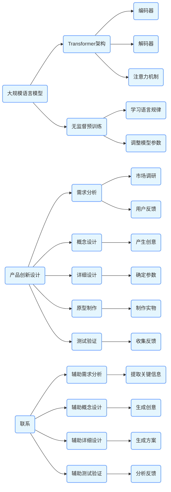

# 大规模语言模型在产品创新设计中的推理应用

> 关键词：大规模语言模型、产品创新设计、推理应用、自然语言处理、人工智能

> 摘要：本文聚焦于大规模语言模型在产品创新设计中的推理应用。首先介绍了相关背景，包括目的范围、预期读者等内容。接着阐述核心概念与联系，分析大规模语言模型和产品创新设计的原理及关联。详细讲解了核心算法原理与操作步骤，结合Python代码进行说明。探讨了数学模型和公式，并举例分析。通过项目实战展示了具体代码案例和详细解释。研究了实际应用场景，推荐了相关工具和资源。最后总结未来发展趋势与挑战，提供常见问题解答及参考资料，旨在全面深入地探讨大规模语言模型在产品创新设计推理应用中的技术要点和实践价值。

## 1. 背景介绍 
### 1.1 目的和范围
在当今竞争激烈的市场环境下，产品创新设计成为企业提升竞争力的关键因素。大规模语言模型作为人工智能领域的重要成果，具有强大的自然语言处理和推理能力。本文章的目的在于深入探讨大规模语言模型在产品创新设计中的推理应用，研究如何利用其能力为产品创新设计提供支持和帮助。范围涵盖大规模语言模型的原理、相关算法、数学模型，以及在产品创新设计各个环节的具体应用和实践案例。

### 1.2 预期读者
本文预期读者包括从事产品设计的专业人员，如工业设计师、产品经理等，他们可以从文中了解如何借助大规模语言模型进行创新设计；人工智能领域的研究人员和开发者，可深入研究相关技术原理和算法；企业管理人员，能够通过本文认识到大规模语言模型在产品创新设计中的战略价值；对人工智能和产品设计感兴趣的学生和爱好者，也能通过本文获得相关知识和启发。

### 1.3 文档结构概述
本文将按照以下结构展开：首先介绍背景信息，包括目的、预期读者和文档结构概述等；接着阐述核心概念与联系，明确大规模语言模型和产品创新设计的基本概念和相互关系；详细讲解核心算法原理和具体操作步骤，结合Python代码进行说明；分析数学模型和公式，并举例解释；通过项目实战展示代码案例和详细解读；探讨实际应用场景；推荐相关工具和资源；总结未来发展趋势与挑战；提供常见问题解答和扩展阅读及参考资料。

### 1.4 术语表
#### 1.4.1 核心术语定义
- **大规模语言模型**：基于深度学习技术，通过在大规模文本数据上进行训练得到的语言模型，能够学习语言的模式和规律，具有强大的自然语言处理能力，如GPT - 3、BERT等。
- **产品创新设计**：指在产品设计过程中，运用新的理念、方法和技术，创造出具有新颖性、实用性和独特性的产品的过程。
- **推理应用**：利用大规模语言模型的能力，根据给定的输入信息，推导出相关的结论、建议或方案，为产品创新设计提供支持。

#### 1.4.2 相关概念解释
- **自然语言处理**：研究如何让计算机理解、处理和生成人类语言的技术领域，是大规模语言模型的核心应用领域之一。
- **深度学习**：一种基于人工神经网络的机器学习方法，通过多层神经网络对数据进行学习和表示，在自然语言处理等领域取得了显著的成果。
- **产品设计流程**：包括需求分析、概念设计、详细设计、原型制作、测试验证等多个阶段，大规模语言模型的推理应用可以在不同阶段发挥作用。

#### 1.4.3 缩略词列表
- **NLP**：Natural Language Processing，自然语言处理
- **LLM**：Large - Language Model，大规模语言模型
- **GPT**：Generative Pretrained Transformer，生成式预训练变换器

## 2. 核心概念与联系 
### 大规模语言模型原理
大规模语言模型基于深度学习中的Transformer架构。Transformer架构主要由编码器和解码器组成，其核心是注意力机制（Attention Mechanism）。注意力机制允许模型在处理输入序列时，动态地关注不同位置的信息，从而捕捉到序列中的长距离依赖关系。

以GPT系列模型为例，它是基于Transformer的解码器架构。模型通过在大规模文本数据上进行无监督预训练，学习到语言的统计规律和语义信息。在预训练过程中，模型的目标是根据输入的前文预测下一个单词，通过不断优化损失函数，调整模型的参数，使得预测结果尽可能准确。

### 产品创新设计原理
产品创新设计是一个复杂的过程，涉及到多个环节和因素。其基本原理是从用户需求出发，通过创造性的思维和方法，结合技术和市场因素，设计出满足用户需求且具有竞争力的产品。

产品创新设计流程通常包括以下几个阶段：
1. **需求分析**：通过市场调研、用户反馈等方式，了解用户的需求和痛点。
2. **概念设计**：基于需求分析的结果，产生多个产品概念和创意。
3. **详细设计**：对选定的产品概念进行细化，确定产品的功能、结构、外观等详细设计参数。
4. **原型制作**：根据详细设计制作产品原型，进行测试和验证。
5. **测试验证**：对产品原型进行性能测试、用户体验测试等，收集反馈并进行优化。

### 两者的联系
大规模语言模型在产品创新设计中可以发挥重要作用。在需求分析阶段，大规模语言模型可以帮助分析用户反馈和市场调研数据，提取关键信息和需求点。在概念设计阶段，它可以通过生成创意和概念，为设计师提供灵感。在详细设计阶段，模型可以根据需求和概念，生成相关的技术参数和设计方案。在测试验证阶段，模型可以对用户反馈进行分析和总结，提出改进建议。

### 文本示意图
```plaintext
大规模语言模型
|-- 基于Transformer架构
|   |-- 编码器
|   |-- 解码器
|   |-- 注意力机制
|-- 无监督预训练
|   |-- 学习语言规律
|   |-- 调整模型参数

产品创新设计
|-- 需求分析
|   |-- 市场调研
|   |-- 用户反馈
|-- 概念设计
|   |-- 产生创意
|-- 详细设计
|   |-- 确定参数
|-- 原型制作
|   |-- 制作实物
|-- 测试验证
|   |-- 收集反馈

联系
|-- 大规模语言模型辅助产品创新设计各阶段
|   |-- 需求分析：提取关键信息
|   |-- 概念设计：生成创意
|   |-- 详细设计：生成方案
|   |-- 测试验证：分析反馈
```

### Mermaid流程图


## 3. 核心算法原理 & 具体操作步骤 
### 核心算法原理
大规模语言模型的核心算法基于Transformer架构，其中注意力机制是关键。注意力机制的基本思想是计算输入序列中每个位置与其他位置的相关性，从而为每个位置分配不同的权重。

在多头注意力机制中，模型会并行地计算多个注意力头，每个注意力头可以捕捉到不同方面的信息。多头注意力机制的计算公式如下：

1. 首先计算查询（Query）、键（Key）和值（Value）：
   - $Q = XW^Q$
   - $K = XW^K$
   - $V = XW^V$
   其中，$X$ 是输入序列，$W^Q$、$W^K$、$W^V$ 是可学习的权重矩阵。

2. 然后计算注意力分数：
   - $Attention(Q, K, V) = softmax(\frac{QK^T}{\sqrt{d_k}})V$
   其中，$d_k$ 是键的维度，$softmax$ 函数用于将注意力分数归一化到 $[0, 1]$ 区间。

3. 多头注意力机制的输出为：
   - $MultiHead(Q, K, V) = Concat(head_1, \cdots, head_h)W^O$
   其中，$head_i = Attention(QW_i^Q, KW_i^K, VW_i^V)$，$h$ 是注意力头的数量，$W^O$ 是可学习的权重矩阵。

### 具体操作步骤
以下是使用Python和Hugging Face的Transformers库实现一个简单的文本生成任务的示例，该任务可以在产品创新设计的概念设计阶段为设计师提供创意。

```python
from transformers import GPT2LMHeadModel, GPT2Tokenizer

# 加载预训练的模型和分词器
model_name = "gpt2"
tokenizer = GPT2Tokenizer.from_pretrained(model_name)
model = GPT2LMHeadModel.from_pretrained(model_name)

# 定义输入文本
input_text = "设计一款新型的智能手表，它应该具有"

# 将输入文本转换为模型可以处理的格式
input_ids = tokenizer.encode(input_text, return_tensors='pt')

# 生成文本
output = model.generate(input_ids, max_length=100, num_beams=5, no_repeat_ngram_size=2, early_stopping=True)

# 将生成的文本转换为可读的字符串
generated_text = tokenizer.decode(output[0], skip_special_tokens=True)

print(generated_text)
```

### 代码解释
1. **加载预训练的模型和分词器**：使用 `GPT2Tokenizer.from_pretrained` 和 `GPT2LMHeadModel.from_pretrained` 函数加载预训练的GPT - 2模型和对应的分词器。
2. **定义输入文本**：输入文本是一个关于产品设计的提示，用于引导模型生成相关的创意。
3. **将输入文本转换为模型可以处理的格式**：使用 `tokenizer.encode` 函数将输入文本转换为模型可以处理的张量形式。
4. **生成文本**：使用 `model.generate` 函数生成文本，通过设置 `max_length` 控制生成文本的长度，`num_beams` 控制束搜索的宽度，`no_repeat_ngram_size` 避免生成重复的短语，`early_stopping` 提前停止生成过程。
5. **将生成的文本转换为可读的字符串**：使用 `tokenizer.decode` 函数将生成的张量转换为可读的字符串。

## 4. 数学模型和公式 & 详细讲解 & 举例说明 
### 注意力机制数学模型
注意力机制的核心是计算注意力分数，用于衡量输入序列中不同位置之间的相关性。如前面所述，注意力分数的计算公式为：

$$Attention(Q, K, V) = softmax(\frac{QK^T}{\sqrt{d_k}})V$$

详细讲解：
- **$QK^T$**：查询矩阵 $Q$ 和键矩阵 $K$ 的转置相乘，得到一个得分矩阵，该矩阵中的每个元素表示查询向量和键向量之间的相似度。
- **$\frac{QK^T}{\sqrt{d_k}}$**：除以 $\sqrt{d_k}$ 是为了防止点积的结果过大，导致梯度在反向传播过程中不稳定。
- **$softmax$ 函数**：将得分矩阵的每一行进行归一化处理，使得每一行的元素之和为1，得到注意力权重矩阵。
- **$softmax(\frac{QK^T}{\sqrt{d_k}})V$**：将注意力权重矩阵与值矩阵 $V$ 相乘，得到注意力输出矩阵，该矩阵是输入序列的加权和。

### 举例说明
假设输入序列 $X$ 是一个长度为 3 的向量序列，每个向量的维度为 4，即 $X \in \mathbb{R}^{3\times4}$。我们将 $X$ 分别乘以权重矩阵 $W^Q$、$W^K$、$W^V$ 得到查询矩阵 $Q$、键矩阵 $K$ 和值矩阵 $V$，假设 $W^Q, W^K, W^V \in \mathbb{R}^{4\times4}$，则 $Q, K, V \in \mathbb{R}^{3\times4}$。

计算 $QK^T$：
$$
QK^T = 
\begin{bmatrix}
q_1^Tk_1 & q_1^Tk_2 & q_1^Tk_3 \\
q_2^Tk_1 & q_2^Tk_2 & q_2^Tk_3 \\
q_3^Tk_1 & q_3^Tk_2 & q_3^Tk_3
\end{bmatrix}
$$

假设 $d_k = 4$，则 $\sqrt{d_k}=2$。计算 $\frac{QK^T}{\sqrt{d_k}}$ 并对每一行应用 $softmax$ 函数得到注意力权重矩阵。最后将注意力权重矩阵与值矩阵 $V$ 相乘得到注意力输出矩阵。

### 多头注意力机制数学模型
多头注意力机制的输出计算公式为：

$$MultiHead(Q, K, V) = Concat(head_1, \cdots, head_h)W^O$$

其中，$head_i = Attention(QW_i^Q, KW_i^K, VW_i^V)$。

详细讲解：
- **$head_i$**：每个注意力头通过将查询、键和值矩阵分别乘以不同的权重矩阵 $W_i^Q$、$W_i^K$、$W_i^V$，然后计算注意力输出。
- **$Concat(head_1, \cdots, head_h)$**：将所有注意力头的输出拼接在一起。
- **$Concat(head_1, \cdots, head_h)W^O$**：将拼接后的矩阵乘以权重矩阵 $W^O$ 得到最终的多头注意力输出。

### 举例说明
假设 $h = 2$，即有两个注意力头。对于第一个注意力头，计算 $head_1 = Attention(QW_1^Q, KW_1^K, VW_1^V)$，对于第二个注意力头，计算 $head_2 = Attention(QW_2^Q, KW_2^K, VW_2^V)$。将 $head_1$ 和 $head_2$ 拼接在一起，然后乘以权重矩阵 $W^O$ 得到最终的多头注意力输出。

## 5. 项目实战：代码实际案例和详细解释说明 
### 5.1  开发环境搭建
#### 安装Python
首先需要安装Python，建议使用Python 3.7及以上版本。可以从Python官方网站（https://www.python.org/downloads/） 下载并安装适合自己操作系统的Python版本。

#### 安装依赖库
使用 `pip` 命令安装所需的依赖库，主要包括 `transformers`、`torch` 等。
```bash
pip install transformers torch
```

### 5.2  源代码详细实现和代码解读
以下是一个更复杂的项目实战案例，利用大规模语言模型进行产品需求分析。我们将使用Hugging Face的 `transformers` 库和 `pandas` 库来处理用户反馈数据。

```python
import pandas as pd
from transformers import AutoTokenizer, AutoModelForSequenceClassification
import torch

# 加载预训练的情感分析模型和分词器
model_name = "distilbert-base-uncased-finetuned-sst-2-english"
tokenizer = AutoTokenizer.from_pretrained(model_name)
model = AutoModelForSequenceClassification.from_pretrained(model_name)

# 读取用户反馈数据
data = pd.read_csv('user_feedback.csv')

# 定义函数进行情感分析
def analyze_sentiment(text):
    inputs = tokenizer(text, return_tensors='pt')
    outputs = model(**inputs)
    logits = outputs.logits
    probabilities = torch.softmax(logits, dim=1)
    sentiment = torch.argmax(probabilities, dim=1).item()
    if sentiment == 0:
        return 'negative'
    else:
        return 'positive'

# 对用户反馈数据进行情感分析
data['sentiment'] = data['feedback'].apply(analyze_sentiment)

# 提取负面反馈
negative_feedback = data[data['sentiment'] == 'negative']

# 打印负面反馈
print(negative_feedback)
```

### 5.3  代码解读与分析
1. **加载预训练的情感分析模型和分词器**：使用 `AutoTokenizer.from_pretrained` 和 `AutoModelForSequenceClassification.from_pretrained` 函数加载预训练的DistilBERT情感分析模型和对应的分词器。
2. **读取用户反馈数据**：使用 `pandas` 库的 `read_csv` 函数读取用户反馈数据，假设数据存储在 `user_feedback.csv` 文件中，文件包含一个 `feedback` 列，存储用户的反馈文本。
3. **定义函数进行情感分析**：`analyze_sentiment` 函数接受一个文本作为输入，将其转换为模型可以处理的格式，通过模型进行推理，得到情感分类的概率，最后根据概率最大值确定情感类别（正或负）。
4. **对用户反馈数据进行情感分析**：使用 `apply` 函数将 `analyze_sentiment` 函数应用到 `data` 数据框的 `feedback` 列，得到每个用户反馈的情感类别，并将结果存储在新的 `sentiment` 列中。
5. **提取负面反馈**：使用布尔索引提取情感类别为负面的用户反馈。
6. **打印负面反馈**：打印提取的负面反馈，这些反馈可以为产品创新设计提供改进方向。

## 6. 实际应用场景 
### 需求分析阶段
在需求分析阶段，大规模语言模型可以帮助企业更好地理解用户需求。通过对用户反馈、市场调研数据等文本信息的分析，模型可以提取关键需求点、发现用户痛点和潜在需求。例如，对在线购物平台上的用户评论进行情感分析和主题提取，了解用户对产品功能、质量、服务等方面的满意度和期望，为产品改进和创新提供依据。

### 概念设计阶段
在概念设计阶段，大规模语言模型可以作为创意生成器，为设计师提供灵感。设计师可以输入一些产品相关的关键词或需求描述，模型可以生成多个产品概念和创意。例如，对于一款新型智能家居产品，设计师输入“方便老人使用、智能化控制、安全可靠”等关键词，模型可以生成诸如“具有语音控制功能的智能药盒”“可自动报警的老人跌倒监测床垫”等创意概念。

### 详细设计阶段
在详细设计阶段，大规模语言模型可以根据产品概念和需求，生成相关的技术参数和设计方案。例如，对于一款智能手表的设计，模型可以根据用户需求和市场趋势，生成手表的尺寸、屏幕分辨率、电池续航时间、功能模块等详细设计参数，以及相应的硬件架构和软件设计方案。

### 测试验证阶段
在测试验证阶段，大规模语言模型可以对用户测试反馈进行分析和总结。通过对用户反馈文本的分类、情感分析和关键词提取，模型可以快速定位产品存在的问题和不足之处，提出改进建议。例如，对一款新开发的手机应用的用户反馈进行分析，发现用户普遍反映应用的界面操作不流畅、某些功能存在漏洞等问题，模型可以根据这些反馈生成相应的改进方案。

## 7. 工具和资源推荐
### 7.1 学习资源推荐
#### 7.1.1 书籍推荐
- 《深度学习》（Deep Learning）：由Ian Goodfellow、Yoshua Bengio和Aaron Courville合著，是深度学习领域的经典教材，全面介绍了深度学习的基本概念、算法和应用。
- 《自然语言处理入门》：详细介绍了自然语言处理的基本技术和方法，包括分词、词性标注、命名实体识别、文本分类等，适合初学者学习。
- 《Python自然语言处理》（Natural Language Processing with Python）：通过Python语言介绍自然语言处理的实践方法，包含大量的代码示例和案例分析。

#### 7.1.2 在线课程
- Coursera上的“深度学习专项课程”（Deep Learning Specialization）：由Andrew Ng教授主讲，涵盖深度学习的各个方面，包括神经网络、卷积神经网络、循环神经网络等。
- edX上的“自然语言处理基础”（Foundations of Natural Language Processing）：系统介绍自然语言处理的基本理论和技术，适合对自然语言处理感兴趣的学习者。
- 哔哩哔哩（B 站）上有许多关于大规模语言模型和自然语言处理的教程视频，如“李宏毅机器学习”系列课程，讲解生动易懂。

#### 7.1.3 技术博客和网站
- Hugging Face博客（https://huggingface.co/blog）：提供关于大规模语言模型和自然语言处理的最新研究成果、技术文章和实践案例。
- Medium上的“Towards Data Science”：汇集了大量关于数据科学、机器学习和人工智能的优质文章，包括大规模语言模型的应用和研究。
- 机器之心（https://www.alpaca.ai/）：专注于人工智能领域的资讯和技术报道，提供最新的研究动态和行业趋势。

### 7.2 开发工具框架推荐
#### 7.2.1 IDE和编辑器
- PyCharm：一款功能强大的Python集成开发环境，提供代码编辑、调试、版本控制等功能，适合开发大规模语言模型相关的Python项目。
- Visual Studio Code：一款轻量级的代码编辑器，支持多种编程语言和插件扩展，可通过安装相关插件进行Python开发和调试。

#### 7.2.2 调试和性能分析工具
- TensorBoard：一个可视化工具，可用于查看深度学习模型的训练过程、损失曲线、模型结构等信息，帮助开发者进行调试和优化。
- PyTorch Profiler：PyTorch提供的性能分析工具，可用于分析模型的运行时间、内存使用情况等，帮助开发者找出性能瓶颈。

#### 7.2.3 相关框架和库
- Hugging Face Transformers：一个强大的自然语言处理库，提供了多种预训练的大规模语言模型和相关工具，方便开发者进行模型的加载、微调、推理等操作。
- PyTorch：一个开源的深度学习框架，广泛应用于自然语言处理、计算机视觉等领域，具有动态图、自动求导等优点。
- TensorFlow：另一个流行的深度学习框架，提供了丰富的工具和库，适合开发大规模语言模型和其他深度学习应用。

### 7.3 相关论文著作推荐
#### 7.3.1 经典论文
- “Attention Is All You Need”：介绍了Transformer架构，是大规模语言模型的基础论文，提出了注意力机制和多头注意力机制。
- “BERT: Pre - training of Deep Bidirectional Transformers for Language Understanding”：介绍了BERT模型，开创了预训练 - 微调的自然语言处理范式。
- “Generative Pretrained Transformer 3”：介绍了GPT - 3模型，展示了大规模语言模型在自然语言生成任务上的强大能力。

#### 7.3.2 最新研究成果
- 关注顶级学术会议如ACL（Association for Computational Linguistics）、EMNLP（Conference on Empirical Methods in Natural Language Processing）、NeurIPS（Conference on Neural Information Processing Systems）上的最新论文，了解大规模语言模型的最新研究进展和技术创新。

#### 7.3.3 应用案例分析
- 研究一些企业和机构在产品创新设计中应用大规模语言模型的实际案例，如谷歌、微软、OpenAI等公司的相关研究和实践，学习他们的经验和方法。

## 8. 总结：未来发展趋势与挑战
### 未来发展趋势
- **更强的推理能力**：未来的大规模语言模型将不断提升其推理能力，能够进行更复杂的逻辑推理和知识推理，为产品创新设计提供更深入、更准确的支持。
- **多模态融合**：大规模语言模型将与计算机视觉、语音识别等技术进行融合，实现多模态的信息处理和推理。例如，在产品设计中，结合图像和文本信息，进行更全面的产品需求分析和创意设计。
- **个性化定制**：根据用户的不同需求和偏好，为用户提供个性化的产品创新设计方案。通过对用户历史数据和行为的分析，模型可以学习用户的特点，生成符合用户需求的产品设计。
- **与其他技术的集成**：大规模语言模型将与物联网、区块链、云计算等技术集成，应用于更广泛的领域。例如，在智能家居产品设计中，结合物联网技术实现设备的互联互通，通过区块链技术保证数据的安全和可信。

### 挑战
- **数据隐私和安全**：大规模语言模型的训练和应用需要大量的数据，如何保护用户的数据隐私和安全是一个重要挑战。例如，在处理用户反馈数据时，需要确保数据不被泄露和滥用。
- **计算资源需求**：训练和运行大规模语言模型需要强大的计算资源，如高性能的GPU集群。如何降低计算成本，提高计算效率是需要解决的问题。
- **模型可解释性**：大规模语言模型通常是黑盒模型，其决策过程和推理结果难以解释。在产品创新设计中，需要模型能够提供可解释的建议和方案，以便设计师和决策者理解和信任。
- **伦理和社会问题**：大规模语言模型的应用可能会带来一些伦理和社会问题，如偏见、歧视等。如何确保模型的公平性和公正性，避免对社会造成负面影响是一个重要挑战。

## 9. 附录：常见问题与解答
### 大规模语言模型在产品创新设计中的推理结果准确吗？
大规模语言模型的推理结果的准确性受到多种因素的影响，如模型的训练数据、模型架构、输入信息的质量等。在实际应用中，需要对模型的输出结果进行评估和验证，结合人工判断和专业知识，提高推理结果的准确性。

### 如何选择适合产品创新设计的大规模语言模型？
选择适合产品创新设计的大规模语言模型需要考虑多个因素，如模型的性能、适用场景、训练数据、计算资源需求等。可以根据具体的产品设计需求，选择预训练模型进行微调，或者根据实际情况开发自定义模型。

### 大规模语言模型在产品创新设计中的应用会取代设计师吗？
大规模语言模型在产品创新设计中的应用不会取代设计师，而是作为设计师的辅助工具。模型可以提供创意、分析数据和生成方案，但产品创新设计还需要设计师的专业知识、审美能力和创造力。设计师可以结合模型的输出结果，进行进一步的优化和完善。

### 如何解决大规模语言模型在产品创新设计中出现的偏见问题？
解决大规模语言模型的偏见问题需要从多个方面入手，如优化训练数据，确保数据的多样性和公平性；改进模型架构和算法，减少模型对偏见数据的学习；对模型的输出结果进行审核和修正，避免偏见信息的传播。

## 10. 扩展阅读 & 参考资料
### 扩展阅读
- 《人工智能时代的产品创新》：探讨了人工智能技术在产品创新中的应用和影响，提供了一些实际案例和思考。
- 《自然语言处理的前沿技术》：介绍了自然语言处理领域的最新技术和研究成果，包括大规模语言模型的发展趋势。

### 参考资料
- Hugging Face官方文档（https://huggingface.co/docs/transformers/index）：提供了关于 `transformers` 库的详细文档和使用说明。
- PyTorch官方文档（https://pytorch.org/docs/stable/index.html）：介绍了PyTorch框架的基本概念、函数和使用方法。
- TensorFlow官方文档（https://www.tensorflow.org/api_docs）：提供了TensorFlow框架的API文档和相关教程。