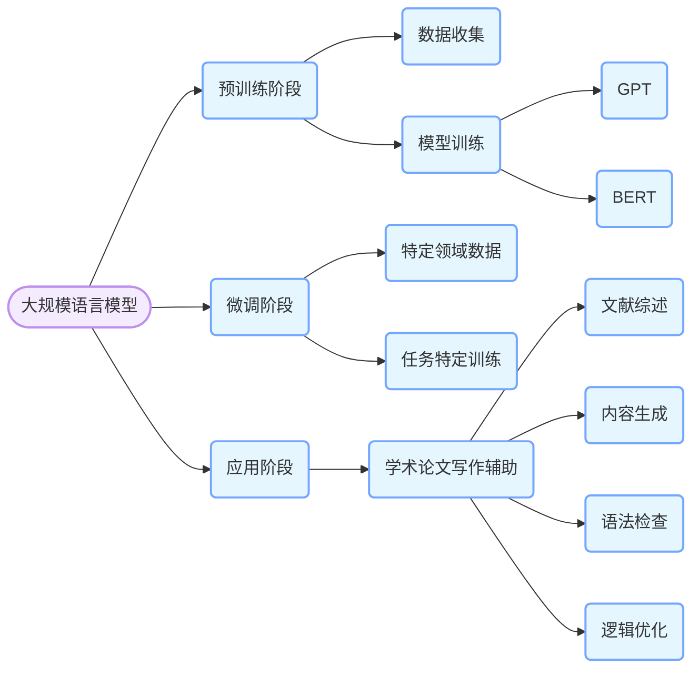

# 大规模语言模型在学术论文写作辅助中的应用

> 关键词：大规模语言模型、学术论文写作、自然语言处理、辅助工具、人工智能

> 摘要：本文深入探讨了大规模语言模型在学术论文写作辅助中的应用。首先介绍了相关背景，包括目的范围、预期读者等内容。接着阐述了大规模语言模型的核心概念与联系，详细讲解其核心算法原理与操作步骤，同时给出了相应的数学模型和公式。通过项目实战展示了代码实际案例及详细解释。分析了大规模语言模型在学术论文写作中的实际应用场景，推荐了相关的工具和资源。最后总结了未来发展趋势与挑战，并提供了常见问题解答及扩展阅读参考资料，旨在全面展现大规模语言模型在学术论文写作辅助领域的重要作用和发展潜力。

## 1. 背景介绍 
### 1.1 目的和范围
学术论文写作是科研工作中至关重要的环节，它不仅要求作者具备扎实的专业知识，还需要良好的语言表达能力和逻辑思维能力。然而，对于许多科研人员和学生来说，撰写高质量的学术论文并非易事。大规模语言模型的出现为学术论文写作带来了新的辅助手段。

本文的目的在于全面探讨大规模语言模型在学术论文写作辅助中的应用，包括如何利用其进行文献综述、内容生成、语法检查、逻辑优化等方面。范围涵盖了当前主流的大规模语言模型，如GPT - 3、BERT等，并分析其在不同学科领域学术论文写作中的适用性和局限性。

### 1.2 预期读者
本文预期读者包括科研工作者、高校学生、学术编辑以及对自然语言处理和学术写作感兴趣的技术人员。对于科研工作者和高校学生，本文将为他们提供实用的学术论文写作辅助方法和技巧；对于学术编辑，有助于他们更好地理解大规模语言模型在学术论文质量提升方面的作用；对于技术人员，可作为了解大规模语言模型在学术领域应用的参考资料。

### 1.3 文档结构概述
本文首先介绍大规模语言模型在学术论文写作辅助中的背景信息，包括目的、读者和结构概述等。接着阐述核心概念与联系，让读者了解大规模语言模型的基本原理和架构。然后详细讲解核心算法原理和具体操作步骤，通过Python代码进行演示。随后给出数学模型和公式，并举例说明。通过项目实战展示代码实际案例和详细解释。分析实际应用场景，推荐相关的工具和资源。最后总结未来发展趋势与挑战，提供常见问题解答和扩展阅读参考资料。

### 1.4 术语表
#### 1.4.1 核心术语定义
- **大规模语言模型**：基于大量文本数据进行训练的人工智能模型，能够学习语言的模式和规律，用于生成自然语言文本、进行语言理解等任务。
- **学术论文写作**：科研人员或学生将自己的研究成果、观点等以书面形式呈现的过程，遵循一定的学术规范和格式要求。
- **自然语言处理（NLP）**：计算机科学与人工智能领域的一个分支，旨在让计算机理解、处理和生成人类语言。

#### 1.4.2 相关概念解释
- **预训练模型**：在大规模无监督数据上进行训练的模型，学习到语言的通用特征，可用于后续的微调任务。
- **微调**：在预训练模型的基础上，使用特定领域的数据进行进一步训练，使模型适应特定任务的需求。

#### 1.4.3 缩略词列表
- **GPT**：Generative Pretrained Transformer（生成式预训练变换器）
- **BERT**：Bidirectional Encoder Representations from Transformers（来自变换器的双向编码器表示）
- **NLP**：Natural Language Processing（自然语言处理）

## 2. 核心概念与联系 

### 2.1 大规模语言模型的原理
大规模语言模型通常基于深度学习技术，特别是Transformer架构。Transformer架构由编码器和解码器组成，其核心是自注意力机制（Self - Attention Mechanism）。自注意力机制允许模型在处理输入序列时，动态地关注序列中不同位置的信息，从而捕捉长距离依赖关系。

以GPT系列为例，它是基于Transformer解码器的生成式语言模型。GPT通过在大规模文本数据上进行无监督学习，学习到语言的概率分布。给定一个输入文本，模型会预测下一个最可能出现的词，通过不断重复这个过程，生成连贯的文本。

BERT则是基于Transformer编码器的双向语言模型。它通过掩码语言模型（Masked Language Model，MLM）和下一句预测（Next Sentence Prediction，NSP）任务进行预训练。MLM任务中，模型需要预测被掩码的词，从而学习到上下文信息；NSP任务中，模型需要判断两个句子是否是连续的，以学习句子之间的逻辑关系。

### 2.2 与学术论文写作的联系
大规模语言模型可以在学术论文写作的多个环节提供辅助。在文献综述阶段，模型可以帮助作者快速收集和总结相关文献，提取关键信息。在内容生成方面，模型可以根据给定的主题和要求，生成初步的论文框架和段落内容。在语法检查和逻辑优化方面，模型可以检测论文中的语法错误、词汇搭配不当等问题，并提供合理的建议。

### 2.3 文本示意图
```plaintext
大规模语言模型
|-- 预训练阶段
|   |-- 数据收集（大规模文本语料）
|   |-- 模型训练（Transformer架构，自注意力机制）
|       |-- GPT（生成式，基于解码器）
|       |-- BERT（双向，基于编码器）
|-- 微调阶段
|   |-- 特定领域数据
|   |-- 任务特定训练
|-- 应用阶段
|   |-- 学术论文写作辅助
|       |-- 文献综述
|       |-- 内容生成
|       |-- 语法检查
|       |-- 逻辑优化
```

### 2.4 Mermaid流程图


## 3. 核心算法原理 & 具体操作步骤 

### 3.1 自注意力机制原理
自注意力机制是Transformer架构的核心。给定输入序列 $\mathbf{x} = [\mathbf{x}_1, \mathbf{x}_2, \cdots, \mathbf{x}_n]$，其中 $\mathbf{x}_i$ 是第 $i$ 个输入向量。首先，通过线性变换得到查询（Query）、键（Key）和值（Value）向量：

$\mathbf{Q} = \mathbf{X} \mathbf{W}^Q$

$\mathbf{K} = \mathbf{X} \mathbf{W}^K$

$\mathbf{V} = \mathbf{X} \mathbf{W}^V$

其中 $\mathbf{X} = [\mathbf{x}_1, \mathbf{x}_2, \cdots, \mathbf{x}_n]^T$，$\mathbf{W}^Q$、$\mathbf{W}^K$ 和 $\mathbf{W}^V$ 是可学习的权重矩阵。

然后，计算注意力分数：

$\text{Attention}(\mathbf{Q}, \mathbf{K}, \mathbf{V}) = \text{softmax}\left(\frac{\mathbf{Q} \mathbf{K}^T}{\sqrt{d_k}}\right) \mathbf{V}$

其中 $d_k$ 是键向量的维度。

### 3.2 Python代码实现自注意力机制
```python
import torch
import torch.nn as nn
import math

class SelfAttention(nn.Module):
    def __init__(self, input_dim, d_k):
        super(SelfAttention, self).__init__()
        self.input_dim = input_dim
        self.d_k = d_k
        self.W_q = nn.Linear(input_dim, d_k)
        self.W_k = nn.Linear(input_dim, d_k)
        self.W_v = nn.Linear(input_dim, d_k)

    def forward(self, X):
        Q = self.W_q(X)
        K = self.W_k(X)
        V = self.W_v(X)
        attention_scores = torch.matmul(Q, K.transpose(-2, -1)) / math.sqrt(self.d_k)
        attention_probs = torch.softmax(attention_scores, dim=-1)
        output = torch.matmul(attention_probs, V)
        return output

# 示例使用
input_dim = 128
d_k = 64
batch_size = 32
seq_length = 10
X = torch.randn(batch_size, seq_length, input_dim)
self_attention = SelfAttention(input_dim, d_k)
output = self_attention(X)
print(output.shape)
```

### 3.3 基于GPT进行文本生成的操作步骤
1. **加载预训练模型**：使用Hugging Face的 `transformers` 库加载GPT模型。
2. **准备输入文本**：将用户提供的文本转换为模型可以接受的输入格式。
3. **生成文本**：调用模型的生成方法，设置相关参数，如生成的最大长度、温度等。
4. **解码输出**：将模型生成的输出转换为自然语言文本。

```python
from transformers import GPT2LMHeadModel, GPT2Tokenizer

# 加载预训练模型和分词器
model_name = "gpt2"
tokenizer = GPT2Tokenizer.from_pretrained(model_name)
model = GPT2LMHeadModel.from_pretrained(model_name)

# 准备输入文本
input_text = "学术论文的重要性在于"
input_ids = tokenizer.encode(input_text, return_tensors="pt")

# 生成文本
output = model.generate(input_ids, max_length=100, num_beams=5, no_repeat_ngram_size=2, early_stopping=True)

# 解码输出
generated_text = tokenizer.decode(output[0], skip_special_tokens=True)
print(generated_text)
```

## 4. 数学模型和公式 & 详细讲解 & 举例说明 

### 4.1 掩码语言模型（MLM）公式
在掩码语言模型任务中，给定输入序列 $\mathbf{x} = [\mathbf{x}_1, \mathbf{x}_2, \cdots, \mathbf{x}_n]$，随机选择一些位置进行掩码。设掩码位置的集合为 $M$，模型的目标是预测这些掩码位置的词。

对于掩码位置 $i \in M$，模型的输出是一个概率分布 $\mathbf{p}_i$，表示每个词的预测概率。损失函数通常使用交叉熵损失：

$L_{MLM} = -\sum_{i \in M} \log p_i(y_i)$

其中 $y_i$ 是掩码位置 $i$ 的真实词。

### 4.2 下一句预测（NSP）公式
下一句预测任务中，输入是两个句子 $A$ 和 $B$，模型需要判断 $B$ 是否是 $A$ 的下一句。模型的输出是一个二分类概率分布 $\mathbf{p}$，表示 $B$ 是 $A$ 下一句的概率。

损失函数同样使用交叉熵损失：

$L_{NSP} = -y \log p - (1 - y) \log (1 - p)$

其中 $y$ 是真实标签（$y = 1$ 表示 $B$ 是 $A$ 的下一句，$y = 0$ 表示不是）。

### 4.3 举例说明
假设我们有一个句子 “The cat is on the mat.”，在MLM任务中，我们随机掩码一个词，比如 “The cat [MASK] on the mat.”。模型需要预测 [MASK] 位置的词，假设真实词是 “is”，模型输出的概率分布中 “is” 的概率为 $p_{is}$，则该位置的损失为 $-\log p_{is}$。

对于NSP任务，假设句子 $A$ 是 “I like reading books.”，句子 $B$ 是 “It is very interesting.”，如果 $B$ 确实是 $A$ 的下一句（$y = 1$），模型预测 $B$ 是 $A$ 下一句的概率为 $p$，则损失为 $-\log p$。

## 5. 项目实战：代码实际案例和详细解释说明 

### 5.1  开发环境搭建
1. **安装Python**：确保系统中安装了Python 3.6及以上版本。
2. **创建虚拟环境**：使用 `venv` 或 `conda` 创建虚拟环境，以隔离项目依赖。
```bash
# 使用venv创建虚拟环境
python -m venv myenv
source myenv/bin/activate  # 激活虚拟环境（Linux/Mac）
myenv\Scripts\activate  # 激活虚拟环境（Windows）
```
3. **安装依赖库**：使用 `pip` 安装所需的库，如 `transformers`、`torch` 等。
```bash
pip install transformers torch
```

### 5.2  源代码详细实现和代码解读
以下是一个使用BERT进行学术论文语法检查的示例代码：

```python
from transformers import AutoTokenizer, AutoModelForSequenceClassification
import torch

# 加载预训练模型和分词器
model_name = "textattack/bert-base-uncased-CoLA"
tokenizer = AutoTokenizer.from_pretrained(model_name)
model = AutoModelForSequenceClassification.from_pretrained(model_name)

def check_grammar(sentence):
    # 对输入句子进行分词
    inputs = tokenizer(sentence, return_tensors="pt")
    # 模型推理
    with torch.no_grad():
        outputs = model(**inputs)
    # 获取预测结果
    logits = outputs.logits
    predicted_class_id = logits.argmax().item()
    # 根据预测结果判断语法是否正确
    if predicted_class_id == 1:
        return "语法正确"
    else:
        return "语法错误"

# 示例句子
sentence = "I am a student."
result = check_grammar(sentence)
print(result)
```

### 5.3  代码解读与分析
1. **加载预训练模型和分词器**：使用 `transformers` 库的 `AutoTokenizer` 和 `AutoModelForSequenceClassification` 加载预训练的BERT模型和对应的分词器。这里使用的是 `textattack/bert-base-uncased-CoLA` 模型，该模型在CoLA（Corpus of Linguistic Acceptability）数据集上进行了微调，用于判断句子的语法正确性。
2. **定义语法检查函数**：`check_grammar` 函数接受一个句子作为输入，首先使用分词器对句子进行分词，将其转换为模型可以接受的输入格式。然后使用 `torch.no_grad()` 上下文管理器进行推理，避免计算梯度。模型的输出是一个逻辑值（logits），通过 `argmax()` 方法获取预测的类别ID。最后根据类别ID判断句子的语法是否正确。
3. **示例句子测试**：定义一个示例句子，调用 `check_grammar` 函数进行语法检查，并打印结果。

## 6. 实际应用场景 
### 6.1 文献综述
大规模语言模型可以帮助作者快速收集和总结相关文献。作者可以输入研究主题，模型可以从海量文献中提取关键信息，生成文献综述的初稿。例如，在医学领域，作者可以输入“某种疾病的治疗方法研究”，模型可以收集和整理相关的临床研究、实验结果等信息，为作者提供全面的文献综述基础。

### 6.2 内容生成
在论文写作过程中，当作者遇到写作瓶颈时，大规模语言模型可以提供内容生成的支持。作者可以提供论文的主题、大纲和部分内容，模型可以根据这些信息生成相关的段落和章节。例如，在计算机科学领域，作者在撰写关于人工智能算法的论文时，可以让模型生成算法原理的详细解释、实验结果的分析等内容。

### 6.3 语法检查和词汇推荐
模型可以检查论文中的语法错误、拼写错误和词汇搭配不当等问题，并提供修正建议。同时，模型还可以根据上下文推荐合适的词汇，帮助作者提升论文的语言质量。例如，当作者输入“this is a good way to solve the problem”，模型可以建议将“good”替换为“effective” 或 “efficient” 等更合适的词汇。

### 6.4 逻辑优化
大规模语言模型可以分析论文的逻辑结构，指出逻辑不连贯、论证不充分等问题，并提供优化建议。例如，在社会科学领域的论文中，模型可以检查论文的论点是否清晰、论据是否支持论点、论证过程是否合理等，帮助作者完善论文的逻辑结构。

## 7. 工具和资源推荐
### 7.1 学习资源推荐
#### 7.1.1 书籍推荐
- 《深度学习》（Deep Learning）：由Ian Goodfellow、Yoshua Bengio和Aaron Courville撰写，全面介绍了深度学习的理论和实践，包括神经网络、卷积神经网络、循环神经网络等内容，是深度学习领域的经典教材。
- 《自然语言处理入门》（Natural Language Processing with Python）：由Steven Bird、Ewan Klein和Edward Loper编写，通过Python代码示例详细介绍了自然语言处理的基本概念和技术，适合初学者入门。

#### 7.1.2 在线课程
- Coursera上的“Natural Language Processing Specialization”：由斯坦福大学的教授授课，涵盖了自然语言处理的各个方面，包括词法分析、句法分析、语义理解、文本生成等内容。
- edX上的“Deep Learning for Natural Language Processing”：介绍了深度学习在自然语言处理中的应用，包括Transformer架构、预训练模型等内容。

#### 7.1.3 技术博客和网站
- Hugging Face博客：提供了关于自然语言处理和大规模语言模型的最新研究成果和技术应用案例。
- Towards Data Science：一个数据科学和人工智能领域的技术博客平台，有很多关于自然语言处理和学术写作辅助的文章。

### 7.2 开发工具框架推荐
#### 7.2.1 IDE和编辑器
- PyCharm：一款专业的Python集成开发环境，提供了代码编辑、调试、版本控制等功能，适合大规模语言模型开发。
- Jupyter Notebook：一个交互式的开发环境，支持Python代码的编写、运行和可视化，方便进行模型训练和实验。

#### 7.2.2 调试和性能分析工具
- TensorBoard：一个用于可视化深度学习模型训练过程的工具，可以查看模型的损失函数、准确率等指标的变化情况。
- PyTorch Profiler：用于分析PyTorch模型的性能，找出性能瓶颈，优化模型的运行效率。

#### 7.2.3 相关框架和库
- Transformers：Hugging Face开发的一个开源库，提供了多种预训练的大规模语言模型，如GPT、BERT等，方便进行模型的加载、微调和解码。
- NLTK（Natural Language Toolkit）：一个Python库，提供了自然语言处理的各种工具和数据集，如分词、词性标注、命名实体识别等。

### 7.3 相关论文著作推荐
#### 7.3.1 经典论文
- “Attention Is All You Need”：介绍了Transformer架构，为大规模语言模型的发展奠定了基础。
- “BERT: Pre-training of Deep Bidirectional Transformers for Language Understanding”：提出了BERT模型，开创了双向预训练语言模型的先河。

#### 7.3.2 最新研究成果
- 关注ACL（Association for Computational Linguistics）、EMNLP（Conference on Empirical Methods in Natural Language Processing）等自然语言处理领域的顶级会议，获取最新的研究成果。

#### 7.3.3 应用案例分析
- 查看相关的学术期刊和研究报告，了解大规模语言模型在学术论文写作辅助中的实际应用案例和效果评估。

## 8. 总结：未来发展趋势与挑战
### 8.1 未来发展趋势
- **个性化辅助**：未来的大规模语言模型将能够根据用户的写作风格、学术背景和研究领域，提供更加个性化的写作辅助。例如，针对不同学科的学术规范和语言习惯，提供定制化的语法检查和内容生成建议。
- **多模态融合**：结合图像、音频等多模态信息，为学术论文写作提供更丰富的辅助。例如，在科学研究论文中，可以通过分析实验图像和视频，生成相关的文字描述和分析结果。
- **跨语言支持**：随着全球化的发展，学术交流越来越频繁。大规模语言模型将提供更好的跨语言支持，帮助作者用不同语言撰写学术论文，并进行准确的翻译和语言转换。

### 8.2 挑战
- **数据隐私和安全**：大规模语言模型的训练需要大量的文本数据，这些数据可能包含敏感信息。如何确保数据的隐私和安全，防止数据泄露和滥用，是一个重要的挑战。
- **模型的可解释性**：大规模语言模型通常是黑盒模型，其决策过程难以解释。在学术论文写作中，作者需要了解模型给出建议的依据，以确保论文的科学性和可信度。因此，提高模型的可解释性是一个亟待解决的问题。
- **伦理和道德问题**：大规模语言模型可能会生成虚假信息、偏见性内容等。在学术论文写作中，必须确保模型生成的内容符合学术道德和伦理规范，避免对学术研究造成负面影响。

## 9. 附录：常见问题与解答
### 9.1 大规模语言模型生成的内容可以直接用于学术论文吗？
不可以。大规模语言模型生成的内容只是作为辅助参考，不能直接用于学术论文。因为模型生成的内容可能存在不准确、不严谨、缺乏创新性等问题。作者需要对模型生成的内容进行仔细的审核和修改，确保其符合学术规范和研究要求。

### 9.2 如何选择适合学术论文写作辅助的大规模语言模型？
可以根据具体的任务需求和应用场景选择合适的模型。例如，如果需要进行文本生成，可以选择GPT系列模型；如果需要进行语法检查和语言理解，可以选择BERT系列模型。同时，还可以考虑模型的性能、可扩展性和易用性等因素。

### 9.3 大规模语言模型在学术论文写作辅助中存在哪些局限性？
大规模语言模型在学术论文写作辅助中存在一些局限性，如模型生成的内容可能缺乏深度和创新性，对专业领域的知识理解不够准确，容易生成虚假信息等。此外，模型的训练数据可能存在偏差，导致生成的内容存在偏见性。

## 10. 扩展阅读 & 参考资料
- Goodfellow, I., Bengio, Y., & Courville, A. (2016). Deep Learning. MIT Press.
- Bird, S., Klein, E., & Loper, E. (2009). Natural Language Processing with Python. O'Reilly Media.
- Vaswani, A., Shazeer, N., Parmar, N., et al. (2017). Attention Is All You Need. Advances in Neural Information Processing Systems.
- Devlin, J., Chang, M. - W., Lee, K., & Toutanova, K. (2018). BERT: Pre - training of Deep Bidirectional Transformers for Language Understanding. arXiv preprint arXiv:1810.04805.
- Hugging Face官方文档：https://huggingface.co/docs
- ACL Anthology：https://aclanthology.org/ 