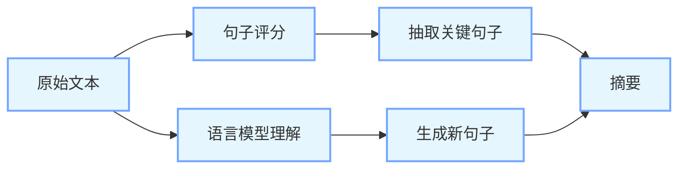

# 大规模语言模型在文本摘要任务中的应用

> 关键词：大规模语言模型、文本摘要任务、自然语言处理、Transformer、摘要算法

> 摘要：本文聚焦于大规模语言模型在文本摘要任务中的应用。首先介绍了文本摘要任务的背景以及大规模语言模型兴起的背景，阐述了核心概念，包括大规模语言模型的架构和文本摘要的分类。详细讲解了相关核心算法原理，通过Python代码进行说明，并给出了对应的数学模型和公式。接着通过项目实战展示了如何使用大规模语言模型进行文本摘要，对代码进行详细解读。探讨了实际应用场景，推荐了学习资源、开发工具框架以及相关论文著作。最后总结了未来发展趋势与挑战，并提供了常见问题解答和参考资料，旨在为读者全面深入地介绍大规模语言模型在文本摘要任务中的应用。

## 1. 背景介绍 
### 1.1 目的和范围
随着信息时代的发展，每天产生的文本数据量呈爆炸式增长。从新闻报道、学术论文到社交媒体信息，人们面临着信息过载的问题。文本摘要任务旨在从大量的文本中提取关键信息，生成简洁、准确的摘要，帮助用户快速了解文本的核心内容。大规模语言模型的出现为文本摘要任务带来了新的机遇和挑战。本文章的目的是深入探讨大规模语言模型在文本摘要任务中的应用，包括其原理、算法、实际案例以及未来发展趋势等方面，范围涵盖自然语言处理领域中与文本摘要相关的技术和应用。

### 1.2 预期读者
本文预期读者包括自然语言处理领域的研究人员、开发者、对人工智能技术感兴趣的学生以及希望了解大规模语言模型在文本摘要任务中应用的相关从业者。

### 1.3 文档结构概述
本文首先介绍相关背景信息，包括目的、预期读者等。接着阐述核心概念与联系，包括大规模语言模型和文本摘要的基本概念和架构。然后详细讲解核心算法原理和具体操作步骤，给出数学模型和公式。通过项目实战展示代码实现和解读。探讨实际应用场景，推荐学习资源、开发工具框架和相关论文著作。最后总结未来发展趋势与挑战，提供常见问题解答和参考资料。

### 1.4 术语表
#### 1.4.1 核心术语定义
- **大规模语言模型**：基于深度学习技术，在大量文本数据上进行训练的语言模型，具有强大的语言理解和生成能力，如GPT系列、BERT等。
- **文本摘要任务**：从给定的文本中提取关键信息，生成简洁、准确的摘要的任务，可分为抽取式摘要和生成式摘要。
- **Transformer**：一种基于自注意力机制的深度学习架构，广泛应用于大规模语言模型中。

#### 1.4.2 相关概念解释
- **自注意力机制**：Transformer架构中的核心机制，允许模型在处理输入序列时，动态地关注序列中不同位置的信息，从而捕捉长距离依赖关系。
- **预训练**：大规模语言模型在大规模无监督文本数据上进行的训练过程，以学习语言的通用模式和特征。
- **微调**：在预训练模型的基础上，使用特定任务的有监督数据对模型进行进一步训练，以适应具体的任务需求。

#### 1.4.3 缩略词列表
- **NLP**：Natural Language Processing，自然语言处理
- **GPT**：Generative Pretrained Transformer，生成式预训练变压器
- **BERT**：Bidirectional Encoder Representations from Transformers，基于Transformer的双向编码器表示

## 2. 核心概念与联系 
### 2.1 大规模语言模型
大规模语言模型是自然语言处理领域的重要进展。其核心架构通常基于Transformer，Transformer由编码器和解码器组成，编码器用于对输入文本进行特征提取和表示学习，解码器用于生成输出文本。以GPT系列为例，它是基于Transformer解码器架构的生成式语言模型，通过在大规模文本数据上进行无监督学习，学习到语言的统计规律和语义信息。

文本示意图：
```plaintext
输入文本 -> 嵌入层 -> 多头自注意力层 -> 前馈神经网络层 -> 输出特征表示
```

Mermaid流程图：


### 2.2 文本摘要任务分类
文本摘要任务主要分为抽取式摘要和生成式摘要。
- **抽取式摘要**：从原始文本中直接抽取关键句子或短语作为摘要。其优点是简单、准确，能够保留原文的关键信息；缺点是摘要的灵活性较差，可能无法涵盖所有重要信息。
- **生成式摘要**：通过对原始文本的理解，生成全新的句子作为摘要。其优点是灵活性高，能够生成更自然流畅的摘要；缺点是可能存在信息不准确或生成内容偏离原文的问题。

文本示意图：
```plaintext
抽取式摘要：原始文本 -> 句子评分 -> 抽取关键句子 -> 摘要
生成式摘要：原始文本 -> 语言模型理解 -> 生成新句子 -> 摘要
```

Mermaid流程图：


### 2.3 大规模语言模型与文本摘要任务的联系
大规模语言模型为文本摘要任务提供了强大的语言理解和生成能力。在抽取式摘要中，大规模语言模型可以用于对句子进行更准确的评分，从而提高关键句子的抽取质量。在生成式摘要中，大规模语言模型可以根据输入文本生成自然流畅的摘要。同时，通过微调大规模语言模型，可以使其更好地适应文本摘要任务的需求。

## 3. 核心算法原理 & 具体操作步骤 
### 3.1 基于Transformer的自注意力机制原理
自注意力机制是Transformer架构的核心，它允许模型在处理输入序列时，动态地计算每个位置与其他位置的相关性。具体来说，对于输入序列 $X = [x_1, x_2, ..., x_n]$，首先通过线性变换得到查询向量 $Q$、键向量 $K$ 和值向量 $V$：
$$Q = XW_Q$$
$$K = XW_K$$
$$V = XW_V$$
其中 $W_Q$、$W_K$ 和 $W_V$ 是可学习的权重矩阵。然后计算注意力分数：
$$Attention(Q, K, V) = softmax(\frac{QK^T}{\sqrt{d_k}})V$$
其中 $d_k$ 是查询和键向量的维度。

Python代码实现：
```python
import torch
import torch.nn as nn

class SelfAttention(nn.Module):
    def __init__(self, input_dim, d_k):
        super(SelfAttention, self).__init__()
        self.W_Q = nn.Linear(input_dim, d_k)
        self.W_K = nn.Linear(input_dim, d_k)
        self.W_V = nn.Linear(input_dim, d_k)
        self.softmax = nn.Softmax(dim=-1)

    def forward(self, X):
        Q = self.W_Q(X)
        K = self.W_K(X)
        V = self.W_V(X)
        scores = torch.matmul(Q, K.transpose(-2, -1)) / torch.sqrt(torch.tensor(Q.size(-1)).float())
        attention_weights = self.softmax(scores)
        output = torch.matmul(attention_weights, V)
        return output
```

### 3.2 基于大规模语言模型的文本摘要算法步骤
1. **数据预处理**：对输入的文本进行清洗、分词等处理，将其转换为模型可以接受的输入格式。
2. **模型加载**：加载预训练的大规模语言模型，如GPT或BERT。
3. **微调模型**：使用文本摘要任务的有监督数据对模型进行微调，使其适应具体的任务需求。
4. **摘要生成**：将预处理后的文本输入到微调后的模型中，生成摘要。

Python代码示例：
```python
from transformers import GPT2LMHeadModel, GPT2Tokenizer

# 加载预训练模型和分词器
tokenizer = GPT2Tokenizer.from_pretrained('gpt2')
model = GPT2LMHeadModel.from_pretrained('gpt2')

# 输入文本
input_text = "This is a sample text for text summarization."
input_ids = tokenizer.encode(input_text, return_tensors='pt')

# 生成摘要
output = model.generate(input_ids, max_length=50, num_beams=5, no_repeat_ngram_size=2, early_stopping=True)
summary = tokenizer.decode(output[0], skip_special_tokens=True)
print("Summary:", summary)
```

## 4. 数学模型和公式 & 详细讲解 & 举例说明 
### 4.1 自注意力机制的数学模型
自注意力机制的核心公式为：
$$Attention(Q, K, V) = softmax(\frac{QK^T}{\sqrt{d_k}})V$$
其中，$Q$ 是查询矩阵，$K$ 是键矩阵，$V$ 是值矩阵。$\frac{QK^T}{\sqrt{d_k}}$ 计算了查询和键之间的相似度，$\sqrt{d_k}$ 是为了防止点积结果过大。$softmax$ 函数将相似度分数转换为概率分布，用于对值矩阵进行加权求和。

举例说明：假设输入序列 $X$ 是一个长度为 $n$ 的词向量序列，每个词向量的维度为 $d$。$W_Q$、$W_K$ 和 $W_V$ 是 $d \times d_k$ 的矩阵，其中 $d_k$ 是查询和键向量的维度。通过线性变换得到 $Q$、$K$ 和 $V$ 矩阵，它们的维度分别为 $n \times d_k$。$QK^T$ 得到一个 $n \times n$ 的相似度矩阵，通过除以 $\sqrt{d_k}$ 进行缩放，再经过 $softmax$ 函数得到注意力权重矩阵。最后，将注意力权重矩阵与值矩阵 $V$ 相乘，得到输出矩阵。

### 4.2 基于交叉熵损失的微调模型训练
在微调大规模语言模型时，通常使用交叉熵损失函数来优化模型。假设模型的输出概率分布为 $p(y|x)$，真实标签为 $y$，则交叉熵损失函数定义为：
$$L = -\sum_{i=1}^{N} \log p(y_i|x_i)$$
其中 $N$ 是训练样本的数量。

在训练过程中，通过反向传播算法更新模型的参数，使得交叉熵损失函数最小化。

举例说明：假设我们有一个文本摘要任务的训练数据集，每个样本包含输入文本 $x$ 和对应的摘要 $y$。在训练时，将输入文本 $x$ 输入到模型中，得到模型生成的摘要的概率分布 $p(y|x)$。根据真实摘要 $y$ 计算交叉熵损失 $L$，然后使用优化器（如Adam）更新模型的参数，使得 $L$ 逐渐减小。

## 5. 项目实战：代码实际案例和详细解释说明 
### 5.1  开发环境搭建
1. **安装Python**：建议使用Python 3.7及以上版本。
2. **安装深度学习框架**：安装PyTorch或TensorFlow，这里以PyTorch为例。可以使用以下命令安装：
```bash
pip install torch torchvision
```
3. **安装相关库**：安装`transformers`库，用于加载和使用大规模语言模型。
```bash
pip install transformers
```

### 5.2  源代码详细实现和代码解读
以下是一个使用Hugging Face的`transformers`库进行文本摘要的完整代码示例：
```python
from transformers import AutoTokenizer, AutoModelForSeq2SeqLM

# 加载预训练的模型和分词器
model_name = "t5-small"
tokenizer = AutoTokenizer.from_pretrained(model_name)
model = AutoModelForSeq2SeqLM.from_pretrained(model_name)

# 输入文本
input_text = "The quick brown fox jumps over the lazy dog. This is a sample sentence for text summarization."

# 预处理输入文本
input_ids = tokenizer.encode("summarize: " + input_text, return_tensors='pt')

# 生成摘要
output = model.generate(input_ids, max_length=30, num_beams=4, no_repeat_ngram_size=2, early_stopping=True)

# 解码摘要
summary = tokenizer.decode(output[0], skip_special_tokens=True)

print("Input Text:", input_text)
print("Summary:", summary)
```
代码解读：
1. **加载模型和分词器**：使用`AutoTokenizer`和`AutoModelForSeq2SeqLM`从预训练模型库中加载T5模型和对应的分词器。
2. **预处理输入文本**：在输入文本前添加`summarize: `前缀，这是T5模型的特定要求。然后使用分词器将输入文本转换为模型可以接受的输入ID。
3. **生成摘要**：使用模型的`generate`方法生成摘要，设置了最大长度、束搜索的束数、防止重复的n-gram大小等参数。
4. **解码摘要**：使用分词器将模型生成的输出ID解码为文本。

### 5.3  代码解读与分析
- **模型选择**：选择T5模型是因为它是一个基于Transformer架构的序列到序列模型，在文本摘要等任务中表现良好。
- **参数设置**：`max_length`参数控制生成摘要的最大长度，`num_beams`参数用于束搜索，提高生成质量，`no_repeat_ngram_size`参数防止生成的摘要中出现重复的n-gram。
- **性能优化**：可以通过调整这些参数来优化生成摘要的质量和效率。同时，可以使用更大的预训练模型或对模型进行微调，以提高性能。

## 6. 实际应用场景 
### 6.1 新闻摘要
在新闻媒体领域，每天会产生大量的新闻报道。使用大规模语言模型进行新闻摘要可以帮助用户快速了解新闻的核心内容，节省阅读时间。例如，新闻网站可以自动生成新闻文章的摘要，显示在首页或搜索结果中，用户可以根据摘要决定是否阅读全文。

### 6.2 学术论文摘要
学术论文通常篇幅较长，包含大量的专业知识和研究成果。使用大规模语言模型生成学术论文的摘要可以帮助研究人员快速了解论文的核心内容和研究贡献，提高文献调研的效率。同时，学术期刊也可以使用自动摘要技术为论文生成摘要，方便读者快速了解论文的要点。

### 6.3 社交媒体摘要
社交媒体平台上每天会产生海量的文本信息，如微博、推特等。使用大规模语言模型进行社交媒体摘要可以帮助用户快速了解热门话题和关键信息，减少信息过载。例如，社交媒体平台可以自动生成热门话题的摘要，推送给用户。

### 6.4 商业报告摘要
企业在日常运营中会产生各种商业报告，如财务报告、市场调研报告等。使用大规模语言模型生成商业报告的摘要可以帮助企业管理层快速了解报告的核心内容和关键指标，做出决策。同时，也可以方便投资者和合作伙伴快速了解企业的运营情况。

## 7. 工具和资源推荐
### 7.1 学习资源推荐
#### 7.1.1 书籍推荐
- 《深度学习》（Deep Learning）：由Ian Goodfellow、Yoshua Bengio和Aaron Courville所著，是深度学习领域的经典教材，涵盖了神经网络、深度学习模型等基础知识。
- 《自然语言处理入门》：由何晗所著，介绍了自然语言处理的基本概念、算法和应用，适合初学者。
- 《Transformer自然语言处理》：详细介绍了Transformer架构及其在自然语言处理中的应用，对于理解大规模语言模型有很大帮助。

#### 7.1.2 在线课程
- Coursera上的“自然语言处理专项课程”（Natural Language Processing Specialization）：由深度学习领域的知名学者授课，涵盖了自然语言处理的各个方面，包括文本分类、机器翻译、文本摘要等。
- edX上的“深度学习基础”（Foundations of Deep Learning）：介绍了深度学习的基本概念和算法，为学习大规模语言模型打下基础。

#### 7.1.3 技术博客和网站
- Hugging Face博客：提供了关于大规模语言模型和自然语言处理的最新研究成果和应用案例。
- arXiv.org：是一个预印本服务器，提供了大量的学术论文，包括自然语言处理领域的最新研究成果。
- Medium上的自然语言处理相关博客：有很多专业人士分享的关于自然语言处理和大规模语言模型的技术文章。

### 7.2 开发工具框架推荐
#### 7.2.1 IDE和编辑器
- PyCharm：是一款专业的Python集成开发环境，提供了丰富的代码编辑、调试和项目管理功能。
- Visual Studio Code：是一款轻量级的代码编辑器，支持多种编程语言，有丰富的插件可以扩展功能。

#### 7.2.2 调试和性能分析工具
- TensorBoard：是TensorFlow的可视化工具，可以用于可视化模型的训练过程、损失函数曲线等。
- PyTorch Profiler：是PyTorch的性能分析工具，可以帮助开发者分析模型的性能瓶颈，优化代码。

#### 7.2.3 相关框架和库
- Hugging Face Transformers：提供了大量的预训练模型和工具，方便开发者使用大规模语言模型进行自然语言处理任务。
- NLTK（Natural Language Toolkit）：是Python中常用的自然语言处理库，提供了丰富的工具和数据集，用于文本预处理、词性标注、命名实体识别等任务。
- SpaCy：是一个高效的自然语言处理库，提供了快速的文本处理功能，支持多种语言。

### 7.3 相关论文著作推荐
#### 7.3.1 经典论文
- “Attention Is All You Need”：介绍了Transformer架构，是大规模语言模型的基础。
- “BERT: Pre-training of Deep Bidirectional Transformers for Language Understanding”：提出了BERT模型，在自然语言处理领域取得了显著的成果。
- “GPT: Generative Pretrained Transformer”：介绍了GPT模型，开创了生成式预训练语言模型的先河。

#### 7.3.2 最新研究成果
- 关注ACL（Association for Computational Linguistics）、EMNLP（Conference on Empirical Methods in Natural Language Processing）等自然语言处理领域的顶级会议，获取最新的研究成果。
- 关注arXiv.org上的最新预印本论文，了解大规模语言模型在文本摘要等任务中的最新进展。

#### 7.3.3 应用案例分析
- 可以参考一些企业和研究机构发布的技术报告和案例分析，了解大规模语言模型在实际应用中的效果和经验。例如，OpenAI发布的关于GPT系列模型的应用案例，以及一些新闻媒体、金融机构等使用大规模语言模型进行文本摘要的案例。

## 8. 总结：未来发展趋势与挑战
### 8.1 未来发展趋势
- **模型规模不断增大**：随着计算资源的不断提升，大规模语言模型的规模将继续增大，模型的语言理解和生成能力将进一步提高。
- **多模态融合**：未来的大规模语言模型将不仅仅局限于文本处理，还将融合图像、音频等多模态信息，实现更加全面的信息理解和处理。
- **个性化摘要**：根据用户的兴趣和需求，生成个性化的文本摘要，提高摘要的针对性和实用性。
- **跨语言摘要**：实现跨语言的文本摘要，帮助用户快速了解不同语言的文本内容。

### 8.2 挑战
- **计算资源需求高**：大规模语言模型的训练和推理需要大量的计算资源，这限制了其在一些场景下的应用。
- **数据隐私和安全问题**：大规模语言模型的训练需要大量的数据，如何保证数据的隐私和安全是一个重要的挑战。
- **生成内容的可信度**：生成式摘要可能存在信息不准确或生成内容偏离原文的问题，如何提高生成内容的可信度是一个亟待解决的问题。
- **伦理和社会问题**：大规模语言模型的应用可能会带来一些伦理和社会问题，如虚假信息传播、偏见等，需要引起重视。

## 9. 附录：常见问题与解答
### 9.1 大规模语言模型在文本摘要任务中的准确率如何？
大规模语言模型在文本摘要任务中的准确率受到多种因素的影响，如模型的大小、训练数据的质量和数量、任务的复杂度等。一般来说，通过微调大规模语言模型，可以在特定的文本摘要任务中取得较好的准确率。但生成式摘要可能存在信息不准确的问题，需要进一步优化。

### 9.2 如何选择适合文本摘要任务的大规模语言模型？
选择适合文本摘要任务的大规模语言模型需要考虑以下因素：
- **模型性能**：可以参考相关的基准测试和研究成果，了解不同模型在文本摘要任务中的性能表现。
- **模型大小**：模型越大，通常性能越好，但也需要更多的计算资源。需要根据实际情况选择合适的模型大小。
- **任务需求**：如果任务对生成速度有较高要求，可以选择较小的模型；如果对摘要质量有较高要求，可以选择较大的模型。

### 9.3 大规模语言模型在文本摘要任务中的训练时间和成本如何？
大规模语言模型的训练时间和成本受到模型大小、训练数据的规模、计算资源等因素的影响。一般来说，训练大规模语言模型需要大量的计算资源和时间，成本较高。可以通过使用预训练模型进行微调的方式，减少训练时间和成本。

### 9.4 如何评估大规模语言模型生成的文本摘要的质量？
评估大规模语言模型生成的文本摘要的质量可以使用以下方法：
- **人工评估**：由人工对生成的摘要进行评估，判断其准确性、完整性、流畅性等方面的质量。
- **自动评估指标**：如ROUGE（Recall-Oriented Understudy for Gisting Evaluation）、BLEU（Bilingual Evaluation Understudy）等指标，可以自动计算生成摘要与参考摘要之间的相似度，评估摘要的质量。

## 10. 扩展阅读 & 参考资料
- Goodfellow, I., Bengio, Y., & Courville, A. (2016). Deep Learning. MIT Press.
- 何晗. (2019). 自然语言处理入门. 人民邮电出版社.
- Vaswani, A., Shazeer, N., Parmar, N., Uszkoreit, J., Jones, L., Gomez, A. N., ... & Polosukhin, I. (2017). Attention is all you need. Advances in neural information processing systems, 5998-6008.
- Devlin, J., Chang, M. W., Lee, K., & Toutanova, K. (2018). Bert: Pre-training of deep bidirectional transformers for language understanding. arXiv preprint arXiv:1810.04805.
- Radford, A., Narasimhan, K., Salimans, T., & Sutskever, I. (2018). Improving language understanding by generative pre-training.
- Hugging Face官方文档：https://huggingface.co/docs
- arXiv.org：https://arxiv.org/