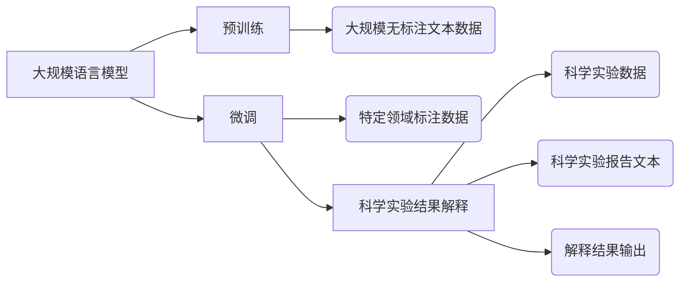

# 大规模语言模型在科学实验结果解释中的应用

> 关键词：大规模语言模型、科学实验结果解释、自然语言处理、数据分析、人工智能

> 摘要：本文聚焦于大规模语言模型在科学实验结果解释中的应用。首先介绍了相关背景，包括目的范围、预期读者等。接着阐述了核心概念及联系，详细讲解了核心算法原理与操作步骤，并给出了相应的数学模型和公式。通过项目实战展示了代码实现和解读，探讨了实际应用场景。同时推荐了相关的工具和资源，最后总结了未来发展趋势与挑战，还提供了常见问题解答和扩展阅读参考资料。旨在全面深入地分析大规模语言模型在科学实验结果解释领域的作用、原理及发展前景。

## 1. 背景介绍 
### 1.1 目的和范围
科学实验是推动各学科发展的重要手段，实验结果的准确解释对于科学发现、理论验证和技术创新至关重要。然而，科学实验产生的数据日益复杂和庞大，传统的结果解释方法面临着效率低、主观性强等问题。大规模语言模型（Large Language Model, LLM）作为自然语言处理领域的重要成果，具有强大的语言理解和生成能力，为科学实验结果解释提供了新的思路和方法。

本文章的范围涵盖了大规模语言模型的基本原理、在不同科学领域实验结果解释中的应用方式、相关算法和技术，以及实际案例分析等方面。旨在深入探讨如何利用大规模语言模型提高科学实验结果解释的准确性、效率和客观性。

### 1.2 预期读者
本文预期读者包括科研工作者，他们可以通过了解大规模语言模型在实验结果解释中的应用，拓宽研究思路，提高研究效率；自然语言处理和人工智能领域的专业人士，能够从技术原理和算法实现的角度深入探讨大规模语言模型的应用；以及对科学研究和人工智能交叉领域感兴趣的学生和爱好者，帮助他们了解前沿技术在科学研究中的应用。

### 1.3 文档结构概述
本文将按照以下结构进行阐述：首先介绍核心概念与联系，明确大规模语言模型和科学实验结果解释的相关概念及其关系；接着详细讲解核心算法原理和具体操作步骤，包括使用 Python 代码进行示例；然后给出数学模型和公式，并结合具体例子进行说明；通过项目实战展示代码实现和详细解释；探讨实际应用场景；推荐相关的工具和资源；最后总结未来发展趋势与挑战，提供常见问题解答和扩展阅读参考资料。

### 1.4 术语表
#### 1.4.1 核心术语定义
- **大规模语言模型（Large Language Model, LLM）**：基于深度学习技术，通过在大规模文本数据上进行训练得到的语言模型，能够学习到语言的统计规律和语义信息，具有强大的语言理解和生成能力。
- **科学实验结果解释**：对科学实验所获得的数据、现象等进行分析、推理和说明，以揭示其背后的科学原理和意义。
- **自然语言处理（Natural Language Processing, NLP）**：研究如何让计算机理解和处理人类语言的学科，包括语言的理解、生成、翻译等任务。

#### 1.4.2 相关概念解释
- **预训练**：大规模语言模型在训练过程中，首先在大规模无标注文本数据上进行训练，学习语言的通用特征和模式。
- **微调**：在预训练的基础上，使用特定领域的标注数据对模型进行进一步训练，使其适应特定任务的需求。
- **上下文信息**：在语言处理中，文本中前后文的信息对于理解当前文本的含义具有重要作用，这些前后文信息称为上下文信息。

#### 1.4.3 缩略词列表
- **LLM**：Large Language Model（大规模语言模型）
- **NLP**：Natural Language Processing（自然语言处理）
- **GPT**：Generative Pretrained Transformer（生成式预训练变压器）

## 2. 核心概念与联系 

### 2.1 大规模语言模型原理
大规模语言模型通常基于深度学习中的Transformer架构。Transformer架构由编码器和解码器组成，其中自注意力机制是其核心组件。自注意力机制能够让模型在处理每个输入位置时，动态地关注输入序列中的其他位置，从而捕捉到长距离的依赖关系。

大规模语言模型的训练过程一般分为预训练和微调两个阶段。在预训练阶段，模型在大规模无标注文本数据上进行训练，通过预测下一个单词或填空等任务，学习语言的通用模式和规律。在微调阶段，使用特定领域的标注数据对模型进行进一步训练，使其适应具体的任务需求。

### 2.2 科学实验结果解释的特点
科学实验结果解释具有专业性、客观性和复杂性等特点。不同科学领域的实验结果解释需要特定的专业知识，例如物理学实验需要物理学原理知识，生物学实验需要生物学知识。解释过程必须基于客观事实，避免主观偏见。同时，实验结果往往受到多种因素的影响，数据之间的关系复杂，需要综合考虑各种因素进行解释。

### 2.3 大规模语言模型与科学实验结果解释的联系
大规模语言模型可以为科学实验结果解释提供强大的语言处理能力。它能够理解实验报告中的文本信息，提取关键数据和特征，将实验结果以自然语言的形式进行解释和呈现。通过微调大规模语言模型，可以使其适应不同科学领域的专业术语和知识体系，提高解释的准确性和专业性。

### 2.4 文本示意图
```plaintext
大规模语言模型
    |
    | 预训练（大规模无标注文本数据）
    |
    v
微调（特定领域标注数据）
    |
    | 应用于科学实验结果解释
    |
    v
科学实验结果解释系统
```

### 2.5 Mermaid流程图


## 3. 核心算法原理 & 具体操作步骤 

### 3.1 核心算法原理
大规模语言模型的核心算法基于Transformer架构，其中自注意力机制是关键。自注意力机制的计算过程如下：

对于输入序列 $X = [x_1, x_2, \cdots, x_n]$，首先将每个输入向量 $x_i$ 分别与三个可学习的矩阵 $W_q$、$W_k$ 和 $W_v$ 相乘，得到查询向量 $q_i$、键向量 $k_i$ 和值向量 $v_i$：

$q_i = W_q x_i$

$k_i = W_k x_i$

$v_i = W_v x_i$

然后计算查询向量 $q_i$ 与所有键向量 $k_j$ 的相似度得分，通常使用点积运算：

$s_{ij} = q_i^T k_j$

为了防止得分过大，对得分进行缩放，除以 $\sqrt{d_k}$，其中 $d_k$ 是键向量的维度：

$\hat{s}_{ij} = \frac{s_{ij}}{\sqrt{d_k}}$

接着使用 softmax 函数将得分归一化，得到注意力权重：

$a_{ij} = \frac{\exp(\hat{s}_{ij})}{\sum_{j=1}^{n} \exp(\hat{s}_{ij})}$

最后，将注意力权重与值向量加权求和，得到自注意力机制的输出：

$y_i = \sum_{j=1}^{n} a_{ij} v_j$

在实际应用中，通常使用多头自注意力机制，将输入向量分别投影到多个低维子空间中进行自注意力计算，然后将结果拼接起来，增加模型的表达能力。

### 3.2 具体操作步骤
#### 3.2.1 数据准备
- 收集大规模无标注文本数据用于预训练，这些数据可以来自互联网、书籍、学术论文等。
- 收集特定领域的标注数据用于微调，标注数据应包含科学实验结果和对应的解释文本。

#### 3.2.2 预训练模型
- 选择合适的大规模语言模型架构，如GPT、BERT等。
- 使用预训练数据对模型进行训练，设置合适的超参数，如学习率、批次大小等。

#### 3.2.3 微调模型
- 加载预训练模型的参数。
- 使用特定领域的标注数据对模型进行微调，调整模型的参数以适应科学实验结果解释任务。

#### 3.2.4 模型评估
- 使用验证集对微调后的模型进行评估，计算评估指标，如准确率、召回率、F1值等。
- 根据评估结果调整模型的超参数，优化模型性能。

#### 3.2.5 模型应用
- 将训练好的模型应用于科学实验结果解释任务，输入实验数据和相关文本，得到解释结果。

### 3.3 Python源代码示例
```python
import torch
import torch.nn as nn
import torch.optim as optim
from transformers import GPT2LMHeadModel, GPT2Tokenizer

# 数据准备
tokenizer = GPT2Tokenizer.from_pretrained('gpt2')
text = "This is a sample text for training."
input_ids = tokenizer.encode(text, return_tensors='pt')

# 加载预训练模型
model = GPT2LMHeadModel.from_pretrained('gpt2')

# 定义损失函数和优化器
criterion = nn.CrossEntropyLoss()
optimizer = optim.Adam(model.parameters(), lr=1e-5)

# 训练模型
model.train()
for epoch in range(10):
    outputs = model(input_ids, labels=input_ids)
    loss = outputs.loss
    optimizer.zero_grad()
    loss.backward()
    optimizer.step()
    print(f'Epoch {epoch+1}, Loss: {loss.item()}')

# 生成文本
model.eval()
input_text = "This is a starting text."
input_ids = tokenizer.encode(input_text, return_tensors='pt')
output = model.generate(input_ids, max_length=50, num_beams=5, no_repeat_ngram_size=2)
generated_text = tokenizer.decode(output[0], skip_special_tokens=True)
print(generated_text)
```

## 4. 数学模型和公式 & 详细讲解 & 举例说明 

### 4.1 自注意力机制数学模型
自注意力机制的数学模型可以用以下公式表示：

$Attention(Q, K, V) = \text{softmax}(\frac{QK^T}{\sqrt{d_k}})V$

其中，$Q$ 是查询矩阵，$K$ 是键矩阵，$V$ 是值矩阵，$d_k$ 是键向量的维度。

### 4.2 详细讲解
- **查询矩阵 $Q$**：由输入序列的查询向量组成，用于计算与键向量的相似度得分。
- **键矩阵 $K$**：由输入序列的键向量组成，与查询向量进行点积运算得到相似度得分。
- **值矩阵 $V$**：由输入序列的值向量组成，根据注意力权重进行加权求和得到自注意力机制的输出。
- **缩放因子 $\sqrt{d_k}$**：用于防止点积运算的得分过大，使得梯度更稳定。
- **softmax 函数**：将相似度得分归一化，得到注意力权重，使得权重之和为 1。

### 4.3 举例说明
假设输入序列为 $X = [x_1, x_2, x_3]$，每个输入向量的维度为 $d = 4$，键向量的维度 $d_k = 3$。

首先，计算查询向量、键向量和值向量：

$W_q = \begin{bmatrix} 0.1 & 0.2 & 0.3 & 0.4 \\ 0.5 & 0.6 & 0.7 & 0.8 \\ 0.9 & 1.0 & 1.1 & 1.2 \end{bmatrix}$

$W_k = \begin{bmatrix} 0.2 & 0.3 & 0.4 & 0.5 \\ 0.6 & 0.7 & 0.8 & 0.9 \\ 1.0 & 1.1 & 1.2 & 1.3 \end{bmatrix}$

$W_v = \begin{bmatrix} 0.3 & 0.4 & 0.5 & 0.6 \\ 0.7 & 0.8 & 0.9 & 1.0 \\ 1.1 & 1.2 & 1.3 & 1.4 \end{bmatrix}$

$x_1 = \begin{bmatrix} 1 \\ 2 \\ 3 \\ 4 \end{bmatrix}$

$q_1 = W_q x_1 = \begin{bmatrix} 0.1\times1 + 0.2\times2 + 0.3\times3 + 0.4\times4 \\ 0.5\times1 + 0.6\times2 + 0.7\times3 + 0.8\times4 \\ 0.9\times1 + 1.0\times2 + 1.1\times3 + 1.2\times4 \end{bmatrix} = \begin{bmatrix} 3 \\ 7 \\ 11 \end{bmatrix}$

$k_1 = W_k x_1 = \begin{bmatrix} 0.2\times1 + 0.3\times2 + 0.4\times3 + 0.5\times4 \\ 0.6\times1 + 0.7\times2 + 0.8\times3 + 0.9\times4 \\ 1.0\times1 + 1.1\times2 + 1.2\times3 + 1.3\times4 \end{bmatrix} = \begin{bmatrix} 4 \\ 8 \\ 12 \end{bmatrix}$

$v_1 = W_v x_1 = \begin{bmatrix} 0.3\times1 + 0.4\times2 + 0.5\times3 + 0.6\times4 \\ 0.7\times1 + 0.8\times2 + 0.9\times3 + 1.0\times4 \\ 1.1\times1 + 1.2\times2 + 1.3\times3 + 1.4\times4 \end{bmatrix} = \begin{bmatrix} 5 \\ 9 \\ 13 \end{bmatrix}$

同理，可以计算出 $q_2$、$k_2$、$v_2$ 和 $q_3$、$k_3$、$v_3$。

然后，计算相似度得分：

$s_{11} = q_1^T k_1 = 3\times4 + 7\times8 + 11\times12 = 200$

$s_{12} = q_1^T k_2$

$s_{13} = q_1^T k_3$

接着，进行缩放和归一化：

$\hat{s}_{11} = \frac{s_{11}}{\sqrt{d_k}} = \frac{200}{\sqrt{3}}$

$a_{11} = \frac{\exp(\hat{s}_{11})}{\sum_{j=1}^{3} \exp(\hat{s}_{1j})}$

最后，计算自注意力机制的输出：

$y_1 = a_{11} v_1 + a_{12} v_2 + a_{13} v_3$

## 5. 项目实战：代码实际案例和详细解释说明 

### 5.1  开发环境搭建
#### 5.1.1 安装 Python
首先，确保你已经安装了 Python 3.6 或更高版本。可以从 Python 官方网站（https://www.python.org/downloads/） 下载并安装。

#### 5.1.2 创建虚拟环境
使用虚拟环境可以隔离不同项目的依赖，避免版本冲突。可以使用 `venv` 或 `conda` 来创建虚拟环境。

使用 `venv` 创建虚拟环境：

```bash
python -m venv myenv
source myenv/bin/activate  # 激活虚拟环境（Windows 使用 myenv\Scripts\activate）
```

使用 `conda` 创建虚拟环境：

```bash
conda create -n myenv python=3.8
conda activate myenv
```

#### 5.1.3 安装依赖库
在虚拟环境中安装所需的依赖库，主要包括 `transformers`、`torch` 等。

```bash
pip install transformers torch
```

### 5.2  源代码详细实现和代码解读
以下是一个使用大规模语言模型进行科学实验结果解释的示例代码：

```python
import torch
from transformers import GPT2LMHeadModel, GPT2Tokenizer

# 加载预训练模型和分词器
tokenizer = GPT2Tokenizer.from_pretrained('gpt2')
model = GPT2LMHeadModel.from_pretrained('gpt2')

# 定义科学实验结果文本
experiment_result = "The experiment shows that the reaction rate increases with the increase of temperature."

# 对文本进行分词
input_ids = tokenizer.encode(experiment_result, return_tensors='pt')

# 生成解释文本
output = model.generate(input_ids, max_length=100, num_beams=5, no_repeat_ngram_size=2)
generated_text = tokenizer.decode(output[0], skip_special_tokens=True)

# 输出解释结果
print("Experiment Result:", experiment_result)
print("Explanation:", generated_text)
```

### 5.3  代码解读与分析
- **加载预训练模型和分词器**：使用 `transformers` 库中的 `GPT2Tokenizer` 和 `GPT2LMHeadModel` 加载预训练的 GPT-2 模型和分词器。
- **定义科学实验结果文本**：将科学实验结果以字符串的形式存储在 `experiment_result` 变量中。
- **对文本进行分词**：使用分词器将实验结果文本转换为模型可以处理的输入 ID 序列。
- **生成解释文本**：使用模型的 `generate` 方法生成解释文本，设置最大长度、束搜索数量和避免重复的 n-gram 大小等参数。
- **输出解释结果**：将实验结果和生成的解释文本打印输出。

需要注意的是，这个示例只是一个简单的演示，实际应用中可能需要对模型进行微调，以提高解释的准确性和专业性。

## 6. 实际应用场景 
### 6.1 物理学实验结果解释
在物理学实验中，大规模语言模型可以帮助解释实验数据和现象。例如，在粒子物理学实验中，实验结果通常包含大量的粒子轨迹和能量数据。大规模语言模型可以分析这些数据，结合物理学理论知识，解释粒子的相互作用、衰变过程等。它可以将复杂的实验数据以自然语言的形式进行解释，帮助科研人员更好地理解实验结果。

### 6.2 生物学实验结果解释
生物学实验涉及到基因序列分析、蛋白质结构研究等复杂任务。大规模语言模型可以对生物学实验结果进行解释，例如解读基因测序数据，分析基因的功能和调控机制；解释蛋白质的结构和功能关系等。它可以结合生物学领域的专业知识，将实验结果转化为易于理解的文本，为生物学家提供有价值的参考。

### 6.3 化学实验结果解释
在化学实验中，大规模语言模型可以帮助解释化学反应的机理、产物的性质等。例如，对于有机合成实验，它可以分析反应条件、反应物和产物的结构，解释反应的选择性和产率等问题。它可以将化学实验结果与化学理论相结合，提供准确的解释和预测。

### 6.4 材料科学实验结果解释
材料科学实验通常研究材料的性能和结构关系。大规模语言模型可以对材料科学实验结果进行解释，例如分析材料的微观结构、力学性能、电学性能等数据，解释材料性能的影响因素和变化规律。它可以帮助材料科学家优化材料的制备工艺，提高材料的性能。

## 7. 工具和资源推荐
### 7.1 学习资源推荐
#### 7.1.1 书籍推荐
- 《深度学习》（Deep Learning）：由 Ian Goodfellow、Yoshua Bengio 和 Aaron Courville 所著，是深度学习领域的经典教材，介绍了深度学习的基本原理和算法。
- 《自然语言处理入门》（Natural Language Processing with Python）：由 Steven Bird、Ewan Klein 和 Edward Loper 所著，提供了使用 Python 进行自然语言处理的详细教程和示例。
- 《Transformer 神经网络：注意力机制的自然语言处理》（Transformers for Natural Language Processing）：深入介绍了 Transformer 架构和相关的自然语言处理技术。

#### 7.1.2 在线课程
- Coursera 上的“深度学习专项课程”（Deep Learning Specialization）：由 Andrew Ng 教授授课，全面介绍了深度学习的理论和实践。
- edX 上的“自然语言处理基础”（Foundations of Natural Language Processing）：提供了自然语言处理的基础知识和技术。
- 哔哩哔哩上的一些自然语言处理和深度学习相关的视频教程，如“李宏毅机器学习”等。

#### 7.1.3 技术博客和网站
- Hugging Face 博客（https://huggingface.co/blog）：提供了关于大规模语言模型和自然语言处理的最新技术和研究成果。
- Medium 上的自然语言处理相关博客，如 Towards Data Science 等。
- arXiv 预印本平台（https://arxiv.org/）：可以获取自然语言处理和人工智能领域的最新研究论文。

### 7.2 开发工具框架推荐
#### 7.2.1 IDE和编辑器
- PyCharm：功能强大的 Python 集成开发环境，提供了代码编辑、调试、版本控制等功能。
- Visual Studio Code：轻量级的代码编辑器，支持多种编程语言和插件扩展，适合快速开发和调试。

#### 7.2.2 调试和性能分析工具
- TensorBoard：用于可视化深度学习模型的训练过程和性能指标，帮助调试和优化模型。
- PyTorch Profiler：可以分析 PyTorch 模型的性能瓶颈，优化代码性能。

#### 7.2.3 相关框架和库
- Transformers：由 Hugging Face 开发的自然语言处理库，提供了多种预训练的大规模语言模型和相关工具。
- PyTorch：深度学习框架，广泛应用于自然语言处理和人工智能领域。
- NLTK：自然语言处理工具包，提供了多种自然语言处理任务的工具和数据集。

### 7.3 相关论文著作推荐
#### 7.3.1 经典论文
- “Attention Is All You Need”：介绍了 Transformer 架构，是大规模语言模型的基础。
- “BERT: Pre-training of Deep Bidirectional Transformers for Language Understanding”：提出了 BERT 模型，在自然语言处理领域取得了显著的成果。
- “GPT: Generative Pretrained Transformer”：介绍了 GPT 模型，开启了生成式预训练语言模型的先河。

#### 7.3.2 最新研究成果
- 关注 arXiv 预印本平台和顶级学术会议（如 ACL、EMNLP、NeurIPS 等）上的最新研究论文，了解大规模语言模型在科学实验结果解释等领域的最新进展。

#### 7.3.3 应用案例分析
- 一些科研机构和企业发布的关于大规模语言模型在科学实验结果解释中的应用案例报告，可以从中学习实际应用中的经验和方法。

## 8. 总结：未来发展趋势与挑战
### 8.1 未来发展趋势
- **专业化和领域定制化**：未来大规模语言模型将更加注重专业化和领域定制化，针对不同科学领域的特点和需求，开发专门的模型和工具，提高科学实验结果解释的准确性和专业性。
- **多模态融合**：结合图像、音频、视频等多模态信息，对科学实验结果进行更全面、深入的解释。例如，在生物学实验中，结合显微镜图像和基因测序数据进行综合分析。
- **人机协作**：大规模语言模型将与科研人员实现更紧密的人机协作，为科研人员提供辅助决策和建议，提高科研效率和质量。
- **知识增强**：将外部知识图谱和领域知识融入大规模语言模型中，增强模型的知识理解和推理能力，更好地解释科学实验结果。

### 8.2 挑战
- **数据质量和隐私问题**：科学实验数据往往涉及到隐私和安全问题，同时数据的质量和标注也存在一定的挑战。如何在保证数据安全和隐私的前提下，获取高质量的训练数据是一个重要问题。
- **模型可解释性**：大规模语言模型通常是黑盒模型，其决策过程和推理机制难以解释。在科学实验结果解释中，需要提高模型的可解释性，让科研人员能够理解模型的输出结果。
- **计算资源需求**：训练和部署大规模语言模型需要大量的计算资源，如何降低计算成本，提高模型的效率是一个亟待解决的问题。
- **伦理和社会问题**：大规模语言模型的应用可能会带来一些伦理和社会问题，如虚假信息传播、偏见和歧视等。需要建立相应的伦理和法律规范，确保模型的正确使用。

## 9. 附录：常见问题与解答
### 9.1 大规模语言模型在科学实验结果解释中的准确性如何保证？
可以通过以下方法保证准确性：
- 使用高质量的标注数据进行微调，让模型学习到科学领域的专业知识和语言模式。
- 对模型进行评估和优化，使用合适的评估指标，如准确率、召回率等，不断调整模型的参数和超参数。
- 结合领域专家的知识和经验，对模型的输出结果进行验证和修正。

### 9.2 如何选择适合科学实验结果解释的大规模语言模型？
可以考虑以下因素：
- 模型的规模和性能：一般来说，规模较大的模型具有更强的语言理解和生成能力，但也需要更多的计算资源。
- 模型的领域适应性：选择在相关科学领域有较好表现的模型，或者对通用模型进行微调以适应特定领域的需求。
- 模型的可解释性：对于科学实验结果解释，可解释性较强的模型更受欢迎。

### 9.3 大规模语言模型在科学实验结果解释中会替代科研人员吗？
不会。大规模语言模型可以为科研人员提供辅助和支持，帮助他们更高效地解释实验结果。但科学实验结果的解释需要综合考虑多种因素，包括实验设计、专业知识、创新思维等，这些都需要科研人员的参与和判断。模型只是一种工具，不能替代科研人员的创造性和主观能动性。

## 10. 扩展阅读 & 参考资料
### 10.1 扩展阅读
- 《人工智能时代的科学研究》：探讨了人工智能技术在科学研究中的应用和影响。
- 《自然语言处理前沿技术》：介绍了自然语言处理领域的最新技术和研究方向。

### 10.2 参考资料
- Hugging Face 官方文档（https://huggingface.co/docs）
- PyTorch 官方文档（https://pytorch.org/docs/stable/index.html）
- NLTK 官方文档（https://www.nltk.org/）