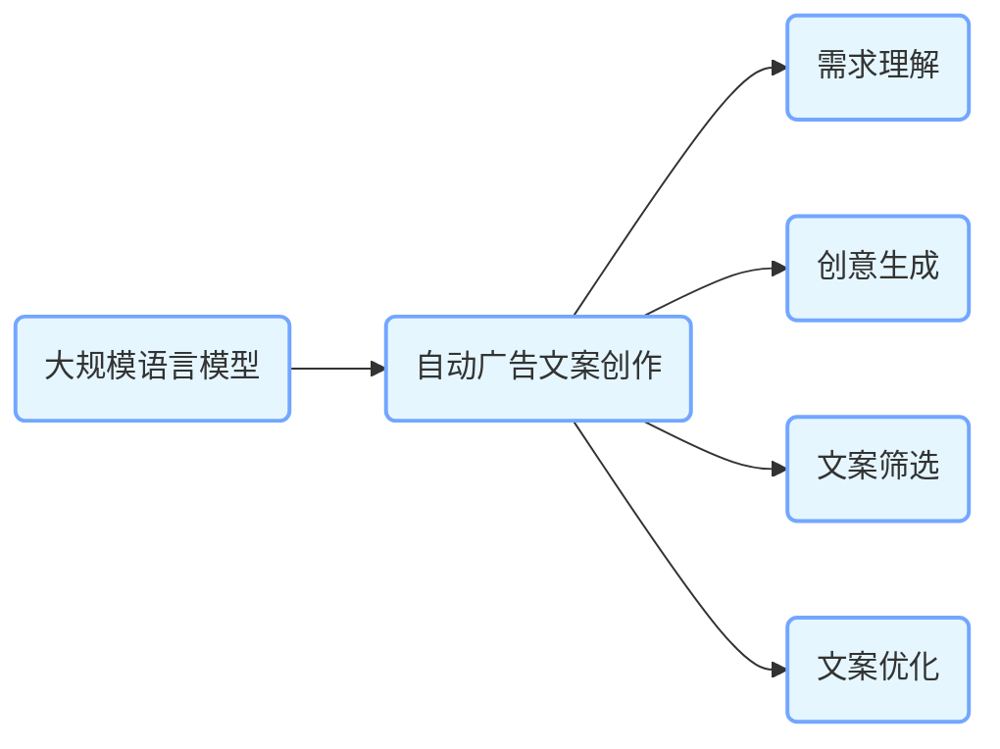

# 大规模语言模型在自动广告文案创作中的探索与突破

> 关键词：大规模语言模型、自动广告文案创作、自然语言处理、人工智能、创意生成、营销自动化、语言理解

> 摘要：本文聚焦于大规模语言模型在自动广告文案创作领域的应用。首先介绍了相关背景，包括研究目的、预期读者等。详细阐述了大规模语言模型和自动广告文案创作的核心概念及其联系，通过流程图呈现其架构。深入讲解了核心算法原理，用 Python 代码进行说明，同时给出相关数学模型和公式。结合项目实战，展示代码实现与解读。探讨了该技术在实际中的应用场景，推荐了学习资源、开发工具和相关论文著作。最后总结了未来发展趋势与挑战，提供常见问题解答和扩展阅读参考资料，旨在全面深入地剖析大规模语言模型在自动广告文案创作中的探索与突破。

## 1. 背景介绍 
### 1.1 目的和范围
在当今数字化营销时代，广告文案的创作需求日益增长。传统的广告文案创作方式不仅耗费大量的时间和人力，而且创作效率和质量参差不齐。大规模语言模型的出现为自动广告文案创作带来了新的机遇。本研究的目的在于探索如何利用大规模语言模型实现高效、高质量的自动广告文案创作，提高广告创作的效率和创意水平。研究范围涵盖大规模语言模型的原理、算法，自动广告文案创作的流程和方法，以及两者结合在实际应用中的效果和挑战。

### 1.2 预期读者
本文预期读者包括广告行业从业者，如广告策划师、文案撰写人员等，他们可以通过本文了解如何利用大规模语言模型提升广告文案创作的效率和质量；人工智能和自然语言处理领域的研究人员和开发者，能够从技术原理和实现细节方面获取有价值的信息；企业市场营销人员，有助于他们了解最新的营销技术趋势，优化广告策略；以及对人工智能和广告创意感兴趣的普通读者。

### 1.3 文档结构概述
本文首先介绍背景信息，包括研究目的、预期读者和文档结构。接着阐述大规模语言模型和自动广告文案创作的核心概念及其联系，通过示意图和流程图展示架构。然后深入讲解核心算法原理，用 Python 代码详细说明，同时给出相关数学模型和公式。通过项目实战，展示开发环境搭建、源代码实现和代码解读。探讨该技术在实际中的应用场景，推荐学习资源、开发工具和相关论文著作。最后总结未来发展趋势与挑战，提供常见问题解答和扩展阅读参考资料。

### 1.4 术语表
#### 1.4.1 核心术语定义
- **大规模语言模型**：是一种基于深度学习的人工智能模型，通过在大规模文本数据上进行训练，学习语言的模式和规律，能够生成自然语言文本。
- **自动广告文案创作**：利用计算机技术和人工智能算法，自动生成广告文案的过程，旨在提高广告创作的效率和质量。
- **自然语言处理（NLP）**：是人工智能的一个重要领域，研究如何让计算机理解、处理和生成自然语言。
- **创意生成**：指产生新颖、独特、有吸引力的想法和内容的过程。
- **营销自动化**：利用软件和技术手段，自动执行营销任务和流程，提高营销效率和效果。

#### 1.4.2 相关概念解释
- **预训练模型**：大规模语言模型通常采用预训练的方式，在大规模无监督数据上进行训练，学习语言的通用特征和模式。
- **微调**：在预训练模型的基础上，使用特定领域的数据进行微调，使模型适应特定任务的需求。
- **上下文理解**：语言模型能够理解输入文本的上下文信息，从而生成更连贯、合理的文本。

#### 1.4.3 缩略词列表
- **NLP**：自然语言处理（Natural Language Processing）
- **GPT**：生成式预训练变换器（Generative Pretrained Transformer）
- **BERT**：双向编码器表示来自变换器（Bidirectional Encoder Representations from Transformers）

## 2. 核心概念与联系 
### 2.1 大规模语言模型原理
大规模语言模型基于深度学习中的神经网络架构，如变换器（Transformer）。变换器架构通过自注意力机制（Self-Attention）能够捕捉文本中不同位置之间的依赖关系，从而更好地理解文本的语义信息。

预训练是大规模语言模型的重要步骤，模型在大规模无监督文本数据上进行训练，学习语言的通用模式和规律。在预训练过程中，模型通常采用掩码语言模型（Masked Language Model，MLM）或自回归语言模型（Autoregressive Language Model，ARLM）等任务进行训练。

微调是在预训练模型的基础上，使用特定领域的数据进行进一步训练，使模型适应特定任务的需求。例如，在自动广告文案创作任务中，使用广告文案数据对预训练模型进行微调，使模型能够生成更符合广告需求的文案。

### 2.2 自动广告文案创作原理
自动广告文案创作的目标是根据给定的产品信息、目标受众、广告目标等输入信息，生成有吸引力、有说服力的广告文案。其过程通常包括以下几个步骤：
1. **需求理解**：对输入的产品信息、目标受众、广告目标等进行理解和分析，提取关键信息。
2. **创意生成**：基于需求理解的结果，利用大规模语言模型生成多个创意文案。
3. **文案筛选**：对生成的创意文案进行筛选和评估，选择最符合需求的文案。
4. **文案优化**：对筛选出的文案进行进一步优化，使其更加通顺、自然、有吸引力。

### 2.3 核心概念联系
大规模语言模型为自动广告文案创作提供了强大的语言生成能力。通过预训练和微调，模型能够学习到丰富的语言知识和广告文案的模式，从而生成高质量的广告文案。自动广告文案创作则为大规模语言模型提供了应用场景和优化方向，通过不断地收集和分析广告文案数据，对模型进行微调，提高模型的性能和适应性。

### 2.4 文本示意图
```plaintext
+-------------------+
| 大规模语言模型    |
| （预训练 + 微调） |
+-------------------+
           |
           v
+-------------------+
| 自动广告文案创作  |
| （需求理解、创意  |
| 生成、文案筛选、  |
| 文案优化）        |
+-------------------+
```

### 2.5 Mermaid 流程图


## 3. 核心算法原理 & 具体操作步骤 
### 3.1 核心算法原理
在自动广告文案创作中，常用的大规模语言模型如 GPT 系列和 BERT 系列。这里以 GPT 系列为例，介绍其核心算法原理。

GPT 是一种自回归语言模型，它通过预测下一个词来生成文本。其核心是变换器架构，变换器架构由多个编码器和解码器层组成。在 GPT 中，只使用了解码器层。

自注意力机制是变换器架构的关键，它允许模型在生成每个词时，考虑输入文本中不同位置的信息。自注意力机制的计算过程如下：
1. 对于输入的词向量序列 $X = [x_1, x_2, ..., x_n]$，分别计算查询向量 $Q$、键向量 $K$ 和值向量 $V$：
   - $Q = XW_Q$
   - $K = XW_K$
   - $V = XW_V$
   其中 $W_Q$、$W_K$ 和 $W_V$ 是可学习的权重矩阵。
2. 计算注意力分数：
   - $Attention(Q, K, V) = softmax(\frac{QK^T}{\sqrt{d_k}})V$
   其中 $d_k$ 是查询向量和键向量的维度。

### 3.2 具体操作步骤
#### 3.2.1 数据准备
收集广告文案数据，包括产品信息、目标受众、广告目标等。对数据进行清洗和预处理，如去除噪声、分词等。

#### 3.2.2 模型选择
选择合适的大规模语言模型，如 GPT-3、GPT-4 等。可以使用开源的预训练模型，也可以使用商业模型。

#### 3.2.3 微调模型
使用准备好的广告文案数据对预训练模型进行微调。微调的过程通常包括以下步骤：
1. 定义模型的输入和输出格式。
2. 定义损失函数，如交叉熵损失函数。
3. 选择优化器，如 Adam 优化器。
4. 进行训练，调整模型的参数。

#### 3.2.4 生成广告文案
使用微调后的模型生成广告文案。输入产品信息、目标受众、广告目标等信息，模型输出相应的广告文案。

### 3.3 Python 源代码实现
```python
import torch
from transformers import GPT2LMHeadModel, GPT2Tokenizer

# 加载预训练模型和分词器
tokenizer = GPT2Tokenizer.from_pretrained('gpt2')
model = GPT2LMHeadModel.from_pretrained('gpt2')

# 输入信息
input_text = "产品：智能手表，目标受众：年轻人，广告目标：吸引购买"
input_ids = tokenizer.encode(input_text, return_tensors='pt')

# 生成广告文案
output = model.generate(input_ids, max_length=100, num_beams=5, no_repeat_ngram_size=2, early_stopping=True)
generated_text = tokenizer.decode(output[0], skip_special_tokens=True)

print("生成的广告文案：", generated_text)
```

### 3.4 代码解释
1. **加载预训练模型和分词器**：使用 `transformers` 库加载 GPT-2 预训练模型和分词器。
2. **输入信息**：定义输入的产品信息、目标受众、广告目标等信息，并使用分词器将其编码为输入 ID。
3. **生成广告文案**：使用模型的 `generate` 方法生成广告文案。设置生成的最大长度、束搜索的数量、避免重复的 n-gram 大小等参数。
4. **解码输出**：使用分词器将生成的 ID 序列解码为文本。

## 4. 数学模型和公式 & 详细讲解 & 举例说明 
### 4.1 自注意力机制数学模型
自注意力机制的数学模型可以表示为：
$$Attention(Q, K, V) = softmax(\frac{QK^T}{\sqrt{d_k}})V$$

### 4.2 详细讲解
- **查询向量 $Q$、键向量 $K$ 和值向量 $V$**：对于输入的词向量序列 $X = [x_1, x_2, ..., x_n]$，通过线性变换得到查询向量 $Q$、键向量 $K$ 和值向量 $V$。查询向量用于计算注意力分数，键向量用于匹配查询向量，值向量用于加权求和。
- **注意力分数**：通过计算查询向量和键向量的点积，得到注意力分数。除以 $\sqrt{d_k}$ 是为了防止点积结果过大，导致梯度消失或爆炸。
- **softmax 函数**：对注意力分数进行 softmax 操作，将其转换为概率分布。
- **加权求和**：将 softmax 输出的概率分布与值向量进行加权求和，得到自注意力机制的输出。

### 4.3 举例说明
假设输入的词向量序列为 $X = [x_1, x_2, x_3]$，其中 $x_i$ 是一个 $d$ 维的向量。计算查询向量 $Q = [q_1, q_2, q_3]$、键向量 $K = [k_1, k_2, k_3]$ 和值向量 $V = [v_1, v_2, v_3]$。

计算注意力分数：
$$scores_{ij} = \frac{q_i^Tk_j}{\sqrt{d_k}}$$

进行 softmax 操作：
$$weights_{ij} = \frac{e^{scores_{ij}}}{\sum_{k=1}^{3}e^{scores_{ik}}}$$

加权求和：
$$output_i = \sum_{j=1}^{3}weights_{ij}v_j$$

最终得到自注意力机制的输出 $[output_1, output_2, output_3]$。

## 5. 项目实战：代码实际案例和详细解释说明 
### 5.1  开发环境搭建
#### 5.1.1 安装 Python
首先需要安装 Python 环境，建议使用 Python 3.7 及以上版本。可以从 Python 官方网站（https://www.python.org/downloads/）下载并安装。

#### 5.1.2 安装依赖库
使用 `pip` 安装所需的依赖库，包括 `transformers`、`torch` 等。
```bash
pip install transformers torch
```

### 5.2  源代码详细实现和代码解读
```python
import torch
from transformers import GPT2LMHeadModel, GPT2Tokenizer

# 加载预训练模型和分词器
tokenizer = GPT2Tokenizer.from_pretrained('gpt2')
model = GPT2LMHeadModel.from_pretrained('gpt2')

# 输入信息
input_text = "产品：智能手表，目标受众：年轻人，广告目标：吸引购买"
input_ids = tokenizer.encode(input_text, return_tensors='pt')

# 生成广告文案
output = model.generate(input_ids, max_length=100, num_beams=5, no_repeat_ngram_size=2, early_stopping=True)
generated_text = tokenizer.decode(output[0], skip_special_tokens=True)

print("生成的广告文案：", generated_text)
```

### 5.3  代码解读与分析
#### 5.3.1 加载预训练模型和分词器
```python
tokenizer = GPT2Tokenizer.from_pretrained('gpt2')
model = GPT2LMHeadModel.from_pretrained('gpt2')
```
使用 `transformers` 库的 `GPT2Tokenizer` 和 `GPT2LMHeadModel` 类加载 GPT-2 预训练模型和分词器。`from_pretrained` 方法会自动下载并加载预训练的模型和分词器。

#### 5.3.2 输入信息处理
```python
input_text = "产品：智能手表，目标受众：年轻人，广告目标：吸引购买"
input_ids = tokenizer.encode(input_text, return_tensors='pt')
```
定义输入的产品信息、目标受众、广告目标等信息，并使用分词器的 `encode` 方法将其编码为输入 ID。`return_tensors='pt'` 表示返回 PyTorch 张量。

#### 5.3.3 生成广告文案
```python
output = model.generate(input_ids, max_length=100, num_beams=5, no_repeat_ngram_size=2, early_stopping=True)
```
使用模型的 `generate` 方法生成广告文案。`max_length` 表示生成文本的最大长度，`num_beams` 表示束搜索的数量，`no_repeat_ngram_size` 表示避免重复的 n-gram 大小，`early_stopping` 表示是否在生成结束时停止。

#### 5.3.4 解码输出
```python
generated_text = tokenizer.decode(output[0], skip_special_tokens=True)
```
使用分词器的 `decode` 方法将生成的 ID 序列解码为文本。`skip_special_tokens=True` 表示跳过特殊标记。

## 6. 实际应用场景 
### 6.1 电商广告
在电商平台上，自动广告文案创作可以根据商品信息自动生成吸引人的广告文案，提高商品的曝光率和销售量。例如，根据商品的特点、价格、用户评价等信息，生成不同风格的广告文案，如促销文案、品牌宣传文案等。

### 6.2 社交媒体广告
在社交媒体平台上，自动广告文案创作可以根据目标受众的特点和兴趣，生成个性化的广告文案，提高广告的点击率和转化率。例如，针对不同年龄段、性别、地域的用户，生成不同风格和内容的广告文案。

### 6.3 电子邮件营销
在电子邮件营销中，自动广告文案创作可以根据邮件的主题和目标，生成吸引人的邮件内容，提高邮件的打开率和阅读率。例如，根据产品的新品发布、促销活动等信息，生成相应的邮件文案。

### 6.4 线下广告
在线下广告中，自动广告文案创作可以根据广告的场景和目标，生成合适的广告文案，如海报文案、宣传单页文案等。例如，根据商场的促销活动、展会的主题等信息，生成相应的广告文案。

## 7. 工具和资源推荐
### 7.1 学习资源推荐
#### 7.1.1 书籍推荐
- 《深度学习》（Deep Learning）：由 Ian Goodfellow、Yoshua Bengio 和 Aaron Courville 所著，是深度学习领域的经典教材，介绍了深度学习的基本原理和方法。
- 《自然语言处理入门》：由何晗所著，系统地介绍了自然语言处理的基础知识和应用技术。
- 《Python 自然语言处理》（Natural Language Processing with Python）：由 Steven Bird、Ewan Klein 和 Edward Loper 所著，介绍了如何使用 Python 进行自然语言处理。

#### 7.1.2 在线课程
- Coursera 上的“深度学习专项课程”（Deep Learning Specialization）：由 Andrew Ng 教授授课，涵盖了深度学习的各个方面。
- edX 上的“自然语言处理基础”（Foundations of Natural Language Processing）：介绍了自然语言处理的基本概念和技术。
- 哔哩哔哩上的相关自然语言处理和深度学习教程，有很多优质的视频资源。

#### 7.1.3 技术博客和网站
- Hugging Face 官方博客：提供了关于大规模语言模型和自然语言处理的最新技术和研究成果。
- Medium 上的自然语言处理和人工智能相关博客，有很多专家和开发者分享的经验和见解。
- arXiv 网站：可以查看最新的自然语言处理和人工智能领域的学术论文。

### 7.2 开发工具框架推荐
#### 7.2.1 IDE和编辑器
- PyCharm：是一款专业的 Python 集成开发环境，提供了丰富的代码编辑、调试和部署功能。
- Visual Studio Code：是一款轻量级的代码编辑器，支持多种编程语言和插件，适合快速开发和调试。

#### 7.2.2 调试和性能分析工具
- PyTorch 自带的调试工具：可以帮助开发者调试和优化 PyTorch 代码。
- TensorBoard：是 TensorFlow 提供的可视化工具，也可以用于 PyTorch 模型的训练过程可视化和性能分析。

#### 7.2.3 相关框架和库
- Transformers：是 Hugging Face 开发的自然语言处理库，提供了多种预训练模型和工具，方便开发者进行自然语言处理任务。
- PyTorch：是一个开源的深度学习框架，广泛应用于自然语言处理和计算机视觉等领域。
- NLTK：是一个 Python 自然语言处理工具包，提供了丰富的语料库和工具，用于文本处理和分析。

### 7.3 相关论文著作推荐
#### 7.3.1 经典论文
- “Attention Is All You Need”：介绍了变换器（Transformer）架构，是大规模语言模型的基础。
- “BERT: Pre-training of Deep Bidirectional Transformers for Language Understanding”：提出了 BERT 模型，开创了预训练语言模型的先河。
- “Generative Pretrained Transformer 3”：介绍了 GPT-3 模型，展示了大规模语言模型的强大能力。

#### 7.3.2 最新研究成果
可以关注 arXiv 网站上最新的自然语言处理和人工智能领域的研究论文，了解最新的技术和方法。

#### 7.3.3 应用案例分析
可以查看一些商业公司和研究机构发布的应用案例分析，了解大规模语言模型在自动广告文案创作等领域的实际应用效果和经验。

## 8. 总结：未来发展趋势与挑战
### 8.1 未来发展趋势
#### 8.1.1 模型性能提升
随着计算资源的不断增加和算法的不断改进，大规模语言模型的性能将不断提升。模型将能够处理更长的文本、生成更准确和自然的语言，从而提高自动广告文案创作的质量。

#### 8.1.2 个性化定制
未来的自动广告文案创作将更加注重个性化定制。根据用户的个人信息、兴趣爱好、购买历史等数据，生成更加个性化的广告文案，提高广告的针对性和效果。

#### 8.1.3 多模态融合
除了文本信息，未来的自动广告文案创作将融合图像、音频、视频等多模态信息。通过多模态信息的融合，生成更加生动、丰富的广告文案，提高广告的吸引力和感染力。

#### 8.1.4 与营销自动化的深度结合
自动广告文案创作将与营销自动化系统深度结合，实现广告文案的自动生成、投放和优化。通过营销自动化系统的数据分析和反馈，不断优化广告文案的内容和策略，提高营销效果。

### 8.2 挑战
#### 8.2.1 数据质量和隐私问题
大规模语言模型的训练需要大量的高质量数据。然而，数据的收集、标注和管理面临着质量和隐私问题。如何确保数据的质量和隐私，是一个亟待解决的问题。

#### 8.2.2 创意和情感表达
虽然大规模语言模型能够生成自然语言文本，但在创意和情感表达方面还存在不足。如何让自动生成的广告文案具有独特的创意和情感，是一个挑战。

#### 8.2.3 语言理解和上下文处理
自动广告文案创作需要对输入的产品信息、目标受众、广告目标等进行准确的理解和处理。然而，语言的复杂性和歧义性使得语言理解和上下文处理成为一个难题。

#### 8.2.4 伦理和法律问题
大规模语言模型的应用可能会带来一些伦理和法律问题，如虚假广告、版权问题等。如何确保自动广告文案创作的合法性和道德性，是一个需要关注的问题。

## 9. 附录：常见问题与解答
### 9.1 大规模语言模型生成的广告文案质量如何保证？
可以通过以下方法保证广告文案的质量：
- 使用高质量的训练数据，对数据进行清洗和预处理。
- 对模型进行微调，使其适应广告文案创作的任务。
- 采用人工审核和筛选的方式，对生成的广告文案进行评估和优化。

### 9.2 自动广告文案创作是否会取代人工文案撰写？
自动广告文案创作不会完全取代人工文案撰写。虽然自动广告文案创作可以提高效率和生成一些基础的文案，但人工文案撰写在创意、情感表达和对品牌的理解等方面具有不可替代的优势。两者可以相互补充，共同提高广告文案的质量。

### 9.3 如何选择合适的大规模语言模型？
选择合适的大规模语言模型需要考虑以下因素：
- 模型的性能和效果，如生成文本的质量、速度等。
- 模型的可扩展性和适应性，是否能够满足具体任务的需求。
- 模型的开源性和商业授权，是否符合项目的需求和预算。

### 9.4 自动广告文案创作在不同行业的应用效果如何？
自动广告文案创作在不同行业的应用效果会有所差异。在电商、社交媒体等行业，由于数据丰富、需求多样，应用效果相对较好。在一些专业性较强、对创意和情感要求较高的行业，如金融、医疗等，可能需要结合人工的专业知识和创意进行优化。

## 10. 扩展阅读 & 参考资料
### 10.1 扩展阅读
- 《人工智能时代的广告创意》：探讨了人工智能在广告创意领域的应用和发展趋势。
- 《自然语言处理实战》：通过实际案例介绍了自然语言处理的应用和实现方法。
- 《深度学习实战》：介绍了深度学习的基本原理和实际应用。

### 10.2 参考资料
- Hugging Face 官方文档：https://huggingface.co/docs
- PyTorch 官方文档：https://pytorch.org/docs/stable/index.html
- arXiv 网站：https://arxiv.org/
- 相关学术期刊和会议论文，如 ACL、EMNLP、NeurIPS 等。