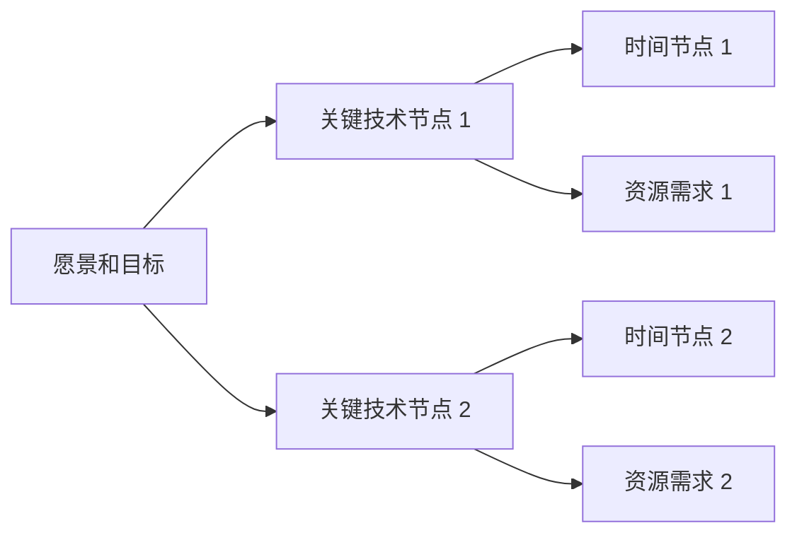

# 大规模语言模型在自动技术发展路线图生成中的应用研究

> 关键词：大规模语言模型、自动技术发展路线图、自然语言处理、知识图谱、人工智能

> 摘要：本文聚焦于大规模语言模型在自动技术发展路线图生成中的应用。首先介绍了研究的背景、目的和预期读者等内容，详细阐述了大规模语言模型和技术发展路线图的核心概念及联系。接着深入讲解了相关核心算法原理，包括使用 Python 代码进行说明，同时给出了数学模型和公式。通过项目实战展示了如何实现自动技术发展路线图的生成，包括开发环境搭建、源代码实现与解读。探讨了其实际应用场景，推荐了相关的学习资源、开发工具框架和论文著作。最后总结了未来发展趋势与挑战，并给出常见问题解答和扩展阅读参考资料，旨在为相关领域的研究和实践提供全面且深入的参考。

## 1. 背景介绍 
### 1.1 目的和范围
随着科技的飞速发展，技术领域不断涌现新的创新和变革。技术发展路线图作为一种重要的战略规划工具，能够帮助企业、科研机构和政府部门等清晰地了解技术的发展趋势、确定发展目标和规划资源。然而，传统的技术发展路线图制定过程往往依赖于专家的经验和手动分析，不仅耗时费力，而且容易受到主观因素的影响。

本研究的目的在于探索如何利用大规模语言模型的强大自然语言处理能力，实现技术发展路线图的自动化生成。研究范围涵盖了大规模语言模型的原理和应用、技术发展路线图的相关理论和方法，以及如何将两者结合起来实现自动生成技术发展路线图的具体技术和实践。

### 1.2 预期读者
本文预期读者包括从事人工智能、自然语言处理、技术管理、战略规划等领域的研究人员和从业者。对于对技术发展路线图感兴趣的企业管理人员、科研项目负责人以及相关专业的学生也具有一定的参考价值。

### 1.3 文档结构概述
本文将按照以下结构展开：首先介绍相关的核心概念和它们之间的联系，包括大规模语言模型和技术发展路线图的原理和架构；接着详细讲解实现自动技术发展路线图生成的核心算法原理和具体操作步骤，并用 Python 代码进行阐述；然后给出相关的数学模型和公式，并通过举例进行说明；通过项目实战展示如何搭建开发环境、实现源代码以及对代码进行解读和分析；探讨大规模语言模型在自动技术发展路线图生成中的实际应用场景；推荐相关的学习资源、开发工具框架和论文著作；最后总结未来发展趋势与挑战，给出常见问题解答和扩展阅读参考资料。

### 1.4 术语表
#### 1.4.1 核心术语定义
- **大规模语言模型**：基于深度学习技术，通过在大规模文本数据上进行训练得到的语言模型，具有强大的语言理解和生成能力，如 GPT - 3、BERT 等。
- **技术发展路线图**：一种描述技术发展过程和趋势的战略规划工具，通常包括技术目标、关键技术节点、时间节点和资源需求等信息。
- **自然语言处理（NLP）**：人工智能的一个重要领域，旨在让计算机理解、处理和生成人类语言。

#### 1.4.2 相关概念解释
- **知识图谱**：一种语义网络，用于表示实体之间的关系和知识，在技术发展路线图生成中可以帮助整合和推理相关知识。
- **文本挖掘**：从大量文本数据中提取有价值信息和知识的过程，是大规模语言模型应用的重要环节。

#### 1.4.3 缩略词列表
- **NLP**：Natural Language Processing（自然语言处理）
- **GPT**：Generative Pretrained Transformer（生成式预训练变换器）
- **BERT**：Bidirectional Encoder Representations from Transformers（基于变换器的双向编码器表示）

## 2. 核心概念与联系 
### 大规模语言模型原理和架构
大规模语言模型基于深度学习中的神经网络架构，如 Transformer 架构。Transformer 架构主要由编码器和解码器组成，其中编码器负责对输入的文本进行特征提取和编码，解码器则根据编码器的输出生成相应的文本。

其训练过程通常分为预训练和微调两个阶段。在预训练阶段，模型在大规模的无监督文本数据上进行训练，学习语言的通用模式和规律。在微调阶段，模型在特定的有监督数据集上进行训练，以适应具体的任务需求。

以下是大规模语言模型的原理和架构的文本示意图：

大规模语言模型接收输入文本，通过嵌入层将文本转换为向量表示。然后，向量经过多层的 Transformer 编码器或解码器进行特征提取和处理。最后，模型输出相应的文本结果。


### 技术发展路线图原理和架构
技术发展路线图通常由多个层次和要素组成。最上层是技术发展的愿景和目标，明确技术发展的方向和最终期望达到的效果。中间层是关键技术节点，这些节点代表了技术发展过程中的重要里程碑和关键技术突破。最下层是时间节点和资源需求，用于规划技术发展的进度和所需的资源。

以下是技术发展路线图的原理和架构的文本示意图：

技术发展路线图以愿景和目标为导向，确定关键技术节点。每个关键技术节点对应着相应的时间节点和资源需求。通过这些要素的组合，形成一个完整的技术发展规划。



### 两者之间的联系
大规模语言模型可以为技术发展路线图的生成提供强大的自然语言处理能力。通过对大量的技术文献、研究报告等文本数据进行分析和处理，大规模语言模型可以提取出关键的技术信息、趋势和关系。这些信息可以用于确定技术发展路线图中的关键技术节点、时间节点和资源需求等要素。

同时，技术发展路线图中的知识和信息也可以作为大规模语言模型的训练数据或上下文信息，帮助模型更好地理解和处理技术领域的文本，提高模型的性能和准确性。

## 3. 核心算法原理 & 具体操作步骤 
### 核心算法原理
实现自动技术发展路线图生成的核心算法主要包括文本提取、文本分类、实体识别和关系抽取等步骤。

#### 文本提取
文本提取的目的是从大量的文本数据中筛选出与技术发展相关的文本。可以使用关键词匹配、文本相似度计算等方法进行文本提取。

以下是使用 Python 实现关键词匹配进行文本提取的示例代码：

```python
def text_extraction(texts, keywords):
    relevant_texts = []
    for text in texts:
        for keyword in keywords:
            if keyword in text:
                relevant_texts.append(text)
                break
    return relevant_texts

# 示例数据
texts = ["这是一篇关于人工智能技术发展的文章", "这是一篇关于医学研究的文章", "技术创新是推动发展的关键"]
keywords = ["人工智能", "技术发展"]
relevant_texts = text_extraction(texts, keywords)
print(relevant_texts)
```

#### 文本分类
文本分类的目的是将提取的文本分为不同的类别，如技术趋势、技术应用、技术挑战等。可以使用机器学习分类算法，如朴素贝叶斯、支持向量机等，也可以使用深度学习分类模型，如卷积神经网络（CNN）、循环神经网络（RNN）等。

以下是使用朴素贝叶斯算法进行文本分类的示例代码：

```python
from sklearn.feature_extraction.text import TfidfVectorizer
from sklearn.naive_bayes import MultinomialNB
from sklearn.pipeline import Pipeline

# 示例数据
train_texts = ["人工智能技术正在快速发展", "人工智能在医疗领域有广泛应用", "人工智能面临着数据隐私挑战"]
train_labels = ["技术趋势", "技术应用", "技术挑战"]
test_texts = ["人工智能在教育领域的应用前景广阔"]

# 构建分类器
classifier = Pipeline([
    ('vectorizer', TfidfVectorizer()),
    ('classifier', MultinomialNB())
])

# 训练模型
classifier.fit(train_texts, train_labels)

# 预测
predictions = classifier.predict(test_texts)
print(predictions)
```

#### 实体识别
实体识别的目的是从文本中识别出关键的实体，如技术名称、企业名称、研究机构等。可以使用基于规则的方法或基于深度学习的方法，如命名实体识别（NER）模型。

以下是使用 spaCy 库进行实体识别的示例代码：

```python
import spacy

nlp = spacy.load("en_core_web_sm")
text = "Google is a leading company in the field of artificial intelligence."
doc = nlp(text)
for ent in doc.ents:
    print(ent.text, ent.label_)
```

#### 关系抽取
关系抽取的目的是从文本中抽取实体之间的关系，如技术之间的依赖关系、企业与技术的合作关系等。可以使用基于规则的方法、基于机器学习的方法或基于深度学习的方法。

以下是一个简单的基于规则的关系抽取示例代码：

```python
def relation_extraction(text):
    if "depend on" in text:
        parts = text.split("depend on")
        entity1 = parts[0].strip()
        entity2 = parts[1].strip()
        return (entity1, "depend on", entity2)
    else:
        return None

text = "Technology A depend on Technology B"
relation = relation_extraction(text)
print(relation)
```

### 具体操作步骤
1. **数据收集**：收集与技术发展相关的文本数据，如学术论文、新闻报道、行业报告等。
2. **文本提取**：使用关键词匹配等方法从收集的数据中提取与技术发展相关的文本。
3. **文本分类**：将提取的文本分为不同的类别，如技术趋势、技术应用、技术挑战等。
4. **实体识别**：从文本中识别出关键的实体，如技术名称、企业名称、研究机构等。
5. **关系抽取**：从文本中抽取实体之间的关系，如技术之间的依赖关系、企业与技术的合作关系等。
6. **路线图生成**：根据提取的实体和关系，结合时间信息和资源需求，生成技术发展路线图。

## 4. 数学模型和公式 & 详细讲解 & 举例说明 
### 文本相似度计算
文本相似度计算用于衡量两个文本之间的相似程度。常用的文本相似度计算方法包括余弦相似度、编辑距离等。

#### 余弦相似度
余弦相似度通过计算两个文本向量之间的夹角余弦值来衡量它们的相似度。假设两个文本向量分别为 $\vec{A}$ 和 $\vec{B}$，则它们的余弦相似度 $sim(\vec{A}, \vec{B})$ 计算公式为：

$$sim(\vec{A}, \vec{B}) = \frac{\vec{A} \cdot \vec{B}}{\|\vec{A}\| \|\vec{B}\|}$$

其中，$\vec{A} \cdot \vec{B}$ 表示向量 $\vec{A}$ 和 $\vec{B}$ 的点积，$\|\vec{A}\|$ 和 $\|\vec{B}\|$ 分别表示向量 $\vec{A}$ 和 $\vec{B}$ 的模。

以下是使用 Python 实现余弦相似度计算的示例代码：

```python
import numpy as np
from sklearn.feature_extraction.text import TfidfVectorizer

text1 = "人工智能技术正在快速发展"
text2 = "人工智能的发展速度很快"

vectorizer = TfidfVectorizer()
vectors = vectorizer.fit_transform([text1, text2])
vectors = vectors.toarray()

vec1 = vectors[0]
vec2 = vectors[1]

dot_product = np.dot(vec1, vec2)
norm1 = np.linalg.norm(vec1)
norm2 = np.linalg.norm(vec2)

cosine_similarity = dot_product / (norm1 * norm2)
print(cosine_similarity)
```

#### 编辑距离
编辑距离是指将一个字符串转换为另一个字符串所需的最少编辑操作次数，包括插入、删除和替换操作。

以下是使用 Python 实现编辑距离计算的示例代码：

```python
def edit_distance(str1, str2):
    m = len(str1)
    n = len(str2)
    dp = [[0 for _ in range(n + 1)] for _ in range(m + 1)]

    for i in range(m + 1):
        for j in range(n + 1):
            if i == 0:
                dp[i][j] = j
            elif j == 0:
                dp[i][j] = i
            elif str1[i - 1] == str2[j - 1]:
                dp[i][j] = dp[i - 1][j - 1]
            else:
                dp[i][j] = 1 + min(dp[i - 1][j], dp[i][j - 1], dp[i - 1][j - 1])

    return dp[m][n]

str1 = "kitten"
str2 = "sitting"
distance = edit_distance(str1, str2)
print(distance)
```

### 文本分类模型的评估指标
文本分类模型的评估指标包括准确率、召回率、F1 值等。

#### 准确率
准确率是指分类正确的样本数占总样本数的比例。假设总样本数为 $N$，分类正确的样本数为 $N_{correct}$，则准确率 $Accuracy$ 的计算公式为：

$$Accuracy = \frac{N_{correct}}{N}$$

#### 召回率
召回率是指分类正确的正样本数占实际正样本数的比例。假设实际正样本数为 $N_{positive}$，分类正确的正样本数为 $N_{true_positive}$，则召回率 $Recall$ 的计算公式为：

$$Recall = \frac{N_{true_positive}}{N_{positive}}$$

#### F1 值
F1 值是准确率和召回率的调和平均数，用于综合评估分类模型的性能。F1 值的计算公式为：

$$F1 = \frac{2 \times Accuracy \times Recall}{Accuracy + Recall}$$

以下是使用 Python 实现文本分类模型评估指标计算的示例代码：

```python
from sklearn.metrics import accuracy_score, recall_score, f1_score

true_labels = [0, 1, 0, 1]
predicted_labels = [0, 1, 1, 1]

accuracy = accuracy_score(true_labels, predicted_labels)
recall = recall_score(true_labels, predicted_labels)
f1 = f1_score(true_labels, predicted_labels)

print("Accuracy:", accuracy)
print("Recall:", recall)
print("F1 Score:", f1)
```

## 5. 项目实战：代码实际案例和详细解释说明 
### 5.1  开发环境搭建
#### 安装 Python
首先需要安装 Python 环境，建议使用 Python 3.7 及以上版本。可以从 Python 官方网站（https://www.python.org/downloads/） 下载并安装。

#### 安装必要的库
使用 pip 命令安装必要的库，如 sklearn、spacy、numpy 等。

```sh
pip install sklearn spacy numpy
```

#### 下载 spaCy 语言模型
使用以下命令下载 spaCy 的英文语言模型：

```sh
python -m spacy download en_core_web_sm
```

### 5.2  源代码详细实现和代码解读
以下是一个完整的自动技术发展路线图生成的示例代码：

```python
import spacy
from sklearn.feature_extraction.text import TfidfVectorizer
from sklearn.naive_bayes import MultinomialNB
from sklearn.pipeline import Pipeline

# 数据收集
texts = [
    "Artificial intelligence is a rapidly developing technology.",
    "Machine learning is widely used in data analysis.",
    "Deep learning has achieved great success in image recognition.",
    "Natural language processing is facing some challenges."
]

# 关键词列表
keywords = ["artificial intelligence", "machine learning", "deep learning", "natural language processing"]

# 文本提取
def text_extraction(texts, keywords):
    relevant_texts = []
    for text in texts:
        for keyword in keywords:
            if keyword in text.lower():
                relevant_texts.append(text)
                break
    return relevant_texts

relevant_texts = text_extraction(texts, keywords)

# 文本分类
train_texts = [
    "Artificial intelligence is a rapidly developing technology.",
    "Machine learning is widely used in data analysis.",
    "Deep learning has achieved great success in image recognition.",
    "Natural language processing is facing some challenges."
]
train_labels = ["Technology Trend", "Technology Application", "Technology Application", "Technology Challenge"]
test_texts = relevant_texts

classifier = Pipeline([
    ('vectorizer', TfidfVectorizer()),
    ('classifier', MultinomialNB())
])

classifier.fit(train_texts, train_labels)
predictions = classifier.predict(test_texts)

# 实体识别
nlp = spacy.load("en_core_web_sm")
entities = []
for text in relevant_texts:
    doc = nlp(text)
    for ent in doc.ents:
        entities.append((ent.text, ent.label_))

# 关系抽取
def relation_extraction(text):
    if "used in" in text:
        parts = text.split("used in")
        entity1 = parts[0].strip()
        entity2 = parts[1].strip()
        return (entity1, "used in", entity2)
    else:
        return None

relations = []
for text in relevant_texts:
    relation = relation_extraction(text)
    if relation:
        relations.append(relation)

# 输出结果
print("Relevant Texts:", relevant_texts)
print("Predictions:", predictions)
print("Entities:", entities)
print("Relations:", relations)
```

### 5.3  代码解读与分析
1. **数据收集**：定义了一个包含多个文本的列表 `texts`，模拟从各种渠道收集到的文本数据。
2. **文本提取**：定义了 `text_extraction` 函数，通过关键词匹配的方式从 `texts` 中提取与技术发展相关的文本。
3. **文本分类**：使用 `Pipeline` 构建了一个文本分类器，包括 `TfidfVectorizer` 用于文本向量化和 `MultinomialNB` 用于分类。使用训练数据 `train_texts` 和 `train_labels` 进行训练，并对提取的文本进行分类预测。
4. **实体识别**：使用 spaCy 库的 `en_core_web_sm` 语言模型对提取的文本进行实体识别，将识别出的实体及其标签存储在 `entities` 列表中。
5. **关系抽取**：定义了 `relation_extraction` 函数，通过规则匹配的方式从文本中抽取实体之间的关系，将抽取的关系存储在 `relations` 列表中。
6. **输出结果**：打印出提取的文本、分类预测结果、实体和关系信息。

## 6. 实际应用场景 
### 企业战略规划
企业可以利用自动技术发展路线图生成工具，了解行业技术发展趋势，确定自身的技术发展方向和目标。通过分析技术之间的关系和依赖，企业可以合理规划资源，提前布局关键技术，提高市场竞争力。

### 科研项目管理
科研机构和项目负责人可以使用该工具制定科研项目的技术发展路线图，明确项目的关键技术节点和时间进度。这有助于合理安排科研资源，确保项目按计划顺利进行。

### 政府政策制定
政府部门可以通过自动技术发展路线图生成工具，了解技术发展的整体趋势和需求，制定相应的产业政策和科技发展规划。这有助于引导资源向关键技术领域倾斜，促进技术创新和产业升级。

### 投资决策
投资者可以利用技术发展路线图评估不同技术领域的发展前景和投资价值。通过分析技术的成熟度、市场需求和竞争态势，投资者可以做出更明智的投资决策。

## 7. 工具和资源推荐
### 7.1 学习资源推荐
#### 7.1.1 书籍推荐
- 《自然语言处理入门》：介绍了自然语言处理的基本概念、算法和技术，适合初学者入门。
- 《深度学习》：全面阐述了深度学习的原理、模型和应用，对理解大规模语言模型有很大帮助。
- 《技术创新管理》：讲解了技术创新的理论和方法，包括技术发展路线图的制定和应用。

#### 7.1.2 在线课程
- Coursera 上的 “Natural Language Processing Specialization”：由顶尖大学的教授授课，系统地介绍了自然语言处理的各个方面。
- edX 上的 “Deep Learning Fundamentals”：深入讲解了深度学习的基础知识和应用。
- Udemy 上的 “Technology Roadmapping: A Practical Guide”：提供了技术发展路线图制定的实践指导。

#### 7.1.3 技术博客和网站
- Medium：有许多关于人工智能、自然语言处理和技术管理的优质博客文章。
- arXiv：提供了大量的学术论文和研究成果，涵盖了大规模语言模型和技术发展路线图等领域。
- IEEE Xplore：电气和电子工程师协会的数字图书馆，包含了众多的技术文献和研究报告。

### 7.2 开发工具框架推荐
#### 7.2.1 IDE和编辑器
- PyCharm：功能强大的 Python 集成开发环境，提供了代码编辑、调试、版本控制等功能。
- Visual Studio Code：轻量级的代码编辑器，支持多种编程语言，有丰富的插件扩展功能。

#### 7.2.2 调试和性能分析工具
- PDB：Python 内置的调试器，可以帮助开发者定位和解决代码中的问题。
- cProfile：Python 的性能分析工具，可以分析代码的运行时间和资源消耗情况。

#### 7.2.3 相关框架和库
- TensorFlow：开源的机器学习框架，广泛用于深度学习模型的开发和训练。
- PyTorch：另一个流行的深度学习框架，具有动态图的优势，适合快速迭代和实验。
- spaCy：用于自然语言处理的 Python 库，提供了高效的实体识别、词性标注等功能。

### 7.3 相关论文著作推荐
#### 7.3.1 经典论文
- “Attention Is All You Need”：介绍了 Transformer 架构，是大规模语言模型的基础。
- “BERT: Pre-training of Deep Bidirectional Transformers for Language Understanding”：提出了 BERT 模型，在自然语言处理领域取得了巨大成功。
- “Technology Roadmapping - A Planning Framework for Evolution and Revolution”：阐述了技术发展路线图的基本概念和方法。

#### 7.3.2 最新研究成果
- 关注顶级学术会议，如 ACL（Association for Computational Linguistics）、NeurIPS（Conference on Neural Information Processing Systems）等，获取大规模语言模型和技术发展路线图领域的最新研究成果。

#### 7.3.3 应用案例分析
- 一些企业和研究机构会发布关于技术发展路线图应用的案例分析报告，可以从中学习实际应用中的经验和方法。

## 8. 总结：未来发展趋势与挑战
### 未来发展趋势
#### 模型性能提升
随着计算资源的不断增加和算法的不断优化，大规模语言模型的性能将不断提升。模型将能够处理更复杂的语言任务，生成更准确、更自然的文本。

#### 跨领域融合
大规模语言模型将与其他领域的技术，如计算机视觉、知识图谱、物联网等进行更深入的融合。这将拓展自动技术发展路线图生成的应用场景，提高其智能化水平。

#### 个性化定制
未来的自动技术发展路线图生成工具将能够根据用户的需求和偏好进行个性化定制。用户可以根据自己的业务目标、资源状况等因素，生成符合自身需求的技术发展路线图。

### 挑战
#### 数据质量和隐私问题
大规模语言模型的训练需要大量的高质量数据。然而，数据的收集、标注和管理面临着数据质量参差不齐、数据隐私保护等问题。如何确保数据的质量和隐私是一个亟待解决的挑战。

#### 模型可解释性
大规模语言模型通常是黑盒模型，其决策过程和结果难以解释。在技术发展路线图生成中，模型的可解释性对于用户理解和信任生成的路线图至关重要。如何提高模型的可解释性是一个重要的研究方向。

#### 技术标准和规范
目前，大规模语言模型和自动技术发展路线图生成领域缺乏统一的技术标准和规范。这导致不同的工具和方法之间缺乏互操作性和可比性。制定统一的技术标准和规范是推动该领域发展的关键。

## 9. 附录：常见问题与解答
### 大规模语言模型在自动技术发展路线图生成中的准确性如何保证？
可以通过以下方法保证准确性：
1. 使用高质量的训练数据，确保数据的准确性和完整性。
2. 采用多种评估指标对模型进行评估和优化，如准确率、召回率、F1 值等。
3. 结合人工审核和验证，对生成的技术发展路线图进行修正和完善。

### 如何选择适合的大规模语言模型？
选择适合的大规模语言模型需要考虑以下因素：
1. 任务需求：不同的任务对模型的要求不同，如文本生成、文本分类、实体识别等。
2. 计算资源：大规模语言模型的训练和推理需要大量的计算资源，需要根据自身的计算能力选择合适的模型。
3. 模型性能：可以参考模型在公开数据集上的评估结果，选择性能较好的模型。

### 自动技术发展路线图生成工具是否可以替代人工制定路线图？
自动技术发展路线图生成工具不能完全替代人工制定路线图。虽然工具可以提供快速、高效的路线图生成，但人工制定路线图可以充分考虑到实际情况、专家经验和主观判断等因素。在实际应用中，可以将两者结合起来，提高路线图的质量和可靠性。

## 10. 扩展阅读 & 参考资料
### 扩展阅读
- 《人工智能时代的技术创新》：探讨了人工智能对技术创新的影响和挑战。
- 《智能时代的战略规划》：介绍了在智能时代如何进行有效的战略规划，包括技术发展路线图的制定。

### 参考资料
- [OpenAI官方文档](https://openai.com/)
- [Hugging Face文档](https://huggingface.co/)
- [IEEE Transactions on Engineering Management](https://ieeexplore.ieee.org/xpl/RecentIssue.jsp?punumber=11) 