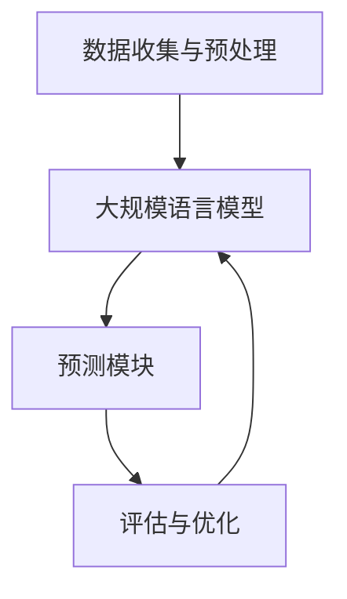

# 大规模语言模型在药物副作用预测中的应用

> 关键词：大规模语言模型、药物副作用预测、人工智能、医疗应用、自然语言处理、深度学习、生物医学信息

> 摘要：本文聚焦于大规模语言模型在药物副作用预测中的应用。首先介绍了相关背景，包括目的范围、预期读者等内容。接着阐述了核心概念与联系，分析了大规模语言模型和药物副作用预测的原理及架构。详细讲解了核心算法原理与具体操作步骤，结合Python代码进行阐述。通过数学模型和公式深入剖析，并举例说明。在项目实战部分，给出了开发环境搭建、源代码实现及解读。探讨了实际应用场景，推荐了学习、开发工具及相关论文著作。最后总结了未来发展趋势与挑战，提供常见问题解答和扩展阅读参考资料，旨在全面呈现大规模语言模型在药物副作用预测领域的重要作用和应用前景。

## 1. 背景介绍 
### 1.1 目的和范围
药物副作用预测在医疗领域具有至关重要的意义。准确预测药物副作用能够帮助医生在开处方时做出更明智的决策，减少药物不良反应对患者的伤害，提高治疗的安全性和有效性。本文章的目的在于深入探讨大规模语言模型在药物副作用预测中的应用，详细分析其原理、方法和实际效果。范围涵盖了从大规模语言模型的基本概念到药物副作用预测的具体实现，包括相关算法、数学模型、项目实战以及实际应用场景等方面。

### 1.2 预期读者
本文预期读者主要包括医疗领域的研究人员和从业者，他们可以通过了解大规模语言模型在药物副作用预测中的应用，为临床实践和研究提供新的思路和方法；计算机科学领域的专业人士，如人工智能专家、程序员、软件架构师等，能够从技术实现的角度深入研究和优化相关算法和模型；以及对医疗人工智能感兴趣的爱好者，帮助他们了解这一前沿领域的发展动态和应用价值。

### 1.3 文档结构概述
本文将按照以下结构进行阐述：首先介绍背景信息，包括目的、预期读者和文档结构概述等；接着讲解大规模语言模型和药物副作用预测的核心概念与联系，展示其原理和架构；然后详细介绍核心算法原理及具体操作步骤，通过Python代码进行说明；随后给出数学模型和公式，并举例解释；在项目实战部分，介绍开发环境搭建、源代码实现及解读；探讨实际应用场景；推荐相关的学习资源、开发工具和论文著作；最后总结未来发展趋势与挑战，提供常见问题解答和扩展阅读参考资料。

### 1.4 术语表
#### 1.4.1 核心术语定义
- **大规模语言模型**：是一种基于深度学习的自然语言处理模型，通过在大量文本数据上进行训练，学习语言的模式和规律，能够生成自然流畅的文本、进行文本分类、问答等多种自然语言处理任务。
- **药物副作用**：指药物在治疗疾病的同时，对机体产生的与治疗目的无关的作用，可能会对患者的健康造成不良影响。
- **药物副作用预测**：利用各种技术和方法，对药物可能产生的副作用进行预测和评估。

#### 1.4.2 相关概念解释
- **自然语言处理（NLP）**：是人工智能的一个重要领域，主要研究如何让计算机理解、处理和生成人类语言。大规模语言模型是自然语言处理中的一种重要技术。
- **深度学习**：是一种基于人工神经网络的机器学习方法，通过构建多层神经网络来学习数据的特征和模式，在图像识别、语音识别、自然语言处理等领域取得了显著的成果。

#### 1.4.3 缩略词列表
- **NLP**：自然语言处理（Natural Language Processing）
- **ML**：机器学习（Machine Learning）
- **DL**：深度学习（Deep Learning）

## 2. 核心概念与联系 
### 大规模语言模型原理
大规模语言模型通常基于Transformer架构，Transformer架构由编码器和解码器组成，其中自注意力机制是其核心。自注意力机制允许模型在处理输入序列时，动态地关注序列中不同位置的信息，从而捕捉到长距离的依赖关系。

以GPT（Generative Pretrained Transformer）系列模型为例，它是一种基于Transformer解码器的大规模语言模型。在预训练阶段，模型在大规模的无监督文本数据上进行训练，学习语言的通用模式和规律。在微调阶段，模型可以针对特定的任务进行调整，如文本分类、问答系统等。

### 药物副作用预测原理
药物副作用预测的核心是通过分析药物的各种信息，如化学结构、药理作用、临床实验数据等，来预测药物可能产生的副作用。传统的方法主要基于生物医学知识和统计分析，但是这些方法往往受到数据量和知识的限制。

而利用大规模语言模型进行药物副作用预测，是通过将药物相关的文本信息（如药物说明书、临床研究报告等）输入到模型中，让模型学习药物信息与副作用之间的关联。模型可以从文本中提取关键信息，如药物名称、剂量、适应症、副作用描述等，并进行分析和预测。

### 架构的文本示意图
大规模语言模型在药物副作用预测中的应用架构主要包括以下几个部分：
1. **数据收集与预处理**：收集药物相关的文本数据，如药物说明书、临床研究报告、电子病历等，并对数据进行清洗、标注和特征提取等预处理操作。
2. **大规模语言模型**：选择合适的大规模语言模型，如BERT、GPT等，并对其进行微调，使其适应药物副作用预测任务。
3. **预测模块**：将预处理后的数据输入到微调后的大规模语言模型中，模型输出药物可能产生的副作用预测结果。
4. **评估与优化**：对预测结果进行评估，根据评估结果对模型进行优化和调整，提高预测的准确性和可靠性。

### Mermaid流程图


## 3. 核心算法原理 & 具体操作步骤 
### 核心算法原理
在药物副作用预测中，我们可以使用基于大规模语言模型的文本分类算法。具体来说，将药物相关的文本信息作为输入，将副作用类别作为输出标签，通过训练模型来学习文本与副作用之间的映射关系。

以BERT（Bidirectional Encoder Representations from Transformers）模型为例，BERT是一种基于Transformer编码器的预训练语言模型。在预训练阶段，BERT通过掩码语言模型（Masked Language Model，MLM）和下一句预测（Next Sentence Prediction，NSP）两个任务来学习语言的表示。在微调阶段，我们可以在BERT模型的基础上添加一个全连接层，将其转换为一个文本分类模型。

### 具体操作步骤
1. **数据准备**：收集药物相关的文本数据，并将其划分为训练集、验证集和测试集。对数据进行清洗和标注，将副作用类别作为标签。
2. **模型加载**：加载预训练的BERT模型。
3. **模型微调**：在BERT模型的基础上添加一个全连接层，将其转换为一个文本分类模型。使用训练集对模型进行微调，优化模型的参数。
4. **模型评估**：使用验证集和测试集对微调后的模型进行评估，计算模型的准确率、召回率、F1值等指标。
5. **预测**：使用训练好的模型对新的药物文本信息进行预测，输出药物可能产生的副作用类别。

### Python源代码实现
```python
import torch
from torch.utils.data import Dataset, DataLoader
from transformers import BertTokenizer, BertForSequenceClassification, AdamW
from sklearn.model_selection import train_test_split
import pandas as pd

# 定义数据集类
class DrugSideEffectDataset(Dataset):
    def __init__(self, texts, labels, tokenizer, max_length):
        self.texts = texts
        self.labels = labels
        self.tokenizer = tokenizer
        self.max_length = max_length

    def __len__(self):
        return len(self.texts)

    def __getitem__(self, idx):
        text = str(self.texts[idx])
        label = self.labels[idx]
        encoding = self.tokenizer.encode_plus(
            text,
            add_special_tokens=True,
            max_length=self.max_length,
            padding='max_length',
            truncation=True,
            return_tensors='pt'
        )
        return {
            'input_ids': encoding['input_ids'].flatten(),
            'attention_mask': encoding['attention_mask'].flatten(),
            'labels': torch.tensor(label, dtype=torch.long)
        }

# 加载数据
data = pd.read_csv('drug_side_effect_data.csv')
texts = data['text'].tolist()
labels = data['label'].tolist()

# 划分数据集
train_texts, test_texts, train_labels, test_labels = train_test_split(texts, labels, test_size=0.2, random_state=42)
train_texts, val_texts, train_labels, val_labels = train_test_split(train_texts, train_labels, test_size=0.2, random_state=42)

# 加载tokenizer和模型
tokenizer = BertTokenizer.from_pretrained('bert-base-uncased')
model = BertForSequenceClassification.from_pretrained('bert-base-uncased', num_labels=len(set(labels)))

# 定义数据集和数据加载器
max_length = 128
train_dataset = DrugSideEffectDataset(train_texts, train_labels, tokenizer, max_length)
val_dataset = DrugSideEffectDataset(val_texts, val_labels, tokenizer, max_length)
test_dataset = DrugSideEffectDataset(test_texts, test_labels, tokenizer, max_length)

train_dataloader = DataLoader(train_dataset, batch_size=16, shuffle=True)
val_dataloader = DataLoader(val_dataset, batch_size=16, shuffle=False)
test_dataloader = DataLoader(test_dataset, batch_size=16, shuffle=False)

# 定义优化器和学习率调度器
optimizer = AdamW(model.parameters(), lr=2e-5)
total_steps = len(train_dataloader) * 3
scheduler = torch.optim.lr_scheduler.StepLR(optimizer, step_size=1, gamma=0.1)

# 训练模型
device = torch.device('cuda' if torch.cuda.is_available() else 'cpu')
model.to(device)

for epoch in range(3):
    model.train()
    total_loss = 0
    for batch in train_dataloader:
        input_ids = batch['input_ids'].to(device)
        attention_mask = batch['attention_mask'].to(device)
        labels = batch['labels'].to(device)

        model.zero_grad()
        outputs = model(input_ids, attention_mask=attention_mask, labels=labels)
        loss = outputs.loss
        total_loss += loss.item()
        loss.backward()
        optimizer.step()
    scheduler.step()
    print(f'Epoch {epoch + 1}, Loss: {total_loss / len(train_dataloader)}')

# 评估模型
model.eval()
correct_predictions = 0
total_predictions = 0
with torch.no_grad():
    for batch in test_dataloader:
        input_ids = batch['input_ids'].to(device)
        attention_mask = batch['attention_mask'].to(device)
        labels = batch['labels'].to(device)

        outputs = model(input_ids, attention_mask=attention_mask)
        logits = outputs.logits
        predictions = torch.argmax(logits, dim=1)
        correct_predictions += (predictions == labels).sum().item()
        total_predictions += labels.size(0)

accuracy = correct_predictions / total_predictions
print(f'Accuracy: {accuracy}')
```

## 4. 数学模型和公式 & 详细讲解 & 举例说明 
### 数学模型
在基于大规模语言模型的药物副作用预测中，我们可以将其看作一个文本分类问题。假设我们有一个大规模语言模型 $f(x)$，其中 $x$ 是输入的药物相关文本信息。模型的输出是一个概率分布 $p(y|x)$，表示输入文本 $x$ 属于各个副作用类别 $y$ 的概率。

### 公式
- **交叉熵损失函数**：在训练模型时，我们通常使用交叉熵损失函数来衡量模型预测结果与真实标签之间的差异。交叉熵损失函数的公式为：
$$L = -\frac{1}{N}\sum_{i=1}^{N}\sum_{j=1}^{C}y_{ij}\log(p_{ij})$$
其中 $N$ 是样本数量，$C$ 是类别数量，$y_{ij}$ 是第 $i$ 个样本的真实标签的第 $j$ 个分量（如果样本属于第 $j$ 类，则 $y_{ij}=1$，否则 $y_{ij}=0$），$p_{ij}$ 是模型预测第 $i$ 个样本属于第 $j$ 类的概率。

- **Softmax函数**：在模型的输出层，我们通常使用Softmax函数将模型的原始输出转换为概率分布。Softmax函数的公式为：
$$p_{ij}=\frac{e^{z_{ij}}}{\sum_{k=1}^{C}e^{z_{ik}}}$$
其中 $z_{ij}$ 是模型的原始输出的第 $j$ 个分量。

### 详细讲解
交叉熵损失函数的作用是最小化模型预测结果与真实标签之间的差异。当模型预测结果与真实标签越接近时，交叉熵损失函数的值越小。Softmax函数的作用是将模型的原始输出转换为概率分布，使得所有类别的概率之和为1。

### 举例说明
假设我们有一个药物副作用预测任务，有3个副作用类别：头痛、恶心、失眠。对于一个输入文本，模型的原始输出为 $z = [2, 1, 3]$。使用Softmax函数计算概率分布：
$$p_1=\frac{e^{2}}{e^{2}+e^{1}+e^{3}}\approx0.24$$
$$p_2=\frac{e^{1}}{e^{2}+e^{1}+e^{3}}\approx0.09$$
$$p_3=\frac{e^{3}}{e^{2}+e^{1}+e^{3}}\approx0.67$$
假设这个样本的真实标签为 $y = [0, 0, 1]$，则交叉熵损失为：
$$L = -\log(p_3)=-\log(0.67)\approx0.40$$

## 5. 项目实战：代码实际案例和详细解释说明 
### 5.1  开发环境搭建
1. **Python环境**：建议使用Python 3.7及以上版本。可以从Python官方网站（https://www.python.org/downloads/）下载并安装。
2. **深度学习框架**：使用PyTorch作为深度学习框架。可以通过以下命令安装：
```sh
pip install torch torchvision
```
3. **自然语言处理库**：使用Hugging Face的transformers库来加载和使用大规模语言模型。可以通过以下命令安装：
```sh
pip install transformers
```
4. **数据处理库**：使用pandas和sklearn库进行数据处理和划分。可以通过以下命令安装：
```sh
pip install pandas scikit-learn
```

### 5.2  源代码详细实现和代码解读
#### 数据集类定义
```python
class DrugSideEffectDataset(Dataset):
    def __init__(self, texts, labels, tokenizer, max_length):
        self.texts = texts
        self.labels = labels
        self.tokenizer = tokenizer
        self.max_length = max_length

    def __len__(self):
        return len(self.texts)

    def __getitem__(self, idx):
        text = str(self.texts[idx])
        label = self.labels[idx]
        encoding = self.tokenizer.encode_plus(
            text,
            add_special_tokens=True,
            max_length=self.max_length,
            padding='max_length',
            truncation=True,
            return_tensors='pt'
        )
        return {
            'input_ids': encoding['input_ids'].flatten(),
            'attention_mask': encoding['attention_mask'].flatten(),
            'labels': torch.tensor(label, dtype=torch.long)
        }
```
解读：定义了一个自定义的数据集类 `DrugSideEffectDataset`，用于处理药物副作用预测的数据。`__init__` 方法初始化数据集的文本、标签、tokenizer和最大长度。`__len__` 方法返回数据集的长度。`__getitem__` 方法根据索引返回一个样本，包括输入ID、注意力掩码和标签。

#### 数据加载和划分
```python
data = pd.read_csv('drug_side_effect_data.csv')
texts = data['text'].tolist()
labels = data['label'].tolist()

train_texts, test_texts, train_labels, test_labels = train_test_split(texts, labels, test_size=0.2, random_state=42)
train_texts, val_texts, train_labels, val_labels = train_test_split(train_texts, train_labels, test_size=0.2, random_state=42)
```
解读：使用pandas库读取包含药物副作用数据的CSV文件，将文本和标签分别存储在列表中。使用sklearn库的 `train_test_split` 函数将数据划分为训练集、验证集和测试集。

#### 加载tokenizer和模型
```python
tokenizer = BertTokenizer.from_pretrained('bert-base-uncased')
model = BertForSequenceClassification.from_pretrained('bert-base-uncased', num_labels=len(set(labels)))
```
解读：使用Hugging Face的transformers库加载预训练的BERT tokenizer和BERT文本分类模型。`num_labels` 参数指定了分类的类别数量。

#### 定义数据集和数据加载器
```python
max_length = 128
train_dataset = DrugSideEffectDataset(train_texts, train_labels, tokenizer, max_length)
val_dataset = DrugSideEffectDataset(val_texts, val_labels, tokenizer, max_length)
test_dataset = DrugSideEffectDataset(test_texts, test_labels, tokenizer, max_length)

train_dataloader = DataLoader(train_dataset, batch_size=16, shuffle=True)
val_dataloader = DataLoader(val_dataset, batch_size=16, shuffle=False)
test_dataloader = DataLoader(test_dataset, batch_size=16, shuffle=False)
```
解读：创建数据集对象，并使用PyTorch的 `DataLoader` 类将数据集转换为可迭代的数据加载器。`batch_size` 参数指定了每个批次的样本数量，`shuffle` 参数指定了是否对数据进行洗牌。

#### 定义优化器和学习率调度器
```python
optimizer = AdamW(model.parameters(), lr=2e-5)
total_steps = len(train_dataloader) * 3
scheduler = torch.optim.lr_scheduler.StepLR(optimizer, step_size=1, gamma=0.1)
```
解读：使用AdamW优化器来更新模型的参数，学习率设置为 $2\times10^{-5}$。使用 `StepLR` 学习率调度器，每训练一个epoch，学习率乘以0.1。

#### 训练模型
```python
device = torch.device('cuda' if torch.cuda.is_available() else 'cpu')
model.to(device)

for epoch in range(3):
    model.train()
    total_loss = 0
    for batch in train_dataloader:
        input_ids = batch['input_ids'].to(device)
        attention_mask = batch['attention_mask'].to(device)
        labels = batch['labels'].to(device)

        model.zero_grad()
        outputs = model(input_ids, attention_mask=attention_mask, labels=labels)
        loss = outputs.loss
        total_loss += loss.item()
        loss.backward()
        optimizer.step()
    scheduler.step()
    print(f'Epoch {epoch + 1}, Loss: {total_loss / len(train_dataloader)}')
```
解读：将模型移动到GPU（如果可用）上进行训练。使用一个循环进行3个epoch的训练。在每个epoch中，将模型设置为训练模式，遍历训练数据加载器，计算损失并进行反向传播和参数更新。最后，更新学习率并打印当前epoch的平均损失。

#### 评估模型
```python
model.eval()
correct_predictions = 0
total_predictions = 0
with torch.no_grad():
    for batch in test_dataloader:
        input_ids = batch['input_ids'].to(device)
        attention_mask = batch['attention_mask'].to(device)
        labels = batch['labels'].to(device)

        outputs = model(input_ids, attention_mask=attention_mask)
        logits = outputs.logits
        predictions = torch.argmax(logits, dim=1)
        correct_predictions += (predictions == labels).sum().item()
        total_predictions += labels.size(0)

accuracy = correct_predictions / total_predictions
print(f'Accuracy: {accuracy}')
```
解读：将模型设置为评估模式，遍历测试数据加载器，计算模型的预测结果并统计正确预测的数量。最后，计算准确率并打印结果。

### 5.3  代码解读与分析
通过上述代码，我们实现了一个基于BERT模型的药物副作用预测系统。代码的主要步骤包括数据准备、模型加载、模型微调、模型评估等。在数据准备阶段，我们将药物相关的文本数据和标签进行了划分和处理。在模型加载阶段，我们加载了预训练的BERT模型和tokenizer。在模型微调阶段，我们使用训练数据对模型进行了微调，优化了模型的参数。在模型评估阶段，我们使用测试数据对模型进行了评估，计算了模型的准确率。

代码的优点是使用了预训练的BERT模型，能够利用大规模语言模型的强大语言理解能力，提高预测的准确性。同时，代码使用了PyTorch和Hugging Face的transformers库，使得模型的实现和训练更加方便和高效。

代码的不足之处在于可能存在过拟合的问题，可以通过增加数据量、调整模型参数、使用正则化等方法来解决。另外，代码只使用了文本信息，没有考虑药物的化学结构、药理作用等其他信息，可以进一步结合多模态信息来提高预测的性能。

## 6. 实际应用场景 
### 临床决策支持
在临床实践中，医生在开处方时需要考虑药物的副作用。大规模语言模型可以帮助医生快速预测药物可能产生的副作用，为医生提供决策支持。例如，当医生考虑给患者使用某种药物时，可以输入药物的相关信息，模型可以输出该药物可能产生的副作用列表，医生可以根据这些信息来决定是否使用该药物或调整药物的剂量。

### 药物研发
在药物研发过程中，需要对药物的安全性进行评估。大规模语言模型可以通过分析大量的临床研究报告和文献，预测药物在不同人群中的副作用情况。这有助于研发人员在药物研发的早期阶段发现潜在的安全问题，优化药物的设计和研发方案。

### 药物警戒
药物警戒是指对药物不良反应的监测和评估。大规模语言模型可以实时监测社交媒体、电子病历等数据源，及时发现药物的不良反应信号。例如，当大量患者在社交媒体上报告某种药物的副作用时，模型可以快速识别这些信息，并将其反馈给相关部门，以便及时采取措施。

### 患者教育
大规模语言模型可以为患者提供药物副作用的相关信息，帮助患者更好地了解药物的风险和注意事项。例如，患者可以通过在线咨询平台向模型询问某种药物的副作用，模型可以以通俗易懂的语言回答患者的问题，提高患者的用药依从性和安全性。

## 7. 工具和资源推荐
### 7.1 学习资源推荐
#### 7.1.1 书籍推荐
- 《深度学习》（Deep Learning）：由Ian Goodfellow、Yoshua Bengio和Aaron Courville撰写，是深度学习领域的经典教材，介绍了深度学习的基本原理、算法和应用。
- 《自然语言处理入门》（Natural Language Processing with Python）：由Steven Bird、Ewan Klein和Edward Loper撰写，介绍了自然语言处理的基本概念、方法和工具，使用Python语言进行实现。
- 《医疗人工智能》（Artificial Intelligence in Medicine）：由Mark S. Squillante和Jeremy M. Wolfe撰写，介绍了人工智能在医疗领域的应用，包括疾病诊断、药物研发、医疗影像分析等方面。

#### 7.1.2 在线课程
- Coursera上的“深度学习专项课程”（Deep Learning Specialization）：由Andrew Ng教授讲授，包括深度学习的基础知识、卷积神经网络、循环神经网络等内容。
- edX上的“自然语言处理”（Natural Language Processing）：由Columbia University开设，介绍了自然语言处理的基本概念、方法和技术。
- Kaggle上的“医疗数据科学”（Medical Data Science）：提供了医疗数据科学的实践案例和教程，帮助学习者掌握医疗数据的处理和分析方法。

#### 7.1.3 技术博客和网站
- Hugging Face博客（https://huggingface.co/blog）：提供了关于大规模语言模型的最新研究成果、技术文章和实践案例。
- arXiv.org（https://arxiv.org/）：是一个开放获取的学术预印本平台，包含了大量的人工智能、机器学习、自然语言处理等领域的研究论文。
- Towards Data Science（https://towardsdatascience.com/）：是一个数据科学和人工智能领域的技术博客，提供了许多高质量的技术文章和教程。

### 7.2 开发工具框架推荐
#### 7.2.1 IDE和编辑器
- PyCharm：是一款专门为Python开发设计的集成开发环境（IDE），提供了代码编辑、调试、版本控制等功能，方便开发者进行Python项目的开发。
- Jupyter Notebook：是一个交互式的开发环境，支持Python、R等多种编程语言。可以在浏览器中编写和运行代码，方便进行数据探索和模型调试。
- Visual Studio Code：是一款轻量级的代码编辑器，支持多种编程语言和插件。可以通过安装Python插件来进行Python项目的开发。

#### 7.2.2 调试和性能分析工具
- PyTorch Profiler：是PyTorch自带的性能分析工具，可以帮助开发者分析模型的性能瓶颈，优化模型的训练和推理速度。
- TensorBoard：是TensorFlow自带的可视化工具，也可以与PyTorch结合使用。可以用于可视化模型的训练过程、损失曲线、准确率等指标。
- cProfile：是Python标准库中的性能分析工具，可以帮助开发者分析Python代码的性能瓶颈，找出运行时间较长的函数和代码段。

#### 7.2.3 相关框架和库
- PyTorch：是一个开源的深度学习框架，提供了丰富的深度学习模型和工具，支持GPU加速。
- Hugging Face transformers：是一个开源的自然语言处理库，提供了多种预训练的语言模型，如BERT、GPT等，方便开发者进行自然语言处理任务的开发。
- scikit-learn：是一个开源的机器学习库，提供了多种机器学习算法和工具，如分类、回归、聚类等，方便开发者进行机器学习任务的开发。

### 7.3 相关论文著作推荐
#### 7.3.1 经典论文
- “Attention Is All You Need”：介绍了Transformer架构，是大规模语言模型的基础。
- “BERT: Pre-training of Deep Bidirectional Transformers for Language Understanding”：介绍了BERT模型，是自然语言处理领域的重要突破。
- “Drug Repurposing Using Deep Learning and Electronic Health Records”：介绍了如何使用深度学习和电子病历数据进行药物再利用。

#### 7.3.2 最新研究成果
- 关注顶级学术会议，如NeurIPS、ICML、ACL等，这些会议上会发表关于大规模语言模型和药物副作用预测的最新研究成果。
- 关注相关领域的学术期刊，如Journal of the American Medical Informatics Association（JAMIA）、Artificial Intelligence in Medicine等。

#### 7.3.3 应用案例分析
- 可以参考一些实际应用案例，如IBM Watson for Drug Discovery、Google DeepMind's AlphaFold等，了解大规模语言模型在药物研发和医疗领域的应用实践。

## 8. 总结：未来发展趋势与挑战
### 未来发展趋势
1. **多模态融合**：未来的药物副作用预测系统将不仅仅依赖于文本信息，还会结合药物的化学结构、药理作用、医疗影像等多模态信息，提高预测的准确性和可靠性。
2. **个性化预测**：考虑到不同患者的基因、生理状态、生活习惯等因素的差异，未来的系统将能够实现个性化的药物副作用预测，为每个患者提供更加精准的用药建议。
3. **与临床实践的深度融合**：大规模语言模型将与临床信息系统、电子病历系统等深度融合，实现实时的药物副作用监测和预警，为临床决策提供更加及时和有效的支持。
4. **跨学科合作**：药物副作用预测涉及到计算机科学、医学、生物学等多个学科领域，未来将需要更多的跨学科合作，共同推动该领域的发展。

### 挑战
1. **数据质量和隐私问题**：药物相关的数据通常包含患者的敏感信息，需要严格保护数据的隐私和安全。同时，数据的质量也会影响模型的性能，需要对数据进行清洗、标注和验证。
2. **模型可解释性**：大规模语言模型通常是黑盒模型，其预测结果的可解释性较差。在医疗领域，医生和患者需要了解模型预测的依据，因此提高模型的可解释性是一个重要的挑战。
3. **计算资源和效率**：训练和部署大规模语言模型需要大量的计算资源和时间，如何提高模型的训练和推理效率，降低计算成本，是一个需要解决的问题。
4. **伦理和法律问题**：大规模语言模型在药物副作用预测中的应用可能会带来一些伦理和法律问题，如责任界定、医疗事故纠纷等，需要建立相应的伦理和法律规范。

## 9. 附录：常见问题与解答
### 1. 大规模语言模型在药物副作用预测中的准确率有多高？
大规模语言模型在药物副作用预测中的准确率受到多种因素的影响，如数据质量、模型选择、特征工程等。目前的研究表明，大规模语言模型在药物副作用预测中能够取得较好的效果，但具体的准确率还需要根据实际情况进行评估。

### 2. 如何选择合适的大规模语言模型？
选择合适的大规模语言模型需要考虑多个因素，如任务类型、数据规模、计算资源等。对于药物副作用预测任务，可以选择预训练的语言模型，如BERT、GPT等，并根据实际情况进行微调。

### 3. 大规模语言模型在药物副作用预测中需要多少数据？
大规模语言模型在药物副作用预测中需要大量的数据来进行训练。数据的规模和质量会影响模型的性能，一般来说，数据量越大，模型的性能越好。具体需要多少数据，需要根据实际情况进行实验和评估。

### 4. 如何解决大规模语言模型的可解释性问题？
解决大规模语言模型的可解释性问题是一个研究热点。目前的方法包括特征重要性分析、决策树解释、注意力机制可视化等。这些方法可以帮助我们理解模型的决策过程，提高模型的可解释性。

### 5. 大规模语言模型在药物副作用预测中的应用是否会取代医生的决策？
大规模语言模型在药物副作用预测中的应用不会取代医生的决策，而是为医生提供决策支持。医生在临床实践中需要综合考虑患者的病情、身体状况、药物副作用等多个因素，做出最终的决策。

## 10. 扩展阅读 & 参考资料
### 扩展阅读
- 关注相关领域的学术会议和期刊，了解最新的研究动态和发展趋势。
- 参与相关的技术社区和论坛，与其他研究者和开发者交流经验和心得。
- 阅读相关的技术博客和文章，学习最新的技术和方法。

### 参考资料
1. Goodfellow, I., Bengio, Y., & Courville, A. (2016). Deep Learning. MIT Press.
2. Bird, S., Klein, E., & Loper, E. (2009). Natural Language Processing with Python. O'Reilly Media.
3. Devlin, J., Chang, M. W., Lee, K., & Toutanova, K. (2018). BERT: Pre-training of Deep Bidirectional Transformers for Language Understanding. arXiv preprint arXiv:1810.04805.
4. Vaswani, A., Shazeer, N., Parmar, N., Uszkoreit, J., Jones, L., Gomez, A. N., ... & Polosukhin, I. (2017). Attention Is All You Need. In Advances in neural information processing systems (pp. 5998-6008).
5. Hugging Face官方文档（https://huggingface.co/docs）
6. PyTorch官方文档（https://pytorch.org/docs/stable/index.html）
7. scikit-learn官方文档（https://scikit-learn.org/stable/documentation.html）