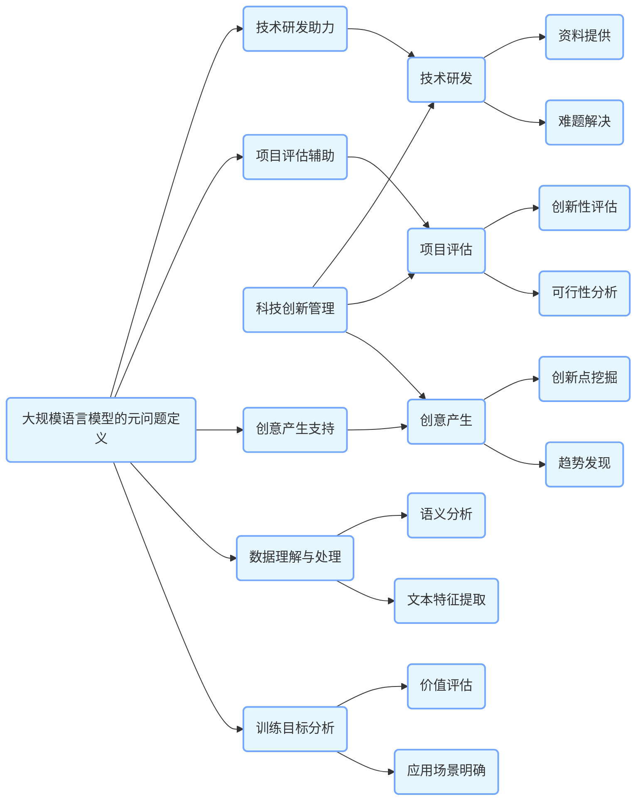

# 大规模语言模型的元问题定义在科技创新管理中的实践应用

> 关键词：大规模语言模型、元问题定义、科技创新管理、实践应用、技术创新

> 摘要：本文聚焦于大规模语言模型的元问题定义在科技创新管理中的实践应用。首先阐述了相关的背景知识，包括目的范围、预期读者等。接着深入探讨了大规模语言模型元问题定义的核心概念与联系，详细讲解了核心算法原理和具体操作步骤，借助数学模型和公式进行了理论支撑。通过项目实战，展示了代码实际案例并进行详细解释。分析了其在实际中的应用场景，推荐了相关的工具和资源。最后总结了未来发展趋势与挑战，还提供了常见问题解答和扩展阅读参考资料，旨在全面深入地剖析大规模语言模型的元问题定义在科技创新管理领域的重要价值和实践意义。

## 1. 背景介绍 
### 1.1 目的和范围
在当今科技飞速发展的时代，大规模语言模型（Large Language Model, LLM）如GPT - 3、GPT - 4、文心一言等取得了令人瞩目的成就。这些模型在自然语言处理、知识问答、文本生成等多个领域展现出强大的能力。然而，对于科技创新管理而言，如何有效利用大规模语言模型的元问题定义来推动科技创新的高效管理，是一个具有重要现实意义的课题。

本文的目的在于深入探讨大规模语言模型的元问题定义在科技创新管理中的具体实践应用。范围涵盖从大规模语言模型元问题定义的理论基础，到其在科技创新管理各个环节（如创意生成、项目评估、技术预测等）的实际应用，以及相关的技术实现和未来发展趋势等方面。

### 1.2 预期读者
本文预期读者包括科技创新管理领域的专业人士，如企业的技术管理者、研发部门负责人、科技政策制定者等，他们可以从本文中获取关于如何利用大规模语言模型优化科技创新管理流程的方法和思路。同时，自然语言处理和人工智能领域的研究人员和开发者也能从中了解大规模语言模型在科技创新管理场景下的新应用，为进一步的研究和开发提供参考。此外，对科技创新和人工智能发展感兴趣的普通读者也可以通过本文了解相关领域的前沿动态和应用实践。

### 1.3 文档结构概述
本文首先介绍背景知识，包括目的范围、预期读者和文档结构概述等内容，让读者对文章的整体框架有初步了解。接着深入探讨大规模语言模型的元问题定义的核心概念与联系，通过文本示意图和Mermaid流程图进行清晰展示。然后详细讲解核心算法原理和具体操作步骤，并结合Python源代码进行阐述。之后借助数学模型和公式对相关理论进行详细讲解和举例说明。通过项目实战部分，展示代码实际案例并进行详细解释和分析。分析大规模语言模型的元问题定义在实际中的应用场景，为读者呈现其实际价值。推荐相关的工具和资源，包括学习资源、开发工具框架和相关论文著作等。最后总结未来发展趋势与挑战，提供常见问题解答和扩展阅读参考资料，使读者对整个主题有全面深入的认识。

### 1.4 术语表
#### 1.4.1 核心术语定义
- **大规模语言模型（Large Language Model, LLM）**：基于深度学习技术，通过在大规模文本数据上进行训练，能够学习到语言的统计规律和语义信息，从而具备强大的语言理解和生成能力的模型。例如GPT系列模型、BERT模型等。
- **元问题定义**：指对问题的本质、来源、范围、目标等进行深入分析和明确界定的过程。在大规模语言模型的语境下，元问题定义涉及到对模型训练、应用过程中核心问题的抽象和精准定义。
- **科技创新管理**：对科技创新活动进行规划、组织、协调、控制等一系列活动的过程，旨在提高科技创新的效率和效果，实现科技创新的目标。

#### 1.4.2 相关概念解释
- **自然语言处理（Natural Language Processing, NLP）**：是人工智能领域的一个重要分支，主要研究如何让计算机理解、处理和生成人类语言。大规模语言模型是自然语言处理领域的重要技术成果之一。
- **机器学习（Machine Learning）**：是一门多领域交叉学科，涉及概率论、统计学、逼近论、凸分析、算法复杂度理论等多门学科。它专门研究计算机怎样模拟或实现人类的学习行为，以获取新的知识或技能，重新组织已有的知识结构使之不断改善自身的性能。大规模语言模型通常基于机器学习中的深度学习技术进行训练。

#### 1.4.3 缩略词列表
- **LLM**：Large Language Model（大规模语言模型）
- **NLP**：Natural Language Processing（自然语言处理）
- **ML**：Machine Learning（机器学习）

## 2. 核心概念与联系 

### 大规模语言模型的元问题定义核心概念
大规模语言模型的元问题定义是一个复杂而关键的概念。它首先涉及到对语言模型训练目标的深入理解。语言模型的训练通常是为了在给定输入文本的情况下，预测下一个可能的词或字符。但从元问题定义的角度来看，我们需要思考为什么要进行这样的预测，其背后的应用场景和价值是什么。

例如，在智能客服场景中，语言模型的训练目标可能是准确理解用户的问题并提供合适的回答。那么元问题定义就需要明确用户问题的类型、回答的准确性标准、如何处理模糊问题等。

### 科技创新管理的核心概念
科技创新管理是一个系统性的过程，包括创意的产生、项目的评估与选择、资源的分配、技术的研发与推广等多个环节。其核心目标是通过有效的管理手段，提高科技创新的效率和成功率，实现科技成果的转化和应用。

### 两者的联系
大规模语言模型的元问题定义可以为科技创新管理提供强大的支持。在创意产生阶段，通过对大规模文本数据的分析和理解，语言模型可以帮助发现新的创意和技术趋势。例如，分析学术论文、专利文献等，挖掘潜在的研究方向和创新点。

在项目评估环节，语言模型可以对项目的可行性、创新性、市场前景等进行评估。通过对相关文本信息的处理和分析，提取关键信息，为决策提供依据。

在技术研发过程中，语言模型可以辅助解决技术难题，提供相关的技术资料和解决方案。例如，根据输入的技术问题，生成相关的代码示例、算法思路等。

### 文本示意图
```plaintext
大规模语言模型的元问题定义
|-- 训练目标分析
|   |-- 应用场景明确
|   |-- 价值评估
|-- 数据理解与处理
|   |-- 文本特征提取
|   |-- 语义分析
|
科技创新管理
|-- 创意产生
|   |-- 趋势发现
|   |-- 创新点挖掘
|-- 项目评估
|   |-- 可行性分析
|   |-- 创新性评估
|-- 技术研发
|   |-- 难题解决
|   |-- 资料提供
|
联系
|-- 创意产生支持
|-- 项目评估辅助
|-- 技术研发助力
```

### Mermaid流程图


## 3. 核心算法原理 & 具体操作步骤 

### 核心算法原理
大规模语言模型通常基于Transformer架构，以GPT（Generative Pretrained Transformer）系列模型为例，其核心算法原理包括预训练和微调两个阶段。

#### 预训练阶段
预训练阶段使用无监督学习的方法，在大规模文本数据上进行训练。模型的目标是预测文本中的下一个词，通过最大化预测的概率来学习语言的统计规律和语义信息。

具体来说，Transformer架构由多个编码器和解码器层组成。编码器负责对输入文本进行特征提取和表示，解码器则根据编码器的输出进行预测。在预训练过程中，模型不断调整自身的参数，使得预测结果与真实文本的差异最小化。

#### 微调阶段
微调阶段是在预训练模型的基础上，针对特定的任务进行有监督学习。例如，在科技创新管理中的项目评估任务中，我们可以收集相关的项目数据，包括项目描述、评估结果等，作为训练数据。模型在这些数据上进行微调，以适应特定任务的需求。

### Python源代码详细阐述
以下是一个简单的基于Hugging Face Transformers库的示例代码，展示了如何使用预训练的语言模型进行文本分类任务，模拟科技创新管理中的项目评估任务。

```python
from transformers import AutoTokenizer, AutoModelForSequenceClassification
import torch

# 加载预训练的语言模型和分词器
model_name = "distilbert-base-uncased-finetuned-sst-2-english"
tokenizer = AutoTokenizer.from_pretrained(model_name)
model = AutoModelForSequenceClassification.from_pretrained(model_name)

# 示例项目描述
project_description = "This is a highly innovative project with great market potential."

# 对项目描述进行分词
inputs = tokenizer(project_description, return_tensors="pt")

# 进行预测
with torch.no_grad():
    logits = model(**inputs).logits

# 获取预测结果
predicted_class_id = logits.argmax().item()
label = model.config.id2label[predicted_class_id]

print(f"Predicted label: {label}")
```

### 具体操作步骤
1. **数据收集**：收集与科技创新管理任务相关的数据，如项目描述、创意文案、技术文档等。对于有监督学习任务，还需要标注相应的标签，如项目的可行性等级、创意的创新性评分等。
2. **数据预处理**：对收集到的数据进行清洗、分词、标注等预处理操作。例如，去除文本中的噪声字符，将文本转换为模型可以处理的格式。
3. **模型选择**：根据任务的需求和数据的特点，选择合适的预训练语言模型。例如，如果任务涉及到中文文本处理，可以选择中文预训练模型，如ERNIE、BERT - Chinese等。
4. **模型微调**：使用预处理后的数据对预训练模型进行微调。在微调过程中，需要设置合适的超参数，如学习率、批次大小、训练轮数等。
5. **模型评估**：使用测试数据对微调后的模型进行评估，计算模型的准确率、召回率、F1值等指标，评估模型的性能。
6. **模型部署**：将评估合格的模型部署到实际的应用环境中，如Web服务、移动应用等，实现大规模语言模型在科技创新管理中的实际应用。

## 4. 数学模型和公式 & 详细讲解 & 举例说明 

### 预训练阶段的数学模型和公式
在预训练阶段，大规模语言模型通常使用自回归语言模型（Autoregressive Language Model）进行训练。自回归语言模型的目标是根据前面的词预测下一个词的概率。

设输入文本为 $x = [x_1, x_2, \cdots, x_T]$，其中 $x_t$ 表示第 $t$ 个词。自回归语言模型的目标是最大化以下概率：

$$
P(x) = \prod_{t=1}^{T} P(x_t | x_1, x_2, \cdots, x_{t-1})
$$

为了计算这个概率，通常使用神经网络模型来估计条件概率 $P(x_t | x_1, x_2, \cdots, x_{t-1})$。以Transformer架构为例，模型的输出是一个概率分布，表示每个词作为下一个词的概率。

设模型的输出为 $\hat{y}_t$，其中 $\hat{y}_{t,i}$ 表示第 $t$ 个位置预测为第 $i$ 个词的概率。则条件概率可以表示为：

$$
P(x_t | x_1, x_2, \cdots, x_{t-1}) = \hat{y}_{t, x_t}
$$

为了训练模型，通常使用交叉熵损失函数来最小化预测概率与真实概率之间的差异。交叉熵损失函数的定义如下：

$$
L = - \sum_{t=1}^{T} \log P(x_t | x_1, x_2, \cdots, x_{t-1})
$$

### 微调阶段的数学模型和公式
在微调阶段，对于分类任务，通常使用交叉熵损失函数来训练模型。设输入样本为 $(x, y)$，其中 $x$ 是输入文本，$y$ 是对应的标签。模型的输出是一个概率分布 $\hat{y}$，表示每个类别的概率。

交叉熵损失函数的定义如下：

$$
L = - \sum_{i=1}^{C} y_i \log \hat{y}_i
$$

其中 $C$ 是类别的数量，$y_i$ 是真实标签的第 $i$ 个分量（通常是一个one - hot向量），$\hat{y}_i$ 是模型预测的第 $i$ 个类别的概率。

### 举例说明
假设我们有一个二分类任务，判断项目是否具有创新性。我们有一个项目描述 $x$，真实标签 $y = [0, 1]$ 表示该项目具有创新性。模型的输出 $\hat{y} = [0.2, 0.8]$ 表示模型预测该项目不具有创新性的概率为 $0.2$，具有创新性的概率为 $0.8$。

则交叉熵损失函数的值为：

$$
L = - (0 \times \log 0.2 + 1 \times \log 0.8) \approx 0.223
$$

在训练过程中，模型会不断调整自身的参数，使得交叉熵损失函数的值最小化，从而提高模型的分类准确率。

## 5. 项目实战：代码实际案例和详细解释说明 

### 5.1  开发环境搭建
#### 安装Python
首先，确保你已经安装了Python 3.6或更高版本。你可以从Python官方网站（https://www.python.org/downloads/）下载并安装Python。

#### 安装必要的库
使用pip命令安装必要的库，包括Hugging Face Transformers库、PyTorch等。

```bash
pip install transformers torch
```

### 5.2  源代码详细实现和代码解读
以下是一个完整的项目实战代码示例，用于对科技创新项目进行创新性评估。

```python
import torch
from torch.utils.data import Dataset, DataLoader
from transformers import AutoTokenizer, AutoModelForSequenceClassification, AdamW
from sklearn.model_selection import train_test_split
import pandas as pd

# 定义数据集类
class InnovationDataset(Dataset):
    def __init__(self, texts, labels, tokenizer, max_length):
        self.texts = texts
        self.labels = labels
        self.tokenizer = tokenizer
        self.max_length = max_length

    def __len__(self):
        return len(self.texts)

    def __getitem__(self, idx):
        text = self.texts[idx]
        label = self.labels[idx]
        encoding = self.tokenizer(text, return_tensors='pt', padding='max_length', truncation=True, max_length=self.max_length)
        return {
            'input_ids': encoding['input_ids'].flatten(),
            'attention_mask': encoding['attention_mask'].flatten(),
            'labels': torch.tensor(label, dtype=torch.long)
        }

# 加载数据
data = pd.read_csv('innovation_projects.csv')
texts = data['project_description'].tolist()
labels = data['innovation_label'].tolist()

# 划分训练集和测试集
train_texts, test_texts, train_labels, test_labels = train_test_split(texts, labels, test_size=0.2, random_state=42)

# 加载预训练的语言模型和分词器
model_name = "distilbert-base-uncased"
tokenizer = AutoTokenizer.from_pretrained(model_name)
model = AutoModelForSequenceClassification.from_pretrained(model_name, num_labels=2)

# 创建数据集和数据加载器
max_length = 128
train_dataset = InnovationDataset(train_texts, train_labels, tokenizer, max_length)
test_dataset = InnovationDataset(test_texts, test_labels, tokenizer, max_length)

train_dataloader = DataLoader(train_dataset, batch_size=16, shuffle=True)
test_dataloader = DataLoader(test_dataset, batch_size=16, shuffle=False)

# 定义优化器和训练参数
optimizer = AdamW(model.parameters(), lr=2e-5)
device = torch.device('cuda' if torch.cuda.is_available() else 'cpu')
model.to(device)

# 训练模型
num_epochs = 3
for epoch in range(num_epochs):
    model.train()
    total_loss = 0
    for batch in train_dataloader:
        input_ids = batch['input_ids'].to(device)
        attention_mask = batch['attention_mask'].to(device)
        labels = batch['labels'].to(device)

        model.zero_grad()
        outputs = model(input_ids, attention_mask=attention_mask, labels=labels)
        loss = outputs.loss
        loss.backward()
        optimizer.step()
        total_loss += loss.item()

    print(f'Epoch {epoch + 1}, Loss: {total_loss / len(train_dataloader)}')

# 评估模型
model.eval()
correct_predictions = 0
total_predictions = 0
with torch.no_grad():
    for batch in test_dataloader:
        input_ids = batch['input_ids'].to(device)
        attention_mask = batch['attention_mask'].to(device)
        labels = batch['labels'].to(device)

        outputs = model(input_ids, attention_mask=attention_mask)
        logits = outputs.logits
        predictions = torch.argmax(logits, dim=1)
        correct_predictions += (predictions == labels).sum().item()
        total_predictions += labels.size(0)

accuracy = correct_predictions / total_predictions
print(f'Test Accuracy: {accuracy}')
```

### 5.3  代码解读与分析
1. **数据集类定义**：`InnovationDataset` 类继承自 `torch.utils.data.Dataset`，用于封装数据集。在 `__getitem__` 方法中，对输入文本进行分词处理，并返回输入ID、注意力掩码和标签。
2. **数据加载**：使用 `pandas` 库读取CSV文件中的数据，并将文本和标签分别存储在列表中。然后使用 `sklearn.model_selection.train_test_split` 函数将数据划分为训练集和测试集。
3. **模型加载**：使用 `AutoTokenizer` 和 `AutoModelForSequenceClassification` 从Hugging Face模型库中加载预训练的语言模型和分词器。
4. **数据集和数据加载器创建**：创建 `InnovationDataset` 实例，并使用 `DataLoader` 对数据集进行批量处理。
5. **优化器和训练参数设置**：使用 `AdamW` 优化器，并将模型移动到GPU（如果可用）上进行训练。
6. **模型训练**：在每个训练周期中，将模型设置为训练模式，遍历训练数据加载器，计算损失并进行反向传播和参数更新。
7. **模型评估**：将模型设置为评估模式，遍历测试数据加载器，计算预测结果和准确率。

通过这个项目实战，我们可以看到如何使用大规模语言模型对科技创新项目进行创新性评估，实现了大规模语言模型在科技创新管理中的具体应用。

## 6. 实际应用场景 

### 创意生成与筛选
在科技创新管理中，创意的产生是至关重要的。大规模语言模型可以通过对大量文本数据的分析和理解，帮助生成新的创意。例如，分析行业报告、学术论文、专利文献等，挖掘潜在的研究方向和创新点。同时，语言模型可以对生成的创意进行筛选和评估，判断其可行性和创新性。

### 项目评估与选择
大规模语言模型可以辅助对科技创新项目进行评估和选择。通过对项目描述、技术方案、市场分析等文本信息的处理和分析，提取关键信息，评估项目的可行性、创新性、市场前景等。例如，判断项目是否符合公司的战略目标，是否具有技术优势，是否有市场需求等。

### 技术预测与趋势分析
语言模型可以通过对大量的技术文献、新闻报道等文本数据的分析，预测技术发展的趋势。例如，分析人工智能、生物技术、新能源等领域的研究动态，预测未来可能出现的技术突破和发展方向。这有助于企业和科研机构提前布局，抓住技术发展的机遇。

### 知识管理与共享
在科技创新管理中，知识的管理和共享是提高创新效率的关键。大规模语言模型可以帮助构建知识图谱，对企业内部的技术文档、专利、研究报告等知识资源进行整合和管理。同时，语言模型可以提供智能搜索和问答功能，帮助员工快速获取所需的知识和信息。

### 智能客服与技术支持
在科技创新项目的实施过程中，可能会遇到各种技术问题和咨询需求。大规模语言模型可以作为智能客服，为用户提供实时的技术支持和解决方案。例如，根据用户的问题，生成相关的代码示例、算法思路、故障排除方法等。

## 7. 工具和资源推荐
### 7.1 学习资源推荐
#### 7.1.1 书籍推荐
- 《深度学习》（Deep Learning）：由Ian Goodfellow、Yoshua Bengio和Aaron Courville合著，是深度学习领域的经典教材，全面介绍了深度学习的基本原理、算法和应用。
- 《自然语言处理入门》（Natural Language Processing with Python）：由Steven Bird、Ewan Klein和Edward Loper合著，通过Python语言介绍自然语言处理的基本技术和方法。
- 《Python自然语言处理实战：核心技术与算法》：由何晗著，结合实际案例，详细介绍了Python在自然语言处理中的应用。

#### 7.1.2 在线课程
- Coursera上的“深度学习专项课程”（Deep Learning Specialization）：由Andrew Ng教授授课，系统介绍了深度学习的理论和实践。
- edX上的“自然语言处理基础”（Foundations of Natural Language Processing）：由宾夕法尼亚大学的Mark Dredze教授授课，深入讲解自然语言处理的基本概念和算法。
- 中国大学MOOC上的“人工智能基础”：由北京大学的林学訚教授授课，介绍了人工智能的基本原理和方法，包括自然语言处理和大规模语言模型的相关内容。

#### 7.1.3 技术博客和网站
- Hugging Face官方博客（https://huggingface.co/blog）：提供了关于大规模语言模型和自然语言处理的最新研究成果、技术教程和应用案例。
- Medium上的Towards Data Science（https://towardsdatascience.com/）：有许多关于人工智能、机器学习和自然语言处理的高质量文章和教程。
- 机器之心（https://www.alpaca.ai/）：专注于人工智能领域的技术资讯和深度报道，提供了大量关于大规模语言模型的最新动态和分析。

### 7.2 开发工具框架推荐
#### 7.2.1 IDE和编辑器
- PyCharm：是一款功能强大的Python集成开发环境，提供了代码编辑、调试、版本控制等功能，适合大规模语言模型的开发和调试。
- Visual Studio Code：是一款轻量级的代码编辑器，支持多种编程语言和插件扩展，具有丰富的代码提示和调试功能。
- Jupyter Notebook：是一个交互式的编程环境，适合进行数据探索、模型训练和实验验证。

#### 7.2.2 调试和性能分析工具
- TensorBoard：是TensorFlow提供的可视化工具，可以用于可视化模型的训练过程、损失曲线、准确率等指标，帮助分析模型的性能。
- PyTorch Profiler：是PyTorch提供的性能分析工具，可以用于分析模型的计算时间、内存使用等情况，帮助优化模型的性能。
- NVIDIA Nsight Systems：是NVIDIA提供的性能分析工具，可以用于分析GPU的使用情况，帮助优化GPU加速的深度学习模型。

#### 7.2.3 相关框架和库
- Hugging Face Transformers：是一个开源的自然语言处理库，提供了大量预训练的语言模型和相关工具，方便进行大规模语言模型的开发和应用。
- PyTorch：是一个开源的深度学习框架，具有动态计算图、高效的GPU加速等特点，广泛应用于大规模语言模型的训练和开发。
- TensorFlow：是一个开源的深度学习框架，提供了丰富的工具和库，适合大规模语言模型的开发和部署。

### 7.3 相关论文著作推荐
#### 7.3.1 经典论文
- “Attention Is All You Need”：提出了Transformer架构，是大规模语言模型的核心技术之一。
- “BERT: Pre-training of Deep Bidirectional Transformers for Language Understanding”：介绍了BERT模型，开创了预训练语言模型的先河。
- “Generative Pretrained Transformer 3”：介绍了GPT - 3模型，展示了大规模语言模型的强大能力。

#### 7.3.2 最新研究成果
- 关注顶级学术会议如ACL（Association for Computational Linguistics）、EMNLP（Conference on Empirical Methods in Natural Language Processing）、NeurIPS（Conference on Neural Information Processing Systems）等的最新论文，了解大规模语言模型的最新研究进展。

#### 7.3.3 应用案例分析
- 可以参考一些知名企业和研究机构的技术报告和案例分享，了解大规模语言模型在实际应用中的经验和教训。例如，OpenAI关于GPT系列模型的应用案例，谷歌关于BERT模型的应用案例等。

## 8. 总结：未来发展趋势与挑战

### 未来发展趋势
1. **模型规模持续扩大**：随着计算资源的不断提升和技术的不断进步，大规模语言模型的规模将继续扩大。更大的模型规模有望带来更强的语言理解和生成能力，能够处理更加复杂的自然语言任务。
2. **多模态融合**：未来的大规模语言模型将不仅仅局限于文本处理，还将融合图像、音频、视频等多种模态的信息。例如，实现图像描述生成、视频内容理解等多模态任务，为科技创新管理提供更全面的支持。
3. **个性化和定制化**：根据不同用户的需求和场景，大规模语言模型将实现个性化和定制化。例如，为企业定制专属的语言模型，满足企业特定的业务需求和知识领域。
4. **跨领域应用拓展**：大规模语言模型将在更多的领域得到应用，如医疗、金融、教育等。在科技创新管理中，也将与其他领域的技术进行深度融合，推动科技创新的全面发展。

### 挑战
1. **计算资源和能耗问题**：大规模语言模型的训练需要大量的计算资源和能源消耗。随着模型规模的不断扩大，计算资源和能耗问题将变得更加突出。如何提高模型的训练效率，降低能耗，是一个亟待解决的问题。
2. **数据隐私和安全问题**：大规模语言模型的训练需要大量的数据，其中可能包含用户的隐私信息。如何保护数据的隐私和安全，防止数据泄露和滥用，是一个重要的挑战。
3. **模型可解释性问题**：大规模语言模型通常是一个黑盒模型，其决策过程和输出结果难以解释。在科技创新管理中，需要对模型的决策过程进行解释，以便更好地理解和应用模型的结果。如何提高模型的可解释性，是一个关键的问题。
4. **伦理和社会影响问题**：大规模语言模型的应用可能会带来一些伦理和社会影响问题，如虚假信息传播、偏见和歧视等。如何引导大规模语言模型的正确应用，避免其带来的负面影响，是一个需要关注的问题。

## 9. 附录：常见问题与解答
### 1. 大规模语言模型的元问题定义与普通问题定义有什么区别？
大规模语言模型的元问题定义更加关注问题的本质、来源和深层次的逻辑关系。普通问题定义可能只是对问题的表面描述，而元问题定义需要对问题进行深入分析和抽象，以便更好地利用大规模语言模型进行处理和解决。

### 2. 如何选择适合科技创新管理任务的大规模语言模型？
选择适合的大规模语言模型需要考虑多个因素，如任务的需求、数据的特点、模型的性能和复杂度等。一般来说，可以选择已经在相关领域有良好表现的预训练模型，如BERT、GPT系列模型等。同时，也可以根据具体任务对模型进行微调，以提高模型的性能。

### 3. 大规模语言模型在科技创新管理中的应用是否会取代人类的决策？
不会。大规模语言模型在科技创新管理中可以提供有价值的信息和建议，但最终的决策仍然需要人类的参与。人类具有丰富的经验、判断力和创造力，能够综合考虑各种因素，做出更加合理和全面的决策。大规模语言模型只是作为辅助工具，帮助人类提高决策的效率和准确性。

### 4. 如何解决大规模语言模型的计算资源和能耗问题？
可以采取以下措施来解决计算资源和能耗问题：优化模型架构，减少模型的参数数量和计算复杂度；采用分布式计算和并行计算技术，提高计算效率；使用低功耗的硬件设备，如GPU、TPU等；探索新的训练算法和技术，如量化、剪枝等，降低模型的训练成本。

### 5. 如何保证大规模语言模型的数据隐私和安全？
可以采取以下措施来保证数据隐私和安全：对数据进行加密处理，防止数据在传输和存储过程中被泄露；采用匿名化和脱敏技术，去除数据中的敏感信息；建立严格的访问控制和权限管理机制，确保只有授权人员能够访问数据；定期对数据进行备份和恢复，防止数据丢失。

## 10. 扩展阅读 & 参考资料
1. Goodfellow, I., Bengio, Y., & Courville, A. (2016). Deep Learning. MIT Press.
2. Bird, S., Klein, E., & Loper, E. (2009). Natural Language Processing with Python. O'Reilly Media.
3. Vaswani, A., Shazeer, N., Parmar, N., Uszkoreit, J., Jones, L., Gomez, A. N., ... & Polosukhin, I. (2017). Attention is all you need. In Advances in neural information processing systems (pp. 5998 - 6008).
4. Devlin, J., Chang, M. W., Lee, K., & Toutanova, K. (2018). Bert: Pre - training of deep bidirectional transformers for language understanding. arXiv preprint arXiv:1810.04805.
5. Brown, T. B., Mann, B., Ryder, N., Subbiah, M., Kaplan, J. D., Dhariwal, P., ... & Amodei, D. (2020). Language models are few - shot learners. Advances in Neural Information Processing Systems, 33, 1877 - 1901.
6. Hugging Face官方文档（https://huggingface.co/docs）
7. PyTorch官方文档（https://pytorch.org/docs/stable/index.html）
8. TensorFlow官方文档（https://www.tensorflow.org/api_docs）