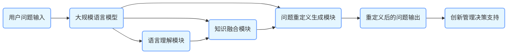

# 大规模语言模型的创造性问题重定义能力在创新管理中的应用

> 关键词：大规模语言模型、创造性问题重定义、创新管理、自然语言处理、知识发现、决策支持、人工智能应用

> 摘要：本文聚焦于大规模语言模型的创造性问题重定义能力在创新管理中的应用。首先介绍了相关背景，包括目的范围、预期读者等内容。接着阐述了核心概念与联系，通过文本示意图和 Mermaid 流程图进行清晰呈现。详细讲解了核心算法原理及具体操作步骤，辅以 Python 源代码。深入探讨了数学模型和公式，并举例说明。通过项目实战给出代码实际案例及详细解释。分析了该能力在实际中的应用场景，推荐了相关工具和资源。最后总结了未来发展趋势与挑战，还设置了附录解答常见问题并提供扩展阅读与参考资料，旨在全面揭示大规模语言模型在创新管理中发挥的重要作用。

## 1. 背景介绍 
### 1.1 目的和范围
在当今快速发展的科技时代，创新管理对于企业和组织的生存与发展至关重要。大规模语言模型的出现为创新管理带来了新的机遇和挑战。本文章的目的在于深入探讨大规模语言模型的创造性问题重定义能力在创新管理中的具体应用，分析其原理、方法和实际效果。范围涵盖了从理论基础到实际案例的各个方面，旨在为相关从业者提供全面而深入的参考。

### 1.2 预期读者
本文预期读者包括创新管理领域的研究者、企业管理人员、产品研发人员、人工智能领域的技术人员以及对创新和人工智能交叉领域感兴趣的爱好者。对于希望了解如何利用大规模语言模型提升创新管理水平的人员，本文将提供有价值的信息和思路。

### 1.3 文档结构概述
本文首先介绍相关背景知识，包括目的、读者和文档结构等。接着阐述核心概念与联系，以清晰的方式呈现大规模语言模型创造性问题重定义能力的原理和架构。然后详细讲解核心算法原理和具体操作步骤，通过 Python 代码进行说明。随后介绍数学模型和公式，并举例解释。通过项目实战展示代码实现和详细解读。分析实际应用场景，推荐相关工具和资源。最后总结未来发展趋势与挑战，设置附录解答常见问题并提供扩展阅读和参考资料。

### 1.4 术语表
#### 1.4.1 核心术语定义
- **大规模语言模型**：基于大量文本数据训练的人工智能模型，能够学习语言的模式和规律，具有强大的语言理解和生成能力，如 GPT - 3、BERT 等。
- **创造性问题重定义**：对给定的问题进行重新审视和表述，以新的视角和方式来理解问题，从而发现更多的解决方案和创新机会。
- **创新管理**：对创新过程进行规划、组织、协调和控制，以提高创新效率和效果，实现组织的创新目标。

#### 1.4.2 相关概念解释
- **自然语言处理**：研究如何让计算机理解和处理人类语言的技术领域，是大规模语言模型的基础技术之一。
- **知识发现**：从大量数据中提取有价值的知识和信息的过程，大规模语言模型可以帮助实现更高效的知识发现。
- **决策支持**：为决策者提供信息和分析，辅助其做出更明智的决策，大规模语言模型在创新管理的决策过程中可以发挥重要作用。

#### 1.4.3 缩略词列表
- **NLP**：自然 Language Processing（自然语言处理）
- **LLM**：Large Language Model（大规模语言模型）

## 2. 核心概念与联系 

### 核心概念原理
大规模语言模型的创造性问题重定义能力基于其强大的语言理解和生成能力。这些模型通过在大规模文本数据上进行训练，学习到了语言的语法、语义和语用信息。当面对一个问题时，模型可以分析问题的文本表述，理解其含义和背景信息。然后，利用其生成能力，从不同的角度和思维方式对问题进行重新表述，从而挖掘出问题背后隐藏的信息和潜在的解决方案。

例如，对于一个传统的产品改进问题“如何提高产品的性能？”，大规模语言模型可能会将其重定义为“如何通过优化产品的设计架构来提升用户体验？” 或者 “如何利用新的材料和技术突破产品性能的瓶颈？” 这种重定义能够帮助创新管理者跳出传统思维的局限，开拓新的创新思路。

### 架构的文本示意图
```plaintext
用户问题输入 -> 大规模语言模型（语言理解模块、知识融合模块、问题重定义生成模块） -> 重定义后的问题输出 -> 创新管理决策支持
```
用户将原始问题输入到大规模语言模型中。模型的语言理解模块对问题进行解析，提取关键信息和语义。知识融合模块将理解到的信息与模型内部存储的大量知识进行融合，以获取更全面的背景信息。问题重定义生成模块根据融合后的信息，从不同的维度和视角生成重定义后的问题。最终，重定义后的问题输出给创新管理决策支持系统，为创新决策提供新的思路和方向。

### Mermaid 流程图


## 3. 核心算法原理 & 具体操作步骤 

### 核心算法原理
大规模语言模型通常基于Transformer架构，以GPT - 3为例，其核心算法是基于自回归语言模型。自回归语言模型的目标是根据前面的文本预测下一个单词的概率分布。模型通过多层的Transformer编码器和解码器结构，学习文本中的上下文信息和语言模式。

在创造性问题重定义的过程中，模型首先对输入的问题进行编码，将文本转换为向量表示。然后，在解码阶段，模型根据编码后的向量和内部的知识表示，生成新的问题表述。为了实现创造性的重定义，模型会引入一些随机化的策略，如温度参数调整，以增加生成问题的多样性。

### 具体操作步骤
1. **数据预处理**：对输入的问题进行清洗和标准化处理，去除噪声和不必要的符号，将文本转换为小写等。
2. **问题编码**：使用大规模语言模型的编码器将预处理后的问题转换为向量表示。
3. **知识融合**：将编码后的问题向量与模型内部的知识表示进行融合，可以通过注意力机制实现。
4. **问题重定义生成**：在解码阶段，使用模型的解码器根据融合后的向量生成重定义后的问题。可以调整温度参数来控制生成问题的多样性。
5. **后处理**：对生成的问题进行筛选和优化，去除不合理或重复的表述。

### Python 源代码详细阐述
```python
import torch
from transformers import GPT2LMHeadModel, GPT2Tokenizer

# 加载预训练的模型和分词器
tokenizer = GPT2Tokenizer.from_pretrained('gpt2')
model = GPT2LMHeadModel.from_pretrained('gpt2')

def redefine_problem(original_problem, temperature=0.7, max_length=50):
    # 数据预处理
    input_text = original_problem.strip().lower()
    # 问题编码
    input_ids = tokenizer.encode(input_text, return_tensors='pt')
    # 问题重定义生成
    output = model.generate(input_ids, temperature=temperature, max_length=max_length)
    # 解码生成的问题
    redefined_problem = tokenizer.decode(output[0], skip_special_tokens=True)
    return redefined_problem

# 示例使用
original_problem = "如何提高产品的销量？"
redefined_problem = redefine_problem(original_problem)
print(f"原始问题: {original_problem}")
print(f"重定义后的问题: {redefined_problem}")
```
在上述代码中，首先加载了预训练的 GPT - 2 模型和分词器。`redefine_problem` 函数实现了问题重定义的主要步骤，包括数据预处理、问题编码、问题重定义生成和解码。最后，通过一个示例展示了如何使用该函数对原始问题进行重定义。

## 4. 数学模型和公式 & 详细讲解 & 举例说明 

### 数学模型
大规模语言模型的基础是概率语言模型，其核心是计算给定上下文 $C$ 下下一个单词 $w$ 的概率 $P(w|C)$。对于自回归语言模型，通常使用链式法则将其分解为多个条件概率的乘积：

$$P(w_1, w_2, \cdots, w_n) = \prod_{i = 1}^{n} P(w_i|w_1, w_2, \cdots, w_{i - 1})$$

其中，$w_1, w_2, \cdots, w_n$ 是一个文本序列。

在 Transformer 架构中，通过多头注意力机制来捕捉文本中的上下文信息。多头注意力机制可以表示为：

$$\text{MultiHead}(Q, K, V) = \text{Concat}(\text{head}_1, \cdots, \text{head}_h)W^O$$

其中，$\text{head}_i = \text{Attention}(QW_i^Q, KW_i^K, VW_i^V)$，$Q$、$K$、$V$ 分别是查询、键和值矩阵，$W_i^Q$、$W_i^K$、$W_i^V$ 和 $W^O$ 是可学习的参数矩阵。

### 详细讲解
概率语言模型的目标是通过学习大量的文本数据，估计出不同单词序列的概率分布。在自回归语言模型中，每次预测下一个单词时，都依赖于前面已经生成的单词。多头注意力机制允许模型在不同的表示子空间中关注输入序列的不同部分，从而更好地捕捉文本的上下文信息。

### 举例说明
假设我们有一个文本序列 “今天天气很好”，要预测下一个单词。自回归语言模型会根据前面的 “今天天气很好” 计算每个可能单词的概率。例如，可能预测下一个单词是 “适合” 的概率为 0.3，是 “出去” 的概率为 0.2 等。

在多头注意力机制中，假设我们有 8 个头。每个头可以关注不同的信息，比如有的头关注 “今天” 和 “天气” 之间的关系，有的头关注 “很好” 这个描述的语义等。通过将多个头的输出拼接起来，并经过一个线性变换，得到最终的注意力输出。

## 5. 项目实战：代码实际案例和详细解释说明 

### 5.1  开发环境搭建
1. **安装 Python**：确保系统中安装了 Python 3.6 或更高版本。可以从 Python 官方网站（https://www.python.org/downloads/） 下载并安装。
2. **安装依赖库**：使用 pip 安装所需的依赖库，包括 `transformers`、`torch` 等。
```bash
pip install transformers torch
```
3. **下载预训练模型**：在代码中使用 `transformers` 库的 `from_pretrained` 方法自动下载预训练的模型和分词器。

### 5.2  源代码详细实现和代码解读
```python
import torch
from transformers import GPT2LMHeadModel, GPT2Tokenizer

# 加载预训练的模型和分词器
tokenizer = GPT2Tokenizer.from_pretrained('gpt2')
model = GPT2LMHeadModel.from_pretrained('gpt2')

def generate_multiple_redefinitions(original_problem, num_redefinitions=5, temperature=0.7, max_length=50):
    redefined_problems = []
    for _ in range(num_redefinitions):
        # 数据预处理
        input_text = original_problem.strip().lower()
        # 问题编码
        input_ids = tokenizer.encode(input_text, return_tensors='pt')
        # 问题重定义生成
        output = model.generate(input_ids, temperature=temperature, max_length=max_length)
        # 解码生成的问题
        redefined_problem = tokenizer.decode(output[0], skip_special_tokens=True)
        redefined_problems.append(redefined_problem)
    return redefined_problems

# 示例使用
original_problem = "如何提高团队的协作效率？"
redefined_problems = generate_multiple_redefinitions(original_problem)

print(f"原始问题: {original_problem}")
print("重定义后的问题:")
for i, problem in enumerate(redefined_problems):
    print(f"{i + 1}. {problem}")
```
**代码解读**：
- `generate_multiple_redefinitions` 函数的作用是生成多个重定义后的问题。通过循环 `num_redefinitions` 次，每次都对原始问题进行重定义，并将结果存储在列表中。
- 在每次循环中，首先对原始问题进行数据预处理，将其转换为小写并去除前后的空格。然后使用分词器对问题进行编码，将其转换为模型可以处理的输入张量。
- 调用模型的 `generate` 方法生成重定义后的问题，通过调整 `temperature` 参数可以控制生成问题的多样性。最后，使用分词器将生成的张量解码为文本，并将其添加到结果列表中。

### 5.3  代码解读与分析
- **优点**：该代码利用了预训练的大规模语言模型，能够快速生成多个重定义后的问题，为创新管理提供了丰富的思路。通过调整 `temperature` 参数，可以灵活控制生成问题的多样性。
- **局限性**：生成的问题可能存在不合理或与原始问题关联性不强的情况。由于模型是基于预训练的，对于一些特定领域的问题，可能无法提供准确和有针对性的重定义。

为了改进这些局限性，可以考虑对模型进行微调，使用特定领域的数据进行训练，以提高模型对特定领域问题的理解和重定义能力。

## 6. 实际应用场景 
### 产品创新
在产品创新过程中，大规模语言模型的创造性问题重定义能力可以帮助企业从不同的角度审视产品问题。例如，传统的产品改进问题可能集中在产品的功能和性能上。通过问题重定义，企业可以发现新的创新方向，如如何通过产品的设计和用户体验来提升产品的竞争力。

### 市场战略规划
在市场战略规划中，问题重定义可以帮助企业更好地理解市场需求和竞争态势。例如，将 “如何提高市场份额？” 重定义为 “如何满足未被满足的市场需求？” 可以引导企业开拓新的市场领域，制定更有针对性的市场战略。

### 团队协作与创新管理
在团队协作和创新管理中，问题重定义可以促进团队成员之间的沟通和创新思维的激发。例如，将 “如何解决团队内部的矛盾？” 重定义为 “如何建立一个高效协作的团队文化？” 可以引导团队成员从更积极的角度思考问题，寻找解决问题的根本方法。

### 研发项目管理
在研发项目管理中，问题重定义可以帮助研发团队明确项目目标和方向。例如，将 “如何缩短研发周期？” 重定义为 “如何优化研发流程，提高研发效率？” 可以引导研发团队从流程优化的角度寻找解决方案，提高研发项目的成功率。

## 7. 工具和资源推荐
### 7.1 学习资源推荐
#### 7.1.1 书籍推荐
- 《深度学习》（Deep Learning）：由 Ian Goodfellow、Yoshua Bengio 和 Aaron Courville 编写，是深度学习领域的经典教材，涵盖了神经网络、深度学习模型等基础知识。
- 《自然语言处理入门》：介绍了自然语言处理的基本概念、方法和技术，适合初学者快速了解该领域。
- 《人工智能：一种现代的方法》（Artificial Intelligence: A Modern Approach）：全面介绍了人工智能的各个领域，包括知识表示、推理、机器学习等内容。

#### 7.1.2 在线课程
- Coursera 上的 “深度学习专项课程”（Deep Learning Specialization）：由 Andrew Ng 教授授课，系统地介绍了深度学习的理论和实践。
- edX 上的 “自然语言处理”（Natural Language Processing）：提供了自然语言处理的深入学习内容，包括文本分类、情感分析等技术。
- 哔哩哔哩（B 站）上有许多关于大规模语言模型和自然语言处理的视频教程，适合初学者快速入门。

#### 7.1.3 技术博客和网站
- Medium 上有许多关于人工智能和自然语言处理的技术博客，如 Towards Data Science 等，作者会分享最新的研究成果和实践经验。
- arXiv 是一个预印本服务器，提供了大量的学术论文，包括大规模语言模型的最新研究进展。
- Hugging Face 的官方博客（https://huggingface.co/blog） 提供了关于自然语言处理模型和工具的详细介绍和使用指南。

### 7.2 开发工具框架推荐
#### 7.2.1 IDE和编辑器
- PyCharm：是一款专业的 Python 集成开发环境，提供了丰富的代码编辑、调试和版本控制功能，适合开发大规模的 Python 项目。
- Visual Studio Code：是一款轻量级的代码编辑器，支持多种编程语言，通过安装相关插件可以实现 Python 开发的高效编辑和调试。

#### 7.2.2 调试和性能分析工具
- Py-Spy：是一个 Python 性能分析工具，可以实时分析 Python 程序的性能瓶颈，帮助开发者优化代码。
- TensorBoard：是 TensorFlow 提供的可视化工具，可以用于查看模型的训练过程、损失曲线等信息，方便调试和优化模型。

#### 7.2.3 相关框架和库
- Transformers：由 Hugging Face 开发的自然语言处理框架，提供了大量预训练的语言模型和工具，方便开发者进行自然语言处理任务的开发。
- PyTorch：是一个开源的深度学习框架，具有动态计算图的特点，易于使用和调试，广泛应用于自然语言处理和计算机视觉等领域。
- NLTK：是一个自然语言处理工具包，提供了丰富的文本处理功能，如分词、词性标注、命名实体识别等。

### 7.3 相关论文著作推荐
#### 7.3.1 经典论文
- “Attention Is All You Need”：介绍了 Transformer 架构，是大规模语言模型的基础。
- “BERT: Pre-training of Deep Bidirectional Transformers for Language Understanding”：提出了 BERT 模型，在自然语言处理领域取得了显著的成果。
- “GPT: Generative Pretrained Transformer”：介绍了 GPT 模型的原理和应用。

#### 7.3.2 最新研究成果
- 在 arXiv 上可以找到关于大规模语言模型的最新研究成果，如关于模型优化、应用拓展等方面的论文。
- 顶级学术会议如 ACL（Association for Computational Linguistics）、EMNLP（Conference on Empirical Methods in Natural Language Processing）等会发表最新的自然语言处理研究成果。

#### 7.3.3 应用案例分析
- 一些商业杂志和研究报告中会有关于大规模语言模型在创新管理等领域的应用案例分析，如麦肯锡、波士顿咨询等公司的研究报告。

## 8. 总结：未来发展趋势与挑战
### 未来发展趋势
- **模型性能提升**：随着计算资源的不断增加和算法的不断优化，大规模语言模型的性能将不断提升，能够处理更复杂的语言任务，提供更准确和有创造性的问题重定义。
- **领域专用模型**：针对不同的行业和领域，将开发出更具针对性的大规模语言模型，以提高模型在特定领域问题重定义的准确性和实用性。
- **与其他技术融合**：大规模语言模型将与计算机视觉、物联网等技术融合，实现多模态的问题重定义，为创新管理提供更全面的支持。
- **智能决策系统**：基于大规模语言模型的创造性问题重定义能力，将开发出智能决策系统，为创新管理提供自动化的决策支持。

### 挑战
- **数据隐私和安全**：大规模语言模型需要大量的数据进行训练，数据的隐私和安全问题是一个重要的挑战。如何在保护数据隐私的前提下，充分利用数据进行模型训练是一个亟待解决的问题。
- **模型解释性**：大规模语言模型通常是黑盒模型，其决策过程难以解释。在创新管理中，需要模型能够提供可解释的问题重定义结果，以便决策者理解和信任模型的输出。
- **伦理和道德问题**：大规模语言模型的应用可能会带来一些伦理和道德问题，如生成虚假信息、偏见等。如何确保模型的应用符合伦理和道德标准是一个重要的挑战。
- **技术门槛**：大规模语言模型的开发和应用需要较高的技术门槛，包括计算资源、算法知识等。如何降低技术门槛，让更多的企业和组织能够受益于大规模语言模型的创造性问题重定义能力是一个需要解决的问题。

## 9. 附录：常见问题与解答
### 1. 大规模语言模型生成的问题重定义一定是有效的吗？
不一定。大规模语言模型生成的问题重定义是基于其学习到的语言模式和知识，可能存在不合理或与实际情况不符的情况。需要人工对生成的结果进行筛选和评估，结合实际情况进行判断和选择。

### 2. 如何提高大规模语言模型在特定领域问题重定义的准确性？
可以对模型进行微调，使用特定领域的数据进行训练。此外，还可以结合领域专家的知识和经验，对模型的输出进行修正和优化。

### 3. 大规模语言模型的计算资源需求很高，如何降低计算成本？
可以选择合适的模型架构和参数，采用量化、剪枝等技术对模型进行压缩，减少模型的计算量和存储需求。此外，还可以利用云计算等资源，按需使用计算资源，降低成本。

### 4. 大规模语言模型会取代人类的创新思维吗？
不会。大规模语言模型只是一种工具，它可以帮助人类开拓创新思路，提供更多的可能性。但创新过程中还需要人类的创造力、判断力和经验等因素，人类的创新思维是不可替代的。

## 10. 扩展阅读 & 参考资料
### 扩展阅读
- 《创新管理：赢得持续竞争优势》：深入探讨了创新管理的理论和实践，提供了丰富的案例和方法。
- 《人工智能时代的创新》：分析了人工智能对创新的影响和机遇，以及如何在人工智能时代实现创新。
- 《自然语言处理实战》：通过实际案例介绍了自然语言处理的应用和实现方法。

### 参考资料
- Goodfellow, I., Bengio, Y., & Courville, A. (2016). Deep Learning. MIT Press.
- Devlin, J., Chang, M. W., Lee, K., & Toutanova, K. (2018). BERT: Pre-training of Deep Bidirectional Transformers for Language Understanding. arXiv preprint arXiv:1810.04805.
- Radford, A., Narasimhan, K., Salimans, T., & Sutskever, I. (2018). Improving Language Understanding by Generative Pre-Training. OpenAI.
- Vaswani, A., Shazeer, N., Parmar, N., Uszkoreit, J., Jones, L., Gomez, A. N., ... & Polosukhin, I. (2017). Attention Is All You Need. Advances in Neural Information Processing Systems.