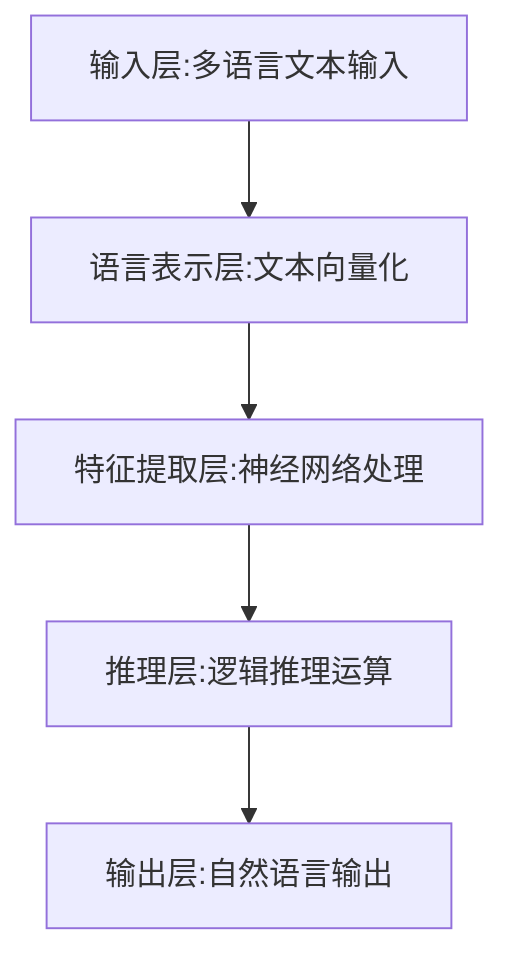

# 大规模语言模型的多语言推理能力研究

> 关键词：大规模语言模型、多语言推理、自然语言处理、跨语言理解、推理算法、语言多样性、知识融合

> 摘要：本文聚焦于大规模语言模型的多语言推理能力，全面深入地探讨了其相关的核心概念、算法原理、数学模型等内容。首先介绍了研究的背景，明确目的、预期读者和文档结构。接着阐述了大规模语言模型多语言推理的核心概念及联系，通过文本示意图和 Mermaid 流程图直观呈现其架构。详细讲解了核心算法原理并给出 Python 源代码示例，同时介绍了相关的数学模型和公式。在项目实战部分，展示了开发环境搭建、源代码实现及代码解读。分析了实际应用场景，推荐了学习资源、开发工具框架和相关论文著作。最后总结了未来发展趋势与挑战，提供了常见问题解答和扩展阅读参考资料，旨在为该领域的研究和实践提供全面而深入的参考。

## 1. 背景介绍 
### 1.1 目的和范围
随着全球化的加速，不同语言背景的人们之间的交流与合作日益频繁。大规模语言模型作为自然语言处理领域的重要成果，其多语言推理能力的研究具有重要的现实意义。本研究的目的在于深入探究大规模语言模型在多语言环境下的推理机制，分析其优势与不足，为进一步提升多语言推理能力提供理论支持和实践指导。研究范围涵盖了常见的大规模语言模型，如 GPT 系列、BERT 系列等，涉及多种语言，包括但不限于英语、汉语、法语、德语、西班牙语等。

### 1.2 预期读者
本文预期读者包括自然语言处理领域的研究人员、人工智能开发者、对大规模语言模型感兴趣的学者以及相关专业的学生。对于研究人员，本文可以为他们的研究提供新的思路和方法；对于开发者，有助于他们在实际项目中更好地应用大规模语言模型的多语言推理能力；对于学者和学生，能够加深他们对该领域的理解和认识。

### 1.3 文档结构概述
本文将按照以下结构展开：首先介绍核心概念与联系，包括多语言推理的基本原理和架构；接着阐述核心算法原理和具体操作步骤，并给出 Python 源代码示例；然后介绍相关的数学模型和公式，并举例说明；在项目实战部分，详细展示开发环境搭建、源代码实现及代码解读；分析实际应用场景；推荐学习资源、开发工具框架和相关论文著作；最后总结未来发展趋势与挑战，提供常见问题解答和扩展阅读参考资料。

### 1.4 术语表
#### 1.4.1 核心术语定义
- **大规模语言模型**：基于深度学习技术，通过在大规模文本数据上进行训练得到的语言模型，具有强大的语言理解和生成能力，如 GPT - 3、BERT 等。
- **多语言推理**：在多种语言环境下，语言模型能够理解不同语言表达的语义信息，并进行逻辑推理和知识运用的能力。
- **跨语言理解**：语言模型能够跨越不同语言的障碍，准确理解不同语言所表达的相同或相似语义的能力。

#### 1.4.2 相关概念解释
- **语言表示**：将文本转换为计算机能够处理的数值表示的过程，常见的方法有词嵌入、句嵌入等。
- **注意力机制**：一种在深度学习中用于聚焦重要信息的机制，能够动态地分配不同位置的权重，提高模型的性能。
- **知识融合**：将不同来源、不同语言的知识整合到语言模型中的过程，以增强模型的推理能力。

#### 1.4.3 缩略词列表
- **NLP**：Natural Language Processing，自然语言处理
- **GPT**：Generative Pretrained Transformer，生成式预训练变换器
- **BERT**：Bidirectional Encoder Representations from Transformers，基于变换器的双向编码器表示

## 2. 核心概念与联系 

### 多语言推理的基本原理
大规模语言模型的多语言推理能力基于其对不同语言的语义理解和逻辑推理能力。在训练过程中，模型通过学习大量的多语言文本数据，掌握了不同语言的语法结构、词汇语义和语言习惯。当输入多语言文本时，模型首先将文本进行语言表示，将其转换为数值向量，然后利用内部的神经网络结构进行特征提取和语义理解。在推理阶段，模型根据输入的问题和相关的语言信息，运用逻辑推理规则和已有的知识进行推理，得出相应的结论。

### 多语言推理的架构
多语言推理的架构通常包括以下几个部分：
1. **输入层**：接收多语言文本输入，进行文本预处理，如分词、词性标注等。
2. **语言表示层**：将预处理后的文本转换为数值向量表示，常见的方法有词嵌入、句嵌入等。
3. **特征提取层**：利用神经网络结构，如 Transformer 架构，对语言表示进行特征提取，捕捉文本中的语义信息。
4. **推理层**：根据提取的特征和已有的知识，运用逻辑推理规则进行推理，得出结论。
5. **输出层**：将推理结果转换为自然语言输出。

### 文本示意图
```plaintext
+----------------+
|    输入层      |
|  多语言文本输入 |
+----------------+
       |
       v
+----------------+
|  语言表示层    |
|  文本向量化    |
+----------------+
       |
       v
+----------------+
|  特征提取层    |
|  神经网络处理  |
+----------------+
       |
       v
+----------------+
|   推理层       |
|  逻辑推理运算  |
+----------------+
       |
       v
+----------------+
|   输出层       |
|  自然语言输出  |
+----------------+
```

### Mermaid 流程图


## 3. 核心算法原理 & 具体操作步骤 

### 核心算法原理
大规模语言模型的多语言推理通常基于 Transformer 架构。Transformer 架构采用了自注意力机制，能够动态地捕捉文本中不同位置之间的依赖关系，从而更好地理解文本的语义信息。在多语言推理中，模型首先对输入的多语言文本进行词嵌入，将每个词转换为一个低维向量。然后，通过多层的 Transformer 编码器对词向量进行处理，提取文本的特征表示。最后，根据任务的需求，使用不同的解码器或分类器进行推理和预测。

### Python 源代码示例
```python
import torch
from transformers import AutoTokenizer, AutoModelForSequenceClassification

# 加载预训练的多语言模型和分词器
model_name = "bert-base-multilingual-cased"
tokenizer = AutoTokenizer.from_pretrained(model_name)
model = AutoModelForSequenceClassification.from_pretrained(model_name)

# 输入多语言文本
text1 = "This is a sample sentence in English."
text2 = "这是一个中文的示例句子。"

# 对文本进行分词和编码
inputs1 = tokenizer(text1, return_tensors='pt')
inputs2 = tokenizer(text2, return_tensors='pt')

# 进行推理
with torch.no_grad():
    outputs1 = model(**inputs1)
    outputs2 = model(**inputs2)

# 获取推理结果
logits1 = outputs1.logits
logits2 = outputs2.logits

# 打印结果
print("English text logits:", logits1)
print("Chinese text logits:", logits2)
```

### 具体操作步骤
1. **模型和分词器的加载**：使用 `transformers` 库中的 `AutoTokenizer` 和 `AutoModelForSequenceClassification` 类加载预训练的多语言模型和对应的分词器。
2. **文本输入**：准备多语言文本作为输入。
3. **分词和编码**：使用分词器对输入的文本进行分词和编码，将文本转换为模型能够处理的输入格式。
4. **推理**：使用 `torch.no_grad()` 上下文管理器，调用模型进行推理，得到输出结果。
5. **结果处理**：从输出结果中提取所需的信息，如 logits 值。

## 4. 数学模型和公式 & 详细讲解 & 举例说明 

### 词嵌入
词嵌入是将文本中的每个词转换为一个低维向量的过程。常见的词嵌入方法有 Word2Vec、GloVe 等。在大规模语言模型中，通常使用预训练的词嵌入矩阵。假设词汇表的大小为 $V$，词向量的维度为 $d$，则词嵌入矩阵 $E$ 是一个 $V \times d$ 的矩阵。对于输入文本中的第 $i$ 个词 $w_i$，其对应的词向量 $e_i$ 可以通过索引词嵌入矩阵得到：
$$e_i = E[w_i]$$

### 自注意力机制
自注意力机制是 Transformer 架构的核心。对于输入的词向量序列 $X = [x_1, x_2, \cdots, x_n]$，其中 $x_i \in \mathbb{R}^d$，自注意力机制的计算过程如下：
1. 计算查询矩阵 $Q$、键矩阵 $K$ 和值矩阵 $V$：
$$Q = XW_Q$$
$$K = XW_K$$
$$V = XW_V$$
其中 $W_Q, W_K, W_V \in \mathbb{R}^{d \times d_k}$ 是可学习的权重矩阵，$d_k$ 是查询、键和值的维度。
2. 计算注意力分数：
$$\text{Attention}(Q, K, V) = \text{softmax}\left(\frac{QK^T}{\sqrt{d_k}}\right)V$$

### 举例说明
假设输入的词向量序列 $X = \begin{bmatrix}1 & 2 \\ 3 & 4 \\ 5 & 6\end{bmatrix}$，$d = 2$，$d_k = 2$，$W_Q = \begin{bmatrix}0.1 & 0.2 \\ 0.3 & 0.4\end{bmatrix}$，$W_K = \begin{bmatrix}0.5 & 0.6 \\ 0.7 & 0.8\end{bmatrix}$，$W_V = \begin{bmatrix}0.9 & 1.0 \\ 1.1 & 1.2\end{bmatrix}$。
1. 计算查询矩阵 $Q$：
$$Q = XW_Q = \begin{bmatrix}1 & 2 \\ 3 & 4 \\ 5 & 6\end{bmatrix}\begin{bmatrix}0.1 & 0.2 \\ 0.3 & 0.4\end{bmatrix} = \begin{bmatrix}0.7 & 1.0 \\ 1.5 & 2.2 \\ 2.3 & 3.4\end{bmatrix}$$
2. 计算键矩阵 $K$：
$$K = XW_K = \begin{bmatrix}1 & 2 \\ 3 & 4 \\ 5 & 6\end{bmatrix}\begin{bmatrix}0.5 & 0.6 \\ 0.7 & 0.8\end{bmatrix} = \begin{bmatrix}1.9 & 2.2 \\ 4.3 & 5.0 \\ 6.7 & 7.8\end{bmatrix}$$
3. 计算值矩阵 $V$：
$$V = XW_V = \begin{bmatrix}1 & 2 \\ 3 & 4 \\ 5 & 6\end{bmatrix}\begin{bmatrix}0.9 & 1.0 \\ 1.1 & 1.2\end{bmatrix} = \begin{bmatrix}3.1 & 3.4 \\ 7.1 & 7.8 \\ 11.1 & 12.2\end{bmatrix}$$
4. 计算注意力分数：
$$QK^T = \begin{bmatrix}0.7 & 1.0 \\ 1.5 & 2.2 \\ 2.3 & 3.4\end{bmatrix}\begin{bmatrix}1.9 & 4.3 & 6.7 \\ 2.2 & 5.0 & 7.8\end{bmatrix} = \begin{bmatrix}3.53 & 8.11 & 12.19 \\ 8.29 & 19.55 & 29.71 \\ 12.95 & 30.29 & 45.61\end{bmatrix}$$
$$\frac{QK^T}{\sqrt{d_k}} = \begin{bmatrix}2.49 & 5.73 & 8.62 \\ 5.86 & 13.83 & 21.00 \\ 9.16 & 21.42 & 32.26\end{bmatrix}$$
$$\text{softmax}\left(\frac{QK^T}{\sqrt{d_k}}\right) = \begin{bmatrix}0.00 & 0.02 & 0.98 \\ 0.00 & 0.07 & 0.93 \\ 0.00 & 0.11 & 0.89\end{bmatrix}$$
$$\text{Attention}(Q, K, V) = \begin{bmatrix}0.00 & 0.02 & 0.98 \\ 0.00 & 0.07 & 0.93 \\ 0.00 & 0.11 & 0.89\end{bmatrix}\begin{bmatrix}3.1 & 3.4 \\ 7.1 & 7.8 \\ 11.1 & 12.2\end{bmatrix} = \begin{bmatrix}10.96 & 12.04 \\ 10.72 & 11.76 \\ 10.48 & 11.48\end{bmatrix}$$

## 5. 项目实战：代码实际案例和详细解释说明 

### 5.1  开发环境搭建
1. **安装 Python**：建议使用 Python 3.7 及以上版本。可以从 Python 官方网站（https://www.python.org/downloads/）下载并安装。
2. **创建虚拟环境**：使用 `venv` 或 `conda` 等工具创建虚拟环境，以隔离项目的依赖。例如，使用 `venv` 创建虚拟环境：
```bash
python -m venv myenv
```
3. **激活虚拟环境**：
    - 在 Windows 上：
```bash
myenv\Scripts\activate
```
    - 在 Linux 或 macOS 上：
```bash
source myenv/bin/activate
```
4. **安装依赖库**：使用 `pip` 安装所需的依赖库，如 `transformers`、`torch` 等：
```bash
pip install transformers torch
```

### 5.2  源代码详细实现和代码解读
```python
import torch
from transformers import AutoTokenizer, AutoModelForSequenceClassification

# 加载预训练的多语言模型和分词器
model_name = "bert-base-multilingual-cased"
tokenizer = AutoTokenizer.from_pretrained(model_name)
model = AutoModelForSequenceClassification.from_pretrained(model_name)

# 定义多语言文本列表
texts = [
    "This is an English sentence.",
    "Dies ist ein deutscher Satz.",
    "Ceci est une phrase en français."
]

# 对文本进行分词和编码
inputs = tokenizer(texts, return_tensors='pt', padding=True, truncation=True)

# 进行推理
with torch.no_grad():
    outputs = model(**inputs)

# 获取推理结果
logits = outputs.logits
predictions = torch.argmax(logits, dim=1)

# 打印结果
for i in range(len(texts)):
    print(f"Text: {texts[i]}")
    print(f"Prediction: {predictions[i].item()}")
    print()
```

### 代码解读与分析
1. **模型和分词器的加载**：使用 `AutoTokenizer.from_pretrained` 和 `AutoModelForSequenceClassification.from_pretrained` 方法加载预训练的多语言模型和分词器。`bert-base-multilingual-cased` 是一个常用的多语言预训练模型。
2. **文本输入**：定义一个包含多语言文本的列表 `texts`。
3. **分词和编码**：使用 `tokenizer` 对文本进行分词和编码，`return_tensors='pt'` 表示返回 PyTorch 张量，`padding=True` 和 `truncation=True` 分别表示对输入进行填充和截断，以确保输入的长度一致。
4. **推理**：使用 `torch.no_grad()` 上下文管理器，调用模型进行推理，得到输出结果。
5. **结果处理**：从输出结果中提取 logits 值，使用 `torch.argmax` 函数获取预测的类别索引。
6. **结果打印**：遍历每个文本，打印文本内容和对应的预测结果。

## 6. 实际应用场景 
### 智能翻译
大规模语言模型的多语言推理能力可以应用于智能翻译领域。通过对源语言文本进行推理和理解，模型可以生成准确、自然的目标语言翻译。例如，谷歌翻译等翻译工具已经开始利用大规模语言模型的多语言推理能力来提高翻译质量。

### 跨语言问答系统
在跨语言问答系统中，用户可以使用不同的语言提出问题，系统能够理解问题的语义，并利用多语言推理能力从多语言知识源中查找答案。例如，一些国际化的智能客服系统可以支持多种语言的提问和回答。

### 多语言信息检索
多语言信息检索系统可以利用大规模语言模型的多语言推理能力，对不同语言的文档进行语义理解和索引，从而实现跨语言的信息检索。用户可以使用自己熟悉的语言进行查询，系统能够返回相关的多语言文档。

### 国际商务交流
在国际商务交流中，不同语言背景的人员之间的沟通可能存在障碍。大规模语言模型的多语言推理能力可以用于实时翻译、智能辅助等功能，帮助人们更好地进行商务谈判、合作交流等活动。

## 7. 工具和资源推荐
### 7.1 学习资源推荐
#### 7.1.1 书籍推荐
- 《自然语言处理入门》：这本书全面介绍了自然语言处理的基本概念、方法和技术，适合初学者入门。
- 《深度学习》：由 Ian Goodfellow、Yoshua Bengio 和 Aaron Courville 所著，是深度学习领域的经典教材，对理解大规模语言模型的原理有很大帮助。
- 《Python 自然语言处理》：详细介绍了如何使用 Python 进行自然语言处理任务，提供了丰富的代码示例。

#### 7.1.2 在线课程
- Coursera 上的“Natural Language Processing Specialization”：由斯坦福大学的教授授课，涵盖了自然语言处理的多个方面，包括词嵌入、序列模型、注意力机制等。
- edX 上的“Introduction to Artificial Intelligence”：介绍了人工智能的基本概念和方法，包括自然语言处理的相关内容。
- 吴恩达的“DeepLearning.AI TensorFlow Developer Professional Certificate”：通过 TensorFlow 框架学习深度学习，包括自然语言处理的实践应用。

#### 7.1.3 技术博客和网站
- Hugging Face Blog：提供了关于大规模语言模型、自然语言处理等领域的最新研究成果和技术分享。
- Medium 上的 Towards Data Science：有很多关于自然语言处理和人工智能的优质文章。
- arXiv.org：可以查找最新的学术论文，了解该领域的前沿研究动态。

### 7.2 开发工具框架推荐
#### 7.2.1 IDE和编辑器
- PyCharm：功能强大的 Python 集成开发环境，提供了代码编辑、调试、版本控制等功能。
- Visual Studio Code：轻量级的代码编辑器，支持多种编程语言，有丰富的插件扩展。
- Jupyter Notebook：交互式的开发环境，适合进行数据分析和模型实验。

#### 7.2.2 调试和性能分析工具
- PyTorch Profiler：用于分析 PyTorch 模型的性能，帮助优化代码。
- TensorBoard：用于可视化深度学习模型的训练过程和性能指标。
- cProfile：Python 内置的性能分析工具，可以分析代码的执行时间和调用关系。

#### 7.2.3 相关框架和库
- Transformers：Hugging Face 开发的用于自然语言处理的库，提供了丰富的预训练模型和工具。
- PyTorch：深度学习框架，广泛应用于自然语言处理和计算机视觉等领域。
- NumPy：Python 的科学计算库，用于处理数组和矩阵运算。

### 7.3 相关论文著作推荐
#### 7.3.1 经典论文
- “Attention Is All You Need”：介绍了 Transformer 架构，是大规模语言模型的基础。
- “BERT: Pre-training of Deep Bidirectional Transformers for Language Understanding”：提出了 BERT 模型，开创了预训练 - 微调的自然语言处理范式。
- “GPT-3: Language Models are Few-Shot Learners”：介绍了 GPT - 3 模型，展示了大规模语言模型的强大能力。

#### 7.3.2 最新研究成果
可以关注 ACL（Association for Computational Linguistics）、EMNLP（Conference on Empirical Methods in Natural Language Processing）等自然语言处理领域的顶级会议，获取最新的研究成果。

#### 7.3.3 应用案例分析
- “Google Neural Machine Translation System: Bridging the Gap between Human and Machine Translation”：介绍了谷歌神经机器翻译系统的实现和应用。
- “Microsoft Translator: The World's Largest Neural Machine Translation System”：讲述了微软翻译系统的相关技术和应用案例。

## 8. 总结：未来发展趋势与挑战
### 未来发展趋势
1. **更强的多语言理解能力**：未来的大规模语言模型将能够更好地理解不同语言的语义、文化背景和语言习惯，实现更加准确和自然的多语言交互。
2. **跨语言知识融合**：通过将不同语言的知识进行融合，模型可以获取更全面的知识体系，提高多语言推理的能力和效率。
3. **个性化多语言服务**：根据用户的语言偏好、使用习惯等因素，提供个性化的多语言服务，满足不同用户的需求。
4. **与其他技术的融合**：大规模语言模型的多语言推理能力将与计算机视觉、语音识别等技术进行融合，实现更加智能的多模态交互。

### 挑战
1. **语言多样性的挑战**：世界上存在着数千种语言，每种语言都有其独特的语法结构、词汇和文化背景。如何处理语言的多样性，提高模型在各种语言上的性能，是一个巨大的挑战。
2. **知识的准确性和一致性**：在多语言环境下，不同语言的知识来源可能存在差异，如何确保知识的准确性和一致性，是提高多语言推理能力的关键。
3. **计算资源的需求**：大规模语言模型的训练和推理需要大量的计算资源，如何在有限的计算资源下提高模型的效率，是一个亟待解决的问题。
4. **伦理和法律问题**：随着大规模语言模型的广泛应用，涉及到的伦理和法律问题也越来越多，如隐私保护、语言歧视等，需要制定相应的规范和准则。

## 9. 附录：常见问题与解答
### 1. 大规模语言模型的多语言推理能力受哪些因素影响？
大规模语言模型的多语言推理能力受多种因素影响，包括训练数据的质量和多样性、模型的架构和参数、语言的复杂性和相似性等。训练数据中包含的语言种类越多、数据质量越高，模型的多语言推理能力就越强。模型的架构和参数也会影响其对不同语言的理解和处理能力。此外，语言的复杂性和相似性也会对推理能力产生影响，一些语言之间的语法结构和词汇有较高的相似性，模型在处理这些语言时可能会更容易。

### 2. 如何评估大规模语言模型的多语言推理能力？
可以使用多种指标来评估大规模语言模型的多语言推理能力，如准确率、召回率、F1 值等。此外，还可以进行人工评估，通过让人类评估者对模型的推理结果进行评价，来判断模型的性能。一些公开的多语言推理数据集也可以用于评估模型的能力，如 XNLI 数据集等。

### 3. 大规模语言模型在处理低资源语言时存在哪些问题？
大规模语言模型在处理低资源语言时可能存在以下问题：训练数据不足，导致模型对低资源语言的理解和处理能力有限；语言的特殊性可能没有得到充分的考虑，模型的性能可能较差；缺乏针对低资源语言的优化和调整，模型的效率可能较低。

### 4. 如何提高大规模语言模型的多语言推理能力？
可以通过以下方法提高大规模语言模型的多语言推理能力：增加训练数据的多样性，特别是低资源语言的数据；优化模型的架构和参数，使其更好地适应多语言环境；采用迁移学习、多任务学习等技术，利用已有的知识和经验来提高模型的性能；进行模型融合和集成，结合多个模型的优势来提高推理能力。

## 10. 扩展阅读 & 参考资料
### 扩展阅读
- 《多语言自然语言处理》：深入探讨了多语言自然语言处理的理论和技术，提供了更全面的知识体系。
- 《人工智能：现代方法》：介绍了人工智能的各个方面，包括自然语言处理、机器学习等，有助于拓宽知识面。

### 参考资料
1. Vaswani, A., Shazeer, N., Parmar, N., et al. (2017). Attention Is All You Need. Advances in Neural Information Processing Systems.
2. Devlin, J., Chang, M. W., Lee, K., et al. (2018). BERT: Pre-training of Deep Bidirectional Transformers for Language Understanding. arXiv preprint arXiv:1810.04805.
3. Brown, T. B., Mann, B., Ryder, N., et al. (2020). Language Models are Few-Shot Learners. arXiv preprint arXiv:2005.14165.
4. Hugging Face Documentation. https://huggingface.co/docs
5. PyTorch Documentation. https://pytorch.org/docs/stable/index.html