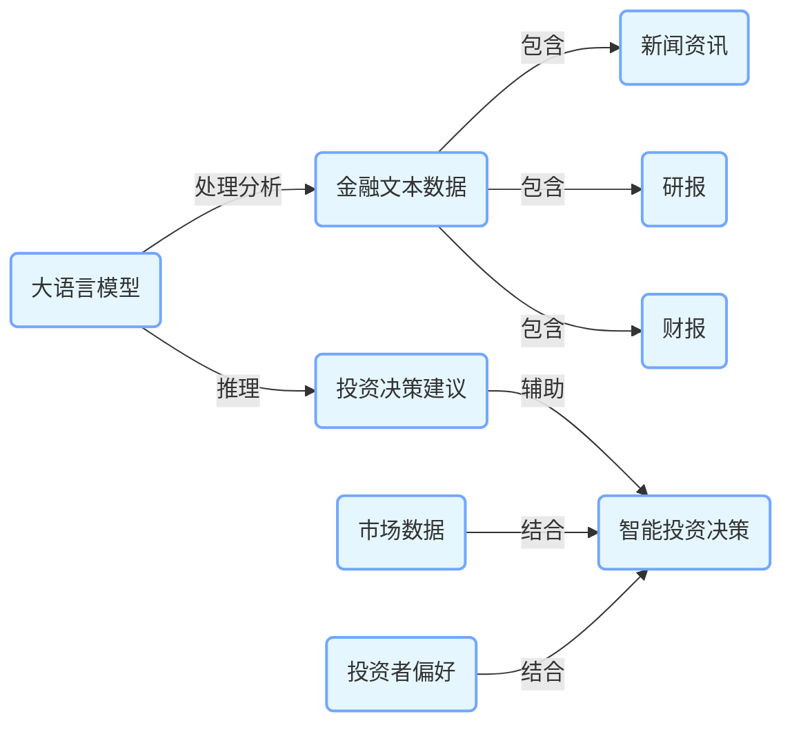

# 大语言模型在智能投资决策中的推理应用

> 关键词：大语言模型、智能投资决策、推理应用、金融数据、投资策略

> 摘要：本文深入探讨了大语言模型在智能投资决策中的推理应用。首先介绍了相关背景，包括研究目的、预期读者等。接着阐述了大语言模型和智能投资决策的核心概念及其联系，详细讲解了大语言模型的推理算法原理与具体操作步骤，并给出了相应的数学模型和公式。通过项目实战展示了如何在实际中运用大语言模型进行投资决策，分析了其实际应用场景。同时推荐了相关的学习资源、开发工具框架以及论文著作。最后总结了未来发展趋势与挑战，还设置了附录解答常见问题并提供扩展阅读和参考资料，旨在为读者全面呈现大语言模型在智能投资决策领域的应用情况。

## 1. 背景介绍 
### 1.1 目的和范围
在当今复杂多变的金融市场中，投资决策面临着海量数据和高度不确定性的挑战。传统的投资决策方法往往难以快速、全面地处理和分析这些信息。大语言模型作为人工智能领域的重要成果，具有强大的自然语言处理和推理能力，为智能投资决策带来了新的机遇。本文的目的在于深入研究大语言模型在智能投资决策中的推理应用，探索其如何帮助投资者更准确地分析市场信息、制定投资策略。范围涵盖了大语言模型的基本原理、在投资决策中的具体应用场景、相关算法和数学模型，以及实际项目中的实现和应用案例。

### 1.2 预期读者
本文预期读者包括金融领域的从业者，如投资经理、分析师、交易员等，他们可以从中了解大语言模型如何为投资决策提供支持，提升决策的科学性和准确性；人工智能领域的研究人员和开发者，有助于他们了解大语言模型在金融领域的具体应用需求和挑战，拓展应用场景；对智能投资决策和大语言模型感兴趣的学生和爱好者，能够系统地学习相关知识和技术。

### 1.3 文档结构概述
本文首先介绍背景信息，包括目的、读者和文档结构等。接着阐述大语言模型和智能投资决策的核心概念及其联系，通过示意图和流程图直观展示。然后详细讲解大语言模型在智能投资决策中的推理算法原理和具体操作步骤，给出数学模型和公式并举例说明。通过项目实战部分，呈现开发环境搭建、源代码实现和解读。分析实际应用场景，推荐相关工具和资源。最后总结未来发展趋势与挑战，设置附录解答常见问题并提供扩展阅读和参考资料。

### 1.4 术语表
#### 1.4.1 核心术语定义
- **大语言模型**：是一种基于深度学习的人工智能模型，通过在大规模文本数据上进行训练，学习语言的模式和规律，能够生成自然语言文本、回答问题、进行推理等。
- **智能投资决策**：利用人工智能技术，对金融市场数据、信息进行分析和处理，以辅助投资者做出更明智、更科学的投资决策的过程。
- **推理**：大语言模型根据输入的信息，运用其学习到的知识和模式，得出结论或预测的过程。

#### 1.4.2 相关概念解释
- **金融数据**：包括股票价格、债券收益率、宏观经济指标、公司财务报表等与金融市场和投资相关的数据。
- **投资策略**：投资者为了实现投资目标，根据市场情况和自身风险偏好制定的投资计划和方法。

#### 1.4.3 缩略词列表
- **LLM**：Large Language Model（大语言模型）
- **AI**：Artificial Intelligence（人工智能）

## 2. 核心概念与联系 
### 2.1 大语言模型原理
大语言模型通常基于Transformer架构，它由编码器和解码器组成。编码器负责对输入的文本进行特征提取和编码，解码器则根据编码器的输出生成相应的文本。Transformer架构的核心是自注意力机制，它能够让模型在处理文本时，关注到不同位置的词语之间的关系。

以GPT（Generative Pretrained Transformer）系列模型为例，它是典型的基于Transformer解码器的大语言模型。在预训练阶段，模型在大规模的无监督文本数据上进行训练，学习语言的统计规律和语义信息。在微调阶段，根据具体的任务，如问答、文本生成等，对模型进行有监督的训练，使其适应特定的任务需求。

### 2.2 智能投资决策概述
智能投资决策是一个复杂的过程，涉及到对金融市场的分析、对投资标的的评估、对风险的控制等多个方面。传统的投资决策方法主要依赖于基本面分析和技术分析。基本面分析通过研究公司的财务状况、行业前景等因素来评估投资价值；技术分析则通过分析股票价格、成交量等历史数据来预测未来价格走势。

智能投资决策引入了人工智能技术，利用机器学习、深度学习等算法对海量的金融数据进行分析和处理，挖掘数据中的潜在信息和规律，从而为投资者提供更准确的决策依据。

### 2.3 核心概念联系示意图

大语言模型通过对金融文本数据（如新闻资讯、研报、财报等）进行处理和分析，利用其推理能力生成投资决策建议，这些建议与市场数据、投资者偏好等因素相结合，辅助智能投资决策的制定。

## 3. 核心算法原理 & 具体操作步骤 
### 3.1 大语言模型推理算法原理
大语言模型的推理过程基于概率语言模型。给定输入文本 $x = [x_1, x_2, \cdots, x_n]$，模型的目标是预测下一个词 $x_{n+1}$ 的概率分布 $P(x_{n+1} | x_1, x_2, \cdots, x_n)$。

在Transformer架构中，自注意力机制通过计算每个位置的词与其他位置的词之间的注意力分数，来确定每个词在当前位置的重要性。具体来说，对于输入序列中的每个位置 $i$，自注意力机制计算其与所有位置 $j$ 的注意力分数 $a_{ij}$：

$$a_{ij} = \frac{\text{exp}(s_{ij})}{\sum_{k=1}^{n} \text{exp}(s_{ik})}$$

其中 $s_{ij}$ 是位置 $i$ 和位置 $j$ 之间的相似度得分，通常通过查询（$Q$）、键（$K$）和值（$V$）三个矩阵来计算：

$$s_{ij} = \frac{Q_i K_j^T}{\sqrt{d_k}}$$

其中 $Q_i$ 是位置 $i$ 的查询向量，$K_j$ 是位置 $j$ 的键向量，$d_k$ 是键向量的维度。

通过注意力分数 $a_{ij}$，可以得到位置 $i$ 的输出向量 $o_i$：

$$o_i = \sum_{j=1}^{n} a_{ij} V_j$$

### 3.2 具体操作步骤的Python实现
以下是一个简单的使用Hugging Face Transformers库进行大语言模型推理的Python示例：

```python
from transformers import AutoTokenizer, AutoModelForCausalLM

# 加载预训练的大语言模型和分词器
model_name = "gpt2"
tokenizer = AutoTokenizer.from_pretrained(model_name)
model = AutoModelForCausalLM.from_pretrained(model_name)

# 输入文本
input_text = "最近股票市场的趋势是"

# 对输入文本进行分词
input_ids = tokenizer.encode(input_text, return_tensors="pt")

# 进行推理
output = model.generate(input_ids, max_length=50, num_beams=5, no_repeat_ngram_size=2, early_stopping=True)

# 将输出的ID序列转换为文本
output_text = tokenizer.decode(output[0], skip_special_tokens=True)

print("输入文本:", input_text)
print("输出文本:", output_text)
```

### 3.3 步骤解释
1. **加载模型和分词器**：使用 `AutoTokenizer` 和 `AutoModelForCausalLM` 从Hugging Face的模型库中加载预训练的大语言模型和对应的分词器。
2. **输入文本处理**：将输入的文本使用分词器进行分词，转换为模型可以处理的ID序列。
3. **推理过程**：调用模型的 `generate` 方法进行文本生成，设置生成的最大长度、束搜索的束数等参数。
4. **输出处理**：将模型输出的ID序列使用分词器解码为文本。

## 4. 数学模型和公式 & 详细讲解 & 举例说明 
### 4.1 概率语言模型
大语言模型基于概率语言模型，其核心思想是计算给定输入序列下下一个词的概率分布。对于一个长度为 $n$ 的输入序列 $x = [x_1, x_2, \cdots, x_n]$，语言模型的目标是估计条件概率 $P(x_{n+1} | x_1, x_2, \cdots, x_n)$。

根据链式法则，一个长度为 $m$ 的序列 $x = [x_1, x_2, \cdots, x_m]$ 的联合概率可以表示为：

$$P(x_1, x_2, \cdots, x_m) = \prod_{i=1}^{m} P(x_i | x_1, x_2, \cdots, x_{i-1})$$

在实际应用中，由于计算复杂度的问题，通常采用 $n$-gram 模型或神经网络模型来近似估计这些概率。

### 4.2 自注意力机制的数学模型
自注意力机制通过计算查询（$Q$）、键（$K$）和值（$V$）三个矩阵之间的关系来实现。对于输入序列 $X = [x_1, x_2, \cdots, x_n]$，首先通过线性变换得到 $Q$、$K$ 和 $V$ 矩阵：

$$Q = XW_Q$$
$$K = XW_K$$
$$V = XW_V$$

其中 $W_Q$、$W_K$ 和 $W_V$ 是可学习的权重矩阵。

然后计算注意力分数 $s_{ij}$ 和注意力分布 $a_{ij}$：

$$s_{ij} = \frac{Q_i K_j^T}{\sqrt{d_k}}$$
$$a_{ij} = \frac{\text{exp}(s_{ij})}{\sum_{k=1}^{n} \text{exp}(s_{ik})}$$

最后得到输出向量 $o_i$：

$$o_i = \sum_{j=1}^{n} a_{ij} V_j$$

### 4.3 举例说明
假设输入序列 $X = [x_1, x_2, x_3]$，$d_k = 2$，$W_Q$、$W_K$ 和 $W_V$ 分别为：

$$W_Q = \begin{bmatrix} 0.1 & 0.2 \\ 0.3 & 0.4 \\ 0.5 & 0.6 \end{bmatrix}$$
$$W_K = \begin{bmatrix} 0.7 & 0.8 \\ 0.9 & 1.0 \\ 1.1 & 1.2 \end{bmatrix}$$
$$W_V = \begin{bmatrix} 1.3 & 1.4 \\ 1.5 & 1.6 \\ 1.7 & 1.8 \end{bmatrix}$$

首先计算 $Q$、$K$ 和 $V$ 矩阵：

$$Q = XW_Q$$
$$K = XW_K$$
$$V = XW_V$$

然后计算注意力分数 $s_{ij}$，例如 $s_{12}$：

$$s_{12} = \frac{Q_1 K_2^T}{\sqrt{d_k}}$$

接着计算注意力分布 $a_{ij}$，最后得到输出向量 $o_i$。

## 5. 项目实战：代码实际案例和详细解释说明 
### 5.1  开发环境搭建
#### 5.1.1 安装Python
确保系统中安装了Python 3.6 及以上版本。可以从Python官方网站（https://www.python.org/downloads/） 下载并安装。

#### 5.1.2 创建虚拟环境
使用 `venv` 或 `conda` 等工具创建虚拟环境，以隔离项目的依赖。例如，使用 `venv` 创建虚拟环境：

```bash
python -m venv investment_env
source investment_env/bin/activate  # 在Windows上使用 investment_env\Scripts\activate
```

#### 5.1.3 安装依赖库
在虚拟环境中安装所需的依赖库，包括 `transformers`、`torch` 等：

```bash
pip install transformers torch pandas numpy
```

### 5.2  源代码详细实现和代码解读
以下是一个使用大语言模型进行投资分析的示例代码：

```python
import pandas as pd
from transformers import AutoTokenizer, AutoModelForSequenceClassification
import torch

# 加载预训练的情感分析模型和分词器
model_name = "distilbert-base-uncased-finetuned-sst-2-english"
tokenizer = AutoTokenizer.from_pretrained(model_name)
model = AutoModelForSequenceClassification.from_pretrained(model_name)

# 读取金融新闻数据
news_data = pd.read_csv("financial_news.csv")

# 定义情感分析函数
def sentiment_analysis(text):
    inputs = tokenizer(text, return_tensors="pt")
    outputs = model(**inputs)
    logits = outputs.logits
    probabilities = torch.softmax(logits, dim=1)
    predicted_class = torch.argmax(probabilities, dim=1).item()
    if predicted_class == 0:
        return "负面"
    else:
        return "正面"

# 对每条新闻进行情感分析
news_data["情感分析结果"] = news_data["新闻内容"].apply(sentiment_analysis)

# 输出结果
print(news_data[["新闻内容", "情感分析结果"]])
```

### 5.3  代码解读与分析
1. **加载模型和分词器**：使用 `AutoTokenizer` 和 `AutoModelForSequenceClassification` 从Hugging Face的模型库中加载预训练的情感分析模型和对应的分词器。
2. **读取数据**：使用 `pandas` 库读取金融新闻数据。
3. **定义情感分析函数**：该函数接受一个文本作为输入，将其使用分词器进行分词，然后输入到模型中进行推理。通过 `torch.softmax` 函数将模型的输出转换为概率分布，最后根据概率分布确定文本的情感极性（正面或负面）。
4. **批量分析**：使用 `apply` 方法对每条新闻进行情感分析，并将结果添加到数据框中。
5. **输出结果**：打印出新闻内容和对应的情感分析结果。

## 6. 实际应用场景 
### 6.1 新闻和研报分析
大语言模型可以对金融新闻、研报等文本数据进行分析，提取关键信息，如公司业绩、行业趋势、政策变化等。通过情感分析，判断新闻和研报对股票、债券等投资标的的评价是正面还是负面，为投资者提供参考。例如，当大语言模型分析出某公司的研报中对其未来业绩有积极的预期时，投资者可能会考虑增加对该公司股票的投资。

### 6.2 风险评估
利用大语言模型对金融市场的风险因素进行分析和评估。通过对宏观经济数据、行业动态、公司财务报表等文本信息的处理，识别潜在的风险点，如市场波动风险、信用风险、流动性风险等。例如，大语言模型可以分析宏观经济新闻中关于通货膨胀、利率变化等信息，评估这些因素对投资组合的影响，帮助投资者及时调整投资策略以降低风险。

### 6.3 投资策略生成
大语言模型可以根据投资者的风险偏好、投资目标和市场情况，生成个性化的投资策略。通过对大量的历史投资数据和市场信息的学习，模型可以提供不同资产配置方案、选股建议等。例如，对于风险偏好较低的投资者，大语言模型可能会建议增加债券等固定收益类资产的配置比例；对于风险偏好较高的投资者，可能会推荐一些具有高成长潜力的股票。

### 6.4 智能投顾
大语言模型可以作为智能投顾的核心技术，与投资者进行自然语言交互，解答投资者的疑问，提供投资咨询服务。投资者可以通过聊天的方式询问关于投资产品、市场行情等问题，大语言模型可以根据投资者的问题提供准确、详细的回答和建议。例如，投资者询问“当前适合投资哪些行业的股票？”大语言模型可以根据市场情况和行业趋势给出相应的建议。

## 7. 工具和资源推荐
### 7.1 学习资源推荐
#### 7.1.1 书籍推荐
- 《深度学习》（Deep Learning）：由Ian Goodfellow、Yoshua Bengio和Aaron Courville所著，是深度学习领域的经典教材，详细介绍了深度学习的基本原理、算法和应用。
- 《Python深度学习》（Deep Learning with Python）：由Francois Chollet所著，结合Python和Keras框架，介绍了深度学习的实践方法，适合初学者快速上手。
- 《动手学深度学习》（Dive into Deep Learning）：在线开源书籍，提供了丰富的代码示例和详细的讲解，帮助读者深入理解深度学习的原理和应用。

#### 7.1.2 在线课程
- Coursera上的“深度学习专项课程”（Deep Learning Specialization）：由Andrew Ng教授授课，包括深度学习的基础知识、卷积神经网络、循环神经网络等内容。
- edX上的“使用Python进行数据科学”（Data Science with Python）：介绍了Python在数据科学中的应用，包括数据处理、机器学习、深度学习等方面的内容。
- 哔哩哔哩（Bilibili）上有许多关于大语言模型和人工智能的教学视频，如李沐的“动手学深度学习”系列课程。

#### 7.1.3 技术博客和网站
- Hugging Face博客（https://huggingface.co/blog）：提供了关于大语言模型、自然语言处理等方面的最新技术和研究成果。
- arXiv（https://arxiv.org/）：是一个开放获取的学术预印本平台，包含了大量关于人工智能、机器学习等领域的研究论文。
- Medium上有许多关于人工智能和金融科技的技术博客，如Towards Data Science。

### 7.2 开发工具框架推荐
#### 7.2.1 IDE和编辑器
- PyCharm：是一款专门为Python开发设计的集成开发环境（IDE），提供了丰富的代码编辑、调试、版本控制等功能。
- Visual Studio Code：是一款轻量级的代码编辑器，支持多种编程语言，通过安装相关的插件可以实现Python开发的高效工作流。
- Jupyter Notebook：是一个交互式的开发环境，适合进行数据探索、模型训练和实验，以笔记本的形式展示代码和结果。

#### 7.2.2 调试和性能分析工具
- PyTorch Profiler：是PyTorch框架自带的性能分析工具，可以帮助开发者分析模型的性能瓶颈，优化代码。
- TensorBoard：是TensorFlow框架的可视化工具，也可以与PyTorch结合使用，用于可视化模型的训练过程、性能指标等。
- cProfile：是Python标准库中的性能分析工具，可以分析Python代码的运行时间和函数调用情况。

#### 7.2.3 相关框架和库
- Hugging Face Transformers：是一个开源的自然语言处理库，提供了丰富的预训练模型和工具，方便开发者进行大语言模型的开发和应用。
- PyTorch：是一个深度学习框架，具有动态计算图的特点，方便开发者进行模型的定义、训练和推理。
- Pandas：是一个用于数据处理和分析的Python库，提供了高效的数据结构和数据操作方法，适合处理金融数据。

### 7.3 相关论文著作推荐
#### 7.3.1 经典论文
- “Attention Is All You Need”：介绍了Transformer架构，是大语言模型的核心技术之一。
- “BERT: Pre-training of Deep Bidirectional Transformers for Language Understanding”：提出了BERT模型，开创了预训练语言模型的新纪元。
- “Generative Pretrained Transformer 3”：介绍了GPT-3模型，展示了大语言模型在自然语言处理任务中的强大能力。

#### 7.3.2 最新研究成果
- 关注arXiv上关于大语言模型在金融领域应用的最新研究论文，了解该领域的前沿技术和研究方向。
- 参加国际人工智能和金融科技领域的学术会议，如NeurIPS、ICML、SIGKDD等，获取最新的研究成果和技术动态。

#### 7.3.3 应用案例分析
- 查阅金融机构和科技公司发布的关于大语言模型在投资决策中的应用案例报告，了解实际应用中的经验和挑战。
- 分析一些知名投资机构的研究报告，学习他们如何利用人工智能技术进行投资决策。

## 8. 总结：未来发展趋势与挑战
### 8.1 未来发展趋势
- **多模态融合**：未来大语言模型在智能投资决策中的应用将不仅仅局限于文本数据，还会融合图像、语音等多模态数据。例如，通过分析公司的财务报表图像、管理层的视频讲话等信息，更全面地了解公司的情况，为投资决策提供更丰富的依据。
- **个性化服务**：随着人工智能技术的发展，大语言模型将能够更好地理解投资者的个性化需求和偏好，提供更加定制化的投资决策建议。例如，根据投资者的年龄、收入、投资经验等因素，为其量身定制投资策略。
- **与其他技术的融合**：大语言模型将与区块链、物联网等技术深度融合。例如，利用区块链的分布式账本技术保证金融数据的安全性和可信度，利用物联网设备获取更多的实时市场数据，为投资决策提供更准确的信息。

### 8.2 挑战
- **数据质量和隐私问题**：大语言模型的训练和应用依赖于大量的金融数据，数据的质量直接影响模型的性能。同时，金融数据涉及到投资者的隐私和机密信息，如何保证数据的安全性和隐私性是一个重要的挑战。
- **模型可解释性**：大语言模型通常是基于深度学习的黑盒模型，其决策过程难以解释。在智能投资决策中，投资者需要了解模型的决策依据，以便做出合理的投资决策。因此，提高模型的可解释性是一个亟待解决的问题。
- **市场适应性**：金融市场是复杂多变的，大语言模型需要不断地学习和适应市场的变化。如何保证模型在不同的市场环境下都能保持良好的性能，是一个具有挑战性的问题。

## 9. 附录：常见问题与解答
### 9.1 大语言模型在智能投资决策中的准确性如何保证？
大语言模型的准确性可以通过以下几个方面来保证：
- **数据质量**：使用高质量、准确、全面的金融数据进行模型训练和推理。
- **模型选择和优化**：选择适合投资决策任务的大语言模型，并对模型进行优化和微调。
- **多模型融合**：结合多个不同的大语言模型或其他机器学习模型的结果，提高决策的准确性。
- **实时更新**：及时更新模型的参数和数据，以适应市场的变化。

### 9.2 大语言模型在智能投资决策中会取代人类投资者吗？
大语言模型不会完全取代人类投资者。虽然大语言模型具有强大的数据分析和推理能力，但投资决策不仅仅是基于数据和模型的计算，还涉及到投资者的经验、直觉、风险偏好等因素。大语言模型可以为投资者提供辅助决策的信息和建议，但最终的投资决策仍然需要人类投资者根据自己的情况做出。

### 9.3 如何解决大语言模型在智能投资决策中的可解释性问题？
可以通过以下方法解决大语言模型的可解释性问题：
- **特征重要性分析**：分析模型在决策过程中各个特征的重要性，了解哪些因素对决策结果影响较大。
- **规则提取**：从大语言模型中提取一些可解释的规则，将模型的决策过程转化为人类可以理解的规则。
- **可视化**：通过可视化的方式展示模型的决策过程和结果，帮助投资者更好地理解模型的决策依据。

## 10. 扩展阅读 & 参考资料
### 10.1 扩展阅读
- 《金融科技前沿：技术应用与趋势洞察》：深入探讨了金融科技领域的前沿技术和应用案例，包括大语言模型在金融领域的应用。
- 《人工智能时代的投资革命》：介绍了人工智能技术在投资领域的应用和发展趋势，以及对投资者的影响。

### 10.2 参考资料
- Hugging Face官方文档（https://huggingface.co/docs）
- PyTorch官方文档（https://pytorch.org/docs）
- Pandas官方文档（https://pandas.pydata.org/docs）