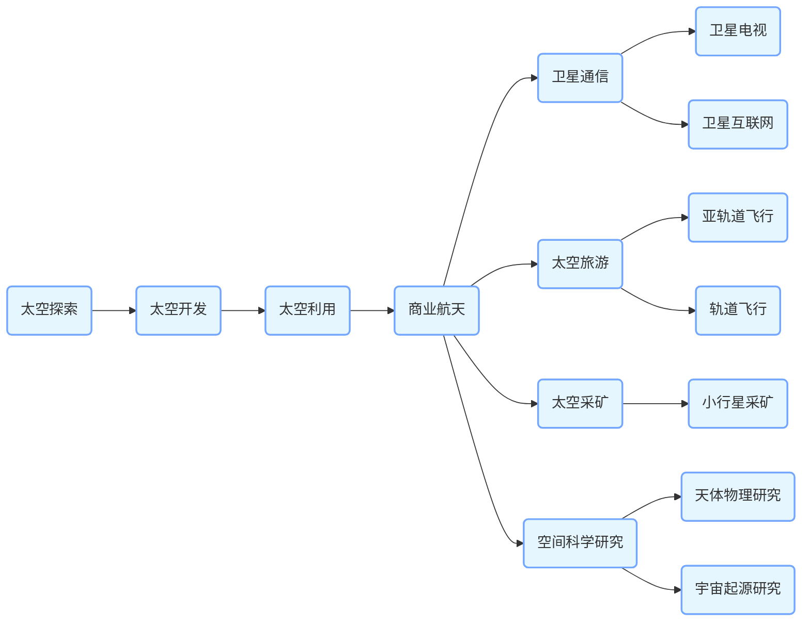

# 太空经济：新兴投资领域的风险与回报

> 关键词：太空经济、投资领域、风险、回报、新兴产业、航天技术、商业航天

> 摘要：本文围绕太空经济这一新兴投资领域展开深入探讨。首先介绍太空经济的背景，包括其目的和范围、预期读者等内容。接着阐述太空经济的核心概念与联系，详细讲解核心算法原理及具体操作步骤，呈现相关数学模型和公式。通过项目实战案例，展示太空经济投资在实际中的代码实现与解读。分析太空经济的实际应用场景，推荐相关的学习资源、开发工具框架以及论文著作。最后总结太空经济未来发展趋势与挑战，解答常见问题并提供扩展阅读和参考资料，旨在为投资者全面剖析太空经济投资领域的风险与回报。

## 1. 背景介绍 
### 1.1 目的和范围
太空经济作为一个新兴的经济领域，近年来受到了广泛的关注。其目的在于探索太空资源的开发利用，推动航天技术的商业化应用，为人类社会创造新的经济增长点。本文章的范围将涵盖太空经济的各个方面，包括卫星通信、太空旅游、太空采矿、空间科学研究等领域的投资风险与回报分析。通过对这些领域的研究，帮助投资者更好地了解太空经济投资的特点和规律，为其投资决策提供参考。

### 1.2 预期读者
本文预期读者主要包括对太空经济投资感兴趣的个人投资者、金融机构从业者、航天企业管理人员以及相关领域的研究人员。个人投资者希望通过了解太空经济投资的风险与回报，寻找新的投资机会；金融机构从业者需要掌握太空经济领域的投资动态，为客户提供专业的投资建议；航天企业管理人员则关注如何吸引投资，推动企业的发展；相关领域的研究人员可以从本文中获取太空经济投资的最新研究成果和实践经验。

### 1.3 文档结构概述
本文将按照以下结构进行阐述：首先介绍太空经济的背景，包括目的、范围、预期读者等内容；接着深入探讨太空经济的核心概念与联系，通过文本示意图和 Mermaid 流程图展示其架构；然后讲解核心算法原理及具体操作步骤，结合 Python 源代码进行详细阐述；再呈现相关的数学模型和公式，并举例说明；通过项目实战案例，展示太空经济投资在实际中的代码实现与解读；分析太空经济的实际应用场景；推荐相关的学习资源、开发工具框架以及论文著作；最后总结太空经济未来发展趋势与挑战，解答常见问题并提供扩展阅读和参考资料。

### 1.4 术语表
#### 1.4.1 核心术语定义
- **太空经济**：指包括太空探索、开发、利用等活动所创造的产品、服务和市场，以及这些活动对经济的带动作用。
- **商业航天**：指以营利为目的，运用航天技术开展的商业活动，包括卫星发射、卫星应用、太空旅游等。
- **太空资源**：指存在于太空环境中的各种自然资源，如小行星上的矿产资源、太阳能等。
- **卫星通信**：指利用人造地球卫星作为中继站进行的通信活动，包括卫星电话、卫星电视、卫星互联网等。
- **太空旅游**：指为游客提供太空飞行体验的商业活动，包括亚轨道飞行、轨道飞行等。

#### 1.4.2 相关概念解释
- **航天技术**：指用于探索、开发和利用太空的一系列技术，包括航天器设计、制造、发射、运行等技术。
- **空间科学研究**：指对太空环境、天体物理、宇宙起源等方面的科学研究活动。
- **太空基础设施**：指为太空活动提供支持的各种设施，如卫星地面站、航天发射场等。

#### 1.4.3 缩略词列表
- **GPS**：Global Positioning System，全球定位系统
- **GIS**：Geographic Information System，地理信息系统
- **LEO**：Low Earth Orbit，近地轨道
- **GEO**：Geostationary Earth Orbit，地球静止轨道

## 2. 核心概念与联系 
太空经济是一个复杂的系统，涉及多个领域和环节。其核心概念包括太空探索、太空开发、太空利用等，这些概念之间相互关联、相互影响。

### 核心概念原理和架构的文本示意图
太空经济的核心概念原理和架构可以用以下文本示意图表示：

太空探索是太空经济的基础，通过对太空环境、天体物理等方面的研究，为太空开发和利用提供科学依据。太空开发则是在太空探索的基础上，对太空资源进行开发和利用，包括太空采矿、太空能源开发等。太空利用则是将太空开发的成果应用于实际生活中，如卫星通信、太空旅游等。

### Mermaid 流程图


从流程图中可以看出，太空探索是整个太空经济的起点，通过太空探索获得的知识和技术为太空开发和利用提供了支持。太空开发和利用则进一步推动了商业航天的发展，商业航天涵盖了卫星通信、太空旅游、太空采矿、空间科学研究等多个领域，这些领域又各自包含了不同的应用和研究方向。

## 3. 核心算法原理 & 具体操作步骤 
在太空经济投资中，有一些核心算法原理可以帮助投资者评估投资项目的风险与回报。以下以净现值（NPV）算法为例进行详细阐述。

### 净现值（NPV）算法原理
净现值是指投资项目在未来各期现金流量的现值之和与初始投资之间的差额。其计算公式为：

$$NPV = \sum_{t=0}^{n} \frac{CF_t}{(1 + r)^t} - I_0$$

其中，$NPV$ 表示净现值，$CF_t$ 表示第 $t$ 期的现金流量，$r$ 表示折现率，$I_0$ 表示初始投资，$n$ 表示项目的寿命期。

净现值算法的原理是将投资项目未来各期的现金流量按照一定的折现率折现到当前时刻，然后与初始投资进行比较。如果净现值大于零，则说明该投资项目在经济上是可行的，具有投资价值；如果净现值小于零，则说明该投资项目在经济上不可行，不具有投资价值。

### Python 源代码实现
```python
def npv(cash_flows, discount_rate):
    """
    计算净现值
    :param cash_flows: 现金流量列表，第一个元素为初始投资（负数）
    :param discount_rate: 折现率
    :return: 净现值
    """
    npv_value = 0
    for t, cf in enumerate(cash_flows):
        npv_value += cf / (1 + discount_rate) ** t
    return npv_value

# 示例
initial_investment = -1000000  # 初始投资
cash_flows = [initial_investment, 200000, 300000, 400000, 500000]  # 各期现金流量
discount_rate = 0.1  # 折现率

npv_result = npv(cash_flows, discount_rate)
print(f"净现值: {npv_result}")
```

### 具体操作步骤
1. **确定现金流量**：首先需要确定投资项目在未来各期的现金流量，包括初始投资和各期的收入、支出等。初始投资通常为负数，表示现金的流出；各期的收入为正数，表示现金的流入；各期的支出为负数，表示现金的流出。
2. **确定折现率**：折现率是将未来现金流量折现到当前时刻的比率，通常根据市场利率、投资风险等因素确定。折现率越高，未来现金流量的现值越低；折现率越低，未来现金流量的现值越高。
3. **计算净现值**：将各期的现金流量按照确定的折现率折现到当前时刻，然后将它们相加，再减去初始投资，即可得到净现值。
4. **决策判断**：根据净现值的结果进行决策判断。如果净现值大于零，则说明该投资项目在经济上是可行的，具有投资价值；如果净现值小于零，则说明该投资项目在经济上不可行，不具有投资价值。

## 4. 数学模型和公式 & 详细讲解 & 举例说明 
### 内部收益率（IRR）数学模型和公式
内部收益率是指使投资项目净现值为零的折现率。其数学模型可以表示为：

$$\sum_{t=0}^{n} \frac{CF_t}{(1 + IRR)^t} - I_0 = 0$$

其中，$IRR$ 表示内部收益率，$CF_t$ 表示第 $t$ 期的现金流量，$I_0$ 表示初始投资，$n$ 表示项目的寿命期。

### 详细讲解
内部收益率是一个重要的投资决策指标，它反映了投资项目的实际收益率。当内部收益率大于投资者要求的最低收益率时，说明该投资项目在经济上是可行的，具有投资价值；当内部收益率小于投资者要求的最低收益率时，说明该投资项目在经济上不可行，不具有投资价值。

内部收益率的计算通常采用试错法或迭代法。试错法是通过不断尝试不同的折现率，直到找到使净现值为零的折现率；迭代法是通过不断迭代计算，逐步逼近使净现值为零的折现率。

### 举例说明
假设某投资项目的初始投资为 $-1000000$ 元，未来各期的现金流量分别为 $200000$ 元、$300000$ 元、$400000$ 元、$500000$ 元。使用 Python 代码计算该项目的内部收益率：

```python
import numpy as np

cash_flows = [-1000000, 200000, 300000, 400000, 500000]
irr = np.irr(cash_flows)
print(f"内部收益率: {irr * 100}%")
```

在上述代码中，使用 `numpy` 库的 `irr` 函数计算内部收益率。运行代码后，即可得到该投资项目的内部收益率。

### 投资回收期（PP）数学模型和公式
投资回收期是指投资项目收回初始投资所需的时间。其数学模型可以表示为：

$$PP = \text{累计净现金流量开始出现正值的年份数} - 1 + \frac{\text{上一年累计净现金流量的绝对值}}{\text{当年净现金流量}}$$

### 详细讲解
投资回收期是一个简单直观的投资决策指标，它反映了投资项目的资金回收速度。投资回收期越短，说明投资项目的资金回收速度越快，投资风险越小；投资回收期越长，说明投资项目的资金回收速度越慢，投资风险越大。

### 举例说明
假设某投资项目的初始投资为 $-1000000$ 元，未来各期的现金流量分别为 $200000$ 元、$300000$ 元、$400000$ 元、$500000$ 元。计算该项目的投资回收期：

| 年份 | 净现金流量 | 累计净现金流量 |
| ---- | ---- | ---- |
| 0 | -1000000 | -1000000 |
| 1 | 200000 | -800000 |
| 2 | 300000 | -500000 |
| 3 | 400000 | -100000 |
| 4 | 500000 | 400000 |

根据公式计算投资回收期：

$PP = 4 - 1 + \frac{100000}{500000} = 3.2$（年）

因此，该投资项目的投资回收期为 $3.2$ 年。

## 5. 项目实战：代码实际案例和详细解释说明 
### 5.1  开发环境搭建
在进行太空经济投资项目实战之前，需要搭建相应的开发环境。以下是具体的搭建步骤：

1. **安装 Python**：Python 是一种广泛使用的编程语言，在数据分析、金融计算等领域有着广泛的应用。可以从 Python 官方网站（https://www.python.org/downloads/）下载并安装 Python。
2. **安装必要的库**：在进行太空经济投资项目实战时，需要使用一些 Python 库，如 `numpy`、`pandas`、`matplotlib` 等。可以使用 `pip` 命令进行安装：

```sh
pip install numpy pandas matplotlib
```

3. **选择开发工具**：可以选择自己喜欢的开发工具，如 PyCharm、Jupyter Notebook 等。PyCharm 是一款功能强大的 Python 集成开发环境，适合进行大型项目的开发；Jupyter Notebook 是一种交互式开发环境，适合进行数据分析和实验。

### 5.2  源代码详细实现和代码解读
以下是一个太空经济投资项目的实战案例，通过计算净现值、内部收益率和投资回收期来评估项目的可行性。

```python
import numpy as np
import pandas as pd
import matplotlib.pyplot as plt

# 定义项目参数
initial_investment = -1000000  # 初始投资
cash_flows = [200000, 300000, 400000, 500000, 600000]  # 各期现金流量
discount_rate = 0.1  # 折现率

# 计算净现值
def npv(cash_flows, discount_rate):
    npv_value = initial_investment
    for t, cf in enumerate(cash_flows):
        npv_value += cf / (1 + discount_rate) ** (t + 1)
    return npv_value

# 计算内部收益率
irr = np.irr([initial_investment] + cash_flows)

# 计算投资回收期
cumulative_cash_flows = np.cumsum([initial_investment] + cash_flows)
payback_period = None
for i in range(len(cumulative_cash_flows)):
    if cumulative_cash_flows[i] >= 0:
        payback_period = i - 1 + abs(cumulative_cash_flows[i - 1]) / cash_flows[i - 1]
        break

# 输出结果
print(f"净现值: {npv(cash_flows, discount_rate)}")
print(f"内部收益率: {irr * 100}%")
print(f"投资回收期: {payback_period} 年")

# 绘制现金流量图
years = range(len(cash_flows) + 1)
cash_flows_with_initial = [initial_investment] + cash_flows
plt.bar(years, cash_flows_with_initial)
plt.xlabel('年份')
plt.ylabel('现金流量')
plt.title('太空经济投资项目现金流量图')
plt.show()
```

### 代码解读与分析
1. **导入必要的库**：导入 `numpy`、`pandas` 和 `matplotlib` 库，分别用于数值计算、数据处理和数据可视化。
2. **定义项目参数**：定义初始投资、各期现金流量和折现率。
3. **计算净现值**：定义 `npv` 函数，根据净现值的计算公式计算项目的净现值。
4. **计算内部收益率**：使用 `numpy` 库的 `irr` 函数计算项目的内部收益率。
5. **计算投资回收期**：通过计算累计净现金流量，找到累计净现金流量开始出现正值的年份，然后根据投资回收期的计算公式计算投资回收期。
6. **输出结果**：打印项目的净现值、内部收益率和投资回收期。
7. **绘制现金流量图**：使用 `matplotlib` 库绘制项目的现金流量图，直观地展示项目的现金流量情况。

通过这个实战案例，可以更好地理解太空经济投资项目的评估方法和流程，为实际投资决策提供参考。

## 6. 实际应用场景 
太空经济的实际应用场景非常广泛，以下是一些主要的应用场景：

### 卫星通信
卫星通信是太空经济中最成熟的应用领域之一。通过卫星通信，可以实现全球范围内的通信覆盖，包括卫星电话、卫星电视、卫星互联网等。卫星通信具有覆盖范围广、不受地理条件限制等优点，在偏远地区通信、应急通信、海上通信等方面发挥着重要作用。

### 太空旅游
太空旅游是近年来兴起的一种新兴旅游方式。随着航天技术的不断发展，越来越多的人有机会体验太空飞行的乐趣。太空旅游包括亚轨道飞行、轨道飞行等不同形式，可以让游客近距离感受太空的魅力。太空旅游不仅可以为游客带来独特的旅游体验，还可以推动航天技术的发展和商业化应用。

### 太空采矿
太空采矿是指对太空中的矿产资源进行开采和利用。太空中存在着丰富的矿产资源，如小行星上的金属矿产、月球上的氦 - 3 等。太空采矿具有巨大的经济潜力，可以为人类社会提供新的资源保障。然而，太空采矿也面临着技术难度大、成本高、法律和伦理等方面的挑战。

### 空间科学研究
空间科学研究是太空经济的重要组成部分。通过空间科学研究，可以深入了解太空环境、天体物理、宇宙起源等方面的知识，为人类认识宇宙和探索太空提供科学依据。空间科学研究包括天文观测、空间物理实验、生命科学实验等不同领域，需要使用各种先进的空间科学仪器和设备。

### 地球观测
地球观测是指利用卫星等航天器对地球进行观测和监测。通过地球观测，可以获取地球的地形、地貌、气象、环境等方面的信息，为资源管理、环境保护、灾害监测等提供数据支持。地球观测在农业、林业、水利、气象等领域有着广泛的应用。

## 7. 工具和资源推荐
### 7.1 学习资源推荐
#### 7.1.1 书籍推荐
- 《太空经济：开启人类经济发展新纪元》：本书全面介绍了太空经济的概念、发展历程、应用领域和未来趋势，是一本了解太空经济的权威著作。
- 《航天技术概论》：本书系统地介绍了航天技术的基本原理、航天器设计、发射和运行等方面的知识，是学习航天技术的经典教材。
- 《投资学》：本书详细介绍了投资的基本理论、方法和策略，是学习投资知识的必备书籍。

#### 7.1.2 在线课程
- Coursera 平台上的 “Space Economics and Policy” 课程：该课程由美国斯坦福大学的教授授课，介绍了太空经济的基本概念、市场结构、政策法规等方面的知识。
- edX 平台上的 “Introduction to Space Systems” 课程：该课程由美国麻省理工学院的教授授课，介绍了航天系统的基本原理、设计和运行等方面的知识。
- 中国大学 MOOC 平台上的 “投资学原理” 课程：该课程由国内知名高校的教授授课，介绍了投资学的基本理论、方法和策略。

#### 7.1.3 技术博客和网站
- 太空探索技术公司（SpaceX）官方博客：该博客介绍了 SpaceX 公司的最新技术进展、项目动态和商业计划，是了解商业航天发展的重要渠道。
- 欧洲航天局（ESA）官方网站：该网站提供了欧洲航天局的最新研究成果、项目信息和科普资料，是了解空间科学研究的重要资源。
- 中国航天科技集团公司官方网站：该网站介绍了中国航天科技集团公司的最新发展动态、科研成果和商业应用，是了解中国航天发展的重要窗口。

### 7.2 开发工具框架推荐
#### 7.2.1 IDE和编辑器
- PyCharm：一款功能强大的 Python 集成开发环境，适合进行大型项目的开发。
- Jupyter Notebook：一种交互式开发环境，适合进行数据分析和实验。
- Visual Studio Code：一款轻量级的代码编辑器，支持多种编程语言，具有丰富的插件生态系统。

#### 7.2.2 调试和性能分析工具
- PyCharm 自带的调试工具：可以方便地进行代码调试和错误排查。
- `cProfile` 模块：Python 自带的性能分析工具，可以分析代码的运行时间和性能瓶颈。
- `memory_profiler` 库：可以分析代码的内存使用情况，帮助优化内存性能。

#### 7.2.3 相关框架和库
- `numpy`：一个用于数值计算的 Python 库，提供了高效的数组操作和数学函数。
- `pandas`：一个用于数据处理和分析的 Python 库，提供了强大的数据结构和数据处理功能。
- `matplotlib`：一个用于数据可视化的 Python 库，提供了丰富的绘图函数和工具。

### 7.3 相关论文著作推荐
#### 7.3.1 经典论文
- “The Economic Potential of Space Resources”：该论文探讨了太空资源开发的经济潜力和前景，是太空经济领域的经典论文之一。
- “Commercial Spaceflight: A New Era of Exploration and Innovation”：该论文介绍了商业航天的发展历程、现状和未来趋势，对商业航天的发展具有重要的指导意义。
- “The Role of Space Technology in Sustainable Development”：该论文探讨了航天技术在可持续发展中的作用和贡献，为航天技术的应用和发展提供了新的思路。

#### 7.3.2 最新研究成果
- 国际宇航科学院（IAA）的相关研究报告：该报告涵盖了太空经济、航天技术、空间科学等领域的最新研究成果和发展趋势。
- 美国国家航空航天局（NASA）的科研论文：该论文介绍了 NASA 在航天技术、空间科学等领域的最新研究成果和项目进展。
- 中国科学院的相关研究论文：该论文介绍了中国科学院在航天技术、空间科学等领域的最新研究成果和创新实践。

#### 7.3.3 应用案例分析
- SpaceX 公司的商业航天项目案例分析：通过分析 SpaceX 公司的猎鹰火箭发射、龙飞船载人航天等项目，了解商业航天的商业模式和运营策略。
- 欧洲航天局的空间科学研究项目案例分析：通过分析欧洲航天局的盖亚卫星、普朗克卫星等空间科学研究项目，了解空间科学研究的方法和技术。
- 中国航天科技集团公司的卫星应用项目案例分析：通过分析中国航天科技集团公司的北斗卫星导航系统、高分卫星等卫星应用项目，了解卫星应用的技术和市场需求。

## 8. 总结：未来发展趋势与挑战
### 未来发展趋势
- **商业化进程加速**：随着航天技术的不断进步和成本的不断降低，太空经济的商业化进程将加速。越来越多的商业企业将进入太空领域，开展卫星通信、太空旅游、太空采矿等商业活动，推动太空经济的快速发展。
- **技术创新不断涌现**：未来，太空经济领域将不断涌现出新技术、新方法和新应用。例如，可重复使用火箭技术、太空机器人技术、太空3D打印技术等的发展，将为太空经济的发展带来新的机遇和挑战。
- **国际合作日益加强**：太空经济是一个全球性的产业，需要各国之间的合作和交流。未来，国际间在太空经济领域的合作将日益加强，共同开展太空探索、开发和利用等活动，实现资源共享、优势互补。
- **应用领域不断拓展**：太空经济的应用领域将不断拓展，除了现有的卫星通信、太空旅游、太空采矿等领域外，还将涉及到太空医疗、太空农业、太空能源等新的领域，为人类社会的发展带来更多的福祉。

### 挑战
- **技术难题**：太空经济的发展面临着许多技术难题，如太空环境的复杂性、航天器的可靠性和安全性、太空资源的开发和利用技术等。解决这些技术难题需要大量的科研投入和技术创新。
- **成本高昂**：太空经济的发展需要大量的资金投入，包括航天器的研发、制造、发射和运行等方面的费用。高昂的成本限制了太空经济的发展速度和规模，需要寻找降低成本的有效途径。
- **法律和政策不完善**：太空经济是一个新兴的领域，相关的法律和政策还不完善。例如，太空资源的所有权和开发权、太空活动的责任和赔偿等问题，需要制定相应的法律和政策来规范和保障。
- **国际竞争激烈**：太空经济是一个具有战略意义的领域，各国都在加大对太空经济的投入和发展力度。国际竞争激烈，需要不断提高自身的竞争力，才能在国际市场上占据一席之地。

## 9. 附录：常见问题与解答
### 问题 1：太空经济投资的风险主要有哪些？
答：太空经济投资的风险主要包括技术风险、市场风险、政策风险、法律风险等。技术风险是指由于航天技术的复杂性和不确定性，导致投资项目无法达到预期目标的风险；市场风险是指由于市场需求的变化、竞争加剧等原因，导致投资项目的收益无法达到预期目标的风险；政策风险是指由于国家政策的变化，导致投资项目的合法性和可行性受到影响的风险；法律风险是指由于相关法律和政策的不完善，导致投资项目的权益无法得到保障的风险。

### 问题 2：太空经济投资的回报主要有哪些？
答：太空经济投资的回报主要包括经济效益、社会效益和环境效益等。经济效益是指投资项目通过商业化运营所获得的利润和收益；社会效益是指投资项目对社会发展和进步所做出的贡献，如提高通信服务水平、促进科学技术进步等；环境效益是指投资项目对环境保护和可持续发展所做出的贡献，如利用太空资源减少对地球资源的依赖等。

### 问题 3：如何评估太空经济投资项目的可行性？
答：评估太空经济投资项目的可行性可以从技术可行性、经济可行性、环境可行性和社会可行性等方面进行。技术可行性是指投资项目所采用的技术是否成熟、可靠，是否能够实现预期目标；经济可行性是指投资项目的成本和收益是否合理，是否具有投资价值；环境可行性是指投资项目对环境的影响是否在可接受的范围内，是否符合环境保护要求；社会可行性是指投资项目对社会的影响是否积极、正面，是否得到社会的认可和支持。

### 问题 4：太空经济投资有哪些适合个人投资者的方式？
答：适合个人投资者的太空经济投资方式主要包括投资太空经济相关的股票、基金、债券等金融产品，以及参与太空经济相关的众筹项目等。投资金融产品可以通过证券市场进行，具有流动性强、风险相对较低等优点；参与众筹项目可以直接参与太空经济项目的投资和发展，具有投资门槛低、收益潜力大等优点。

## 10. 扩展阅读 & 参考资料
### 扩展阅读
- 《人类太空飞行史》：本书详细介绍了人类太空飞行的发展历程、重要事件和技术突破，是了解人类太空探索历史的重要书籍。
- 《太空探索的未来》：本书探讨了太空探索的未来发展方向和趋势，对太空经济的发展具有重要的启示意义。
- 《商业航天：未来的经济引擎》：本书介绍了商业航天的发展现状、商业模式和未来前景，是了解商业航天发展的重要参考书籍。

### 参考资料
- 国际宇航联合会（IAF）官方网站：https://www.iafastro.org/
- 美国联邦航空管理局（FAA）官方网站：https://www.faa.gov/
- 中国国家航天局（CNSA）官方网站：https://www.cnsa.gov.cn/
- 《太空经济发展报告》：由相关研究机构发布的关于太空经济发展的年度报告，提供了太空经济领域的最新数据和研究成果。