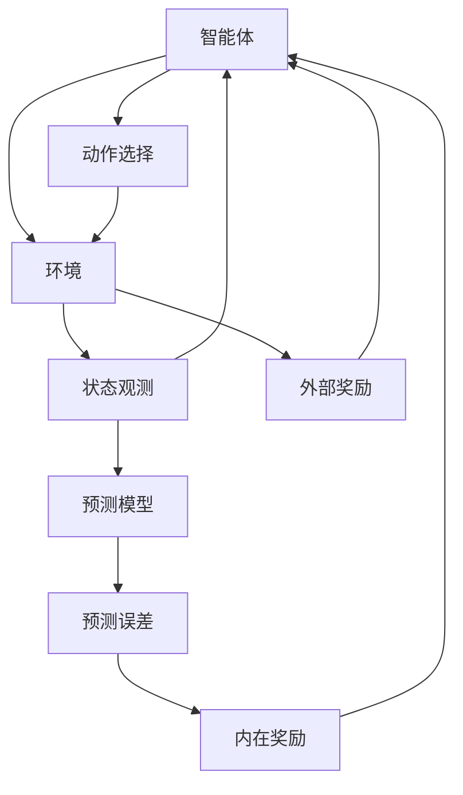

# 好奇心驱动的强化学习在机器人探索中的应用

> 关键词：好奇心驱动、强化学习、机器人探索、内在动机、环境交互

> 摘要：本文聚焦于好奇心驱动的强化学习在机器人探索领域的应用。首先介绍了该研究的背景和相关概念，阐述了好奇心驱动强化学习的核心原理与架构。通过Python代码详细讲解了核心算法的实现步骤，并给出了相关的数学模型和公式。接着通过项目实战展示了在实际场景中的代码实现和解读。探讨了其在不同场景下的实际应用，推荐了相关的学习资源、开发工具和论文著作。最后对未来发展趋势与挑战进行了总结，并在附录中解答了常见问题。旨在全面深入地探讨好奇心驱动的强化学习如何推动机器人探索技术的发展。

## 1. 背景介绍 
### 1.1 目的和范围
随着人工智能和机器人技术的不断发展，机器人在复杂环境中的自主探索能力成为了研究的热点。传统的强化学习方法在处理未知环境时往往面临着效率低下、容易陷入局部最优等问题。好奇心驱动的强化学习作为一种新兴的方法，通过引入内在动机机制，激励机器人主动探索未知环境，从而提高其探索效率和学习能力。本文的目的在于深入探讨好奇心驱动的强化学习在机器人探索中的应用原理、算法实现和实际应用场景，为相关研究和实践提供理论和技术支持。

### 1.2 预期读者
本文预期读者包括对机器人技术、强化学习、人工智能等领域感兴趣的研究人员、工程师、学生以及相关从业者。希望通过本文的介绍，能够帮助读者了解好奇心驱动的强化学习在机器人探索中的应用原理和方法，为他们的研究和实践提供参考。

### 1.3 文档结构概述
本文共分为十个部分。第一部分为背景介绍，包括目的和范围、预期读者、文档结构概述和术语表。第二部分介绍核心概念与联系，包括好奇心驱动的强化学习的原理和架构。第三部分详细讲解核心算法原理和具体操作步骤，通过Python代码进行阐述。第四部分给出数学模型和公式，并进行详细讲解和举例说明。第五部分通过项目实战展示代码实际案例和详细解释说明。第六部分探讨实际应用场景。第七部分推荐相关的工具和资源，包括学习资源、开发工具框架和相关论文著作。第八部分总结未来发展趋势与挑战。第九部分为附录，解答常见问题。第十部分提供扩展阅读和参考资料。

### 1.4 术语表
#### 1.4.1 核心术语定义
- **好奇心驱动的强化学习（Curiosity-Driven Reinforcement Learning）**：一种强化学习方法，通过引入内在动机机制，激励智能体主动探索未知环境，以获得更多的知识和经验。
- **强化学习（Reinforcement Learning）**：一种机器学习范式，智能体通过与环境进行交互，根据环境反馈的奖励信号来学习最优行为策略。
- **机器人探索（Robot Exploration）**：机器人在未知环境中自主移动和感知，以获取环境信息和完成特定任务的过程。
- **内在动机（Intrinsic Motivation）**：智能体内部产生的一种驱动力，用于激励智能体主动探索未知环境，而不依赖于外部奖励信号。
- **环境交互（Environment Interaction）**：智能体与环境之间进行信息交换和动作执行的过程。

#### 1.4.2 相关概念解释
- **奖励函数（Reward Function）**：在强化学习中，奖励函数用于评估智能体的行为表现，为智能体提供反馈信号。传统的奖励函数通常基于外部任务目标，而好奇心驱动的强化学习中还引入了内在奖励函数。
- **策略（Policy）**：智能体在不同状态下选择动作的规则。在强化学习中，智能体的目标是学习最优策略，以最大化累积奖励。
- **状态（State）**：环境的一种描述，用于表示智能体当前所处的情境。智能体根据当前状态选择动作，并根据动作的执行结果更新状态。
- **动作（Action）**：智能体在某个状态下可以执行的操作。智能体通过选择不同的动作与环境进行交互。

#### 1.4.3 缩略词列表
- **RL**：Reinforcement Learning（强化学习）
- **CDRL**：Curiosity-Driven Reinforcement Learning（好奇心驱动的强化学习）
- **AI**：Artificial Intelligence（人工智能）
- **ROS**：Robot Operating System（机器人操作系统）

## 2. 核心概念与联系 

### 2.1 好奇心驱动的强化学习原理
好奇心驱动的强化学习的核心思想是引入内在动机机制，激励智能体主动探索未知环境。在传统的强化学习中，智能体的学习主要依赖于外部奖励信号，这可能导致智能体在探索过程中过于保守，只关注已知的高回报区域，而忽略了未知的环境。好奇心驱动的强化学习通过计算智能体对环境的预测误差，将其作为内在奖励信号，激励智能体探索那些能够带来更大预测误差的区域，从而增加对未知环境的探索。

### 2.2 架构示意图
下面是好奇心驱动的强化学习的架构示意图：



### 2.3 各部分联系解释
- **智能体**：智能体是学习和决策的主体，它通过与环境进行交互来学习最优策略。
- **环境**：环境是智能体所处的外部世界，它根据智能体的动作产生相应的状态和奖励信号。
- **状态观测**：智能体通过传感器获取环境的状态信息，作为决策的依据。
- **动作选择**：智能体根据当前状态和策略选择合适的动作，与环境进行交互。
- **外部奖励**：环境根据智能体的动作执行结果给出的奖励信号，通常与任务目标相关。
- **预测模型**：用于预测智能体在执行动作后环境状态的变化。
- **预测误差**：预测模型的预测结果与实际观测结果之间的差异。
- **内在奖励**：根据预测误差计算得到的奖励信号，用于激励智能体探索未知环境。

## 3. 核心算法原理 & 具体操作步骤 

### 3.1 算法原理
好奇心驱动的强化学习算法主要包括两个关键部分：预测模型和策略学习。预测模型用于预测智能体在执行动作后环境状态的变化，通过计算预测误差来生成内在奖励信号。策略学习则根据外部奖励和内在奖励信号来学习最优策略。

### 3.2 具体操作步骤
1. **初始化**：初始化智能体的策略网络、预测模型网络的参数，以及环境的初始状态。
2. **状态观测**：智能体通过传感器获取当前环境的状态信息。
3. **动作选择**：智能体根据当前状态和策略网络选择一个动作。
4. **环境交互**：智能体执行选择的动作，环境根据动作产生新的状态和外部奖励信号。
5. **预测误差计算**：使用预测模型对新的状态进行预测，计算预测结果与实际观测结果之间的误差，作为内在奖励信号。
6. **奖励合并**：将外部奖励和内在奖励信号合并，得到总的奖励信号。
7. **策略更新**：根据总的奖励信号，使用强化学习算法（如A2C、PPO等）更新策略网络的参数。
8. **预测模型更新**：根据预测误差，使用优化算法（如梯度下降）更新预测模型网络的参数。
9. **重复步骤2 - 8**：直到达到终止条件（如达到最大步数、任务完成等）。

### 3.3 Python代码实现
下面是一个简单的好奇心驱动的强化学习算法的Python代码示例：

```python
import torch
import torch.nn as nn
import torch.optim as optim
import numpy as np

# 定义预测模型
class PredictionModel(nn.Module):
    def __init__(self, state_dim, action_dim):
        super(PredictionModel, self).__init__()
        self.fc1 = nn.Linear(state_dim + action_dim, 128)
        self.fc2 = nn.Linear(128, state_dim)

    def forward(self, state, action):
        x = torch.cat([state, action], dim=1)
        x = torch.relu(self.fc1(x))
        x = self.fc2(x)
        return x

# 定义策略网络
class PolicyNetwork(nn.Module):
    def __init__(self, state_dim, action_dim):
        super(PolicyNetwork, self).__init__()
        self.fc1 = nn.Linear(state_dim, 128)
        self.fc2 = nn.Linear(128, action_dim)

    def forward(self, state):
        x = torch.relu(self.fc1(state))
        x = torch.softmax(self.fc2(x), dim=1)
        return x

# 定义环境
class Environment:
    def __init__(self):
        self.state_dim = 4
        self.action_dim = 2
        self.reset()

    def reset(self):
        self.state = np.random.randn(self.state_dim)
        return self.state

    def step(self, action):
        # 简单的环境动态
        self.state = self.state + action
        reward = np.sum(self.state)  # 外部奖励
        done = False
        return self.state, reward, done

# 初始化模型和环境
state_dim = 4
action_dim = 2
prediction_model = PredictionModel(state_dim, action_dim)
policy_network = PolicyNetwork(state_dim, action_dim)
environment = Environment()

# 定义优化器
prediction_optimizer = optim.Adam(prediction_model.parameters(), lr=0.001)
policy_optimizer = optim.Adam(policy_network.parameters(), lr=0.001)

# 训练循环
num_episodes = 1000
for episode in range(num_episodes):
    state = environment.reset()
    state = torch.FloatTensor(state).unsqueeze(0)
    done = False
    total_reward = 0

    while not done:
        # 动作选择
        action_probs = policy_network(state)
        action = torch.multinomial(action_probs, 1).item()
        action_tensor = torch.FloatTensor([action]).unsqueeze(0)

        # 环境交互
        next_state, external_reward, done = environment.step(action)
        next_state = torch.FloatTensor(next_state).unsqueeze(0)

        # 预测误差计算
        predicted_next_state = prediction_model(state, action_tensor)
        prediction_error = torch.mean((predicted_next_state - next_state) ** 2)
        intrinsic_reward = prediction_error.item()

        # 奖励合并
        total_reward += external_reward + intrinsic_reward

        # 策略更新
        log_prob = torch.log(action_probs.squeeze(0)[action])
        policy_loss = -log_prob * (external_reward + intrinsic_reward)
        policy_optimizer.zero_grad()
        policy_loss.backward()
        policy_optimizer.step()

        # 预测模型更新
        prediction_loss = prediction_error
        prediction_optimizer.zero_grad()
        prediction_loss.backward()
        prediction_optimizer.step()

        state = next_state

    print(f"Episode {episode}: Total Reward = {total_reward}")
```

### 3.4 代码解释
- **PredictionModel**：预测模型，用于预测智能体在执行动作后环境状态的变化。
- **PolicyNetwork**：策略网络，用于根据当前状态选择动作。
- **Environment**：模拟的环境，包含状态维度、动作维度和环境动态。
- **训练循环**：在每个episode中，智能体与环境进行交互，计算预测误差和内在奖励，更新策略网络和预测模型的参数。

## 4. 数学模型和公式 & 详细讲解 & 举例说明 

### 4.1 预测误差计算
预测误差用于衡量预测模型的预测结果与实际观测结果之间的差异。常用的预测误差计算方法是均方误差（Mean Squared Error, MSE），公式如下：

$$
\text{MSE} = \frac{1}{n} \sum_{i=1}^{n} (y_i - \hat{y}_i)^2
$$

其中，$y_i$ 是实际观测结果，$\hat{y}_i$ 是预测结果，$n$ 是样本数量。

### 4.2 内在奖励计算
内在奖励通常根据预测误差来计算，公式如下：

$$
r_{int} = \alpha \cdot \text{MSE}
$$

其中，$r_{int}$ 是内在奖励，$\alpha$ 是一个超参数，用于控制内在奖励的权重。

### 4.3 总奖励计算
总奖励是外部奖励和内在奖励的加权和，公式如下：

$$
r_{total} = r_{ext} + \beta \cdot r_{int}
$$

其中，$r_{total}$ 是总奖励，$r_{ext}$ 是外部奖励，$\beta$ 是一个超参数，用于控制内在奖励在总奖励中的权重。

### 4.4 举例说明
假设预测模型对一个状态的预测结果为 $\hat{y} = [0.1, 0.2, 0.3]$，实际观测结果为 $y = [0.2, 0.3, 0.4]$，样本数量 $n = 3$。则预测误差（MSE）为：

$$
\text{MSE} = \frac{1}{3} \left[ (0.2 - 0.1)^2 + (0.3 - 0.2)^2 + (0.4 - 0.3)^2 \right] = \frac{1}{3} \times 0.03 = 0.01
$$

假设 $\alpha = 1$，则内在奖励 $r_{int} = 1 \times 0.01 = 0.01$。假设外部奖励 $r_{ext} = 0.5$，$\beta = 0.5$，则总奖励 $r_{total} = 0.5 + 0.5 \times 0.01 = 0.505$。

## 5. 项目实战：代码实际案例和详细解释说明 

### 5.1  开发环境搭建
#### 5.1.1 安装Python
首先，确保你已经安装了Python 3.x版本。可以从Python官方网站（https://www.python.org/downloads/）下载并安装。

#### 5.1.2 安装必要的库
使用以下命令安装必要的库：

```sh
pip install torch numpy
```

### 5.2  源代码详细实现和代码解读
以下是一个更完整的好奇心驱动的强化学习项目的源代码，用于机器人在二维网格环境中的探索：

```python
import torch
import torch.nn as nn
import torch.optim as optim
import numpy as np
import random

# 定义预测模型
class PredictionModel(nn.Module):
    def __init__(self, state_dim, action_dim):
        super(PredictionModel, self).__init__()
        self.fc1 = nn.Linear(state_dim + action_dim, 128)
        self.fc2 = nn.Linear(128, state_dim)

    def forward(self, state, action):
        x = torch.cat([state, action], dim=1)
        x = torch.relu(self.fc1(x))
        x = self.fc2(x)
        return x

# 定义策略网络
class PolicyNetwork(nn.Module):
    def __init__(self, state_dim, action_dim):
        super(PolicyNetwork, self).__init__()
        self.fc1 = nn.Linear(state_dim, 128)
        self.fc2 = nn.Linear(128, action_dim)

    def forward(self, state):
        x = torch.relu(self.fc1(state))
        x = torch.softmax(self.fc2(x), dim=1)
        return x

# 定义二维网格环境
class GridEnvironment:
    def __init__(self, grid_size=10):
        self.grid_size = grid_size
        self.state_dim = 2  # 机器人的坐标 (x, y)
        self.action_dim = 4  # 动作：上、下、左、右
        self.reset()

    def reset(self):
        self.x = random.randint(0, self.grid_size - 1)
        self.y = random.randint(0, self.grid_size - 1)
        return np.array([self.x, self.y])

    def step(self, action):
        if action == 0:  # 上
            self.y = max(0, self.y - 1)
        elif action == 1:  # 下
            self.y = min(self.grid_size - 1, self.y + 1)
        elif action == 2:  # 左
            self.x = max(0, self.x - 1)
        elif action == 3:  # 右
            self.x = min(self.grid_size - 1, self.x + 1)

        # 外部奖励：到达网格中心
        center_x = self.grid_size // 2
        center_y = self.grid_size // 2
        distance = np.sqrt((self.x - center_x) ** 2 + (self.y - center_y) ** 2)
        external_reward = -distance

        done = False
        return np.array([self.x, self.y]), external_reward, done

# 初始化模型和环境
state_dim = 2
action_dim = 4
prediction_model = PredictionModel(state_dim, action_dim)
policy_network = PolicyNetwork(state_dim, action_dim)
environment = GridEnvironment()

# 定义优化器
prediction_optimizer = optim.Adam(prediction_model.parameters(), lr=0.001)
policy_optimizer = optim.Adam(policy_network.parameters(), lr=0.001)

# 训练循环
num_episodes = 1000
for episode in range(num_episodes):
    state = environment.reset()
    state = torch.FloatTensor(state).unsqueeze(0)
    done = False
    total_reward = 0

    while not done:
        # 动作选择
        action_probs = policy_network(state)
        action = torch.multinomial(action_probs, 1).item()
        action_tensor = torch.FloatTensor([action]).unsqueeze(0)

        # 环境交互
        next_state, external_reward, done = environment.step(action)
        next_state = torch.FloatTensor(next_state).unsqueeze(0)

        # 预测误差计算
        predicted_next_state = prediction_model(state, action_tensor)
        prediction_error = torch.mean((predicted_next_state - next_state) ** 2)
        intrinsic_reward = prediction_error.item()

        # 奖励合并
        total_reward += external_reward + intrinsic_reward

        # 策略更新
        log_prob = torch.log(action_probs.squeeze(0)[action])
        policy_loss = -log_prob * (external_reward + intrinsic_reward)
        policy_optimizer.zero_grad()
        policy_loss.backward()
        policy_optimizer.step()

        # 预测模型更新
        prediction_loss = prediction_error
        prediction_optimizer.zero_grad()
        prediction_loss.backward()
        prediction_optimizer.step()

        state = next_state

    print(f"Episode {episode}: Total Reward = {total_reward}")
```

### 5.3  代码解读与分析
- **PredictionModel**：预测模型用于预测机器人在执行动作后下一个状态的坐标。
- **PolicyNetwork**：策略网络根据当前状态选择动作，动作包括上、下、左、右四个方向。
- **GridEnvironment**：二维网格环境，机器人在网格中移动，外部奖励根据机器人到网格中心的距离计算。
- **训练循环**：在每个episode中，机器人与环境进行交互，计算预测误差和内在奖励，更新策略网络和预测模型的参数。

通过不断训练，机器人会逐渐学会探索未知区域，并向网格中心移动，以获得更高的奖励。

## 6. 实际应用场景 

### 6.1 未知环境探索
在太空探索、深海探测、灾难救援等场景中，机器人需要在未知环境中进行自主探索。好奇心驱动的强化学习可以激励机器人主动探索未知区域，快速获取环境信息，提高探索效率。例如，在太空探索中，机器人可以通过好奇心驱动的强化学习自主探索行星表面，发现潜在的资源和科学价值。

### 6.2 智能家居服务
在智能家居环境中，机器人可以通过好奇心驱动的强化学习自主探索房间布局和物品位置，学习用户的生活习惯和需求，提供更加个性化的服务。例如，智能扫地机器人可以通过探索房间布局，优化清扫路径，提高清扫效率。

### 6.3 工业自动化
在工业生产中，机器人需要在复杂的生产环境中进行操作和维护。好奇心驱动的强化学习可以帮助机器人自主探索生产环境，学习最优的操作策略，提高生产效率和质量。例如，工业机械臂可以通过探索工作空间，优化抓取和放置物体的动作，提高生产效率。

### 6.4 教育领域
在教育领域，机器人可以作为教学工具，通过好奇心驱动的强化学习与学生进行互动，激发学生的学习兴趣和创造力。例如，教育机器人可以通过探索和学习，向学生展示科学实验和知识，帮助学生更好地理解和掌握学习内容。

## 7. 工具和资源推荐
### 7.1 学习资源推荐
#### 7.1.1 书籍推荐
- 《强化学习：原理与Python实现》：本书详细介绍了强化学习的基本原理和算法，并通过Python代码实现了多个强化学习案例，适合初学者学习。
- 《深度强化学习实战》：本书深入介绍了深度强化学习的理论和实践，包括价值函数、策略梯度、Actor-Critic等算法，以及在机器人、游戏等领域的应用。
- 《机器人学导论》：本书全面介绍了机器人学的基本概念、运动学、动力学、控制等方面的知识，是学习机器人技术的经典教材。

#### 7.1.2 在线课程
- Coursera上的“Reinforcement Learning Specialization”：由DeepMind的研究人员授课，系统介绍了强化学习的理论和实践。
- edX上的“Artificial Intelligence: Reinforcement Learning”：课程涵盖了强化学习的基本概念、算法和应用，通过编程作业帮助学生掌握强化学习的实现。
- 哔哩哔哩上的“强化学习入门教程”：由国内的学者和专家讲解，内容通俗易懂，适合初学者学习。

#### 7.1.3 技术博客和网站
- OpenAI博客（https://openai.com/blog/）：OpenAI是人工智能领域的领先研究机构，其博客发布了许多关于强化学习、人工智能等领域的最新研究成果和技术文章。
- DeepMind博客（https://deepmind.com/blog/）：DeepMind是强化学习领域的先驱，其博客分享了许多关于强化学习的研究进展和应用案例。
- 知乎上的“强化学习”话题：知乎上有许多关于强化学习的讨论和分享，包括学术论文解读、技术实现经验等。

### 7.2 开发工具框架推荐
#### 7.2.1 IDE和编辑器
- PyCharm：一款功能强大的Python集成开发环境，提供了代码编辑、调试、版本控制等功能，适合开发Python项目。
- Visual Studio Code：一款轻量级的代码编辑器，支持多种编程语言，通过安装Python扩展可以实现Python代码的编辑和调试。
- Jupyter Notebook：一种交互式的编程环境，适合进行数据分析、机器学习和强化学习的实验和开发。

#### 7.2.2 调试和性能分析工具
- PyTorch Profiler：PyTorch提供的性能分析工具，可以帮助开发者分析模型的运行时间、内存使用等情况，优化模型性能。
- TensorBoard：TensorFlow提供的可视化工具，可以用于可视化模型的训练过程、损失曲线、参数分布等信息，帮助开发者调试和优化模型。
- cProfile：Python内置的性能分析工具，可以分析Python代码的运行时间和函数调用情况，帮助开发者找出性能瓶颈。

#### 7.2.3 相关框架和库
- PyTorch：一个开源的深度学习框架，提供了丰富的神经网络模块和优化算法，适合开发强化学习模型。
- TensorFlow：一个广泛使用的深度学习框架，具有强大的分布式训练和部署能力，也可以用于开发强化学习模型。
- Gym：OpenAI开发的一个开源的强化学习环境库，提供了多种经典的强化学习环境，方便开发者进行算法实验和测试。

### 7.3 相关论文著作推荐
#### 7.3.1 经典论文
- “Curiosity-driven Exploration by Self-supervised Prediction”：该论文首次提出了好奇心驱动的强化学习方法，通过自监督预测模型计算预测误差，作为内在奖励信号，激励智能体探索未知环境。
- “Proximal Policy Optimization Algorithms”：该论文提出了近端策略优化算法（PPO），是一种高效的策略梯度算法，在强化学习领域得到了广泛应用。
- “Asynchronous Methods for Deep Reinforcement Learning”：该论文提出了异步深度强化学习方法，通过多个智能体并行训练，提高了强化学习的训练效率。

#### 7.3.2 最新研究成果
- 每年的NeurIPS、ICML、IJCAI等人工智能领域的顶级学术会议上都会有许多关于好奇心驱动的强化学习和机器人探索的最新研究成果。
- arXiv预印本平台（https://arxiv.org/）上也有许多关于该领域的最新研究论文。

#### 7.3.3 应用案例分析
- 许多科技公司和研究机构会发布关于好奇心驱动的强化学习在机器人探索中的应用案例，例如OpenAI在机器人控制、游戏等领域的应用案例，DeepMind在机器人学习、自然语言处理等领域的应用案例。

## 8. 总结：未来发展趋势与挑战

### 8.1 未来发展趋势
- **多智能体协作**：未来的机器人探索任务可能需要多个机器人协作完成，好奇心驱动的强化学习可以扩展到多智能体系统中，通过引入多智能体之间的交互和合作机制，提高机器人团队的探索效率和性能。
- **结合其他技术**：将好奇心驱动的强化学习与计算机视觉、自然语言处理、传感器技术等其他技术相结合，可以使机器人更好地感知环境、理解任务需求，提高机器人的智能水平和适应性。
- **应用领域拓展**：好奇心驱动的强化学习将在更多的领域得到应用，如医疗、农业、交通等，为解决实际问题提供更加有效的方法和技术支持。

### 8.2 挑战
- **计算资源需求**：好奇心驱动的强化学习通常需要大量的计算资源来训练模型，尤其是在处理复杂环境和大规模数据集时，计算资源的需求更加突出。如何优化算法和模型结构，减少计算资源的需求，是一个亟待解决的问题。
- **内在奖励设计**：内在奖励的设计是好奇心驱动的强化学习中的关键问题，不同的内在奖励设计可能会导致不同的探索行为和学习效果。如何设计合理的内在奖励函数，使机器人能够更加高效地探索未知环境，是一个具有挑战性的问题。
- **环境适应性**：机器人在实际应用中可能会面临各种复杂多变的环境，如何使机器人在不同的环境中都能有效地进行探索和学习，提高机器人的环境适应性，是一个需要解决的问题。

## 9. 附录：常见问题与解答

### 9.1 好奇心驱动的强化学习与传统强化学习有什么区别？
传统强化学习主要依赖于外部奖励信号来学习最优策略，而好奇心驱动的强化学习引入了内在动机机制，通过计算预测误差生成内在奖励信号，激励智能体主动探索未知环境。好奇心驱动的强化学习可以帮助智能体在未知环境中更快地发现有价值的信息，提高探索效率。

### 9.2 如何选择合适的内在奖励函数？
选择合适的内在奖励函数需要考虑任务的特点和环境的性质。一般来说，内在奖励函数应该能够反映智能体对环境的探索程度和对未知信息的获取程度。常见的内在奖励函数包括基于预测误差、信息增益、新颖性等的设计。在实际应用中，需要通过实验和调优来确定最合适的内在奖励函数。

### 9.3 好奇心驱动的强化学习在实际应用中存在哪些问题？
好奇心驱动的强化学习在实际应用中可能存在计算资源需求大、内在奖励设计困难、环境适应性差等问题。此外，由于内在奖励的引入，可能会导致智能体过度探索，陷入无意义的循环，影响学习效率和任务完成效果。

### 9.4 如何评估好奇心驱动的强化学习算法的性能？
评估好奇心驱动的强化学习算法的性能可以从多个方面进行，如探索效率、学习速度、任务完成率、策略的稳定性等。可以使用实验对比的方法，将好奇心驱动的强化学习算法与传统强化学习算法进行比较，评估其在不同指标上的表现。此外，还可以使用可视化工具和数据分析方法，对智能体的探索行为和学习过程进行分析和评估。

## 10. 扩展阅读 & 参考资料

### 10.1 扩展阅读
- 《机器人智能控制》：本书介绍了机器人智能控制的基本理论和方法，包括强化学习、模糊控制、神经网络控制等，对深入理解机器人探索技术有一定的帮助。
- 《人工智能：一种现代的方法》：这是一本经典的人工智能教材，全面介绍了人工智能的各个领域，包括搜索算法、知识表示、机器学习、自然语言处理等，对拓宽人工智能领域的知识面有很大的帮助。
- 《深度学习》：本书由深度学习领域的三位先驱Ian Goodfellow、Yoshua Bengio和Aaron Courville撰写，系统介绍了深度学习的基本理论、算法和应用，是深度学习领域的权威著作。

### 10.2 参考资料
- OpenAI官方文档（https://openai.com/docs/）：OpenAI提供了关于强化学习、人工智能等领域的详细文档和教程，是学习和使用OpenAI相关技术的重要参考资料。
- PyTorch官方文档（https://pytorch.org/docs/stable/index.html）：PyTorch提供了详细的文档和教程，包括模型定义、训练、优化等方面的内容，是学习和使用PyTorch进行深度学习开发的重要参考资料。
- Gym官方文档（https://gym.openai.com/docs/）：Gym提供了关于强化学习环境库的详细文档和教程，包括环境的定义、使用方法等，是学习和使用Gym进行强化学习实验的重要参考资料。