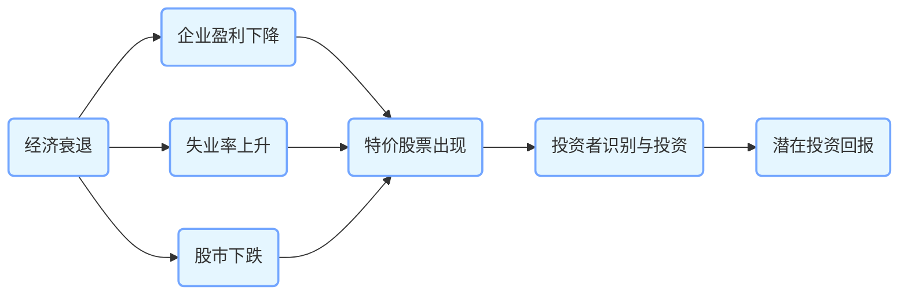

# 如何利用特价股票投资应对经济衰退风险

> 关键词：特价股票、经济衰退、投资策略、风险应对、股票估值、财务分析、市场趋势

> 摘要：本文围绕如何利用特价股票投资来应对经济衰退风险展开。在经济衰退背景下，市场波动加剧，投资者面临诸多挑战。特价股票因其被低估的特性，为投资者提供了潜在的投资机会。文章首先介绍相关背景知识，包括目的范围、预期读者等；接着阐述核心概念与联系，明晰特价股票的定义与经济衰退的关联；然后深入探讨核心算法原理与操作步骤，通过Python代码进行详细阐释；还介绍了相关数学模型和公式，并举例说明；通过项目实战给出代码实际案例及解释；分析实际应用场景；推荐学习资源、开发工具框架和相关论文著作；最后总结未来发展趋势与挑战，提供常见问题解答和扩展阅读参考资料，旨在为投资者提供全面、系统的利用特价股票应对经济衰退风险的投资指导。

## 1. 背景介绍 
### 1.1 目的和范围
在经济发展的周期中，经济衰退是不可避免的阶段。经济衰退往往伴随着企业盈利下降、市场信心受挫、股价大幅波动等问题，给投资者带来巨大的风险。然而，危机中也蕴含着机遇，特价股票在经济衰退期间可能会出现，这些股票由于市场恐慌等因素被低估，但实际上具有一定的投资价值。本文的目的在于探讨如何识别和利用这些特价股票进行投资，以降低经济衰退对投资组合的影响，甚至实现资产的增值。

本文的范围涵盖了特价股票的基本概念、识别方法、投资策略，以及如何在经济衰退的大环境下运用这些知识进行投资决策。同时，还会结合实际案例和相关的技术分析，为投资者提供全面的指导。

### 1.2 预期读者
本文预期读者主要包括以下几类人群：
- 个人投资者：希望在经济衰退期间优化投资组合，降低风险并寻找投资机会的普通股民。
- 金融从业者：如股票分析师、投资顾问等，需要深入了解特价股票投资策略，为客户提供专业建议。
- 金融专业学生：对股票投资和经济周期理论感兴趣，希望通过本文学习相关知识和实践方法。

### 1.3 文档结构概述
本文将按照以下结构进行阐述：
- 核心概念与联系：介绍特价股票、经济衰退等核心概念，以及它们之间的内在联系。
- 核心算法原理 & 具体操作步骤：通过Python代码详细讲解如何筛选特价股票。
- 数学模型和公式 & 详细讲解 & 举例说明：介绍相关的数学模型和公式，如估值模型，并举例说明其应用。
- 项目实战：代码实际案例和详细解释说明，包括开发环境搭建、源代码实现和代码解读。
- 实际应用场景：分析在不同经济衰退阶段如何运用特价股票投资策略。
- 工具和资源推荐：推荐学习资源、开发工具框架和相关论文著作。
- 总结：未来发展趋势与挑战：总结利用特价股票投资应对经济衰退风险的要点，探讨未来发展趋势和面临的挑战。
- 附录：常见问题与解答：解答读者在阅读和实践过程中可能遇到的问题。
- 扩展阅读 & 参考资料：提供相关的扩展阅读内容和参考资料，方便读者深入学习。

### 1.4 术语表
#### 1.4.1 核心术语定义
- 特价股票：指市场价格低于其内在价值的股票，通常由于市场短期的负面情绪、行业困境或公司暂时的经营问题等因素导致股价被低估。
- 经济衰退：指经济活动普遍放缓、国民收入减少、失业率上升的阶段，通常表现为国内生产总值（GDP）连续两个季度或以上出现负增长。
- 内在价值：指股票所代表的企业的真实价值，是基于企业的财务状况、盈利能力、发展前景等因素综合评估得出的价值。
- 市盈率（P/E）：指股票价格与每股盈利的比率，反映了投资者为获取公司每一元盈利所愿意支付的价格。
- 市净率（P/B）：指股票价格与每股净资产的比率，用于衡量股票的估值水平，反映了市场对公司净资产的定价。

#### 1.4.2 相关概念解释
- 价值投资：一种投资策略，强调通过分析股票的内在价值，寻找被低估的股票进行投资，以获取长期的投资回报。
- 基本面分析：通过研究公司的财务报表、行业前景、宏观经济环境等因素，评估公司的内在价值和投资价值。
- 技术分析：通过研究股票价格和成交量的历史数据，运用各种技术指标和图表形态，预测股票价格的未来走势。

#### 1.4.3 缩略词列表
- GDP：国内生产总值（Gross Domestic Product）
- P/E：市盈率（Price-to-Earnings Ratio）
- P/B：市净率（Price-to-Book Ratio）

## 2. 核心概念与联系 

### 特价股票的定义与特征
特价股票是指那些市场价格明显低于其内在价值的股票。其特征主要包括以下几点：
- 低估值指标：市盈率、市净率等估值指标通常低于同行业平均水平。
- 市场忽视：由于公司规模较小、所处行业不热门或近期出现负面事件等原因，被市场投资者忽视。
- 潜在价值：公司具有一定的竞争优势、良好的财务状况或发展前景，但由于短期因素导致股价被低估。

### 经济衰退的影响与特征
经济衰退期间，宏观经济环境恶化，主要表现为以下几个方面：
- 企业盈利下降：由于市场需求减少、成本上升等原因，企业的盈利能力受到影响，导致净利润下降。
- 失业率上升：企业为了降低成本，可能会裁员，导致失业率上升，消费者信心下降。
- 股市下跌：投资者对经济前景的担忧导致股市整体下跌，股票价格普遍下降。

### 特价股票与经济衰退的联系
在经济衰退期间，市场情绪通常较为悲观，投资者对股票的估值也会更加谨慎。这使得许多股票的价格被过度低估，出现了更多的特价股票。同时，经济衰退也为投资者提供了以较低价格买入优质股票的机会。如果投资者能够准确识别这些特价股票，并在经济衰退后期或复苏阶段持有，有望获得较高的投资回报。

### 核心概念原理和架构的文本示意图
```plaintext
经济衰退
|
|-- 企业盈利下降
|-- 失业率上升
|-- 股市下跌
|
|-- 特价股票出现（低估值、被忽视、潜在价值）
|
|-- 投资者识别与投资（价值投资、基本面分析）
|
|-- 潜在投资回报
```

### Mermaid 流程图


## 3. 核心算法原理 & 具体操作步骤 

### 核心算法原理
筛选特价股票的核心算法主要基于基本面分析，通过评估股票的估值指标、财务状况和发展前景等因素，寻找被低估的股票。常用的方法包括以下几个步骤：
1. **数据收集**：收集股票的财务数据、市场数据和行业数据等。
2. **估值计算**：计算股票的市盈率、市净率、股息率等估值指标。
3. **财务分析**：分析公司的盈利能力、偿债能力、营运能力等财务指标。
4. **比较筛选**：将股票的估值指标和财务指标与同行业平均水平进行比较，筛选出被低估的股票。

### 具体操作步骤及 Python 代码实现

#### 数据收集
我们可以使用 `pandas-datareader` 库来收集股票的财务数据和市场数据。以下是一个简单的示例代码：
```python
import pandas as pd
import pandas_datareader.data as web
import datetime

# 定义股票代码和时间范围
stock_symbol = 'AAPL'
start_date = datetime.datetime(2020, 1, 1)
end_date = datetime.datetime(2023, 12, 31)

# 收集股票的历史价格数据
stock_data = web.DataReader(stock_symbol, 'yahoo', start_date, end_date)

# 打印数据
print(stock_data.head())
```
#### 估值计算
计算股票的市盈率和市净率。市盈率可以通过股票价格除以每股盈利（EPS）得到，市净率可以通过股票价格除以每股净资产（BVPS）得到。以下是示例代码：
```python
# 假设我们已经获取了每股盈利和每股净资产数据
eps = 5.0
bvps = 20.0

# 获取最新的股票价格
latest_price = stock_data['Close'].iloc[-1]

# 计算市盈率和市净率
pe_ratio = latest_price / eps
pb_ratio = latest_price / bvps

# 打印结果
print(f"市盈率: {pe_ratio}")
print(f"市净率: {pb_ratio}")
```
#### 财务分析
分析公司的盈利能力、偿债能力和营运能力等财务指标。以下是一个简单的示例代码：
```python
# 假设我们已经获取了公司的财务数据
net_income = 1000000000  # 净利润
total_assets = 5000000000  # 总资产
total_liabilities = 2000000000  # 总负债
revenue = 2000000000  # 营业收入
inventory = 500000000  # 存货

# 计算盈利能力指标：净资产收益率（ROE）
equity = total_assets - total_liabilities
roe = net_income / equity

# 计算偿债能力指标：资产负债率
debt_ratio = total_liabilities / total_assets

# 计算营运能力指标：存货周转率
inventory_turnover = revenue / inventory

# 打印结果
print(f"净资产收益率: {roe}")
print(f"资产负债率: {debt_ratio}")
print(f"存货周转率: {inventory_turnover}")
```
#### 比较筛选
将股票的估值指标和财务指标与同行业平均水平进行比较，筛选出被低估的股票。以下是一个简单的示例代码：
```python
# 假设同行业平均市盈率为 20，平均市净率为 3
industry_pe_avg = 20
industry_pb_avg = 3

# 筛选被低估的股票
if pe_ratio < industry_pe_avg and pb_ratio < industry_pb_avg:
    print(f"{stock_symbol} 是被低估的股票")
else:
    print(f"{stock_symbol} 不是被低估的股票")
```

## 4. 数学模型和公式 & 详细讲解 & 举例说明 

### 市盈率（P/E）模型
市盈率是最常用的估值指标之一，其计算公式为：
$$P/E = \frac{股票价格}{每股盈利}$$
市盈率反映了投资者为获取公司每一元盈利所愿意支付的价格。一般来说，市盈率越低，股票越被低估。

例如，某股票的价格为 50 元，每股盈利为 5 元，则其市盈率为：
$$P/E = \frac{50}{5} = 10$$
如果同行业平均市盈率为 15，则该股票可能被低估。

### 市净率（P/B）模型
市净率是另一个重要的估值指标，其计算公式为：
$$P/B = \frac{股票价格}{每股净资产}$$
市净率反映了市场对公司净资产的定价。一般来说，市净率越低，股票越被低估。

例如，某股票的价格为 30 元，每股净资产为 10 元，则其市净率为：
$$P/B = \frac{30}{10} = 3$$
如果同行业平均市净率为 4，则该股票可能被低估。

### 股息折现模型（DDM）
股息折现模型是一种基于股票未来股息现金流的估值模型，其基本公式为：
$$V = \sum_{t=1}^{\infty} \frac{D_t}{(1 + r)^t}$$
其中，$V$ 为股票的内在价值，$D_t$ 为第 $t$ 期的股息，$r$ 为折现率。

例如，假设某股票每年的股息为 2 元，折现率为 10%，则该股票的内在价值为：
$$V = \frac{2}{0.1} = 20$$
如果该股票的市场价格低于 20 元，则可能被低估。

### 自由现金流折现模型（DCF）
自由现金流折现模型是一种基于公司未来自由现金流的估值模型，其基本公式为：
$$V = \sum_{t=1}^{n} \frac{FCF_t}{(1 + WACC)^t} + \frac{TV}{(1 + WACC)^n}$$
其中，$V$ 为公司的内在价值，$FCF_t$ 为第 $t$ 期的自由现金流，$WACC$ 为加权平均资本成本，$TV$ 为终值。

例如，假设某公司未来 5 年的自由现金流分别为 100 万元、120 万元、140 万元、160 万元、180 万元，加权平均资本成本为 10%，终值为 2000 万元，则该公司的内在价值为：
$$V = \frac{100}{(1 + 0.1)^1} + \frac{120}{(1 + 0.1)^2} + \frac{140}{(1 + 0.1)^3} + \frac{160}{(1 + 0.1)^4} + \frac{180}{(1 + 0.1)^5} + \frac{2000}{(1 + 0.1)^5} \approx 1787.5$$
如果该公司的市场价值低于 1787.5 万元，则可能被低估。

## 5. 项目实战：代码实际案例和详细解释说明 

### 5.1  开发环境搭建
#### 安装 Python
首先，你需要安装 Python 开发环境。可以从 Python 官方网站（https://www.python.org/downloads/） 下载适合你操作系统的 Python 安装包，并按照安装向导进行安装。

#### 安装必要的库
在安装好 Python 后，你需要安装一些必要的库，如 `pandas`、`pandas-datareader`、`matplotlib` 等。可以使用以下命令进行安装：
```sh
pip install pandas pandas-datareader matplotlib
```

### 5.2  源代码详细实现和代码解读
以下是一个完整的示例代码，用于筛选特价股票：
```python
import pandas as pd
import pandas_datareader.data as web
import datetime
import matplotlib.pyplot as plt

# 定义股票代码列表
stock_symbols = ['AAPL', 'MSFT', 'GOOG']

# 定义时间范围
start_date = datetime.datetime(2020, 1, 1)
end_date = datetime.datetime(2023, 12, 31)

# 存储股票数据和估值指标的字典
stock_data_dict = {}

# 收集股票数据并计算估值指标
for symbol in stock_symbols:
    try:
        # 收集股票的历史价格数据
        stock_data = web.DataReader(symbol, 'yahoo', start_date, end_date)
        
        # 假设我们已经获取了每股盈利和每股净资产数据
        eps = 5.0
        bvps = 20.0
        
        # 获取最新的股票价格
        latest_price = stock_data['Close'].iloc[-1]
        
        # 计算市盈率和市净率
        pe_ratio = latest_price / eps
        pb_ratio = latest_price / bvps
        
        # 存储股票数据和估值指标
        stock_data_dict[symbol] = {
            'data': stock_data,
            'pe_ratio': pe_ratio,
            'pb_ratio': pb_ratio
        }
        
        print(f"{symbol} 市盈率: {pe_ratio}, 市净率: {pb_ratio}")
    except Exception as e:
        print(f"获取 {symbol} 数据时出错: {e}")

# 绘制股票价格走势图
for symbol, data in stock_data_dict.items():
    plt.plot(data['data']['Close'], label=symbol)

plt.title('股票价格走势图')
plt.xlabel('日期')
plt.ylabel('价格')
plt.legend()
plt.show()

# 筛选被低估的股票
industry_pe_avg = 20
industry_pb_avg = 3

undervalued_stocks = []
for symbol, data in stock_data_dict.items():
    if data['pe_ratio'] < industry_pe_avg and data['pb_ratio'] < industry_pb_avg:
        undervalued_stocks.append(symbol)

print("被低估的股票:", undervalued_stocks)
```
### 5.3  代码解读与分析
- **数据收集**：使用 `pandas-datareader` 库从雅虎财经收集股票的历史价格数据。
- **估值计算**：计算股票的市盈率和市净率，评估股票的估值水平。
- **可视化**：使用 `matplotlib` 库绘制股票价格走势图，直观展示股票价格的变化趋势。
- **筛选**：将股票的市盈率和市净率与同行业平均水平进行比较，筛选出被低估的股票。

## 6. 实际应用场景 
### 经济衰退初期
在经济衰退初期，市场通常会出现恐慌情绪，股票价格普遍下跌。此时，投资者可以开始关注那些具有稳定现金流、低负债、良好品牌和市场地位的公司。这些公司的股票可能会因为市场整体下跌而被低估，成为特价股票。投资者可以通过基本面分析，筛选出这些被低估的股票，并逐步建仓。

### 经济衰退中期
在经济衰退中期，企业的盈利状况可能会进一步恶化，市场信心仍然低迷。此时，投资者需要更加谨慎地选择投资标的。可以关注那些受经济衰退影响较小的行业，如必需消费品、公用事业等。这些行业的公司通常具有稳定的需求和现金流，其股票的抗风险能力较强。同时，投资者还可以关注那些具有创新能力和发展潜力的公司，这些公司在经济衰退结束后可能会迎来快速发展。

### 经济衰退后期
在经济衰退后期，经济开始逐渐复苏，市场信心也会逐渐恢复。此时，之前被低估的特价股票可能会迎来价值回归，股价开始上涨。投资者可以继续持有这些股票，享受股价上涨带来的收益。同时，也可以根据市场情况，适时调整投资组合，增加对成长型股票的投资。

## 7. 工具和资源推荐
### 7.1 学习资源推荐
#### 7.1.1 书籍推荐
- 《聪明的投资者》（The Intelligent Investor）：本杰明·格雷厄姆（Benjamin Graham）著，被誉为价值投资的圣经，介绍了价值投资的基本理念和方法。
- 《证券分析》（Security Analysis）：本杰明·格雷厄姆和大卫·多德（David Dodd）著，是价值投资领域的经典著作，详细阐述了股票估值和基本面分析的方法。
- 《巴菲特致股东的信》（Letters to Shareholders of Berkshire Hathaway）：沃伦·巴菲特（Warren Buffett）著，收录了巴菲特历年致股东的信，展示了他的投资理念和决策过程。

#### 7.1.2 在线课程
- Coursera 上的“投资学原理”（Principles of Investing）课程：由宾夕法尼亚大学的教授授课，介绍了投资的基本原理和方法。
- edX 上的“金融市场”（Financial Markets）课程：由耶鲁大学的教授授课，涵盖了金融市场的各个方面，包括股票投资。
- 中国大学 MOOC 上的“证券投资学”课程：由国内知名高校的教授授课，系统介绍了证券投资的理论和实践。

#### 7.1.3 技术博客和网站
- Seeking Alpha：提供股票分析、投资策略和市场评论等内容，是投资者获取信息和交流的重要平台。
- Motley Fool：提供投资建议、股票分析和市场新闻等内容，帮助投资者做出明智的投资决策。
- 雪球：国内知名的投资社区，提供股票行情、分析和讨论等功能，投资者可以在这里交流投资经验和心得。

### 7.2 开发工具框架推荐
#### 7.2.1 IDE和编辑器
- PyCharm：一款专业的 Python 集成开发环境，提供代码编辑、调试、版本控制等功能，适合开发复杂的 Python 程序。
- Visual Studio Code：一款轻量级的代码编辑器，支持多种编程语言，具有丰富的插件生态系统，适合快速开发和调试 Python 代码。

#### 7.2.2 调试和性能分析工具
- PDB：Python 内置的调试器，可以帮助开发者定位和解决代码中的问题。
- cProfile：Python 内置的性能分析工具，可以分析代码的执行时间和性能瓶颈。

#### 7.2.3 相关框架和库
- pandas：一个强大的数据分析库，提供了数据结构和数据分析工具，方便处理和分析股票数据。
- pandas-datareader：一个用于从网络数据源收集金融数据的库，支持雅虎财经、谷歌财经等多个数据源。
- matplotlib：一个用于绘制图表和可视化数据的库，可以直观展示股票价格的变化趋势。

### 7.3 相关论文著作推荐
#### 7.3.1 经典论文
- Eugene F. Fama 和 Kenneth R. French 的“Common Risk Factors in the Returns on Stocks and Bonds”：提出了著名的三因子模型，用于解释股票和债券的收益率。
- Harry Markowitz 的“Portfolio Selection”：奠定了现代投资组合理论的基础，提出了均值 - 方差模型，用于优化投资组合。

#### 7.3.2 最新研究成果
- 关注顶尖金融学术期刊，如《Journal of Finance》、《Review of Financial Studies》等，了解关于股票投资和经济周期的最新研究成果。

#### 7.3.3 应用案例分析
- 可以参考一些知名投资机构的研究报告和案例分析，了解他们在经济衰退期间的投资策略和实践经验。

## 8. 总结：未来发展趋势与挑战
### 未来发展趋势
- **科技赋能投资决策**：随着人工智能、大数据、机器学习等技术的不断发展，投资者将能够利用更先进的技术手段进行股票分析和投资决策。例如，通过机器学习算法可以对海量的财务数据和市场数据进行分析，挖掘出潜在的投资机会。
- **可持续投资兴起**：越来越多的投资者开始关注企业的社会责任和可持续发展能力，将环境、社会和治理（ESG）因素纳入投资决策中。在经济衰退期间，具有良好 ESG 表现的企业可能更具抗风险能力，其股票也可能更受投资者青睐。
- **全球投资趋势加强**：随着全球经济一体化的不断推进，投资者的投资范围将越来越广泛。在经济衰退期间，不同国家和地区的经济周期可能存在差异，投资者可以通过全球资产配置来降低风险，寻找更多的投资机会。

### 挑战
- **市场不确定性增加**：经济衰退期间，市场的不确定性增加，股票价格波动剧烈。投资者很难准确预测市场走势和企业的盈利状况，增加了投资决策的难度。
- **信息过载**：在信息时代，投资者面临着海量的信息。如何从众多的信息中筛选出有价值的信息，并做出正确的投资决策，是投资者面临的一大挑战。
- **宏观经济政策变化**：政府在经济衰退期间可能会出台各种宏观经济政策，如货币政策、财政政策等。这些政策的变化可能会对股票市场产生重大影响，投资者需要密切关注政策变化，及时调整投资策略。

## 9. 附录：常见问题与解答
### 如何确定股票的内在价值？
确定股票的内在价值需要综合考虑多个因素，如公司的财务状况、盈利能力、发展前景、行业竞争等。常用的方法包括市盈率模型、市净率模型、股息折现模型、自由现金流折现模型等。这些模型都有其局限性，投资者需要结合多种方法进行评估。

### 经济衰退期间投资特价股票一定能赚钱吗？
不一定。虽然特价股票在经济衰退期间可能被低估，但市场的不确定性较大，股票价格可能会继续下跌。此外，公司的基本面也可能发生变化，如果公司的经营状况恶化，其股票的价值也会下降。因此，投资者在投资特价股票时，需要充分考虑风险，并进行合理的资产配置。

### 如何选择适合自己的投资策略？
投资者需要根据自己的投资目标、风险承受能力、投资经验等因素选择适合自己的投资策略。如果投资者的风险承受能力较低，可以选择稳健的投资策略，如价值投资；如果投资者的风险承受能力较高，可以选择激进的投资策略，如成长投资。同时，投资者还需要根据市场情况和经济周期的变化，适时调整投资策略。

## 10. 扩展阅读 & 参考资料
### 扩展阅读
- 《金融炼金术》（The Alchemy of Finance）：乔治·索罗斯（George Soros）著，介绍了他的投资哲学和实践经验。
- 《黑天鹅》（The Black Swan）：纳西姆·尼古拉斯·塔勒布（Nassim Nicholas Taleb）著，探讨了不可预测的重大事件对金融市场的影响。

### 参考资料
- 雅虎财经（https://finance.yahoo.com/）：提供股票行情、财务数据、新闻等信息。
- 中国证券监督管理委员会（https://www.csrc.gov.cn/）：提供证券市场的监管政策、法规和信息。
- 国际货币基金组织（https://www.imf.org/）：提供全球经济数据和分析报告。