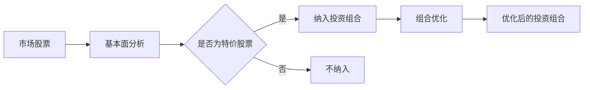

# 如何利用特价股票策略进行组合优化

> 关键词：特价股票策略、组合优化、投资组合、股票估值、风险控制

> 摘要：本文聚焦于如何利用特价股票策略进行投资组合的优化。首先介绍了相关背景知识，包括目的范围、预期读者等内容。接着阐述了特价股票策略及组合优化的核心概念与联系，详细讲解了核心算法原理和具体操作步骤，通过数学模型和公式进行深入剖析并举例说明。在项目实战部分，给出了开发环境搭建、源代码实现与解读。还探讨了该策略的实际应用场景，推荐了相关工具和资源，最后总结了未来发展趋势与挑战，提供常见问题解答和扩展阅读参考资料，旨在为投资者提供全面且深入的指导，帮助其更好地运用特价股票策略优化投资组合，实现投资目标。

## 1. 背景介绍 
### 1.1 目的和范围
本文章的主要目的在于深入探讨利用特价股票策略进行组合优化的方法和技术，为投资者提供全面且具有可操作性的指导。范围涵盖了特价股票策略的基本概念、核心算法原理、数学模型、实际应用案例以及相关工具和资源推荐等方面。通过对这些内容的详细阐述，帮助投资者理解如何筛选特价股票并将其合理地纳入投资组合中，以实现投资组合的优化，提高投资收益并降低风险。

### 1.2 预期读者
本文预期读者主要包括对股票投资有一定兴趣和基础的个人投资者，希望通过学习特价股票策略来优化自己的投资组合；金融专业的学生和研究人员，他们可以将本文作为学习和研究股票投资策略的参考资料；以及金融机构的投资顾问和分析师，他们可以从中获取新的思路和方法，为客户提供更优质的投资建议。

### 1.3 文档结构概述
本文将按照以下结构进行组织：首先介绍背景知识，包括目的范围、预期读者和文档结构概述等内容；接着阐述特价股票策略及组合优化的核心概念与联系，通过文本示意图和 Mermaid 流程图进行直观展示；然后详细讲解核心算法原理和具体操作步骤，结合 Python 源代码进行说明；再通过数学模型和公式进行深入剖析并举例说明；在项目实战部分，给出开发环境搭建、源代码实现与解读；之后探讨该策略的实际应用场景；推荐相关工具和资源；最后总结未来发展趋势与挑战，提供常见问题解答和扩展阅读参考资料。

### 1.4 术语表
#### 1.4.1 核心术语定义
- **特价股票**：指市场价格低于其内在价值的股票。内在价值是基于公司的基本面分析，如财务状况、盈利能力、行业前景等因素评估得出的股票真实价值。
- **组合优化**：通过合理配置不同资产（如股票、债券等），在一定的风险水平下实现投资组合的预期收益最大化，或在一定的预期收益目标下使投资组合的风险最小化。
- **投资组合**：由多种资产构成的集合，投资者通过持有不同的资产来分散风险和实现投资目标。
- **股票估值**：对股票的内在价值进行评估的过程，常用的估值方法包括市盈率法、市净率法、现金流折现法等。
- **风险控制**：通过各种方法和手段来降低投资过程中面临的风险，如分散投资、设置止损点等。

#### 1.4.2 相关概念解释
- **基本面分析**：通过研究公司的财务报表、经营状况、行业竞争等基本面因素，来评估公司的内在价值和发展前景，从而判断股票的投资价值。
- **技术分析**：通过研究股票的价格走势、成交量等市场数据，来预测股票未来的价格走势，主要依据是历史会重演和市场行为包容消化一切信息的假设。
- **资产配置**：指投资者将资金分配到不同资产类别（如股票、债券、现金等）的过程，以实现投资组合的多元化和风险分散。

#### 1.4.3 缩略词列表
- **P/E**：市盈率（Price-to-Earnings Ratio），是股票价格与每股收益的比值，用于衡量股票的估值水平。
- **P/B**：市净率（Price-to-Book Ratio），是股票价格与每股净资产的比值，反映了股票的市场价值与账面价值的关系。
- **DCF**：现金流折现法（Discounted Cash Flow），是一种通过预测公司未来的现金流并将其折现到当前的估值方法。

## 2. 核心概念与联系 
### 核心概念原理
特价股票策略的核心原理是基于市场的非有效性。在市场中，由于各种因素的影响，如投资者情绪、信息不对称等，股票价格可能会偏离其内在价值。特价股票就是那些价格被低估的股票，其内在价值高于市场价格。投资者通过深入的基本面分析，筛选出这些特价股票，并将其纳入投资组合中，以期在未来股票价格回归内在价值的过程中获得超额收益。

组合优化的原理是基于现代投资组合理论。该理论认为，通过分散投资可以降低非系统性风险，而系统性风险则无法通过分散投资来消除。组合优化的目标是在一定的风险水平下实现投资组合的预期收益最大化，或在一定的预期收益目标下使投资组合的风险最小化。投资者可以通过合理配置不同的资产，如股票、债券、现金等，来实现投资组合的优化。

### 文本示意图
```plaintext
特价股票策略 -- 筛选特价股票（基于基本面分析） --> 投资组合 -- 组合优化（基于现代投资组合理论） --> 优化后的投资组合
```

### Mermaid 流程图


## 3. 核心算法原理 & 具体操作步骤 
### 核心算法原理
我们可以使用多因素模型来筛选特价股票。多因素模型认为，股票的收益率受到多个因素的影响，如公司的财务指标、行业因素、市场因素等。我们可以通过构建一个多因素模型，来评估股票的内在价值，并筛选出价格被低估的股票。

具体来说，我们可以使用以下步骤来构建多因素模型：
1. **选择因素**：选择与股票收益率相关的因素，如市盈率、市净率、净资产收益率、营业收入增长率等。
2. **收集数据**：收集所选因素的历史数据和股票的历史收益率数据。
3. **回归分析**：使用回归分析方法，建立因素与股票收益率之间的关系模型。
4. **预测收益率**：使用建立的模型，预测股票的未来收益率。
5. **筛选特价股票**：根据预测的收益率和股票的市场价格，筛选出价格被低估的股票。

### 具体操作步骤
以下是使用 Python 实现多因素模型筛选特价股票的具体代码：

```python
import pandas as pd
import numpy as np
from sklearn.linear_model import LinearRegression

# 1. 选择因素和收集数据
# 假设我们有一个包含股票代码、市盈率、市净率、净资产收益率、营业收入增长率和股票收益率的数据集
data = pd.read_csv('stock_data.csv')

# 提取因素和收益率数据
X = data[['pe_ratio', 'pb_ratio', 'roe', 'revenue_growth']]
y = data['stock_return']

# 2. 回归分析
model = LinearRegression()
model.fit(X, y)

# 3. 预测收益率
# 假设我们有一个新的数据集，包含待评估股票的因素数据
new_data = pd.read_csv('new_stock_data.csv')
new_X = new_data[['pe_ratio', 'pb_ratio', 'roe', 'revenue_growth']]
predicted_returns = model.predict(new_X)

# 4. 筛选特价股票
# 计算股票的预期价格
# 假设当前股票价格存储在 new_data 的 'stock_price' 列中
new_data['expected_price'] = new_data['stock_price'] * (1 + predicted_returns)

# 筛选出预期价格高于当前价格的股票
bargain_stocks = new_data[new_data['expected_price'] > new_data['stock_price']]

print(bargain_stocks)
```

### 代码解释
1. **数据读取**：使用 `pandas` 库读取包含股票因素数据和收益率数据的 CSV 文件。
2. **回归分析**：使用 `sklearn` 库中的 `LinearRegression` 类进行线性回归分析，建立因素与股票收益率之间的关系模型。
3. **预测收益率**：使用建立的模型，对新的股票因素数据进行预测，得到预测的收益率。
4. **筛选特价股票**：根据预测的收益率和当前股票价格，计算股票的预期价格，并筛选出预期价格高于当前价格的股票，即特价股票。

## 4. 数学模型和公式 & 详细讲解 & 举例说明 
### 数学模型
多因素模型的数学表达式可以表示为：

$$R_i = \alpha + \beta_1F_1 + \beta_2F_2 + \cdots + \beta_nF_n + \epsilon_i$$

其中，$R_i$ 表示第 $i$ 只股票的收益率，$\alpha$ 表示截距项，$\beta_j$ 表示第 $j$ 个因素的系数，$F_j$ 表示第 $j$ 个因素，$\epsilon_i$ 表示随机误差项。

### 详细讲解
- **截距项 $\alpha$**：表示当所有因素都为 0 时，股票的预期收益率。在实际应用中，截距项可能没有实际的经济意义，但它可以调整模型的拟合效果。
- **因素系数 $\beta_j$**：表示第 $j$ 个因素对股票收益率的影响程度。正的系数表示该因素与股票收益率正相关，负的系数表示该因素与股票收益率负相关。
- **随机误差项 $\epsilon_i$**：表示无法被因素解释的股票收益率的变化，通常假设其服从均值为 0 的正态分布。

### 举例说明
假设我们选择市盈率（$F_1$）、市净率（$F_2$）和净资产收益率（$F_3$）作为因素，通过回归分析得到以下模型：

$$R_i = 0.05 + 0.01F_1 - 0.02F_2 + 0.03F_3 + \epsilon_i$$

对于一只股票，其市盈率为 10，市净率为 2，净资产收益率为 15%，则该股票的预测收益率为：

$$R_i = 0.05 + 0.01\times10 - 0.02\times2 + 0.03\times15 + \epsilon_i = 0.05 + 0.1 - 0.04 + 0.45 + \epsilon_i = 0.56 + \epsilon_i$$

假设当前股票价格为 100 元，则该股票的预期价格为：

$$P_{expected} = 100\times(1 + 0.56) = 156$$

如果当前股票价格低于 156 元，则该股票可能是一只特价股票。

## 5. 项目实战：代码实际案例和详细解释说明 
### 5.1  开发环境搭建
在进行项目实战之前，我们需要搭建相应的开发环境。以下是具体的步骤：
1. **安装 Python**：从 Python 官方网站（https://www.python.org/downloads/）下载并安装 Python 3.x 版本。
2. **安装必要的库**：使用 `pip` 命令安装所需的库，包括 `pandas`、`numpy`、`sklearn` 等。
```bash
pip install pandas numpy scikit-learn
```
3. **准备数据**：收集包含股票因素数据和收益率数据的 CSV 文件，以及待评估股票的因素数据文件。

### 5.2  源代码详细实现和代码解读
以下是一个完整的 Python 代码示例，用于实现利用特价股票策略进行组合优化：

```python
import pandas as pd
import numpy as np
from sklearn.linear_model import LinearRegression
from sklearn.model_selection import train_test_split
from sklearn.metrics import mean_squared_error

# 1. 数据读取和预处理
# 读取训练数据
train_data = pd.read_csv('train_stock_data.csv')

# 提取因素和收益率数据
X_train = train_data[['pe_ratio', 'pb_ratio', 'roe', 'revenue_growth']]
y_train = train_data['stock_return']

# 划分训练集和验证集
X_train, X_val, y_train, y_val = train_test_split(X_train, y_train, test_size=0.2, random_state=42)

# 2. 模型训练
model = LinearRegression()
model.fit(X_train, y_train)

# 3. 模型评估
y_pred_val = model.predict(X_val)
mse_val = mean_squared_error(y_val, y_pred_val)
print(f"验证集均方误差: {mse_val}")

# 4. 预测新股票的收益率
# 读取新股票数据
new_data = pd.read_csv('new_stock_data.csv')
new_X = new_data[['pe_ratio', 'pb_ratio', 'roe', 'revenue_growth']]
predicted_returns = model.predict(new_X)

# 5. 筛选特价股票
# 计算股票的预期价格
new_data['expected_price'] = new_data['stock_price'] * (1 + predicted_returns)

# 筛选出预期价格高于当前价格的股票
bargain_stocks = new_data[new_data['expected_price'] > new_data['stock_price']]

# 6. 组合优化
# 假设我们有一个初始投资组合，包含一定数量的资金
initial_portfolio_value = 100000

# 计算每只特价股票的投资比例
# 这里简单地采用等权重投资策略
num_bargain_stocks = len(bargain_stocks)
investment_ratio = 1 / num_bargain_stocks

# 计算每只特价股票的投资金额
bargain_stocks['investment_amount'] = initial_portfolio_value * investment_ratio

print(bargain_stocks)
```

### 5.3  代码解读与分析
1. **数据读取和预处理**：使用 `pandas` 库读取训练数据和新股票数据，并提取因素和收益率数据。使用 `train_test_split` 函数将训练数据划分为训练集和验证集，用于模型的训练和评估。
2. **模型训练**：使用 `LinearRegression` 类进行线性回归模型的训练，拟合因素与股票收益率之间的关系。
3. **模型评估**：使用验证集数据对训练好的模型进行评估，计算均方误差（MSE），评估模型的预测性能。
4. **预测新股票的收益率**：使用训练好的模型对新股票的因素数据进行预测，得到预测的收益率。
5. **筛选特价股票**：根据预测的收益率和当前股票价格，计算股票的预期价格，并筛选出预期价格高于当前价格的股票，即特价股票。
6. **组合优化**：假设我们有一个初始投资组合，采用等权重投资策略，将资金平均分配到每只特价股票上，计算每只股票的投资金额。

## 6. 实际应用场景 
### 个人投资者
个人投资者可以利用特价股票策略进行组合优化，实现资产的增值。通过筛选出价格被低估的股票，并将其合理地纳入投资组合中，个人投资者可以在一定程度上降低投资风险，提高投资收益。例如，一位个人投资者可以使用多因素模型筛选出几只特价股票，然后将资金分散投资到这些股票上，以实现投资组合的多元化和风险分散。

### 基金管理公司
基金管理公司可以将特价股票策略应用于基金的投资组合管理中。基金经理可以通过深入的基本面分析和多因素模型筛选出特价股票，并将其纳入基金的投资组合中，以提高基金的业绩表现。例如，一只价值型基金可以重点关注那些价格被低估的股票，通过投资这些股票来实现基金的价值投资目标。

### 金融机构的投资顾问
金融机构的投资顾问可以利用特价股票策略为客户提供投资建议。投资顾问可以根据客户的风险偏好和投资目标，筛选出适合客户的特价股票，并为客户制定合理的投资组合方案。例如，一位投资顾问可以为一位风险偏好较低的客户筛选出几只估值较低、业绩稳定的特价股票，并建议客户将部分资金投资到这些股票上，以实现资产的保值增值。

## 7. 工具和资源推荐
### 7.1 学习资源推荐
#### 7.1.1 书籍推荐
- 《聪明的投资者》（The Intelligent Investor）：本杰明·格雷厄姆（Benjamin Graham）著，被誉为投资领域的圣经，详细介绍了价值投资的理念和方法，对特价股票策略有重要的指导意义。
- 《证券分析》（Security Analysis）：本杰明·格雷厄姆和戴维·多德（David Dodd）著，是价值投资的经典著作，深入阐述了股票估值和投资分析的方法。
- 《漫步华尔街》（A Random Walk Down Wall Street）：伯顿·马尔基尔（Burton Malkiel）著，介绍了各种投资策略和市场理论，帮助读者了解股票市场的运行规律。

#### 7.1.2 在线课程
- Coursera 平台上的“投资学原理”（Principles of Investing）课程：由知名教授授课，系统介绍了投资学的基本原理和方法，包括股票投资、资产配置等内容。
- edX 平台上的“金融市场”（Financial Markets）课程：由耶鲁大学教授罗伯特·席勒（Robert Shiller）授课，深入探讨了金融市场的运行机制和投资策略。

#### 7.1.3 技术博客和网站
- 雪球网（https://xueqiu.com/）：国内知名的财经社区，提供股票行情、财经新闻、投资分析等内容，用户可以在上面交流投资经验和分享投资观点。
- 价值大师网（https://www.gurufocus.com/）：专注于价值投资的网站，提供股票估值、财务分析、投资策略等工具和资源，帮助投资者筛选特价股票。

### 7.2 开发工具框架推荐
#### 7.2.1 IDE和编辑器
- PyCharm：一款专业的 Python 集成开发环境，提供代码编辑、调试、版本控制等功能，适合开发 Python 项目。
- Jupyter Notebook：一种交互式的开发环境，支持 Python 代码的编写、运行和可视化，适合数据分析和机器学习项目的开发。

#### 7.2.2 调试和性能分析工具
- `pdb`：Python 内置的调试工具，可以帮助开发者调试 Python 代码，定位代码中的错误。
- `cProfile`：Python 内置的性能分析工具，可以分析 Python 代码的运行时间和性能瓶颈，帮助开发者优化代码性能。

#### 7.2.3 相关框架和库
- `pandas`：用于数据处理和分析的 Python 库，提供了高效的数据结构和数据操作方法，适合处理股票数据。
- `numpy`：用于科学计算的 Python 库，提供了高效的数组操作和数学函数，适合进行数值计算和矩阵运算。
- `sklearn`：用于机器学习的 Python 库，提供了丰富的机器学习算法和工具，适合构建多因素模型和进行回归分析。

### 7.3 相关论文著作推荐
#### 7.3.1 经典论文
- Fama, E. F., & French, K. R. (1992). The cross-section of expected stock returns. The Journal of Finance, 47(2), 427-465. 该论文提出了著名的 Fama-French 三因素模型，对股票收益率的影响因素进行了深入研究。
- Sharpe, W. F. (1964). Capital asset prices: A theory of market equilibrium under conditions of risk. The Journal of Finance, 19(3), 425-442. 该论文提出了资本资产定价模型（CAPM），为投资组合理论和资产定价提供了重要的理论基础。

#### 7.3.2 最新研究成果
- 在 SSRN（https://papers.ssrn.com/sol3/） 和 arXiv（https://arxiv.org/） 等学术论文平台上，可以搜索到关于股票投资策略和组合优化的最新研究成果。

#### 7.3.3 应用案例分析
- 在一些金融研究机构的网站和学术期刊上，可以找到关于特价股票策略和组合优化的应用案例分析，这些案例可以帮助读者更好地理解和应用相关策略。

## 8. 总结：未来发展趋势与挑战
### 未来发展趋势
- **数据驱动的决策**：随着大数据和人工智能技术的发展，投资者将越来越依赖数据来进行投资决策。通过收集和分析大量的股票数据、公司财务数据、行业数据等，投资者可以更准确地评估股票的内在价值，筛选出更优质的特价股票。
- **多策略融合**：单一的特价股票策略可能存在一定的局限性，未来投资者可能会将特价股票策略与其他投资策略，如动量策略、成长策略等进行融合，以实现更优化的投资组合。
- **量化投资的普及**：量化投资将越来越受到投资者的关注和应用。通过建立量化模型，投资者可以更系统、更科学地进行投资决策，提高投资效率和收益。

### 挑战
- **数据质量和可靠性**：数据是投资决策的基础，数据质量和可靠性直接影响投资决策的准确性。然而，股票市场数据存在噪声、缺失值等问题，如何获取高质量、可靠的数据是投资者面临的一个挑战。
- **模型的有效性和稳定性**：多因素模型等投资模型的有效性和稳定性受到多种因素的影响，如市场环境的变化、因素的选择和权重的确定等。如何构建有效的、稳定的投资模型是投资者需要解决的问题。
- **市场的不确定性**：股票市场是复杂多变的，受到宏观经济环境、政策变化、公司基本面等多种因素的影响。市场的不确定性增加了投资决策的难度，投资者需要具备较强的风险意识和应对能力。

## 9. 附录：常见问题与解答
### 问题 1：如何确定股票的内在价值？
答：确定股票的内在价值可以采用多种方法，如市盈率法、市净率法、现金流折现法等。市盈率法是通过比较股票的市盈率与行业平均市盈率来评估股票的估值水平；市净率法是通过比较股票的市净率与行业平均市净率来评估股票的估值水平；现金流折现法是通过预测公司未来的现金流并将其折现到当前来评估股票的内在价值。

### 问题 2：多因素模型中的因素如何选择？
答：多因素模型中的因素选择需要综合考虑多个方面。一般来说，可以选择与股票收益率相关的因素，如公司的财务指标（市盈率、市净率、净资产收益率等）、行业因素（行业增长率、行业竞争程度等）、市场因素（市场指数收益率等）。因素的选择需要根据具体的研究目的和数据情况进行调整。

### 问题 3：如何评估投资组合的风险？
答：评估投资组合的风险可以采用多种方法，如标准差、贝塔系数、夏普比率等。标准差是衡量投资组合收益率波动程度的指标，标准差越大，投资组合的风险越高；贝塔系数是衡量投资组合相对于市场的波动程度的指标，贝塔系数大于 1 表示投资组合的波动程度大于市场，贝塔系数小于 1 表示投资组合的波动程度小于市场；夏普比率是衡量投资组合每承担一单位风险所获得的超额收益的指标，夏普比率越高，投资组合的风险调整后收益越高。

### 问题 4：特价股票策略一定能获得超额收益吗？
答：特价股票策略并不能保证一定能获得超额收益。虽然特价股票的价格被低估，理论上有回归内在价值的趋势，但股票市场是复杂多变的，受到多种因素的影响，如宏观经济环境、政策变化、公司基本面等。在实际投资中，特价股票的价格可能不会如预期那样回归内在价值，甚至可能继续下跌。因此，投资者在使用特价股票策略时需要充分考虑市场风险，做好风险控制。

## 10. 扩展阅读 & 参考资料
### 扩展阅读
- 《财务报表分析与股票估值》（Financial Statement Analysis and Security Valuation）：斯蒂芬·佩因曼（Stephen Penman）著，详细介绍了财务报表分析和股票估值的方法和技巧，对理解股票的内在价值有重要的帮助。
- 《投资最重要的事》（The Most Important Thing Illuminated）：霍华德·马克斯（Howard Marks）著，分享了投资大师的投资经验和智慧，对投资者的投资理念和投资策略有重要的启示。

### 参考资料
- 相关股票数据来源：东方财富网（https://www.eastmoney.com/）、新浪财经（https://finance.sina.com.cn/）等。
- 金融学术期刊：《金融研究》、《管理世界》、《经济研究》等。